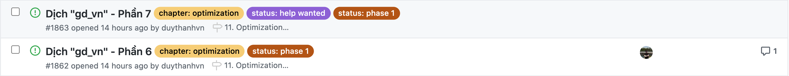
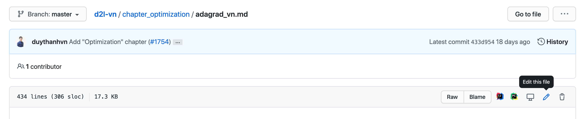
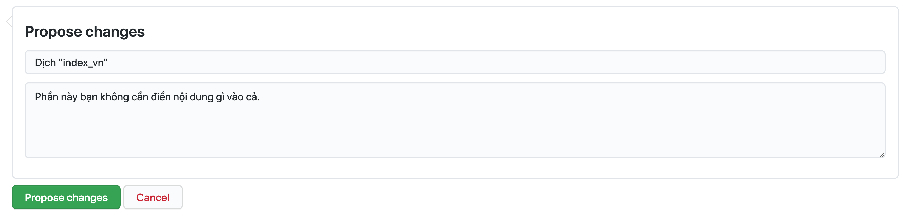
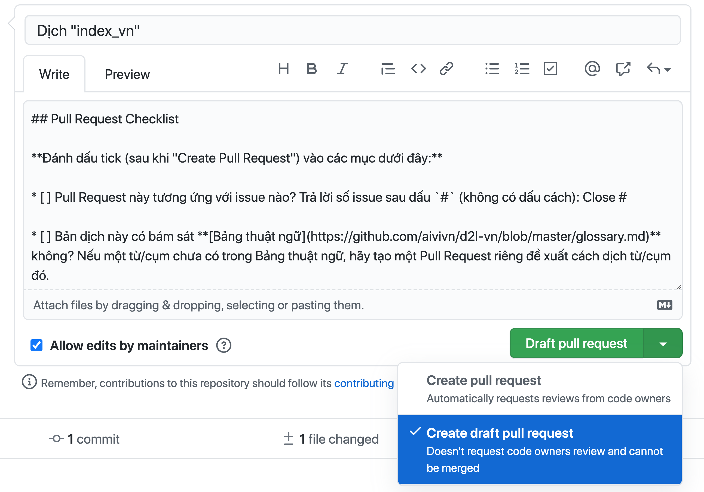
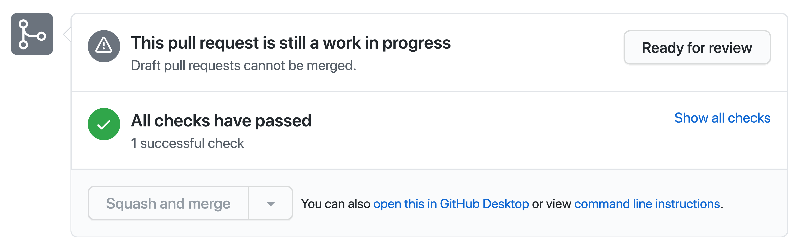
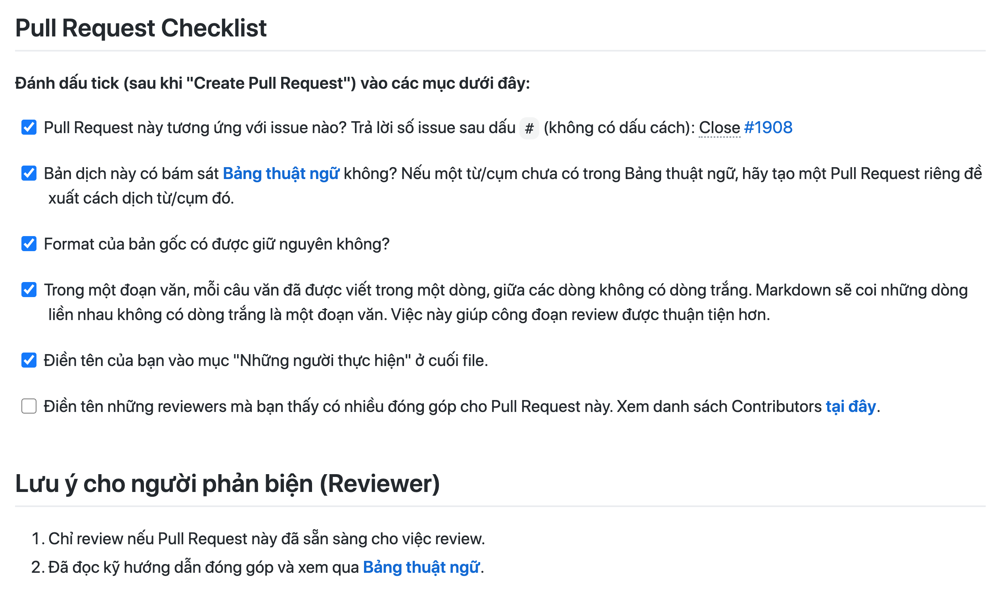
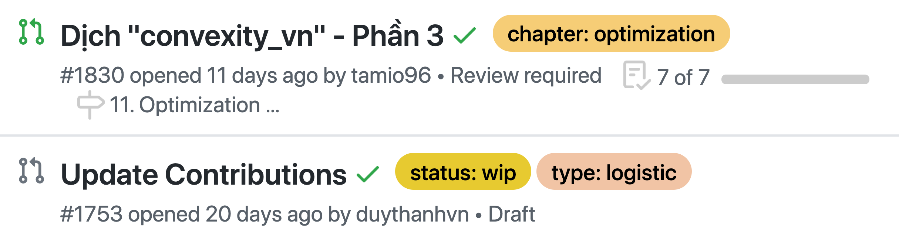
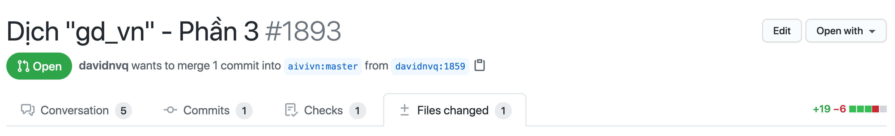
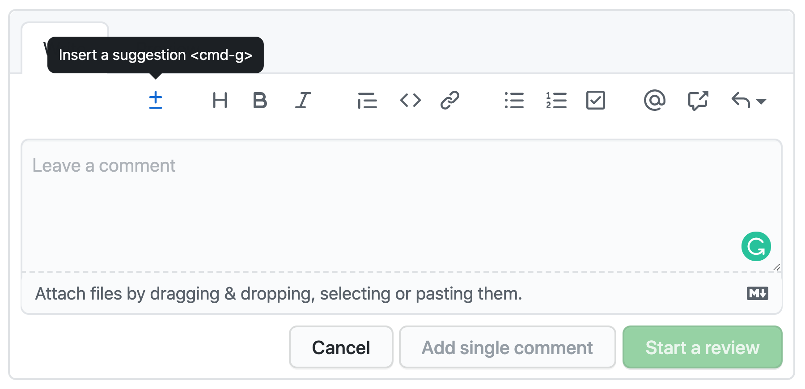
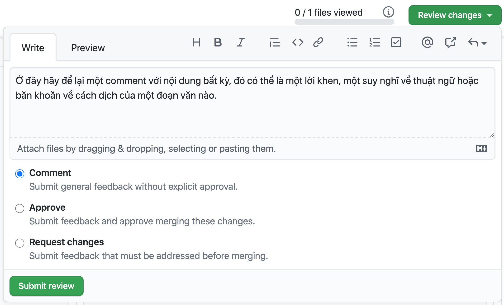

# Hướng dẫn Đóng góp cho Dự án

Cảm ơn bạn đã tham gia hỗ trợ dự án. Dưới đây là hướng dẫn chi tiết về cách mà bạn có thể đóng góp cho dự án, mời bạn xem kỹ nội dung này nhé.

## Tổng quan
Cuốn sách này được chia thành nhiều tập tin, mỗi tập tin như vậy chúng tôi tiến hành chia nhỏ ra thành từng phần nhằm giảm tải công việc lên từng cá nhân đóng góp, hỗ trợ cho việc dịch thuật và phản biện từng phần nội dung không lấy đi quá nhiều thời gian của một thành viên khi tham gia đóng góp.

Chúng tôi chia dự án dịch thuật này ra làm nhiều giai đoạn xử lý, trong đó phần nội dung dịch thuật có hai giai đoạn chính mà chúng tôi gán nhãn là `phase 1` và `phase 2` và bạn có thể gặp khi xem qua Github Issues của dự án.
* **Giai đoạn 1:** Giai đoạn này chúng tôi dịch nội dung thô lần đầu tiên, mục tiêu là đảm bảo rằng nội dung được dịch sát với bản gốc nhất về ngữ nghĩa và cách hiểu về nội dung.
* **Giai đoạn 2:** Ở giai đoạn tiếp theo, chúng tôi tiến hành hiệu đính lại nội dung; mục tiêu là trau chuốt hơn về ngôn từ, tính xuyên suốt của nội dung, cách diễn đạt và hành văn.

Với mỗi thành viên tham gia hiện tại, chúng tôi ưu tiên bạn bắt đầu với những phần ở giai đoạn 1 hơn. Với giai đoạn 2, chúng tôi sẽ có sự điều động riêng. 

**Tôi có thể đóng góp cho dự án này như thế nào?**
* Tham gia dịch thuật thông qua các Pull Request (Khuyến khích).
* Tham gia phản biện (review) các Pull Request.
* Hỗ trợ kỹ thuật.
* Sửa các lỗi chính tả trong bản thảo.
* Đề xuất chỉnh sửa về ngữ pháp, những điểm chưa nhất quán trong cách dịch.
* Star github repo của dự án.
* Chia sẻ dự án tới nhiều người hơn.

---

## Tôi nên bắt đầu dịch thuật như thế nào?

Dưới đây là hướng dẫn những việc cần làm khi tham gia quá trình dịch thuật một cách cơ bản nhất.

### Bước 1: Tìm và đăng ký phần cần dịch
Bạn cần tìm đến **[tab issue](https://github.com/aivivn/d2l-vn/issues)**, những Issue chưa có người nhận dịch được đánh dấu bằng nhãn `status: help wanted`. Trước khi thực hiện việc dịch thuật phần nội dung được chỉ định trong Issue, bạn cần để lại comment vào trong issue đó và cc @duythanhvn (khuyến khích) hoặc @tiepvuspu để chúng tôi assign cho bạn.


> Khi bạn được assign thì bạn sẽ thấy avatar của mình nằm bên phải của issue, ở issue đầu tiên đang còn nhãn `status: help wanted` thì đây là issue mà bạn có thể comment để nhận dịch.

**Lưu ý:** Bạn chỉ nên bắt đầu việc dịch thuật khi bạn đã được assign vào issue mà mình đã nhận. Chúng tôi ưu tiên bạn bắt đầu với những phần có hai nhãn: `status: help wanted` và `status: phase 1`.

### Bước 2: Xem qua phần nội dung cần dịch
Tại mỗi Issue, chúng tôi đều để một đường dẫn đến phần nội dung bạn cần dịch cùng với hướng dẫn cách bạn có thể tương tác với tập tin, bạn hãy xem qua để nắm rõ giới hạn nội dung.

Sau khi vào tập tin tương ứng, bạn nhấn vào nút "Edit" hình chiếc bút chì để bắt đầu tìm và dịch phần đã nhận.



### Bước 3: Tiến hành dịch thuật
Để bắt đầu dịch thuật, bạn tìm đến phần các dòng hướng dẫn như:

```
## *dịch tiêu đề phía trên*
hoặc
*dịch đoạn phía trên*
```
Hãy chỉ chỉnh sửa nội dung từ dòng này.

**Một vài lưu ý khi dịch thuật:**
* Bạn chỉ chỉnh sửa những dòng như hướng dẫn phía trên, các nội dung gốc thì giữ nguyên.
* Không dịch các danh từ riêng.
* Trong một đoạn nội dung, mỗi câu dịch nên để riêng một dòng.
* Không dịch code.
* Đảm bảo giữ nguyên format của nội dung.
* Không nhất thiết phải sát từng từ từng câu nhưng phải dịch đúng ý.
* Các thuật ngữ cần được dịch một cách nhất quán.
* Nếu một thuật ngữ chưa có trong bảng thuật ngữ, bạn có thể đề xuất một cách dịch bằng cách tạo một PR mới và trình bày quan điểm.
* Điền tên đầy đủ của mình vào mục **Những người thực hiện** được để ở phía cuối tập tin.

**Lưu ý về format nội dung:**
* Đảm bảo giữ nguyên format các phần in nghiêng, in đậm trong nội dung gốc.
* Tiêu đề (số lượng dấu `#` đầu dòng).
* Bảng biểu, chú thích cho bảng (dòng phía trên mỗi bảng bắt đầu bằng dấu `:`).
* Dịch các chú thích hình vẽ, các dòng có hình có dạng: `` (thay các cụm `*dịch chú thích ảnh phía trên*` bằng bản dịch tiếng Việt).
* Không dịch các phần code (nằm giữa nhóm dấu `````).
* Copy các công thức toán từ bản gốc (các đoạn có `$`).
* Giữ các dòng gán nhãn (bắt đầu với `:label:`, `:fig:`, `:section:` hoặc những dạng tương tự).
* Không tự ý thêm bớt các dòng trắng.

### Bước 4: Mở Pull request
Sau khi hoàn thiện phần dịch của mình, bạn cần kéo xuống cuối trang để tiến hành đưa nội dung này lên kho chứa. Như hình minh hoạ ở phía dưới, bạn cần đặt tên cho commit này; bạn chỉ cần lấy tên của issue bạn đã nhận và dán vào đây là được.

Sau đó, bạn hãy nhấn vào **Propose changes** hoặc **Commit changes**.



Sau khi bạn đã chọn commit, trang tạo Pull request sẽ tự động mở ra. Bạn cần điền số issue tương ứng vào Pull request checklist, sau cụm `Close #` như hình ở bước 5. Chọn **Create pull request**.

Trong trường hợp bạn chưa hoàn thành nội dung cần dịch, hoặc nội dung này bạn mong muốn tự chỉnh sửa để hoàn thiện hơn, bạn hãy lựa chọn tạo một **Draft Pull Request** theo hướng dẫn ở hình dưới.



Sau khi hoàn thiện nội dung, bạn có thể chọn **Ready for review** để Pull request này được nhóm tiến hành review.



### Bước 5: Kiểm tra checklist
Bạn hãy kiểm tra qua nội dung một lần nữa xem Pull request của mình đã thoả mãn các đầu mục mà checklist đưa ra hay chưa. Nếu chưa, bạn hãy cập nhật; nếu rồi, bạn hãy chọn vào những ô tương ứng đã hoàn thành như hình dưới đây.



---

## Tôi có thể tham gia phản biện (review) như thế nào?

Đầu tiên, bạn truy cập vào tab **[Pull request](https://github.com/aivivn/d2l-vn/pulls)**, chọn một PR và kiểm tra xem nội dung này đã sẵn sàng để review hay chưa.


> Ở hình này, icon đầu tiên của mỗi phần có sự khác biệt; màu xanh lá cây biểu thị cho PR đã sẵn sàng review, màu xám là bản nháp. Một điểm khác nữa là ở bản nháp thì sẽ được gán nhãn WIP (Work in progress).

Nếu PR đã sẵn sàng review, bạn hãy truy cập vào tab `File changed` để xem toàn bộ nội dung.



Ở mỗi dòng nội dung, bạn hãy sử dụng tính năng **Insert a suggestion** để gợi ý chỉnh sửa. Sau gợi ý đó, nhấn chọn **Start a review**. Chúng tôi không khuyến khích sử dụng tính năng **A single comment** nếu như bạn có trên 2 gợi ý dành cho phần nội dung đó.



Sau khi bạn đã review qua hết lượt nội dung từng dòng một, hãy chọn **Review changes** và làm theo hướng dẫn trong hình phía dưới.



---

## Những vấn đề thường gặp

Chúng tôi đưa ra những phản hồi cho những thắc mắc mà người tham gia có thể gặp phải. Nếu bạn chưa rõ bất kỳ thông tin gì, bạn có thể xem chi tiết **[tại đây](./docs/faq.md)**.

Nếu bạn có bất kỳ câu hỏi nào trong quá trình tham gia dự án, vui lòng tạo một Issue mới và tag @duythanhvn hoặc liên hệ qua Slack để nhận được hỗ trợ từ dự án.

Cảm ơn đóng góp của bạn.

Thân mến,<br/>
Nhóm dịch thuật Machine Learning Cơ Bản