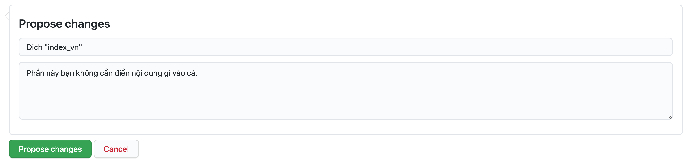
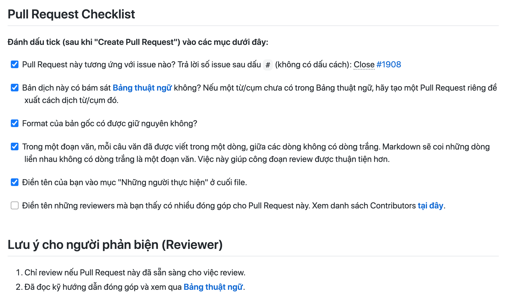

# Hướng dẫn Đóng góp cho Dự án

Cảm ơn bạn đã tham gia hỗ trợ dự án. Dưới đây là hướng dẫn chi tiết về cách mà bạn có thể đóng góp cho dự án, mời bạn xem kỹ nội dung này nhé.

## Tổng quan
Cuốn sách này được chia thành nhiều tập tin, mỗi tập tin như vậy chúng tôi tiến hành chia nhỏ ra thành từng phần nhằm giảm tải công việc lên từng cá nhân đóng góp, hỗ trợ cho việc dịch thuật và phản biện từng phần nội dung không lấy đi quá nhiều thời gian của một thành viên khi tham gia đóng góp.

**Tôi có thể đóng góp cho dự án này như thế nào?**
* Tham gia dịch thuật thông qua các Pull Request (Khuyến khích).
* Tham gia phản biện (review) các Pull Request.
* Hỗ trợ kỹ thuật.
* Sửa các lỗi chính tả trong bản thảo.
* Đề xuất chỉnh sửa về ngữ pháp, những điểm chưa nhất quán trong cách dịch.
* Star github repo của dự án.
* Chia sẻ dự án tới nhiều người hơn.

## Tôi nên bắt đầu dịch thuật như thế nào?

Dưới đây là hướng dẫn những việc cần làm khi tham gia quá trình dịch thuật.

### Bước 1: Tìm và đăng ký phần cần dịch
Bạn cần tìm đến **[tab issue](https://github.com/aivivn/d2l-vn/issues)**, những Issue chưa có người nhận dịch được đánh dấu bằng nhãn `status: help wanted`. Trước khi thực hiện việc dịch thuật phần nội dung được chỉ định trong Issue, bạn cần để lại comment vào trong issue đó và cc @duythanhvn (khuyến khích) hoặc @tiepvuspu để chúng tôi assign cho bạn.


> Khi bạn được assign thì bạn sẽ thấy avatar của mình nằm bên phải của issue, ở issue đầu tiên đang còn nhãn `status: help wanted` thì đây là issue mà bạn có thể comment để nhận dịch.

**Lưu ý:** Bạn chỉ nên bắt đầu việc dịch thuật khi bạn đã được assign vào issue mà mình đã nhận. Chúng tôi ưu tiên bạn bắt đầu với những phần có hai nhãn: `status: help wanted` và `status: phase 1`.

### Bước 2: Xem qua phần nội dung cần dịch
Tại mỗi Issue, chúng tôi đều để một đường dẫn đến phần nội dung bạn cần dịch cùng với hướng dẫn cách bạn có thể tương tác với tập tin, bạn hãy xem qua để nắm rõ giới hạn nội dung.

Sau khi vào tập tin tương ứng, bạn nhấn vào nút "Edit" hình chiếc bút chì để bắt đầu tìm và dịch phần đã nhận.


### Bước 3: Tiến hành dịch thuật
Để bắt đầu dịch thuật, bạn tìm đến phần các dòng hướng dẫn như:

```
## *dịch tiêu đề phía trên*
hoặc
*dịch đoạn phía trên*
```
Hãy chỉ chỉnh sửa nội dung từ dòng này.

**Một vài lưu ý khi dịch thuật:**
* Bạn chỉ chỉnh sửa những dòng như hướng dẫn phía trên, các nội dung gốc thì giữ nguyên.
* Không dịch các danh từ riêng.
* Trong một đoạn nội dung, mỗi câu dịch nên để riêng một dòng.
* Không dịch code.
* Đảm bảo giữ nguyên format của nội dung.
* Không nhất thiết phải dừng từng từ từng câu nhưng phải dịch đúng ý.
* Các thuật ngữ cần được dịch một cách nhất quán.
* Nếu một thuật ngữ chưa có trong bảng thuật ngữ, bạn có thể đề xuất một cách dịch bằng cách tạo một PR mới và trình bày quan điểm.
* 

**Lưu ý về format nội dung:**
* Các phần in nghiêng, in đậm.
* Tiêu đề (số lượng dấu `#` đầu dòng).
* Bảng biểu, chú thích cho bảng (dòng phía trên mỗi bảng bắt đầu bằng dấu `:`).
* Dịch các từ trong hình vẽ nếu cần. Các dòng có hình có dạng: ``.
* Dịch các chú thích hình vẽ (thay các cụm `*dịch chú thích ảnh phía trên*` bằng bản dịch tiếng Việt).
* Không dịch các phần code (nằm giữa hai dấu `````).
* Copy các công thức toán từ bản gốc (các đoạn có `$`).
* Giữ các dòng gán nhãn (bắt đầu với `:label:`).
* Không tự thêm bớt các dòng trắng.

Nếu đây là lần đầu tiên bạn đóng góp vào file này, bạn cần kéo xuống cuối file và điền tên mình vào mục "Những người thực hiện" và mục tương ứng. Mục này nhằm ghi nhận đóng góp của bạn.

**Lưu ý: Tên bạn sẽ chỉ xuất hiện trên trang web chính thức nếu Pull Request bạn tạo được merged sau khi trả lời các phản biện.**


### Bước 6: Commit changes
Sau khi dịch lần đầu xong phần của mình, bạn cần kéo xuống cuối trang để "Commit changes". Trước khi click vào nút "Commit changes", bạn cần đặt tiêu đề cho commit, cũng là tiêu đề cho Pull Request bạn sắp tạo. Tiêu đề này giống với tiêu đề trong Issue bạn nhận ban đầu (chỉ cần copy paste là được).



Click "Commit changes".

### Bước 7: Tạo Pull Request
Sau khi click "Commit changes", trang tạo Pull Request sẽ tự động mở ra. Bạn chỉ cần điền số issue tương ứng, trong ví dụ này là 393, vào sau cụm "Close#" như trong hình. Lưu ý không có dấu cách giữa `#` và số issue. Việc này sẽ giúp issue tự động được đóng sau khi Pull Request này được merged.


Click "Create pull request".

Trong trường hợp bạn chưa hoàn thành nội dung cần dịch, hoặc nội dung này bạn mong muốn tự chỉnh sửa để hoàn thiện hơn, bạn hãy lựa chọn tạo một "Draft Pull Request" theo hướng dẫn ở hình dưới.


Sau khi hoàn thiện nội dung, bạn có thể chọn **Ready for review** để Pull request này được nhóm tiến hành review.


### Bước 8: Kiểm tra checklist
Cuối cùng, bạn kiểm tra checklist và click vào các ô tương ứng đã hoàn thành như hình dưới đây.

Trong ví dụ này, phần đã nhận chưa được dịch trọn vẹn nên chưa có dấu tick.



### Sau khi đã nộp Pull Request
Nếu là lần đầu nộp Pull Request, bạn sẽ nhận được vô số bình luận/gợi ý từ các reviewer. **Việc này là hoàn toàn bình thường**, những người làm việc trong nhóm này thường có rất nhiều góp ý xây dựng giúp bản dịch được trọn vẹn và nhất quán với các phần khác. Họ sẽ gợi ý bạn cách sửa, bạn có thể chấp nhận gợi ý hoặc phản hồi lại các phản hồi đó.

### Sau khi Pull Request được approve
Cuối cùng, nếu bạn thấy phần phản hồi nào hữu ích, bạn có thể điền tên user tương ứng vào dưới tên bạn ở mục "Những người thực hiện". Cả người dịch và người review đều xứng đáng được ghi công.

Nếu bạn chưa biết tên đầy đủ của những người đóng góp, bạn có thể xem danh sách Contributors **[tại đây](./docs/contributors_info.md)**. Nếu bạn chưa thấy tên mình tại đây, hãy tạo một Issue mới để được bổ sung.

## Tôi đang trong quá trình hoàn thiện bản dịch của mình

Trong trường hợp bạn chưa hoàn thành nội dung cần dịch nhưng bạn cần tạo Pull request để lưu trữ commit mình vừa chỉnh sửa, hoặc nội dung này bạn mong muốn tự chỉnh sửa để hoàn thiện hơn, chúng tôi gợi ý bạn sử dụng tính năng tạo bản nháp (Draft Pull request) theo hướng dẫn ở hình phía dưới.

## Những vấn đề thường gặp

<details>
<summary>Tôi có bao nhiêu thời gian để hoàn thành phần dịch mình đã nhận?</summary>

Hiện tại, chúng tôi hy vọng bạn sẽ hoàn thành phần dịch trễ nhất là 4 ngày kể từ ngày nhận, tức càng sớm càng tốt.
</details>
<details>
<summary>Tôi tiếp nhận những phản hồi từ nhóm phản biện như thế nào?</summary>

Khi phần nội dung của bạn được đưa lên Pull request, nhóm phản biện sẽ có những thành viên vào và đưa ra những gợi ý, đề xuất chỉnh sửa giúp cho nội dung của bạn đúng hơn về mặt nội dung, mượt hơn về mặt hành văn.

Nếu bạn đồng tình với đề xuất của người phản biện, bạn hãy Commit suggestion để thay đổi nội dung; nếu bạn chưa đồng tình với đề xuất, vui lòng phản hồi lại để có giải pháp tốt nhất cho nội dung.
</details>
<details>
<summary>Tôi muốn hỗ trợ kỹ thuật?</summary>

Bạn vui lòng liên hệ @duythanhvn thông qua Github issue hoặc Slack để thảo luận thêm.
</details>
<details>
<summary></summary>

</details>

Nếu bạn có bất kỳ câu hỏi nào trong quá trình tham gia dự án, vui lòng tạo một Issue mới và tag @duythanhvn hoặc liên hệ qua Slack để nhận được hỗ trợ từ dự án.

Cảm ơn đóng góp của bạn.

Thân mến,<br/>
Nhóm dịch thuật Machine Learning Cơ Bản