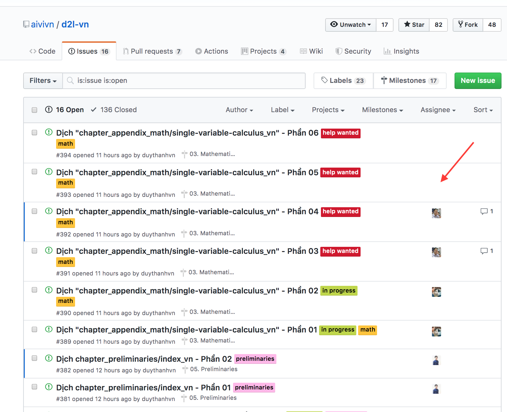
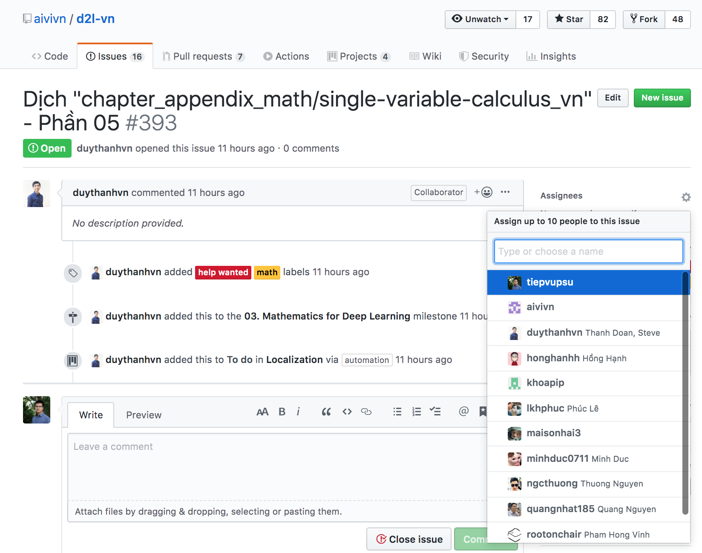
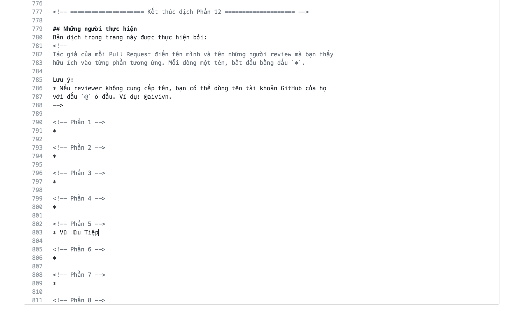
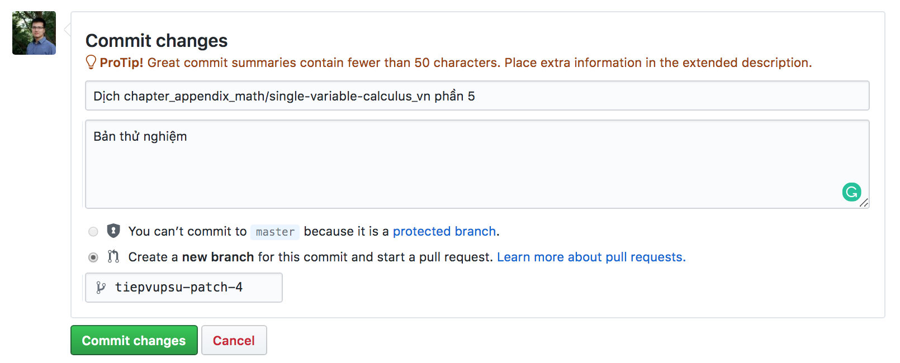
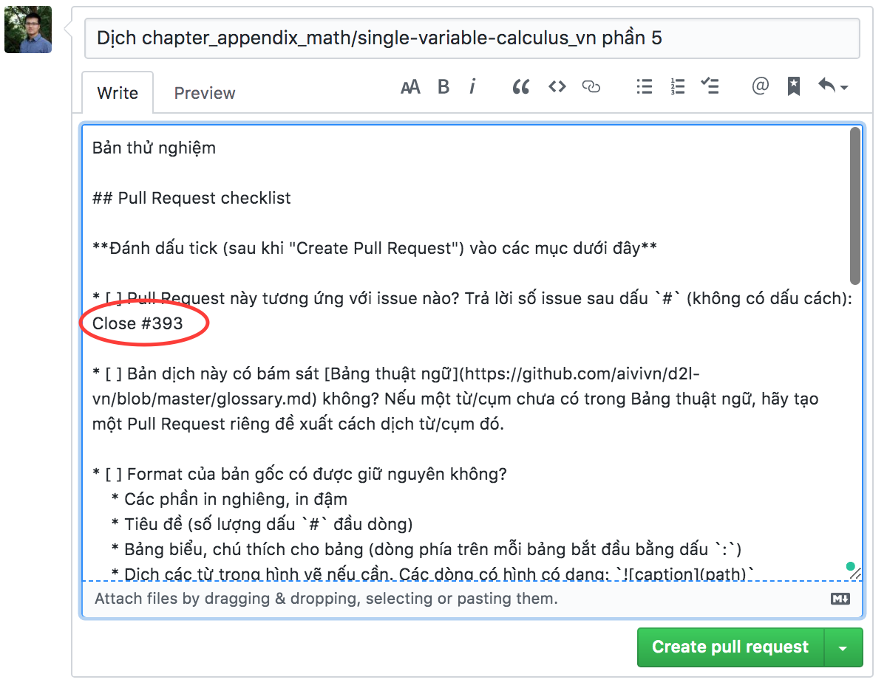
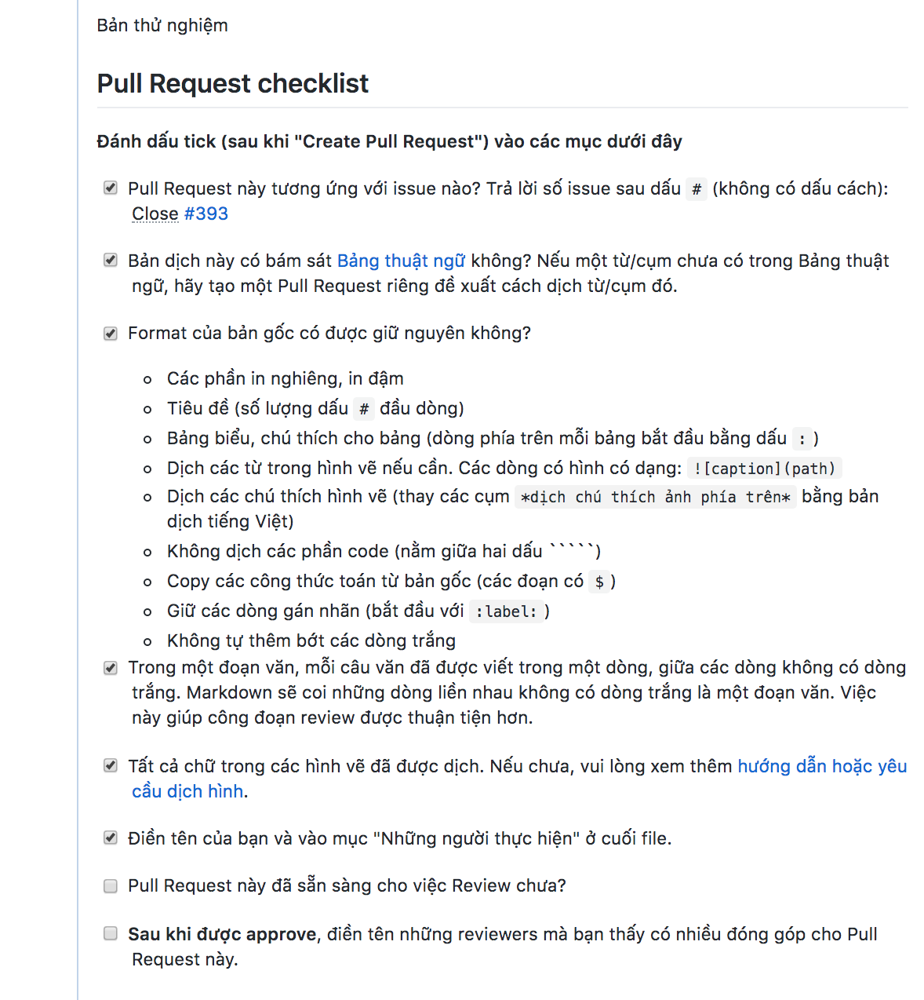

## Hướng dẫn dịch trực tiếp trên trình duyệt
:label:`chap_contribution_guideline`

Cả cuốn sách được chia thành nhiều file, mỗi file được chia thành nhiều phần nhỏ, mỗi phần chỉ khoảng 2-3 đoạn văn. Việc chia nhỏ thế này khiến việc dịch và review không lấy quá nhiều thời gian của một người.

Các bước dịch như sau:

### Bước 1: Chọn phần cần dịch
Tới [tab issue](https://github.com/aivivn/d2l-vn/issues), tìm xem issue nào chưa có người dịch, tức cột "Assignee" còn trống như trong hình dưới đây:



Giả sử bạn chọn issue ở hàng có mũi tên đỏ, tương ứng với file [chapter_appendix_math/single-variable-calculus_vn.md](https://github.com/aivivn/d2l-vn/blob/master/chapter_appendix_math/single-variable-calculus_vn.md), phần 5.

Nhớ số issue (ở ví dụ này là 393 trong phần khoanh đỏ) để dùng ở bước 7.

### Bước 2: Đăng ký dịch
Trước khi thực hiện việc dịch chương này, bạn cần tự "Assign" issue này cho mình để tránh trường hợp có nhiều người cùng làm một việc một lúc.



### Bước 3: Tìm file tương ứng
Sau khi vào file tương ứng, ở ví dụ này là [chapter_appendix_math/single-variable-calculus_vn.md](https://github.com/aivivn/d2l-vn/blob/master/chapter_appendix_math/single-variable-calculus_vn.md), bạn click vào nút "Edit" hình chiếc bút chì để bắt đầu tìm phần cần dịch.


### Bước 4: Tìm phần tương ứng
Mỗi phần được bắt đầu bởi dòng:
```
<!-- ===================== Bắt đầu dịch Phần x ==================== -->
```
như trong hình:


chúng ta cần dịch từ sau dòng này đến trước dòng
```
<!-- ===================== Kết thúc dịch Phần x ==================== -->
```
tương ứng.

### Bước 5: Bắt đầu dịch
Khi dịch, bạn tìm các dòng dạng:
```
## *dịch tiêu đề phía trên*

*dịch đoạn phía trên*
```
và chỉ chỉnh sửa các dòng này.

**Một vài quy tắc dịch:**
* Không dịch các danh từ riêng
* Trong một đoạn, mỗi câu dịch nên để riêng một dòng (xem dòng 268, 269, 270 trong hình ví dụ ở **Bước 4**).
* Không dịch code
* Không nhất thiết phải dừng từng từ từng câu nhưng phải dịch đúng ý.
* Các thuật ngữ cần được dịch một cách nhất quán
* Nếu một thuật ngữ chưa có trong bảng thuật ngữ, bạn có thể đề xuất một cách dịch bằng cách tạo một PR mới

Nếu đây là lần đầu tiên bạn đóng góp vào file này, bạn cần kéo xuống cuối file và điền tên mình vào mục "Những người thực hiện" và mục tương ứng. Mục này nhằm ghi nhận đóng góp của bạn.

**Lưu ý: Tên bạn sẽ chỉ xuất hiện trên trang web chính thức nếu Pull Request bạn tạo được merged sau khi trả lời các phản biện.**


### Bước 6: Commit changes
Sau khi dịch lần đầu xong phần của mình, bạn cần kéo xuống cuối trang để "Commit changes". Trước khi click vào nút "Commit changes", bạn cần đặt tiêu đề cho commit, cũng là tiêu đề cho Pull Request bạn sắp tạo. Tiêu đề này giống với tiêu đề trong Issue bạn nhận ban đầu (chỉ cần copy paste là được).



Click "Commit changes".

### Bước 7: Tạo Pull Request
Sau khi click "Commit changes", trang tạo Pull Request sẽ tự động mở ra. Bạn chỉ cần điền số issue tương ứng, trong ví dụ này là 393, vào sau cụm "Close#" như trong hình. Lưu ý không có dấu cách giữa `#` và số issue. Việc này sẽ giúp issue tự động được đóng sau khi Pull Request này được merged.



Click "Create pull request".

### Bước 8: Kiểm tra checklist
Cuối cùng, bạn kiểm tra checklist và click vào các ô tương ứng đã hoàn thành như hình dưới đây. Nếu Pull Request đã sẵn sàng được review, bạn click vào dòng thứ hai từ dưới lên:
"Pull Request này đã sẵn sàng cho việc Review chưa?"

Trong ví dụ này, phần đã nhận chưa được dịch trọn vẹn nên chưa có dấu tick.



### Sau khi đã nộp Pull Request
Nếu là lần đầu nộp Pull Request, bạn sẽ nhận được vô số bình luận/gợi ý từ các reviewer. **Việc này là hoàn toàn bình thường**, những người làm việc trong nhóm này thường có rất nhiều góp ý xây dựng giúp bản dịch được trọn vẹn và nhất quán với các phần khác. Họ sẽ gợi ý bạn cách sửa, bạn có thể chấp nhận gợi ý hoặc phản hồi lại các phản hồi đó.

### Sau khi Pull Request được approve
Cuối cùng, nếu bạn thấy phần phản hồi nào hữu ích, bạn có thể điền tên user tương ứng vào dưới tên bạn ở mục "Những người thực hiện". Cả người dịch và người review đều xứng đáng được ghi công.

Cảm ơn đóng góp của bạn.