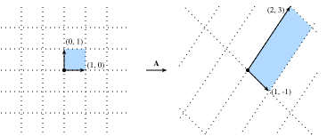

# Hình học và các hoạt động đại số tuyến tính
:label:`sec_geometry-linear-algebraic-ops`

Trong :numref:`sec_linear-algebra`, chúng tôi gặp phải những điều cơ bản về đại số tuyến tính và thấy nó có thể được sử dụng như thế nào để thể hiện các hoạt động phổ biến để chuyển đổi dữ liệu của chúng tôi. Đại số tuyến tính là một trong những trụ cột toán học quan trọng dựa trên phần lớn công việc mà chúng ta làm trong học sâu và trong học máy rộng hơn. Trong khi :numref:`sec_linear-algebra` chứa đủ máy móc để truyền đạt cơ học của các mô hình học sâu hiện đại, có rất nhiều hơn cho chủ đề này. Trong phần này, chúng ta sẽ đi sâu hơn, làm nổi bật một số diễn giải hình học của các phép toán đại số tuyến tính, và giới thiệu một vài khái niệm cơ bản, bao gồm eigenvalues và eigenvectors. 

## Hình học của Vectơ Trước tiên, chúng ta cần thảo luận về hai cách giải thích hình học phổ biến của vectơ, như một trong hai điểm hoặc hướng trong không gian. Về cơ bản, một vectơ là danh sách các số như danh sách Python bên dưới.

```{.python .input}
#@tab all
v = [1, 7, 0, 1]
```

Các nhà toán học thường viết điều này dưới dạng vectơ * cột* hoặc * hàng*, đó là để nói là 

$$
\mathbf{x} = \begin{bmatrix}1\\7\\0\\1\end{bmatrix},
$$

hoặc là 

$$
\mathbf{x}^\top = \begin{bmatrix}1 & 7 & 0 & 1\end{bmatrix}.
$$

Chúng thường có các diễn giải khác nhau, trong đó các ví dụ dữ liệu là vectơ cột và trọng lượng được sử dụng để tạo thành các tổng trọng số là vectơ hàng. Tuy nhiên, nó có thể có lợi để linh hoạt. Như chúng ta đã mô tả trong :numref:`sec_linear-algebra`, mặc dù định hướng mặc định của một vectơ duy nhất là một vectơ cột, đối với bất kỳ ma trận nào đại diện cho một tập dữ liệu dạng bảng, coi mỗi ví dụ dữ liệu như một vectơ hàng trong ma trận là thông thường hơn. 

Với một vector, cách giải thích đầu tiên mà chúng ta nên đưa ra nó là một điểm trong không gian. Trong hai hoặc ba chiều, ta có thể hình dung các điểm này bằng cách sử dụng các thành phần của các vectơ để xác định vị trí của các điểm trong không gian so với một tham chiếu cố định gọi là *origin*. Điều này có thể được nhìn thấy trong :numref:`fig_grid`. 


:label:`fig_grid`

Quan điểm hình học này cho phép chúng ta xem xét vấn đề ở mức độ trừu tượng hơn. Không còn phải đối mặt với một số vấn đề dường như không thể vượt qua như phân loại hình ảnh là mèo hoặc chó, chúng ta có thể bắt đầu xem xét các nhiệm vụ trừu tượng như tập hợp các điểm trong không gian và hình dung nhiệm vụ khám phá cách tách hai cụm điểm riêng biệt. 

Song song, có quan điểm thứ hai mà mọi người thường lấy vectơ: như hướng trong không gian. Chúng ta không chỉ có thể nghĩ về vector $\mathbf{v} = [3,2]^\top$ là vị trí $3$ đơn vị ở bên phải và $2$ các đơn vị lên từ nguồn gốc, chúng ta cũng có thể nghĩ về nó như là hướng để thực hiện $3$ bước sang phải và $2$ bước lên. Bằng cách này, chúng tôi xem xét tất cả các vectơ trong hình :numref:`fig_arrow` giống nhau. 


:label:`fig_arrow`

Một trong những lợi ích của sự thay đổi này là chúng ta có thể hiểu rõ về hành động bổ sung vector. Đặc biệt, chúng ta làm theo các hướng dẫn được đưa ra bởi một vectơ, và sau đó làm theo các hướng dẫn được đưa ra bởi người kia, như được thấy trong :numref:`fig_add-vec`. 


:label:`fig_add-vec`

Phép trừ vector có cách giải thích tương tự. Bằng cách xem xét danh tính mà $\mathbf{u} = \mathbf{v} + (\mathbf{u}-\mathbf{v})$, chúng ta thấy rằng vector $\mathbf{u}-\mathbf{v}$ là hướng đưa chúng ta từ điểm $\mathbf{v}$ đến điểm $\mathbf{u}$. 

## Dot Sản phẩm và Angles Như chúng ta đã thấy trong :numref:`sec_linear-algebra`, nếu chúng ta lấy hai vectơ cột $\mathbf{u}$ và $\mathbf{v}$, chúng ta có thể tạo thành sản phẩm chấm của chúng bằng cách tính toán: 

$$\mathbf{u}^\top\mathbf{v} = \sum_i u_i\cdot v_i.$$
:eqlabel:`eq_dot_def`

Bởi vì :eqref:`eq_dot_def` là đối xứng, chúng ta sẽ phản ánh ký hiệu của phép nhân cổ điển và viết 

$$
\mathbf{u}\cdot\mathbf{v} = \mathbf{u}^\top\mathbf{v} = \mathbf{v}^\top\mathbf{u},
$$

để làm nổi bật thực tế là trao đổi thứ tự của các vectơ sẽ mang lại câu trả lời tương tự. 

Sản phẩm dot :eqref:`eq_dot_def` cũng thừa nhận một giải thích hình học: it is closely related to the angle between two vectors.  Consider the angle shown in :numref:`fig_angle`. 


:label:`fig_angle`

Để bắt đầu, chúng ta hãy xem xét hai vectơ cụ thể: 

$$
\mathbf{v} = (r,0) \; \text{and} \; \mathbf{w} = (s\cos(\theta), s \sin(\theta)).
$$

Vector $\mathbf{v}$ có chiều dài $r$ và chạy song song với trục $x$, và vector $\mathbf{w}$ có chiều dài $s$ và ở góc $\theta$ với trục $x$. Nếu chúng ta tính toán sản phẩm chấm của hai vectơ này, chúng ta thấy rằng 

$$
\mathbf{v}\cdot\mathbf{w} = rs\cos(\theta) = \|\mathbf{v}\|\|\mathbf{w}\|\cos(\theta).
$$

Với một số thao tác đại số đơn giản, chúng ta có thể sắp xếp lại các thuật ngữ để có được 

$$
\theta = \arccos\left(\frac{\mathbf{v}\cdot\mathbf{w}}{\|\mathbf{v}\|\|\mathbf{w}\|}\right).
$$

Nói tóm lại, đối với hai vectơ cụ thể này, tích chấm kết hợp với các định mức cho chúng ta biết góc giữa hai vectơ. Thực tế tương tự này là đúng nói chung. Tuy nhiên, chúng tôi sẽ không lấy được biểu thức ở đây, nếu chúng ta xem xét viết $\|\mathbf{v} - \mathbf{w}\|^2$ theo hai cách: một với sản phẩm chấm và một hình học khác sử dụng định luật cosin, chúng ta có thể có được mối quan hệ đầy đủ. Thật vậy, đối với bất kỳ hai vectơ $\mathbf{v}$ và $\mathbf{w}$, góc giữa hai vectơ là 

$$\theta = \arccos\left(\frac{\mathbf{v}\cdot\mathbf{w}}{\|\mathbf{v}\|\|\mathbf{w}\|}\right).$$
:eqlabel:`eq_angle_forumla`

Đây là một kết quả tốt đẹp vì không có gì trong các tài liệu tham khảo tính toán hai chiều. Thật vậy, chúng ta có thể sử dụng điều này trong ba hoặc ba triệu chiều mà không gặp vấn đề gì. 

Như một ví dụ đơn giản, chúng ta hãy xem làm thế nào để tính toán góc giữa một cặp vectơ:

```{.python .input}
%matplotlib inline
from d2l import mxnet as d2l
from IPython import display
from mxnet import gluon, np, npx
npx.set_np()

def angle(v, w):
    return np.arccos(v.dot(w) / (np.linalg.norm(v) * np.linalg.norm(w)))

angle(np.array([0, 1, 2]), np.array([2, 3, 4]))
```

```{.python .input}
#@tab pytorch
%matplotlib inline
from d2l import torch as d2l
from IPython import display
import torch
from torchvision import transforms
import torchvision

def angle(v, w):
    return torch.acos(v.dot(w) / (torch.norm(v) * torch.norm(w)))

angle(torch.tensor([0, 1, 2], dtype=torch.float32), torch.tensor([2.0, 3, 4]))
```

```{.python .input}
#@tab tensorflow
%matplotlib inline
from d2l import tensorflow as d2l
from IPython import display
import tensorflow as tf

def angle(v, w):
    return tf.acos(tf.tensordot(v, w, axes=1) / (tf.norm(v) * tf.norm(w)))

angle(tf.constant([0, 1, 2], dtype=tf.float32), tf.constant([2.0, 3, 4]))
```

Chúng tôi sẽ không sử dụng nó ngay bây giờ, nhưng rất hữu ích khi biết rằng chúng ta sẽ đề cập đến các vectơ mà góc là $\pi/2$ (hoặc tương đương $90^{\circ}$) là * trực tho*. Bằng cách kiểm tra phương trình trên, chúng ta thấy rằng điều này xảy ra khi $\theta = \pi/2$, đó là điều tương tự như $\cos(\theta) = 0$. Cách duy nhất điều này có thể xảy ra là nếu bản thân sản phẩm chấm bằng 0, và hai vectơ là trực giao nếu và chỉ khi $\mathbf{v}\cdot\mathbf{w} = 0$. Điều này sẽ chứng minh là một công thức hữu ích khi hiểu các đối tượng về mặt hình học. 

It is reasonable to ask: why is computing the angle useful?
The answer comes in the kind of invariance we expect data to have.
Consider an image, and a duplicate image,
where every pixel value is the same but $10\%$ the brightness.
The values of the individual pixels are in general far from the original values.
Thus, if one computed the distance between the original image and the darker one,
the distance can be large.
However, for most ML applications, the *content* is the same---it is still
an image of a cat as far as a cat/dog classifier is concerned.
However, if we consider the angle, it is not hard to see
that for any vector $\mathbf{v}$, the angle
between $\mathbf{v}$ and $0.1\cdot\mathbf{v}$ is zero.
This corresponds to the fact that scaling vectors
keeps the same direction and just changes the length.
The angle considers the darker image identical. 

Ví dụ như thế này ở khắp mọi nơi. Trong văn bản, chúng ta có thể muốn chủ đề được thảo luận không thay đổi nếu chúng ta viết dài gấp đôi tài liệu nói cùng một điều. Đối với một số mã hóa (chẳng hạn như đếm số lần xuất hiện của các từ trong một số từ vựng), điều này tương ứng với việc tăng gấp đôi vector mã hóa tài liệu, vì vậy một lần nữa chúng ta có thể sử dụng góc. 

### Cosine Similarity
In ML contexts where the angle is employed
to measure the closeness of two vectors,
practitioners adopt the term *cosine similarity*
to refer to the portion
$$
\cos(\theta) = \frac{\mathbf{v}\cdot\mathbf{w}}{\|\mathbf{v}\|\|\mathbf{w}\|}.
$$

Cosin có giá trị lớn nhất là $1$ khi hai vectơ trỏ theo cùng một hướng, giá trị tối thiểu là $-1$ khi chúng chỉ theo hướng ngược lại, và giá trị $0$ khi hai vectơ là trực giao. Lưu ý rằng nếu các thành phần của vectơ chiều cao được lấy mẫu ngẫu nhiên với trung bình $0$, cosin của chúng gần như sẽ luôn gần với $0$. 

## Siêu máy bay

Ngoài việc làm việc với các vectơ, một đối tượng chính khác mà bạn phải hiểu để đi xa trong đại số tuyến tính là * hyperplane*, một khái quát hóa cho các kích thước cao hơn của một đường thẳng (hai chiều) hoặc của một mặt phẳng (ba chiều). Trong một không gian vectơ $d$ chiều, một siêu phẳng có $d-1$ kích thước và chia không gian thành hai nửa không gian. 

Hãy để chúng tôi bắt đầu với một ví dụ. Giả sử rằng chúng ta có một vector cột $\mathbf{w}=[2,1]^\top$. Chúng tôi muốn biết, “những điểm $\mathbf{v}$ với $\mathbf{w}\cdot\mathbf{v} = 1$ là gì?” Bằng cách nhớ lại kết nối giữa các sản phẩm chấm và góc trên :eqref:`eq_angle_forumla`, chúng ta có thể thấy rằng điều này tương đương với
$$
\|\mathbf{v}\|\|\mathbf{w}\|\cos(\theta) = 1 \; \iff \; \|\mathbf{v}\|\cos(\theta) = \frac{1}{\|\mathbf{w}\|} = \frac{1}{\sqrt{5}}.
$$


:label:`fig_vector-project`

Nếu chúng ta xem xét ý nghĩa hình học của biểu thức này, chúng ta thấy rằng điều này tương đương với việc nói rằng độ dài của phép chiếu $\mathbf{v}$ theo hướng $\mathbf{w}$ chính xác là $1/\|\mathbf{w}\|$, như được thể hiện trong :numref:`fig_vector-project`. Tập hợp tất cả các điểm mà điều này là đúng là một đường thẳng ở góc phải với vector $\mathbf{w}$. Nếu chúng ta muốn, chúng ta có thể tìm thấy phương trình cho dòng này và thấy rằng nó là $2x + y = 1$ hoặc tương đương $y = 1 - 2x$. 

Nếu bây giờ chúng ta nhìn vào những gì xảy ra khi chúng ta hỏi về tập hợp các điểm với $\mathbf{w}\cdot\mathbf{v} > 1$ hoặc $\mathbf{w}\cdot\mathbf{v} < 1$, chúng ta có thể thấy rằng đây là những trường hợp các dự báo dài hơn hoặc ngắn hơn $1/\|\mathbf{w}\|$, tương ứng. Do đó, hai bất bình đẳng đó xác định hai bên của dòng. Bằng cách này, chúng tôi đã tìm ra cách cắt không gian của chúng tôi thành hai nửa, trong đó tất cả các điểm ở một bên đều có sản phẩm chấm dưới ngưỡng và phía bên kia ở trên như chúng ta thấy trong :numref:`fig_space-division`. 


:label:`fig_space-division`

Câu chuyện trong chiều cao hơn là nhiều như nhau. Nếu bây giờ chúng ta lấy $\mathbf{w} = [1,2,3]^\top$ và hỏi về các điểm trong ba chiều với $\mathbf{w}\cdot\mathbf{v} = 1$, chúng ta có được một mặt phẳng ở góc phải với vector $\mathbf{w}$ đã cho. Hai bất đẳng thức lại xác định hai mặt của mặt phẳng như được thể hiện trong :numref:`fig_higher-division`. 


:label:`fig_higher-division`

Trong khi khả năng hình dung của chúng ta hết vào thời điểm này, không có gì ngăn cản chúng ta làm điều này trong hàng chục, hàng trăm hoặc hàng tỷ chiều. Điều này xảy ra thường xuyên khi nghĩ về các mô hình học máy. Ví dụ, chúng ta có thể hiểu các mô hình phân loại tuyến tính như các mô hình từ :numref:`sec_softmax`, như các phương pháp để tìm các siêu phẳng tách biệt các lớp mục tiêu khác nhau. Trong bối cảnh này, các siêu máy bay như vậy thường được gọi là *kế hoạch quyết định*. Phần lớn các mô hình phân loại học sâu kết thúc bằng một lớp tuyến tính được đưa vào một softmax, do đó người ta có thể diễn giải vai trò của mạng nơ-ron sâu là tìm một nhúng phi tuyến tính sao cho các lớp mục tiêu có thể được tách sạch bằng các siêu phẳng. 

Để đưa ra một ví dụ được xây dựng bằng tay, hãy chú ý rằng chúng ta có thể tạo ra một mô hình hợp lý để phân loại hình ảnh nhỏ của áo phông và quần dài từ tập dữ liệu thời trang MNIST (thấy trong :numref:`sec_fashion_mnist`) bằng cách chỉ lấy vectơ giữa phương tiện của chúng để xác định mặt phẳng quyết định và nhãn cầu một ngưỡng thô. Đầu tiên chúng ta sẽ tải dữ liệu và tính toán trung bình.

```{.python .input}
# Load in the dataset
train = gluon.data.vision.FashionMNIST(train=True)
test = gluon.data.vision.FashionMNIST(train=False)

X_train_0 = np.stack([x[0] for x in train if x[1] == 0]).astype(float)
X_train_1 = np.stack([x[0] for x in train if x[1] == 1]).astype(float)
X_test = np.stack(
    [x[0] for x in test if x[1] == 0 or x[1] == 1]).astype(float)
y_test = np.stack(
    [x[1] for x in test if x[1] == 0 or x[1] == 1]).astype(float)

# Compute averages
ave_0 = np.mean(X_train_0, axis=0)
ave_1 = np.mean(X_train_1, axis=0)
```

```{.python .input}
#@tab pytorch
# Load in the dataset
trans = []
trans.append(transforms.ToTensor())
trans = transforms.Compose(trans)
train = torchvision.datasets.FashionMNIST(root="../data", transform=trans,
                                          train=True, download=True)
test = torchvision.datasets.FashionMNIST(root="../data", transform=trans,
                                         train=False, download=True)

X_train_0 = torch.stack(
    [x[0] * 256 for x in train if x[1] == 0]).type(torch.float32)
X_train_1 = torch.stack(
    [x[0] * 256 for x in train if x[1] == 1]).type(torch.float32)
X_test = torch.stack(
    [x[0] * 256 for x in test if x[1] == 0 or x[1] == 1]).type(torch.float32)
y_test = torch.stack([torch.tensor(x[1]) for x in test
                      if x[1] == 0 or x[1] == 1]).type(torch.float32)

# Compute averages
ave_0 = torch.mean(X_train_0, axis=0)
ave_1 = torch.mean(X_train_1, axis=0)
```

```{.python .input}
#@tab tensorflow
# Load in the dataset
((train_images, train_labels), (
    test_images, test_labels)) = tf.keras.datasets.fashion_mnist.load_data()


X_train_0 = tf.cast(tf.stack(train_images[[i for i, label in enumerate(
    train_labels) if label == 0]] * 256), dtype=tf.float32)
X_train_1 = tf.cast(tf.stack(train_images[[i for i, label in enumerate(
    train_labels) if label == 1]] * 256), dtype=tf.float32)
X_test = tf.cast(tf.stack(test_images[[i for i, label in enumerate(
    test_labels) if label == 0]] * 256), dtype=tf.float32)
y_test = tf.cast(tf.stack(test_images[[i for i, label in enumerate(
    test_labels) if label == 1]] * 256), dtype=tf.float32)

# Compute averages
ave_0 = tf.reduce_mean(X_train_0, axis=0)
ave_1 = tf.reduce_mean(X_train_1, axis=0)
```

Nó có thể là thông tin để kiểm tra các trung bình này một cách chi tiết, vì vậy hãy để chúng tôi vẽ những gì họ trông như thế nào. Trong trường hợp này, chúng ta thấy rằng trung bình thực sự giống như một hình ảnh mờ của một chiếc áo phông.

```{.python .input}
#@tab mxnet, pytorch
# Plot average t-shirt
d2l.set_figsize()
d2l.plt.imshow(ave_0.reshape(28, 28).tolist(), cmap='Greys')
d2l.plt.show()
```

```{.python .input}
#@tab tensorflow
# Plot average t-shirt
d2l.set_figsize()
d2l.plt.imshow(tf.reshape(ave_0, (28, 28)), cmap='Greys')
d2l.plt.show()
```

Trong trường hợp thứ hai, chúng ta lại thấy rằng trung bình giống như một hình ảnh mờ của quần.

```{.python .input}
#@tab mxnet, pytorch
# Plot average trousers
d2l.plt.imshow(ave_1.reshape(28, 28).tolist(), cmap='Greys')
d2l.plt.show()
```

```{.python .input}
#@tab tensorflow
# Plot average trousers
d2l.plt.imshow(tf.reshape(ave_1, (28, 28)), cmap='Greys')
d2l.plt.show()
```

Trong một giải pháp hoàn toàn máy học, chúng ta sẽ tìm hiểu ngưỡng từ tập dữ liệu. Trong trường hợp này, tôi chỉ đơn giản là mắt một ngưỡng trông tốt trên dữ liệu đào tạo bằng tay.

```{.python .input}
# Print test set accuracy with eyeballed threshold
w = (ave_1 - ave_0).T
predictions = X_test.reshape(2000, -1).dot(w.flatten()) > -1500000

# Accuracy
np.mean(predictions.astype(y_test.dtype) == y_test, dtype=np.float64)
```

```{.python .input}
#@tab pytorch
# Print test set accuracy with eyeballed threshold
w = (ave_1 - ave_0).T
# '@' is Matrix Multiplication operator in pytorch.
predictions = X_test.reshape(2000, -1) @ (w.flatten()) > -1500000

# Accuracy
torch.mean((predictions.type(y_test.dtype) == y_test).float(), dtype=torch.float64)
```

```{.python .input}
#@tab tensorflow
# Print test set accuracy with eyeballed threshold
w = tf.transpose(ave_1 - ave_0)
predictions = tf.reduce_sum(X_test * tf.nest.flatten(w), axis=0) > -1500000

# Accuracy
tf.reduce_mean(
    tf.cast(tf.cast(predictions, y_test.dtype) == y_test, tf.float32))
```

## Hình học của biến đổi tuyến tính

Thông qua :numref:`sec_linear-algebra` và các cuộc thảo luận trên, chúng ta có một sự hiểu biết vững chắc về hình học của vectơ, độ dài và góc. Tuy nhiên, có một đối tượng quan trọng mà chúng ta đã bỏ qua thảo luận, và đó là một sự hiểu biết hình học về các biến đổi tuyến tính được thể hiện bằng ma trận. Nội bộ hoàn toàn những gì ma trận có thể làm để chuyển đổi dữ liệu giữa hai không gian chiều cao có khả năng khác nhau cần thực hành đáng kể, và vượt quá phạm vi của phụ lục này. Tuy nhiên, chúng ta có thể bắt đầu xây dựng trực giác theo hai chiều. 

Giả sử rằng chúng ta có một số ma trận: 

$$
\mathbf{A} = \begin{bmatrix}
a & b \\ c & d
\end{bmatrix}.
$$

If we want to apply this to an arbitrary vector
$\mathbf{v} = [x, y]^\top$,
we multiply and see that

$$
\begin{aligned}
\mathbf{A}\mathbf{v} & = \begin{bmatrix}a & b \\ c & d\end{bmatrix}\begin{bmatrix}x \\ y\end{bmatrix} \\
& = \begin{bmatrix}ax+by\\ cx+dy\end{bmatrix} \\
& = x\begin{bmatrix}a \\ c\end{bmatrix} + y\begin{bmatrix}b \\d\end{bmatrix} \\
& = x\left\{\mathbf{A}\begin{bmatrix}1\\0\end{bmatrix}\right\} + y\left\{\mathbf{A}\begin{bmatrix}0\\1\end{bmatrix}\right\}.
\end{aligned}
$$

Điều này có vẻ giống như một tính toán kỳ lạ, nơi một cái gì đó rõ ràng trở nên hơi bất khả xâm phạm. Tuy nhiên, nó cho chúng ta biết rằng chúng ta có thể viết cách mà ma trận biến đổi vectơ *any* về cách nó biến đổi * hai vectơ cụ thể*: $[1,0]^\top$ và $[0,1]^\top$. Điều này đáng để xem xét trong một khoảnh khắc. Về cơ bản chúng ta đã giảm một bài toán vô hạn (những gì xảy ra với bất kỳ cặp số thực nào) thành một vấn đề hữu hạn (những gì xảy ra với các vectơ cụ thể này). Các vectơ này là một ví dụ a *basis*, nơi chúng ta có thể viết bất kỳ vectơ nào trong không gian của chúng ta dưới dạng tổng trọng số của các vectơ cơ bản* này*. 

Hãy để chúng tôi vẽ những gì xảy ra khi chúng ta sử dụng ma trận cụ thể 

$$
\mathbf{A} = \begin{bmatrix}
1 & 2 \\
-1 & 3
\end{bmatrix}.
$$

Nếu chúng ta nhìn vào vector cụ thể $\mathbf{v} = [2, -1]^\top$, chúng ta thấy đây là $2\cdot[1,0]^\top + -1\cdot[0,1]^\top$ và do đó chúng ta biết rằng ma trận $A$ sẽ gửi điều này đến $2(\mathbf{A}[1,0]^\top) + -1(\mathbf{A}[0,1])^\top = 2[1, -1]^\top - [2,3]^\top = [0, -5]^\top$. Nếu chúng ta làm theo logic này thông qua một cách cẩn thận, nói bằng cách xem xét lưới của tất cả các cặp số nguyên của điểm, chúng ta thấy rằng những gì xảy ra là phép nhân ma trận có thể nghiêng, xoay, và quy mô lưới điện, nhưng cấu trúc lưới phải vẫn như bạn thấy trong :numref:`fig_grid-transform`. 


:label:`fig_grid-transform`

Đây là điểm trực quan quan trọng nhất để nội tâm hóa về các biến đổi tuyến tính được thể hiện bằng ma trận. Ma trận không có khả năng làm biến dạng một số phần của không gian khác với những phần khác. Tất cả những gì họ có thể làm là lấy tọa độ ban đầu trên không gian của chúng ta và nghiêng, xoay và quy mô chúng. 

Một số biến dạng có thể nghiêm trọng. For instance ví dụ the matrix ma trận 

$$
\mathbf{B} = \begin{bmatrix}
2 & -1 \\ 4 & -2
\end{bmatrix},
$$

nén toàn bộ mặt phẳng hai chiều xuống một dòng duy nhất. Xác định và làm việc với các biến đổi như vậy là chủ đề của một phần sau, nhưng về mặt hình học chúng ta có thể thấy rằng điều này về cơ bản khác với các loại biến đổi mà chúng ta đã thấy ở trên. Ví dụ, kết quả từ ma trận $\mathbf{A}$ có thể là “uốn cong trở lại” vào lưới gốc. Kết quả từ ma trận $\mathbf{B}$ không thể vì chúng ta sẽ không bao giờ biết vector $[1,2]^\top$ đến từ đâu - nó là $[1,1]^\top$ hay $[0, -1]^\top$? 

Trong khi bức ảnh này dành cho ma trận $2\times2$, không có gì ngăn cản chúng ta tham gia các bài học đã học vào các chiều cao hơn. Nếu chúng ta lấy vectơ cơ bản tương tự như $[1,0, \ldots,0]$ và xem ma trận của chúng ta gửi chúng ở đâu, chúng ta có thể bắt đầu có cảm giác về cách nhân ma trận biến dạng toàn bộ không gian trong bất kỳ không gian chiều nào chúng ta đang xử lý. 

## Sự phụ thuộc tuyến tính

Xem xét lại ma trận 

$$
\mathbf{B} = \begin{bmatrix}
2 & -1 \\ 4 & -2
\end{bmatrix}.
$$

Điều này nén toàn bộ mặt phẳng xuống để sống trên dòng đơn $y = 2x$. Câu hỏi bây giờ đặt ra: có cách nào đó chúng ta có thể phát hiện ra điều này chỉ nhìn vào chính ma trận? Câu trả lời là thực sự chúng ta có thể. Chúng ta hãy lấy $\mathbf{b}_1 = [2,4]^\top$ và $\mathbf{b}_2 = [-1, -2]^\top$ là hai cột của $\mathbf{B}$. Hãy nhớ rằng chúng ta có thể viết mọi thứ được chuyển đổi bởi ma trận $\mathbf{B}$ như một tổng trọng số của các cột của ma trận: như $a_1\mathbf{b}_1 + a_2\mathbf{b}_2$. Chúng tôi gọi đây là một kết hợp tuyến tính*. Thực tế là $\mathbf{b}_1 = -2\cdot\mathbf{b}_2$ có nghĩa là chúng ta có thể viết bất kỳ sự kết hợp tuyến tính nào của hai cột đó hoàn toàn về nói $\mathbf{b}_2$ kể từ 

$$
a_1\mathbf{b}_1 + a_2\mathbf{b}_2 = -2a_1\mathbf{b}_2 + a_2\mathbf{b}_2 = (a_2-2a_1)\mathbf{b}_2.
$$

Điều này có nghĩa là một trong các cột, theo một nghĩa nào đó, dư thừa vì nó không xác định một hướng duy nhất trong không gian. Điều này không nên làm chúng ta ngạc nhiên quá nhiều vì chúng ta đã thấy rằng ma trận này sụp đổ toàn bộ mặt phẳng xuống thành một dòng duy nhất. Hơn nữa, chúng ta thấy rằng sự phụ thuộc tuyến tính $\mathbf{b}_1 = -2\cdot\mathbf{b}_2$ nắm bắt điều này. Để làm cho điều này đối xứng hơn giữa hai vectơ, chúng ta sẽ viết cái này là 

$$
\mathbf{b}_1  + 2\cdot\mathbf{b}_2 = 0.
$$

Nói chung, chúng ta sẽ nói rằng một tập hợp các vectơ $\mathbf{v}_1, \ldots, \mathbf{v}_k$ là * phụ thuộc tuyến tính* nếu có hệ số tồn tại $a_1, \ldots, a_k$ * không bằng 0* để 

$$
\sum_{i=1}^k a_i\mathbf{v_i} = 0.
$$

Trong trường hợp này, chúng ta có thể giải quyết cho một trong các vectơ về một số sự kết hợp của những người khác, và hiệu quả làm cho nó dư thừa. Do đó, sự phụ thuộc tuyến tính trong các cột của ma trận là một nhân chứng cho thực tế là ma trận của chúng ta đang nén không gian xuống một số chiều thấp hơn. Nếu không có sự phụ thuộc tuyến tính, chúng tôi nói rằng các vectơ là * độc lập tuyến tính*. Nếu các cột của ma trận độc lập tuyến tính, không xảy ra nén và thao tác có thể được hoàn tác. 

## thứ hạng

Nếu chúng ta có một ma trận $n\times m$ chung, nó là hợp lý để hỏi không gian kích thước mà ma trận ánh xạ vào. Một khái niệm được gọi là *rank* sẽ là câu trả lời của chúng tôi. Trong phần trước, chúng tôi lưu ý rằng một sự phụ thuộc tuyến tính làm chứng cho việc nén không gian vào một chiều thấp hơn và vì vậy chúng tôi sẽ có thể sử dụng điều này để xác định khái niệm về cấp bậc. Đặc biệt, cấp bậc của một ma trận $\mathbf{A}$ là số lượng lớn nhất các cột độc lập tuyến tính giữa tất cả các tập con của cột. Ví dụ, ma trận 

$$
\mathbf{B} = \begin{bmatrix}
2 & 4 \\ -1 & -2
\end{bmatrix},
$$

có $\mathrm{rank}(B)=1$, vì hai cột phụ thuộc tuyến tính, nhưng bản thân một trong hai cột không phụ thuộc tuyến tính. Đối với một ví dụ khó khăn hơn, chúng ta có thể xem xét 

$$
\mathbf{C} = \begin{bmatrix}
1& 3 & 0 & -1 & 0 \\
-1 & 0 & 1 & 1 & -1 \\
0 & 3 & 1 & 0 & -1 \\
2 & 3 & -1 & -2 & 1
\end{bmatrix},
$$

và cho thấy $\mathbf{C}$ đã xếp hạng hai vì, ví dụ, hai cột đầu tiên độc lập tuyến tính, tuy nhiên bất kỳ bộ sưu tập nào trong bốn cột phụ thuộc. 

Thủ tục này, như mô tả, rất không hiệu quả. Nó đòi hỏi phải xem xét mọi tập hợp con của các cột của ma trận nhất định của chúng ta, và do đó có khả năng hàm mũ trong số cột. Sau đó chúng ta sẽ thấy một cách hiệu quả hơn về tính toán để tính toán thứ hạng của ma trận, nhưng hiện tại, điều này là đủ để thấy rằng khái niệm này được xác định rõ và hiểu ý nghĩa. 

## Khả năng đảo ngược

Chúng ta đã thấy ở trên rằng phép nhân của một ma trận với các cột phụ thuộc tuyến tính không thể hoàn tác, tức là, không có hoạt động nghịch đảo nào luôn có thể khôi phục đầu vào. Tuy nhiên, nhân với ma trận cấp bậc đầy đủ (tức là, một số $\mathbf{A}$ là ma trận $n \times n$ với thứ hạng $n$), chúng ta nên luôn luôn có thể hoàn tác nó. Xem xét ma trận 

$$
\mathbf{I} = \begin{bmatrix}
1 & 0 & \cdots & 0 \\
0 & 1 & \cdots & 0 \\
\vdots & \vdots & \ddots & \vdots \\
0 & 0 & \cdots & 1
\end{bmatrix}.
$$

mà là ma trận với những người dọc theo đường chéo, và số không ở nơi khác. Chúng tôi gọi đây là ma trận *identity*. Đó là ma trận khiến dữ liệu của chúng tôi không thay đổi khi áp dụng. Để tìm một ma trận hoàn tác những gì ma trận của chúng tôi $\mathbf{A}$ đã làm, chúng tôi muốn tìm một ma trận $\mathbf{A}^{-1}$ sao cho 

$$
\mathbf{A}^{-1}\mathbf{A} = \mathbf{A}\mathbf{A}^{-1} =  \mathbf{I}.
$$

Nếu chúng ta xem xét điều này như một hệ thống, chúng ta có $n \times n$ ẩn số (các mục của $\mathbf{A}^{-1}$) và $n \times n$ phương trình (bình đẳng cần giữ giữa mọi mục nhập của sản phẩm $\mathbf{A}^{-1}\mathbf{A}$ và mọi mục nhập của $\mathbf{I}$) vì vậy chúng ta nên khái quát mong đợi một giải pháp tồn tại. Thật vậy, trong phần tiếp theo chúng ta sẽ thấy một đại lượng được gọi là *determinant*, có thuộc tính miễn là yếu tố quyết định không phải bằng 0, chúng ta có thể tìm ra giải pháp. Chúng tôi gọi ma trận $\mathbf{A}^{-1}$ như ma trận *inverse*. Ví dụ, nếu $\mathbf{A}$ là ma trận $2 \times 2$ chung 

$$
\mathbf{A} = \begin{bmatrix}
a & b \\
c & d
\end{bmatrix},
$$

sau đó chúng ta có thể thấy rằng nghịch đảo là 

$$
 \frac{1}{ad-bc}  \begin{bmatrix}
d & -b \\
-c & a
\end{bmatrix}.
$$

Chúng ta có thể kiểm tra để xem điều này bằng cách thấy rằng nhân với nghịch đảo được đưa ra bởi công thức trên hoạt động trong thực tế.

```{.python .input}
M = np.array([[1, 2], [1, 4]])
M_inv = np.array([[2, -1], [-0.5, 0.5]])
M_inv.dot(M)
```

```{.python .input}
#@tab pytorch
M = torch.tensor([[1, 2], [1, 4]], dtype=torch.float32)
M_inv = torch.tensor([[2, -1], [-0.5, 0.5]])
M_inv @ M
```

```{.python .input}
#@tab tensorflow
M = tf.constant([[1, 2], [1, 4]], dtype=tf.float32)
M_inv = tf.constant([[2, -1], [-0.5, 0.5]])
tf.matmul(M_inv, M)
```

### Các vấn đề số Trong khi nghịch đảo của ma trận rất hữu ích về lý thuyết, chúng ta phải nói rằng hầu hết thời gian chúng ta không muốn *sử dụng* ma trận nghịch đảo để giải quyết một vấn đề trong thực tế. Nói chung, có nhiều thuật toán ổn định số hơn để giải các phương trình tuyến tính như 

$$
\mathbf{A}\mathbf{x} = \mathbf{b},
$$

hơn là tính toán nghịch đảo và nhân lên để có được 

$$
\mathbf{x} = \mathbf{A}^{-1}\mathbf{b}.
$$

Cũng giống như phân chia bởi một số nhỏ có thể dẫn đến sự bất ổn số, vì vậy có thể đảo ngược của một ma trận gần với có thứ hạng thấp. 

Hơn nữa, thông thường ma trận $\mathbf{A}$ là * thưa thớt *, có nghĩa là nó chỉ chứa một số lượng nhỏ các giá trị không phải bằng không. Nếu chúng ta khám phá các ví dụ, chúng ta sẽ thấy rằng điều này không có nghĩa là nghịch đảo thưa thớt. Ngay cả khi $\mathbf{A}$ là một $1$ triệu bởi $1$ triệu ma trận với chỉ $5$ triệu mục không phải bằng không (và do đó chúng tôi chỉ cần lưu trữ những $5$ triệu), nghịch đảo thường sẽ có hầu hết mọi mục không âm, yêu cầu chúng tôi lưu trữ tất cả $1\text{M}^2$ mục đó là $1$ nghìn tỷ mục! 

Mặc dù chúng ta không có thời gian để lặn tất cả các cách vào các vấn đề số gai góc thường gặp khi làm việc với đại số tuyến tính, chúng tôi muốn cung cấp cho bạn một số trực giác về khi nào cần tiến hành thận trọng, và nói chung tránh đảo ngược trong thực tế là một nguyên tắc tốt. 

## Xác định Quan điểm hình học của đại số tuyến tính đưa ra một cách trực quan để diễn giải một đại lượng cơ bản được gọi là *quyết định*. Hãy xem xét hình ảnh lưới từ trước, nhưng bây giờ với một khu vực được tô sáng (:numref:`fig_grid-filled`). 


:label:`fig_grid-filled`

Nhìn vào hình vuông được tô sáng. Đây là một hình vuông với các cạnh được đưa ra bởi $(0, 1)$ và $(1, 0)$ và do đó nó có diện tích một. Sau $\mathbf{A}$ biến hình vuông này, chúng ta thấy rằng nó trở thành một hình bình hành. Không có lý do gì hình bình hành này nên có cùng một khu vực mà chúng ta bắt đầu, và thực sự trong trường hợp cụ thể được hiển thị ở đây 

$$
\mathbf{A} = \begin{bmatrix}
1 & 2 \\
-1 & 3
\end{bmatrix},
$$

nó là một bài tập trong hình học tọa độ để tính toán diện tích của hình bình hành này và có được rằng khu vực này là $5$. 

Nói chung, nếu chúng ta có một ma trận 

$$
\mathbf{A} = \begin{bmatrix}
a & b \\
c & d
\end{bmatrix},
$$

chúng ta có thể thấy với một số tính toán rằng diện tích của hình bình hành kết quả là $ad-bc$. Khu vực này được gọi là *quyết định*. 

Hãy để chúng tôi kiểm tra điều này một cách nhanh chóng với một số mã ví dụ.

```{.python .input}
import numpy as np
np.linalg.det(np.array([[1, -1], [2, 3]]))
```

```{.python .input}
#@tab pytorch
torch.det(torch.tensor([[1, -1], [2, 3]], dtype=torch.float32))
```

```{.python .input}
#@tab tensorflow
tf.linalg.det(tf.constant([[1, -1], [2, 3]], dtype=tf.float32))
```

Mắt đại bàng giữa chúng ta sẽ nhận thấy rằng biểu thức này có thể bằng 0 hoặc thậm chí tiêu cực. Đối với thuật ngữ tiêu cực, đây là vấn đề quy ước được thực hiện chung trong toán học: nếu ma trận lật hình, chúng ta nói khu vực này bị phủ định. Chúng ta hãy xem bây giờ rằng khi yếu tố quyết định bằng không, chúng ta tìm hiểu thêm. 

Hãy để chúng tôi xem xét 

$$
\mathbf{B} = \begin{bmatrix}
2 & 4 \\ -1 & -2
\end{bmatrix}.
$$

Nếu chúng ta tính toán yếu tố quyết định của ma trận này, chúng ta nhận được $2\cdot(-2 ) - 4\cdot(-1) = 0$. Với sự hiểu biết của chúng tôi ở trên, điều này có ý nghĩa. $\mathbf{B}$ nén hình vuông từ hình ảnh gốc xuống một đoạn đường, có diện tích bằng không. Và quả thực, bị nén thành một không gian chiều thấp hơn là cách duy nhất để có diện tích bằng 0 sau khi biến đổi. Như vậy chúng ta thấy kết quả sau là đúng: một ma trận $A$ có thể đảo ngược nếu và chỉ khi yếu tố quyết định không bằng 0. 

Như một nhận xét cuối cùng, hãy tưởng tượng rằng chúng ta có bất kỳ con số nào được vẽ trên mặt phẳng. Suy nghĩ giống như các nhà khoa học máy tính, chúng ta có thể phân hủy con số đó thành một tập hợp các ô vuông nhỏ để diện tích của hình là về bản chất chỉ là số lượng hình vuông trong phân hủy. Nếu bây giờ chúng ta biến đổi con số đó bằng một ma trận, chúng ta sẽ gửi từng ô vuông này thành hình bình hành, mỗi ô có diện tích được đưa ra bởi yếu tố quyết định. Chúng ta thấy rằng đối với bất kỳ con số nào, yếu tố quyết định cho số (ký) mà ma trận quy mô diện tích của bất kỳ hình nào. 

Các yếu tố quyết định tính toán cho ma trận lớn hơn có thể tốn nhiều công sức, nhưng trực giác là như nhau. Yếu tố quyết định vẫn là yếu tố mà $n\times n$ ma trận quy mô $n$-khối lượng chiều. 

## Tensors và hoạt động đại số tuyến tính phổ biến

Năm :numref:`sec_linear-algebra` khái niệm về hàng chục đã được giới thiệu. Trong phần này, chúng ta sẽ đi sâu hơn vào các cơn co thắt tensor (tensor tương đương với phép nhân ma trận), và xem làm thế nào nó có thể cung cấp một cái nhìn thống nhất về một số hoạt động ma trận và vector. 

Với ma trận và vectơ, chúng ta biết cách nhân chúng để chuyển đổi dữ liệu. Chúng ta cần phải có một định nghĩa tương tự cho hàng chục nếu chúng hữu ích cho chúng ta. Hãy suy nghĩ về phép nhân ma trận: 

$$
\mathbf{C} = \mathbf{A}\mathbf{B},
$$

hoặc tương đương 

$$ c_{i, j} = \sum_{k} a_{i, k}b_{k, j}.$$

Mô hình này là một trong những chúng ta có thể lặp lại cho hàng chục. Đối với hàng chục, không có một trường hợp nào để tổng hợp những gì có thể được lựa chọn phổ biến, vì vậy chúng ta cần xác định chính xác những chỉ số chúng ta muốn tổng hợp lại. For instance ví dụ we could consider xem xét 

$$
y_{il} = \sum_{jk} x_{ijkl}a_{jk}.
$$

Một sự chuyển đổi như vậy được gọi là co lại *tensor*. Nó có thể đại diện cho một gia đình biến đổi linh hoạt hơn nhiều mà phép nhân ma trận một mình. 

Là một đơn giản hóa ký hiệu thường được sử dụng, chúng ta có thể nhận thấy rằng tổng là trên chính xác những chỉ số xảy ra nhiều hơn một lần trong biểu thức, do đó mọi người thường làm việc với ký hiệu * Einstein*, trong đó tổng kết được thực hiện trong tất cả các chỉ số lặp đi lặp lại. Điều này cho phép biểu thức nhỏ gọn: 

$$
y_{il} = x_{ijkl}a_{jk}.
$$

### Ví dụ phổ biến từ đại số tuyến tính

Chúng ta hãy xem có bao nhiêu định nghĩa đại số tuyến tính mà chúng ta đã thấy trước đây có thể được thể hiện trong ký hiệu tensor nén này: 

* $\mathbf{v} \cdot \mathbf{w} = \sum_i v_iw_i$
* $\|\mathbf{v}\|_2^{2} = \sum_i v_iv_i$
* $(\mathbf{A}\mathbf{v})_i = \sum_j a_{ij}v_j$
* $(\mathbf{A}\mathbf{B})_{ik} = \sum_j a_{ij}b_{jk}$
* $\mathrm{tr}(\mathbf{A}) = \sum_i a_{ii}$

Bằng cách này, chúng ta có thể thay thế vô số ký hiệu chuyên biệt bằng các biểu thức tensor ngắn. 

### Expressing in Code Tensors cũng có thể được vận hành linh hoạt trong mã. Như đã thấy trong :numref:`sec_linear-algebra`, chúng ta có thể tạo ra hàng chục như được hiển thị dưới đây.

```{.python .input}
# Define tensors
B = np.array([[[1, 2, 3], [4, 5, 6]], [[7, 8, 9], [10, 11, 12]]])
A = np.array([[1, 2], [3, 4]])
v = np.array([1, 2])

# Print out the shapes
A.shape, B.shape, v.shape
```

```{.python .input}
#@tab pytorch
# Define tensors
B = torch.tensor([[[1, 2, 3], [4, 5, 6]], [[7, 8, 9], [10, 11, 12]]])
A = torch.tensor([[1, 2], [3, 4]])
v = torch.tensor([1, 2])

# Print out the shapes
A.shape, B.shape, v.shape
```

```{.python .input}
#@tab tensorflow
# Define tensors
B = tf.constant([[[1, 2, 3], [4, 5, 6]], [[7, 8, 9], [10, 11, 12]]])
A = tf.constant([[1, 2], [3, 4]])
v = tf.constant([1, 2])

# Print out the shapes
A.shape, B.shape, v.shape
```

Tổng kết Einstein đã được thực hiện trực tiếp. Các chỉ số xảy ra trong tổng kết Einstein có thể được truyền như một chuỗi, tiếp theo là các hàng chục đang được hành động. Ví dụ, để thực hiện phép nhân ma trận, chúng ta có thể xem xét tổng kết Einstein thấy ở trên ($\mathbf{A}\mathbf{v} = a_{ij}v_j$) và tự loại bỏ các chỉ số để thực hiện:

```{.python .input}
# Reimplement matrix multiplication
np.einsum("ij, j -> i", A, v), A.dot(v)
```

```{.python .input}
#@tab pytorch
# Reimplement matrix multiplication
torch.einsum("ij, j -> i", A, v), A@v
```

```{.python .input}
#@tab tensorflow
# Reimplement matrix multiplication
tf.einsum("ij, j -> i", A, v), tf.matmul(A, tf.reshape(v, (2, 1)))
```

Đây là một ký hiệu rất linh hoạt. Ví dụ nếu chúng ta muốn tính toán những gì sẽ được viết theo truyền thống như 

$$
c_{kl} = \sum_{ij} \mathbf{b}_{ijk}\mathbf{a}_{il}v_j.
$$

nó có thể được thực hiện thông qua tổng kết Einstein như:

```{.python .input}
np.einsum("ijk, il, j -> kl", B, A, v)
```

```{.python .input}
#@tab pytorch
torch.einsum("ijk, il, j -> kl", B, A, v)
```

```{.python .input}
#@tab tensorflow
tf.einsum("ijk, il, j -> kl", B, A, v)
```

Ký hiệu này có thể đọc được và hiệu quả đối với con người, tuy nhiên cồng kềnh nếu vì bất kỳ lý do gì chúng ta cần tạo ra sự co lại căng thẳng theo chương trình. Vì lý do này, `einsum` cung cấp một ký hiệu thay thế bằng cách cung cấp các chỉ số nguyên cho mỗi tensor. Ví dụ, cùng một sự co lại tensor cũng có thể được viết là:

```{.python .input}
np.einsum(B, [0, 1, 2], A, [0, 3], v, [1], [2, 3])
```

```{.python .input}
#@tab pytorch
# PyTorch doesn't support this type of notation.
```

```{.python .input}
#@tab tensorflow
# TensorFlow doesn't support this type of notation.
```

Một trong hai ký hiệu cho phép đại diện ngắn gọn và hiệu quả các cơn co thắt tensor trong mã. 

## Tóm tắt * Vectơ có thể được giải thích về mặt hình học như một trong hai điểm hoặc hướng trong không gian * Các sản phẩm chấm xác định khái niệm góc đến không gian chiều cao tùy ý. Chúng có thể được sử dụng để xác định các mặt phẳng quyết định thường được sử dụng như là bước cuối cùng trong một nhiệm vụ phân loại. * Phép nhân ma trận có thể được giải thích về mặt hình học là biến dạng thống nhất của tọa độ bên dưới. Chúng đại diện cho một cách rất hạn chế, nhưng về mặt toán học sạch, để biến đổi vectơ. * Phụ thuộc tuyến tính là một cách để biết khi một tập hợp các vectơ nằm trong một không gian chiều thấp hơn chúng ta mong đợi (giả sử bạn có $3$ vectơ sống trong một không gian $2$ chiều). Thứ hạng của ma trận là kích thước của tập hợp con lớn nhất của các cột của nó độc lập tuyến tính * Khi nghịch đảo của ma trận được xác định, đảo ngược ma trận cho phép chúng ta tìm một ma trận khác hoàn tác hành động của đầu tiên. Ma trận đảo ngược là hữu ích trong lý thuyết, nhưng đòi hỏi sự chăm sóc trong thực tế do sự bất ổn số.* yếu tố quyết định cho phép chúng ta đo lường bao nhiêu ma trận mở rộng hoặc ký hợp đồng một không gian. Một yếu tố quyết định nonzero ngụ ý một ma trận đảo ngược (không số ít) và một yếu tố xác định có giá trị không có nghĩa là ma trận không thể đảo ngược (số ít). * co thắt tensor và tổng kết Einstein cung cấp cho một ký hiệu gọn gàng và sạch sẽ để thể hiện nhiều tính toán được nhìn thấy trong học máy. 

## Exercises
1. What is the angle between
$$
\vec v_1 = \begin{bmatrix}
1 \\ 0 \\ -1 \\ 2
\end{bmatrix}, \qquad \vec v_2 = \begin{bmatrix}
3 \\ 1 \\ 0 \\ 1
\end{bmatrix}?
$$
2. True or false: $\begin{bmatrix}1 & 2\\0&1\end{bmatrix}$ and $\begin{bmatrix}1 & -2\\0&1\end{bmatrix}$ are inverses of one another?
3. Suppose that we draw a shape in the plane with area $100\mathrm{m}^2$.  What is the area after transforming the figure by the matrix
$$
\begin{bmatrix}
2 & 3\\
1 & 2
\end{bmatrix}.
$$
4. Which of the following sets of vectors are linearly independent?
 * $\left\{\begin{pmatrix}1\\0\\-1\end{pmatrix}, \begin{pmatrix}2\\1\\-1\end{pmatrix}, \begin{pmatrix}3\\1\\1\end{pmatrix}\right\}$
 * $\left\{\begin{pmatrix}3\\1\\1\end{pmatrix}, \begin{pmatrix}1\\1\\1\end{pmatrix}, \begin{pmatrix}0\\0\\0\end{pmatrix}\right\}$
 * $\left\{\begin{pmatrix}1\\1\\0\end{pmatrix}, \begin{pmatrix}0\\1\\-1\end{pmatrix}, \begin{pmatrix}1\\0\\1\end{pmatrix}\right\}$
5. Suppose that you have a matrix written as $A = \begin{bmatrix}c\\d\end{bmatrix}\cdot\begin{bmatrix}a & b\end{bmatrix}$ for some choice of values $a, b, c$, and $d$.  True or false: the determinant of such a matrix is always $0$?
6. The vectors $e_1 = \begin{bmatrix}1\\0\end{bmatrix}$ and $e_2 = \begin{bmatrix}0\\1\end{bmatrix}$ are orthogonal.  What is the condition on a matrix $A$ so that $Ae_1$ and $Ae_2$ are orthogonal?
7. How can you write $\mathrm{tr}(\mathbf{A}^4)$ in Einstein notation for an arbitrary matrix $A$?

:begin_tab:`mxnet`
[Discussions](https://discuss.d2l.ai/t/410)
:end_tab:

:begin_tab:`pytorch`
[Discussions](https://discuss.d2l.ai/t/1084)
:end_tab:

:begin_tab:`tensorflow`
[Discussions](https://discuss.d2l.ai/t/1085)
:end_tab:
