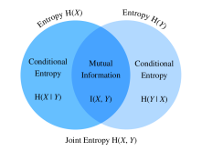

# Lý thuyết thông tin
:label:`sec_information_theory`

Vũ trụ tràn đầy thông tin. Thông tin cung cấp một ngôn ngữ chung giữa các rạn nứt kỷ luật: từ Sonnet của Shakespeare đến bài báo của các nhà nghiên cứu trên Cornell ArXiv, từ Starry Night in của Van Gogh đến Bản giao hưởng âm nhạc số 5 của Beethoven, từ ngôn ngữ lập trình đầu tiên Plankalkül đến các thuật toán máy học hiện đại. Mọi thứ phải tuân theo các quy tắc của lý thuyết thông tin, bất kể định dạng. Với lý thuyết thông tin, chúng ta có thể đo lường và so sánh lượng thông tin có mặt trong các tín hiệu khác nhau. Trong phần này, chúng tôi sẽ điều tra các khái niệm cơ bản về lý thuyết thông tin và ứng dụng lý thuyết thông tin trong học máy. 

Trước khi bắt đầu, chúng ta hãy phác thảo mối quan hệ giữa học máy và lý thuyết thông tin. Machine learning nhằm mục đích trích xuất các tín hiệu thú vị từ dữ liệu và đưa ra các dự đoán quan trọng. Mặt khác, lý thuyết thông tin nghiên cứu mã hóa, giải mã, truyền và thao túng thông tin. Kết quả là lý thuyết thông tin cung cấp ngôn ngữ cơ bản để thảo luận về việc xử lý thông tin trong các hệ thống học máy. Ví dụ, nhiều ứng dụng máy học sử dụng mất liên ngẫu nhiên như được mô tả trong :numref:`sec_softmax`. Sự mất mát này có thể được bắt nguồn trực tiếp từ những cân nhắc lý thuyết thông tin. 

## Thông tin

Hãy để chúng tôi bắt đầu với “linh hồn” của lý thuyết thông tin: thông tin. *Thông tin* có thể được mã hóa trong bất cứ điều gì với một chuỗi cụ thể của một hoặc nhiều định dạng mã hóa. Giả sử rằng chúng ta tự nhiệm vụ với việc cố gắng xác định một khái niệm về thông tin. Điều gì có thể là điểm khởi đầu của chúng ta? 

Hãy xem xét thí nghiệm suy nghĩ sau đây. Chúng tôi có một người bạn với một bộ bài. Họ sẽ xáo trộn bộ bài, lật qua một số thẻ, và cho chúng tôi biết tuyên bố về các thẻ. Chúng tôi sẽ cố gắng đánh giá nội dung thông tin của từng tuyên bố. 

Đầu tiên, họ lật qua một lá bài và nói với chúng tôi, “Tôi thấy một lá bài.” Điều này cung cấp cho chúng tôi không có thông tin nào cả. Chúng tôi đã chắc chắn rằng đây là trường hợp vì vậy chúng tôi hy vọng thông tin sẽ bằng không. 

Tiếp theo, họ lật qua một lá bài và nói, “Tôi thấy một trái tim.” Điều này cung cấp cho chúng tôi một số thông tin, nhưng trong thực tế chỉ có $4$ bộ đồ khác nhau có thể, mỗi bộ đồ có khả năng như nhau, vì vậy chúng tôi không ngạc nhiên bởi kết quả này. Chúng tôi hy vọng rằng bất kể thước đo thông tin, sự kiện này nên có nội dung thông tin thấp. 

Tiếp theo, họ lật qua một lá bài và nói, “Đây là $3$ của spades.” Đây là thêm thông tin. Thật vậy, có $52$ kết quả có khả năng như nhau, và bạn của chúng tôi đã nói với chúng tôi đó là cái nào. Đây phải là một lượng thông tin trung bình. 

Hãy để chúng tôi đưa điều này đến cực đoan logic. Giả sử rằng cuối cùng họ lật qua mỗi thẻ từ boong và đọc toàn bộ chuỗi của boong shuffled. Có 52 đô la! $ đơn đặt hàng khác nhau để boong, một lần nữa tất cả đều có khả năng, vì vậy chúng tôi cần rất nhiều thông tin để biết đó là cái nào. 

Bất kỳ khái niệm về thông tin chúng tôi phát triển phải phù hợp với trực giác này. Thật vậy, trong các phần tiếp theo, chúng ta sẽ học cách tính toán rằng các sự kiện này có $0\text{ bits}$, $2\text{ bits}$, $~5.7\ text {bits} $, and $ ~ 225.6\ text {bit} $ thông tin tương ứng. 

Nếu chúng ta đọc qua những thí nghiệm tư tưởng này, chúng ta thấy một ý tưởng tự nhiên. Là một điểm khởi đầu, thay vì quan tâm đến kiến thức, chúng ta có thể xây dựng ra ý tưởng rằng thông tin đại diện cho mức độ bất ngờ hoặc khả năng trừu tượng của sự kiện. Ví dụ, nếu chúng ta muốn mô tả một sự kiện bất thường, chúng ta cần rất nhiều thông tin. Đối với một sự kiện phổ biến, chúng tôi có thể không cần nhiều thông tin. 

Năm 1948, Claude E. Shannon xuất bản *A Math Theory of Communication* :cite:`Shannon.1948` thiết lập lý thuyết thông tin. Trong bài viết của mình, Shannon lần đầu tiên giới thiệu khái niệm về entropy thông tin. Chúng tôi sẽ bắt đầu hành trình của chúng tôi ở đây. 

### Tự thông tin

Vì thông tin thể hiện khả năng trừu tượng của một sự kiện, làm thế nào để chúng ta lập bản đồ khả năng với số bit? Shannon giới thiệu thuật ngữ * bit* là đơn vị thông tin, ban đầu được tạo ra bởi John Tukey. Vậy “bit” là gì và tại sao chúng ta sử dụng nó để đo lường thông tin? Trong lịch sử, một máy phát cổ chỉ có thể gửi hoặc nhận hai loại mã: $0$ và $1$. Thật vậy, mã hóa nhị phân vẫn được sử dụng phổ biến trên tất cả các máy tính kỹ thuật số hiện đại. Bằng cách này, bất kỳ thông tin nào được mã hóa bởi một loạt $0$ và $1$. Và do đó, một loạt các chữ số nhị phân có chiều dài $n$ chứa $n$ bit thông tin. 

Bây giờ, giả sử rằng đối với bất kỳ loạt mã nào, mỗi mã $0$ hoặc $1$ xảy ra với xác suất $\frac{1}{2}$. Do đó, một sự kiện $X$ với một loạt các mã có độ dài $n$, xảy ra với xác suất $\frac{1}{2^n}$. Đồng thời, như chúng tôi đã đề cập trước đây, loạt bài này chứa $n$ bit thông tin. Vì vậy, chúng ta có thể khái quát hóa một hàm toán học mà có thể chuyển xác suất $p$ đến số bit? Shannon đã đưa ra câu trả lời bằng cách xác định *tự thông tin* 

$$I(X) = - \log_2 (p),$$

như *bit* thông tin chúng tôi đã nhận được cho sự kiện này $X$. Lưu ý rằng chúng ta sẽ luôn sử dụng logarit base-2 trong phần này. Vì lợi ích của sự đơn giản, phần còn lại của phần này sẽ bỏ qua chỉ số dưới 2 trong ký hiệu logarit, tức là, $\log(.)$ luôn đề cập đến $\log_2(.)$. Ví dụ, mã “0010" có một thông tin tự 

$$I(\text{"0010"}) = - \log (p(\text{"0010"})) = - \log \left( \frac{1}{2^4} \right) = 4 \text{ bits}.$$

Chúng ta có thể tính toán thông tin tự như hình dưới đây. Trước đó, trước tiên chúng ta hãy nhập tất cả các gói cần thiết trong phần này.

```{.python .input}
from mxnet import np
from mxnet.metric import NegativeLogLikelihood
from mxnet.ndarray import nansum
import random

def self_information(p):
    return -np.log2(p)

self_information(1 / 64)
```

```{.python .input}
#@tab pytorch
import torch
from torch.nn import NLLLoss

def nansum(x):
    # Define nansum, as pytorch doesn't offer it inbuilt.
    return x[~torch.isnan(x)].sum()

def self_information(p):
    return -torch.log2(torch.tensor(p)).item()

self_information(1 / 64)
```

```{.python .input}
#@tab tensorflow
import tensorflow as tf

def log2(x):
    return tf.math.log(x) / tf.math.log(2.)

def nansum(x):
    return tf.reduce_sum(tf.where(tf.math.is_nan(
        x), tf.zeros_like(x), x), axis=-1)

def self_information(p):
    return -log2(tf.constant(p)).numpy()

self_information(1 / 64)
```

## Entropy

Vì tự thông tin chỉ đo lường thông tin của một sự kiện rời rạc duy nhất, chúng ta cần một thước đo tổng quát hơn cho bất kỳ biến ngẫu nhiên nào của phân phối rời rạc hoặc liên tục. 

### Thúc đẩy Entropy

Hãy để chúng tôi cố gắng để có được cụ thể về những gì chúng tôi muốn. Đây sẽ là một tuyên bố không chính thức về những gì được gọi là * tiên đề của entropy Shannon*. Nó sẽ chỉ ra rằng bộ sưu tập các tuyên bố thông thường sau đây buộc chúng ta phải có một định nghĩa duy nhất về thông tin. Một phiên bản chính thức của các tiên đề này, cùng với một số tiên đề khác có thể được tìm thấy trong :cite:`Csiszar.2008`. 

1.  Thông tin chúng ta đạt được bằng cách quan sát một biến ngẫu nhiên không phụ thuộc vào cái mà chúng ta gọi là các phần tử, hoặc sự hiện diện của các yếu tố bổ sung có xác suất không.
2.  Thông tin chúng tôi đạt được bằng cách quan sát hai biến ngẫu nhiên không nhiều hơn tổng thông tin chúng tôi đạt được bằng cách quan sát chúng một cách riêng biệt. Nếu chúng độc lập, thì đó chính xác là tổng.
3.  Thông tin thu được khi quan sát (gần) một số sự kiện nhất định là (gần) bằng không.

Trong khi chứng minh thực tế này nằm ngoài phạm vi văn bản của chúng ta, điều quan trọng là phải biết rằng điều này xác định duy nhất hình thức mà entropy phải thực hiện. Sự mơ hồ duy nhất mà chúng cho phép là lựa chọn các đơn vị cơ bản, thường được bình thường hóa bằng cách đưa ra lựa chọn chúng ta đã thấy trước đó thông tin được cung cấp bởi một lần lật đồng xu công bằng là một bit. 

### Definition

Đối với bất kỳ biến ngẫu nhiên $X$ nào theo phân phối xác suất $P$ với hàm mật độ xác suất (p.d.f.) hoặc hàm khối xác suất (p.m.f.) $p(x)$, chúng tôi đo lượng thông tin dự kiến thông qua *entropy* (hoặc *entropy* Shannon*) 

$$H(X) = - E_{x \sim P} [\log p(x)].$$
:eqlabel:`eq_ent_def`

Cụ thể, nếu $X$ là rời rạc, $$H(X) = - \sum_i p_i \log p_i \text{, where } p_i = P(X_i).$$ 

Nếu không, nếu $X$ là liên tục, chúng tôi cũng đề cập đến entropy là * entropyvisai* 

$$H(X) = - \int_x p(x) \log p(x) \; dx.$$

Chúng ta có thể định nghĩa entropy như dưới đây.

```{.python .input}
def entropy(p):
    entropy = - p * np.log2(p)
    # Operator `nansum` will sum up the non-nan number
    out = nansum(entropy.as_nd_ndarray())
    return out

entropy(np.array([0.1, 0.5, 0.1, 0.3]))
```

```{.python .input}
#@tab pytorch
def entropy(p):
    entropy = - p * torch.log2(p)
    # Operator `nansum` will sum up the non-nan number
    out = nansum(entropy)
    return out

entropy(torch.tensor([0.1, 0.5, 0.1, 0.3]))
```

```{.python .input}
#@tab tensorflow
def entropy(p):
    return nansum(- p * log2(p))

entropy(tf.constant([0.1, 0.5, 0.1, 0.3]))
```

### Giải thích

Bạn có thể tò mò: in the entropy definition :eqref:`eq_ent_def`, tại sao chúng ta sử dụng kỳ vọng về một logarit tiêu cực? Dưới đây là một số trực giác. 

Đầu tiên, tại sao chúng ta sử dụng hàm *logarit* $\log$? Giả sử rằng $p(x) = f_1(x) f_2(x) \ldots, f_n(x)$, trong đó mỗi hàm thành phần $f_i(x)$ độc lập với nhau. Điều này có nghĩa là mỗi $f_i(x)$ đóng góp độc lập vào tổng thông tin thu được từ $p(x)$. Như đã thảo luận ở trên, chúng ta muốn công thức entropy là phụ gia trên các biến ngẫu nhiên độc lập. May mắn thay, $\log$ có thể tự nhiên biến một sản phẩm phân phối xác suất thành tổng hợp các thuật ngữ riêng lẻ. 

Tiếp theo, tại sao chúng ta sử dụng * âm* $\log$? Trực giác, các sự kiện thường xuyên hơn nên chứa ít thông tin hơn các sự kiện ít phổ biến hơn, vì chúng ta thường thu được nhiều thông tin hơn từ một trường hợp bất thường hơn là từ một trường hợp thông thường. Tuy nhiên, $\log$ đang tăng đơn điệu với xác suất, và thực sự tiêu cực cho tất cả các giá trị trong $[0, 1]$. Chúng ta cần xây dựng một mối quan hệ giảm đơn điệu giữa xác suất của các sự kiện và entropy của chúng, điều này lý tưởng sẽ luôn tích cực (không có gì chúng ta quan sát nên buộc chúng ta quên những gì chúng ta đã biết). Do đó, chúng tôi thêm một dấu âm ở phía trước của chức năng $\log$. 

Cuối cùng, hàm *expectation* đến từ đâu? Xem xét một biến ngẫu nhiên $X$. Chúng tôi có thể giải thích thông tin bản thân ($-\log(p)$) là số lượng *ngạc nhiên* chúng tôi có khi thấy một kết quả cụ thể. Thật vậy, khi xác suất tiếp cận bằng không, sự ngạc nhiên trở nên vô hạn. Tương tự, chúng ta có thể giải thích entropy là lượng bất ngờ trung bình từ quan sát $X$. Ví dụ, hãy tưởng tượng rằng một hệ thống máy đánh bạc phát ra các ký hiệu độc lập thống kê ${s_1, \ldots, s_k}$ với xác suất tương ứng ${p_1, \ldots, p_k}$. Sau đó, entropy của hệ thống này bằng với thông tin tự trung bình từ quan sát từng đầu ra, tức là, 

$$H(S) = \sum_i {p_i \cdot I(s_i)} = - \sum_i {p_i \cdot \log p_i}.$$

### Tính chất của Entropy

Bằng các ví dụ và giải thích trên, chúng ta có thể lấy được các thuộc tính sau của entropy :eqref:`eq_ent_def`. Ở đây, chúng tôi đề cập đến $X$ là một sự kiện và $P$ là phân phối xác suất của $X$. 

* H (X)\ geq 0$ for all discrete $X$ (entropy can be negative for continuous $X$).

* Nếu $X \sim P$ với một p.d.f. hoặc một p.m.f. $p(x)$, và chúng tôi cố gắng ước tính $P$ bởi một phân phối xác suất mới $Q$ với p.d.f. hoặc một p.m.f. 73229363620, sau đó $$H(X) = - E_{x \sim P} [\log p(x)] \leq  - E_{x \sim P} [\log q(x)], \text{ with equality if and only if } P = Q.$$  Alternatively, $H (X) $ gives a lower bound of the average number of bits needed to encode symbols drawn from $P $.

* Nếu $X \sim P$, thì $x$ truyền tải lượng thông tin tối đa nếu nó lây lan đều trong tất cả các kết quả có thể. Cụ thể, nếu phân phối xác suất $P$ là rời rạc với $k$-lớp $\{p_1, \ldots, p_k \}$, thì $$H(X) \leq \log(k), \text{ with equality if and only if } p_i = \frac{1}{k}, \forall i.$$ If $P$ is a continuous random variable, then the story becomes much more complicated.  However, if we additionally impose that $P$ is supported on a finite interval (with all values between $0$ and $1$), then $P $ có entropy cao nhất nếu đó là sự phân bố thống nhất trong khoảng thời gian đó.

## Thông tin lẫn nhau

Trước đây chúng ta đã định nghĩa entropy của một biến ngẫu nhiên duy nhất $X$, làm thế nào về entropy của một cặp biến ngẫu nhiên $(X, Y)$? Chúng ta có thể nghĩ về những kỹ thuật này là cố gắng trả lời loại câu hỏi sau đây, “Thông tin nào được chứa trong $X$ và $Y$ cùng nhau so với từng loại riêng biệt? Có thông tin dư thừa, hay tất cả là duy nhất?” 

Đối với các cuộc thảo luận sau đây, chúng tôi luôn sử dụng $(X, Y)$ như một cặp biến ngẫu nhiên mà sau một phân phối xác suất chung $P$ với một p.d.f. hoặc một p.m.f. $p_{X, Y}(x, y)$, trong khi $X$ và $Y$ theo phân phối xác suất $p_X(x)$ và $p_Y(y)$, tương ứng. 

### Entropy chung

Tương tự như entropy của một biến ngẫu nhiên duy nhất :eqref:`eq_ent_def`, chúng tôi xác định entropy* doanh entropy* $H(X, Y)$ của một cặp biến ngẫu nhiên $(X, Y)$ như 

$$H(X, Y) = −E_{(x, y) \sim P} [\log p_{X, Y}(x, y)]. $$
:eqlabel:`eq_joint_ent_def`

Chính xác, một mặt, nếu $(X, Y)$ là một cặp biến ngẫu nhiên rời rạc, thì 

$$H(X, Y) = - \sum_{x} \sum_{y} p_{X, Y}(x, y) \log p_{X, Y}(x, y).$$

Mặt khác, nếu $(X, Y)$ là một cặp biến ngẫu nhiên liên tục, thì ta định nghĩa entropydoanh vi sai * như 

$$H(X, Y) = - \int_{x, y} p_{X, Y}(x, y) \ \log p_{X, Y}(x, y) \;dx \;dy.$$

Chúng ta có thể nghĩ về :eqref:`eq_joint_ent_def` như cho chúng ta biết tổng ngẫu nhiên trong cặp biến ngẫu nhiên. Là một cặp cực đoan, nếu $X = Y$ là hai biến ngẫu nhiên giống hệt nhau, thì thông tin trong cặp chính xác là thông tin trong một và chúng ta có $H(X, Y) = H(X) = H(Y)$. Ở thái cực khác, nếu $X$ và $Y$ độc lập thì $H(X, Y) = H(X) + H(Y)$. Thật vậy chúng ta sẽ luôn có rằng thông tin chứa trong một cặp biến ngẫu nhiên không nhỏ hơn entropy của một trong hai biến ngẫu nhiên và không nhiều hơn tổng của cả hai. 

$$
H(X), H(Y) \le H(X, Y) \le H(X) + H(Y).
$$

Hãy để chúng tôi thực hiện entropy chung từ đầu.

```{.python .input}
def joint_entropy(p_xy):
    joint_ent = -p_xy * np.log2(p_xy)
    # Operator `nansum` will sum up the non-nan number
    out = nansum(joint_ent.as_nd_ndarray())
    return out

joint_entropy(np.array([[0.1, 0.5], [0.1, 0.3]]))
```

```{.python .input}
#@tab pytorch
def joint_entropy(p_xy):
    joint_ent = -p_xy * torch.log2(p_xy)
    # Operator `nansum` will sum up the non-nan number
    out = nansum(joint_ent)
    return out

joint_entropy(torch.tensor([[0.1, 0.5], [0.1, 0.3]]))
```

```{.python .input}
#@tab tensorflow
def joint_entropy(p_xy):
    joint_ent = -p_xy * log2(p_xy)
    # Operator `nansum` will sum up the non-nan number
    out = nansum(joint_ent)
    return out

joint_entropy(tf.constant([[0.1, 0.5], [0.1, 0.3]]))
```

Chú ý rằng đây là cùng *code* như trước đây, nhưng bây giờ chúng ta giải thích nó khác nhau như làm việc trên phân phối chung của hai biến ngẫu nhiên. 

### Entropy có điều kiện

Entropy chung được xác định phía trên lượng thông tin chứa trong một cặp biến ngẫu nhiên. Điều này rất hữu ích, nhưng đôi khi nó không phải là những gì chúng ta quan tâm. Xem xét các thiết lập của máy học. Chúng ta hãy lấy $X$ là biến ngẫu nhiên (hoặc vector của các biến ngẫu nhiên) mô tả các giá trị điểm ảnh của một hình ảnh, và $Y$ là biến ngẫu nhiên là nhãn lớp. $X$ nên chứa thông tin đáng kể - một hình ảnh tự nhiên là một điều phức tạp. Tuy nhiên, thông tin chứa trong $Y$ khi hình ảnh đã được hiển thị nên thấp. Thật vậy, hình ảnh của một chữ số nên đã chứa thông tin về chữ số nào trừ khi chữ số không thể đọc được. Do đó, để tiếp tục mở rộng vốn từ vựng của chúng ta về lý thuyết thông tin, chúng ta cần có khả năng lý luận về nội dung thông tin trong một biến ngẫu nhiên có điều kiện trên một biến khác. 

Trong lý thuyết xác suất, chúng ta đã thấy định nghĩa về xác suất có điều kiện * để đo lường mối quan hệ giữa các biến. Bây giờ chúng ta muốn xác định tương tự các entropy* có điều kiện* $H(Y \mid X)$. Chúng ta có thể viết cái này như 

$$ H(Y \mid X) = - E_{(x, y) \sim P} [\log p(y \mid x)],$$
:eqlabel:`eq_cond_ent_def`

trong đó $p(y \mid x) = \frac{p_{X, Y}(x, y)}{p_X(x)}$ là xác suất có điều kiện. Cụ thể, nếu $(X, Y)$ là một cặp biến ngẫu nhiên rời rạc, thì 

$$H(Y \mid X) = - \sum_{x} \sum_{y} p(x, y) \log p(y \mid x).$$

Nếu $(X, Y)$ là một cặp biến ngẫu nhiên liên tục, thì entropy có điều kiện vi sai * được định nghĩa tương tự như 

$$H(Y \mid X) = - \int_x \int_y p(x, y) \ \log p(y \mid x) \;dx \;dy.$$

Bây giờ nó là tự nhiên để hỏi, làm thế nào để entropy* có điều kiện* $H(Y \mid X)$ liên quan đến entropy $H(X)$ và entropy khớp $H(X, Y)$? Sử dụng các định nghĩa ở trên, chúng ta có thể thể hiện điều này một cách sạch sẽ: 

$$H(Y \mid X) = H(X, Y) - H(X).$$

Điều này có một cách giải thích trực quan: thông tin trong $Y$ được đưa ra $X$ ($H(Y \mid X)$) giống như thông tin trong cả $X$ và $Y$ cùng nhau ($H(X, Y)$) trừ đi thông tin đã có trong $X$. Điều này cung cấp cho chúng ta thông tin trong $Y$ mà cũng không được đại diện trong $X$. 

Bây giờ, chúng ta hãy thực hiện entropy có điều kiện :eqref:`eq_cond_ent_def` từ đầu.

```{.python .input}
def conditional_entropy(p_xy, p_x):
    p_y_given_x = p_xy/p_x
    cond_ent = -p_xy * np.log2(p_y_given_x)
    # Operator `nansum` will sum up the non-nan number
    out = nansum(cond_ent.as_nd_ndarray())
    return out

conditional_entropy(np.array([[0.1, 0.5], [0.2, 0.3]]), np.array([0.2, 0.8]))
```

```{.python .input}
#@tab pytorch
def conditional_entropy(p_xy, p_x):
    p_y_given_x = p_xy/p_x
    cond_ent = -p_xy * torch.log2(p_y_given_x)
    # Operator `nansum` will sum up the non-nan number
    out = nansum(cond_ent)
    return out

conditional_entropy(torch.tensor([[0.1, 0.5], [0.2, 0.3]]),
                    torch.tensor([0.2, 0.8]))
```

```{.python .input}
#@tab tensorflow
def conditional_entropy(p_xy, p_x):
    p_y_given_x = p_xy/p_x
    cond_ent = -p_xy * log2(p_y_given_x)
    # Operator `nansum` will sum up the non-nan number
    out = nansum(cond_ent)
    return out

conditional_entropy(tf.constant([[0.1, 0.5], [0.2, 0.3]]),
                    tf.constant([0.2, 0.8]))
```

### Thông tin lẫn nhau

Với cài đặt trước đó của các biến ngẫu nhiên $(X, Y)$, bạn có thể tự hỏi: “Bây giờ chúng ta biết có bao nhiêu thông tin được chứa trong $Y$ nhưng không phải trong $X$, chúng ta có thể hỏi tương tự bao nhiêu thông tin được chia sẻ giữa $X$ và $Y$ không?” Câu trả lời sẽ là * thông tin lẫn nhau* của $(X, Y)$, mà chúng tôi sẽ viết là $I(X, Y)$. 

Thay vì đi thẳng vào định nghĩa chính thức, chúng ta hãy thực hành trực giác của mình bằng cách đầu tiên cố gắng lấy được một biểu hiện cho thông tin lẫn nhau hoàn toàn dựa trên các thuật ngữ mà chúng ta đã xây dựng trước đây. Chúng tôi muốn tìm thông tin được chia sẻ giữa hai biến ngẫu nhiên. Một cách chúng ta có thể cố gắng làm điều này là bắt đầu với tất cả thông tin có trong cả $X$ và $Y$ cùng nhau, và sau đó chúng tôi gỡ bỏ các phần không được chia sẻ. Thông tin chứa trong cả $X$ và $Y$ cùng nhau được viết là $H(X, Y)$. Chúng tôi muốn trừ đi thông tin này trong $X$ nhưng không phải trong $Y$ và thông tin chứa trong $Y$ nhưng không phải trong $X$. Như chúng ta đã thấy trong phần trước, điều này được đưa ra bởi $H(X \mid Y)$ và $H(Y \mid X)$ tương ứng. Vì vậy, chúng tôi có rằng thông tin lẫn nhau nên được 

$$
I(X, Y) = H(X, Y) - H(Y \mid X) − H(X \mid Y).
$$

Thật vậy, đây là một định nghĩa hợp lệ cho các thông tin lẫn nhau. Nếu chúng ta mở rộng các định nghĩa của các thuật ngữ này và kết hợp chúng, một chút đại số cho thấy điều này giống như 

$$I(X, Y) = E_{x} E_{y} \left\{ p_{X, Y}(x, y) \log\frac{p_{X, Y}(x, y)}{p_X(x) p_Y(y)} \right\}. $$
:eqlabel:`eq_mut_ent_def`

Chúng ta có thể tóm tắt tất cả các mối quan hệ này trong hình :numref:`fig_mutual_information`. Đó là một thử nghiệm tuyệt vời của trực giác để xem tại sao các tuyên bố sau đây đều tương đương với $I(X, Y)$. 

* $H (X) − H (X\ giữa Y) $
* $H (Y) − H (Y\ giữa X) $
* $H (X) + H (Y) − H (X, Y) $


:label:`fig_mutual_information`

Theo nhiều cách, chúng ta có thể nghĩ về thông tin lẫn nhau :eqref:`eq_mut_ent_def` là phần mở rộng nguyên tắc của hệ số tương quan mà chúng ta đã thấy trong :numref:`sec_random_variables`. Điều này cho phép chúng tôi yêu cầu không chỉ mối quan hệ tuyến tính giữa các biến, mà còn cho thông tin tối đa được chia sẻ giữa hai biến ngẫu nhiên của bất kỳ loại nào. 

Bây giờ, chúng ta hãy thực hiện thông tin lẫn nhau từ đầu.

```{.python .input}
def mutual_information(p_xy, p_x, p_y):
    p = p_xy / (p_x * p_y)
    mutual = p_xy * np.log2(p)
    # Operator `nansum` will sum up the non-nan number
    out = nansum(mutual.as_nd_ndarray())
    return out

mutual_information(np.array([[0.1, 0.5], [0.1, 0.3]]),
                   np.array([0.2, 0.8]), np.array([[0.75, 0.25]]))
```

```{.python .input}
#@tab pytorch
def mutual_information(p_xy, p_x, p_y):
    p = p_xy / (p_x * p_y)
    mutual = p_xy * torch.log2(p)
    # Operator `nansum` will sum up the non-nan number
    out = nansum(mutual)
    return out

mutual_information(torch.tensor([[0.1, 0.5], [0.1, 0.3]]),
                   torch.tensor([0.2, 0.8]), torch.tensor([[0.75, 0.25]]))
```

```{.python .input}
#@tab tensorflow
def mutual_information(p_xy, p_x, p_y):
    p = p_xy / (p_x * p_y)
    mutual = p_xy * log2(p)
    # Operator `nansum` will sum up the non-nan number
    out = nansum(mutual)
    return out

mutual_information(tf.constant([[0.1, 0.5], [0.1, 0.3]]),
                   tf.constant([0.2, 0.8]), tf.constant([[0.75, 0.25]]))
```

### Properties of Mutual Information

Rather than memorizing the definition of mutual information :eqref:`eq_mut_ent_def`, you only need to keep in mind its notable properties:

* Mutual information is symmetric, i.e., $I(X, Y) = I(Y, X)$.
* Mutual information is non-negative, i.e., $I(X, Y) \geq 0$.
* $I(X, Y) = 0$ if and only if $X$ and $Y$ are independent. For example, if $X$ and $Y$ are independent, then knowing $Y$ does not give any information about $X$ and vice versa, so their mutual information is zero.
* Alternatively, if $X$ is an invertible function of $Y$, then $Y$ and $X$ share all information and $$I(X, Y) = H(Y) = H(X).$$

### Pointwise Thông tin lẫn nhau

Khi chúng tôi làm việc với entropy vào đầu chương này, chúng tôi đã có thể cung cấp một giải thích về $-\log(p_X(x))$ như thế nào *ngạc nhiên* chúng tôi đã với kết quả cụ thể. Chúng tôi có thể đưa ra một cách giải thích tương tự cho thuật ngữ logarit trong thông tin lẫn nhau, thường được gọi là thông tin lẫn nhau * pointwise*: 

$$\mathrm{pmi}(x, y) = \log\frac{p_{X, Y}(x, y)}{p_X(x) p_Y(y)}.$$
:eqlabel:`eq_pmi_def`

Chúng ta có thể nghĩ về :eqref:`eq_pmi_def` là đo lường bao nhiêu nhiều khả năng sự kết hợp cụ thể của kết quả $x$ và $y$ được so sánh với những gì chúng ta mong đợi cho kết quả ngẫu nhiên độc lập. Nếu nó lớn và tích cực, thì hai kết quả cụ thể này xảy ra thường xuyên hơn nhiều so với cơ hội ngẫu nhiên (* lưu ý*: mẫu số là $p_X(x) p_Y(y)$, xác suất của hai kết quả là độc lập), trong khi nếu nó lớn và tiêu cực, nó đại diện cho hai kết quả xảy ra xa lessít hơn than we would expect đợi by randomngẫu nhiên chancecơ hội. 

Điều này cho phép chúng tôi giải thích thông tin lẫn nhau :eqref:`eq_mut_ent_def` là số tiền trung bình mà chúng tôi ngạc nhiên khi thấy hai kết quả xảy ra cùng nhau so với những gì chúng tôi mong đợi nếu chúng độc lập. 

### Các ứng dụng của thông tin lẫn nhau

Thông tin lẫn nhau có thể là một chút trừu tượng trong nó định nghĩa thuần túy, vậy nó liên quan đến máy học như thế nào? Trong xử lý ngôn ngữ tự nhiên, một trong những vấn đề khó khăn nhất là độ phân giải *mơ hồ *, hoặc vấn đề về ý nghĩa của một từ không rõ ràng từ ngữ cảnh. Ví dụ, gần đây một tiêu đề trong tin tức báo cáo rằng “Amazon đang cháy”. Bạn có thể tự hỏi liệu công ty Amazon có một tòa nhà đang cháy, hoặc rừng mưa Amazon đang cháy. 

Trong trường hợp này, thông tin lẫn nhau có thể giúp chúng ta giải quyết sự mơ hồ này. Trước tiên, chúng tôi tìm thấy nhóm từ mà mỗi từ có thông tin tương đối lớn với công ty Amazon, chẳng hạn như thương mại điện tử, công nghệ và trực tuyến. Thứ hai, chúng tôi tìm thấy một nhóm từ khác mà mỗi từ có thông tin tương đối lớn với rừng mưa Amazon, chẳng hạn như mưa, rừng và nhiệt đới. Khi chúng ta cần định hướng “Amazon”, chúng ta có thể so sánh nhóm nào có nhiều sự xuất hiện hơn trong bối cảnh của từ Amazon. Trong trường hợp này, bài viết sẽ tiếp tục mô tả rừng và làm cho bối cảnh rõ ràng. 

## Kullback — Phân kỳ Leibler

Như những gì chúng ta đã thảo luận trong :numref:`sec_linear-algebra`, chúng ta có thể sử dụng các định mức để đo khoảng cách giữa hai điểm trong không gian của bất kỳ chiều chiều nào. Chúng tôi muốn có thể thực hiện một nhiệm vụ tương tự với các phân phối xác suất. Có nhiều cách để đi về điều này, nhưng lý thuyết thông tin cung cấp một trong những cách đẹp nhất. Bây giờ chúng ta khám phá sự phân kỳ *Kullback—Leibler (KL) *, cung cấp một cách để đo lường nếu hai phân phối có gần nhau hay không. 

### Definition

Cho một biến ngẫu nhiên $X$ mà sau phân phối xác suất $P$ với một p.d.f. hoặc một p.m.f. $p(x)$, và chúng tôi ước tính $P$ bởi một phân phối xác suất khác $Q$ với một p.d.f. hoặc một p.m.f. $q(x)$. Sau đó, phân kỳ *Kullback—Leibler (KL) * (hoặc * entropy tương tự*) giữa $P$ và $Q$ là 

$$D_{\mathrm{KL}}(P\|Q) = E_{x \sim P} \left[ \log \frac{p(x)}{q(x)} \right].$$
:eqlabel:`eq_kl_def`

Như với thông tin tương hỗ theo chiều ngang :eqref:`eq_pmi_def`, chúng ta lại có thể cung cấp một cách giải thích thuật ngữ logarit: $-\log \frac{q(x)}{p(x)} = -\log(q(x)) - (-\log(p(x)))$ sẽ lớn và tích cực nếu chúng ta thấy $x$ thường xuyên hơn nhiều dưới $P$ so với chúng ta mong đợi cho $Q$, và lớn và tiêu cực nếu chúng ta thấy kết quả ít hơn nhiều so với dự kiến. Bằng cách này, chúng tôi có thể hiểu nó là bất ngờ * tương tự* của chúng tôi khi quan sát kết quả so với việc chúng tôi sẽ ngạc nhiên như thế nào chúng tôi sẽ quan sát nó từ phân phối tham chiếu của chúng tôi. 

Hãy để chúng tôi thực hiện sự phân kỳ KL từ Scratch.

```{.python .input}
def kl_divergence(p, q):
    kl = p * np.log2(p / q)
    out = nansum(kl.as_nd_ndarray())
    return out.abs().asscalar()
```

```{.python .input}
#@tab pytorch
def kl_divergence(p, q):
    kl = p * torch.log2(p / q)
    out = nansum(kl)
    return out.abs().item()
```

```{.python .input}
#@tab tensorflow
def kl_divergence(p, q):
    kl = p * log2(p / q)
    out = nansum(kl)
    return tf.abs(out).numpy()
```

### Thuộc tính phân kỳ KL

Chúng ta hãy xem xét một số thuộc tính của sự phân kỳ KL :eqref:`eq_kl_def`. 

* Sự phân kỳ KL là không đối xứng, tức là, có $P,Q$ sao cho $$D_{\mathrm{KL}}(P\|Q) \neq D_{\mathrm{KL}}(Q\|P).$$
* Sự phân kỳ KL là không âm tính, tức là $$D_{\mathrm{KL}}(P\|Q) \geq 0.$$ Note that the equality holds only when $P = Q$.
* Nếu tồn tại một $x$ như vậy mà $p(x) > 0$ và $q(x) = 0$, sau đó $D_{\mathrm{KL}}(P\|Q) = \infty$.
* Có một mối quan hệ chặt chẽ giữa sự phân kỳ KL và thông tin lẫn nhau. Bên cạnh mối quan hệ thể hiện trong :numref:`fig_mutual_information`, $I(X, Y)$ cũng tương đương số với các thuật ngữ sau:
    1. $D_{\mathrm{KL}}(P(X, Y)  \ \| \ P(X)P(Y))$;
    1. $E_Y \{ D_{\mathrm{KL}}(P(X \mid Y) \ \| \ P(X)) \}$;
    1. $E_X \{ D_{\mathrm{KL}}(P(Y \mid X) \ \| \ P(Y)) \}$.

  Đối với nhiệm kỳ đầu tiên, chúng tôi giải thích thông tin lẫn nhau là sự phân kỳ KL giữa $P(X, Y)$ và sản phẩm của $P(X)$ và $P(Y)$, và do đó là thước đo sự khác biệt của sự phân phối chung so với phân phối nếu chúng độc lập. Đối với thuật ngữ thứ hai, thông tin lẫn nhau cho chúng ta biết sự giảm trung bình về sự không chắc chắn về $Y$ là kết quả từ việc tìm hiểu giá trị của phân phối $X$. Tương tự như nhiệm kỳ thứ ba. 

### Ví dụ

Chúng ta hãy đi qua một ví dụ đồ chơi để xem sự không đối xứng một cách rõ ràng. 

Đầu tiên, chúng ta hãy tạo ra và sắp xếp ba hàng chục chiều dài $10,000$: một tensor khách quan $p$ mà sau một phân phối bình thường $N(0, 1)$, và hai học sinh ứng cử viên $q_1$ và $q_2$ mà theo phân phối bình thường $N(-1, 1)$ và $N(1, 1)$ tương ứng.

```{.python .input}
random.seed(1)

nd_len = 10000
p = np.random.normal(loc=0, scale=1, size=(nd_len, ))
q1 = np.random.normal(loc=-1, scale=1, size=(nd_len, ))
q2 = np.random.normal(loc=1, scale=1, size=(nd_len, ))

p = np.array(sorted(p.asnumpy()))
q1 = np.array(sorted(q1.asnumpy()))
q2 = np.array(sorted(q2.asnumpy()))
```

```{.python .input}
#@tab pytorch
torch.manual_seed(1)

tensor_len = 10000
p = torch.normal(0, 1, (tensor_len, ))
q1 = torch.normal(-1, 1, (tensor_len, ))
q2 = torch.normal(1, 1, (tensor_len, ))

p = torch.sort(p)[0]
q1 = torch.sort(q1)[0]
q2 = torch.sort(q2)[0]
```

```{.python .input}
#@tab tensorflow
tensor_len = 10000
p = tf.random.normal((tensor_len, ), 0, 1)
q1 = tf.random.normal((tensor_len, ), -1, 1)
q2 = tf.random.normal((tensor_len, ), 1, 1)

p = tf.sort(p)
q1 = tf.sort(q1)
q2 = tf.sort(q2)
```

Vì $q_1$ và $q_2$ đối xứng với trục y (tức là $x=0$), chúng tôi mong đợi một giá trị tương tự của sự phân kỳ KL giữa $D_{\mathrm{KL}}(p\|q_1)$ và $D_{\mathrm{KL}}(p\|q_2)$. Như bạn có thể thấy bên dưới, chỉ có một ít hơn 3% tắt giữa $D_{\mathrm{KL}}(p\|q_1)$ và $D_{\mathrm{KL}}(p\|q_2)$.

```{.python .input}
#@tab all
kl_pq1 = kl_divergence(p, q1)
kl_pq2 = kl_divergence(p, q2)
similar_percentage = abs(kl_pq1 - kl_pq2) / ((kl_pq1 + kl_pq2) / 2) * 100

kl_pq1, kl_pq2, similar_percentage
```

Ngược lại, bạn có thể thấy rằng $D_{\mathrm{KL}}(q_2 \|p)$ và $D_{\mathrm{KL}}(p \| q_2)$ bị tắt rất nhiều, với khoảng 40% giảm giá như hình dưới đây.

```{.python .input}
#@tab all
kl_q2p = kl_divergence(q2, p)
differ_percentage = abs(kl_q2p - kl_pq2) / ((kl_q2p + kl_pq2) / 2) * 100

kl_q2p, differ_percentage
```

## Cross-Entropy

Nếu bạn tò mò về các ứng dụng của lý thuyết thông tin trong học sâu, đây là một ví dụ nhanh. Chúng tôi xác định phân phối thực sự $P$ với phân phối xác suất $p(x)$ và phân phối ước tính $Q$ với phân phối xác suất $q(x)$ và chúng tôi sẽ sử dụng chúng trong phần còn lại của phần này. 

Giả sử chúng ta cần giải quyết một bài toán phân loại nhị phân dựa trên $n$ ví dụ dữ liệu cho {$x_1, \ldots, x_n$}. Giả sử rằng chúng tôi mã hóa $1$ và $0$ như là nhãn lớp dương và âm $y_i$ tương ứng, và mạng thần kinh của chúng tôi được tham số hóa bởi $\theta$. Nếu chúng ta muốn tìm một $\theta$ tốt nhất để $\hat{y}_i= p_{\theta}(y_i \mid x_i)$, nó là tự nhiên để áp dụng cách tiếp cận khả năng đăng nhập tối đa như đã thấy trong :numref:`sec_maximum_likelihood`. Cụ thể, đối với nhãn thực $y_i$ và dự đoán $\hat{y}_i= p_{\theta}(y_i \mid x_i)$, xác suất được phân loại là dương tính là $\pi_i= p_{\theta}(y_i = 1 \mid x_i)$. Do đó, hàm log-likelihood sẽ là 

$$
\begin{aligned}
l(\theta) &= \log L(\theta) \\
  &= \log \prod_{i=1}^n \pi_i^{y_i} (1 - \pi_i)^{1 - y_i} \\
  &= \sum_{i=1}^n y_i \log(\pi_i) + (1 - y_i) \log (1 - \pi_i). \\
\end{aligned}
$$

Tối đa hóa chức năng log-likelihood $l(\theta)$ giống hệt với việc giảm thiểu $- l(\theta)$, và do đó chúng ta có thể tìm thấy $\theta$ tốt nhất từ đây. Để khái quát hóa tổn thất trên đối với bất kỳ bản phân phối nào, chúng tôi cũng gọi $-l(\theta)$ là mất *cross-entropy* $\mathrm{CE}(y, \hat{y})$, trong đó $y$ theo dõi phân phối thực sự $P$ và $\hat{y}$ theo phân phối ước tính $Q$. 

Tất cả điều này có nguồn gốc bằng cách làm việc từ quan điểm khả năng tối đa. Tuy nhiên, nếu chúng ta nhìn kỹ, chúng ta có thể thấy rằng các thuật ngữ như $\log(\pi_i)$ đã nhập vào tính toán của chúng ta, đó là một dấu hiệu vững chắc cho thấy chúng ta có thể hiểu được biểu thức từ quan điểm lý thuyết thông tin. 

### Formal Definition

Giống như sự phân kỳ KL, đối với một biến ngẫu nhiên $X$, chúng ta cũng có thể đo phân kỳ giữa phân phối ước tính $Q$ và phân phối thật $P$ qua *cross-entropy*, 

$$\mathrm{CE}(P, Q) = - E_{x \sim P} [\log(q(x))].$$
:eqlabel:`eq_ce_def`

Bằng cách sử dụng các thuộc tính của entropy được thảo luận ở trên, chúng ta cũng có thể giải thích nó như là tổng kết của entropy $H(P)$ và phân kỳ KL giữa $P$ và $Q$, tức là, 

$$\mathrm{CE} (P, Q) = H(P) + D_{\mathrm{KL}}(P\|Q).$$

Chúng ta có thể thực hiện sự mất mát cross-entropy như dưới đây.

```{.python .input}
def cross_entropy(y_hat, y):
    ce = -np.log(y_hat[range(len(y_hat)), y])
    return ce.mean()
```

```{.python .input}
#@tab pytorch
def cross_entropy(y_hat, y):
    ce = -torch.log(y_hat[range(len(y_hat)), y])
    return ce.mean()
```

```{.python .input}
#@tab tensorflow
def cross_entropy(y_hat, y):
    # `tf.gather_nd` is used to select specific indices of a tensor.
    ce = -tf.math.log(tf.gather_nd(y_hat, indices = [[i, j] for i, j in zip(
        range(len(y_hat)), y)]))
    return tf.reduce_mean(ce).numpy()
```

Bây giờ xác định hai hàng chục cho các nhãn và dự đoán, và tính toán sự mất mát cross-entropy của chúng.

```{.python .input}
labels = np.array([0, 2])
preds = np.array([[0.3, 0.6, 0.1], [0.2, 0.3, 0.5]])

cross_entropy(preds, labels)
```

```{.python .input}
#@tab pytorch
labels = torch.tensor([0, 2])
preds = torch.tensor([[0.3, 0.6, 0.1], [0.2, 0.3, 0.5]])

cross_entropy(preds, labels)
```

```{.python .input}
#@tab tensorflow
labels = tf.constant([0, 2])
preds = tf.constant([[0.3, 0.6, 0.1], [0.2, 0.3, 0.5]])

cross_entropy(preds, labels)
```

### Thuộc tính

Như đã ám chỉ ở phần đầu của phần này, cross-entropy :eqref:`eq_ce_def` có thể được sử dụng để định nghĩa một hàm mất mát trong bài toán tối ưu hóa. Nó chỉ ra rằng những điều sau đây là tương đương: 

1. Tối đa hóa xác suất dự đoán của $Q$ cho phân phối $P$, (tức là, $ E_ {x
\ sim P} [\ log (q (x))] $);
1. Giảm thiểu chéo entropy $\mathrm{CE} (P, Q)$;
1. Giảm thiểu sự phân kỳ KL $D_{\mathrm{KL}}(P\|Q)$.

Định nghĩa của cross-entropy gián tiếp chứng minh mối quan hệ tương đương giữa mục tiêu 2 và mục tiêu 3, miễn là entropy của dữ liệu thật $H(P)$ là không đổi. 

### Cross-Entropy như một chức năng mục tiêu của phân loại đa lớp

Nếu chúng ta đi sâu vào hàm mục tiêu phân loại với tổn thất chéo entropy $\mathrm{CE}$, chúng ta sẽ thấy việc giảm thiểu $\mathrm{CE}$ tương đương với việc tối đa hóa hàm khả năng log $L$. 

Để bắt đầu, giả sử rằng chúng ta được cung cấp một tập dữ liệu với $n$ ví dụ và nó có thể được phân loại thành $k$-lớp. Đối với mỗi ví dụ dữ liệu $i$, chúng tôi đại diện cho bất kỳ nhãn $k$-lớp $\mathbf{y}_i = (y_{i1}, \ldots, y_{ik})$ bằng cách * mã hóa một nóng*. Cụ thể, nếu ví dụ $i$ thuộc về lớp $j$, thì chúng ta đặt mục $j$-th thành $1$ và tất cả các thành phần khác thành $0$, tức là, 

$$ y_{ij} = \begin{cases}1 & j \in J; \\ 0 &\text{otherwise.}\end{cases}$$

Ví dụ, nếu một bài toán phân loại nhiều lớp chứa ba lớp $A$, $B$ và $C$, thì nhãn $\mathbf{y}_i$ có thể được mã hóa trong {$A: (1, 0, 0); B: (0, 1, 0); C: (0, 0, 1)$}. 

Giả sử rằng mạng thần kinh của chúng tôi được tham số hóa bởi $\theta$. Đối với vectơ nhãn thật $\mathbf{y}_i$ và dự đoán $$\hat{\mathbf{y}}_i= p_{\theta}(\mathbf{y}_i \mid \mathbf{x}_i) = \sum_{j=1}^k y_{ij} p_{\theta} (y_{ij}  \mid  \mathbf{x}_i).$$ 

Do đó, *cross-entropy mất* sẽ là 

$$
\mathrm{CE}(\mathbf{y}, \hat{\mathbf{y}}) = - \sum_{i=1}^n \mathbf{y}_i \log \hat{\mathbf{y}}_i
 = - \sum_{i=1}^n \sum_{j=1}^k y_{ij} \log{p_{\theta} (y_{ij}  \mid  \mathbf{x}_i)}.\\
$$

Mặt khác, chúng ta cũng có thể tiếp cận vấn đề thông qua ước tính khả năng tối đa. Để bắt đầu, chúng ta hãy nhanh chóng giới thiệu một phân phối multinoulli $k$ lớp. Nó là một phần mở rộng của phân phối Bernoulli từ lớp nhị phân sang đa lớp. Nếu một biến ngẫu nhiên $\mathbf{z} = (z_{1}, \ldots, z_{k})$ theo sau một $k$-class *multinoulli phân phối * với xác suất $\mathbf{p} =$ ($p_{1}, \ldots, p_{k}$), tức là $$p(\mathbf{z}) = p(z_1, \ldots, z_k) = \mathrm{Multi} (p_1, \ldots, p_k), \text{ where } \sum_{i=1}^k p_i = 1,$$ then the joint probability mass function(p.m.f.) of $\ mathbf {z} $ là $$\mathbf{p}^\mathbf{z} = \prod_{j=1}^k p_{j}^{z_{j}}.$$ 

Có thể thấy rằng nhãn của mỗi ví dụ dữ liệu, $\mathbf{y}_i$, đang theo một phân phối multinoulli $k$-lớp với xác suất $\boldsymbol{\pi} =$ ($\pi_{1}, \ldots, \pi_{k}$). Do đó, p.m.f. chung của mỗi ví dụ dữ liệu $\mathbf{y}_i$ là $\mathbf{\pi}^{\mathbf{y}_i} = \prod_{j=1}^k \pi_{j}^{y_{ij}}.$ Do đó, chức năng log-likelihood sẽ là 

$$
\begin{aligned}
l(\theta)
 = \log L(\theta)
 = \log \prod_{i=1}^n \boldsymbol{\pi}^{\mathbf{y}_i}
 = \log \prod_{i=1}^n \prod_{j=1}^k \pi_{j}^{y_{ij}}
 = \sum_{i=1}^n \sum_{j=1}^k y_{ij} \log{\pi_{j}}.\\
\end{aligned}
$$

Kể từ khi ước tính khả năng tối đa, chúng tôi tối đa hóa hàm khách quan $l(\theta)$ bằng cách có $\pi_{j} = p_{\theta} (y_{ij}  \mid  \mathbf{x}_i)$. Do đó, đối với bất kỳ phân loại đa lớp nào, tối đa hóa hàm log-likelihood trên $l(\theta)$ tương đương với việc giảm thiểu tổn thất CE $\mathrm{CE}(y, \hat{y})$. 

Để kiểm tra bằng chứng trên, chúng ta hãy áp dụng biện pháp tích hợp `NegativeLogLikelihood`. Sử dụng tương tự `labels` và `preds` như trong ví dụ trước đó, chúng ta sẽ nhận được tổn thất số tương tự như ví dụ trước cho đến 5 vị trí thập phân.

```{.python .input}
nll_loss = NegativeLogLikelihood()
nll_loss.update(labels.as_nd_ndarray(), preds.as_nd_ndarray())
nll_loss.get()
```

```{.python .input}
#@tab pytorch
# Implementation of cross-entropy loss in PyTorch combines `nn.LogSoftmax()`
# and `nn.NLLLoss()`
nll_loss = NLLLoss()
loss = nll_loss(torch.log(preds), labels)
loss
```

```{.python .input}
#@tab tensorflow
def nll_loss(y_hat, y):
    # Convert labels to one-hot vectors.
    y = tf.keras.utils.to_categorical(y, num_classes= y_hat.shape[1])
    # We will not calculate negative log-likelihood from the definition.
    # Rather, we will follow a circular argument. Because NLL is same as
    # `cross_entropy`, if we calculate cross_entropy that would give us NLL
    cross_entropy = tf.keras.losses.CategoricalCrossentropy(
        from_logits = True, reduction = tf.keras.losses.Reduction.NONE)
    return tf.reduce_mean(cross_entropy(y, y_hat)).numpy()

loss = nll_loss(tf.math.log(preds), labels)
loss
```

## Tóm tắt

* Lý thuyết thông tin là một lĩnh vực nghiên cứu về mã hóa, giải mã, truyền tải, và thao túng thông tin.
* Entropy là đơn vị để đo lượng thông tin được trình bày trong các tín hiệu khác nhau.
* Sự phân kỳ KL cũng có thể đo lường sự phân kỳ giữa hai bản phân phối.
* Cross-entropy có thể được xem như là một chức năng khách quan của phân loại nhiều lớp. Giảm thiểu tổn thất chéo entropy tương đương với việc tối đa hóa chức năng log-likelihood.

## Bài tập

1. Xác minh rằng các ví dụ thẻ từ phần đầu tiên thực sự có entropy tuyên bố.
1. Cho thấy sự phân kỳ KL $D(p\|q)$ là không âm tính cho tất cả các bản phân phối $p$ và $q$. Gợi ý: sử dụng bất đẳng thức của Jensen, tức là sử dụng thực tế là $-\log x$ là một hàm lồi.
1. Hãy để chúng tôi tính toán entropy từ một vài nguồn dữ liệu:
    * Giả sử rằng bạn đang xem đầu ra được tạo ra bởi một con khỉ tại một máy đánh chữ. Khỉ nhấn bất kỳ phím $44$ nào của máy đánh chữ một cách ngẫu nhiên (bạn có thể giả định rằng nó chưa phát hiện ra bất kỳ phím đặc biệt nào hoặc phím shift nào). Bạn quan sát bao nhiêu bit ngẫu nhiên trên mỗi ký tự?
    * Không hài lòng với con khỉ, bạn đã thay thế nó bằng một máy sắp chữ say rượu. Nó có thể tạo ra từ, mặc dù không mạch lạc. Thay vào đó, nó chọn một từ ngẫu nhiên từ một từ vựng gồm $2,000$ từ. Chúng ta hãy giả định rằng độ dài trung bình của một từ là $4.5$ chữ cái trong tiếng Anh. Bạn quan sát bao nhiêu bit ngẫu nhiên trên mỗi ký tự bây giờ?
    * Vẫn không hài lòng với kết quả, bạn thay thế máy sắp chữ bằng một mô hình ngôn ngữ chất lượng cao. Mô hình ngôn ngữ hiện có thể có được sự bối rối thấp tới $15$ điểm cho mỗi từ. Ký tự *perplexity* của một mô hình ngôn ngữ được định nghĩa là nghịch đảo của trung bình hình học của một tập hợp xác suất, mỗi xác suất tương ứng với một ký tự trong từ. Cụ thể, nếu độ dài của một từ nhất định là $l$, thì $\mathrm{PPL}(\text{word}) = \left[\prod_i p(\text{character}_i)\right]^{ -\frac{1}{l}} = \exp \left[ - \frac{1}{l} \sum_i{\log p(\text{character}_i)} \right].$ Giả sử rằng từ kiểm tra có 4,5 chữ cái, bạn quan sát bao nhiêu bit ngẫu nhiên trên mỗi ký tự bây giờ?
1. Giải thích trực giác tại sao $I(X, Y) = H(X) - H(X|Y)$. Sau đó, cho thấy điều này là đúng bằng cách thể hiện cả hai bên như một kỳ vọng liên quan đến phân phối chung.
1. Sự phân kỳ KL giữa hai bản phân phối Gaussian $\mathcal{N}(\mu_1, \sigma_1^2)$ và $\mathcal{N}(\mu_2, \sigma_2^2)$ là gì?

:begin_tab:`mxnet`
[Discussions](https://discuss.d2l.ai/t/420)
:end_tab:

:begin_tab:`pytorch`
[Discussions](https://discuss.d2l.ai/t/1104)
:end_tab:

:begin_tab:`tensorflow`
[Discussions](https://discuss.d2l.ai/t/1105)
:end_tab:
