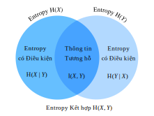

<!-- ===================== Bắt đầu dịch Phần 1 ==================== -->
<!-- ========================================= REVISE PHẦN 1 - BẮT ĐẦU =================================== -->

<!--
# Information Theory
-->

# Lý thuyết thông tin
:label:`sec_information_theory`

<!--
The universe is overflowing with information.
Information provides a common language across disciplinary rifts: from Shakespeare's Sonnet to researchers' paper on Cornell ArXiv,
from Van Gogh's printing Starry Night to Beethoven's music Symphony No. 5, 
from the first programming language Plankalkül to the state-of-the-art machine learning algorithms.
Everything must follow the rules of information theory, no matter the format.
With information theory, we can measure and compare how much information is present in different signals.
In this section, we will investigate the fundamental concepts of information theory and applications of information theory in machine learning.
-->

Chúng ta đang sống trong kỷ nguyên tràn ngập thông tin.
Thông tin cung cấp một ngôn ngữ chung cho các lĩnh vực: từ thơ của Shakespeare đến các bài báo khoa học của các nhà nghiên cứu trên Cornell ArXiv,
từ bản in Đêm Đầy Sao của Van Gogh đến Bản Giao Hưởng Số 5 của Beethoven,
từ ngôn ngữ lập trình đầu tiên Plankalkül đến các thuật toán học máy hiện đại nhất.
Mọi thứ phải tuân theo các quy tắc của lý thuyết thông tin, bất kể chúng ở định dạng nào.
Với lý thuyết thông tin, chúng ta có thể đo lường và so sánh lượng thông tin có trong các tín hiệu khác nhau.
Trong phần này, chúng ta sẽ nghiên cứu các khái niệm cơ bản của lý thuyết thông tin và các ứng dụng của lý thuyết thông tin trong học máy.


<!--
Before we get started, let us outline the relationship between machine learning and information theory.
Machine learning aims to extract interesting signals from data and make critical predictions.
On the other hand, information theory studies encoding, decoding, transmitting, and manipulating information.
As a result, information theory provides fundamental language for discussing the information processing in machine learned systems.
For example, many machine learning applications use the cross entropy loss as described in :numref:`sec_softmax`.
This loss can be directly derived from information theoretic considerations. 
-->

Trước khi bắt đầu, chúng ta hãy phác thảo mối quan hệ giữa học máy và lý thuyết thông tin.
Học máy nhằm mục đích trích xuất các đặc trưng thú vị từ dữ liệu và đưa ra các dự đoán quan trọng.
Mặt khác, lý thuyết thông tin nghiên cứu mã hóa, giải mã, truyền và thao tác thông tin.
Kết quả là, lý thuyết thông tin cung cấp ngôn ngữ cơ bản để thảo luận về việc xử lý thông tin trong các hệ thống học máy.
Ví dụ: nhiều ứng dụng học máy sử dụng mất mát entropy chéo như được mô tả trong :numref:`sec_softmax`.
Mất mát này có thể trực tiếp bắt nguồn từ lý thuyết thông tin.


<!--
## Information
-->

## Thông tin


<!-- 
Let us start with the "soul" of information theory: information.
*Information* can be encoded in anything with a particular sequence of one or more encoding formats.
Suppose that we task ourselves with trying to define a notion of information.
What could be our starting point?  
-->

Ta hãy bắt đầu với "linh hồn" của lý thuyết thông tin: thông tin.
*Thông tin* có thể được mã hóa vào bất kỳ điều gì với một hoặc nhiều chuỗi định dạng mã hóa.
Giả sử rằng chúng ta tự đặt nhiệm vụ cố gắng xác định một khái niệm thông tin.
Điểm xuất phát của chúng ta có thể là gì?


<!--
Consider the following thought experiment.
We have a friend with a deck of cards.
They will shuffle the deck, flip over some cards, and tell us statements about the cards.
We will try to assess the information content of each statement.
-->

Hãy xem xét thí nghiệm suy nghĩ sau đây.
Ta có một người bạn với một bộ bài.
Họ sẽ xáo trộn bộ bài, lật qua một số lá bài và cho chúng ta biết vài điều về các quân bài.
Chúng ta sẽ cố gắng đánh giá nội dung thông tin của từng câu nói.

<!--
First, they flip over a card and tell us, "I see a card."
This provides us with no information at all.
We were already certain that this was the case so we hope the information should be zero.
-->

Đầu tiên, họ lật một lá và nói, "Tôi thấy một lá bài."
Điều này không cung cấp cho ta thông tin nào.
Nên chúng ta hy vọng thông tin sẽ là 0.


<!--
Next, they flip over a card and say, "I see a heart."
This provides us some information, but in reality there are only $4$ different suits that were possible, each equally likely, so we are not surprised by this outcome.
We hope that whatever the measure of information, this event should have low information content.
-->

Tiếp theo, họ lật một lá khác và nói, "Tôi thấy một lá cơ."
Điều này cung cấp cho ta một số thông tin, nhưng trên thực tế chỉ có thể có $4$ chất khác nhau , mỗi chất đều có khả năng như nhau, vì vậy ta không ngạc nhiên trước kết quả này.
Ta hy vọng rằng với bất kể hình thức đo đạc thông tin nào, sự kiện này nên có hàm lượng thông tin thấp.


<!--
Next, they flip over a card and say, "This is the $3$ of spades." This is more information.
Indeed there were $52$ equally likely possible outcomes, and our friend told us which one it was. This should be a medium amount of information.
-->

Tiếp theo, họ lật một lá và nói, "Đây là quân $3$ bích.". Có thêm thông tin.
Quả thực có $52$ kết quả tương đương có thể xảy ra, và ta cho biết đó là kết quả nào. Đây là một lượng thông tin trung bình.


<!-- ===================== Kết thúc dịch Phần 1 ===================== -->

<!-- ===================== Bắt đầu dịch Phần 2 ===================== -->

<!--
Let us take this to the logical extreme.
Suppose that finally they flip over every card from the deck and read off the entire sequence of the shuffled deck.
There are $52!$ different orders to the deck, again all equally likely, so we need a lot of information to know which one it is.
-->

Hãy đi đến cực hạn.
Giả sử rằng cuối cùng người kia lật từng lá bài từ bộ bài và đọc ra toàn bộ trình tự của bộ bài đã bị xáo trộn đó.
Có $52!$ các thứ tự khác nhau cho bộ bài, một lần nữa tất cả đều có khả năng như nhau, vì vậy chúng ta có được rất nhiều thông tin từ câu nói trên.


<!--
Any notion of information we develop must conform to this intuition.
Indeed, in the next sections we will learn how to compute that these events have $0\text{ bits}$, 
$2\text{ bits}$, $~5.7\text{ bits}$, and $~225.6\text{ bits}$ of information respectively.
-->

Bất kỳ khái niệm thông tin nào chúng ta phát triển phải phù hợp với trực giác này.
Thật vậy, trong phần tiếp theo, chúng ta sẽ học cách tính toán rằng các sự kiện trên có $0\text{ bit}$, 
$2\text{ bit}$, $~5.7\text{ bit}$, và $~225.6\text{ bit}$ của thông tin tương ứng.


<!--
If we read through these thought experiments, we see a natural idea.
As a starting point, rather than caring about the knowledge, 
we may build off the idea that information represents the degree of surprise or the abstract possibility of the event.
For example, if we want to describe an unusual event, we need a lot information. 
For a common event, we may not need much information.
-->

Nếu chúng ta đọc qua những thí nghiệm suy nghĩ này, chúng ta thấy một ý tưởng tự nhiên.
Như một điểm khởi đầu, thay vì quan tâm đến kiến thức,
chúng ta có thể xây dựng ý tưởng rằng thông tin đại diện cho mức độ bất ngờ hoặc xác suất trừu tượng của sự kiện.
Ví dụ, nếu chúng ta muốn mô tả một sự kiện bất thường, chúng ta cần rất nhiều thông tin.
Đối với một sự kiện thông thường, chúng ta có thể không cần nhiều thông tin.


<!--
In 1948, Claude E. Shannon published *A Mathematical Theory of Communication* :cite:`Shannon.1948` establishing the theory of information.
In his article, Shannon introduced the concept of information entropy for the first time. We will begin our journey here.
-->

Năm 1948, Claude E. Shannon xuất bản *Lý thuyết Toán học về Truyền tin - A Mathematical Theory of Communication* :cite:`Shannon.1948` thiết lập lý thuyết thông tin.
Trong bài báo của mình, Shannon lần đầu tiên giới thiệu khái niệm entropy thông tin. Chúng ta sẽ bắt đầu tại đây.


<!--
### Self-information
-->

### Lượng tin


<!--
Since information embodies the abstract possibility of an event, how do we map the possibility to the number of bits?
Shannon introduced the terminology *bit* as the unit of information, which was originally created by John Tukey.
So what is a "bit" and why do we use it to measure information? Historically, an antique transmitter can only send or receive two types of code: $0$ and $1$.
Indeed, binary encoding is still in common use on all modern digital computers.
In this way, any information is encoded by a series of $0$ and $1$.
And hence, a series of binary digits of length $n$ contains $n$ bits of information.
-->

Vì thông tin biểu diễn xác suất trừu tượng của một sự kiện, làm thế nào để chúng ta ánh xạ xác suất đó với số lượng bit?
Shannon đã giới thiệu thuật ngữ *bit* làm đơn vị thông tin, thuật ngữ này ban đầu được tạo ra bởi John Tukey.
Vậy "bit" là gì và tại sao chúng ta sử dụng nó để đo lường thông tin? Trong lịch sử, một máy phát cổ chỉ có thể gửi hoặc nhận hai loại mã: $0$ và $1$.
Thật vậy, mã hóa nhị phân vẫn được sử dụng phổ biến trên tất cả các máy tính kỹ thuật số hiện đại.
Bằng cách này, bất kỳ thông tin nào cũng được mã hóa bởi một chuỗi $0$ và $1$.
Và do đó, một chuỗi các chữ số nhị phân có độ dài $n$ chứa $n$ bit thông tin.


<!--
Now, suppose that for any series of codes, each $0$ or $1$ occurs with a probability of $\frac{1}{2}$.
Hence, an event $X$ with a series of codes of length $n$, occurs with a probability of $\frac{1}{2^n}$.
At the same time, as we mentioned before, this series contains $n$ bits of information.
So, can we generalize to a math function which can transfer the probability $p$ to the number of bits?
Shannon gave the answer by defining *self-information*
-->

Bây giờ, giả sử rằng đối với bất kỳ chuỗi mã nào, $0$ hoặc $1$ xuất hiện với xác suất là $\frac{1}{2}$.
Do đó, sự kiện $X$ với một chuỗi mã có độ dài $n$, xảy ra với xác suất $\frac{1}{2^n}$.
Đồng thời, như chúng tôi đã đề cập trước đây, chuỗi số này chứa $n$ bit thông tin.
Vì vậy, liệu có thể tổng quát hóa thành một hàm toán học ánh xạ xác suất $p$ thành số bit không?
Shannon đưa ra câu trả lời bằng cách định nghĩa *lượng tin*


$$I(X) = - \log_2 (p),$$


<!--
as the *bits* of information we have received for this event $X$.
Note that we will always use base-2 logarithms in this section.
For the sake of simplicity, the rest of this section will omit the subscript 2 in the logarithm notation, i.e., $\log(.)$ always refers to $\log_2(.)$.
For example, the code "0010" has a self-information
-->

như là các *bit* thông tin ta đã nhận cho sự kiện $X$ này. 
Lưu ý rằng ta sẽ luôn sử dụng logarit cơ số 2 trong phần này.
Để đơn giản, phần còn lại của phần này sẽ bỏ qua chỉ số phụ 2 trong ký hiệu logarit, tức là $\log(.)$ luôn có nghĩa là $\log_2(.)$.
Ví dụ: mã "0010" có thông tin tự thân


$$I(\text{"0010"}) = - \log (p(\text{"0010"})) = - \log \left( \frac{1}{2^4} \right) = 4 \text{ bits}.$$


<!--
We can calculate self information as shown below.
Before that, let us first import all the necessary packages in this section.
-->

Chúng ta có thể tính toán lượng tin như hình dưới đây.
Trước đó, hãy nhập tất cả các gói cần thiết trong phần này.

<!-- ===================== Kết thúc dịch Phần 2 ===================== -->


```{.python .input}
from mxnet import np
from mxnet.metric import NegativeLogLikelihood
from mxnet.ndarray import nansum
import random

def self_information(p):
    return -np.log2(p)

self_information(1 / 64)
```

```{.python .input}
#@tab pytorch
import torch
from torch.nn import NLLLoss

def nansum(x):
    # Define nansum, as pytorch doesn't offer it inbuilt.
    return x[~torch.isnan(x)].sum()

def self_information(p):
    return -torch.log2(torch.tensor(p)).item()

self_information(1 / 64)
```

```{.python .input}
#@tab tensorflow
import tensorflow as tf

def log2(x):
    return tf.math.log(x) / tf.math.log(2.)

def nansum(x):
    return tf.reduce_sum(tf.where(tf.math.is_nan(
        x), tf.zeros_like(x), x), axis=-1)

def self_information(p):
    return -log2(tf.constant(p)).numpy()

self_information(1 / 64)
```


<!-- ===================== Bắt đầu dịch Phần 3 ===================== -->


<!--
## Entropy 
-->

## Entropy


<!--
As self-information only measures the information of a single discrete event, 
we need a more generalized measure for any random variable of either discrete or continuous distribution. 
-->

Do lượng tin (*self-information*) chỉ đo lường thông tin từ một biến cố rời rạc đơn lẻ, chúng ta cần một thước đo khái quát hơn cho một biến ngẫu nhiên cả liên tục và không liên tục bất kỳ.

<!-- ========================================= REVISE PHẦN 1 - KẾT THÚC ===================================-->

<!-- ========================================= REVISE PHẦN 2 - BẮT ĐẦU ===================================-->

<!--
### Motivating Entropy
-->

### Nguồn gốc phát triển của Entropy


<!--
Let us try to get specific about what we want.  This will be an informal statement of what are known as the *axioms of Shannon entropy*.
It will turn out that the following collection of common-sense statements force us to a unique definition of information.
A formal version of these axioms, along with several others may be found in :cite:`Csiszar.2008`.
-->

Hãy thử phân tích cụ thể hơn điều chúng ta muốn. Đây sẽ là một phát biểu không chính thức về cái mà được biết đến dưới tên gọi là *các tiên đề của entropy Shannon*.
Hoá ra những phát biểu quen thuộc sau đây buộc chúng ta phải đi tới một định nghĩa độc nhất về thông tin.
Một phiên bản chính quy của những tiên đề này cùng với một số tiên đề khác có thể được tìm thấy trong :cite:`Csiszar.2008`.


<!--
1.  The information we gain by observing a random variable does not depend on what we call the elements, or the presence of additional elements which have probability zero.
2.  The information we gain by observing two random variables is no more than the sum of the information we gain by observing them separately.
If they are independent, then it is exactly the sum.
3.  The information gained when observing (nearly) certain events is (nearly) zero.
-->

1. Thông tin chúng ta thu được bằng cách quan sát một biến ngẫu nhiên không phụ thuộc vào các yếu tố, hay sự xuất hiện của các yếu tố bổ sung mà có xác suất bằng 0.
2. Thông tin chúng ta thu được bằng cách quan sát hai biến ngẫu nhiên không lớn hơn tổng thông tin chúng ta thu được bằng cách quan sát chúng một cách riêng rẽ.
Nếu chúng độc lập thì thông tin thu được từ hai cách đều bằng nhau.
3. Thông tin thu được khi quan sát những biến cố (gần như) chắc chắn thì (gần như) bằng 0.


<!--
While proving this fact is beyond the scope of our text, it is important to know that this uniquely determines the form that entropy must take.
The only ambiguity that these allow is in the choice of fundamental units, which is most often normalized by making the choice 
we saw before that the information provided by a single fair coin flip is one bit.
-->

Việc chứng minh các điều trên nằm ngoài phạm vi của quyển sách này, nhưng điều quan trọng cần phải biết là các mệnh đề trên xác định độc nhất hình thái mà entropy phải có.
Chỉ có duy nhất một điều không xác định từ những phát biểu trên là về việc chọn các đơn vị cơ bản, mà điều này thường được chuẩn hoá bằng cách đặt thông tin cung cấp bởi một lần lật đồng xu công bằng là một bit, như ta đã thấy ở trước đó. 


<!--
### Definition
-->

### Định nghĩa


<!--
For any random variable $X$ that follows a probability distribution $P$ with a probability density function (p.d.f.) or 
a probability mass function (p.m.f.) $p(x)$, we measure the expected amount of information through *entropy* (or *Shannon entropy*)
-->

Cho bất cứ một biến ngẫu nhiên $X$ tuân theo phân phối xác suất $P$ với hàm mật độ xác suất (p.d.f) hoặc hàm khối xác suất (p.m.f) $p(x)$, chúng ta đo lượng thông tin kỳ vọng thu được thông qua *entropy* (hoặc *Shannon entropy*)


$$H(X) = - E_{x \sim P} [\log p(x)].$$
:eqlabel:`eq_ent_def`


<!--
To be specific, if $X$ is discrete, 
-->

Cụ thể hơn, nếu $X$ rời rạc,


$$H(X) = - \sum_i p_i \log p_i \text{, where } p_i = P(X_i).$$ 


<!--
Otherwise, if $X$ is continuous, we also refer entropy as *differential entropy* 
-->

Ngược lại, nếu $X$ liên tục, chúng ta gọi entropy là *entropy vi phân* (*differential entropy*)


$$H(X) = - \int_x p(x) \log p(x) \; dx.$$


<!--
We can define entropy as below.
-->

Chúng ta có thể định nghĩa entropy như sau.


```{.python .input}
def entropy(p):
    entropy = - p * np.log2(p)
    # Operator nansum will sum up the non-nan number
    out = nansum(entropy.as_nd_ndarray())
    return out

entropy(np.array([0.1, 0.5, 0.1, 0.3]))
```

```{.python .input}
#@tab pytorch
def entropy(p):
    entropy = - p * torch.log2(p)
    # Operator nansum will sum up the non-nan number
    out = nansum(entropy)
    return out

entropy(torch.tensor([0.1, 0.5, 0.1, 0.3]))
```

```{.python .input}
#@tab tensorflow
def entropy(p):
    return nansum(- p * log2(p))

entropy(tf.constant([0.1, 0.5, 0.1, 0.3]))
```

<!-- ===================== Kết thúc dịch Phần 3 ===================== -->

<!-- ===================== Bắt đầu dịch Phần 4 ===================== -->

<!--
### Interpretations
-->

### Diễn giải


<!--
You may be curious: in the entropy definition :eqref:`eq_ent_def`, why do we use an expectation of a negative logarithm? Here are some intuitions.
-->

Bạn có thể thắc mắc: trong định nghĩa entropy :eqref:`eq_ent_def`, tại sao chúng ta sử dụng kỳ vọng của logarit âm? Đây là một số cách giải thích trực quan.


<!--
First, why do we use a *logarithm* function $\log$?
Suppose that $p(x) = f_1(x) f_2(x) \ldots, f_n(x)$, where each component function $f_i(x)$ is independent from each other.
This means that each $f_i(x)$ contributes independently to the total information obtained from $p(x)$.
As discussed above, we want the entropy formula to be additive over independent random variables.
Luckily, $\log$ can naturally turn a product of probability distributions to a summation of the individual terms.
-->

Đầu tiên, tại sao chúng ta sử dụng hàm *logarit* $\log$?
Giả sử $p(x) = f_1(x) f_2(x) \ldots, f_n(x)$, khi mỗi hàm thành tố $f_i(x)$ độc lập lẫn nhau.
Điều này nghĩa là mỗi $f_i(x)$ đóng góp một cách độc lập vào tổng thông tin thu được từ $p(x)$.
Như đã thảo luận ở trên, chúng ta muốn một công thức entropy là phép cộng trên các biến ngẫu nhiên độc lập.
May mắn thay, $\log$ có thể chuyển tích các phân phối xác suất thành một tổng.


<!--
Next, why do we use a *negative* $\log$? Intuitively, more frequent events should contain less information than less common events, 
since we often gain more information from an unusual case than from an ordinary one.
However, $\log$ is monotonically increasing with the probabilities, and indeed negative for all values in $[0, 1]$.
We need to construct a monotonically decreasing relationship between the probability of events and their entropy,
which will ideally be always positive (for nothing we observe should force us to forget what we have known).
Hence, we add a negative sign in front of $\log$ function.
-->

Tiếp theo, tại sao chúng ta sử dụng $\log$ *âm*? Một cách trực giác, những biến cố xảy ra thường xuyên hơn chứa ít thông tin hơn những biến cố thông thường bởi vì chúng ta thường thu được nhiều thông tin hơn từ những trường hợp bất thường hơn là những trường hợp bình thường.
Tuy nhiên, $\log$ đơn điệu đồng biến với xác suất, và có giá trị âm trong đoạn $[0, 1]$.
Chúng ta cần thiết lập mối quan hệ đơn điệu nghịch biến giữa xác suất của biến cố và entropy của chúng, những giá trị luôn luôn dương (vì các quan sát mới không nên buộc chúng ta phải quên đi những gì đã biết).
Vậy nên, chúng ta thêm dấu trừ vào trước hàm $\log$.


<!--
Last, where does the *expectation* function come from? Consider a random variable $X$.
We can interpret the self-information ($-\log(p)$) as the amount of *surprise* we have at seeing a particular outcome.
Indeed, as the probability approaches zero, the surprise becomes infinite.
Similarly, we can interpret the entropy as the average amount of surprise from observing $X$.
For example, imagine that a slot machine system emits statistical independently symbols ${s_1, \ldots, s_k}$ with probabilities ${p_1, \ldots, p_k}$ respectively.
Then the entropy of this system equals to the average self-information from observing each output, i.e.,
-->

Cuối cùng, hàm *kỳ vọng* đến từ đâu? Xét một biến ngẫu nhiên $X$.
Chúng ta có thể diễn giải hàm lượng thông tin (*self-information*) ($-\log(p)$) như mức độ *bất ngờ* khi chúng ta thấy một kết quả cụ thể nào đó.
Thật vậy, khi xác suất xấp xỉ bằng 0, mức độ bất ngờ tiến tới vô cực.
Tương tự, chúng ta có thể diễn giải entropy như mức độ bất ngờ trung bình từ việc quan sát $X$.
Ví dụ, tưởng tượng một hệ thống máy đánh bạc đưa ra các ký hiệu độc lập ${s_1, \ldots, s_k}$ với xác suất lần lượt là ${p_1, \ldots, p_k}$. 
Khi đó, entropy của hệ thống này bằng với hàm lượng thông tin trung bình thu được từ việc quan sát mỗi kết quả, tức:


$$H(S) = \sum_i {p_i \cdot I(s_i)} = - \sum_i {p_i \cdot \log p_i}.$$

<!-- ===================== Kết thúc dịch Phần 4 ===================== -->

<!-- ===================== Bắt đầu dịch Phần 5 ===================== -->

<!--
### Properties of Entropy
-->

### Tính chất của Entropy


<!--
By the above examples and interpretations, we can derive the following properties of entropy :eqref:`eq_ent_def`.
Here, we refer to $X$ as an event and $P$ as the probability distribution of $X$.
-->

Bằng các ví dụ và diễn giải phía trên, ta có thể rút ra các tính chất sau của entropy :eqref:`eq_ent_def`.
Ở đây, ta xem $X$ là một biến cố và $P$ là phân phối xác suất của $X$.

<!--
* Entropy is non-negative, i.e., $H(X) \geq 0, \forall X$.
* If $X \sim P$ with a p.d.f. or a p.m.f. $p(x)$, and we try to estimate $P$ by a new probability distribution $Q$ with a p.d.f. or a p.m.f. $q(x)$, then 
$$H(X) = - E_{x \sim P} [\log p(x)] \leq  - E_{x \sim P} [\log q(x)], \text{ with equality if and only if } P = Q.$$
Alternatively, $H(X)$ gives a lower bound of the average number of bits needed to encode symbols drawn from $P$.
* If $X \sim P$, then $x$ conveys the maximum amount of information if it spreads evenly among all possible outcomes.
Specifically, if the probability distribution $P$ is discrete with $k$-class $\{p_1, \ldots, p_k \}$, then 
$$H(X) \leq \log(k), \text{ with equality if and only if } p_i = \frac{1}{k}, \forall i.$$
If $P$ is a continuous random variable, then the story becomes much more complicated.
However, if we additionally impose that $P$ is supported on a finite interval (with all values between $0$ and $1$), 
then $P$ has the highest entropy if it is the uniform distribution on that interval.
-->

* Entropy luôn có giá trị không âm, tức $H(X) \geq 0, \forall X$.
* Nếu $X \sim P$ với hàm mật độ xác suất hoặc hàm khối xác suất $p(x)$, và ta muốn ước lượng $P$ bằng một phân phối xác suất mới $Q$ với hàm mật độ xác suất hoặc hàm khối xác suất $q(x)$, ta sẽ có
$$H(X) = - E_{x \sim P} [\log p(x)] \leq  - E_{x \sim P} [\log q(x)], \text{ dấu bằng xảy ra khi và chỉ khi } P = Q.$$
Ngoài ra, $H(X)$ còn là cận dưới của số bit trung bình cần dùng để mã hóa các giá trị lấy từ $P$.
* Nếu $X \sim P$, $x$ sẽ chứa lượng thông tin cực đại nếu thông tin được chia đều cho mọi biến cố khả dĩ.
Cụ thể, nếu phân phối xác suất $P$ là phân phối rời rạc với $k$ lớp $\{p_1, \ldots, p_k \}$, ta sẽ có 
$$H(X) \leq \log(k), \text{ dấu bằng xảy ra khi và chỉ khi } p_i = \frac{1}{k}, \forall i.$$
Nếu $P$ là một phân phối liên tục thì mọi thứ sẽ trở nên phức tạp hơn nhiều.
Tuy nhiên, nếu ta giả sử thêm rằng $P$ có miền giá trị nằm trong khoảng hữu hạn (giá trị nằm trong khoảng $0$ và $1$),
$P$ sẽ có entropy cực đại nếu nó là phân phối đều trong khoảng đó.

<!--
## Mutual Information
-->

## Thông tin Tương hỗ


<!--
Previously we defined entropy of a single random variable $X$, how about the entropy of a pair random variables $(X, Y)$?
We can think of these techniques as trying to answer the following type of question, 
"What information is contained in $X$ and $Y$ together compared to each separately?
Is there redundant information, or is it all unique?"
-->

Trước đó ta đã định nghĩa entropy của một biễn ngẫu nhiên duy nhất $X$, vậy còn entropy của một cặp biến ngẫu nhiên $(X,Y)$ thì sao?
Ta có thể xem những kỹ thuật này như lời giải cho câu hỏi sau:
"Thông tin chứa trong cả $X$ và $Y$ sẽ trông như thế nào so với thông tin trong từng biến?
Có thông tin thừa không, hay chúng đều độc nhất?"

<!--
For the following discussion, we always use $(X, Y)$ as a pair of random variables that follows 
a joint probability distribution $P$ with a p.d.f. or a p.m.f. $p_{X, Y}(x, y)$, while $X$ and $Y$ follow probability distribution $p_X(x)$ and $p_Y(y)$, respectively. 
-->

Trong phần bàn luận tiếp theo, chúng tôi sẽ luôn dùng $(X,Y)$ để ký hiệu cho một cặp biễn ngẫu nhiên tuân theo
phân phối xác suất đồng thời $P$ với hàm mật độ xác suất hoặc hàm khối xác suất $p_{X,Y}(x,y)$, còn $X$ và $Y$ lần lượt tuân theo phân phối xác suất $p_X(x)$ và $p_Y(y)$.

<!--
### Joint Entropy 
-->

### Entropy Đồng thời


<!--
Similar to entropy of a single random variable :eqref:`eq_ent_def`, we define the *joint entropy* $H(X, Y)$ of a pair random variables $(X, Y)$ as
-->

Tương tự như entropy của một biến ngẫu nhiên duy nhất :eqref:`eq_ent_def`, ta định nghĩa *entropy đồng thời* (*joint entropy*) $H(X,Y)$ của một cặp biến ngẫu nhiên $(X,Y)$ như sau

$$H(X, Y) = −E_{(x, y) \sim P} [\log p_{X, Y}(x, y)]. $$
:eqlabel:`eq_joint_ent_def`


<!--
Precisely, on the one hand, if $(X, Y)$ is a pair of discrete random variables, then 
-->

Cụ thể ở một mặt, nếu $(X,Y)$ là một cặp biến ngẫu nhiên rời rạc thì

$$H(X, Y) = - \sum_{x} \sum_{y} p_{X, Y}(x, y) \log p_{X, Y}(x, y).$$


<!--
On the other hand, if $(X, Y)$ is a pair of continuous random variables, then we define the *differential joint entropy* as 
-->

Mặt khác, nếu $(X,Y)$ là một cặp biến ngẫu nhiên liên tục, ta định nghĩa *entropy đồng thời vi phân* như sau


$$H(X, Y) = - \int_{x, y} p_{X, Y}(x, y) \ \log p_{X, Y}(x, y) \;dx \;dy.$$

<!-- ===================== Kết thúc dịch Phần 5 ===================== -->

<!-- ===================== Bắt đầu dịch Phần 6 ===================== -->

<!--
We can think of :eqref:`eq_joint_ent_def` as telling us the total randomness in the pair of random variables.
As a pair of extremes, if $X = Y$ are two identical random variables, then the information in the pair is exactly the information in one and we have $H(X, Y) = H(X) = H(Y)$.
On the other extreme, if $X$ and $Y$ are independent then $H(X, Y) = H(X) + H(Y)$.
Indeed we will always have that the information contained in a pair of random variables is no smaller than the entropy of either random variable and no more than the sum of both.
-->

Ta có thể xem :eqref:`eq_joint_ent_def` như tổng sự ngẫu nhiên của cặp biến ngẫu nhiên.
Ở một cực, nếu $X = Y$ là hai biến ngẫu nhiên giống hệt nhau, thông tin trong cặp biến này chính là thông tin của từng biến và ta sẽ có $H(X,Y) = H(X) = H(Y)$.
Ở cực còn lại, nếu $X$ và $Y$ độc lập thì $H(X,Y) = H(X) + H(Y)$.
Tất nhiên, thông tin chứa đựng trong một cặp biến ngẫu nhiên sẽ không thể nhỏ hơn entropy của từng biến ngẫu nhiên và không thể lớn hơn tổng entropy của cả hai.

$$
H(X), H(Y) \le H(X, Y) \le H(X) + H(Y).
$$


<!--
Let us implement joint entropy from scratch.
-->

Hãy cùng lập trình entropy đồng thời từ đầu.

```{.python .input}
def joint_entropy(p_xy):
    joint_ent = -p_xy * np.log2(p_xy)
    # Operator nansum will sum up the non-nan number
    out = nansum(joint_ent.as_nd_ndarray())
    return out

joint_entropy(np.array([[0.1, 0.5], [0.1, 0.3]]))
```

```{.python .input}
#@tab pytorch
def joint_entropy(p_xy):
    joint_ent = -p_xy * torch.log2(p_xy)
    # nansum will sum up the non-nan number
    out = nansum(joint_ent)
    return out

joint_entropy(torch.tensor([[0.1, 0.5], [0.1, 0.3]]))
```

```{.python .input}
#@tab tensorflow
def joint_entropy(p_xy):
    joint_ent = -p_xy * log2(p_xy)
    # nansum will sum up the non-nan number
    out = nansum(joint_ent)
    return out

joint_entropy(tf.constant([[0.1, 0.5], [0.1, 0.3]]))
```


<!--
Notice that this is the same *code* as before, but now we interpret it differently as working on the joint distribution of the two random variables.
-->

Hãy để ý rằng đây chính là *đoạn mã* từ trước, nhưng giờ ta hiểu nó theo cách khác bởi nó đang làm việc với phân phối đồng thời của hai biến ngẫu nhiên.

<!-- ========================================= REVISE PHẦN 2 - KẾT THÚC ===================================-->

<!-- ========================================= REVISE PHẦN 3 - BẮT ĐẦU ===================================-->

<!--
### Conditional Entropy
-->

### Entropy có Điều kiện


<!--
The joint entropy defined above the amount of information contained in a pair of random variables.
This is useful, but oftentimes it is not what we care about. Consider the setting of machine learning.
Let us take $X$ to be the random variable (or vector of random variables) that describes the pixel values of an image, and $Y$ to be the random variable which is the class label.
$X$ should contain substantial information---a natural image is a complex thing.
However, the information contained in $Y$ once the image has been show should be low.
Indeed, the image of a digit should already contain the information about what digit it is unless the digit is illegible.
Thus, to continue to extend our vocabulary of information theory, we need to be able to reason about the information content in a random variable conditional on another.
-->

Entropy đồng thời định nghĩa phía trên là lượng thông tin chứa đựng trong một cặp biến ngẫu nhiên.
Đại lượng này khá hữu ích, nhưng thường nó không phải là thứ mà ta quan tâm. Hãy xem xét trong ngữ cảnh học máy.
Gọi $X$ là biến ngẫu nhiên (hoặc vector biến ngẫu nhiên) mô tả giá trị các điểm ảnh trong một bức ảnh, và $Y$ là biến ngẫu nhiên mô tả nhãn lớp.
$X$ nên chứa một lượng thông tin rất lớn---một bức ảnh tự nhiên là một thứ khá phức tạp.
Tuy nhiên, lượng thông tin chứa đựng trong $Y$ nên nhỏ một khi ta đã thấy bức ảnh.
Tất nhiên, bức ảnh chứa một chữ số cũng nên chứa thông tin về việc đó là chữ số nào, trừ khi chữ số trong ảnh không thể đọc được.
Vì vậy, để tiếp tục mở rộng kho từ vựng về lý thuyết thông tin, ta cần phải suy luận được lượng thông tin trong một biến ngẫu nhiên khi nó phụ thuộc vào một biến khác.

<!--
In the probability theory, we saw the definition of the *conditional probability* to measure the relationship between variables.
We now want to analogously define the *conditional entropy* $H(Y \mid X)$.  We can write this as 
-->

Trong lý thuyết xác suất, ta đã thấy định nghĩa của *xác suất có điều kiện* dùng để đo lường mối quan hệ giữa các biến.
Bây giờ ta muốn định nghĩa *entropy có điều kiện* (*conditional entropy*) $H(Y \mid X)$ theo một cách tương tự. Ta có thể viết nó dưới dạng

$$ H(Y \mid X) = - E_{(x, y) \sim P} [\log p(y \mid x)],$$
:eqlabel:`eq_cond_ent_def`


<!--
where $p(y \mid x) = \frac{p_{X, Y}(x, y)}{p_X(x)}$ is the conditional probability.
Specifically, if $(X, Y)$ is a pair of discrete random variables, then 
-->

trong đó $p(y \mid x) = \frac{p_{X, Y}(x, y)}{p_X(x)}$ là xác suất có điều kiện.
Cụ thể, nếu $(X,Y)$ là một cặp biến ngẫu nhiên rời rạc, ta có

$$H(Y \mid X) = - \sum_{x} \sum_{y} p(x, y) \log p(y \mid x).$$


<!--
If $(X, Y)$ is a pair of continuous random variables, then the *differential conditional entropy* is similarly defined as 
-->

Nếu $(X,Y)$ là một cặp biến ngẫu nhiên liện tục, *entropy có điều kiện vi phân* được định nghĩa tương tự như sau

$$H(Y \mid X) = - \int_x \int_y p(x, y) \ \log p(y \mid x) \;dx \;dy.$$


<!--
It is now natural to ask, how does the *conditional entropy* $H(Y \mid X)$ relate to the entropy $H(X)$ and the joint entropy $H(X, Y)$?
Using the definitions above, we can express this cleanly:
-->

Bây giờ một câu hỏi tự nhiên là: *entropy có điều kiện* $H(Y \mid X)$ có mối quan hệ gì với entropy $H(X)$ và entropy đồng thời $H(X,Y)$?
Sử dụng các định nghĩa ở trên, ta có thể biểu diễn mối quan hệ đó một cách gọn gàng:

$$H(Y \mid X) = H(X, Y) - H(X).$$

<!-- ===================== Kết thúc dịch Phần 6 ===================== -->

<!-- ===================== Bắt đầu dịch Phần 7 ===================== -->

<!--
This has an intuitive interpretation: the information in $Y$ given $X$ ($H(Y \mid X)$) is the same as 
the information in both $X$ and $Y$ together ($H(X, Y)$) minus the information already contained in $X$.
This gives us the information in $Y$ which is not also represented in $X$.  
-->

Điều này có thể được giải thích một cách trực quan như sau: thông tin trong $Y$ khi biết $X$ ($H(Y \mid X)$) bằng với thông tin trong cả $X$ và $Y$ ($H(X, Y)$) trừ đi thông tin đã có trong $X$.
Nó cho ta biết thông tin có trong $Y$ mà không hiển thị trong $X$.

<!--
Now, let us implement conditional entropy :eqref:`eq_cond_ent_def` from scratch.
-->

Bây giờ, hãy cùng lập trình entropy có điều kiện :eqref:`eq_cond_ent_def` từ đầu.


```{.python .input}
def conditional_entropy(p_xy, p_x):
    p_y_given_x = p_xy/p_x
    cond_ent = -p_xy * np.log2(p_y_given_x)
    # Operator nansum will sum up the non-nan number
    out = nansum(cond_ent.as_nd_ndarray())
    return out

conditional_entropy(np.array([[0.1, 0.5], [0.2, 0.3]]), np.array([0.2, 0.8]))
```

```{.python .input}
#@tab pytorch
def conditional_entropy(p_xy, p_x):
    p_y_given_x = p_xy/p_x
    cond_ent = -p_xy * torch.log2(p_y_given_x)
    # nansum will sum up the non-nan number
    out = nansum(cond_ent)
    return out

conditional_entropy(torch.tensor([[0.1, 0.5], [0.2, 0.3]]), 
                    torch.tensor([0.2, 0.8]))
```

```{.python .input}
#@tab tensorflow
def conditional_entropy(p_xy, p_x):
    p_y_given_x = p_xy/p_x
    cond_ent = -p_xy * log2(p_y_given_x)
    # nansum will sum up the non-nan number
    out = nansum(cond_ent)
    return out

conditional_entropy(tf.constant([[0.1, 0.5], [0.2, 0.3]]),
                    tf.constant([0.2, 0.8]))
```


<!--
### Mutual Information
-->

### Thông tin Tương hỗ


<!--
Given the previous setting of random variables $(X, Y)$, you may wonder: "Now that we know how much information is contained in $Y$ but not in $X$, 
can we similarly ask how much information is shared between $X$ and $Y$?" The answer will be the *mutual information* of $(X, Y)$, which we will write as $I(X, Y)$.  
-->

Với định nghĩa trước đó về các biến ngẫu nhiên $(X, Y)$, bạn có thể tự hỏi:" Giờ đây ta biết có bao nhiêu thông tin nằm trong Y nhưng không nằm ở trong X,
liệu chúng ta có thể biết được có bao nhiêu thông tin giống nhau giữa $X$ và $Y$ không?". Đáp án cho câu hỏi trên chính là *thông tin tương hỗ* của $(X, Y)$, hay còn được viết dưới dạng $I(X, Y)$.


<!--
Rather than diving straight into the formal definition, let us practice our intuition by first trying to derive an expression 
for the mutual information entirely based on terms we have constructed before.
We wish to find the information shared between two random variables.
One way we could try to do this is to start with all the information contained in both $X$ and $Y$ together, 
and then we take off the parts that are not shared.
The information contained in both $X$ and $Y$ together is written as $H(X, Y)$.
We want to subtract from this the information contained in $X$ but not in $Y$, and the information contained in $Y$ but not in $X$.
As we saw in the previous section, this is given by $H(X \mid Y)$ and $H(Y \mid X)$ respectively.
Thus, we have that the mutual information should be
-->

Thay vì đề cập ngay đến định nghĩa chính thức, hãy cùng luyện tập trực giác của chúng ta bằng cách suy luận biểu thức thông tin tương hỗ dựa trên những khái niệm mà chúng ta đã xây dựng trước đó. 
Mục tiêu của chúng ta là tìm được thông tin giống nhau giữa hai biến ngẫu nhiên. 
Một cách mà chúng ta có thể thử đó là bắt đầu với tất cả những thông tin chứa trong cả biến $X$ and $Y$,
sau đó bỏ đi những phần không giống nhau. 
Thông tin chứa trong cả $X$ and $Y$ được viết dưới dạng $H(X, Y)$.
Ta muốn lược bỏ đi thông tin nằm trong $X$ nhưng không nằm trong $Y$, cũng như thông tin nằm trong $Y$ nhưng không nằm trong $X$.
Như chúng ta đã thấy trong mục trước, chúng được biểu diễn lần lượt là H(X \mid Y)$ và $H(Y \mid X)$.
Do đó, ta có thông tin tương hỗ được tính như sau


$$
I(X, Y) = H(X, Y) - H(Y \mid X) − H(X \mid Y).
$$


<!--
Indeed, this is a valid definition for the mutual information.
If we expand out the definitions of these terms and combine them, a little algebra shows that this is the same as
-->

Thật vậy, đây là định nghĩa hợp lệ của thông tin tương hỗ. Mở rộng thêm định nghĩa của các khái niệm đó rồi tổng hợp lại, ta có biểu thức đại số tương tự sau


$$I(X, Y) = E_{x} E_{y} \left\{ p_{X, Y}(x, y) \log\frac{p_{X, Y}(x, y)}{p_X(x) p_Y(y)} \right\}. $$
:eqlabel:`eq_mut_ent_def` 


<!--
We can summarize all of these relationships in image :numref:`fig_mutual_information`.
It is an excellent test of intuition to see why the following statements are all also equivalent to $I(X, Y)$.
-->

Ta có thể rút gọn tất cả những mối quan hệ nêu trên ở hình :numref:`fig_mutual_information`. 
Đây là một bài kiểm tra trực giác tuyệt vời để hiểu được tại sao các mệnh đề sau đây đều tương đương với $I(X, Y)$.


* $H(X) − H(X \mid Y)$
* $H(Y) − H(Y \mid X)$
* $H(X) + H(Y) − H(X, Y)$


<!--

-->


:label:`fig_mutual_information`


<!--
In many ways we can think of the mutual information :eqref:`eq_mut_ent_def` as principled extension of correlation coefficient we saw in :numref:`sec_random_variables`.
This allows us to ask not only for linear relationships between variables, but for the maximum information shared between the two random variables of any kind.
-->

Theo nhiều cách ta có thể xem thông tin tương hỗ :eqref:`eq_mut_ent_def` như là phần mở rộng nguyên thủy của hệ số tương quan trong :numref:`sec_random_variables`.
Điều này cho phép chúng ta đặt câu hỏi không chỉ về mối quan hệ tuyến tính của các biến, mà còn cả lượng thông tin tối đa mà hai biến bất kì chia sẻ với nhau. 


<!--
Now, let us implement mutual information from scratch.
-->

Bây giờ, hãy cùng lập trình thông tin tương hỗ từ đầu. 

<!-- ===================== Kết thúc dịch Phần 7 ===================== -->


```{.python .input}
def mutual_information(p_xy, p_x, p_y):
    p = p_xy / (p_x * p_y)
    mutual = p_xy * np.log2(p)
    # Operator nansum will sum up the non-nan number
    out = nansum(mutual.as_nd_ndarray())
    return out

mutual_information(np.array([[0.1, 0.5], [0.1, 0.3]]),
                   np.array([0.2, 0.8]), np.array([[0.75, 0.25]]))
```

```{.python .input}
#@tab pytorch
def mutual_information(p_xy, p_x, p_y):
    p = p_xy / (p_x * p_y)
    mutual = p_xy * torch.log2(p)
    # Operator nansum will sum up the non-nan number
    out = nansum(mutual)
    return out

mutual_information(torch.tensor([[0.1, 0.5], [0.1, 0.3]]),
                   torch.tensor([0.2, 0.8]), torch.tensor([[0.75, 0.25]]))
```

```{.python .input}
#@tab tensorflow
def mutual_information(p_xy, p_x, p_y):
    p = p_xy / (p_x * p_y)
    mutual = p_xy * log2(p)
    # Operator nansum will sum up the non-nan number
    out = nansum(mutual)
    return out

mutual_information(tf.constant([[0.1, 0.5], [0.1, 0.3]]),
                   tf.constant([0.2, 0.8]), tf.constant([[0.75, 0.25]]))
```


<!-- ===================== Bắt đầu dịch Phần 8 ===================== -->

<!--
### Properties of Mutual Information
-->

### Tính chất của Thông tin Tương Hỗ


<!--
Rather than memorizing the definition of mutual information :eqref:`eq_mut_ent_def`, you only need to keep in mind its notable properties:
-->

Thay vì phải ghi nhớ định nghĩa thông tin tương hỗ :eqref:`eq_mut_ent_def`, bạn chỉ cần lưu ý những đặc tính nổi trội của nó:


<!--
* Mutual information is symmetric, i.e., $I(X, Y) = I(Y, X)$.
* Mutual information is non-negative, i.e., $I(X, Y) \geq 0$.
* $I(X, Y) = 0$ if and only if $X$ and $Y$ are independent. For example, if $X$ and $Y$ are independent, 
then knowing $Y$ does not give any information about $X$ and vice versa, so their mutual information is zero.
* Alternatively, if $X$ is an invertible function of $Y$, then $Y$ and $X$ share all information and $$I(X, Y) = H(Y) = H(X).$$
-->

* Thông tin tương hỗ có tính đối xứng: $I(X, Y) = I(Y, X)$.
* Thông tin tương hỗ là giá trị không âm: $I(X, Y) \geq 0$.
* $I(X, Y) = 0$ khi và chỉ khi $X$ và $Y$ là hai biến độc lập. Ví dụ, nếu $X$ và $Y$ độc lập thì việc biết thông tin của $Y$ không cho ta thông tin của $X$ và ngược lại, do đó thông tin tương hỗ của chúng bằng 0. 
* Ngoài ra, nếu $X$ là hàm nghịch đảo của $Y$, thì $Y$ và $X$ có chung toàn bộ thông tin và $$I(X, Y) = H(Y) = H(X).$$

<!-- ========================================= REVISE PHẦN 3 - KẾT THÚC ===================================-->

<!-- ========================================= REVISE PHẦN 4 - BẮT ĐẦU ===================================-->


<!--
### Pointwise Mutual Information
-->

### Thông tin Tương hỗ theo từng Điểm


<!--
When we worked with entropy at the beginning of this chapter, we were able to provide an interpretation of $-\log(p_X(x))$ as how *surprised* we were with the particular outcome.
We may give a similar interpretation to the logarithmic term in the mutual information, which is often referred to as the *pointwise mutual information*:
-->

Khi bắt đầu làm việc với entropy ở phần đầu của chương này, chúng ta đã cung cấp được một cách diễn giải cho $-\log(p_X(x))$ như mức độ *ngạc nhiên* với kết quả cụ thể của biến ngẫu nhiên. 
Chúng ta có thể cung cấp một cách diễn giải tương tự với toán hạng logarit trong thông tin tương hỗ, thường được biết đến với cái tên *thông tin tương hỗ theo từng điểm*:


$$\mathrm{pmi}(x, y) = \log\frac{p_{X, Y}(x, y)}{p_X(x) p_Y(y)}.$$
:eqlabel:`eq_pmi_def`


<!--
We can think of :eqref:`eq_pmi_def` as measuring how much more or less likely 
the specific combination of outcomes $x$ and $y$ are compared to what we would expect for independent random outcomes.
If it is large and positive, then these two specific outcomes occur much more frequently than they would compared to random chance 
(*note*: the denominator is $p_X(x) p_Y(y)$ which is the probability of the two outcomes were independent), 
whereas if it is large and negative it represents the two outcomes happening far less than we would expect by random chance.  
-->

Chúng ta có thể nghĩ về biểu thức :eqref:`eq_pmi_def` như là một cách để đo lường mức tăng/giảm độ hợp lý giữa các tổ hợp đầu ra $x$ và $y$ so với những gì ta mong đợi ở các đầu ra ngẫu nhiên độc lập. 
Nếu kết quả lớn và là số dương, thì hai đầu ra cụ thể trên có xác suất xảy ra cao hơn nhiều so với xác suất được chia đều. 
(*chú ý: mẫu số $p_X(x) p_Y(y)$ là xác suất của hai đầu ra độc lập*),
ngược lại nếu kết quả lớn và là số âm, thì xác suất xảy ra của hai đầu ra cụ thể trên thấp hơn nhiều so với xác suất được chia đều.

<!--
This allows us to interpret the mutual information :eqref:`eq_mut_ent_def` as the average amount that 
we were surprised to see two outcomes occurring together compared to what we would expect if they were independent.
-->

Điều này cho phép chúng ta diễn giải thông tin tương hỗ :eqref:`eq_mut_ent_def` như là trung bình độ ngạc nhiên của chúng ta khi hai biến cố xảy ra đồng thời so với độ ngạc nhiên khi chúng là hai biến độc lập. 

<!-- ===================== Kết thúc dịch Phần 8 ===================== -->

<!-- ===================== Bắt đầu dịch Phần 9 ===================== -->

<!--
### Applications of Mutual Information
-->

### Ứng dụng Thông tin Tương hỗ


<!--
Mutual information may be a little abstract in it pure definition, so how does it related to machine learning? In natural language processing, 
one of the most difficult problems is the *ambiguity resolution*, or the issue of the meaning of a word being unclear from context.
For example, recently a headline in the news reported that "Amazon is on fire".
You may wonder whether the company Amazon has a building on fire, or the Amazon rain forest is on fire. 
-->

Thông tin tương hỗ có thể hơi trừu tượng theo định nghĩa thuần túy, vậy nó liên quan như thế nào đến học máy? Trong xử lý ngôn ngữ tự nhiên,
một trong những vấn đề khó khăn nhất là *giải quyết sự mơ hồ*, hoặc vấn đề về nghĩa của từ đang không rõ ràng so với ngữ cảnh.
Ví dụ, gần đây một tiêu đề trong bản tin thông báo rằng "Amazon đang cháy".
Bạn có thể tự hỏi là liệu công ty Amazon có một tòa nhà bị cháy, hay rừng Amazon đang bốc cháy.


<!--
In this case, mutual information can help us resolve this ambiguity.
We first find the group of words that each has a relatively large mutual information with the company Amazon, such as e-commerce, technology, and online.
Second, we find another group of words that each has a relatively large mutual information with the Amazon rain forest, such as rain, forest, and tropical.
When we need to disambiguate "Amazon", we can compare which group has more occurrence in the context of the word Amazon.
In this case the article would go on to describe the forest, and make the context clear.
-->

Trong trường hợp này, thông tin tương hỗ có thể giúp ta giải quyết sự mơ hồ này.
Đầu tiên, ta tìm nhóm từ mà mỗi từ có thông tin tương hỗ tương đối lớn tới công ty Amazon, chẳng hạn như thương mại điện tử, công nghệ và trực tuyến.
Thứ hai, ta tìm thấy một nhóm từ khác mà mỗi từ có một thông tin tương hỗ tương đối lớn tới rừng mưa Amazon, chẳng hạn như mưa, rừng và nhiệt đới.
Khi ta cần phân biệt "Amazon", chúng ta có thể so sánh nhóm nào xuất hiện nhiều hơn trong ngữ cảnh của từ Amazon.
Trong trường hợp này, bài báo sẽ tiếp tục mô tả khu rừng và làm rõ bối cảnh.


<!--
## Kullback–Leibler Divergence
-->

## Phân kỳ Kullback–Leibler 


<!--
As what we have discussed in :numref:`sec_linear-algebra`, we can use norms to measure distance between two points in space of any dimensionality.
We would like to be able to do a similar task with probability distributions.
There are many ways to go about this, but information theory provides one of the nicest.
We now explore the *Kullback–Leibler (KL) divergence*, which provides a way to measure if two distributions are close together or not. 
-->

Như những gì ta đã thảo luận trong :numref:`sec_linear-algebra`, ta có thể sử dụng chuẩn (*norms*) để đo khoảng cách giữa hai điểm trong không gian với số chiều bất kỳ.
Ta muốn có thể thực hiện một công việc tương tự với các phân phối xác suất.
Có nhiều cách để giải quyết vấn đề này, nhưng lý thuyết thông tin cung cấp một trong những cách tốt nhất.
Bây giờ ta khảo sát *phân kỳ Kullback–Leibler (KL)* (*Kullback–Leibler divergence*), là phương pháp đo lường xem hai phân phối có gần nhau hay không.


<!--
### Definition
-->

### Định nghĩa


<!--
Given a random variable $X$ that follows the probability distribution $P$ with a p.d.f. or a p.m.f. $p(x)$, 
and we estimate $P$ by another probability distribution $Q$ with a p.d.f. or a p.m.f. $q(x)$. 
Then the *Kullback–Leibler (KL) divergence* (or *relative entropy*) between $P$ and $Q$ is
-->

Cho một biến ngẫu nhiên $X$ tuân theo phân phối xác suất $P$ với hàm mật độ xác suất hay hàm khối xác suất là $p(x)$,
và ta ước lượng $P$ bằng một phân phối xác suất $Q$ khác với hàm mật độ xác suất hoặc hàm khối xác suất $q(x)$.
Khi đó, *phân kỳ Kullback–Leibler* (hoặc *entropy tương đối*) giữa $P$ và $Q$ là

$$D_{\mathrm{KL}}(P\|Q) = E_{x \sim P} \left[ \log \frac{p(x)}{q(x)} \right].$$
:eqlabel:`eq_kl_def`


<!--
As with the pointwise mutual information :eqref:`eq_pmi_def`, we can again provide an interpretation of the logarithmic term:  
$-\log \frac{q(x)}{p(x)} = -\log(q(x)) - (-\log(p(x)))$ will be large and positive if we see $x$ far more often under $P$ than we would expect for $Q$, 
and large and negative if we see the outcome far less than expected.  
In this way, we can interpret it as our *relative* surprise at observing the outcome compared to how surprised we would be observing it from our reference distribution.
-->

Như với thông tin tương hỗ theo từng điểm :eqref:`eq_pmi_def`, ta một lần nữa có thể cung cấp cách diễn giải thuật ngữ logarit:
$-\log \frac{q (x)}{p (x)} = -\log(q(x)) - (-\log(p(x)))$ sẽ lớn và dương nếu ta thấy $x$ xuất hiện thường xuyên hơn theo phân phối $P$ so với mức ta kỳ vọng cho phân phối $Q$,
và lớn và âm nếu chúng ta thấy kết quả ít hơn nhiều so với kỳ vọng.
Theo cách này, ta có thể hiểu nó là sự ngạc nhiên *tương đối* của ta khi quan sát kết quả so với mức độ ngạc nhiên khi ta quan sát nó từ phân phối tham chiếu.


<!--
Let us implement the KL divergence from Scratch.
-->

Ta hãy thực hiện tính phân kỳ KL từ đầu.

<!-- ===================== Kết thúc dịch Phần 9 ===================== -->


```{.python .input}
def kl_divergence(p, q):
    kl = p * np.log2(p / q)
    out = nansum(kl.as_nd_ndarray())
    return out.abs().asscalar()
```

```{.python .input}
#@tab pytorch
def kl_divergence(p, q):
    kl = p * torch.log2(p / q)
    out = nansum(kl)
    return out.abs().item()
```

```{.python .input}
#@tab tensorflow
def kl_divergence(p, q):
    kl = p * log2(p / q)
    out = nansum(kl)
    return tf.abs(out).numpy()
```


<!-- ===================== Bắt đầu dịch Phần 10 ===================== -->

<!--
### KL Divergence Properties
-->

### Các tính chất của Phân kỳ KL


<!--
Let us take a look at some properties of the KL divergence :eqref:`eq_kl_def`.
-->

Hãy cùng xem xét một số tính chất của phân kỳ KL :eqref:`eq_kl_def`.


<!--
* KL divergence is non-symmetric, i.e., there are $P,Q$ such that $$D_{\mathrm{KL}}(P\|Q) \neq D_{\mathrm{KL}}(Q\|P).$$
* KL divergence is non-negative, i.e., $$D_{\mathrm{KL}}(P\|Q) \geq 0.$$ Note that the equality holds only when $P = Q$.
* If there exists an $x$ such that $p(x) > 0$ and $q(x) = 0$, then $D_{\mathrm{KL}}(P\|Q) = \infty$.
* There is a close relationship between KL divergence and mutual information. 
Besides the relationship shown in :numref:`fig_mutual_information`, $I(X, Y)$ is also numerically equivalent with the following terms:
    1. $D_{\mathrm{KL}}(P(X, Y)  \ \| \ P(X)P(Y))$;
    2. $E_Y \{ D_{\mathrm{KL}}(P(X \mid Y) \ \| \ P(X)) \}$;
    3. $E_X \{ D_{\mathrm{KL}}(P(Y \mid X) \ \| \ P(Y)) \}$.
    
  For the first term, we interpret mutual information as the KL divergence between $P(X, Y)$ and the product of $P(X)$ and $P(Y)$, 
  and thus is a measure of how different the joint distribution is from the distribution if they were independent. 
  For the second term, mutual information tells us the average reduction in uncertainty about $Y$ 
  that results from learning the value of the $X$'s distribution. Similarly to the third term.
-->

* Phân kỳ KL là bất đối xứng, tức là tồn tại $P,Q$ sao cho $$D_{\mathrm{KL}}(P\|Q) \neq D_{\mathrm{KL}}(Q\|P).$$
* Phân kỳ KL là không âm, tức là $$D_{\mathrm{KL}}(P\|Q) \geq 0.$$ Chú ý rằng dấu bằng xảy ra chỉ khi $P = Q$.
* Nếu tồn tại $x$ sao cho $p(x) > 0$ và $q(x) = 0$ thì $D_{\mathrm{KL}}(P\|Q) = \infty$.
* Phân kỳ KL có mối quan hệ mật thiết với thông tin tương hỗ.
Ngoài mối quan hệ đã chỉ ra trong :numref:`fig_mutual_information`, $I(X, Y)$ về mặt số học cũng tương đương với các dạng sau:
    1. $D_{\mathrm{KL}}(P(X, Y)  \ \| \ P(X)P(Y))$;
    2. $E_Y \{ D_{\mathrm{KL}}(P(X \mid Y) \ \| \ P(X)) \}$;
    3. $E_X \{ D_{\mathrm{KL}}(P(Y \mid X) \ \| \ P(Y)) \}$.
    
    Với dạng đầu tiên, ta diễn giải thông tin tương hỗ dưới dạng phân kỳ KL giữa $P(X, Y)$ và tích của $P(X)$ và $P(Y)$, 
    do đó nó là phép đo mức độ khác nhau của phân phối đồng thời so với phân phối khi coi chúng là các biến cố độc lập.
    Với dạng thứ hai, thông tin tương hỗ cho ta biết mức giảm trung bình trong độ bất định của $Y$
    gây ra do việc học các giá trị trong phân phối của $X$. Dạng thứ ba cũng cung cấp một diễn giải tương tự.

<!-- ========================================= REVISE PHẦN 4 - KẾT THÚC ===================================-->

<!-- ========================================= REVISE PHẦN 5 - BẮT ĐẦU ===================================-->

<!--
### Example
-->

### Ví dụ


<!--
Let us go through a toy example to see the non-symmetry explicitly. 
-->

Hãy cùng xét một ví dụ đơn giản để thấy rõ hơn tính bất đối xứng.


<!--
First, let us generate and sort three tensors of length $10,000$: an objective tensor $p$ which follows a normal distribution $N(0, 1)$, 
and two candidate tensors $q_1$ and $q_2$ which follow normal distributions $N(-1, 1)$ and $N(1, 1)$ respectively.
-->

Đầu tiên, ta sinh ba tensor có độ dài $10,000$ và sắp xếp chúng: một tensor mục tiêu $p$ tuân theo phân phối chuẩn $N(0, 1)$,
và hai tensor tiềm năng $q_1$ và $q_2$ lần lượt tuân theo phân phối chuẩn $N(-1, 1)$ và $N(1, 1)$.


```{.python .input}
random.seed(1)

nd_len = 10000
p = np.random.normal(loc=0, scale=1, size=(nd_len, ))
q1 = np.random.normal(loc=-1, scale=1, size=(nd_len, ))
q2 = np.random.normal(loc=1, scale=1, size=(nd_len, ))

p = np.array(sorted(p.asnumpy()))
q1 = np.array(sorted(q1.asnumpy()))
q2 = np.array(sorted(q2.asnumpy()))
```

```{.python .input}
#@tab pytorch
torch.manual_seed(1)

tensor_len = 10000
p = torch.normal(0, 1, (tensor_len, ))
q1 = torch.normal(-1, 1, (tensor_len, ))
q2 = torch.normal(1, 1, (tensor_len, ))

p = torch.sort(p)[0]
q1 = torch.sort(q1)[0]
q2 = torch.sort(q2)[0]
```

```{.python .input}
#@tab tensorflow
tensor_len = 10000
p = tf.random.normal((tensor_len, ), 0, 1)
q1 = tf.random.normal((tensor_len, ), -1, 1)
q2 = tf.random.normal((tensor_len, ), 1, 1)

p = tf.sort(p)
q1 = tf.sort(q1)
q2 = tf.sort(q2)
```


<!--
Since $q_1$ and $q_2$ are symmetric with respect to the y-axis (i.e., $x=0$), we expect a similar value of 
KL divergence between $D_{\mathrm{KL}}(p\|q_1)$ and $D_{\mathrm{KL}}(p\|q_2)$.
As you can see below, there is only a less than 3% off between $D_{\mathrm{KL}}(p\|q_1)$ and $D_{\mathrm{KL}}(p\|q_2)$.
-->

Do $q_1$ và $q_2$ đối xứng qua trục y (tức trục $x=0$), ta đoán rằng
phân kỳ KL giữa $D_{\mathrm{KL}}(p\|q_1)$ và $D_{\mathrm{KL}}(p\|q_2)$ là tương tự nhau.
Như bạn có thể thấy ở dưới, $D_{\mathrm{KL}}(p\|q_1)$ và $D_{\mathrm{KL}}(p\|q_2)$ chỉ chênh nhau không đến 3%.


```{.python .input}
#@tab all
kl_pq1 = kl_divergence(p, q1)
kl_pq2 = kl_divergence(p, q2)
similar_percentage = abs(kl_pq1 - kl_pq2) / ((kl_pq1 + kl_pq2) / 2) * 100

kl_pq1, kl_pq2, similar_percentage
```


<!--
In contrast, you may find that $D_{\mathrm{KL}}(q_2 \|p)$ and $D_{\mathrm{KL}}(p \| q_2)$ are off a lot, with around 40% off as shown below.
-->

Trái lại, bạn có thể tính ra $D_{\mathrm{KL}}(q_2 \|p)$ và $D_{\mathrm{KL}}(p \| q_2)$ chênh nhau nhiều, với độ sai khác khoảng 40% như chỉ ra ở dưới.


```{.python .input}
#@tab all
kl_q2p = kl_divergence(q2, p)
differ_percentage = abs(kl_q2p - kl_pq2) / ((kl_q2p + kl_pq2) / 2) * 100

kl_q2p, differ_percentage
```


<!--
## Cross Entropy
-->

## Entropy Chéo


<!--
If you are curious about applications of information theory in deep learning, here is a quick example. 
We define the true distribution $P$ with probability distribution $p(x)$, 
and the estimated distribution $Q$ with probability distribution $q(x)$, and we will use them in the rest of this section.
-->

Nếu bạn tò mò về ứng dụng của lý thuyết thông tin trong học sâu, đây là một ví dụ nhanh.
Ta định nghĩa phân phối thực là $P$ với phân phối xác suất $p(x)$,
và phân phối xấp xỉ là $Q$ với phân phối xác suất $q(x)$, và ta sẽ sử dụng chúng trong suốt phần còn lại.


<!--
Say we need to solve a binary classification problem based on given $n$ data examples {$x_1, \ldots, x_n$}. 
Assume that we encode $1$ and $0$ as the positive and negative class label $y_i$ respectively, and our neural network is parameterized by $\theta$. 
If we aim to find a best $\theta$ so that $\hat{y}_i= p_{\theta}(y_i \mid x_i)$, 
it is natural to apply the maximum log-likelihood approach as was seen in :numref:`sec_maximum_likelihood`. 
To be specific, for true labels $y_i$ and predictions $\hat{y}_i= p_{\theta}(y_i \mid x_i)$, 
the probability to be classified as positive is $\pi_i= p_{\theta}(y_i = 1 \mid x_i)$. 
Hence, the log-likelihood function would be
-->

Coi rằng ta cần giải bài toán phân loại nhị phân dựa vào $n$ dữ liệu cho trước {$x_1, \ldots, x_n$}.
Giả sử ta mã hoá $1$ và $0$ lần lượt là lớp dương và âm cho nhãn $y_i$, và mạng nơ-ron được tham số hoá bởi $\theta$.
Nếu ta tập trung vào việc tìm $\theta$ tốt nhất sao cho $\hat{y}_i= p_{\theta}(y_i \mid x_i)$,
việc áp dụng hướng tiếp cận log hợp lý cực đại (*maximum log-likelihood*) là hoàn toàn tự nhiên như ta thấy trong :numref:`sec_maximum_likelihood`.
Cụ thể hơn, với nhãn thực $y_i$ và các dự đoán $\hat{y}_i= p_{\theta}(y_i \mid x_i)$,
xác suất được phân loại thành nhãn dương là $\pi_i= p_{\theta}(y_i = 1 \mid x_i)$.
Do đó, hàm log hợp lý sẽ là


<!-- ===================== Kết thúc dịch Phần 10 ===================== -->

<!-- ===================== Bắt đầu dịch Phần 11 ===================== -->

$$
\begin{aligned}
l(\theta) &= \log L(\theta) \\
  &= \log \prod_{i=1}^n \pi_i^{y_i} (1 - \pi_i)^{1 - y_i} \\
  &= \sum_{i=1}^n y_i \log(\pi_i) + (1 - y_i) \log (1 - \pi_i). \\
\end{aligned}
$$


<!--
Maximizing the log-likelihood function $l(\theta)$ is identical to minimizing $- l(\theta)$, 
and hence we can find the best $\theta$ from here. 
To generalize the above loss to any distributions, we also called $-l(\theta)$ the *cross entropy loss* $\mathrm{CE}(y, \hat{y})$, 
where $y$ follows the true distribution $P$ and $\hat{y}$ follows the estimated distribution $Q$. 
-->

Việc cực đại hoá hàm log hợp lý $l(\theta)$ giống hệt với việc cực tiểu hoá $- l(\theta)$,
và do đó ta có thể tìm $\theta$ tốt nhất từ đây.
Để khái quát hoá mất mát trên với mọi phân phối, ta cũng có thể gọi $-l(\theta)$ là *mất mát entropy chéo* $\mathrm{CE}(y, \hat{y})$,
trong đó $y$ tuân theo phân phối thực $P$ và $\hat{y}$ tuân theo phân phối ước lượng $Q$.


<!--
This was all derived by working from the maximum likelihood point of view.
However, if we look closely we can see that terms like $\log(\pi_i)$ have entered into our computation 
which is a solid indication that we can understand the expression from an information theoretic point of view.    
-->

Điều này hoàn toàn có thể được suy ra thông qua việc xét theo góc nhìn của hợp lý cực đại.
Tuy nhiên, nếu quan sát kĩ hơn ta có thể thấy rằng các số hạng như $\log(\pi_i)$ có tham gia vào phép tính
và đây là một dấu hiệu vững chắc cho thấy rằng ta có thể hiểu được biểu thức theo góc nhìn của lý thuyết thông tin.


<!--
### Formal Definition
-->

### Định nghĩa Chuẩn


<!--
Like KL divergence, for a random variable $X$, we can also measure the divergence between the estimating distribution $Q$ and the true distribution $P$ via *cross entropy*,
-->

Giống với phân kỳ KL, với biến ngẫu nhiên $X$, ta cũng có thể đo được độ phân kỳ giữa phân phối ước lượng $Q$ và phân phối thực $P$ thông qua *entropy chéo*,


$$\mathrm{CE}(P, Q) = - E_{x \sim P} [\log(q(x))].$$
:eqlabel:`eq_ce_def`


<!--
By using properties of entropy discussed above, we can also interpret it as the summation of the entropy $H(P)$ and the KL divergence between $P$ and $Q$, i.e.,
-->

Bằng cách sử dụng các tính chất của entropy như đã bàn luận ở trên, ta cũng có thể giải thích công thức trên là tổng giữa entropy $H(P)$ và phân kỳ KL giữa $P$ và $Q$, tức


$$\mathrm{CE} (P, Q) = H(P) + D_{\mathrm{KL}}(P\|Q).$$


<!--
We can implement the cross entropy loss as below.
-->

Ta có thể lập trình mất mát entropy chéo như dưới đây.


```{.python .input}
def cross_entropy(y_hat, y):
    ce = -np.log(y_hat[range(len(y_hat)), y])
    return ce.mean()
```

```{.python .input}
#@tab pytorch
def cross_entropy(y_hat, y):
    ce = -torch.log(y_hat[range(len(y_hat)), y])
    return ce.mean()
```

```{.python .input}
#@tab tensorflow
def cross_entropy(y_hat, y):
    ce = -tf.math.log(y_hat[:, :len(y)])
    return tf.reduce_mean(ce)
```


<!--
Now define two tensors for the labels and predictions, and calculate the cross entropy loss of them.
-->

Giờ ta định nghĩa hai tensor cho nhãn và dự đoán, và tính mất mát entropy chéo của chúng.


```{.python .input}
labels = np.array([0, 2])
preds = np.array([[0.3, 0.6, 0.1], [0.2, 0.3, 0.5]])

cross_entropy(preds, labels)
```

```{.python .input}
#@tab pytorch
labels = torch.tensor([0, 2])
preds = torch.tensor([[0.3, 0.6, 0.1], [0.2, 0.3, 0.5]])

cross_entropy(preds, labels)
```

```{.python .input}
#@tab tensorflow
labels = tf.constant([0, 2])
preds = tf.constant([[0.3, 0.6, 0.1], [0.2, 0.3, 0.5]])

cross_entropy(preds, labels)
```


<!--
### Properties
-->

### Tính chất


<!--
As alluded in the beginning of this section, cross entropy :eqref:`eq_ce_def` can be used to define a loss function in the optimization problem. 
It turns out that the following are equivalent:
-->

Như đã ám chỉ ở đoạn đầu của phần này, entropy chéo :eqref:`eq_ce_def` có thể được sử dụng để định nghĩa hàm mất mát trong bài toán tối ưu.
Hoá ra rằng các mục tiêu sau là tương đương:


<!--
1. Maximizing predictive probability of $Q$ for distribution $P$, (i.e., $E_{x \sim P} [\log (q(x))]$);
2. Minimizing cross entropy $\mathrm{CE} (P, Q)$;
3. Minimizing the KL divergence $D_{\mathrm{KL}}(P\|Q)$.
-->

1. Cực đại hoá xác suất dự đoán của $Q$ cho phân phối $P$, tức $E_{x \sim P} [\log (q(x))]$);
2. Cực tiểu hoá entropy chéo $\mathrm{CE} (P, Q)$;
3. Cực tiểu hoá phân kỳ KL $D_{\mathrm{KL}}(P\|Q)$.


<!--
The definition of cross entropy indirectly proves the equivalent relationship between objective 2 and objective 3, as long as the entropy of true data $H(P)$ is constant.
-->

Định nghĩa của entropy chéo gián tiếp chứng minh mối quan hệ tương đồng giữa mục tiêu 2 và mục tiêu 3, miễn là entropy của dữ liệu thực $H(P)$ là hằng số.

<!-- ========================================= REVISE PHẦN 5 - KẾT THÚC ===================================-->

<!-- ========================================= REVISE PHẦN 6 - BẮT ĐẦU ===================================-->

<!--
### Cross Entropy as An Objective Function of Multi-class Classification
-->

### Hàm Mục tiêu Entropy Chéo khi Phân loại Đa lớp


<!--
If we dive deep into the classification objective function with cross entropy loss $\mathrm{CE}$, 
we will find minimizing $\mathrm{CE}$ is equivalent to maximizing the log-likelihood function $L$.
-->

Nếu đi sâu vào hàm mục tiêu mất mát entropy chéo $\mathrm{CE}$ cho bài toán phân loại,
ta sẽ thấy rằng cực tiểu hoá $\mathrm{CE}$ tương đương với cực đại hoá hàm log hợp lý $L$.


<!--
To begin with, suppose that we are given a dataset with $n$ examples, and it can be classified into $k$-classes. 
For each data example $i$, we represent any $k$-class label $\mathbf{y}_i = (y_{i1}, \ldots, y_{ik})$ by *one-hot encoding*. 
To be specific, if the  example $i$ belongs to class $j$, then we set the $j$-th entry to $1$, and all other components to $0$, i.e., 
-->

Đề bắt đầu, giả sử ta có tập dữ liệu với $n$ mẫu, được phân loại thành $k$ lớp.
Với mỗi mẫu dữ liệu $i$, ta biểu diễn nhãn lớp $k$ bất kì $\mathbf{y}_i = (y_{i1}, \ldots, y_{ik})$ bằng *biểu diễn one-hot*.
Cụ thể, nếu mẫu $i$ thuộc về lớp $j$ thì ta đặt phần tử thứ $j$ bằng $1$, và tât cả các phần tử khác bằng $0$, tức


$$ y_{ij} = \begin{cases}1 & j \in J; \\ 0 &\text{otherwise.}\end{cases}$$


<!--
For instance, if a multi-class classification problem contains three classes $A$, $B$, and $C$, 
then the labels $\mathbf{y}_i$ can be encoded in {$A: (1, 0, 0); B: (0, 1, 0); C: (0, 0, 1)$}.
-->

Ví dụ, nếu một bài toán phân loại gồm có ba lớp $A$, $B$, và $C$,
thì các nhãn $\mathbf{y}_i$ có thể được mã hoá thành {$A: (1, 0, 0); B: (0, 1, 0); C: (0, 0, 1)$}.


<!--
Assume that our neural network is parameterized by $\theta$. 
For true label vectors $\mathbf{y}_i$ and predictions 
-->

Giả sử mạng nơ-ron được tham số hoá bởi $\theta$.
Với vector nhãn gốc $\mathbf{y}_i$ và dự đoán


$$\hat{\mathbf{y}}_i= p_{\theta}(\mathbf{y}_i \mid \mathbf{x}_i) = \sum_{j=1}^k y_{ij} p_{\theta} (y_{ij}  \mid  \mathbf{x}_i).$$


<!--
Hence, the *cross entropy loss* would be
-->

Từ đó, *mất mát entropy chéo* sẽ là


$$
\mathrm{CE}(\mathbf{y}, \hat{\mathbf{y}}) = - \sum_{i=1}^n \mathbf{y}_i \log \hat{\mathbf{y}}_i
 = - \sum_{i=1}^n \sum_{j=1}^k y_{ij} \log{p_{\theta} (y_{ij}  \mid  \mathbf{x}_i)}.\\
$$

<!-- ===================== Kết thúc dịch Phần 11 ===================== -->

<!-- ===================== Bắt đầu dịch Phần 12 ===================== -->

<!--
On the other side, we can also approach the problem through maximum likelihood estimation. 
To begin with, let us quickly introduce a $k$-class multinoulli distribution. 
It is an extension of the Bernoulli distribution from binary class to multi-class. 
If a random variable $\mathbf{z} = (z_{1}, \ldots, z_{k})$ follows a $k$-class *multinoulli distribution* with probabilities $\mathbf{p} =$ ($p_{1}, \ldots, p_{k}$), i.e., 
$$p(\mathbf{z}) = p(z_1, \ldots, z_k) = \mathrm{Multi} (p_1, \ldots, p_k), \text{ where } \sum_{i=1}^k p_i = 1,$$ 
then the joint probability mass function(p.m.f.) of $\mathbf{z}$ is
$$\mathbf{p}^\mathbf{z} = \prod_{j=1}^k p_{j}^{z_{j}}.$$
-->

Mặt khác, ta cũng có thể tiếp cận bài toán thông qua ước lượng hợp lý cực đại.
Đề bắt đầu, chúng tôi sẽ giới thiệu nhanh về phân phối đa thức (*multinoulli distribution*) $k$ lớp.
Đây là dạng mở rộng của phân phối Bernoulli từ hai lớp thành nhiều lớp.
Nếu một biến ngẫu nhiên $\mathbf{z} = (z_{1}, \ldots, z_{k})$ tuân theo *phân phối đa thức* $k$ lớp với xác suất $\mathbf{p} =$ ($p_{1}, \ldots, p_{k}$), tức
$$p(\mathbf{z}) = p(z_1, \ldots, z_k) = \mathrm{Multi} (p_1, \ldots, p_k), \text{ với } \sum_{i=1}^k p_i = 1,$$
thì hàm khối xác suất (*probability mass function - p.m.f*) kết hợp của $\mathbf{z}$ bằng
$$\mathbf{p}^\mathbf{z} = \prod_{j=1}^k p_{j}^{z_{j}}.$$


<!--
It can be seen that the label of each data example, $\mathbf{y}_i$, 
is following a $k$-class multinoulli distribution with probabilities $\boldsymbol{\pi} =$ ($\pi_{1}, \ldots, \pi_{k}$). 
Therefore, the joint p.m.f. of each data example $\mathbf{y}_i$ is  $\mathbf{\pi}^{\mathbf{y}_i} = \prod_{j=1}^k \pi_{j}^{y_{ij}}.$
Hence, the log-likelihood function would be
-->

Có thể thấy nhãn của từng mẫu dữ liệu, $\mathbf{y}_i$,
tuân theo một phân phối đa thức $k$ lớp với xác suất $\boldsymbol{\pi} =$ ($\pi_{1}, \ldots, \pi_{k}$).
Do đó, hàm khối xác suất kết hợp của mỗi mẫu dữ liệu là $\mathbf{y}_i$ is  $\mathbf{\pi}^{\mathbf{y}_i} = \prod_{j=1}^k \pi_{j}^{y_{ij}}.$
Từ đây, hàm log hợp lý sẽ là


$$
\begin{aligned}
l(\theta) 
 = \log L(\theta) 
 = \log \prod_{i=1}^n \boldsymbol{\pi}^{\mathbf{y}_i}
 = \log \prod_{i=1}^n \prod_{j=1}^k \pi_{j}^{y_{ij}}
 = \sum_{i=1}^n \sum_{j=1}^k y_{ij} \log{\pi_{j}}.\\
\end{aligned}
$$


<!--
Since in maximum likelihood estimation, we maximizing the objective function $l(\theta)$ by having $\pi_{j} = p_{\theta} (y_{ij}  \mid  \mathbf{x}_i)$. 
Therefore, for any multi-class classification, maximizing the above log-likelihood function $l(\theta)$ is equivalent to minimizing the CE loss $\mathrm{CE}(y, \hat{y})$.
-->

Do trong ước lượng hợp lý cực đại, ta cực đại hoá hàm mục tiêu $l(\theta)$ với $\pi_{j} = p_{\theta} (y_{ij}  \mid  \mathbf{x}_i)$.
Vậy nên với bài toán phân loại đa lớp bất kì, việc cực đại hoá hàm log hợp lý trên $l(\theta)$ tương đương với việc cực tiểu hoá hàm mất mát CE $\mathrm{CE}(y, \hat{y})$.


<!--
To test the above proof, let us apply the built-in measure `NegativeLogLikelihood`. 
Using the same `labels` and `preds` as in the earlier example, we will get the same numerical loss as the previous example up to the 5 decimal place.
-->

Để kiểm tra chứng minh trên, hãy áp dụng phép đo`NegativeLogLikelihood` được tích hợp sẵn.
Với việc sử dụng `labels` và `preds` giống như ví dụ trước, ta sẽ thu được mất mát xấp xỉ giống ví dụ trước tới 5 số thập phân sau dấu phẩy.


```{.python .input}
nll_loss = NegativeLogLikelihood()
nll_loss.update(labels.as_nd_ndarray(), preds.as_nd_ndarray())
nll_loss.get()
```

```{.python .input}
#@tab pytorch
# Implementation of CrossEntropy loss in pytorch combines nn.LogSoftmax() and
# nn.NLLLoss()
nll_loss = NLLLoss()
loss = nll_loss(torch.log(preds), labels)
loss
```

```{.python .input}
#@tab tensorflow
def nll_loss(y_hat, y):
    # Convert labels to binary class matrix.
    y = tf.keras.utils.to_categorical(y, num_classes=3)
    # Since tf.keras.losses.binary_crossentropy returns the mean
    # over the last axis, we calculate the sum here.
    return tf.reduce_sum(tf.keras.losses.binary_crossentropy(y, y_hat, from_logits=True))

loss = nll_loss(tf.math.log(preds), labels)
loss
```

## Tóm tắt

<!--
* Information theory is a field of study about encoding, decoding, transmitting, and manipulating information.
* Entropy is the unit to measure how much information is presented in different signals.
* KL divergence can also measure the divergence between two distributions.
* Cross Entropy can be viewed as an objective function of multi-class classification.
Minimizing cross entropy loss is equivalent to maximizing the log-likelihood function.
-->

* Lý thuyết thông tin là một lĩnh vực nghiên cứu về mã hoá, giải mã, truyền phát và xử lý thông tin.
* Entropy là đơn vị đo lượng thông tin có trong các tín hiệu khác nhau.
* Phân kỳ KL có thể đo khoảng cách giữa hai phân phối.
* Entropy Chéo có thể được coi như một hàm mục tiêu trong phân loại đa lớp.
Việc cực tiểu hoá mất mát entropy chéo tương đương với việc cực đại hoá hàm log hợp lý.


## Bài tập

<!--
1. Verify that the card examples from the first section indeed have the claimed entropy.
2. Show that the KL divergence $D(p\|q)$ is nonnegative for all distributions $p$ and $q$. 
Hint: use Jensen's inequality, i.e., use the fact that $-\log x$ is a convex function.
3. Let us compute the entropy from a few data sources:
    * Assume that you are watching the output generated by a monkey at a typewriter. 
    The monkey presses any of the $44$ keys of the typewriter at random (you can assume that it has not discovered any special keys or the shift key yet). 
    How many bits of randomness per character do you observe?
    * Being unhappy with the monkey, you replaced it by a drunk typesetter. 
    It is able to generate words, albeit not coherently. 
    Instead, it picks a random word out of a vocabulary of $2,000$ words. 
    Let us assume that the average length of a word is $4.5$ letters in English. 
    How many bits of randomness do you observe per character now?
    * Still being unhappy with the result, you replace the typesetter by a high quality language model. 
    The language model can currently obtain a perplexity as low as $15$ points per word. 
    The character *perplexity* of a language model on a test word is defined as the product of the inverse probability of each character appeared in the test word, 
    normalized by the length of the word, i.e., 
    $$PPL(\text{word}) = \left[\prod_i p(\text{character}_i)\right]^{ -\frac{1}{\text{length(word)}} }.$$
    Assume the test word has $4.5$ letters, how many bits of randomness do you observe per character now?
4. Explain intuitively why $I(X, Y) = H(X) - H(X|Y)$. Then, show this is true by expressing both sides as an expectation with respect to the joint distribution.
5. What is the KL Divergence between the two Gaussian distributions $\mathcal{N}(\mu_1, \sigma_1^2)$ and $\mathcal{N}(\mu_2, \sigma_2^2)$?
-->

1. Kiểm chứng rằng ví dụ lá bài ở phần đầu quả thực có entropy như đã nhận định.
2. Chứng minh rằng phân kỳ KL $D(p\|q)$ là không âm với mọi phân phối $p$ và $q$.
Gợi ý: sử dụng bất đẳng thức Jensen, tức là sử dụng thực tế là $-\log x$ là một hàm lồi.
3. Hãy tính entropy từ một số nguồn dữ liệu sau:
    * Giả sử bạn đang theo dõi văn bản sinh ra khi một con khỉ dùng máy đánh chữ.
    Con khỉ nhấn ngẫu nhiên bất kì phím nào trong $44$ phím của máy đánh chữ (bạn có thể giả sử nó chưa phát hiện ra phím shift hay bất kì phím đặc biệt nào).
    Mỗi kí tự ngẫu nhiên bạn quan sát được chứa bao nhiêu bit?
    * Giả sử thay vì con khỉ, ta có một người đang say rượu đánh chữ.
    Người đó có thể tạo ra các từ ngẫu nhiên trong bảng từ vựng gồm $2,000$ từ, mặc dù câu văn không được mạch lạc.
    Giả sử độ dài trung bình của một từ là $4.5$ chữ cái Tiếng Anh.
    Lúc này mỗi ký tự ngẫu nhiên bạn quan sát được chứa bao nhiêu bit?
    * Vẫn không hài lòng với kết quả, bạn dùng một mô hình ngôn ngữ chất lượng cao,
    có perplexity chỉ cỡ $15$ điểm cho mỗi từ.
    *Perplexity* mức ký tự của một mô hình ngôn ngữ trên một từ được định nghĩa là tích của nghịch đảo xác suất của mỗi ký tự xuất hiện trong từ đó,
    rồi được chuẩn hoá bằng độ dài của từ như sau
    $$PPL(\text{từ}) = \left[\prod_i p(\text{ký tự}_i)\right]^{ -\frac{1}{\text{length(từ)}} }.$$
    Giả sử từ kiểm tra có $4.5$ chữ cái, lúc này mỗi ký tự ngẫu nhiên bạn quan sát được chứa bao nhiêu bit?
4. Giải thích một cách trực quan tại sao $I(X, Y) = H(X) - H(X|Y)$. Sau đó, chứng minh biểu thức này đúng bằng cách biểu diễn hai vế theo kỳ vọng đối với phân phối kết hợp.
5. Phân kỳ KL giữa hai phân phối Gauss $\mathcal{N}(\mu_1, \sigma_1^2)$ và $\mathcal{N}(\mu_2, \sigma_2^2)$ là gì?


<!-- ===================== Kết thúc dịch Phần 12 ===================== -->
<!-- ========================================= REVISE PHẦN 6 - KẾT THÚC ===================================-->


## Thảo luận
* Tiếng Anh: [MXNet](https://discuss.d2l.ai/t/420)
* Tiếng Việt: [Diễn đàn Machine Learning Cơ Bản](https://forum.machinelearningcoban.com/c/d2l)


## Những người thực hiện
Bản dịch trong trang này được thực hiện bởi:
<!--
Tác giả của mỗi Pull Request điền tên mình và tên những người review mà bạn thấy
hữu ích vào từng phần tương ứng. Mỗi dòng một tên, bắt đầu bằng dấu `*`.

Tên đầy đủ của các reviewer có thể được tìm thấy tại https://github.com/aivivn/d2l-vn/blob/master/docs/contributors_info.md
-->

* Đoàn Võ Duy Thanh
* Trần Yến Thy
* Nguyễn Thanh Hòa
* Lê Khắc Hồng Phúc
* Nguyễn Lê Quang Nhật
* Phạm Hồng Vinh
* Phạm Minh Đức
* Nguyễn Mai Hoàng Long
* Đỗ Trường Giang
* Nguyễn Văn Cường

*Lần cập nhật gần nhất: 10/09/2020. (Cập nhật lần cuối từ nội dung gốc: 25/08/2020)*
