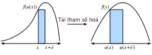

<!--
# Integral Calculus
-->

# Giải tích Tích phân
:label:`sec_integral_calculus`


<!--
Differentiation only makes up half of the content of a traditional calculus education.
The other pillar, integration, starts out seeming a rather disjoint question, "What is the area underneath this curve?"
While seemingly unrelated, integration is tightly intertwined with the differentiation via what is known as the *fundamental theorem of calculus*.
-->

Phép vi phân mới chỉ là một nửa nội dung của môn giải tích truyền thống.
Một nửa quan trọng khác, phép tích phân, bắt nguồn từ một câu hỏi có vẻ không mấy liên quan, "Diện tích của phần bên dưới đường cong này là bao nhiêu?"
Dù vậy, phép tích phân lại liên hệ mật thiết tới phép vi phân thông qua *định lý cơ bản của giải tích* (*fundamental theorem of calculus*).


<!--
At the level of machine learning we discuss in this book, we will not need a deep understanding of integration.
However, we will provide a brief introduction to lay the groundwork for any further applications we will encounter later on.
-->

Ở mức độ kiến thức học máy ta thảo luận trong cuốn sách này, ta không cần thiết phải hiểu sâu sắc về phép tích phân.
Tuy nhiên, chúng tôi sẽ giới thiệu khái quát để đặt nền tảng cho bất kỳ ứng dụng nào ta sẽ gặp sau này.


<!--
## Geometric Interpretation
-->

## Diễn giải Hình học


<!--
Suppose that we have a function $f(x)$.
For simplicity, let us assume that $f(x)$ is non-negative (never takes a value less than zero).
What we want to try and understand is: what is the area contained between $f(x)$ and the $x$-axis?
-->

Giả sử ta có hàm $f(x)$.
Để đơn giản, giả sử $f(x)$ không âm (không cho ra số bé hơn không).
Điều chúng ta muốn tìm hiểu là: diện tích của phần được giới hạn giữa $f(x)$ và trục $x$ là bao nhiêu?


```{.python .input}
%matplotlib inline
from d2l import mxnet as d2l
from IPython import display
from mpl_toolkits import mplot3d
from mxnet import np, npx
npx.set_np()

x = np.arange(-2, 2, 0.01)
f = np.exp(-x**2)

d2l.set_figsize()
d2l.plt.plot(x, f, color='black')
d2l.plt.fill_between(x.tolist(), f.tolist())
d2l.plt.show()
```

```{.python .input}
#@tab pytorch
%matplotlib inline
from d2l import torch as d2l
from IPython import display
from mpl_toolkits import mplot3d
import torch

x = torch.arange(-2, 2, 0.01)
f = torch.exp(-x**2)

d2l.set_figsize()
d2l.plt.plot(x, f, color='black')
d2l.plt.fill_between(x.tolist(), f.tolist())
d2l.plt.show()
```

```{.python .input}
#@tab tensorflow
%matplotlib inline
from d2l import tensorflow as d2l
from IPython import display
from mpl_toolkits import mplot3d
import tensorflow as tf

x = tf.range(-2, 2, 0.01)
f = tf.exp(-x**2)

d2l.set_figsize()
d2l.plt.plot(x, f, color='black')
d2l.plt.fill_between(x.numpy(), f.numpy())
d2l.plt.show()
```


<!--
In most cases, this area will be infinite or undefined (consider the area under $f(x) = x^{2}$), 
so people will often talk about the area between a pair of ends, say $a$ and $b$.
-->

Trong đa số trường hợp, diện tích của vùng này sẽ là vô cực hoặc không xác định (ví dụ như hàm $f(x) = x^{2}$),
nên ta thường nói về diện tích trong một khoảng giữa hai cận, ví dụ $a$ và $b$.


```{.python .input}
x = np.arange(-2, 2, 0.01)
f = np.exp(-x**2)

d2l.set_figsize()
d2l.plt.plot(x, f, color='black')
d2l.plt.fill_between(x.tolist()[50:250], f.tolist()[50:250])
d2l.plt.show()
```

```{.python .input}
#@tab pytorch
x = torch.arange(-2, 2, 0.01)
f = torch.exp(-x**2)

d2l.set_figsize()
d2l.plt.plot(x, f, color='black')
d2l.plt.fill_between(x.tolist()[50:250], f.tolist()[50:250])
d2l.plt.show()
```

```{.python .input}
#@tab tensorflow
x = tf.range(-2, 2, 0.01)
f = tf.exp(-x**2)

d2l.set_figsize()
d2l.plt.plot(x, f, color='black')
d2l.plt.fill_between(x.numpy()[50:250], f.numpy()[50:250])
d2l.plt.show()
```


<!--
We will denote this area by the integral symbol below:
-->

Ta sẽ ký hiệu phần diện tích này với dấu tích phân như dưới đây:


$$
\mathrm{Area}(\mathcal{A}) = \int_a^b f(x) \;dx.
$$


<!--
The inner variable is a dummy variable, much like the index of a sum in a $\sum$, 
and so this can be equivalently written with any inner value we like:
-->

Ta có thể sử dụng bất kì ký hiệu nào vì biến tích phân bên trong là tùy ý, cũng giống như biến chỉ số của phép tổng trong $\sum$:


$$
\int_a^b f(x) \;dx = \int_a^b f(z) \;dz.
$$


<!--
There is a traditional way to try and understand how we might try to approximate such integrals: 
we can imagine taking the region in-between $a$ and $b$ and chopping it into $N$ vertical slices.
If $N$ is large, we can approximate the area of each slice by a rectangle, 
and then add up the areas to get the total area under the curve.
Let us take a look at an example doing this in code.
We will see how to get the true value in a later section.
-->

Có một cách truyền thống để hiểu rõ hơn cách ta có thể xấp xỉ phép tích phân:
ta có thể tưởng tượng cắt phần giữa $a$ và $b$ thành $N$ lát theo chiều dọc.
Nếu $N$ lớn, ta có thể xấp xỉ phần diện tích mỗi lát bằng một hình chữ nhật,
và sau đó tính tổng các diện tích để có được phần diện tích phía dưới đường cong.
Hãy cùng lập trình và xét qua một ví dụ.
Ta sẽ biết cách tính được giá trị thật sự của phép tích phân ở mục sau.


```{.python .input}
epsilon = 0.05
a = 0
b = 2

x = np.arange(a, b, epsilon)
f = x / (1 + x**2)

approx = np.sum(epsilon*f)
true = np.log(2) / 2

d2l.set_figsize()
d2l.plt.bar(x.asnumpy(), f.asnumpy(), width=epsilon, align='edge')
d2l.plt.plot(x, f, color='black')
d2l.plt.ylim([0, 1])
d2l.plt.show()

f'approximation: {approx}, truth: {true}'
```

```{.python .input}
#@tab pytorch
epsilon = 0.05
a = 0
b = 2

x = torch.arange(a, b, epsilon)
f = x / (1 + x**2)

approx = torch.sum(epsilon*f)
true = torch.log(torch.tensor([5.])) / 2

d2l.set_figsize()
d2l.plt.bar(x, f, width=epsilon, align='edge')
d2l.plt.plot(x, f, color='black')
d2l.plt.ylim([0, 1])
d2l.plt.show()

f'approximation: {approx}, truth: {true}'
```

```{.python .input}
#@tab tensorflow
epsilon = 0.05
a = 0
b = 2

x = tf.range(a, b, epsilon)
f = x / (1 + x**2)

approx = tf.reduce_sum(epsilon*f)
true = tf.math.log(tf.constant([5.])) / 2

d2l.set_figsize()
d2l.plt.bar(x, f, width=epsilon, align='edge')
d2l.plt.plot(x, f, color='black')
d2l.plt.ylim([0, 1])
d2l.plt.show()

f'approximation: {approx}, truth: {true}'
```


<!--
The issue is that while it can be done numerically, 
we can do this approach analytically for only the simplest functions like
-->

Một vấn đề đó là trong khi cách này có thể làm một cách số học,
ta chỉ có thể sử dụng cách tiếp cận phân tích này cho các hàm cực đơn giản như


$$
\int_a^b x \;dx.
$$


<!--
Anything somewhat more complex like our example from the code above
-->

Bất kì hàm số nào hơi phức tạp hơn một chút như trong ví dụ trình bày ở đoạn mã trên


$$
\int_a^b \frac{x}{1+x^{2}} \;dx.
$$


<!--
is beyond what we can solve with such a direct method.
-->

nằm ngoài phạm vi ta có thể giải quyết bằng phương pháp này.


<!--
We will instead take a different approach.  We will work intuitively with the notion of the area, 
and learn the main computational tool used to find integrals: the *fundamental theorem of calculus*.
This will be the basis for our study of integration.
-->

Thay vào đó, ta sẽ tiếp cận theo hướng khác.
Ta sẽ làm việc một cách trực quan với khái niệm diện tích, và học công cụ tính toán chính được dùng để tính tích phân: *định lý cơ bản của giải tích*.
Đây sẽ là nền tảng của ta trong quá trình học tích phân.


<!--
## The Fundamental Theorem of Calculus
-->

## Định lý Cơ bản của Giải tích


<!--
To dive deeper into the theory of integration, let us introduce a function 
-->

Để đào sâu hơn nữa vào lý thuyết tích phân, chúng tôi xin phép giới thiệu hàm


$$
F(x) = \int_0^x f(y) dy.
$$


<!--
This function measures the area between $0$ and $x$ depending on how we change $x$.
Notice that this is everything we need since
-->

Hàm này tính diện tích giữa $0$ và $x$ tùy thuộc vào việc $x$ thay đổi như thế nào.
Để ý rằng đây là tất cả những gì ta cần, bởi vì


$$
\int_a^b f(x) \;dx = F(b) - F(a).
$$


<!--
This is a mathematical encoding of the fact that we can measure the area out to the far end-point 
and then subtract off the area to the near end point as indicated in :numref:`fig_area-subtract`.
-->

Đây là một ký hiệu toán học biểu diễn diện tích khoảng giữa hai cận bằng hiệu diện tích của khoảng có cận xa hơn 
trừ đi diện tích của khoảng có cận gần hơn như trong :numref:`fig_area-subtract`.


<!--

-->


:label:`fig_area-subtract`


<!--
Thus, we can figure out what the integral over any interval is by figuring out what $F(x)$ is.  
-->

Vì thế, ta có thể tính tích phân trong khoảng bất kỳ bằng việc tìm $F(x)$.


<!--
To do so, let us consider an experiment.
As we often do in calculus, let us imagine what happens when we shift the value by a tiny bit.
From the comment above, we know that
-->

Để làm điều này, hãy xem xét một thí nghiệm.
Như thường làm trong giải tích, hãy tưởng tượng điều gì sẽ xảy ra khi ta dịch chuyển $x$ một khoảng nhỏ.
Bằng nhận xét phía trên, ta có


$$
F(x+\epsilon) - F(x) = \int_x^{x+\epsilon} f(y) \; dy.
$$


<!--
This tells us that the function changes by the area under a tiny sliver of a function.
-->

Điều này cho ta biết hàm số $F(x)$ thay đổi bằng với diện tích phía dưới một đoạn cực nhỏ của hàm $f(y)$.


<!--
This is the point at which we make an approximation.
If we look at a tiny sliver of area like this, it looks like this area is close to the rectangular area with height the value of $f(x)$ and the base width $\epsilon$.
Indeed, one can show that as $\epsilon \rightarrow 0$ this approximation becomes better and better.
Thus we can conclude:
-->

Đây là lúc mà ta cần xấp xỉ.
Nếu nhìn vào phần diện tích nhỏ đó, ta thấy phần diện tích này gần với diện tích của một hình chữ nhật với chiều cao là giá trị tại $f(x)$ và chiều rộng là $\epsilon$.
Thật vậy, khi $\epsilon \rightarrow 0$ phép xấp xỉ này càng chính xác.
Vì thế, ta có thể kết luận


$$
F(x+\epsilon) - F(x) \approx \epsilon f(x).
$$


<!--
However, we can now notice: this is exactly the pattern we expect if we were computing the derivative of $F$!
Thus we see the following rather surprising fact:
-->

Tuy nhiên, ta có thể để ý rằng: phương trình này có dạng giống với khi ta tính đạo hàm của $F$!
Vì thế ta có được một sự thật khá bất ngờ rằng:


$$
\frac{dF}{dx}(x) = f(x).
$$


<!--
This is the *fundamental theorem of calculus*.  We may write it in expanded form as
-->

Đây chính là *định lý cơ bản của giải tích*. Ta có thể viết nó dưới dạng mở rộng là


$$\frac{d}{dx}\int_{-\infty}^x f(y) \; dy = f(x).$$
:eqlabel:`eq_ftc`


<!--
It takes the concept of finding areas (*a priori* rather hard), and reduces it to a statement derivatives (something much more completely understood).
One last comment that we must make is that this does not tell us exactly what $F(x)$ is.
Indeed $F(x) + C$ for any $C$ has the same derivative.
This is a fact-of-life in the theory of integration.
Thankfully, notice that when working with definite integrals, the constants drop out, and thus are irrelevant to the outcome.
-->

Nó lấy ý tưởng về tìm kiếm diện tích (một *tiên nghiệm* khá khó), và giảm tải thành một mệnh đề đạo hàm (một khái niệm toán học đã được nghiên cứu sâu).
Một lưu ý cuối là định lý này không cho ta biết dạng thực sự của $F(x)$.
Thực chất, $F(x) + C$ với $C$ bất kỳ đều có đạo hàm như nhau.
Đây là sự thật chúng ta chấp nhận trong lý thuyết tích phân.
Đáng mừng là khi làm việc với tích phân hữu hạn, phần hằng số bị loại bỏ, và vì thế không ảnh hưởng đến kết quả.


$$
\int_a^b f(x) \; dx = (F(b) + C) - (F(a) + C) = F(b) - F(a).
$$


<!--
This may seem like abstract non-sense, but let us take a moment to appreciate that it has given us a whole new perspective on computing integrals.
Our goal is no-longer to do some sort of chop-and-sum process to try and recover the area, rather we need only find a function whose derivative is the function we have!
This is incredible since we can now list many rather difficult integrals by just reversing the table from :numref:`sec_derivative_table`.
For instance, we know that the derivative of $x^{n}$ is $nx^{n-1}$.
Thus, we can say using the fundamental theorem :eqref:`eq_ftc` that
-->

Công thức trên có thể khá trừu tượng và vô nghĩa, nhưng nó cho ta một góc nhìn mới trong việc tính tích phân.
Cách tiếp cận của ta không còn là phải "cắt ra và cộng lại" để tính diện tích, mà chỉ cần tìm một hàm số có đạo hàm là hàm hiện có!
Đây là một điều tuyệt vời vì giờ ta có thể liệt kê hàng loạt các phép tích phân phức tạp chỉ bằng cách đảo ngược lại bảng trong :numref:`sec_derivative_table`.
Ví dụ, ta biết đạo hàm của $x^{n}$ là $nx^{n-1}$.
Vì thế, bằng cách sử dụng định lý cơ bản :eqref:`eq_ftc`, ta có:


$$
\int_0^{x} ny^{n-1} \; dy = x^n - 0^n = x^n.
$$


<!--
Similarly, we know that the derivative of $e^{x}$ is itself, so that means
-->

Tương tự, ta biết đạo hàm của $e^{x}$ là chính nó, nên:


$$
\int_0^{x} e^{x} \; dx = e^{x} - e^{0} = e^x - 1.
$$


<!--
In this way, we can develop the entire theory of integration leveraging ideas from differential calculus freely.
Every integration rule derives from this one fact.
-->

Bằng cách này, ta có thể phát triển toàn bộ lý thuyết tích phân bằng cách tự do tận dụng những ý tưởng từ giải tích vi phân.
Mỗi quy tắc tích phân đều bắt nguồn từ đây.


<!--
## Change of Variables
-->

## Quy tắc Đổi biến
:label:`integral_example`


<!--
Just as with differentiation, there are a number of rules which make the computation of integrals more tractable.
In fact, every rule of differential calculus (like the product rule, sum rule, and chain rule) 
has a corresponding rule for integral calculus (integration by parts, linearity of integration, and the change of variables formula respectively).
In this section, we will dive into what is arguably the most important from the list: the change of variables formula.
-->

Cũng như vi phân, có một số quy tắc giúp việc tính tích phân dễ xử lý hơn.
Thật ra, mọi quy tắc trong giải tích vi phân (như quy tắc tích, quy tắc tổng, 
và quy tắc dây chuyền) đều có một quy luật tương ứng cho giải tích tích phân (lần lượt là tích phân từng phần, tích phân của tổng, và quy tắc đổi biến số).
Trong mục này, ta sẽ tìm hiểu quy tắc được cho là quan trọng nhất trong danh sách trên: quy tắc đổi biến số.


<!--
First, suppose that we have a function which is itself an integral:
-->

Đầu tiên, giả sử ta có một hàm tích phân:


$$
F(x) = \int_0^x f(y) \; dy.
$$ 


<!--
Let us suppose that we want to know how this function looks when we compose it with another to obtain $F(u(x))$.
By the chain rule, we know
-->

Giả sử ta muốn biết hàm này trông như thế nào khi kết hợp nó với một hàm nữa để có được $F(u(x))$.
Bằng quy tắc dây chuyền, ta có

$$
\frac{d}{dx}F(u(x)) = \frac{dF}{du}(u(x))\cdot \frac{du}{dx}.
$$


<!--
We can turn this into a statement about integration by using the fundamental theorem :eqref:`eq_ftc` as above. This gives
-->

Ta có thể biến nó thành một mệnh đề tích phân bằng cách sử dụng định lý cơ bản :eqref:`eq_ftc` ở trên, để có


$$
F(u(x)) - F(u(0)) = \int_0^x \frac{dF}{du}(u(y))\cdot \frac{du}{dy} \;dy.
$$


<!--
Recalling that $F$ is itself an integral gives that the left hand side may be rewritten to be
-->

Biết rằng $F$ chính nó là một tích phân giúp vế bên trái có thể được viết lại là


$$
\int_{u(0)}^{u(x)} f(y) \; dy = \int_0^x \frac{dF}{du}(u(y))\cdot \frac{du}{dy} \;dy.
$$


<!--
Similarly, recalling that $F$ is an integral allows us to recognize that $\frac{dF}{dx} = f$ using the fundamental theorem :eqref:`eq_ftc`, and thus we may conclude
-->

Tương tự, $F$ là một tích phân nên theo định lý cơ bản :eqref:`eq_ftc`, $\frac{dF}{dx} = f$, do đó:


$$\int_{u(0)}^{u(x)} f(y) \; dy = \int_0^x f(u(y))\cdot \frac{du}{dy} \;dy.$$
:eqlabel:`eq_change_var`


<!--
This is the *change of variables* formula.
-->

Đây là quy tắc *đổi biến số*.


<!--
For a more intuitive derivation, consider what happens when we take an integral of $f(u(x))$ between $x$ and $x+\epsilon$.
For a small $\epsilon$, this integral is approximately $\epsilon f(u(x))$, the area of the associated rectangle.
Now, let us compare this with the integral of $f(y)$ from $u(x)$ to $u(x+\epsilon)$.
We know that $u(x+\epsilon) \approx u(x) + \epsilon \frac{du}{dx}(x)$, so the area of this rectangle is approximately $\epsilon \frac{du}{dx}(x)f(u(x))$.
Thus, to make the area of these two rectangles to agree, we need to multiply the first one by $\frac{du}{dx}(x)$ as is illustrated in :numref:`fig_rect-transform`.  
-->

Để có một chứng minh trực quan hơn, xét chuyện gì sẽ xảy ra khi ta lấy tích phân hàm $f(u(x))$ giữa $x$ và $x+\epsilon$.
Với $\epsilon$ nhỏ, tích phân này xấp xỉ $\epsilon f(u(x))$, phần diện tích của hình chữ nhật tương ứng.
Bây giờ, hãy so sánh với tích phân của $f(y)$ từ $u(x)$ tới $u(x+\epsilon)$.
Ta biết rằng $u(x+\epsilon) \approx u(x) + \epsilon \frac{du}{dx}(x)$, vậy nên phần diện tích của hình chữ nhật này xấp xỉ $\epsilon \frac{du}{dx}(x)f(u(x))$.
Do đó, để đồng hóa diện tích hai hình chữ nhật này, ta phải nhân phần thứ nhất với $\frac{du}{dx}(x)$ như minh họa trong :numref:`fig_rect-transform`. 


<!--

-->


:label:`fig_rect-transform`


<!--
This tells us that
-->

Điều này cho ta biết


$$
\int_x^{x+\epsilon} f(u(y))\frac{du}{dy}(y)\;dy = \int_{u(x)}^{u(x+\epsilon)} f(y) \; dy.
$$  


<!--
This is the change of variables formula expressed for a single small rectangle.
-->

Đây là quy tắc đổi biến số được biểu diễn cho một hình chữ nhật nhỏ.


<!--
If $u(x)$ and $f(x)$ are properly chosen, this can allow for the computation of incredibly complex integrals.
For instance, if we even chose $f(y) = 1$ and $u(x) = e^{-x^{2}}$ (which means $\frac{du}{dx}(x) = -2xe^{-x^{2}}$), this can show for instance that
-->

Chọn $u(x)$ và $f(x)$ một cách thích hợp sẽ cho phép tính những tích phân cực kỳ phức tạp.
Ví dụ, nếu ta chọn $f(y) = 1$ và $u(x) = e^{-x^{2}}$ (có nghĩa là $\frac{du}{dx}(x) = -2xe^{-x^{2}}$)):


$$
e^{-1} - 1 = \int_{e^{-0}}^{e^{-1}} 1 \; dy = -2\int_0^{1} ye^{-y^2}\;dy,
$$


<!--
and thus by rearranging that
-->

và khi sắp xếp lại ta có


$$
\int_0^{1} ye^{-y^2}\; dy = \frac{1-e^{-1}}{2}.
$$


<!--
## A Comment on Sign Conventions
-->

## Nhận xét về Quy ước Ký hiệu


<!--
Keen-eyed readers will observe something strange about the computations above. Namely, computations like
-->

Những độc giả tinh mắt sẽ nhận thấy điều kì lạ từ những phép tính trên. Ví dụ như


$$
\int_{e^{-0}}^{e^{-1}} 1 \; dy = e^{-1} -1 < 0,
$$


<!--
can produce negative numbers. When thinking about areas, it can be strange to see a negative value, and so it is worth digging into what the convention is.
-->

có thể âm. Khi nghĩ về các diện tích, có thể là hơi lạ khi ta thấy một giá trị âm, vậy nên nó đáng để ta tìm hiểu kĩ hơn về các quy ước này.


<!--
Mathematicians take the notion of signed areas. This manifests itself in two ways.
First, if we consider a function $f(x)$ which is sometimes less than zero, then the area will also be negative. So for instance
-->

Các nhà toán học có khái niệm về diện tích có dấu. Điều này thể hiện theo hai cách.
Đầu tiên, với $f(x)$ nhỏ hơn 0, thì diện tích cũng sẽ âm. Ví dụ:


$$
\int_0^{1} (-1)\;dx = -1.
$$


<!--
Similarly, integrals which progress from right to left, rather than left to right are also taken to be negative areas
-->

Thứ hai, tích phân tiến từ phải sang trái, thay vì từ trái sang phải, cũng có diện tích âm


$$
\int_0^{-1} 1\; dx = -1.
$$


<!--
The standard area (from left to right of a positive function) is always positive.
Anything obtained by flipping it (say flipping over the $x$-axis to get the integral of a negative number, 
or flipping over the $y$-axis to get an integral in the wrong order) will produce a negative area.
And indeed, flipping twice will give a pair of negative signs that cancel out to have positive area
-->

Diện tích chuẩn (từ trái sang phải của một hàm số dương) thì luôn dương.
Bất kỳ kết quả nào thu được bằng cách lật hàm này (giả sử lật đối xứng qua trục $x$ để lấy tích phân của một hàm âm,
hoặc lật đối xứng qua trục $y$ để lấy tích phân ngược thứ tự) sẽ tạo ra diện tích âm.
Và việc lật hai lần sẽ làm cặp dấu âm triệt tiêu nhau, từ đó lại có diện tích dương.


$$
\int_0^{-1} (-1)\;dx =  1.
$$


<!--
If this discussion sounds familiar, it is! In :numref:`sec_geometry-linear-algebraic-ops` we discussed how the determinant represented the signed area in much the same way.
-->

Thực tế, trong: numref:`sec_geometry-linear-algebraic-ops`, ta đã bàn về cách định thức biểu diễn diện tích có dấu theo cách tương tự.


<!--
## Multiple Integrals
-->

## Tích phân bội


<!--
In some cases, we will need to work in higher dimensions. For instance, suppose that we have a function of two variables, like $f(x, y)$ 
and we want to know the volume under $f$ when $x$ ranges over $[a, b]$ and $y$ ranges over $[c, d]$.
-->

Trong một số trường hợp, ta sẽ cần phải làm việc với số lượng chiều lớn hơn. Ví dụ: giả sử ta có một hàm hai biến $f(x, y)$
và muốn biết thể tích phía dưới $f$ khi $x$ nằm trong đoạn $[a, b]$ và $y$ trong đoạn $[c, d]$.


```{.python .input}
# Construct grid and compute function
x, y = np.meshgrid(np.linspace(-2, 2, 101), np.linspace(-2, 2, 101),
                   indexing='ij')
z = np.exp(- x**2 - y**2)

# Plot function
ax = d2l.plt.figure().add_subplot(111, projection='3d')
ax.plot_wireframe(x, y, z)
d2l.plt.xlabel('x')
d2l.plt.ylabel('y')
d2l.plt.xticks([-2, -1, 0, 1, 2])
d2l.plt.yticks([-2, -1, 0, 1, 2])
d2l.set_figsize()
ax.set_xlim(-2, 2)
ax.set_ylim(-2, 2)
ax.set_zlim(0, 1)
ax.dist = 12
```

```{.python .input}
#@tab pytorch
# Construct grid and compute function
x, y = torch.meshgrid(torch.linspace(-2, 2, 101), torch.linspace(-2, 2, 101))
z = torch.exp(- x**2 - y**2)

# Plot function
ax = d2l.plt.figure().add_subplot(111, projection='3d')
ax.plot_wireframe(x, y, z)
d2l.plt.xlabel('x')
d2l.plt.ylabel('y')
d2l.plt.xticks([-2, -1, 0, 1, 2])
d2l.plt.yticks([-2, -1, 0, 1, 2])
d2l.set_figsize()
ax.set_xlim(-2, 2)
ax.set_ylim(-2, 2)
ax.set_zlim(0, 1)
ax.dist = 12
```

```{.python .input}
#@tab tensorflow
# Construct grid and compute function
x, y = tf.meshgrid(tf.linspace(-2., 2., 101), tf.linspace(-2., 2., 101))
z = tf.exp(- x**2 - y**2)

# Plot function
ax = d2l.plt.figure().add_subplot(111, projection='3d')
ax.plot_wireframe(x, y, z)
d2l.plt.xlabel('x')
d2l.plt.ylabel('y')
d2l.plt.xticks([-2, -1, 0, 1, 2])
d2l.plt.yticks([-2, -1, 0, 1, 2])
d2l.set_figsize()
ax.set_xlim(-2, 2)
ax.set_ylim(-2, 2)
ax.set_zlim(0, 1)
ax.dist = 12
```


<!--
We write this as 
-->

Ta có thể viết thành tích phân sau:


$$
\int_{[a, b]\times[c, d]} f(x, y)\;dx\;dy.
$$


<!--
Suppose that we wish to compute this integral. My claim is that we can do this by iteratively computing first the integral in $x$ 
and then shifting to the integral in $y$, that is to say
-->

Giả sử ta muốn tính tích phân này. Ta có thể tính tích phân theo cận $x$ trước rồi chuyển sang cận $y$, nghĩa là:


$$
\int_{[a, b]\times[c, d]} f(x, y)\;dx\;dy = \int_c^{d} \left(\int_a^{b} f(x, y) \;dx\right) \; dy.
$$


<!--
Let us see why this is.  
-->

Hãy cùng quan sát tại sao.


<!--
Consider the figure above where we have split the function into $\epsilon \times \epsilon$ 
squares which we will index with integer coordinates $i, j$. In this case, our integral is approximately
-->

Hãy xem xét hình trên, nơi ta đã phân chia hàm thành $\epsilon \times \epsilon$
ô vuông với chỉ số nguyên $i, j$. Trong trường hợp này, tích phân xấp xỉ:


$$
\sum_{i, j} \epsilon^{2} f(\epsilon i, \epsilon j).
$$


<!--
Once we discretize the problem, we may add up the values on these squares in whatever order we like, and not worry about changing the values.
This is illustrated in :numref:`fig_sum-order`. In particular, we can say that
-->

Một khi đã rời rạc hóa bài toán, ta có thể cộng dồn các giá trị trên các ô vuông này theo bất kỳ thứ tự nào mà không phải lo lắng về việc giá trị cuối cùng thay đổi.
Điều này được minh họa trong :numref:`fig_sum-order`. Đặc biệt, có thể nói rằng


$$
 \sum _ {j} \epsilon \left(\sum_{i} \epsilon f(\epsilon i, \epsilon j)\right).
$$

<!--

-->


:label:`fig_sum-order`


<!--
The sum on the inside is precisely the discretization of the integral 
-->

Tổng bên trong chính xác là phiên bản rời rạc của tích phân:


$$
G(\epsilon j) = \int _a^{b} f(x, \epsilon j) \; dx.
$$


<!--
Finally, notice that if we combine these two expressions we get 
-->

Sau cùng, nếu kết hợp hai biểu thức này với nhau, ta có:


$$
\sum _ {j} \epsilon G(\epsilon j) \approx \int _ {c}^{d} G(y) \; dy = \int _ {[a, b]\times[c, d]} f(x, y)\;dx\;dy.
$$


<!--
Thus putting it all together, we have that
-->

Kết hợp tất cả lại:


$$
\int _ {[a, b]\times[c, d]} f(x, y)\;dx\;dy = \int _ c^{d} \left(\int _ a^{b} f(x, y) \;dx\right) \; dy.
$$


<!--
Notice that, once discretized, all we did was rearrange the order in which we added a list of numbers.
This may make it seem like it is nothing, however this result (called *Fubini's Theorem*) is not always true!
For the type of mathematics encountered when doing machine learning (continuous functions), there is no concern, 
however it is possible to create examples where it fails (for example the function $f(x, y) = xy(x^2-y^2)/(x^2+y^2)^3$ over the rectangle $[0,2]\times[0,1]$).
-->

Lưu ý rằng, một khi đã rời rạc hóa, tất cả những gì ta làm là sắp xếp lại thứ tự tính tổng một danh sách các số.
Điều này có vẻ hiển nhiên, tuy nhiên kết quả này (được gọi là *Định lý Fubini*) không phải lúc nào cũng đúng!
Đối với loại toán học gặp phải khi thực hiện tác vụ học máy (các hàm liên tục), không có gì đáng lo ngại,
tuy vậy ta có thể tạo các ví dụ mà cách này không áp dụng được (ví dụ: hàm $f(x, y) = xy(x^2-y^2)/(x^2+y^2)^3$ trên hình chữ nhật $[0,2]\times[0,1]$).


<!--
Note that the choice to do the integral in $x$ first, and then the integral in $y$ was arbitrary.
We could have equally well chosen to do $y$ first and then $x$ to see
-->

Lưu ý rằng việc chọn tính tích phân theo cận $x$ trước, cận $y$ sau là tùy ý.
Ta cũng có thể chọn thực hiện $y$ trước, $x$ sau:


$$
\int _ {[a, b]\times[c, d]} f(x, y)\;dx\;dy = \int _ a^{b} \left(\int _ c^{d} f(x, y) \;dy\right) \; dx.
$$


<!--
Often times, we will condense down to vector notation, and say that for $U = [a, b]\times [c, d]$ this is
-->

Thông thường, ta sẽ rút gọn thành ký hiệu vector và nói rằng tích phân trên miền $U = [a, b]\times [c, d]$ là:


$$
\int _ U f(\mathbf{x})\;d\mathbf{x}.
$$


<!--
## Change of Variables in Multiple Integrals
-->

## Đổi biến trong Tích phân bội


<!--
As with single variables in :eqref:`eq_change_var`, the ability to change variables inside a higher dimensional integral is a key tool.
Let us summarize the result without derivation.  
-->

Tương tự như tích phân đơn biến, việc đổi biến trong tích phân bội là một kỹ thuật quan trọng.
Chúng tôi sẽ tổng hợp kết quả mà không chứng minh và trình bày.


<!--
We need a function that reparameterizes our domain of integration.
We can take this to be $\phi : \mathbb{R}^n \rightarrow \mathbb{R}^n$, that is any function which takes in $n$ real variables and returns another $n$.
To keep the expressions clean, we will assume that $\phi$ is *injective* which is to say it never folds over itself ($\phi(\mathbf{x}) = \phi(\mathbf{y}) \implies \mathbf{x} = \mathbf{y}$).  
-->

Chúng ta cần một hàm để tái tham số hoá miền tích phân.
Ta có thể coi hàm này là $\phi: \mathbb{R}^n \rightarrow \mathbb{R}^n$, nhận $n$ biến thực và trả về $n$ giá trị thực khác.
Để giữ cho các biểu thức rõ ràng, ta giả sử $\phi$ là *đơn ánh (injective)* tức nó cho đầu ra khác nhau 
với đầu vào khác nhau ($\phi(\mathbf{x}) = \phi(\mathbf{y}) \implies \mathbf{x} = \mathbf{y}$).


<!--
In this case, we can say that
-->

Trong trường hợp này, ta có:


$$
\int _ {\phi(U)} f(\mathbf{x})\;d\mathbf{x} = \int _ {U} f(\phi(\mathbf{x})) \left|\det(D\phi(\mathbf{x}))\right|\;d\mathbf{x}.
$$


<!--
where $D\phi$ is the *Jacobian* of $\phi$, which is the matrix of partial derivatives of $\boldsymbol{\phi} = (\phi_1(x_1, \ldots, x_n), \ldots, \phi_n(x_1, \ldots, x_n))$,
-->

trong đó $D\phi$ là *Jacobian* của $\phi$, ma trận của các đạo hàm riêng của $\boldsymbol{\phi} = (\phi_1(x_1, \ldots, x_n), \ldots, \phi_n(x_1, \ldots, x_n))$,


$$
D\boldsymbol{\phi} = \begin{bmatrix}
\frac{\partial \phi _ 1}{\partial x _ 1} & \cdots & \frac{\partial \phi _ 1}{\partial x _ n} \\
\vdots & \ddots & \vdots \\
\frac{\partial \phi _ n}{\partial x _ 1} & \cdots & \frac{\partial \phi _ n}{\partial x _ n}
\end{bmatrix}.
$$


<!--
Looking closely, we see that this is similar to the single variable chain rule :eqref:`eq_change_var`, 
except we have replaced the term $\frac{du}{dx}(x)$ with $\left|\det(D\phi(\mathbf{x}))\right|$.
Let us see how we can to interpret this term.
Recall that the $\frac{du}{dx}(x)$ term existed to say how much we stretched our $x$-axis by applying $u$.
The same process in higher dimensions is to determine how much we stretch the area (or volume, or hyper-volume) 
of a little square (or little *hyper-cube*) by applying $\boldsymbol{\phi}$.
If $\boldsymbol{\phi}$ was the multiplication by a matrix, then we know how the determinant already gives the answer.  
-->

Khi xét kĩ hơn, ta nhận thấy điều này tương tự như quy tắc dây chuyền đơn biến :eqref:`eq_change_var`,
ngoại trừ việc ta đã thay thế $\frac{du}{dx}(x)$ bằng $\left|\det(D\phi(\mathbf{x}))\right|$.
Hãy cùng xem ta có thể giải thích hạng tử này như thế nào.
Hãy nhớ lại rằng $\frac{du}{dx}(x)$ cho thấy việc áp dụng $u$ kéo dãn trục $x$ như thế nào.
Tương tự, ở không gian nhiều chiều, $\left|\det(D\phi(\mathbf{x}))\right|$ cho thấy áp dụng $\boldsymbol{\phi}$ sẽ kéo dãn diện tích (hoặc thể tích, siêu thể tích)
của một hình vuông nhỏ (hoặc một *khối lập phương* nhỏ) như thế nào.
Nếu $\boldsymbol{\phi}$ là một phép nhân với ma trận, thì ta đã biết định thức có ảnh hưởng như thế nào.


<!--
With some work, one can show that the *Jacobian* provides the best approximation to 
a multivariable function $\boldsymbol{\phi}$ at a point by a matrix in the same way we could approximate by lines or planes with derivatives and gradients.
Thus the determinant of the Jacobian exactly mirrors the scaling factor we identified in one dimension.
-->

Đi sâu hơn một chút, ta có thể chỉ ra rằng *Jacobian* đưa ra xấp xỉ tốt nhất cho
một hàm đa biến $\boldsymbol{\phi}$ tại một điểm bằng ma trận theo cách giống như khi xấp xỉ đạo hàm và gradient bằng các đường hoặc mặt phẳng.
Do đó, định thức Jacobian tương ứng với hệ số tỷ lệ ta đã xác định trong không gian một chiều.


<!--
It takes some work to fill in the details to this, so do not worry if they are not clear now.
Let us see at least one example we will make use of later on. Consider the integral
-->

Việc này cần đi sâu vào một số chi tiết, vì vậy đừng lo lắng nếu bạn chưa hiểu ngay.
Hãy cùng xem qua một ví dụ mà ta sẽ dùng sau này. Xét tích phân:

$$
\int _ {-\infty}^{\infty} \int _ {-\infty}^{\infty} e^{-x^{2}-y^{2}} \;dx\;dy.
$$


<!--
Playing with this integral directly will get us no-where, but if we change variables, we can make significant progress.
If we let $\boldsymbol{\phi}(r, \theta) = (r \cos(\theta), r\sin(\theta))$ (which is to say that $x = r \cos(\theta)$, $y = r \sin(\theta)$), 
then we can apply the change of variable formula to see that this is the same thing as
-->

Rất khó tính trực tiếp tích phân này, nhưng nếu đổi biến, thì ta có thể đạt được tiến triển đáng kể.
Nếu đặt $\boldsymbol{\phi}(r, \theta) = (r \cos(\theta), r\sin(\theta))$ (nghĩa là $x = r \cos(\theta)$, $y = r \sin(\theta)$),
thì ta có thể áp dụng công thức đổi biến để có:


$$
\int _ 0^\infty \int_0 ^ {2\pi} e^{-r^{2}} \left|\det(D\mathbf{\phi}(\mathbf{x}))\right|\;d\theta\;dr,
$$


<!--
where 
-->

với:

$$
\left|\det(D\mathbf{\phi}(\mathbf{x}))\right| = \left|\det\begin{bmatrix}
\cos(\theta) & -r\sin(\theta) \\
\sin(\theta) & r\cos(\theta)
\end{bmatrix}\right| = r(\cos^{2}(\theta) + \sin^{2}(\theta)) = r.
$$


<!--
Thus, the integral is
-->

Vì vậy, tích phân được viết lại là:


$$
\int _ 0^\infty \int _ 0 ^ {2\pi} re^{-r^{2}} \;d\theta\;dr = 2\pi\int _ 0^\infty re^{-r^{2}} \;dr = \pi,
$$


<!--
where the final equality follows by the same computation that we used in section :numref:`integral_example`.  
-->

trong đó đẳng thức cuối cùng là phép tính mà ta đã sử dụng trong :numref:`integration_example`.

<!--
We will meet this integral again when we study continuous random variables in :numref:`sec_random_variables`.
-->

Chúng ta sẽ lại gặp tích phân này khi chúng ta học về các biến ngẫu nhiên liên tục trong :numref:`sec_random_variables`.


## Tóm tắt

<!--
* The theory of integration allows us to answer questions about areas or volumes.
* The fundamental theorem of calculus allows us to leverage knowledge about derivatives to compute areas 
via the observation that the derivative of the area up to some point is given by the value of the function being integrated.
* Integrals in higher dimensions can be computed by iterating single variable integrals.
-->

* Lý thuyết tích phân cho phép chúng ta giải đáp các câu hỏi về các diện tích hoặc thể tích.
* Định lý cơ bản của giải tích cho phép vận dụng kiến thức về đạo hàm để tính toán các diện tích
thông qua quan sát rằng đạo hàm của diện tích tới một điểm nào đó được xác định bởi giá trị tại điểm đó của hàm đang được tích phân.
* Tích phân trong không gian nhiều chiều có thể được tính bằng cách lặp qua các tích phân đơn biến.


## Bài tập

<!--
1. What is $\int_1^2 \frac{1}{x} \;dx$?
2. Use the change of variables formula to integrate $\int_0^{\sqrt{\pi}}x\sin(x^2)\;dx$.
3. What is $\int_{[0,1]^2} xy \;dx\;dy$?
4. Use the change of variables formula to compute $\int_0^2\int_0^1xy(x^2-y^2)/(x^2+y^2)^3\;dy\;dx$ 
and $\int_0^1\int_0^2f(x, y) = xy(x^2-y^2)/(x^2+y^2)^3\;dx\;dy$ to see they are different.
-->

1. Tính $\int_1^2 \frac{1}{x} \;dx$.
2. Áp dụng công thức đổi biến để tính $\int_0^{\sqrt{\pi}}x\sin(x^2)\;dx$.
3. Tính $\int_{[0,1]^2} xy \;dx\;dy$.
4. Áp dụng công thức đổi biến để tính $\int_0^2\int_0^1xy(x^2-y^2)/(x^2+y^2)^3\;dy\;dx$ 
và $\int_0^1\int_0^2f(x, y) = xy(x^2-y^2)/(x^2+y^2)^3\;dx\;dy$ để thấy sự khác nhau giữa chúng.


## Thảo luận
* Tiếng Anh: [MXNet](https://discuss.d2l.ai/t/414)
* Tiếng Việt: [Diễn đàn Machine Learning Cơ Bản](https://forum.machinelearningcoban.com/c/d2l)


## Những người thực hiện
Bản dịch trong trang này được thực hiện bởi:

* Đoàn Võ Duy Thanh
* Phạm Hồng Vinh
* Phạm Đăng Khoa
* Lê Khắc Hồng Phúc
* Nguyễn Văn Cường
