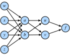
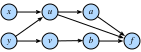

# Tính toán đa năng
:label:`sec_multivariable_calculus`

Bây giờ chúng ta có một sự hiểu biết khá mạnh mẽ về các dẫn xuất của một hàm của một biến duy nhất, chúng ta hãy quay trở lại câu hỏi ban đầu của chúng tôi, nơi chúng tôi đang xem xét một chức năng mất của hàng tỷ trọng lượng có khả năng. 

## Sự khác biệt chiều cao hơn Điều :numref:`sec_single_variable_calculus` nói với chúng ta là nếu chúng ta thay đổi một trong số hàng tỷ trọng này để lại mọi trọng lượng khác cố định, chúng ta biết điều gì sẽ xảy ra! Điều này không có gì khác hơn là một hàm của một biến duy nhất, vì vậy chúng ta có thể viết 

$$L(w_1+\epsilon_1, w_2, \ldots, w_N) \approx L(w_1, w_2, \ldots, w_N) + \epsilon_1 \frac{d}{dw_1} L(w_1, w_2, \ldots, w_N).$$
:eqlabel:`eq_part_der`

Chúng ta sẽ gọi đạo hàm trong một biến trong khi sửa các biến khác là đạo hàm *partial *, và chúng ta sẽ sử dụng ký hiệu $\frac{\partial}{\partial w_1}$ cho đạo hàm trong :eqref:`eq_part_der`. 

Bây giờ, chúng ta hãy lấy điều này và thay đổi $w_2$ một chút thành $w_2 + \epsilon_2$: 

$$
\begin{aligned}
L(w_1+\epsilon_1, w_2+\epsilon_2, \ldots, w_N) & \approx L(w_1, w_2+\epsilon_2, \ldots, w_N) + \epsilon_1 \frac{\partial}{\partial w_1} L(w_1, w_2+\epsilon_2, \ldots, w_N+\epsilon_N) \\
& \approx L(w_1, w_2, \ldots, w_N) \\
& \quad + \epsilon_2\frac{\partial}{\partial w_2} L(w_1, w_2, \ldots, w_N) \\
& \quad + \epsilon_1 \frac{\partial}{\partial w_1} L(w_1, w_2, \ldots, w_N) \\
& \quad + \epsilon_1\epsilon_2\frac{\partial}{\partial w_2}\frac{\partial}{\partial w_1} L(w_1, w_2, \ldots, w_N) \\
& \approx L(w_1, w_2, \ldots, w_N) \\
& \quad + \epsilon_2\frac{\partial}{\partial w_2} L(w_1, w_2, \ldots, w_N) \\
& \quad + \epsilon_1 \frac{\partial}{\partial w_1} L(w_1, w_2, \ldots, w_N).
\end{aligned}
$$

Chúng tôi đã một lần nữa sử dụng ý tưởng rằng $\epsilon_1\epsilon_2$ là một thuật ngữ thứ tự cao hơn mà chúng tôi có thể loại bỏ theo cách tương tự chúng tôi có thể loại bỏ $\epsilon^{2}$ trong phần trước, cùng với những gì chúng tôi đã thấy trong :eqref:`eq_part_der`. Bằng cách tiếp tục theo cách này, chúng tôi có thể viết rằng 

$$
L(w_1+\epsilon_1, w_2+\epsilon_2, \ldots, w_N+\epsilon_N) \approx L(w_1, w_2, \ldots, w_N) + \sum_i \epsilon_i \frac{\partial}{\partial w_i} L(w_1, w_2, \ldots, w_N).
$$

Điều này có thể trông giống như một mớ hỗn độn, nhưng chúng ta có thể làm cho điều này quen thuộc hơn bằng cách lưu ý rằng tổng bên phải trông giống hệt như một sản phẩm chấm, vì vậy nếu chúng ta để 

$$
\boldsymbol{\epsilon} = [\epsilon_1, \ldots, \epsilon_N]^\top \; \text{and} \;
\nabla_{\mathbf{x}} L = \left[\frac{\partial L}{\partial x_1}, \ldots, \frac{\partial L}{\partial x_N}\right]^\top,
$$

sau đó 

$$L(\mathbf{w} + \boldsymbol{\epsilon}) \approx L(\mathbf{w}) + \boldsymbol{\epsilon}\cdot \nabla_{\mathbf{w}} L(\mathbf{w}).$$
:eqlabel:`eq_nabla_use`

Chúng ta sẽ gọi vector $\nabla_{\mathbf{w}} L$ là * gradient* của $L$. 

Phương trình :eqref:`eq_nabla_use` đáng để suy ngẫm trong giây lát. Nó có chính xác định dạng mà chúng ta gặp phải trong một chiều, chỉ cần chúng ta đã chuyển đổi mọi thứ thành vectơ và các sản phẩm chấm. Nó cho phép chúng ta biết khoảng cách chức năng $L$ sẽ thay đổi cho bất kỳ nhiễu loạn nào đối với đầu vào. Như chúng ta sẽ thấy trong phần tiếp theo, điều này sẽ cung cấp cho chúng ta một công cụ quan trọng trong việc hiểu về mặt hình học cách chúng ta có thể học bằng cách sử dụng thông tin có trong gradient. 

Nhưng trước tiên, chúng ta hãy xem xấp xỉ này tại nơi làm việc với một ví dụ. Giả sử rằng chúng ta đang làm việc với hàm 

$$
f(x, y) = \log(e^x + e^y) \text{ with gradient } \nabla f (x, y) = \left[\frac{e^x}{e^x+e^y}, \frac{e^y}{e^x+e^y}\right].
$$

Nếu chúng ta nhìn vào một điểm như $(0, \log(2))$, chúng ta thấy rằng 

$$
f(x, y) = \log(3) \text{ with gradient } \nabla f (x, y) = \left[\frac{1}{3}, \frac{2}{3}\right].
$$

Do đó, nếu chúng ta muốn xấp xỉ $f$ tại $(\epsilon_1, \log(2) + \epsilon_2)$, chúng ta thấy rằng chúng ta nên có ví dụ cụ thể là :eqref:`eq_nabla_use`: 

$$
f(\epsilon_1, \log(2) + \epsilon_2) \approx \log(3) + \frac{1}{3}\epsilon_1 + \frac{2}{3}\epsilon_2.
$$

Chúng ta có thể kiểm tra điều này trong mã để xem xấp xỉ tốt như thế nào.

```{.python .input}
%matplotlib inline
from d2l import mxnet as d2l
from IPython import display
from mpl_toolkits import mplot3d
from mxnet import autograd, np, npx
npx.set_np()

def f(x, y):
    return np.log(np.exp(x) + np.exp(y))
def grad_f(x, y):
    return np.array([np.exp(x) / (np.exp(x) + np.exp(y)),
                     np.exp(y) / (np.exp(x) + np.exp(y))])

epsilon = np.array([0.01, -0.03])
grad_approx = f(0, np.log(2)) + epsilon.dot(grad_f(0, np.log(2)))
true_value = f(0 + epsilon[0], np.log(2) + epsilon[1])
f'approximation: {grad_approx}, true Value: {true_value}'
```

```{.python .input}
#@tab pytorch
%matplotlib inline
from d2l import torch as d2l
from IPython import display
from mpl_toolkits import mplot3d
import torch
import numpy as np

def f(x, y):
    return torch.log(torch.exp(x) + torch.exp(y))
def grad_f(x, y):
    return torch.tensor([torch.exp(x) / (torch.exp(x) + torch.exp(y)),
                     torch.exp(y) / (torch.exp(x) + torch.exp(y))])

epsilon = torch.tensor([0.01, -0.03])
grad_approx = f(torch.tensor([0.]), torch.log(
    torch.tensor([2.]))) + epsilon.dot(
    grad_f(torch.tensor([0.]), torch.log(torch.tensor(2.))))
true_value = f(torch.tensor([0.]) + epsilon[0], torch.log(
    torch.tensor([2.])) + epsilon[1])
f'approximation: {grad_approx}, true Value: {true_value}'
```

```{.python .input}
#@tab tensorflow
%matplotlib inline
from d2l import tensorflow as d2l
from IPython import display
from mpl_toolkits import mplot3d
import tensorflow as tf
import numpy as np

def f(x, y):
    return tf.math.log(tf.exp(x) + tf.exp(y))
def grad_f(x, y):
    return tf.constant([(tf.exp(x) / (tf.exp(x) + tf.exp(y))).numpy(),
                        (tf.exp(y) / (tf.exp(x) + tf.exp(y))).numpy()])

epsilon = tf.constant([0.01, -0.03])
grad_approx = f(tf.constant([0.]), tf.math.log(
    tf.constant([2.]))) + tf.tensordot(
    epsilon, grad_f(tf.constant([0.]), tf.math.log(tf.constant(2.))), axes=1)
true_value = f(tf.constant([0.]) + epsilon[0], tf.math.log(
    tf.constant([2.])) + epsilon[1])
f'approximation: {grad_approx}, true Value: {true_value}'
```

## Hình học của Gradient và Gradient Descent Xem xét biểu thức từ :eqref:`eq_nabla_use` một lần nữa: 

$$
L(\mathbf{w} + \boldsymbol{\epsilon}) \approx L(\mathbf{w}) + \boldsymbol{\epsilon}\cdot \nabla_{\mathbf{w}} L(\mathbf{w}).
$$

Chúng ta hãy giả sử rằng tôi muốn sử dụng điều này để giúp giảm thiểu thiệt hại của chúng tôi $L$. Chúng ta hãy hiểu về mặt hình học thuật toán của gradient gốc đầu tiên được mô tả trong :numref:`sec_autograd`. Những gì chúng tôi sẽ làm là như sau: 

1. Bắt đầu với một sự lựa chọn ngẫu nhiên cho các tham số ban đầu $\mathbf{w}$.
2. Tìm hướng $\mathbf{v}$ làm cho $L$ giảm nhanh nhất ở $\mathbf{w}$.
3. Thực hiện một bước nhỏ theo hướng đó: $\mathbf{w} \rightarrow \mathbf{w} + \epsilon\mathbf{v}$.
4. Lặp lại.

Điều duy nhất chúng ta không biết chính xác cách làm là tính toán vector $\mathbf{v}$ trong bước thứ hai. Chúng tôi sẽ gọi một hướng như vậy là *hướng đi xuống dốc nhất*. Sử dụng sự hiểu biết hình học của các sản phẩm chấm từ :numref:`sec_geometry-linear-algebraic-ops`, chúng ta thấy rằng chúng ta có thể viết lại :eqref:`eq_nabla_use` như 

$$
L(\mathbf{w} + \mathbf{v}) \approx L(\mathbf{w}) + \mathbf{v}\cdot \nabla_{\mathbf{w}} L(\mathbf{w}) = L(\mathbf{w}) + \|\nabla_{\mathbf{w}} L(\mathbf{w})\|\cos(\theta).
$$

Lưu ý rằng chúng tôi đã thực hiện hướng của chúng tôi để có chiều dài một để thuận tiện và sử dụng $\theta$ cho góc giữa $\mathbf{v}$ và $\nabla_{\mathbf{w}} L(\mathbf{w})$. Nếu chúng ta muốn tìm hướng giảm $L$ càng nhanh càng tốt, chúng ta muốn làm cho biểu thức này là tiêu cực nhất có thể. Cách duy nhất mà hướng chúng ta chọn đi vào phương trình này là thông qua $\cos(\theta)$, và do đó chúng ta muốn làm cho cosin này là âm nhất có thể. Bây giờ, nhắc lại hình dạng của cosin, chúng ta có thể làm cho điều này càng âm càng tốt bằng cách tạo $\cos(\theta) = -1$ hoặc tương đương làm cho góc giữa gradient và hướng đã chọn của chúng ta là $\pi$ radian, hoặc tương đương $180$ độ. Cách duy nhất để đạt được điều này là đi theo hướng ngược lại chính xác: chọn $\mathbf{v}$ để chỉ theo hướng ngược lại chính xác với $\nabla_{\mathbf{w}} L(\mathbf{w})$! 

Điều này đưa chúng ta đến một trong những khái niệm toán học quan trọng nhất trong học máy: hướng của các điểm phong nha dốc nhất theo hướng $-\nabla_{\mathbf{w}}L(\mathbf{w})$. Do đó thuật toán không chính thức của chúng tôi có thể được viết lại như sau. 

1. Bắt đầu với một sự lựa chọn ngẫu nhiên cho các tham số ban đầu $\mathbf{w}$.
2. Tính toán $\nabla_{\mathbf{w}} L(\mathbf{w})$.
3. Thực hiện một bước nhỏ theo hướng ngược lại với hướng đó: $\mathbf{w} \rightarrow \mathbf{w} - \epsilon\nabla_{\mathbf{w}} L(\mathbf{w})$.
4. Lặp lại.

Thuật toán cơ bản này đã được nhiều nhà nghiên cứu sửa đổi và điều chỉnh nhiều cách, nhưng khái niệm cốt lõi vẫn giữ nguyên trong tất cả chúng. Sử dụng gradient để tìm hướng làm giảm tổn thất càng nhanh càng tốt và cập nhật các tham số để thực hiện một bước theo hướng đó. 

## Một lưu ý về tối ưu hóa toán học Trong suốt cuốn sách này, chúng tôi tập trung thẳng vào các kỹ thuật tối ưu hóa số vì lý do thực tế mà tất cả các hàm chúng ta gặp phải trong cài đặt deep learning là quá phức tạp để giảm thiểu rõ ràng. 

Tuy nhiên, đó là một bài tập hữu ích để xem xét những gì sự hiểu biết hình học mà chúng tôi thu được ở trên cho chúng ta biết về việc tối ưu hóa các chức năng trực tiếp. 

Giả sử rằng chúng ta muốn tìm giá trị của $\mathbf{x}_0$ mà giảm thiểu một số chức năng $L(\mathbf{x})$. Chúng ta hãy giả sử rằng hơn nữa ai đó mang lại cho chúng ta một giá trị và cho chúng ta biết rằng đó là giá trị giảm thiểu $L$. Có bất cứ điều gì chúng ta có thể kiểm tra để xem câu trả lời của họ có hợp lý không? 

Một lần nữa xem xét :eqref:`eq_nabla_use`: $$ L (\ mathbf {x} _0 +\ boldsymbol {\ epsilon})\ xấp xỉ L (\ mathbf {x} _0) +\ boldsymbol {\ epsilon}\ cdot\ nabla_ {\ mathbf {x}} L (\ mathbf {x} _0) . $$ 

Nếu gradient không phải bằng 0, chúng ta biết rằng chúng ta có thể thực hiện một bước theo hướng $-\epsilon \nabla_{\mathbf{x}} L(\mathbf{x}_0)$ để tìm giá trị $L$ nhỏ hơn. Vì vậy, nếu chúng ta thực sự ở mức tối thiểu, đây không thể là trường hợp! Chúng ta có thể kết luận rằng nếu $\mathbf{x}_0$ là mức tối thiểu, thì $\nabla_{\mathbf{x}} L(\mathbf{x}_0) = 0$. Chúng tôi gọi điểm với $\nabla_{\mathbf{x}} L(\mathbf{x}_0) = 0$ *điểm quan trọng*. 

Điều này thật tốt, bởi vì trong một số cài đặt hiếm, chúng ta * có thể* rõ ràng tìm thấy tất cả các điểm có gradient bằng 0 và tìm điểm có giá trị nhỏ nhất. 

Đối với một ví dụ cụ thể, hãy xem xét hàm $$ f (x) = 3x^4 - 4x^3 -12x^2. $$ 

Hàm này có đạo hàm $$\ frac {df} {dx} = 12x^3 - 12x^2 -24x = 12x (x-2) (x+1) . $$ 

Vị trí duy nhất có thể của minima là $x = -1, 0, 2$, trong đó hàm lấy các giá trị tương ứng $-5,0, -32$ và do đó chúng ta có thể kết luận rằng chúng ta giảm thiểu hàm của mình khi $x = 2$. Một cốt truyện nhanh chóng xác nhận điều này.

```{.python .input}
x = np.arange(-2, 3, 0.01)
f = (3 * x**4) - (4 * x**3) - (12 * x**2)

d2l.plot(x, f, 'x', 'f(x)')
```

```{.python .input}
#@tab pytorch
x = torch.arange(-2, 3, 0.01)
f = (3 * x**4) - (4 * x**3) - (12 * x**2)

d2l.plot(x, f, 'x', 'f(x)')
```

```{.python .input}
#@tab tensorflow
x = tf.range(-2, 3, 0.01)
f = (3 * x**4) - (4 * x**3) - (12 * x**2)

d2l.plot(x, f, 'x', 'f(x)')
```

Điều này nhấn mạnh một thực tế quan trọng cần biết khi làm việc theo lý thuyết hoặc số: các điểm duy nhất có thể mà chúng ta có thể thu nhỏ (hoặc tối đa hóa) một hàm sẽ có gradient bằng 0, tuy nhiên, không phải mọi điểm có gradient 0 là đúng *toàn cầu* tối thiểu (hoặc tối đa). 

## Quy tắc chuỗi đa biến Chúng ta hãy giả sử rằng chúng ta có một hàm gồm bốn biến ($w, x, y$, và $z$) mà chúng ta có thể thực hiện bằng cách soạn nhiều thuật ngữ: 

$$\begin{aligned}f(u, v) & = (u+v)^{2} \\u(a, b) & = (a+b)^{2}, \qquad v(a, b) = (a-b)^{2}, \\a(w, x, y, z) & = (w+x+y+z)^{2}, \qquad b(w, x, y, z) = (w+x-y-z)^2.\end{aligned}$$
:eqlabel:`eq_multi_func_def`

Các chuỗi phương trình như vậy là phổ biến khi làm việc với các mạng thần kinh, vì vậy cố gắng hiểu cách tính toán độ dốc của các chức năng như vậy là chìa khóa. Chúng ta có thể bắt đầu thấy gợi ý trực quan của kết nối này trong :numref:`fig_chain-1` nếu chúng ta xem những biến liên quan trực tiếp đến nhau. 


:label:`fig_chain-1`

Không có gì ngăn cản chúng ta chỉ sáng tác tất cả mọi thứ từ :eqref:`eq_multi_func_def` và viết ra rằng 

$$
f(w, x, y, z) = \left(\left((w+x+y+z)^2+(w+x-y-z)^2\right)^2+\left((w+x+y+z)^2-(w+x-y-z)^2\right)^2\right)^2.
$$

Sau đó chúng ta có thể lấy đạo hàm bằng cách chỉ sử dụng các dẫn xuất biến duy nhất, nhưng nếu chúng ta đã làm điều đó, chúng ta sẽ nhanh chóng thấy mình đầm lầy với các thuật ngữ, nhiều trong số đó được lặp lại! Thật vậy, người ta có thể thấy rằng, ví dụ: 

$$
\begin{aligned}
\frac{\partial f}{\partial w} & = 2 \left(2 \left(2 (w + x + y + z) - 2 (w + x - y - z)\right) \left((w + x + y + z)^{2}- (w + x - y - z)^{2}\right) + \right.\\
& \left. \quad 2 \left(2 (w + x - y - z) + 2 (w + x + y + z)\right) \left((w + x - y - z)^{2}+ (w + x + y + z)^{2}\right)\right) \times \\
& \quad \left(\left((w + x + y + z)^{2}- (w + x - y - z)^2\right)^{2}+ \left((w + x - y - z)^{2}+ (w + x + y + z)^{2}\right)^{2}\right).
\end{aligned}
$$

Nếu sau đó chúng ta cũng muốn tính toán $\frac{\partial f}{\partial x}$, chúng ta sẽ kết thúc với một phương trình tương tự một lần nữa với nhiều thuật ngữ lặp đi lặp lại và nhiều thuật ngữ lặp đi lặp lại * shared* giữa hai dẫn xuất. Điều này đại diện cho một lượng lớn công việc lãng phí, và nếu chúng ta cần tính toán các dẫn xuất theo cách này, toàn bộ cuộc cách mạng học sâu sẽ bị đình trệ trước khi nó bắt đầu! 

Hãy để chúng tôi chia tay vấn đề. Chúng ta sẽ bắt đầu bằng cách cố gắng hiểu $f$ thay đổi như thế nào khi chúng ta thay đổi $a$, về cơ bản giả định rằng $w, x, y$ và $z$ tất cả không tồn tại. Chúng tôi sẽ lý do như chúng tôi đã làm trở lại khi chúng tôi làm việc với gradient lần đầu tiên. Hãy để chúng tôi lấy $a$ và thêm một lượng nhỏ $\epsilon$ vào nó. 

$$
\begin{aligned}
& f(u(a+\epsilon, b), v(a+\epsilon, b)) \\
\approx & f\left(u(a, b) + \epsilon\frac{\partial u}{\partial a}(a, b), v(a, b) + \epsilon\frac{\partial v}{\partial a}(a, b)\right) \\
\approx & f(u(a, b), v(a, b)) + \epsilon\left[\frac{\partial f}{\partial u}(u(a, b), v(a, b))\frac{\partial u}{\partial a}(a, b) + \frac{\partial f}{\partial v}(u(a, b), v(a, b))\frac{\partial v}{\partial a}(a, b)\right].
\end{aligned}
$$

Dòng đầu tiên theo sau từ định nghĩa đạo hàm từng phần, và dòng thứ hai theo sau từ định nghĩa của gradient. Việc theo dõi chính xác nơi chúng ta đánh giá mọi phái sinh, như trong biểu thức $\frac{\partial f}{\partial u}(u(a, b), v(a, b))$, vì vậy chúng ta thường viết tắt điều này thành đáng nhớ hơn nhiều 

$$
\frac{\partial f}{\partial a} = \frac{\partial f}{\partial u}\frac{\partial u}{\partial a}+\frac{\partial f}{\partial v}\frac{\partial v}{\partial a}.
$$

Nó rất hữu ích để suy nghĩ về ý nghĩa của quá trình. Chúng tôi đang cố gắng hiểu làm thế nào một hàm của biểu mẫu $f(u(a, b), v(a, b))$ thay đổi giá trị của nó với một sự thay đổi trong $a$. Có hai con đường này có thể xảy ra: có con đường nơi $a \rightarrow u \rightarrow f$ và nơi $a \rightarrow v \rightarrow f$. Chúng ta có thể tính toán cả hai đóng góp này thông qua quy tắc chuỗi: $\frac{\partial w}{\partial u} \cdot \frac{\partial u}{\partial x}$ và $\frac{\partial w}{\partial v} \cdot \frac{\partial v}{\partial x}$ tương ứng, và được thêm vào. 

Hãy tưởng tượng chúng ta có một mạng khác nhau của các chức năng trong đó các chức năng bên phải phụ thuộc vào những chức năng được kết nối với bên trái như được hiển thị trong :numref:`fig_chain-2`. 


:label:`fig_chain-2`

Để tính toán một cái gì đó như $\frac{\partial f}{\partial y}$, chúng ta cần tổng hợp tất cả (trong trường hợp này là $3$) đường dẫn từ $y$ đến $f$ cho 

$$
\frac{\partial f}{\partial y} = \frac{\partial f}{\partial a} \frac{\partial a}{\partial u} \frac{\partial u}{\partial y} + \frac{\partial f}{\partial u} \frac{\partial u}{\partial y} + \frac{\partial f}{\partial b} \frac{\partial b}{\partial v} \frac{\partial v}{\partial y}.
$$

Hiểu quy tắc chuỗi theo cách này sẽ trả cổ tức lớn khi cố gắng hiểu cách gradient chảy qua mạng và tại sao các lựa chọn kiến trúc khác nhau như trong LSTMs (:numref:`sec_lstm`) hoặc các lớp còn lại (:numref:`sec_resnet`) có thể giúp định hình quá trình học tập bằng cách kiểm soát dòng chảy gradient. 

## Thuật toán Backpropagation

Hãy để chúng tôi quay lại ví dụ về :eqref:`eq_multi_func_def` phần trước, nơi 

$$
\begin{aligned}
f(u, v) & = (u+v)^{2} \\
u(a, b) & = (a+b)^{2}, \qquad v(a, b) = (a-b)^{2}, \\
a(w, x, y, z) & = (w+x+y+z)^{2}, \qquad b(w, x, y, z) = (w+x-y-z)^2.
\end{aligned}
$$

Nếu chúng ta muốn tính toán $\frac{\partial f}{\partial w}$, chúng ta có thể áp dụng quy tắc chuỗi đa biến thể để xem: 

$$
\begin{aligned}
\frac{\partial f}{\partial w} & = \frac{\partial f}{\partial u}\frac{\partial u}{\partial w} + \frac{\partial f}{\partial v}\frac{\partial v}{\partial w}, \\
\frac{\partial u}{\partial w} & = \frac{\partial u}{\partial a}\frac{\partial a}{\partial w}+\frac{\partial u}{\partial b}\frac{\partial b}{\partial w}, \\
\frac{\partial v}{\partial w} & = \frac{\partial v}{\partial a}\frac{\partial a}{\partial w}+\frac{\partial v}{\partial b}\frac{\partial b}{\partial w}.
\end{aligned}
$$

Chúng ta hãy thử sử dụng phân hủy này để tính toán $\frac{\partial f}{\partial w}$. Lưu ý rằng tất cả những gì chúng ta cần ở đây là các phần bước duy nhất khác nhau: 

$$
\begin{aligned}
\frac{\partial f}{\partial u} = 2(u+v), & \quad\frac{\partial f}{\partial v} = 2(u+v), \\
\frac{\partial u}{\partial a} = 2(a+b), & \quad\frac{\partial u}{\partial b} = 2(a+b), \\
\frac{\partial v}{\partial a} = 2(a-b), & \quad\frac{\partial v}{\partial b} = -2(a-b), \\
\frac{\partial a}{\partial w} = 2(w+x+y+z), & \quad\frac{\partial b}{\partial w} = 2(w+x-y-z).
\end{aligned}
$$

Nếu chúng ta viết ra mã này sẽ trở thành một biểu thức khá dễ quản lý.

```{.python .input}
#@tab all
# Compute the value of the function from inputs to outputs
w, x, y, z = -1, 0, -2, 1
a, b = (w + x + y + z)**2, (w + x - y - z)**2
u, v = (a + b)**2, (a - b)**2
f = (u + v)**2
print(f'    f at {w}, {x}, {y}, {z} is {f}')

# Compute the single step partials
df_du, df_dv = 2*(u + v), 2*(u + v)
du_da, du_db, dv_da, dv_db = 2*(a + b), 2*(a + b), 2*(a - b), -2*(a - b)
da_dw, db_dw = 2*(w + x + y + z), 2*(w + x - y - z)

# Compute the final result from inputs to outputs
du_dw, dv_dw = du_da*da_dw + du_db*db_dw, dv_da*da_dw + dv_db*db_dw
df_dw = df_du*du_dw + df_dv*dv_dw
print(f'df/dw at {w}, {x}, {y}, {z} is {df_dw}')
```

Tuy nhiên, lưu ý rằng điều này vẫn không làm cho nó dễ dàng để tính toán một cái gì đó như $\frac{\partial f}{\partial x}$. Lý do cho điều đó là * cách chúng tôi đã chọn áp dụng quy tắc chuỗi. Nếu chúng ta nhìn vào những gì chúng ta đã làm ở trên, chúng ta luôn giữ $\partial w$ trong mẫu số khi chúng ta có thể. Bằng cách này, chúng tôi đã chọn áp dụng quy tắc chuỗi xem $w$ đã thay đổi mọi biến khác như thế nào. Nếu đó là những gì chúng tôi muốn, đây sẽ là một ý tưởng hay. Tuy nhiên, hãy nghĩ lại động lực của chúng tôi từ deep learning: chúng tôi muốn xem cách mọi tham số thay đổi *loss*. Về bản chất, chúng tôi muốn áp dụng quy tắc chuỗi giữ $\partial f$ trong tử số bất cứ khi nào chúng tôi có thể! 

Để rõ ràng hơn, lưu ý rằng chúng ta có thể viết 

$$
\begin{aligned}
\frac{\partial f}{\partial w} & = \frac{\partial f}{\partial a}\frac{\partial a}{\partial w} + \frac{\partial f}{\partial b}\frac{\partial b}{\partial w}, \\
\frac{\partial f}{\partial a} & = \frac{\partial f}{\partial u}\frac{\partial u}{\partial a}+\frac{\partial f}{\partial v}\frac{\partial v}{\partial a}, \\
\frac{\partial f}{\partial b} & = \frac{\partial f}{\partial u}\frac{\partial u}{\partial b}+\frac{\partial f}{\partial v}\frac{\partial v}{\partial b}.
\end{aligned}
$$

Lưu ý rằng ứng dụng này của quy tắc chuỗi đã cho chúng tôi tính toán một cách rõ ràng $\frac{\partial f}{\partial u}, \frac{\partial f}{\partial v}, \frac{\partial f}{\partial a}, \frac{\partial f}{\partial b}, \; \text{and} \; \frac{\partial f}{\partial w}$. Không có gì ngăn cản chúng ta cũng bao gồm cả các phương trình: 

$$
\begin{aligned}
\frac{\partial f}{\partial x} & = \frac{\partial f}{\partial a}\frac{\partial a}{\partial x} + \frac{\partial f}{\partial b}\frac{\partial b}{\partial x}, \\
\frac{\partial f}{\partial y} & = \frac{\partial f}{\partial a}\frac{\partial a}{\partial y}+\frac{\partial f}{\partial b}\frac{\partial b}{\partial y}, \\
\frac{\partial f}{\partial z} & = \frac{\partial f}{\partial a}\frac{\partial a}{\partial z}+\frac{\partial f}{\partial b}\frac{\partial b}{\partial z}.
\end{aligned}
$$

và sau đó theo dõi cách $f$ thay đổi khi chúng ta thay đổi nút * bất kỳ* nào trong toàn bộ mạng. Hãy để chúng tôi thực hiện nó.

```{.python .input}
#@tab all
# Compute the value of the function from inputs to outputs
w, x, y, z = -1, 0, -2, 1
a, b = (w + x + y + z)**2, (w + x - y - z)**2
u, v = (a + b)**2, (a - b)**2
f = (u + v)**2
print(f'f at {w}, {x}, {y}, {z} is {f}')

# Compute the derivative using the decomposition above
# First compute the single step partials
df_du, df_dv = 2*(u + v), 2*(u + v)
du_da, du_db, dv_da, dv_db = 2*(a + b), 2*(a + b), 2*(a - b), -2*(a - b)
da_dw, db_dw = 2*(w + x + y + z), 2*(w + x - y - z)
da_dx, db_dx = 2*(w + x + y + z), 2*(w + x - y - z)
da_dy, db_dy = 2*(w + x + y + z), -2*(w + x - y - z)
da_dz, db_dz = 2*(w + x + y + z), -2*(w + x - y - z)

# Now compute how f changes when we change any value from output to input
df_da, df_db = df_du*du_da + df_dv*dv_da, df_du*du_db + df_dv*dv_db
df_dw, df_dx = df_da*da_dw + df_db*db_dw, df_da*da_dx + df_db*db_dx
df_dy, df_dz = df_da*da_dy + df_db*db_dy, df_da*da_dz + df_db*db_dz

print(f'df/dw at {w}, {x}, {y}, {z} is {df_dw}')
print(f'df/dx at {w}, {x}, {y}, {z} is {df_dx}')
print(f'df/dy at {w}, {x}, {y}, {z} is {df_dy}')
print(f'df/dz at {w}, {x}, {y}, {z} is {df_dz}')
```

Thực tế là chúng ta tính toán các dẫn xuất từ $f$ trở lại các đầu vào chứ không phải từ các đầu vào chuyển tiếp đến đầu ra (như chúng ta đã làm trong đoạn mã đầu tiên ở trên) là những gì mang lại cho thuật toán này tên của nó: * backpropagation*. Lưu ý rằng có hai bước:
1. Tính giá trị của hàm, và các phần bước duy nhất từ trước ra sau. Mặc dù không được thực hiện ở trên, điều này có thể được kết hợp thành một * chuyển tiếp duy nhất*.
2. Tính toán độ dốc của $f$ từ sau ra trước. Chúng tôi gọi đây là * đèo ngược *.

Đây chính xác là những gì mọi thuật toán học sâu thực hiện để cho phép tính toán độ dốc của sự mất mát đối với mọi trọng lượng trong mạng tại một lần vượt qua. Đó là một thực tế đáng kinh ngạc rằng chúng ta có một sự phân hủy như vậy. 

Để xem làm thế nào để đóng gói này, chúng ta hãy xem nhanh ví dụ này.

```{.python .input}
# Initialize as ndarrays, then attach gradients
w, x, y, z = np.array(-1), np.array(0), np.array(-2), np.array(1)

w.attach_grad()
x.attach_grad()
y.attach_grad()
z.attach_grad()

# Do the computation like usual, tracking gradients
with autograd.record():
    a, b = (w + x + y + z)**2, (w + x - y - z)**2
    u, v = (a + b)**2, (a - b)**2
    f = (u + v)**2

# Execute backward pass
f.backward()

print(f'df/dw at {w}, {x}, {y}, {z} is {w.grad}')
print(f'df/dx at {w}, {x}, {y}, {z} is {x.grad}')
print(f'df/dy at {w}, {x}, {y}, {z} is {y.grad}')
print(f'df/dz at {w}, {x}, {y}, {z} is {z.grad}')
```

```{.python .input}
#@tab pytorch
# Initialize as ndarrays, then attach gradients
w = torch.tensor([-1.], requires_grad=True)
x = torch.tensor([0.], requires_grad=True)
y = torch.tensor([-2.], requires_grad=True)
z = torch.tensor([1.], requires_grad=True)
# Do the computation like usual, tracking gradients
a, b = (w + x + y + z)**2, (w + x - y - z)**2
u, v = (a + b)**2, (a - b)**2
f = (u + v)**2

# Execute backward pass
f.backward()

print(f'df/dw at {w.data.item()}, {x.data.item()}, {y.data.item()}, '
      f'{z.data.item()} is {w.grad.data.item()}')
print(f'df/dx at {w.data.item()}, {x.data.item()}, {y.data.item()}, '
      f'{z.data.item()} is {x.grad.data.item()}')
print(f'df/dy at {w.data.item()}, {x.data.item()}, {y.data.item()}, '
      f'{z.data.item()} is {y.grad.data.item()}')
print(f'df/dz at {w.data.item()}, {x.data.item()}, {y.data.item()}, '
      f'{z.data.item()} is {z.grad.data.item()}')
```

```{.python .input}
#@tab tensorflow
# Initialize as ndarrays, then attach gradients
w = tf.Variable(tf.constant([-1.]))
x = tf.Variable(tf.constant([0.]))
y = tf.Variable(tf.constant([-2.]))
z = tf.Variable(tf.constant([1.]))
# Do the computation like usual, tracking gradients
with tf.GradientTape(persistent=True) as t:
    a, b = (w + x + y + z)**2, (w + x - y - z)**2
    u, v = (a + b)**2, (a - b)**2
    f = (u + v)**2

# Execute backward pass
w_grad = t.gradient(f, w).numpy()
x_grad = t.gradient(f, x).numpy()
y_grad = t.gradient(f, y).numpy()
z_grad = t.gradient(f, z).numpy()

print(f'df/dw at {w.numpy()}, {x.numpy()}, {y.numpy()}, '
      f'{z.numpy()} is {w_grad}')
print(f'df/dx at {w.numpy()}, {x.numpy()}, {y.numpy()}, '
      f'{z.numpy()} is {x_grad}')
print(f'df/dy at {w.numpy()}, {x.numpy()}, {y.numpy()}, '
      f'{z.numpy()} is {y_grad}')
print(f'df/dz at {w.numpy()}, {x.numpy()}, {y.numpy()}, '
      f'{z.numpy()} is {z_grad}')
```

Tất cả những gì chúng tôi đã làm ở trên có thể được thực hiện tự động bằng cách gọi `f.backwards()`. 

## Hessia Như với phép tính biến đơn lẻ, nó rất hữu ích để xem xét các dẫn xuất bậc cao hơn để có được một xử lý về cách chúng ta có thể có được một xấp xỉ tốt hơn với một hàm hơn là sử dụng gradient một mình. 

Có một vấn đề ngay lập tức mà người ta gặp phải khi làm việc với các dẫn xuất bậc cao hơn của các hàm của một số biến, và đó là có một số lượng lớn trong số chúng. Nếu chúng ta có một hàm $f(x_1, \ldots, x_n)$ của $n$ biến, thì chúng ta có thể lấy $n^{2}$ nhiều dẫn xuất thứ hai, cụ thể là cho bất kỳ sự lựa chọn nào của $i$ và $j$: 

$$
\frac{d^2f}{dx_idx_j} = \frac{d}{dx_i}\left(\frac{d}{dx_j}f\right).
$$

Điều này theo truyền thống được lắp ráp thành một ma trận gọi là *Hessian*: 

$$\mathbf{H}_f = \begin{bmatrix} \frac{d^2f}{dx_1dx_1} & \cdots & \frac{d^2f}{dx_1dx_n} \\ \vdots & \ddots & \vdots \\ \frac{d^2f}{dx_ndx_1} & \cdots & \frac{d^2f}{dx_ndx_n} \\ \end{bmatrix}.$$
:eqlabel:`eq_hess_def`

Không phải mọi mục nhập của ma trận này đều độc lập. Thật vậy, chúng ta có thể chỉ ra rằng miễn là cả hai * hỗn hợp* (phái sinh một phần liên quan đến nhiều biến) tồn tại và liên tục, chúng ta có thể nói rằng đối với bất kỳ $i$, và $j$, 

$$
\frac{d^2f}{dx_idx_j} = \frac{d^2f}{dx_jdx_i}.
$$

Điều này theo sau bằng cách xem xét đầu tiên perturbing một chức năng theo hướng $x_i$, và sau đó xáo trộn nó trong $x_j$ và sau đó so sánh kết quả của nó với những gì xảy ra nếu chúng ta perturb trước $x_j$ và sau đó $x_i$, với kiến thức rằng cả hai đơn đặt hàng này dẫn đến cùng một thay đổi cuối cùng trong sản lượng của $f$. 

Như với các biến đơn lẻ, chúng ta có thể sử dụng các dẫn xuất này để hiểu rõ hơn về cách hàm hoạt động gần một điểm. Đặc biệt, chúng ta có thể sử dụng nó để tìm bậc hai phù hợp nhất gần một điểm $\mathbf{x}_0$, như chúng ta đã thấy trong một biến duy nhất. 

Hãy để chúng tôi xem một ví dụ. Giả sử rằng $f(x_1, x_2) = a + b_1x_1 + b_2x_2 + c_{11}x_1^{2} + c_{12}x_1x_2 + c_{22}x_2^{2}$. Đây là dạng chung cho một bậc hai trong hai biến. Nếu chúng ta nhìn vào giá trị của hàm, gradient của nó và Hessian :eqref:`eq_hess_def` của nó, tất cả tại điểm zero: 

$$
\begin{aligned}
f(0,0) & = a, \\
\nabla f (0,0) & = \begin{bmatrix}b_1 \\ b_2\end{bmatrix}, \\
\mathbf{H} f (0,0) & = \begin{bmatrix}2 c_{11} & c_{12} \\ c_{12} & 2c_{22}\end{bmatrix},
\end{aligned}
$$

we can get our original nguyên polynomial đa thức back by saying nói 

$$
f(\mathbf{x}) = f(0) + \nabla f (0) \cdot \mathbf{x} + \frac{1}{2}\mathbf{x}^\top \mathbf{H} f (0) \mathbf{x}.
$$

Nói chung, nếu chúng ta tính toán mở rộng này bất kỳ điểm $\mathbf{x}_0$, chúng ta thấy rằng 

$$
f(\mathbf{x}) = f(\mathbf{x}_0) + \nabla f (\mathbf{x}_0) \cdot (\mathbf{x}-\mathbf{x}_0) + \frac{1}{2}(\mathbf{x}-\mathbf{x}_0)^\top \mathbf{H} f (\mathbf{x}_0) (\mathbf{x}-\mathbf{x}_0).
$$

Điều này hoạt động cho bất kỳ đầu vào chiều nào và cung cấp bậc hai xấp xỉ tốt nhất cho bất kỳ hàm nào tại một điểm. Để đưa ra một ví dụ, chúng ta hãy vẽ hàm 

$$
f(x, y) = xe^{-x^2-y^2}.
$$

Người ta có thể tính toán rằng gradient và Hessian là $$\ nabla f (x, y) = e^ {-x^2-y^2}\ begin {pmatrix} 1-2x^2\\ -2xy\ end {pmatrix}\;\ text {and}\;\ mathbf {H} f (x, y) = e^ {-x^2-y^2} pmatrix} 4x^3 - 6x & 4x^2y - 2y\\ 4x^2y-2y &4xy^2-2x\ end {pmatrix} . $$ 

Và do đó, với một đại số nhỏ, thấy rằng bậc hai xấp xỉ tại $[-1,0]^\top$ là 

$$
f(x, y) \approx e^{-1}\left(-1 - (x+1) +(x+1)^2+y^2\right).
$$

```{.python .input}
# Construct grid and compute function
x, y = np.meshgrid(np.linspace(-2, 2, 101),
                   np.linspace(-2, 2, 101), indexing='ij')
z = x*np.exp(- x**2 - y**2)

# Compute approximating quadratic with gradient and Hessian at (1, 0)
w = np.exp(-1)*(-1 - (x + 1) + (x + 1)**2 + y**2)

# Plot function
ax = d2l.plt.figure().add_subplot(111, projection='3d')
ax.plot_wireframe(x.asnumpy(), y.asnumpy(), z.asnumpy(),
                  **{'rstride': 10, 'cstride': 10})
ax.plot_wireframe(x.asnumpy(), y.asnumpy(), w.asnumpy(),
                  **{'rstride': 10, 'cstride': 10}, color='purple')
d2l.plt.xlabel('x')
d2l.plt.ylabel('y')
d2l.set_figsize()
ax.set_xlim(-2, 2)
ax.set_ylim(-2, 2)
ax.set_zlim(-1, 1)
ax.dist = 12
```

```{.python .input}
#@tab pytorch
# Construct grid and compute function
x, y = torch.meshgrid(torch.linspace(-2, 2, 101),
                   torch.linspace(-2, 2, 101))

z = x*torch.exp(- x**2 - y**2)

# Compute approximating quadratic with gradient and Hessian at (1, 0)
w = torch.exp(torch.tensor([-1.]))*(-1 - (x + 1) + 2 * (x + 1)**2 + 2 * y**2)

# Plot function
ax = d2l.plt.figure().add_subplot(111, projection='3d')
ax.plot_wireframe(x.numpy(), y.numpy(), z.numpy(),
                  **{'rstride': 10, 'cstride': 10})
ax.plot_wireframe(x.numpy(), y.numpy(), w.numpy(),
                  **{'rstride': 10, 'cstride': 10}, color='purple')
d2l.plt.xlabel('x')
d2l.plt.ylabel('y')
d2l.set_figsize()
ax.set_xlim(-2, 2)
ax.set_ylim(-2, 2)
ax.set_zlim(-1, 1)
ax.dist = 12
```

```{.python .input}
#@tab tensorflow
# Construct grid and compute function
x, y = tf.meshgrid(tf.linspace(-2., 2., 101),
                   tf.linspace(-2., 2., 101))

z = x*tf.exp(- x**2 - y**2)

# Compute approximating quadratic with gradient and Hessian at (1, 0)
w = tf.exp(tf.constant([-1.]))*(-1 - (x + 1) + 2 * (x + 1)**2 + 2 * y**2)

# Plot function
ax = d2l.plt.figure().add_subplot(111, projection='3d')
ax.plot_wireframe(x.numpy(), y.numpy(), z.numpy(),
                  **{'rstride': 10, 'cstride': 10})
ax.plot_wireframe(x.numpy(), y.numpy(), w.numpy(),
                  **{'rstride': 10, 'cstride': 10}, color='purple')
d2l.plt.xlabel('x')
d2l.plt.ylabel('y')
d2l.set_figsize()
ax.set_xlim(-2, 2)
ax.set_ylim(-2, 2)
ax.set_zlim(-1, 1)
ax.dist = 12
```

Điều này tạo thành cơ sở cho Thuật toán Newton được thảo luận trong :numref:`sec_gd`, nơi chúng tôi thực hiện tối ưu hóa số lặp đi lặp lại việc tìm kiếm bậc hai phù hợp nhất, và sau đó chính xác giảm thiểu bậc hai đó. 

## A Little Matrix Calculus Dẫn xuất của các hàm liên quan đến ma trận hóa ra là đặc biệt tốt đẹp. Phần này có thể trở nên nặng nề về mặt công thức, vì vậy có thể bị bỏ qua trong lần đọc đầu tiên, nhưng rất hữu ích khi biết các dẫn xuất của các hàm liên quan đến hoạt động ma trận phổ biến thường sạch hơn nhiều so với người ta có thể dự đoán ban đầu, đặc biệt là cho các hoạt động ma trận trung tâm như thế nào đối với các ứng dụng học sâu. 

Hãy để chúng tôi bắt đầu với một ví dụ. Giả sử rằng chúng ta có một số vector cột cố định $\boldsymbol{\beta}$, và chúng ta muốn lấy hàm sản phẩm $f(\mathbf{x}) = \boldsymbol{\beta}^\top\mathbf{x}$, và hiểu làm thế nào các sản phẩm chấm thay đổi khi chúng ta thay đổi $\mathbf{x}$. 

Một chút ký hiệu sẽ hữu ích khi làm việc với các dẫn xuất ma trận trong ML được gọi là đạo hàm ma trận bố trí *mẫu số* nơi chúng ta lắp ráp các dẫn xuất một phần của chúng ta vào hình dạng của bất kỳ vectơ, ma trận hoặc tensor nào nằm trong mẫu số của vi phân. Trong trường hợp này, chúng tôi sẽ viết 

$$
\frac{df}{d\mathbf{x}} = \begin{bmatrix}
\frac{df}{dx_1} \\
\vdots \\
\frac{df}{dx_n}
\end{bmatrix},
$$

nơi chúng tôi phù hợp với hình dạng của vector cột $\mathbf{x}$. 

Nếu chúng ta viết ra chức năng của chúng ta vào các thành phần thì đây là 

$$
f(\mathbf{x}) = \sum_{i = 1}^{n} \beta_ix_i = \beta_1x_1 + \cdots + \beta_nx_n.
$$

Nếu bây giờ chúng ta lấy phái sinh một phần liên quan đến việc nói $\beta_1$, lưu ý rằng mọi thứ đều bằng không nhưng thuật ngữ đầu tiên, chỉ $x_1$ nhân với $\beta_1$, vì vậy chúng tôi có được điều đó 

$$
\frac{df}{dx_1} = \beta_1,
$$

or more generally nói chung that 

$$
\frac{df}{dx_i} = \beta_i.
$$

Bây giờ chúng ta có thể lắp ráp lại this into a matrix ma trận to see 

$$
\frac{df}{d\mathbf{x}} = \begin{bmatrix}
\frac{df}{dx_1} \\
\vdots \\
\frac{df}{dx_n}
\end{bmatrix} = \begin{bmatrix}
\beta_1 \\
\vdots \\
\beta_n
\end{bmatrix} = \boldsymbol{\beta}.
$$

Điều này minh họa một vài yếu tố về phép tính ma trận mà chúng ta thường sẽ phản ứng trong suốt phần này: 

* Đầu tiên, Các tính toán sẽ nhận được khá tham gia.
* Thứ hai, Kết quả cuối cùng sạch hơn nhiều so với quá trình trung gian và sẽ luôn trông giống với trường hợp biến đơn lẻ. Trong trường hợp này, lưu ý rằng $\frac{d}{dx}(bx) = b$ và $\frac{d}{d\mathbf{x}} (\boldsymbol{\beta}^\top\mathbf{x}) = \boldsymbol{\beta}$ đều giống nhau.
* Thứ ba, transposes thường có thể xuất hiện dường như từ hư không. Lý do cốt lõi cho điều này là quy ước mà chúng ta khớp với hình dạng của mẫu số, do đó khi chúng ta nhân ma trận, chúng ta sẽ cần phải lấy transposes để khớp trở lại hình dạng của thuật ngữ gốc.

Để tiếp tục xây dựng trực giác, chúng ta hãy thử một tính toán khó khăn hơn một chút. Giả sử rằng chúng ta có một vector cột $\mathbf{x}$, và một ma trận vuông $A$ và chúng tôi muốn tính toán 

$$\frac{d}{d\mathbf{x}}(\mathbf{x}^\top A \mathbf{x}).$$
:eqlabel:`eq_mat_goal_1`

Để hướng tới dễ thao tác ký hiệu hơn, chúng ta hãy xem xét vấn đề này bằng ký hiệu Einstein. Trong trường hợp này chúng ta có thể viết hàm như 

$$
\mathbf{x}^\top A \mathbf{x} = x_ia_{ij}x_j.
$$

Để tính toán đạo hàm của chúng ta, chúng ta cần phải hiểu cho mỗi $k$, giá trị của 

$$
\frac{d}{dx_k}(\mathbf{x}^\top A \mathbf{x}) = \frac{d}{dx_k}x_ia_{ij}x_j.
$$

Theo quy tắc sản phẩm, đây là 

$$
\frac{d}{dx_k}x_ia_{ij}x_j = \frac{dx_i}{dx_k}a_{ij}x_j + x_ia_{ij}\frac{dx_j}{dx_k}.
$$

Đối với một thuật ngữ như $\frac{dx_i}{dx_k}$, không khó để thấy rằng đây là một khi $i=k$ và không khác. Điều này có nghĩa là mọi thuật ngữ mà $i$ và $k$ khác nhau biến mất so với số tiền này, vì vậy các thuật ngữ duy nhất còn lại trong số tiền đầu tiên đó là những điều khoản mà $i=k$. Lý do tương tự giữ cho nhiệm kỳ thứ hai mà chúng ta cần $j=k$. Điều này cho 

$$
\frac{d}{dx_k}x_ia_{ij}x_j = a_{kj}x_j + x_ia_{ik}.
$$

Bây giờ, tên của các chỉ số trong ký hiệu Einstein là trọng tài - thực tế là $i$ và $j$ khác nhau là không quan trọng đối với tính toán này vào thời điểm này, vì vậy chúng ta có thể lập chỉ mục lại để cả hai đều sử dụng $i$ để thấy rằng 

$$
\frac{d}{dx_k}x_ia_{ij}x_j = a_{ki}x_i + x_ia_{ik} = (a_{ki} + a_{ik})x_i.
$$

Bây giờ, đây là nơi chúng ta bắt đầu cần một số thực hành để đi xa hơn. Chúng ta hãy thử và xác định kết quả này về hoạt động ma trận. $a_{ki} + a_{ik}$ là thành phần thứ $k, i$ của $\mathbf{A} + \mathbf{A}^\top$. Điều này cho 

$$
\frac{d}{dx_k}x_ia_{ij}x_j = [\mathbf{A} + \mathbf{A}^\top]_{ki}x_i.
$$

Tương tự, thuật ngữ này bây giờ là tích của ma trận $\mathbf{A} + \mathbf{A}^\top$ bởi vector $\mathbf{x}$, vì vậy chúng ta thấy rằng 

$$
\left[\frac{d}{d\mathbf{x}}(\mathbf{x}^\top A \mathbf{x})\right]_k = \frac{d}{dx_k}x_ia_{ij}x_j = [(\mathbf{A} + \mathbf{A}^\top)\mathbf{x}]_k.
$$

Do đó, chúng ta thấy rằng mục $k$-th của đạo hàm mong muốn từ :eqref:`eq_mat_goal_1` chỉ là mục $k$-th của vectơ ở bên phải, và do đó hai là như nhau. Do đó sản lượng 

$$
\frac{d}{d\mathbf{x}}(\mathbf{x}^\top A \mathbf{x}) = (\mathbf{A} + \mathbf{A}^\top)\mathbf{x}.
$$

Điều này đòi hỏi nhiều công việc hơn đáng kể so với công việc cuối cùng của chúng tôi, nhưng kết quả cuối cùng là nhỏ. Hơn thế nữa, hãy xem xét tính toán sau cho các dẫn xuất biến đơn truyền thống: 

$$
\frac{d}{dx}(xax) = \frac{dx}{dx}ax + xa\frac{dx}{dx} = (a+a)x.
$$

Tương đương $\frac{d}{dx}(ax^2) = 2ax = (a+a)x$. Một lần nữa, chúng tôi nhận được một kết quả trông khá giống như kết quả biến duy nhất nhưng với một transpose ném vào. 

Tại thời điểm này, mô hình nên trông khá đáng ngờ, vì vậy chúng ta hãy cố gắng tìm ra lý do tại sao. Khi chúng ta lấy các dẫn xuất ma trận như thế này, trước tiên chúng ta giả định rằng biểu thức chúng ta nhận được sẽ là một biểu thức ma trận khác: một biểu thức chúng ta có thể viết nó về sản phẩm và tổng của ma trận và các transposes của chúng. Nếu một biểu thức như vậy tồn tại, nó sẽ cần phải đúng đối với tất cả các ma trận. Đặc biệt, nó sẽ cần phải đúng với ma trận $1 \times 1$, trong trường hợp đó sản phẩm ma trận chỉ là tích của các số, tổng ma trận chỉ là tổng, và transpose không làm gì cả! Nói cách khác, bất cứ biểu thức nào chúng ta nhận được *phải* khớp với biểu thức biến đơn. Điều này có nghĩa là, với một số thực hành, người ta thường có thể đoán các dẫn xuất ma trận chỉ bằng cách biết biểu thức biến đơn liên quan phải trông như thế nào! 

Hãy để chúng tôi thử điều này ra. Giả sử rằng $\mathbf{X}$ là một ma trận $n \times m$, $\mathbf{U}$ là một $n \times r$ và $\mathbf{V}$ là một $r \times m$. Let us try to computetính toán 

$$\frac{d}{d\mathbf{V}} \|\mathbf{X} - \mathbf{U}\mathbf{V}\|_2^{2} = \;?$$
:eqlabel:`eq_mat_goal_2`

Tính toán này rất quan trọng trong một khu vực gọi là tính toán ma trận. Đối với chúng tôi, tuy nhiên, nó chỉ là một dẫn xuất để tính toán. Hãy để chúng tôi cố gắng để hình ảnh những gì điều này sẽ là cho $1\times1$ ma trận. Trong trường hợp đó, chúng tôi nhận được biểu thức 

$$
\frac{d}{dv} (x-uv)^{2}= -2(x-uv)u,
$$

ở đâu, đạo hàm là khá chuẩn. Nếu chúng ta cố gắng chuyển đổi này trở lại thành một biểu thức ma trận, chúng ta nhận được 

$$
\frac{d}{d\mathbf{V}} \|\mathbf{X} - \mathbf{U}\mathbf{V}\|_2^{2}= -2(\mathbf{X} - \mathbf{U}\mathbf{V})\mathbf{U}.
$$

Tuy nhiên, nếu chúng ta nhìn vào điều này nó không hoàn toàn hoạt động. Nhớ lại rằng $\mathbf{X}$ là $n \times m$, như là $\mathbf{U}\mathbf{V}$, vì vậy ma trận $2(\mathbf{X} - \mathbf{U}\mathbf{V})$ là $n \times m$. Mặt khác, $\mathbf{U}$ là $n \times r$ và chúng ta không thể nhân $n \times m$ và ma trận $n \times r$ vì kích thước không khớp! 

Chúng tôi muốn nhận được $\frac{d}{d\mathbf{V}}$, có hình dạng tương tự như $\mathbf{V}$, đó là $r \times m$. Vì vậy, bằng cách nào đó chúng ta cần phải có một ma trận $n \times m$ và ma trận $n \times r$, nhân chúng lại với nhau (có lẽ với một số transposes) để có được một $r \times m$. Chúng ta có thể làm điều này bằng cách nhân $U^\top$ bởi $(\mathbf{X} - \mathbf{U}\mathbf{V})$. Như vậy, chúng ta có thể đoán được giải pháp cho :eqref:`eq_mat_goal_2` là 

$$
\frac{d}{d\mathbf{V}} \|\mathbf{X} - \mathbf{U}\mathbf{V}\|_2^{2}= -2\mathbf{U}^\top(\mathbf{X} - \mathbf{U}\mathbf{V}).
$$

Để chứng minh rằng điều này hoạt động, chúng tôi sẽ được remiss để không cung cấp một tính toán chi tiết. Nếu chúng ta đã tin rằng quy tắc ngón tay cái này hoạt động, hãy bỏ qua quá khứ nguồn gốc này. Để tính toán 

$$
\frac{d}{d\mathbf{V}} \|\mathbf{X} - \mathbf{U}\mathbf{V}\|_2^2,
$$

chúng ta phải tìm cho mỗi $a$, và $b$ 

$$
\frac{d}{dv_{ab}} \|\mathbf{X} - \mathbf{U}\mathbf{V}\|_2^{2}= \frac{d}{dv_{ab}} \sum_{i, j}\left(x_{ij} - \sum_k u_{ik}v_{kj}\right)^2.
$$

Nhắc lại rằng tất cả các mục của $\mathbf{X}$ và $\mathbf{U}$ là hằng số như xa như $\frac{d}{dv_{ab}}$ có liên quan, chúng tôi có thể đẩy dẫn xuất bên trong tổng, và áp dụng quy tắc chuỗi cho hình vuông để có được 

$$
\frac{d}{dv_{ab}} \|\mathbf{X} - \mathbf{U}\mathbf{V}\|_2^{2}= \sum_{i, j}2\left(x_{ij} - \sum_k u_{ik}v_{kj}\right)\left(-\sum_k u_{ik}\frac{dv_{kj}}{dv_{ab}} \right).
$$

Như trong nguồn gốc trước đó, chúng ta có thể lưu ý rằng $\frac{dv_{kj}}{dv_{ab}}$ chỉ không phải bằng không nếu $k=a$ và $j=b$. Nếu một trong những điều kiện đó không giữ, thuật ngữ trong tổng là 0 và chúng tôi có thể tự do loại bỏ nó. Chúng tôi thấy rằng 

$$
\frac{d}{dv_{ab}} \|\mathbf{X} - \mathbf{U}\mathbf{V}\|_2^{2}= -2\sum_{i}\left(x_{ib} - \sum_k u_{ik}v_{kb}\right)u_{ia}.
$$

Một sự tinh tế quan trọng ở đây là yêu cầu $k=a$ không xảy ra bên trong tổng trong vì $k$ đó là một biến giả mà chúng ta đang tóm tắt bên trong thuật ngữ bên trong. Đối với một ví dụ sạch hơn về mặt công thức, hãy xem xét lý do tại sao 

$$
\frac{d}{dx_1} \left(\sum_i x_i \right)^{2}= 2\left(\sum_i x_i \right).
$$

Từ thời điểm này, chúng ta có thể bắt đầu xác định các thành phần của tổng. Đầu tiên, 

$$
\sum_k u_{ik}v_{kb} = [\mathbf{U}\mathbf{V}]_{ib}.
$$

Vì vậy, toàn bộ biểu thức ở bên trong tổng là 

$$
x_{ib} - \sum_k u_{ik}v_{kb} = [\mathbf{X}-\mathbf{U}\mathbf{V}]_{ib}.
$$

Điều này có nghĩa là bây giờ chúng ta có thể viết đạo hàm của chúng tôi như 

$$
\frac{d}{dv_{ab}} \|\mathbf{X} - \mathbf{U}\mathbf{V}\|_2^{2}= -2\sum_{i}[\mathbf{X}-\mathbf{U}\mathbf{V}]_{ib}u_{ia}.
$$

Chúng ta muốn điều này trông giống như phần tử $a, b$ của ma trận để chúng ta có thể sử dụng kỹ thuật như trong ví dụ trước để đến một biểu thức ma trận, có nghĩa là chúng ta cần trao đổi thứ tự của các chỉ số trên $u_{ia}$. Nếu chúng ta nhận thấy rằng $u_{ia} = [\mathbf{U}^\top]_{ai}$, sau đó chúng ta có thể viết 

$$
\frac{d}{dv_{ab}} \|\mathbf{X} - \mathbf{U}\mathbf{V}\|_2^{2}= -2\sum_{i} [\mathbf{U}^\top]_{ai}[\mathbf{X}-\mathbf{U}\mathbf{V}]_{ib}.
$$

Đây là một sản phẩm ma trận, và do đó chúng ta có thể kết luận rằng 

$$
\frac{d}{dv_{ab}} \|\mathbf{X} - \mathbf{U}\mathbf{V}\|_2^{2}= -2[\mathbf{U}^\top(\mathbf{X}-\mathbf{U}\mathbf{V})]_{ab}.
$$

và do đó chúng tôi có thể viết giải pháp cho :eqref:`eq_mat_goal_2` 

$$
\frac{d}{d\mathbf{V}} \|\mathbf{X} - \mathbf{U}\mathbf{V}\|_2^{2}= -2\mathbf{U}^\top(\mathbf{X} - \mathbf{U}\mathbf{V}).
$$

Điều này phù hợp với giải pháp mà chúng tôi đoán ở trên! 

Nó là hợp lý để hỏi tại thời điểm này, “Tại sao tôi không thể chỉ viết ra các phiên bản ma trận của tất cả các quy tắc giải tích tôi đã học được? Rõ ràng đây vẫn là cơ khí. Tại sao chúng ta không chỉ vượt qua nó với! Và thực sự có những quy tắc như vậy và :cite:`Petersen.Pedersen.ea.2008` cung cấp một bản tóm tắt tuyệt vời. Tuy nhiên, do có rất nhiều cách các phép toán ma trận có thể được kết hợp so với các giá trị đơn lẻ, có nhiều quy tắc đạo hàm ma trận nhiều hơn các quy tắc biến đơn lẻ. Nó thường là trường hợp tốt nhất để làm việc với các chỉ số, hoặc để nó lên đến sự khác biệt tự động khi thích hợp. 

## Tóm tắt

* Trong các chiều cao hơn, chúng ta có thể định nghĩa gradient phục vụ cùng mục đích như các dẫn xuất trong một chiều. Những điều này cho phép chúng ta xem hàm đa biến thay đổi như thế nào khi chúng ta thực hiện một thay đổi nhỏ tùy ý đối với các đầu vào.
* Thuật toán lan truyền ngược có thể thấy là một phương pháp tổ chức quy tắc chuỗi đa biến để cho phép tính toán hiệu quả của nhiều dẫn xuất từng phần.
* Phép tính ma trận cho phép chúng ta viết các dẫn xuất của các biểu thức ma trận theo những cách súc tích.

## Bài tập 1. Cho một vector cột $\boldsymbol{\beta}$, tính toán các dẫn xuất của cả $f(\mathbf{x}) = \boldsymbol{\beta}^\top\mathbf{x}$ và $g(\mathbf{x}) = \mathbf{x}^\top\boldsymbol{\beta}$. Tại sao bạn nhận được câu trả lời tương tự? 2. Hãy để $\mathbf{v}$ là một vector kích thước $n$. $\frac{\partial}{\partial\mathbf{v}}\|\mathbf{v}\|_2$ là cái gì? 3. Hãy để $L(x, y) = \log(e^x + e^y)$. Tính toán gradient. Tổng của các thành phần của gradient là gì? 4. Hãy để $f(x, y) = x^2y + xy^2$. Cho thấy điểm quan trọng duy nhất là $(0,0)$. Bằng cách xem xét $f(x, x)$, xác định xem $(0,0)$ có phải là tối đa, tối thiểu hay không. Giả sử rằng chúng ta đang giảm thiểu một hàm $f(\mathbf{x}) = g(\mathbf{x}) + h(\mathbf{x})$. Làm thế nào chúng ta có thể giải thích hình học tình trạng của $\nabla f = 0$ về $g$ và $h$?

:begin_tab:`mxnet`
[Discussions](https://discuss.d2l.ai/t/413)
:end_tab:

:begin_tab:`pytorch`
[Discussions](https://discuss.d2l.ai/t/1090)
:end_tab:

:begin_tab:`tensorflow`
[Discussions](https://discuss.d2l.ai/t/1091)
:end_tab:
