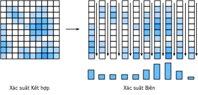

<!--
# Random Variables
-->

# Biến Ngẫu nhiên
:label:`sec_random_variables`


<!--
In :numref:`sec_prob` we saw the basics of how to work with discrete random variables, 
which in our case refer to those random variables which take either a finite set of possible values, or the integers.
In this section, we develop the theory of *continuous random variables*, which are random variables which can take on any real value.
-->

:numref:`sec_prob` đã giới thiệu các phương pháp cơ bản để làm việc với biến ngẫu nhiên rời rạc, 
mà trong trường hợp của ta các biến ngẫu nhiên này có thể chỉ có một tập hữu hạn các giá trị khả dĩ, hoặc có thể là toàn bộ các số nguyên.
Trong phần này, ta tìm hiểu lý thuyết cho *biến ngẫu nhiên liên tục*, là các biến ngẫu nhiên có thể nhận bất cứ giá trị số thực nào.

<!--
## Continuous Random Variables
-->

## Biến Ngẫu nhiên Liên tục


<!--
Continuous random variables are a significantly more subtle topic than discrete random variables.
A fair analogy to make is that the technical jump is comparable to the jump between adding lists of numbers and integrating functions.
As such, we will need to take some time to develop the theory.
-->

Biến ngẫu nhiên liên tục phức tạp hơn đáng kể so với biến ngẫu nhiên rời rạc.
Từ làm việc với các biến rời rạc chuyển sang làm việc với các biến liên tục cũng đòi hòi một bước nhảy về kiến thức chuyên môn 
tương tự như chuyển từ tính tổng dãy số sang tính tích phân hàm số.
Như vậy, ta sẽ cần dành một chút thời gian để phát triển lý thuyết.


<!--
### From Discrete to Continuous
-->

### Từ Rời rạc đến Liên tục


<!--
To understand the additional technical challenges encountered when working with continuous random variables, let us perform a thought experiment.
Suppose that we are throwing a dart at the dart board, and we want to know the probability that it hits exactly $2 \text{cm}$ from the center of the board.
-->

Để hiểu các thách thức kỹ thuật phát sinh khi làm việc với biến ngẫu nhiên liên tục, ta hãy thực hiện một thí nghiệm tưởng tượng sau đây.
Giả sử ta chơi phóng phi tiêu vào một bảng phi tiêu, và muốn biết xác suất nó cắm chính xác vào điểm cách hồng tâm $2 \text{cm}$.


<!--
To start with, we imagine measuring a single digit of accuracy, that is to say with bins for $0 \text{cm}$, $1 \text{cm}$, $2 \text{cm}$, and so on.
We throw say $100$ darts at the dart board, and if $20$ of them fall into the bin for $2\text{cm}$ 
we conclude that $20\%$ of the darts we throw hit the board $2 \text{cm}$ away from the center.
-->

Để bắt đầu, hãy hình dung ta thực hiện phép đo với độ chính xác một chữ số, tức là chia thành các vùng $0 \text{cm}$, $1 \text{cm}$, $2 \text{cm}$, v.v.
Phóng $100$ phi tiêu vào bảng phi tiêu, và nếu $20$ trong số đó rơi vào vùng $2\text{cm}$,
ta kết luận là $20\%$ phi tiêu ta phóng cắm vào điểm cách tâm $2 \text{cm}$.


<!--
However, when we look closer, this does not match our question!
We wanted exact equality, whereas these bins hold all that fell between say $1.5\text{cm}$ and $2.5\text{cm}$.
-->

Tuy nhiên, khi xét kỹ hơn, câu trả lời này không thỏa đáng!
Ta muốn một giá trị chính xác, trong khi các vùng đó lại chứa tất cả điểm nằm giữa $1.5\text{cm}$ và $2.5\text{cm}$.


<!--
Undeterred, we continue further.
We measure even more precisely, say $1.9\text{cm}$, $2.0\text{cm}$, $2.1\text{cm}$, 
and now see that perhaps $3$ of the $100$ darts hit the board in the $2.0\text{cm}$ bucket.
Thus we conclude the probability is $3\%$.
-->

Hãy tiếp tục với độ chính xác cao hơn, như là $1.9\text{cm}$, $2.0\text{cm}$, $2.1\text{cm}$,
và bây giờ ta thấy khoảng $3$ trong số $100$ phi tiêu cắm vào bảng trong vùng $2.0\text{cm}$. 
Do đó ta kết luận xác suất lúc này là $3\%$.


<!--
However, this does not solve anything!  We have just pushed the issue down one digit further. Let us abstract a bit.
Imagine we know the probability that the first $k$ digits match with $2.00000\ldots$ and we want to know the probability it matches for the first $k+1$ digits.
It is fairly reasonable to assume that the ${k+1}^{\mathrm{th}}$ digit is essentially a random choice from the set $\{0, 1, 2, \ldots, 9\}$.
At least, we cannot conceive of a physically meaningful process which would force the number of micrometers away form the center to prefer to end in a $7$ vs a $3$.
-->

Tuy nhiên, điều này chưa giải quyết bất cứ điều gì! Ta chỉ vừa đẩy vấn đề độ chính xác lên thêm một chữ số thập phân. Thay vào đó hãy trừu tượng hóa vấn đề lên một chút.
Hình dung ta biết xác suất mà $k$ chữ số đầu tiên khớp với $2.00000\ldots$ và ta muốn biết xác suất nó khớp với $k+1$ chữ số đầu tiên.
Khá hợp lý khi giả định là chữ số thứ $k+1$ có thể nhận giá trị ngẫu nhiên từ tập $\{0, 1, 2, \ldots, 9\}$.
Ít nhất là ta không thể nghĩ ra được bất kỳ tác nhân vật lý có ý nghĩa nào mà lại có ảnh hưởng tới độ chính xác ở mức micro mét, để chữ số cuối cùng là chữ số $7$ thay vì chữ số $3$ chẳng hạn.


<!--
What this means is that in essence each additional digit of accuracy we require should decrease probability of matching by a factor of $10$.
Or put another way, we would expect that
-->


Về cơ bản, việc tăng độ chính xác thêm một chữ số đòi hỏi xác suất khớp sẽ giảm xuống 10 lần.
Hay nói cách khác, ta kỳ vọng là


$$
P(\text{khoảng~cách~là}\; 2.00\ldots, \;\text{đến}\; k \;\text{chữ~số} ) \approx p\cdot10^{-k}.
$$


<!--
The value $p$ essentially encodes what happens with the first few digits, and the $10^{-k}$ handles the rest.
-->

Giá trị $p$ là xác suất khớp các chữ số đầu, và $10^{-k}$ mô tả cho phần còn lại.


<!--
Notice that if we know the position accurate to $k=4$ digits after the decimal.
That means we know the value falls within the interval say $[(1.99995,2.00005]$ which is an interval of length $2.00005-1.99995 = 10^{-4}$.
Thus, if we call the length of this interval $\epsilon$, we can say
-->

Lưu ý rằng nếu ta biết vị trí chính xác đến $k = 4$ chữ số thập phân,
có nghĩa là ta biết giá trị sẽ nằm trong khoảng  $[(1.99995,2.00005]$ có độ dài $2.00005-1.99995 = 10^{-4}$.
Do đó, nếu gọi độ dài của khoảng này là $\epsilon$, ta có:


$$
P(\text{khoảng~cách~nằm~trong~khoảng~rộng}\; \epsilon \; \text{xung~quanh}\; 2 ) \approx \epsilon \cdot p.
$$


<!--
Let us take this one final step further.
We have been thinking about the point $2$ the entire time, but never thinking about other points.
Nothing is different there fundamentally, but it is the case that the value $p$ will likely be different.
We would at least hope that a dart thrower was more likely to hit a point near the center, like $2\text{cm}$ rather than $20\text{cm}$.
Thus, the value $p$ is not fixed, but rather should depend on the point $x$.
This tells us that we should expect
-->

Ta hãy tổng quát hóa thêm một bước cuối.
Ta hiện chỉ đang xét điểm $2$, chưa nghĩ đến các điểm khác.
Về cơ bản, giá trị $p$ tại các điểm khác nhau có thể sẽ khác nhau.
Ít nhất ta hy vọng rằng người ném phi tiêu nhiều khả năng sẽ ngắm trúng vùng gần tâm, $2 \text{cm}$ hơn là $20 \text{cm}$.
Do đó, giá trị $p$ là không cố định, mà phụ thuộc vào điểm $x$.
Điều này cho thấy ta nên kỳ vọng:


$$P(\text{khoảng~cách~nằm~trong~khoảng~rộng}\; \epsilon \; \text{xung~quanh}\; x ) \approx \epsilon \cdot p(x).$$
:eqlabel:`eq_pdf_deriv`


<!--
Indeed, :eqref:`eq_pdf_deriv` precisely defines the *probability density function*.
It is a function $p(x)$ which encodes the relative probability of hitting near one point vs. another.
Let us visualize what such a function might look like.
-->

:eqref:`eq_pdf_deriv` định nghĩa *hàm mật độ xác suất - probability density function (p.d.f.)*,
là hàm $p(x)$ biểu diễn xác suất tương đối của việc ném trúng gần vị trí này so với vị trí khác.
Ta hãy trực quan hóa một hàm như vậy.


```{.python .input}
%matplotlib inline
from d2l import mxnet as d2l
from IPython import display
from mxnet import np, npx
npx.set_np()

# Plot the probability density function for some random variable
x = np.arange(-5, 5, 0.01)
p = 0.2*np.exp(-(x - 3)**2 / 2)/np.sqrt(2 * np.pi) + \
    0.8*np.exp(-(x + 1)**2 / 2)/np.sqrt(2 * np.pi)

d2l.plot(x, p, 'x', 'Density')
```

```{.python .input}
#@tab pytorch
%matplotlib inline
from d2l import torch as d2l
from IPython import display
import torch
torch.pi = torch.acos(torch.zeros(1)).item() * 2  # Define pi in torch

# Plot the probability density function for some random variable
x = torch.arange(-5, 5, 0.01)
p = 0.2*torch.exp(-(x - 3)**2 / 2)/torch.sqrt(2 * torch.tensor(torch.pi)) + \
    0.8*torch.exp(-(x + 1)**2 / 2)/torch.sqrt(2 * torch.tensor(torch.pi))

d2l.plot(x, p, 'x', 'Density')
```

```{.python .input}
#@tab tensorflow
%matplotlib inline
from d2l import tensorflow as d2l
from IPython import display
import tensorflow as tf
tf.pi = tf.acos(tf.zeros(1)).numpy() * 2  # Define pi in TensorFlow

# Plot the probability density function for some random variable
x = tf.range(-5, 5, 0.01)
p = 0.2*tf.exp(-(x - 3)**2 / 2)/tf.sqrt(2 * tf.constant(tf.pi)) + \
    0.8*tf.exp(-(x + 1)**2 / 2)/tf.sqrt(2 * tf.constant(tf.pi))

d2l.plot(x, p, 'x', 'Density')
```


<!--
The locations where the function value is large indicates regions where we are more likely to find the random value.
The low portions are areas where we are unlikely to find the random value.
-->

Các vị trí mà giá trị hàm lớn cho biết có nhiều khả năng giá trị ngẫu nhiên sẽ rơi vào đó.
Các vùng giá trị thấp là những vùng tại đó ít có khả năng giá trị ngẫu nhiên xuất hiện.


<!--
### Probability Density Functions
-->

### Hàm Mật độ Xác suất


<!--
Let us now investigate this further.
We have already seen what a probability density function is intuitively for a random variable $X$, namely the density function is a function $p(x)$ so that
-->

Bây giờ ta hãy tìm hiểu sâu hơn.
Chúng ta đã quan sát trực quan hàm mật độ xác suất $p(x)$ là gì đối với một biến ngẫu nhiên $X$, cụ thể:


$$P(X \; \text{nằm~trong~khoảng~rộng}\; \epsilon \; \text{xung~quanh}\; x ) \approx \epsilon \cdot p(x).$$
:eqlabel:`eq_pdf_def`


<!--
But what does this imply for the properties of $p(x)$?
-->

Nhưng phương trình này ám chỉ các tính chất gì của $p(x)$?


<!--
First, probabilities are never negative, thus we should expect that $p(x) \ge 0$ as well.
-->

Đầu tiên, xác suất không bao giờ âm, do đó $p(x) \ge 0 $.


<!--
Second, let us imagine that we slice up the $\mathbb{R}$ into an infinite number of slices which are $\epsilon$ wide, say with slices $(\epsilon\cdot i, \epsilon \cdot (i+1)]$.
For each of these, we know from :eqref:`eq_pdf_def` the probability is approximately
-->

Thứ hai, hãy tưởng tượng việc cắt $\mathbb{R}$ thành vô số lát cắt có chiều rộng $\epsilon$, mỗi lát cắt là nửa khoảng $(\epsilon\cdot i, \epsilon \cdot (i + 1)]$.
Đối với mỗi lắt cắt này, ta biết từ :eqref:`eq_pdf_def`, thì xác suất xấp xỉ


$$
P(X \; \text{nằm~trong~khoảng~rộng}\; \epsilon \; \text{xung~quanh}\; x ) \approx \epsilon \cdot p(\epsilon \cdot i),
$$


<!--
so summed over all of them it should be
-->

vì vậy tổng tất cả chúng sẽ là


$$
P(X\in\mathbb{R}) \approx \sum_i \epsilon \cdot p(\epsilon\cdot i).
$$


<!--
This is nothing more than the approximation of an integral discussed in :numref:`sec_integral_calculus`, thus we can say that
-->

Đây chỉ là xấp xỉ của một tích phân mà ta đã thảo luận trong :numref:`sec_integral_calculus`, do đó có thể nói rằng


$$
P(X\in\mathbb{R}) = \int_{-\infty}^{\infty} p(x) \; dx.
$$


<!--
We know that $P(X\in\mathbb{R}) = 1$, since the random variable must take on *some* number, we can conclude that for any density
-->

Ta biết là $P(X\in\mathbb{R}) = 1$, vì biến ngẫu nhiên này phải nhận một giá trị *nào đó* trong tập số thực, do đó ta có thể kết luận rằng với bất kỳ hàm mật độ nào:


$$
\int_{-\infty}^{\infty} p(x) \; dx = 1.
$$


<!--
Indeed, digging into this further shows that for any $a$, and $b$, we see that
-->

Thật vậy, đi sâu hơn vào phương trình này, ta thấy rằng với bất kỳ $a$ và $b$ nào:


$$
P(X\in(a, b]) = \int _ {a}^{b} p(x) \; dx.
$$


<!--
We may approximate this in code by using the same discrete approximation methods as before.
In this case we can approximate the probability of falling in the blue region.
-->

Ta có thể xấp xỉ phương trình này trong chương trình máy tính bằng cách sử dụng các phương pháp xấp xỉ rời rạc như trước đây. 
Trong trường hợp này, ta có thể ước tính xác suất nằm trong vùng màu xanh lam.


```{.python .input}
# Approximate probability using numerical integration
epsilon = 0.01
x = np.arange(-5, 5, 0.01)
p = 0.2*np.exp(-(x - 3)**2 / 2) / np.sqrt(2 * np.pi) + \
    0.8*np.exp(-(x + 1)**2 / 2) / np.sqrt(2 * np.pi)

d2l.set_figsize()
d2l.plt.plot(x, p, color='black')
d2l.plt.fill_between(x.tolist()[300:800], p.tolist()[300:800])
d2l.plt.show()

f'approximate Probability: {np.sum(epsilon*p[300:800])}'
```

```{.python .input}
#@tab pytorch
# Approximate probability using numerical integration
epsilon = 0.01
x = torch.arange(-5, 5, 0.01)
p = 0.2*torch.exp(-(x - 3)**2 / 2) / torch.sqrt(2 * torch.tensor(torch.pi)) +\
    0.8*torch.exp(-(x + 1)**2 / 2) / torch.sqrt(2 * torch.tensor(torch.pi))

d2l.set_figsize()
d2l.plt.plot(x, p, color='black')
d2l.plt.fill_between(x.tolist()[300:800], p.tolist()[300:800])
d2l.plt.show()

f'approximate Probability: {torch.sum(epsilon*p[300:800])}'
```

```{.python .input}
#@tab tensorflow
# Approximate probability using numerical integration
epsilon = 0.01
x = tf.range(-5, 5, 0.01)
p = 0.2*tf.exp(-(x - 3)**2 / 2) / tf.sqrt(2 * tf.constant(tf.pi)) +\
    0.8*tf.exp(-(x + 1)**2 / 2) / tf.sqrt(2 * tf.constant(tf.pi))

d2l.set_figsize()
d2l.plt.plot(x, p, color='black')
d2l.plt.fill_between(x.numpy().tolist()[300:800], p.numpy().tolist()[300:800])
d2l.plt.show()

f'approximate Probability: {tf.reduce_sum(epsilon*p[300:800])}'
```


<!--
It turns out that these two properties describe exactly the space of possible probability density functions (or *p.d.f.*'s for the commonly encountered abbreviation).
They are non-negative functions $p(x) \ge 0$ such that
-->

Hai tính chất trên mô tả chính xác không gian của các hàm mật độ xác suất.
Chúng là các hàm không âm $p(x) \ge 0$ sao cho


$$\int_{-\infty}^{\infty} p(x) \; dx = 1.$$
:eqlabel:`eq_pdf_int_one`


<!--
We interpret this function by using integration to obtain the probability our random variable is in a specific interval:
-->

Ta cũng có thể thu được xác suất biến ngẫu nhiên nằm trong một khoảng cụ thể bằng cách tính tích phân:


$$P(X\in(a, b]) = \int _ {a}^{b} p(x) \; dx.$$
:eqlabel:`eq_pdf_int_int`


<!--
In :numref:`sec_distributions` we will see a number of common distributions, but let us continue working in the abstract.
-->

Trong :numref:`sec_distributions`, ta sẽ gặp một số phân phối thông dụng, giờ hãy tiếp tục tìm hiểu các khái niệm lý thuyết.


<!--
### Cumulative Distribution Functions
-->

### Hàm Phân phối Tích lũy


<!--
In the previous section, we saw the notion of the p.d.f.
In practice, this is a commonly encountered method to discuss continuous random variables, 
but it has one significant pitfall: that the values of the p.d.f. are not themselves probabilities, but rather a function that we must integrate to yield probabilities.
There is nothing wrong with a density being larger than $10$, as long as it is not larger than $10$ for more than an interval of length $1/10$.
This can be counter-intuitive, so people often also think in terms of the *cumulative distribution function*, or c.d.f., which *is* a probability.
-->

Trong phần trước, chúng ta đã biết về hàm mật độ xác suất (p.d.f).
Trong thực tế, đây là một phương pháp thường dùng để thảo luận về các biến ngẫu nhiên liên tục,
nhưng nó có một nhược điểm khá lớn: bản thân các giá trị của p.d.f. không phải là các giá trị xác suất, mà ta phải tích phân hàm này để có xác suất.
Không có gì sai với môt hàm mật độ lớn hơn $10$, miễn là nó không lớn hơn $10$ trong khoảng có chiều dài lớn hơn $1/10$.
Điều này có thể hơi phản trực giác, do đó người ta thường dùng *hàm phân phối tích lũy - cumulative distribution function* hoặc c.d.f., mà có giá trị trả về *là* xác suất.

<!--
In particular, by using :eqref:`eq_pdf_int_int`, we define the c.d.f. for a random variable $X$ with density $p(x)$ by
-->

Cụ thể, với việc sử dụng :eqref:`eq_pdf_int_int`, ta định nghĩa c.d.f. cho một biến ngẫu nhiên $X$ với mật độ $p(x)$ như sau:


$$
F(x) = \int _ {-\infty}^{x} p(x) \; dx = P(X \le x).
$$


<!--
Let us observe a few properties.
-->

Hãy quan sát một vài tính chất của hàm này


<!--
* $F(x) \rightarrow 0$ as $x\rightarrow -\infty$.
* $F(x) \rightarrow 1$ as $x\rightarrow \infty$.
* $F(x)$ is non-decreasing ($y > x \implies F(y) \ge F(x)$).
* $F(x)$ is continuous (has no jumps) if $X$ is a continuous random variable.
-->


* $F(x)\rightarrow 0 $ khi $x\rightarrow -\infty$.
* $F(x)\rightarrow 1 $ khi $x\rightarrow \infty$.
* $F(x)$ không giảm ($y > x \implies F(y) \ge F(x)$).
* $F(x)$ là liên tục (không có bước nhảy) nếu $X$ là một biến ngẫu nhiên liên tục.


<!--
With the fourth bullet point, note that this would not be true if $X$ were discrete, say taking the values $0$ and $1$ both with probability $1/2$. In that case
-->

Ở gạch đầu dòng thứ tư, lưu ý rằng điều này không đúng nếu $X$ là rời rạc, ví dụ như khi $X$ chỉ nhận hai giá trị $0$ và $1$ với xác suất $1/2$. Trong trường hợp đó:


$$
F(x) = \begin{cases}
0 & x < 0, \\
\frac{1}{2} & x < 1, \\
1 & x \ge 1.
\end{cases}
$$


<!--
In this example, we see one of the benefits of working with the c.d.f., 
the ability to deal with continuous or discrete random variables in the same framework, or indeed mixtures of the two 
(flip a coin: if heads return the roll of a die, if tails return the distance of a dart throw from the center of a dart board).
-->

Trong ví dụ này, ta thấy một trong các lợi ích của việc sử dụng c.d.f.,
khả năng xử lý các biến ngẫu nhiên liên tục hoặc rời rạc với cùng một công cụ, hay thậm chí là hỗn hợp của cả hai
(tung một đồng xu: nếu mặt ngửa thì trả về giá trị khi thả xúc xắc, nếu mặt sấp thì trả về khoảng cách ném phi tiêu từ tâm của bảng hồng tâm).


<!--
### Means
-->

### Kỳ vọng


<!--
Suppose that we are dealing with a random variables $X$.
The distribution itself can be hard to interpret.
It is often useful to be able to summarize the behavior of a random variable concisely.
Numbers that help us capture the behavior of a random variable are called *summary statistics*.
The most commonly encountered ones are the *mean*, the *variance*, and the *standard deviation*.
-->

Giả sử ta đang làm việc với một biến ngẫu nhiên $X$.
Phân phối của biến này có thể khó để diễn giải.
Thường sẽ có ích nếu ta có thể tóm lược hành vi của một biến ngẫu nhiên một cách súc tích.
Những giá trị giúp ta nắm bắt được hành vi của một biến ngẫu nhiên được gọi là *thống kê tóm tắt*.
Các thống kê tóm tắt thường gặp nhất là *kỳ vọng*, *phương sai* và *độ lệch chuẩn*.


<!--
The *mean* encodes the average value of a random variable.
If we have a discrete random variable $X$, which takes the values $x_i$ with probabilities $p_i$, 
then the mean is given by the weighted average: sum the values times the probability that the random variable takes on that value:
-->

*Kỳ vọng* là giá trị trung bình của một biến ngẫu nhiên.
Nếu ta có một biến ngẫu nhiên rời rạc $X$, nhận giá trị $x_i$ với xác suất $p_i$,
thì kỳ vọng được tính từ trung bình có trọng số: tổng các tích của giá trị biến với xác suất nhận giá trị đó:


$$\mu_X = E[X] = \sum_i x_i p_i.$$
:eqlabel:`eq_exp_def`


<!--
The way we should interpret the mean (albeit with caution) is that it tells us essentially where the random variable tends to be located.
-->

Với một vài lưu ý, giá trị kỳ vọng này về cơ bản cho ta biết biến ngẫu nhiên có xu hướng nhận giá trị nào.


<!--
As a minimalistic example that we will examine throughout this section, 
let us take $X$ to be the random variable which takes the value $a-2$ with probability $p$, $a+2$ with probability $p$ and $a$ with probability $1-2p$.
We can compute using :eqref:`eq_exp_def` that, for any possible choice of $a$ and $p$, the mean is
-->

Xét một ví dụ tối giản xuyên suốt phần này,
gọi $X$ là biến ngẫu nhiên nhận giá trị $a-2$ với xác suất $p$, $a + 2$ với xác suất $p$ và $a$ với xác suất $1-2p$.
Theo :eqref:`eq_exp_def`, với bất kỳ giá trị khả dĩ nào của $a$ và $p$, giá trị kỳ vọng là:


$$
\mu_X = E[X] = \sum_i x_i p_i = (a-2)p + a(1-2p) + (a+2)p = a.
$$


<!--
Thus we see that the mean is $a$. This matches the intuition since $a$ is the location around which we centered our random variable.
-->

Ta thấy rằng giá trị kỳ vọng là $a$. Điều này đúng với trực giác vì $a$ là vị trí trung tâm của biến ngẫu nhiên này.


<!--
Because they are helpful, let us summarize a few properties.
-->

Bởi sự hữu dụng của kỳ vọng, hãy tổng hợp một vài tính chất của chúng.


<!--
* For any random variable $X$ and numbers $a$ and $b$, we have that $\mu_{aX+b} = a\mu_X + b$.
* If we have two random variables $X$ and $Y$, we have $\mu_{X+Y} = \mu_X+\mu_Y$.
-->

* Với biến ngẫu nhiên $X$ và hai số $a$, $b$ bất kỳ: $\mu_{aX + b} = a\mu_X + b$.
* Với hai biến ngẫu nhiên $X$ và $Y$: $\mu_{X + Y} = \mu_X+\mu_Y$.

<!--
Means are useful for understanding the average behavior of a random variable, however the mean is not sufficient to even have a full intuitive understanding.
Making a profit of $\$10 \pm \$1$ per sale is very different from making $\$10 \pm \$15$ per sale despite having the same average value.
The second one has a much larger degree of fluctuation, and thus represents a much larger risk.
Thus, to understand the behavior of a random variable, we will need at minimum one more measure: some measure of how widely a random variable fluctuates.
-->

Kỳ vọng rất hữu ích để hiểu hành vi trung bình của một biến ngẫu nhiên, tuy nhiên nó vẫn không đủ để ta có được một cách nhìn trực quan toàn diện.
Tạo ra lợi nhuận $\$10 \pm \$1$ rất khác với việc tạo ra $\$10 \pm \$15$ cho mỗi giao dịch mặc dù cả hai có cùng kỳ vọng.
Trường hợp thứ hai có mức độ dao động lớn hơn nhiều và do đó rủi ro cũng lớn hơn nhiều.
Vì vậy, để hiểu hành vi của một biến ngẫu nhiên, ta sẽ cần thêm tối thiểu một thước đo nữa thể hiện biên độ dao động của biến ngẫu nhiên đó.


<!--
### Variances
-->

### Phương sai


<!--
This leads us to consider the *variance* of a random variable.
This is a quantitative measure of how far a random variable deviates from the mean.
Consider the expression $X - \mu_X$. This is the deviation of the random variable from its mean.
This value can be positive or negative, so we need to do something to make it positive so that we are measuring the magnitude of the deviation.
-->

Điều này dẫn tới khái niệm *phương sai* của biến ngẫu nhiên.
Đây là một thước đo định lượng khoảng dao động quanh giá trị kỳ vọng của một biến ngẫu nhiên.
Xét biểu thức $X - \mu_X$. Đây là độ lệch (*deviation*) của biến ngẫu nhiên so với kỳ vọng của nó.
Giá trị này có thể dương hoặc âm, vì vậy ta cần thực hiện thêm thao tác để lấy độ lớn (luôn dương) của độ lệch này.


<!--
A reasonable thing to try is to look at $\left|X-\mu_X\right|$, and indeed this leads to a useful quantity called the *mean absolute deviation*, 
however due to connections with other areas of mathematics and statistics, people often use a different solution.
-->

Một cách hợp lý là lấy $\left|X-\mu_X\right|$, và thực sự điều này dẫn đến một đại lượng hữu dụng là *trung bình độ lệch tuyệt đối - mean absolute deviation*,
tuy nhiên do mối liên hệ với các lĩnh vực toán học và thống kê khác, người ta thường dùng một giải pháp khác.


<!--
In particular, they look at $(X-\mu_X)^2.$.  If we look at the typical size of this quantity by taking the mean, we arrive at the variance
-->

Cụ thể là $(X-\mu_X)^2.$. Nếu lấy giá trị kỳ vọng của đại lượng này, ta có phương sai:

$$\sigma_X^2 = \mathrm{Var}(X) = E\left[(X-\mu_X)^2\right] = E[X^2] - \mu_X^2.$$
:eqlabel:`eq_var_def`


<!--
The last equality in :eqref:`eq_var_def` holds by expanding out the definition in the middle, and applying the properties of expectation.
-->

Đẳng thức cuối cùng trong :eqref:`eq_var_def` có được bằng cách khai triển các số hạng trong vế giữa và vận dụng các tính chất của kỳ vọng.

<!--
Let us look at our example where $X$ is the random variable which takes the value $a-2$ with probability $p$, $a+2$ with probability $p$ and $a$ with probability $1-2p$.
In this case $\mu_X = a$, so all we need to compute is $E\left[X^2\right]$. This can readily be done:
-->

Hãy cùng xem lại ví dụ trong đó $X$ là biến ngẫu nhiên nhận giá trị $a-2$ với xác suất $p$, $a+2$ với xác suất $p$ và $a$ với xác suất $1-2p$.
Trong trường hợp này, ta đã biết $\mu_X = a$, vì vậy chỉ cần tính $E\left[X^2\right]$ như sau:


$$
E\left[X^2\right] = (a-2)^2p + a^2(1-2p) + (a+2)^2p = a^2 + 8p.
$$


<!--
Thus, we see that by :eqref:`eq_var_def` our variance is
-->

Sau đó, theo :eqref:`eq_var_def` ta có phương sai:

$$
\sigma_X^2 = \mathrm{Var}(X) = E[X^2] - \mu_X^2 = a^2 + 8p - a^2 = 8p.
$$


<!--
This result again makes sense. The largest $p$ can be is $1/2$ which corresponds to picking $a-2$ or $a+2$ with a coin flip.
The variance of this being $4$ corresponds to the fact that both $a-2$ and $a+2$ are $2$ units away from the mean, and $2^2 = 4$.
On the other end of the spectrum, if $p=0$, this random variable always takes the value $0$ and so it has no variance at all.
-->

Kết quả này cũng hợp lý. Giá trị lớn nhất có thể của $p$ là $1/2$, tương ứng với việc chọn $a-2$ hoặc $a+2$ (tương tự khi tung đồng xu).
Lúc này giá trị phương sai tính theo công thức trên bằng $4$, đúng với thực tế là cả $a-2$ và $a+2$ cùng có độ lệch khỏi giá trị trung bình là $2$ và $2^2 = 4$.
Ngược lại, nếu $p=0$, tức biến ngẫu nhiên này luôn nhận giá trị $0$ và vì thế có phương sai bằng $0$.

<!--
We will list a few properties of variance below:
-->

Hãy liệt kê một vài tính chất của phương sai:

<!--
* For any random variable $X$, $\mathrm{Var}(X) \ge 0$, with $\mathrm{Var}(X) = 0$ if and only if $X$ is a constant.
* For any random variable $X$ and numbers $a$ and $b$, we have that $\mathrm{Var}(aX+b) = a^2\mathrm{Var}(X)$.
* If we have two *independent* random variables $X$ and $Y$, we have $\mathrm{Var}(X+Y) = \mathrm{Var}(X) + \mathrm{Var}(Y)$.
-->

* Với biến ngẫu nhiên $X$ bất kỳ: $\mathrm{Var}(X) \ge 0$, với $\mathrm{Var}(X) = 0$ khi và chỉ khi $X$ là hằng số.
* Với biến ngẫu nhiên $X$ và hai số $a$, $b$ bất kỳ: $\mathrm{Var}(aX+b) = a^2\mathrm{Var}(X)$.
* Nếu hai biến ngẫu nhiên $X$ và $Y$ là *độc lập*: $\mathrm{Var}(X+Y) = \mathrm{Var}(X) + \mathrm{Var}(Y)$.

<!--
When interpreting these values, there can be a bit of a hiccup.
In particular, let us try imagining what happens if we keep track of units through this computation.
Suppose that we are working with the star rating assigned to a product on the web page.
Then $a$, $a-2$, and $a+2$ are all measured in units of stars.
Similarly, the mean $\mu_X$ is then also measured in stars (being a weighted average).
However, if we get to the variance, we immediately encounter an issue, which is we want to look at $(X-\mu_X)^2$, which is in units of *squared stars*.
This means that the variance itself is not comparable to the original measurements.
To make it interpretable, we will need to return to our original units.
-->

Khi diễn giải các giá trị này, ta có thể gặp một chút vướng mắc.
Cụ thể, hãy để ý đến đơn vị của các phép tính.
Giả sử ta đang làm việc với số sao được đánh giá cho một sản phẩm trên trang web.
Khi đó $a$, $a-2$, and $a+2$ đều được đo bằng đơn vị ngôi sao.
Tương tự, kỳ vọng $\mu_X$ sau đó cũng có đơn vị là ngôi sao (được tính là trung bình có trọng số).
Tuy nhiên, nếu xét đến phương sai, ta ngay lập tức gặp phải vấn đề, đó là $(X-\mu_X)^2$ sẽ có đơn vị *bình phương* số sao.
Điều này có nghĩa là bản thân phương sai không thể dùng để so sánh trong phép đo ban đầu.
Để có thể diễn giải được nó, ta cần quay lại đơn vị gốc.


<!--
### Standard Deviations
-->

### Độ lệch chuẩn


<!--
This summary statistics can always be deduced from the variance by taking the square root! Thus we define the *standard deviation* to be
-->

*Độ lệch chuẩn* luôn có thể suy ra bằng cách lấy căn bậc hai của phương sai:

$$
\sigma_X = \sqrt{\mathrm{Var}(X)}.
$$


<!--
In our example, this means we now have the standard deviation is $\sigma_X = 2\sqrt{2p}$.
If we are dealing with units of stars for our review example, $\sigma_X$ is again in units of stars.
-->

Trong ví dụ trên, ta có độ lệch chuẩn $\sigma_X = 2\sqrt{2p}$.
Nếu đơn vị ta đang xét là số sao trong ví dụ đánh giá của mình, $\sigma_X$ vẫn có đơn vị này.

<!--
The properties we had for the variance can be restated for the standard deviation.
-->

Các tính chất của phương sai có thể được áp dụng lại cho độ lệch chuẩn.

<!--
* For any random variable $X$, $\sigma_{X} \ge 0$.
* For any random variable $X$ and numbers $a$ and $b$, we have that $\sigma_{aX+b} = |a|\sigma_{X}$
* If we have two *independent* random variables $X$ and $Y$, we have $\sigma_{X+Y} = \sqrt{\sigma_{X}^2 + \sigma_{Y}^2}$.
-->

* Với biến ngẫu nhiên $X$ bất kỳ: $\sigma_{X} \ge 0$.
* Với biến ngẫu nhiên $X$ và hai số $a$, $b$ bất kỳ: $\sigma_{aX+b} = |a|\sigma_{X}$
* Nếu hai biến ngẫu nhiên $X$ và $Y$ là *độc lập*: $\sigma_{X+Y} = \sqrt{\sigma_{X}^2 + \sigma_{Y}^2}$.

<!--
It is natural at this moment to ask, "If the standard deviation is in the units of our original random variable, does it represent something we can draw with regards to that random variable?"
The answer is a resounding yes! Indeed much like the mean told we the typical location of our random variable, the standard deviation gives the typical range of variation of that random variable.
We can make this rigorous with what is known as Chebyshev's inequality:
-->

Lúc này hãy đặt câu hỏi, "Nếu độ lệch chuẩn cùng đơn vị với biến ngẫu nhiên ban đầu, nó có cung cấp thông tin gì về biến ngẫu nhiên đó không?"
Câu trả lời là có! Thật vậy, giống như kỳ vọng cho biết vị trí điển hình, độ lệch chuẩn cho biết khoảng biến thiên thường gặp của biến ngẫu nhiên đó.
Ta có thể chứng minh chặt chẽ bằng bất đẳng thức Chebyshev:


$$P\left(X \not\in [\mu_X - \alpha\sigma_X, \mu_X + \alpha\sigma_X]\right) \le \frac{1}{\alpha^2}.$$
:eqlabel:`eq_chebyshev`


<!--
Or to state it verbally in the case of $\alpha=10$, $99\%$ of the samples from any random variable fall within $10$ standard deviations of the mean.
This gives an immediate interpretation to our standard summary statistics.
-->

Diễn giải bằng lời như sau: ví dụ khi $\alpha=10$, $99\%$ số mẫu của bất kỳ biến ngẫu nhiên nào sẽ nằm trong khoảng $10$ độ lệch chuẩn về 2 phía của giá trị kỳ vọng.
Điều này cho ta một cách giải thích trực tiếp các thống kê tóm tắt tiêu chuẩn.

<!--
To see how this statement is rather subtle, let us take a look at our running example again where $X$ is the random variable 
which takes the value $a-2$ with probability $p$, $a+2$ with probability $p$ and $a$ with probability $1-2p$.
We saw that the mean was $a$ and the standard deviation was $2\sqrt{2p}$.
This means, if we take Chebyshev's inequality :eqref:`eq_chebyshev` with $\alpha = 2$, we see that the expression is
-->

Để thấy sự tinh tế của mệnh đề này, hãy xét lại ví dụ trong đó $X$ là biến ngẫu nhiên nhận giá trị $a-2$ với xác suất $p$, $a+2$ với xác suất $p$ và $a$ với xác suất $1-2p$.
Ta có kỳ vọng là $a$ và độ lệch chuẩn là $2\sqrt{2p}$.
Từ bất đẳng thức Chebyshev :eqref:`eq_chebyshev` với $\alpha = 2$, ta có


$$
P\left(X \not\in [a - 4\sqrt{2p}, a + 4\sqrt{2p}]\right) \le \frac{1}{4}.
$$


<!--
This means that $75\%$ of the time, this random variable will fall within this interval for any value of $p$.
Now, notice that as $p \rightarrow 0$, this interval also converges to the single point $a$.
But we know that our random variable takes the values $a-2, a$, and $a+2$ only so eventually we can be certain $a-2$ and $a+2$ will fall outside the interval!
The question is, at what $p$ does that happen. So we want to solve: for what $p$ does $a+4\sqrt{2p} = a+2$, which is solved when $p=1/8$, 
which is *exactly* the first $p$ where it could possibly happen without violating our claim that no more than $1/4$ of samples from 
the distribution would fall outside the interval ($1/8$ to the left, and $1/8$ to the right).
-->

Điều này có nghĩa là trong $75\%$ số lần lấy mẫu, biến ngẫu nhiên sẽ rơi vào khoảng trên, bất kể giá trị của $p$.
Bây giờ, hãy lưu ý rằng khi $p \rightarrow 0$, thì khoảng này cũng hội tụ đến điểm duy nhất là $a$.
Tuy nhiên biến ngẫu nhiên chỉ nhận các giá trị $a-2, a$ và $a+2$ nên $a-2$ và $a+2$ chắc chắn sẽ nằm ngoài khoảng này!
Câu hỏi đặt ra là giá trị $p$ bằng bao nhiêu để $a-2$ và $a+2$ nằm trong khoảng đó? Ta cần giải phương trình: $a+4\sqrt{2p} = a+2$ để ra nghiệm $p=1/8$,
đó *chính xác* là giá trị $p$ nhỏ nhất thỏa mãn yêu cầu rằng không quá $1/4$ số mẫu nằm ngoài khoảng ($1/8$ về phía trái và $1/8$ về phía phải giá trị kỳ vọng).


<!--
Let us visualize this. We will show the probability of getting the three values as three vertical bars with height proportional to the probability.
The interval will be drawn as a horizontal line in the middle. The first plot shows what happens for $p > 1/8$ where the interval safely contains all points.
-->

Hãy cùng trực quan hóa điều này. Chúng ta sẽ đưa ra xác suất nhận được ba giá trị tương ứng là ba thanh dọc có chiều cao tỷ lệ với xác suất.
Khoảng trên sẽ được biểu diễn dưới dạng một đường ngang ở giữa. Biểu đồ đầu tiên cho thấy khi $p> 1/8$, khoảng này chứa hoàn toàn các điểm.


```{.python .input}
# Define a helper to plot these figures
def plot_chebyshev(a, p):
    d2l.set_figsize()
    d2l.plt.stem([a-2, a, a+2], [p, 1-2*p, p], use_line_collection=True)
    d2l.plt.xlim([-4, 4])
    d2l.plt.xlabel('x')
    d2l.plt.ylabel('p.m.f.')

    d2l.plt.hlines(0.5, a - 4 * np.sqrt(2 * p),
                   a + 4 * np.sqrt(2 * p), 'black', lw=4)
    d2l.plt.vlines(a - 4 * np.sqrt(2 * p), 0.53, 0.47, 'black', lw=1)
    d2l.plt.vlines(a + 4 * np.sqrt(2 * p), 0.53, 0.47, 'black', lw=1)
    d2l.plt.title(f'p = {p:.3f}')

    d2l.plt.show()

# Plot interval when p > 1/8
plot_chebyshev(0.0, 0.2)
```

```{.python .input}
#@tab pytorch
# Define a helper to plot these figures
def plot_chebyshev(a, p):
    d2l.set_figsize()
    d2l.plt.stem([a-2, a, a+2], [p, 1-2*p, p], use_line_collection=True)
    d2l.plt.xlim([-4, 4])
    d2l.plt.xlabel('x')
    d2l.plt.ylabel('p.m.f.')

    d2l.plt.hlines(0.5, a - 4 * torch.sqrt(2 * p),
                   a + 4 * torch.sqrt(2 * p), 'black', lw=4)
    d2l.plt.vlines(a - 4 * torch.sqrt(2 * p), 0.53, 0.47, 'black', lw=1)
    d2l.plt.vlines(a + 4 * torch.sqrt(2 * p), 0.53, 0.47, 'black', lw=1)
    d2l.plt.title(f'p = {p:.3f}')

    d2l.plt.show()

# Plot interval when p > 1/8
plot_chebyshev(0.0, torch.tensor(0.2))
```

```{.python .input}
#@tab tensorflow
# Define a helper to plot these figures
def plot_chebyshev(a, p):
    d2l.set_figsize()
    d2l.plt.stem([a-2, a, a+2], [p, 1-2*p, p], use_line_collection=True)
    d2l.plt.xlim([-4, 4])
    d2l.plt.xlabel('x')
    d2l.plt.ylabel('p.m.f.')

    d2l.plt.hlines(0.5, a - 4 * tf.sqrt(2 * p),
                   a + 4 * tf.sqrt(2 * p), 'black', lw=4)
    d2l.plt.vlines(a - 4 * tf.sqrt(2 * p), 0.53, 0.47, 'black', lw=1)
    d2l.plt.vlines(a + 4 * tf.sqrt(2 * p), 0.53, 0.47, 'black', lw=1)
    d2l.plt.title(f'p = {p:.3f}')

    d2l.plt.show()

# Plot interval when p > 1/8
plot_chebyshev(0.0, tf.constant(0.2))
```


<!--
The second shows that at $p = 1/8$, the interval exactly touches the two points.
This shows that the inequality is *sharp*, since no smaller interval could be taken while keeping the inequality true.
-->

Biểu đồ thứ hai cho thấy tại $p = 1/8$, khoảng này tiếp xúc với hai điểm.
Khoảng này là *vừa đủ*, vì không thể chọn khoảng nhỏ hơn mà bất đẳng thức vẫn đúng.


```{.python .input}
# Plot interval when p = 1/8
plot_chebyshev(0.0, 0.125)
```

```{.python .input}
#@tab pytorch
# Plot interval when p = 1/8
plot_chebyshev(0.0, torch.tensor(0.125))
```

```{.python .input}
#@tab tensorflow
# Plot interval when p = 1/8
plot_chebyshev(0.0, tf.constant(0.125))
```


<!--
The third shows that for $p < 1/8$ the interval only contains the center.
This does not invalidate the inequality since we only needed to ensure that no more than $1/4$ of the probability falls outside the interval, 
which means that once $p < 1/8$, the two points at $a-2$ and $a+2$ can be discarded.
-->

Biểu đồ thứ ba cho thấy với $p < 1/8$ thì khoảng chỉ chứa giá trị trung tâm.
Điều này không vi phạm bất đẳng thức vì ta chỉ cần đảm bảo rằng không quá $1/4$ xác suất nằm ngoài khoảng,
trên thực tế khi $p < 1/8$, biến ngẫu nhiên không thể nhận hai giá trị $a-2$ và $a+2$.


```{.python .input}
# Plot interval when p < 1/8
plot_chebyshev(0.0, 0.05)
```

```{.python .input}
#@tab pytorch
# Plot interval when p < 1/8
plot_chebyshev(0.0, torch.tensor(0.05))
```

```{.python .input}
#@tab tensorflow
# Plot interval when p < 1/8
plot_chebyshev(0.0, tf.constant(0.05))
```


<!--
### Means and Variances in the Continuum
-->

### Kỳ vọng và Phương sai trên Miền liên tục


<!--
This has all been in terms of discrete random variables, but the case of continuous random variables is similar.
To intuitively understand how this works, imagine that we split the real number line into intervals of length $\epsilon$ given by $(\epsilon i, \epsilon (i+1)]$.
Once we do this, our continuous random variable has been made discrete and we can use :eqref:`eq_exp_def` say that
-->

Tới giờ ta đều mới chỉ xét biến ngẫu nhiên rời rạc, tuy nhiên trường hợp biến ngẫu nhiên liên tục cũng tương tự.
Để hiểu cách hoạt động của các biến liên tục một cách trực quan, hãy tưởng tượng ta chia trục số nguyên thành nhiều khoảng với độ dài $\epsilon$ trong khoảng $[\epsilon i, \epsilon (i+1)]$.
Sau khi thực hiện điều này, biến ngẫu nhiên liên tục trên trở thành dạng rời rạc và ta có thể áp dụng :eqref:`eq_exp_def` dưới dạng:


$$
\begin{aligned}
\mu_X & \approx \sum_{i} (\epsilon i)P(X \in (\epsilon i, \epsilon (i+1)]) \\
& \approx \sum_{i} (\epsilon i)p_X(\epsilon i)\epsilon, \\
\end{aligned}
$$


<!--
where $p_X$ is the density of $X$. This is an approximation to the integral of $xp_X(x)$, so we can conclude that
-->

trong đó $p_X$ là hàm mật độ của $X$. Đây là xấp xỉ tích phân của $xp_X(x)$, do đó ta có thể kết luận rằng:


$$
\mu_X = \int_{-\infty}^\infty xp_X(x) \; dx.
$$


<!--
Similarly, using :eqref:`eq_var_def` the variance can be written as
-->

Tương tự, áp dụng :eqref:`eq_var_def`, phương sai có thể được biểu diễn như sau:


$$
\sigma^2_X = E[X^2] - \mu_X^2 = \int_{-\infty}^\infty x^2p_X(x) \; dx - \left(\int_{-\infty}^\infty xp_X(x) \; dx\right)^2.
$$


<!--
Everything stated above about the mean, the variance, and the standard deviation still applies in this case.
For instance, if we consider the random variable with density
-->

Tất cả những tính chất về kỳ vọng, phương sai và độ lệch chuẩn cho biến ngẫu nhiên rời rạc đều có thể áp dụng trong trường hợp liên tục.
Ví dụ, xét biến ngẫu nhiên với hàm mật độ:


$$
p(x) = \begin{cases}
1 & x \in [0,1], \\
0 & \text{otherwise}.
\end{cases}
$$


<!--
we can compute
-->

ta có thể tính:


$$
\mu_X = \int_{-\infty}^\infty xp(x) \; dx = \int_0^1 x \; dx = \frac{1}{2}.
$$

và

$$
\sigma_X^2 = \int_{-\infty}^\infty x^2p(x) \; dx - \left(\frac{1}{2}\right)^2 = \frac{1}{3} - \frac{1}{4} = \frac{1}{12}.
$$


<!--
As a warning, let us examine one more example, known as the *Cauchy distribution*. This is the distribution with p.d.f. given by
-->

Để lưu ý, hãy quan sát thêm một ví dụ về *phân phối Cauchy*, với hàm mật độ:


$$
p(x) = \frac{1}{1+x^2}.
$$

```{.python .input}
# Plot the Cauchy distribution p.d.f.
x = np.arange(-5, 5, 0.01)
p = 1 / (1 + x**2)

d2l.plot(x, p, 'x', 'p.d.f.')
```

```{.python .input}
#@tab pytorch
# Plot the Cauchy distribution p.d.f.
x = torch.arange(-5, 5, 0.01)
p = 1 / (1 + x**2)

d2l.plot(x, p, 'x', 'p.d.f.')
```

```{.python .input}
#@tab tensorflow
# Plot the Cauchy distribution p.d.f.
x = tf.range(-5, 5, 0.01)
p = 1 / (1 + x**2)

d2l.plot(x, p, 'x', 'p.d.f.')
```


<!--
This function looks innocent, and indeed consulting a table of integrals will show it has area one under it, and thus it defines a continuous random variable.
-->

Hàm này nhìn có vẻ không có vấn đề gì, và quả thật tra cứu bảng tích phân chỉ ra rằng diện tích vùng dưới nó bằng 1, và do đó nó định nghĩa một biến ngẫu nhiên liên tục.


<!--
To see what goes astray, let us try to compute the variance of this.  This would involve using :eqref:`eq_var_def` computing
-->

Để xem có vấn đề gì ở đây, hãy thử tính phương sai của hàm này bằng :eqref:`eq_var_def`:


$$
\int_{-\infty}^\infty \frac{x^2}{1+x^2}\; dx.
$$


<!--
The function on the inside looks like this:
-->

Hàm bên trong tích phân có dạng:


```{.python .input}
# Plot the integrand needed to compute the variance
x = np.arange(-20, 20, 0.01)
p = x**2 / (1 + x**2)

d2l.plot(x, p, 'x', 'integrand')
```

```{.python .input}
#@tab pytorch
# Plot the integrand needed to compute the variance
x = torch.arange(-20, 20, 0.01)
p = x**2 / (1 + x**2)

d2l.plot(x, p, 'x', 'integrand')
```

```{.python .input}
#@tab tensorflow
# Plot the integrand needed to compute the variance
x = tf.range(-20, 20, 0.01)
p = x**2 / (1 + x**2)

d2l.plot(x, p, 'x', 'integrand')
```


<!--
This function clearly has infinite area under it since it is essentially the constant one with a small dip near zero, and indeed we could show that
-->

Hàm này rõ ràng có phần diện tích bên dưới là vô hạn do về cơ bản nó là hằng số 1 với một đoạn trũng xuống gần 0, và quả thật:


$$
\int_{-\infty}^\infty \frac{x^2}{1+x^2}\; dx = \infty.
$$


<!--
This means it does not have a well-defined finite variance.
-->

Điều này có nghĩa là nó không có một phương sai hữu hạn đúng nghĩa.


<!--
However, looking deeper shows an even more disturbing result.  Let us try to compute the mean using :eqref:`eq_exp_def`.  Using the change of variables formula, we see
-->

Tuy vậy, nếu quan sát kĩ hơn ta có thể thấy một kết quả khó hiểu hơn nhiều.
Hãy thử tính kỳ vọng sử dụng :eqref:`eq_exp_def`. Sử dụng đổi biến, ta được:


$$
\mu_X = \int_{-\infty}^{\infty} \frac{x}{1+x^2} \; dx = \frac{1}{2}\int_1^\infty \frac{1}{u} \; du.
$$


<!--
The integral inside is the definition of the logarithm, so this is in essence $\log(\infty) = \infty$, so there is no well-defined average value either!
-->

Hàm tích phân bên trong chính là định nghĩa của hàm logarit, do đó tích phân này có kết quả $\log(\infty) = \infty$, nên cũng không tồn tại giá trị kỳ vọng xác định!


<!--
Machine learning scientists define their models so that we most often do not need to deal with these issues, 
and will in the vast majority of cases deal with random variables with well-defined means and variances.
However, every so often random variables with *heavy tails* (that is those random variables where the probabilities of 
getting large values are large enough to make things like the mean or variance undefined) are helpful in modeling physical systems, thus it is worth knowing that they exist.
-->

Các nhà khoa học học máy định nghĩa mô hình của họ để thường không phải đối mặt với những vấn đề này,
và trong đại đa số các trường hợp, ta sẽ xử lý những biến ngẫu nhiên với kỳ vọng và phương sai xác định.
Tuy vậy, đôi khi biến ngẫu nhiên với *đuôi nặng (heavy tails)* 
(có xác suất thu được các giá trị lớn là đủ lớn để khiến kỳ vọng hay phương sai không xác định) 
vẫn có ích trong việc mô hình hóa những hệ thống vật lý, vậy nên sự tồn tại của chúng đáng để biết tới.


<!--
### Joint Density Functions
-->

### Hàm Mật độ Kết hợp


<!--
The above work all assumes we are working with a single real valued random variable.
But what if we are dealing with two or more potentially highly correlated random variables?
This circumstance is the norm in machine learning: imagine random variables like $R_{i, j}$ 
which encode the red value of the pixel at the $(i, j)$ coordinate in an image, or $P_t$ which is a random variable given by a stock price at time $t$.
Nearby pixels tend to have similar color, and nearby times tend to have similar prices.
We cannot treat them as separate random variables, and expect to create a successful model 
(we will see in :numref:`sec_naive_bayes` a model that under-performs due to such an assumption).
We need to develop the mathematical language to handle these correlated continuous random variables.
-->

Toàn bộ phần phía trên đều chỉ xét biến ngẫu nhiên đơn lẻ có giá trị thực.
Trường hợp có hai hay nhiều biến ngẫu nhiên hơn, mà thường giữa chúng có mối tương quan cao, thì sao?
Tình huống này rất hay gặp trong học máy: tưởng tượng biến ngẫu nhiên $R_{i, j}$
mã hóa giá trị màu đỏ của điểm ảnh tại toạ độ $(i, j)$ trong một ảnh, hay biến $P_t$ biểu diễn giá chứng khóan tại thời điểm $t$.
Những điểm ảnh lân cận thường có màu tương tự, và giá tại các thời điểm lân cận thường tương tự.
Ta không thể xem chúng như những biến ngẫu nhiên riêng biệt, và cũng không thể xây dựng một mô hình tốt
(trong :numref:`sec_naive_bayes` có ví dụ một mô hình hoạt động kém do giả sử như vậy).
Ta cần phát triển lý thuyết toán học để làm việc với những biến ngẫu nhiên liên tục có tương quan với nhau như vậy.


<!--
Thankfully, with the multiple integrals in :numref:`sec_integral_calculus` we can develop such a language.
Suppose that we have, for simplicity, two random variables $X, Y$ which can be correlated.
Then, similar to the case of a single variable, we can ask the question:
-->

May mắn thay, với tích phân bội trong :numref:`sec_integral_calculus`, ta có thể phát triển một lý thuyết như vậy.
Để đơn giản, giả sử ta có hai biến ngẫu nhiên $X, Y$ có thể tương quan với nhau.
Sau đó, tương tự như trường hợp đơn biến, ta có thể đặt câu hỏi:


<!-- $$
P(X \;\text{is in an}\; \epsilon \text{-sized interval around}\; x \; \text{and} \;Y \;\text{is in an}\; \epsilon \text{-sized interval around}\; y ).
$$ -->

$$
P(X \;\text{nằm~trong~khoảng~rộng}\; \epsilon \; \text{xung~quanh}\; x \; \text{và} \;Y \;\text{nằm~trong~khoảng~rộng}\; \epsilon \; \text{xung~quanh}\; y ).
$$

<!--
Similar reasoning to the single variable case shows that this should be approximately
-->

Suy luận tương tự như trường hợp biến đơn chỉ ra rằng mệnh đề trên có thể xấp xỉ với:


<!-- $$
P(X \;\text{is in an}\; \epsilon \text{-sized interval around}\; x \; \text{and} \;Y \;\text{is in an}\; \epsilon \text{-sized interval around}\; y ) \approx \epsilon^{2}p(x, y),
$$ -->

$$
P(X \;\text{nằm~trong~khoảng~rộng}\; \epsilon \; \text{xung~quanh}\; x \; \text{và} \;Y \;\text{nằm~trong~khoảng~rộng}\; \epsilon \; \text{xung~quanh}\; y ) \approx \epsilon^{2}p(x, y),
$$


<!--
for some function $p(x, y)$.  This is referred to as the joint density of $X$ and $Y$.
Similar properties are true for this as we saw in the single variable case. Namely:
-->

với một hàm $p(x, y)$ nào đó. Đây được gọi là mật độ kết hợp của $X$ và $Y$.
Những tính chất của hàm mật độ cho biến đơn vẫn đúng cho trường hợp này:


* $p(x, y) \ge 0$;
* $\int _ {\mathbb{R}^2} p(x, y) \;dx \;dy = 1$;
* $P((X, Y) \in \mathcal{D}) = \int _ {\mathcal{D}} p(x, y) \;dx \;dy$.


<!--
In this way, we can deal with multiple, potentially correlated random variables.
If we wish to work with more than two random variables, we can extend the multivariate density to as many coordinates as desired by considering $p(\mathbf{x}) = p(x_1, \ldots, x_n)$.
The same properties of being non-negative, and having total integral of one still hold.
-->

Bằng cách này, ta có thể làm việc với nhiều biến ngẫu nhiên tương quan với nhau.
Nếu số biến ngẫu nhiên nhiều hơn 2, ta có thể mở rộng hàm mật độ nhiều chiều: $p(\mathbf{x}) = p(x_1, \ldots, x_n)$.
Những thuộc tính như không âm, có tổng tích phân bằng một vẫn đúng.


<!--
### Marginal Distributions
-->

### Phân phối Biên


<!--
When dealing with multiple variables, we oftentimes want to be able to ignore the relationships and ask,
"how is this one variable distributed?"  Such a distribution is called a *marginal distribution*.
-->

Khi làm việc với nhiều biến ngẫu nhiên, ta thường muốn bỏ qua các tương quan và đặt câu hỏi,
"biến ngẫu nhiên đơn lẻ này có phân phối như thế nào?" Phân phối như vậy được gọi là *phân phối biên (marginal distribution)*.


<!--
To be concrete, let us suppose that we have two random variables $X, Y$ with joint density given by $p _ {X, Y}(x, y)$.
We will be using the subscript to indicate what random variables the density is for.
The question of finding the marginal distribution is taking this function, and using it to find $p _ X(x)$.
-->

Cụ thể, giả sử ta có hai biến ngẫu nhiên $X, Y$ với mật độ kết hợp $p _ {X, Y}(x, y)$.
Ta sẽ sử dụng chỉ số dưới để chỉ mật độ này của biến ngẫu nhiên nào.
Bài toán trở thành sử dụng hàm này để tìm phân phối biên $p _ X(x)$.


<!--
As with most things, it is best to return to the intuitive picture to figure out what should be true.
Recall that the density is the function $p _ X$ so that
-->

Như đa số trường hợp, hãy đưa ra một bức tranh trực quan để hiểu tường tận khái niệm.
Nhắc lại rằng hàm mật độ $p _ X$ thoả mãn


$$
P(X \in [x, x+\epsilon]) \approx \epsilon \cdot p _ X(x).
$$


<!--
There is no mention of $Y$, but if all we are given is $p _{X, Y}$, we need to include $Y$ somehow. We can first observe that this is the same as
-->

Hàm này không nhắc đến $Y$, nhưng nếu ta chỉ có $p _{X, Y}$, ta cần đưa $Y$ vào bằng cách nào đó. Đầu tiên ta thấy hàm này giống với:


$$
P(X \in [x, x+\epsilon] \text{, và } Y \in \mathbb{R}) \approx \epsilon \cdot p _ X(x).
$$


<!--
Our density does not directly tell us about what happens in this case, we need to split into small intervals in $y$ as well, so we can write this as
-->

Trong trường hợp này mật độ không trực tiếp cho ta biết điều gì, ta cũng cần chia $y$ thành các khoảng nhỏ, do đó ta có thể viết lại hàm này như sau:


$$
\begin{aligned}
\epsilon \cdot p _ X(x) & \approx \sum _ {i} P(X \in [x, x+\epsilon] \text{, và } Y \in [\epsilon \cdot i, \epsilon \cdot (i+1)]) \\
& \approx \sum _ {i} \epsilon^{2} p _ {X, Y}(x, \epsilon\cdot i).
\end{aligned}
$$


<!--

-->


:label:`fig_marginal`


<!--
This tells us to add up the value of the density along a series of squares in a line as is shown in :numref:`fig_marginal`.
Indeed, after canceling one factor of epsilon from both sides, and recognizing the sum on the right is the integral over $y$, we can conclude that
-->

Điều này tức là lấy tổng giá trị mật độ trên chuỗi các hình vuông theo cột như trong :numref:`fig_marginal`.
Thật vậy, sau khi khử số hạng epsilon ở cả hai vế, tổng vế phải chính là tích phân theo $y$ và ta có thể kết luận rằng:


$$
\begin{aligned}
 p _ X(x) &  \approx \sum _ {i} \epsilon p _ {X, Y}(x, \epsilon\cdot i) \\
 & \approx \int_{-\infty}^\infty p_{X, Y}(x, y) \; dy.
\end{aligned}
$$


<!--
Thus we see
-->

Do đó:


$$
p _ X(x) = \int_{-\infty}^\infty p_{X, Y}(x, y) \; dy.
$$


<!--
This tells us that to get a marginal distribution, we integrate over the variables we do not care about.
This process is often referred to as *integrating out* or *marginalized out* the unneeded variables.
-->

Tức để thu được phân phối biên của một biến, ta cần lấy tích phân trên các biến còn lại.
Quá trình này thường được gọi là *lấy tích phân - integrating out* hay *biên hóa - marginalized out* những biến không cần thiết.


<!--
### Covariance
-->

### Hiệp phương sai


<!--
When dealing with multiple random variables, there is one additional summary statistic which is helpful to know: the *covariance*.
This measures the degree that two random variable fluctuate together.
-->

Khi làm việc với nhiều biến ngẫu nhiên, còn có một thông số thống kê nữa rất có ích: *hiệp phương sai (covariance)*.
Thông số này đo mức độ biến thiên cùng nhau của hai biến ngẫu nhiên.


<!--
Suppose that we have two random variables $X$ and $Y$, to begin with, let us suppose they are discrete, taking on values $(x_i, y_j)$ with probability $p_{ij}$.
In this case, the covariance is defined as
-->

Để bắt đầu, giả sử ta có hai biến ngẫu nhiên rời rạc $X$ và $Y$, xác suất mang giá trị $(x_i, y_j)$ là $p_{ij}$.
Trong trường hợp này, hiệp phương sai được định nghĩa như sau:


$$\sigma_{XY} = \mathrm{Cov}(X, Y) = \sum_{i, j} (x_i - \mu_X) (y_j-\mu_Y) p_{ij}. = E[XY] - E[X]E[Y].$$
:eqlabel:`eq_cov_def`


<!--
To think about this intuitively: consider the following pair of random variables.
Suppose that $X$ takes the values $1$ and $3$, and $Y$ takes the values $-1$ and $3$.
Suppose that we have the following probabilities
-->

Để hiểu một cách trực quan về công thức trên, xét cặp biến ngẫu nhiên:
$X$ có thể nhận giá trị $1$ và $3$, và $Y$ có thể nhận giá trị $-1$ và $3$.
Giả sử ta có các xác suất sau:


$$
\begin{aligned}
P(X = 1 \; \text{và} \; Y = -1) & = \frac{p}{2}, \\
P(X = 1 \; \text{và} \; Y = 3) & = \frac{1-p}{2}, \\
P(X = 3 \; \text{và} \; Y = -1) & = \frac{1-p}{2}, \\
P(X = 3 \; \text{và} \; Y = 3) & = \frac{p}{2},
\end{aligned}
$$


<!--
where $p$ is a parameter in $[0,1]$ we get to pick.
Notice that if $p=1$ then they are both always their minimum or maximum values simultaneously, 
and if $p=0$ they are guaranteed to take their flipped values simultaneously (one is large when the other is small and vice versa).
If $p=1/2$, then the four possibilities are all equally likely, and neither should be related.
Let us compute the covariance. First, note $\mu_X = 2$ and $\mu_Y = 1$, so we may compute using :eqref:`eq_cov_def`:
-->

trong đó $p$ là tham số tùy ý trong đoạn $[0,1]$.
Nếu $p=1$ thì $X$ và $Y$ luôn đồng thời mang giá trị lớn nhất hoặc nhỏ nhất của chúng,
và nếu $p=0$ thì một biến mang giá trị lớn nhất trong khi biến còn lại mang giá trị nhỏ nhất.
Nếu $p=1/2$ thì bốn khả năng có xác suất xảy ra như nhau, và không liên quan đến nhau.
Hãy cùng tính hiệp phương sai. Đầu tiên, $\mu_X = 2$ và $\mu_Y = 1$, do đó theo :eqref:`eq_cov_def`:


$$
\begin{aligned}
\mathrm{Cov}(X, Y) & = \sum_{i, j} (x_i - \mu_X) (y_j-\mu_Y) p_{ij} \\
& = (1-2)(-1-1)\frac{p}{2} + (1-2)(3-1)\frac{1-p}{2} + (3-2)(-1-1)\frac{1-p}{2} + (3-2)(3-1)\frac{p}{2} \\
& = 4p-2.
\end{aligned}
$$


<!--
When $p=1$ (the case where they are both maximally positive or negative at the same time) has a covariance of $2$.
When $p=0$ (the case where they are flipped) the covariance is $-2$.
Finally, when $p=1/2$ (the case where they are unrelated), the covariance is $0$.
Thus we see that the covariance measures how these two random variables are related.
-->

Khi $p=1$ (trường hợp mà trong cùng một thời điểm chúng cùng là giá trị lớn nhất hoặc nhỏ nhất) hiệp phương sai bằng $2$.
Khi $p=0$ (trường hợp mà chúng ngược nhau) hiệp phương sai bằng $-2$.
Cuối cùng, khi $p=1/2$ (trường hợp chúng không liên quan đến nhau), hiệp phương sai bằng $0$.
Từ đó ta thấy rằng hiệp phương sai biểu thị quan hệ của hai biến ngẫu nhiên này với nhau.


<!--
A quick note on the covariance is that it only measures these linear relationships.
More complex relationships like $X = Y^2$ where $Y$ is randomly chosen from $\{-2, -1, 0, 1, 2\}$ with equal probability can be missed.
Indeed a quick computation shows that these random variables have covariance zero, despite one being a deterministic function of the other.
-->

Chú ý là hiệp phương sai chỉ biểu thị mối quan hệ tuyến tính.
Các quan hệ phức tạp hơn như $X = Y^2$, trong đó $Y$ được chọn ngẫu nhiên với xác suất bằng nhau từ tập $\{-2, -1, 0, 1, 2\}$, có thể không được thể hiện.
Quả thật ta có thể tính được hiệp phương sai của hai biến ngẫu nhiên này bằng không, mặc dù một biến là hàm tất định của biến còn lại.


<!--
For continuous random variables, much the same story holds.
At this point, we are pretty comfortable with doing the transition between discrete and continuous, 
so we will provide the continuous analogue of :eqref:`eq_cov_def` without any derivation.
-->

Với biến ngẫu nhiên liên tục, khái niệm hiệp phương sai không đổi.
Lúc này ta đã quen với việc biến đổi giữa miền rời rạc và liên tục,
nên chúng tôi sẽ chỉ cung cấp dạng liên tục của :eqref:`eq_cov_def` mà không giải thích thêm:


$$
\sigma_{XY} = \int_{\mathbb{R}^2} (x-\mu_X)(y-\mu_Y)p(x, y) \;dx \;dy.
$$


<!--
For visualization, let us take a look at a collection of random variables with tunable covariance.
-->

Để hiển thị, hãy quan sát tập các biến ngẫu nhiên có hiệp phương sai có thể điều chỉnh được.


```{.python .input}
# Plot a few random variables adjustable covariance
covs = [-0.9, 0.0, 1.2]
d2l.plt.figure(figsize=(12, 3))
for i in range(3):
    X = np.random.normal(0, 1, 500)
    Y = covs[i]*X + np.random.normal(0, 1, (500))

    d2l.plt.subplot(1, 4, i+1)
    d2l.plt.scatter(X.asnumpy(), Y.asnumpy())
    d2l.plt.xlabel('X')
    d2l.plt.ylabel('Y')
    d2l.plt.title(f'cov = {covs[i]}')
d2l.plt.show()
```

```{.python .input}
#@tab pytorch
# Plot a few random variables adjustable covariance
covs = [-0.9, 0.0, 1.2]
d2l.plt.figure(figsize=(12, 3))
for i in range(3):
    X = torch.randn(500)
    Y = covs[i]*X + torch.randn(500)

    d2l.plt.subplot(1, 4, i+1)
    d2l.plt.scatter(X.numpy(), Y.numpy())
    d2l.plt.xlabel('X')
    d2l.plt.ylabel('Y')
    d2l.plt.title(f'cov = {covs[i]}')
d2l.plt.show()
```

```{.python .input}
#@tab tensorflow
# Plot a few random variables adjustable covariance
covs = [-0.9, 0.0, 1.2]
d2l.plt.figure(figsize=(12, 3))
for i in range(3):
    X = tf.random.normal((500, ))
    Y = covs[i]*X + tf.random.normal((500, ))

    d2l.plt.subplot(1, 4, i+1)
    d2l.plt.scatter(X.numpy(), Y.numpy())
    d2l.plt.xlabel('X')
    d2l.plt.ylabel('Y')
    d2l.plt.title(f'cov = {covs[i]}')
d2l.plt.show()
```


<!--
Let us see some properties of covariances:
-->

Hãy xem xét một vài tính chất của hiệp phương sai:


<!--
* For any random variable $X$, $\mathrm{Cov}(X, X) = \mathrm{Var}(X)$.
* For any random variables $X, Y$ and numbers $a$ and $b$, $\mathrm{Cov}(aX+b, Y) = \mathrm{Cov}(X, aY+b) = a\mathrm{Cov}(X, Y)$.
* If $X$ and $Y$ are independent then $\mathrm{Cov}(X, Y) = 0$.
-->

* Với biến ngẫu nhiên $X$ bất kỳ: $\mathrm{Cov}(X, X) = \mathrm{Var}(X)$.
* Với hai biến ngẫu nhiên $X, Y$ và hai số $a$, $b$ bất kỳ: $\mathrm{Cov}(aX+b, Y) = \mathrm{Cov}(X, aY+b) = a\mathrm{Cov}(X, Y)$.
* Nếu $X$ và $Y$ độc lập: $\mathrm{Cov}(X, Y) = 0$.


<!--
In addition, we can use the covariance to expand a relationship we saw before.
Recall that is $X$ and $Y$ are two independent random variables then
-->

Ngoài ra, ta có thể sử dụng hiệp phương sai để mở rộng một hệ thức ta đã thấy trước đó.
Hãy nhớ lại nếu $X$ và $Y$ là hai biến ngẫu nhiên độc lập thì:


$$
\mathrm{Var}(X+Y) = \mathrm{Var}(X) + \mathrm{Var}(Y).
$$


<!--
With knowledge of covariances, we can expand this relationship.  Indeed, some algebra can show that in general,
-->

Với kiến thức về hiệp phương sai, ta có thể khai triển hệ thức này.
Quả nhiên, sử dụng đại số có thể chứng minh tổng quát rằng:


$$
\mathrm{Var}(X+Y) = \mathrm{Var}(X) + \mathrm{Var}(Y) + 2\mathrm{Cov}(X, Y).
$$


<!--
This allows us to generalize the variance summation rule for correlated random variables.
-->

Công thức này là dạng tổng quát của quy tắc tính tổng phương sai cho các biến ngẫu nhiên tương quan.


<!--
### Correlation
-->

### Độ tương quan


<!--
As we did in the case of means and variances, let us now consider units.
If $X$ is measured in one unit (say inches), and $Y$ is measured in another (say dollars), 
the covariance is measured in the product of these two units $\text{inches} \times \text{dollars}$.
These units can be hard to interpret. What we will often want in this case is a unit-less measurement of relatedness.
Indeed, often we do not care about exact quantitative correlation, but rather ask if the correlation is in the same direction, and how strong the relationship is.
-->

Như trong trường hợp của kỳ vọng và phương sai, hãy xét đến đơn vị.
Nếu $X$ được đo bằng một đơn vị (giả sử là inch), và $Y$ được đo bởi đơn vị khác (giả sử là đô-la),
phương sai được tính bởi tích của hai đơn vị này $\text{inch} \times \text{đô-la}$.
Những đơn vị này khó diễn giải, nên ta muốn có một phép đo sự tương quan mà không phụ thuộc vào đơn vị.
Thật vậy, ta thường không quan tâm tới định lượng tương quan một cách chính xác, mà thường muốn biết sự tương quan này cùng hay ngược hướng, và mạnh như thế nào.


<!--
To see what makes sense, let us perform a thought experiment.
Suppose that we convert our random variables in inches and dollars to be in inches and cents.
In this case the random variable $Y$ is multiplied by $100$. If we work through the definition, this means that $\mathrm{Cov}(X, Y)$ will be multiplied by $100$.
Thus we see that in this case a change of units change the covariance by a factor of $100$.
Thus, to find our unit-invariant measure of correlation, we will need to divide by something else that also gets scaled by $100$.
Indeed we have a clear candidate, the standard deviation! Indeed if we define the *correlation coefficient* to be
-->

Để cắt nghĩa, hãy thực hiện một thí nghiệm tưởng tượng.
Giả sử ta chuyển đổi các biến ngẫu nhiên có đơn vị inch và đô-la thành inch và xu.
Trong trường hợp này biến ngẫu nhiên $Y$ được nhân thêm $100$. Theo định nghĩa, $\mathrm{Cov}(X, Y)$ cũng sẽ được nhân thêm $100$.
Như vậy sự thay đổi đơn vị làm tăng hiệp phương sai $100$ lần.
Do đó, để có độ tương quan không phụ thuộc vào đơn vị, ta cần chia cho một đại lượng nào đó cũng được tăng thêm $100$ lần.
Một lựa chọn rõ ràng chính là độ lệch chuẩn! Có thể định nghĩa *hệ số tương quan - correlation coefficient* như sau:


$$\rho(X, Y) = \frac{\mathrm{Cov}(X, Y)}{\sigma_{X}\sigma_{Y}},$$
:eqlabel:`eq_cor_def`


<!--
we see that this is a unit-less value. A little mathematics can show that this number is 
between $-1$ and $1$ with $1$ meaning maximally positively correlated, whereas $-1$ means maximally negatively correlated.
-->

ta thấy đây là giá trị không phụ thuộc vào đơn vị. Một chút toán có thể chứng minh rằng $\rho(X, Y)$
nằm giữa $-1$ và $1$ với $1$ ứng với tương quan cực đại dương, còn $-1$ ứng với tương quan cực đại âm. 


<!--
Returning to our explicit discrete example above, we can see that $\sigma_X = 1$ and $\sigma_Y = 2$, 
so we can compute the correlation between the two random variables using :eqref:`eq_cor_def` to see that
-->

Quay lại ví dụ ở miền rời rạc phía trên, ta có $\sigma_X = 1$ và $\sigma_Y = 2$, 
và tương quan giữa hai biến ngẫu nhiên có thể tính bằng :eqref:`eq_cor_def`:

$$
\rho(X, Y) = \frac{4p-2}{1\cdot 2} = 2p-1.
$$


<!--
This now ranges between $-1$ and $1$ with the expected behavior of $1$ meaning most correlated, and $-1$ meaning minimally correlated.
-->

Đại lượng này bây giờ nằm trong khoảng $-1$ và $1$ với $1$ nghĩa là tương quan dương nhiều nhất, $-1$ nghĩa là tương quan âm nhiều nhất.


<!--
As another example, consider $X$ as any random variable, and $Y=aX+b$ as any linear deterministic function of $X$. Then, one can compute that
-->

Một ví dụ khác, xét biến ngẫu nhiên $X$ bất kỳ, và $Y=aX+b$ là một hàm tuyến tính tất định của $X$. Ta có:


$$\sigma_{Y} = \sigma_{aX+b} = |a|\sigma_{X},$$

$$\mathrm{Cov}(X, Y) = \mathrm{Cov}(X, aX+b) = a\mathrm{Cov}(X, X) = a\mathrm{Var}(X),$$


<!--
and thus by :eqref:`eq_cor_def` that
-->

và do đó theo :eqref:`eq_cor_def` ta có:


$$
\rho(X, Y) = \frac{a\mathrm{Var}(X)}{|a|\sigma_{X}^2} = \frac{a}{|a|} = \mathrm{sign}(a).
$$


<!--
Thus we see that the correlation is $+1$ for any $a > 0$, and $-1$ for any $a < 0$ illustrating 
that correlation measures the degree and directionality the two random variables are related, not the scale that the variation takes.
-->

Ta thấy rằng độ tương quan là $+1$ cho $a > 0$, và $-1$ cho $a < 0$, tức
độ tương quan đo mức độ và hướng của sự tương quan giữa hai biến ngẫu nhiên, không phải tỷ lệ biến đổi.


<!--
Let us again plot a collection of random variables with tunable correlation.
-->

Ta hãy minh họa một vài biến ngẫu nhiên với tương quan có thể điều chỉnh.


```{.python .input}
# Plot a few random variables adjustable correlations
cors = [-0.9, 0.0, 1.0]
d2l.plt.figure(figsize=(12, 3))
for i in range(3):
    X = np.random.normal(0, 1, 500)
    Y = cors[i] * X + np.sqrt(1 - cors[i]**2) * np.random.normal(0, 1, 500)

    d2l.plt.subplot(1, 4, i + 1)
    d2l.plt.scatter(X.asnumpy(), Y.asnumpy())
    d2l.plt.xlabel('X')
    d2l.plt.ylabel('Y')
    d2l.plt.title(f'cor = {cors[i]}')
d2l.plt.show()
```

```{.python .input}
#@tab pytorch
# Plot a few random variables adjustable correlations
cors = [-0.9, 0.0, 1.0]
d2l.plt.figure(figsize=(12, 3))
for i in range(3):
    X = torch.randn(500)
    Y = cors[i] * X + torch.sqrt(torch.tensor(1) -
                                 cors[i]**2) * torch.randn(500)

    d2l.plt.subplot(1, 4, i + 1)
    d2l.plt.scatter(X.numpy(), Y.numpy())
    d2l.plt.xlabel('X')
    d2l.plt.ylabel('Y')
    d2l.plt.title(f'cor = {cors[i]}')
d2l.plt.show()
```

```{.python .input}
#@tab tensorflow
# Plot a few random variables adjustable correlations
cors = [-0.9, 0.0, 1.0]
d2l.plt.figure(figsize=(12, 3))
for i in range(3):
    X = tf.random.normal((500, ))
    Y = cors[i] * X + tf.sqrt(tf.constant(1.) -
                                 cors[i]**2) * tf.random.normal((500, ))

    d2l.plt.subplot(1, 4, i + 1)
    d2l.plt.scatter(X.numpy(), Y.numpy())
    d2l.plt.xlabel('X')
    d2l.plt.ylabel('Y')
    d2l.plt.title(f'cor = {cors[i]}')
d2l.plt.show()
```


<!--
Let us list a few properties of the correlation below.
-->

Ta liệt kê một vài tính chất của tương quan:


<!--
* For any random variable $X$, $\rho(X, X) = 1$.
* For any random variables $X, Y$ and numbers $a$ and $b$, $\rho(aX+b, Y) = \rho(X, aY+b) = \rho(X, Y)$.
* If $X$ and $Y$ are independent with non-zero variance then $\rho(X, Y) = 0$.
-->

* Với biến ngẫu nhiên $X$ bất kỳ, $\rho(X, X) = 1$.
* Với hai biến ngẫu nhiên $X, Y$ và hai số $a$, $b$ bất kỳ, $\rho(aX+b, Y) = \rho(X, aY+b) = \rho(X, Y)$.
* Nếu $X$ và $Y$ độc lập với phương sai khác không: $\rho(X, Y) = 0$.


<!--
As a final note, you may feel like some of these formulae are familiar.
Indeed, if we expand everything out assuming that $\mu_X = \mu_Y = 0$, we see that this is
-->

Lưu ý cuối cùng, bạn có thể thấy rằng một vài công thức trên khá quen thuộc.
Quả thật, nếu khai triển tất cả với giả định $\mu_X = \mu_Y = 0$, ta có:


$$
\rho(X, Y) = \frac{\sum_{i, j} x_iy_ip_{ij}}{\sqrt{\sum_{i, j}x_i^2 p_{ij}}\sqrt{\sum_{i, j}y_j^2 p_{ij}}}.
$$


<!--
This looks like a sum of a product of terms divided by the square root of sums of terms.
This is exactly the formula for the cosine of the angle between two vectors $\mathbf{v}, \mathbf{w}$ with the different coordinates weighted by $p_{ij}$:
-->

Đây giống như tổng của tích các số hạng chia cho căn bặc hai của tổng bình phương các số hạng.
Đó chính xác là công thức cho cô-sin của góc giữa hai vector $\mathbf{v}, \mathbf{w}$ với trọng số tọa độ $p_{ij}$:


$$
\cos(\theta) = \frac{\mathbf{v}\cdot \mathbf{w}}{\|\mathbf{v}\|\|\mathbf{w}\|} = \frac{\sum_{i} v_iw_i}{\sqrt{\sum_{i}v_i^2}\sqrt{\sum_{i}w_i^2}}.
$$


<!--
Indeed if we think of norms as being related to standard deviations, and correlations as being cosines of angles, 
much of the intuition we have from geometry can be applied to thinking about random variables.
-->

Quả thật nếu nghĩ chuẩn (*norm*) liên quan tới độ lệch chuẩn, và độ tương quan là cô-sin của các góc,
các trực giác ta có từ hình học có thể được áp dụng để tư duy về các biến ngẫu nhiên. 


## Tóm tắt

<!--
* Continuous random variables are random variables that can take on a continuum of values.
They have some technical difficulties that make them more challenging to work with compared to discrete random variables.
* The probability density function allows us to work with continuous random variables by giving 
a function where the area under the curve on some interval gives the probability of finding a sample point in that interval.
* The cumulative distribution function is the probability of observing the random variable to be less than a given threshold.
It can provide a useful alternate viewpoint which unifies discrete and continuous variables.
* The mean is the average value of a random variable.
* The variance is the expected square of the difference between the random variable and its mean.
* The standard deviation is the square root of the variance.
It can be thought of as measuring the range of values the random variable may take.
* Chebyshev's inequality allows us to make this intuition rigorous by giving an explicit interval that contains the random variable most of the time.
* Joint densities allow us to work with correlated random variables.
We may marginalize joint densities by integrating over unwanted random variables to get the distribution of the desired random variable.
* The covariance and correlation coefficient provide a way to measure any linear relationship between two correlated random variables.
-->

* Biến ngẫu nhiên liên tục là các biến ngẫu nhiên có thể lấy một dãy các giá trị liên tục. 
Chúng có một vài cản trở kỹ thuật khó giải quyết hơn so với biến ngẫu nhiên rời rạc.
* Hàm mật độ xác suất cho phép làm việc với các biến ngẫu nhiên liên tục bằng một hàm số mà diện tích dưới đường cong ở một khoảng là xác suất tìm được một mẫu trong khoảng đó.
* Hàm phân phối tích lũy là xác suất biến ngẫu nhiên nhận giá trị nhỏ hơn một ngưỡng nhất định.
Đây là một góc nhìn hữu ích để hợp nhất các biến rời rạc và liên tục.
* Kỳ vọng là giá trị trung bình của một biến ngẫu nhiên.
* Phương sai là trung bình bình phương sự chênh lệch giữa biến ngẫu nhiên và kỳ vọng của nó.
* Độ lệch chuẩn là căn bậc hai của phương sai, được dùng để đo phạm vi giá trị mà biến ngẫu nhiên có thể nhận.
* Bất đẳng thức Chebyshev chặt chẽ hóa điều này bằng cách đưa ra một khoảng tường minh mà hầu hết các giá trị của biến ngẫu nhiên sẽ rơi vào.
* Mật độ kết hợp (*joint density*) cho phép ta làm việc với các biến ngẫu nhiên tương quan.
Ta có thể biên hóa mật độ kết hợp bằng cách lấy tích phân theo các biến ngẫu nhiên khác để thu được phân phối của biến ngẫu nhiên mong muốn.
* Hiệp phương sai và hệ số tương quan là một cách đo bất kỳ mối quan hệ tuyến tính nào giữa hai biến ngẫu nhiên tương quan.


## Bài tập

<!--
1. Suppose that we have the random variable with density given by $p(x) = \frac{1}{x^2}$ for $x \ge 1$ and $p(x) = 0$ otherwise. What is $P(X > 2)$?
2. The Laplace distribution is a random variable whose density is given by $p(x = \frac{1}{2}e^{-|x|}$.
What is the mean and the standard deviation of this function?
As a hint, $\int_0^\infty xe^{-x} \; dx = 1$ and $\int_0^\infty x^2e^{-x} \; dx = 2$.
3. I walk up to you on the street and say "I have a random variable with mean $1$, standard deviation $2$, 
and I observed $25\%$ of my samples taking a value larger than $9$." Do you believe me? Why or why not?
4. Suppose that you have two random variables $X, Y$, with joint density given by $p_{XY}(x, y) = 4xy$ for 
$x, y \in [0,1]$ and $p_{XY}(x, y) = 0$ otherwise. What is the covariance of $X$ and $Y$?
-->

1. Giả sử ta có biến ngẫu nhiên với mật độ $p(x) = \frac{1}{x^2}$ nếu $x \ge 1$, ngược lại $p(x) = 0$. Tính $P(X > 2)$.
2. Phân phối Laplace là một biến ngẫu nhiên có mật độ $p(x = \frac{1}{2}e^{-|x|}$.
Tính kỳ vọng và độ lệch chuẩn của biến ngẫu nhiên này.
Gợi ý $\int_0^\infty xe^{-x} \; dx = 1$ và $\int_0^\infty x^2e^{-x} \; dx = 2$.
3. Tôi nói "Tôi có một biến ngẫu nhiên với kỳ vọng là $1$, độ lệch chuẩn là $2$,
và tôi quan sát thấy $25\%$ các mẫu của tôi có giá trị lớn hơn $9$." Bạn có tin tôi không? Tại sao?
4. Giả sử bạn có hai biến ngẫu nhiên $X, Y$, với mật độ kết hợp $p_{XY}(x, y) = 4xy$ nếu 
$x, y \in [0,1]$, ngược lại $p_{XY}(x, y) = 0$. Hiệp phương sai của $X$ và $Y$ là bao nhiêu?


## Thảo luận
* Tiếng Anh: [MXNet](https://discuss.d2l.ai/t/415), [Pytorch](https://discuss.d2l.ai/t/1094), [Tensorflow](https://discuss.d2l.ai/t/1095)
* Tiếng Việt: [Diễn đàn Machine Learning Cơ Bản](https://forum.machinelearningcoban.com/c/d2l)


## Những người thực hiện
Bản dịch trong trang này được thực hiện bởi:

* Đoàn Võ Duy Thanh
* Nguyễn Mai Hoàng Long
* Phạm Đăng Khoa
* Đỗ Trường Giang
* Trần Yến Thy
* Lê Khắc Hồng Phúc
* Phạm Hồng Vinh
* Phạm Minh Đức
* Nguyễn Văn Cường
