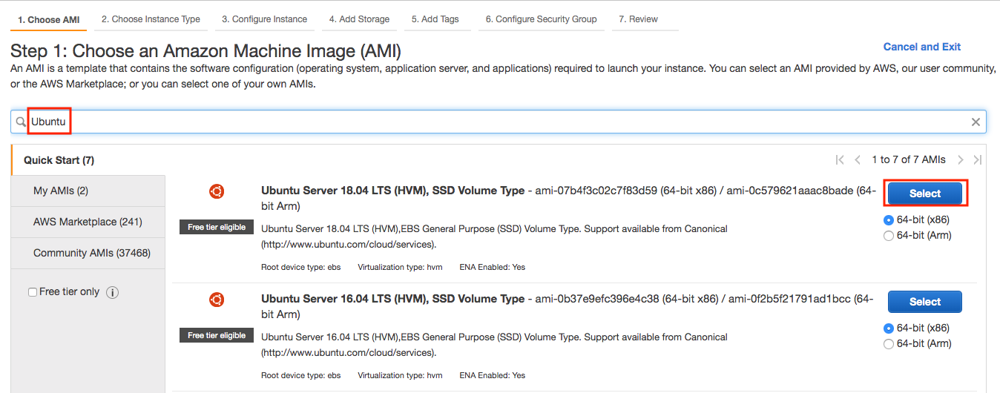

<!--
# Using AWS EC2 Instances
-->

# Sử dụng Máy ảo AWS EC2
:label:`sec_aws`


<!--
In this section, we will show you how to install all libraries on a raw Linux machine.
Remember that in :numref:`sec_sagemaker` we discussed how to use Amazon SageMaker, 
while building an instance by yourself costs less on AWS.
The walkthrough includes a number of steps:
-->

Trong phần này, chúng tôi sẽ hướng dẫn bạn cách cài đặt tất cả các thư viện trên một máy Linux sơ khai.
Ghi nhớ rằng trong :numref:`sec_sagemaker`, ta đã thảo luận về cách sử dụng Amazon SageMaker,
trong khi việc bạn tự xây dựng một máy ảo sẽ tốn ít chi phí hơn với AWS.
Hướng dẫn bao gồm một số bước:


<!--
1. Request for a GPU Linux instance from AWS EC2.
2. Optionally: install CUDA or use an AMI with CUDA preinstalled.
3. Set up the corresponding MXNet GPU version.
-->

1. Yêu cầu một máy ảo Linux GPU từ AWS EC2.
2. Tùy chọn: cài đặt CUDA hoặc sử dụng AMI có cài đặt sẵn CUDA.
3. Thiết lập phiên bản MXNet tương ứng cho GPU.


<!--
This process applies to other instances (and other clouds), too, albeit with some minor modifications.
Before going forward, you need to create an AWS account, see :numref:`sec_sagemaker` for more details.
-->

Quá trình này cũng áp dụng cho các máy ảo khác (và các dịch vụ đám mây khác ngoài AWS), với một số chỉnh sửa nhỏ.
Trước khi tiếp tục, bạn cần tạo một tài khoản AWS, tham khảo :numref:`sec_sagemaker` để biết thêm chi tiết.


<!--
## Creating and Running an EC2 Instance
-->

## Khởi tạo và Chạy Một Máy ảo EC2


<!--
After logging into your AWS account, click "EC2" (marked by the red box in :numref:`fig_aws`) to go to the EC2 panel.
-->

Sau khi đăng nhập vào tài khoản AWS của bạn, hãy nhấp vào "EC2" (được đánh dấu bằng khung màu đỏ trong :numref:`fig_aws`) để chuyển đến bảng điều khiển EC2.


<!--

-->


:width:`400px`
:label:`fig_aws`


<!--
:numref:`fig_ec2` shows the EC2 panel with sensitive account information greyed out.
-->

:numref:`fig_ec2` hiển thị bảng điều khiển EC2 với thông tin tài khoản nhạy cảm được che đi.


<!--

-->


:width:`700px`
:label:`fig_ec2`


<!--
### Presetting Location
-->

### Thiếp lập trước Vị trí Địa lý


<!--
Select a nearby data center to reduce latency, e.g., "Oregon" (marked by the red box in the top-right of :numref:`fig_ec2`).
If you are located in China, you can select a nearby Asia Pacific region, such as Seoul or Tokyo.
Please note that some data centers may not have GPU instances.
-->

Lựa chọn một trung tâm dữ liệu gần bạn để giảm độ trễ, ví dụ ở đây là "Oregon" (được đánh dấu bằng ô màu đỏ ở trên cùng bên phải trong :numref:`fig_ec2`).
Nếu bạn ở Việt Nam, bạn có thể chọn một khu vực Châu Á Thái Bình Dương gần đó, chẳng hạn như Singapore, Seoul hoặc Tokyo.
Xin lưu ý rằng một số trung tâm dữ liệu có thể không có máy ảo GPU.


<!--
### Increasing Limits
-->

### Tăng Giới hạn


<!--
Before choosing an instance, check if there are quantity restrictions by clicking the "Limits" label in the bar on the left as shown in :numref:`fig_ec2`.
:numref:`fig_limits` shows an example of such a limitation.
The account currently cannot open "p2.xlarge" instance per region.
If you need to open one or more instances, click on the "Request limit increase" link to apply for a higher instance quota.
Generally, it takes one business day to process an application.
-->

Trước khi chọn một máy ảo, hãy kiểm tra xem liệu AWS có hạn chế số lượng máy ảo đó không bằng cách nhấp vào nhãn "Limits" trong thanh bên trái như trong :numref:`fig_ec2`.
:numref:`fig_limits` minh họa ví dụ về giới hạn như vậy.
Tài khoản hiện thời không thể mở máy ảo "p2.xlarge" trong khu vực đó.
Nếu bạn cần mở một hoặc nhiều máy ảo, hãy nhấp vào "Request limit increase" để đăng ký số lượng máy ảo cao hơn.
Nói chung, sẽ mất một ngày làm việc để xử lý đơn đăng ký.


<!--

-->


:width:`700px`
:label:`fig_limits`


<!--
### Launching Instance
-->

### Khởi động Máy ảo


<!--
Next, click the "Launch Instance" button marked by the red box in :numref:`fig_ec2` to launch your instance.
-->

Tiếp theo, nhấp vào nút "Launch Instance" được đánh dấu bởi khung đỏ trong :numref:`fig_ec2` để khởi động máy ảo của bạn.


<!--
We begin by selecting a suitable AMI (AWS Machine Image).
Enter "Ubuntu" in the search box (marked by the red box in :numref:`fig_ubuntu`).
-->

Ta bắt đầu bằng việc chọn một AMI (*AWS Machine Image*) phù hợp.
Nhập "Ubuntu" vào ô tìm kiếm (đánh dấu bởi khung đỏ trong :numref:`fig_ubuntu`).


<!--

-->


:width:`700px`
:label:`fig_ubuntu`


<!--
EC2 provides many different instance configurations to choose from.
This can sometimes feel overwhelming to a beginner.
Here's a table of suitable machines:
-->

EC2 cung cấp rất nhiều cấu hình máy ảo khác nhau để bạn có thể lựa chọn.
Việc này đôi lúc khiến cho người mới bắt đầu cảm thấy chóang ngợp.
Ở đây là bảng liệt kê các máy phù hợp:


<!--
| Name | GPU         | Notes                         |
|------|-------------|-------------------------------|
| g2   | Grid K520   | ancient                       |
| p2   | Kepler K80  | old but often cheap as spot   |
| g3   | Maxwell M60 | good trade-off                |
| p3   | Volta V100  | high performance for FP16     |
| g4   | Turing T4   | inference optimized FP16/INT8 |
-->

| Tên  | GPU         | Ghi chú                              |
|------|-------------|--------------------------------------|
| g2   | Grid K520   | cũ kỹ                                |
| p2   | Kepler K80  | cũ nhưng thường rẻ như máy ảo spot   |
| g3   | Maxwell M60 | cân bằng tốt                         |
| p3   | Volta V100  | hiệu năng cao cho FP16               |
| g4   | Turing T4   | tối ưu suy luận cho FP16/INT8        |


<!--
All the above servers come in multiple flavors indicating the number of GPUs used.
For example, a p2.xlarge has 1 GPU and a p2.16xlarge has 16 GPUs and more memory.
For more details, see the [AWS EC2 documentation](https://aws.amazon.com/ec2/instance-types/) or a [summary page](https://www.ec2instances.info).
For the purpose of illustration, a p2.xlarge will suffice (marked in red box of :numref:`fig_p2x`).
-->

Tất cả các máy chủ trên đều đa dạng về số lượng GPU được sử dụng.
Ví dụ, một máy chủ p2.xlarge có 1 GPU và p2.16xlarge có 16 GPU và nhiều bộ nhớ hơn.
Để biết thêm chi tiết, tham khảo [tài liệu về AWS EC2](https://aws.amazon.com/ec2/instance-types/) hoặc [trang tổng hợp](https://www.ec2instances.info).
Nhằm mục đích minh họa, một máy chủ p2.xlarge là đủ (đánh dấu bởi khung đỏ trong :numref:`fig_p2x`).


<!--
**Note:** you must use a GPU enabled instance with suitable drivers and a version of MXNet that is GPU enabled.
Otherwise you will not see any benefit from using GPUs.
-->

**Lưu ý:** bạn phải sử dụng một máy chủ có kích hoạt GPU với trình điều khiển (*driver*) phù hợp cùng với phiên bản MXNet có kích hoạt GPU.
Nếu không, bạn sẽ không thấy được bất cứ khác biệt nào từ việc sử dụng GPU.


<!--

-->


:width:`700px`
:label:`fig_p2x`


<!--
So far, we have finished the first two of seven steps for launching an EC2 instance, as shown on the top of :numref:`fig_disk`.
In this example, we keep the default configurations for the steps "3. Configure Instance", "5.
Add Tags", and "6. Configure Security Group".
Tap on "4. Add Storage" and increase the default hard disk size to 64 GB (marked in red box of :numref:`fig_disk`).
Note that CUDA by itself already takes up 4 GB.
-->

Đến đây, chúng ta đã hoàn thành hai trong bảy bước để khởi động một máy ảo EC2, như minh họa trong :numref:`fig_disk`.
Trong ví dụ này, ta giữ nguyên cấu hình mặc định trong bước "3. Configure Instance", "5. Add Tags", và "6. Configure Security Group".


<!--

-->


:width:`700px`
:label:`fig_disk`


<!--
Finally, go to "7. Review" and click "Launch" to launch the configured instance.
The system will now prompt you to select the key pair used to access the instance.
If you do not have a key pair, select "Create a new key pair" in the first drop-down menu in :numref:`fig_keypair` to generate a key pair.
Subsequently, you can select "Choose an existing key pair" for this menu and then select the previously generated key pair.
Click "Launch Instances" to launch the created instance.
-->

Cuối cùng, đi tới bước "7. Review" và nhấp "Launch" để khởi động một máy ảo đã được cấu hình.
Lúc này hệ thống sẽ nhắc bạn lựa chọn một cặp khóa để truy cập vào máy ảo.
Nếu bạn không có cặp khóa nào, chọn "Create a new key pair" ở đầu bảng chọn trong :numref:`fig_keypair` để tạo một cặp khóa mới.
Tiếp theo, bạn có thể chọn "Choose an existing key pair" trong menu này và sau đó chọn cặp khóa vừa được tạo.
Nhấp "Launch Instances" để khởi động máy ảo vừa tạo.


<!--

-->


:width:`500px`
:label:`fig_keypair`


<!--
Make sure that you download the key pair and store it in a safe location if you generated a new one.
This is your only way to SSH into the server.
Click the instance ID shown in :numref:`fig_launching` to view the status of this instance.
-->

Đảm bảo rằng bạn sẽ tải cặp khóa về và lưu nó ở một thư mục an toàn nếu bạn tạo một cặp khóa mới.
Đây là cách duy nhất để SSH vào máy chủ.
Nhấp vào ID máy ảo như minh họa trong :numref:`fig_launching` để quan sát trạng thái của máy ảo này.


<!--

-->


:width:`700px`
:label:`fig_launching`


<!--
### Connecting to the Instance
-->

### Kết nối tới Máy ảo


<!--
As shown in :numref:`fig_connect`, after the instance state turns green, 
right-click the instance and select `Connect` to view the instance access method.
-->

Như minh họa trong :numref:`fig_connect`, sau khi trạng thái máy ảo chuyển sang màu xanh,
hãy nhấp chuột phải vào máy ảo và chọn `Connect` để quan sát phương thức truy cập máy ảo.


<!--

-->


:width:`700px`
:label:`fig_connect`


<!--
If this is a new key, it must not be publicly viewable for SSH to work. Go to the folder where you store `D2L_key.pem` 
(e.g., the Downloads folder) and make sure that the key is not publicly viewable.
-->

Nếu đây là một khóa mới, nó không thể xem được một cách công khai để SSH có thể hoạt động. Đi đến thư mục mà bạn lưu khóa `D2L_key.pem`
(ví dụ như thư mục Downloads) và đảm bảo rằng khóa này không thể xem được một cách công khai.


```bash
cd /Downloads  ## if D2L_key.pem is stored in Downloads folder
chmod 400 D2L_key.pem
```


<!--

-->


:width:`400px`
:label:`fig_chmod`


<!--
Now, copy the ssh command in the lower red box of :numref:`fig_chmod` and paste onto the command line:
-->

Giờ hãy sao chép lệnh ssh trong khung đỏ phía dưới trong :numref:`fig_chmod` và dán vào cửa sổ dòng lệnh:


```bash
ssh -i "D2L_key.pem" ubuntu@ec2-xx-xxx-xxx-xxx.y.compute.amazonaws.com
```


<!--
When the command line prompts "Are you sure you want to continue connecting (yes/no)", enter "yes" and press Enter to log into the instance.
-->

Khi cửa sổ dòng lệnh thông báo "Are you sure you want to continue connecting (yes/no)", nhập "yes" và nhấp Enter để đăng nhập vào máy ảo.


<!--
Your server is ready now.
-->

Lúc này máy chủ của bạn đã sẵn sàng.


<!--
## Installing CUDA
-->

## Cài đặt CUDA


<!--
Before installing CUDA, be sure to update the instance with the latest drivers.
-->

Trước khi cài đặt CUDA, đừng quên cập nhật máy ảo với các trình điều khiển (*driver*) mới nhất.


```bash
sudo apt-get update && sudo apt-get install -y build-essential git libgfortran3
```


<!--
Here we download CUDA 10.1. Visit NVIDIA's [official repository](https://developer.nvidia.com/cuda-downloads) 
to find the download link of CUDA 10.1 as shown in :numref:`fig_cuda`.
-->

Ở đây ta tải về CUDA 10.1. Truy cập [trang chứa chính thức](https://developer.nvidia.com/cuda-downloads) của NVIDIA
để tìm đường dẫn tải về của CUDA 10.1 như minh họa trong :numref:`fig_cuda`.


<!--

-->


:width:`500px`
:label:`fig_cuda`


<!--
Copy the instructions and paste them into the terminal to install CUDA 10.1.
-->

Sao chép các lệnh và dán vào cửa sổ dòng lệnh để cài đặt CUDA 10.1.


```bash
## Paste the copied link from CUDA website
wget https://developer.download.nvidia.com/compute/cuda/repos/ubuntu1804/x86_64/cuda-ubuntu1804.pin
sudo mv cuda-ubuntu1804.pin /etc/apt/preferences.d/cuda-repository-pin-600
wget http://developer.download.nvidia.com/compute/cuda/10.1/Prod/local_installers/cuda-repo-ubuntu1804-10-1-local-10.1.243-418.87.00_1.0-1_amd64.deb
sudo dpkg -i cuda-repo-ubuntu1804-10-1-local-10.1.243-418.87.00_1.0-1_amd64.deb
sudo apt-key add /var/cuda-repo-10-1-local-10.1.243-418.87.00/7fa2af80.pub
sudo apt-get update
sudo apt-get -y install cuda
```


<!--
After installing the program, run the following command to view the GPUs.
-->

Sau khi cài đặt chương trình xong, chạy lệnh sau để xem các GPU.


```bash
nvidia-smi
```


<!--
Finally, add CUDA to the library path to help other libraries find it.
-->

Cuối cùng, thêm CUDA vào đường dẫn thư viện để giúp các thư viện khác tìm được nó.


```bash
echo "export LD_LIBRARY_PATH=\${LD_LIBRARY_PATH}:/usr/local/cuda/lib64" >> ~/.bashrc
```


<!--
## Installing MXNet and Downloading the D2L Notebooks
-->

## Cài đặt MXNet và Tải Notebook của D2L


<!--
First, to simplify the installation, you need to install [Miniconda](https://conda.io/en/latest/miniconda.html) for Linux.
The download link and file name are subject to changes, so please go the Miniconda website and click "Copy Link Address" as shown in :numref:`fig_miniconda`.
-->

Đầu tiên, để đơn giản hóa quá trình cài đặt, bạn cần cài đặt [Miniconda](https://conda.io/en/latest/miniconda.html) cho Linux.
Đường dẫn tải về và tên tệp có thể thay đổi, vậy nên vui lòng truy cập trang web Miniconda và chọn "Copy Link Address" như minh họa trong :numref:`fig_miniconda`.


<!--

-->


:width:`700px`
:label:`fig_miniconda`


```bash
# The link and file name are subject to changes
wget https://repo.anaconda.com/miniconda/Miniconda3-latest-Linux-x86_64.sh
sh Miniconda3-latest-Linux-x86_64.sh -b
```


<!--
After the Miniconda installation, run the following command to activate CUDA and conda.
-->

Sau khi cài đặt Miniconda xong, chạy lệnh sau để kích hoạt CUDA và conda.


```bash
~/miniconda3/bin/conda init
source ~/.bashrc
```


<!--
Next, download the code for this book.
-->

Tiếp theo, hãy tải về mã nguồn của cuốn sách này.


```bash
sudo apt-get install unzip
mkdir d2l-en && cd d2l-en
curl https://d2l.ai/d2l-en.zip -o d2l-en.zip
unzip d2l-en.zip && rm d2l-en.zip
```


<!--
Then create the conda `d2l` environment and enter `y` to proceed with the installation.
-->

Sau đó tạo một môi trường conda `d2l` và nhập `y` để tiến hành cài đặt.


```bash
conda create --name d2l -y
```


<!--
After creating the `d2l` environment, activate it and install `pip`.
-->

Sau khi tạo môi trường `d2l`, kích hoạt nó và cài đặt `pip`.


```bash
conda activate d2l
conda install python=3.7 pip -y
```


<!--
Finally, install MXNet and the `d2l` package.
The postfix `cu101` means that this is the CUDA 10.1 variant.
For different versions, say only CUDA 10.0, you would want to choose `cu100` instead.
-->

Cuối cùng, cài đặt MXNet và gói thư viện `d2l`.
Hậu tố `cu101` nghĩa là đây là phiên bản sử dụng CUDA 10.1.
Với các phiên bản khác, giả sử như CUDA 10.0, bạn sẽ thay bằng `cu100`.


```bash
pip install mxnet-cu101==1.7.0
pip install git+https://github.com/d2l-ai/d2l-en

```


<!--
You can quickly test whether everything went well as follows:
-->

Bạn có thể nhanh chóng kiểm tra mọi thứ đã hoạt động bằng cách:


```
$ python
>>> from mxnet import np, npx
>>> np.zeros((1024, 1024), ctx=npx.gpu())
```


<!--
## Running Jupyter
-->

## Chạy Jupyter


<!--
To run Jupyter remotely you need to use SSH port forwarding.
After all, the server in the cloud does not have a monitor or keyboard.
For this, log into your server from your desktop (or laptop) as follows.
-->

Để chạy Jupyter từ xa bạn cần sử dụng phương thức chuyển tiếp cổng SSH.
Suy cho cùng thì máy chủ trên đám mây không có màn hình hay bàn phím.
Để thực hiện việc này, hãy truy cập vào máy chủ của bạn từ máy tính bàn (hay laptop) như sau.


```
# This command must be run in the local command line
ssh -i "/path/to/key.pem" ubuntu@ec2-xx-xxx-xxx-xxx.y.compute.amazonaws.com -L 8889:localhost:8888
conda activate d2l
jupyter notebook
```


<!--
:numref:`fig_jupyter` shows the possible output after you run Jupyter Notebook.
The last row is the URL for port 8888.
-->

:numref:`fig_jupyter` cho ta thấy kết quả khả dĩ sau khi bạn chạy Jupyter Notebook.
Dòng cuối cùng là URL của cổng 8888.


<!--

-->


:width:`700px`
:label:`fig_jupyter`


<!--
Since you used port forwarding to port 8889 you will need to replace the port number 
and use the secret as given by Jupyter when opening the URL in your local browser.
-->

Do sử dụng phương thức chuyển tiếp cổng cho cổng 8889, bạn cần phải đổi địa chỉ cổng 8888 thành 8889
và sử dụng token được sinh bởi Jupyter để mở URL trên trình duyệt web trong máy của bạn.


<!--
## Closing Unused Instances
-->

## Đóng Máy ảo Không Dùng đến


<!--
As cloud services are billed by the time of use, you should close instances that are not being used.
Note that there are alternatives: "stopping" an instance means that you will be able to start it again.
This is akin to switching off the power for your regular server.
However, stopped instances will still be billed a small amount for the hard disk space retained.
"Terminate" deletes all data associated with it.
This includes the disk, hence you cannot start it again.
Only do this if you know that you will not need it in the future.
-->

Do dịch vụ đám mây tính phí theo thời gian sử dụng, bạn nên đóng những máy ảo hiện không sử dụng đến.
Lưu ý rằng có các giải pháp thay thế khác: "Stop" một máy ảo nghĩa là bạn có thể khởi động nó lại được.
Việc này khá giống với việc tắt nguồn máy chủ thông thường của bạn.
Tuy nhiên, việc dừng một máy chủ vẫn sẽ tính một lượng nhỏ vào hóa đơn cho kích thước ổ cứng được giữ lại.
Lựa chọn "Terminate" một máy ảo sẽ xoá toàn bộ dữ liệu liên quan đến nó.
Dữ liệu này bao gồm cả ổ cứng, vậy nên bạn sẽ không thể khởi động nó lại được.
Chỉ thực hiện thao tác này nếu bạn chắc rằng bạn sẽ không cần đến nó trong tương lai.


<!--
If you want to use the instance as a template for many more instances,
right-click on the example in :numref:`fig_connect` and select "Image" $\rightarrow$ "Create" to create an image of the instance.
Once this is complete, select "Instance State" $\rightarrow$ "Terminate" to terminate the instance.
The next time you want to use this instance, you can follow the steps for creating and
running an EC2 instance described in this section to create an instance based on the saved image.
The only difference is that, in "1. Choose AMI" shown in :numref:`fig_ubuntu`, 
you must use the "My AMIs" option on the left to select your saved image.
The created instance will retain the information stored on the image hard disk.
For example, you will not have to reinstall CUDA and other runtime environments.
-->

Nếu bạn muốn sử dụng máy ảo làm khuôn mẫu (*template*) cho nhiều máy ảo khác,
hãy nhấp chuột phải vào ví dụ trong :numref:`fig_connect` và chọn "Image" $\rightarrow$ "Create" để tạo một ảnh (*image*) của máy ảo này.
Sau khi hoàn thành thao tác này, chọn "Instance State" $\rightarrow$ "Terminate" để xóa máy ảo này.
Lần tiếp theo bạn muốn sử dụng máy ảo này, bạn có thể thực hiện theo các bước khởi tạo và
chạy một máy ảo EC2 như minh họa trong phần này để tạo một máy ảo dựa trên ảnh đã lưu.
Điểm khác biệt duy nhất nằm ở bước "1. Choose AMI" như trong :numref:`fig_ubuntu`,
bạn phải chọn mục "My AMIs" phía bên trái để lựa chọn ảnh bạn đã lưu.
Máy ảo được tạo ra sẽ giữ lại thông tin được lưu trên ảnh đĩa cứng.
Ví dụ, bạn sẽ không cần phải cài đặt lại CUDA và các môi trường thời gian chạy khác.


## Tóm tắt

<!--
* You can launch and stop instances on demand without having to buy and build your own computer.
* You need to install suitable GPU drivers before you can use them.
-->

* Bạn có thể khởi động và dừng các máy ảo tuỳ theo nhu cầu mà không cần phải mua và xây dựng máy tính riêng.
* Bạn cần phải cài đặt trình điều khiển GPU phù hợp trước khi sử dụng chúng.


## Bài tập

<!--
1. The cloud offers convenience, but it does not come cheap.
Find out how to launch [spot instances](https://aws.amazon.com/ec2/spot/) to see how to reduce prices.
2. Experiment with different GPU servers. How fast are they?
3. Experiment with multi-GPU servers. How well can you scale things up?
-->

1. Dịch vụ đám mây cung cấp sự thuận tiện, nhưng nó không hề rẻ.
Tìm hiểu cách khởi động [máy ảo spot](https://aws.amazon.com/ec2/spot/) để tìm hiểu cách giảm chi phí.
2. Thử nghiệm với nhiều máy chủ GPU khác nhau. Chúng nhanh đến mức nào?
3. Thử nghiệm với máy chủ đa GPU. Việc mở rộng giúp hoàn thành công việc tốt đến thế nào?


## Thảo luận
* Tiếng Anh: [Main Forum](https://discuss.d2l.ai/t/423)
* Tiếng Việt: [Diễn đàn Machine Learning Cơ Bản](https://forum.machinelearningcoban.com/c/d2l)


## Những người thực hiện
Bản dịch trong trang này được thực hiện bởi:

* Đoàn Võ Duy Thanh
* Nguyễn Văn Quang
* Phạm Hồng Vinh
* Nguyễn Mai Hoàng Long
* Đỗ Trường Giang
* Nguyễn Văn Cường
