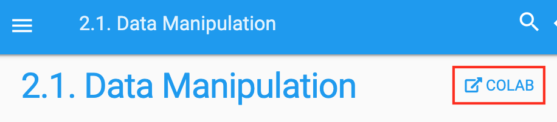
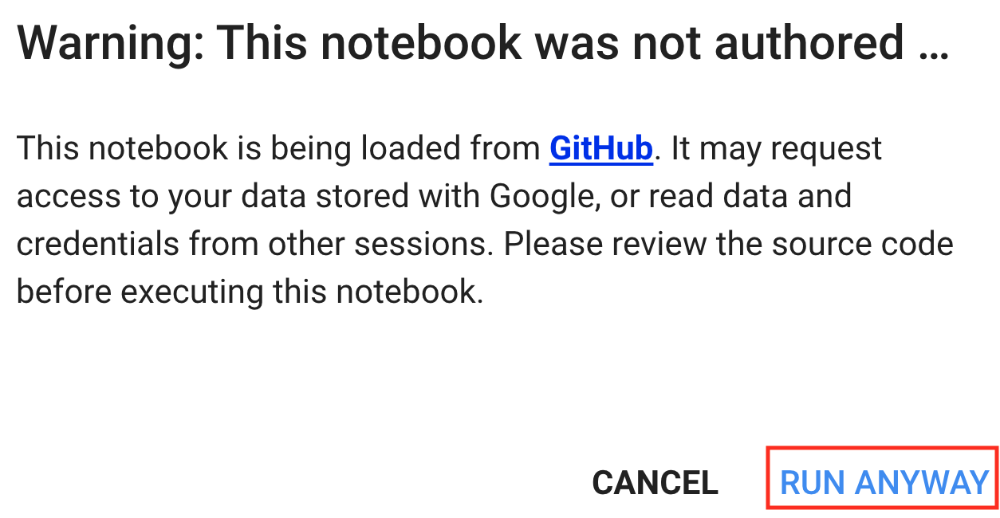

<!--
# Using Google Colab
-->

# Sử dụng Google Colab
:label:`sec_colab`

<!--
We introduced how to run this book on AWS in :numref:`sec_sagemaker` and :numref:`sec_aws`.
Another option is running this book on [Google Colab](https://colab.research.google.com/), which provides free GPU if you have a Google account.
-->

Chúng tôi đã giới thiệu cách chạy cuốn sách này trên AWS trong :numref:`sec_sagemaker` và :numref:`sec_aws`.
Có một lựa chọn khác là chạy cuốn sách này (bản tiếng Anh) trên [Google Colab](https://colab.research.google.com/), nền tảng cung cấp GPU miễn phí khi bạn có một tài khoản Google.

<!--
To run a section on Colab, you can simply click the `Colab` button to the right of the title of that section, such as in :numref:`fig_colab`. 
-->

Để chạy một phần nào đó trên Colab, bạn có thể đơn giản nhấp vào nút `Colab` phía bên phải tiêu đề của phần đó, ví dụ như trong :numref:`fig_colab`.

<!--

-->

:width:`300px`
:label:`fig_colab`

<!--
When it is the first time you execute a code cell, you will receive a warning message as shown in :numref:`fig_colab2`.
You may click "RUN ANYWAY" to ignore it.
-->

Khi bạn lần đầu thực thi một ô mã nguồn, bạn sẽ nhận được một cảnh báo như trong :numref:`fig_colab2`.
Bạn có thể nhấn "RUN ANYWAY" để bỏ qua nó.

<!--

-->

:width:`300px`
:label:`fig_colab2`

<!--
Next, Colab will connect you to an instance to run this notebook. Specifically, if GPU is needed, 
such as when invoking the `d2l.try_gpu()` function, we will request Colab to connect to a GPU instance automatically.
-->

Tiếp theo, Colab sẽ kết nối bạn tới một máy ảo để chạy notebook này. Cụ thể, nếu cần GPU,
ví dụ như khi gọi đến hàm `d2l.try_gpu()`, ta sẽ yêu cầu Colab tự động kết nối tới một máy ảo GPU.

## Tóm tắt

<!--
You can use Google Colab to run each section of this book with GPUs.
-->

Bạn có thể sử dụng Google Colab để chạy từng phần của cuốn sách này với GPU.

## Bài tập

<!--
Try to edit and run the code in this book using Google Colab.
-->

Thử chỉnh sửa và chạy mã nguồn của cuốn sách này sử dụng Google Colab.

## Thảo luận
* Tiếng Anh: [MXNet](https://discuss.d2l.ai/t/424)
* Tiếng Việt: [Diễn đàn Machine Learning Cơ Bản](https://forum.machinelearningcoban.com/c/d2l)

## Những người thực hiện
Bản dịch trong trang này được thực hiện bởi:

* Đoàn Võ Duy Thanh
* Đỗ Trường Giang
* Nguyễn Văn Quang
* Nguyễn Văn Cường

*Lần cập nhật gần nhất: 03/11/2020. (Cập nhật lần cuối từ nội dung gốc: 30/06/2020)*
