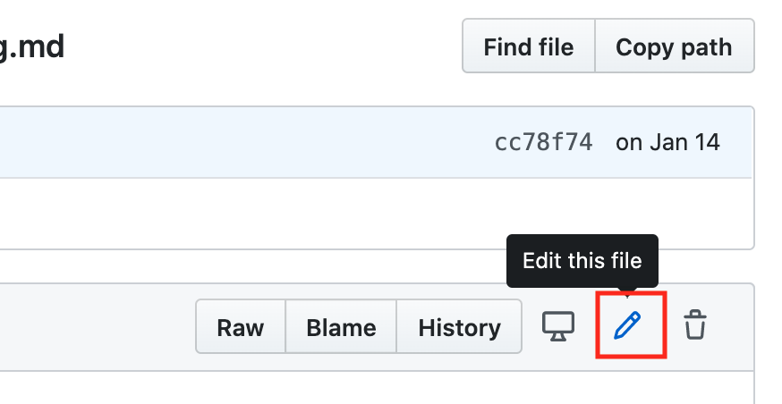

# Đóng góp cho cuốn sách này
:label:`sec_how_to_contribute`

Đóng góp của [readers](https://github.com/d2l-ai/d2l-en/graphs/contributors) giúp chúng tôi cải thiện cuốn sách này. Nếu bạn tìm thấy một lỗi đánh máy, một liên kết lỗi thời, một cái gì đó mà bạn nghĩ rằng chúng tôi đã bỏ lỡ một trích dẫn, trong đó mã trông không thanh lịch hoặc nơi một lời giải thích là không rõ ràng, vui lòng đóng góp lại và giúp chúng tôi giúp đỡ độc giả của chúng tôi. Mặc dù trong các cuốn sách thông thường, sự chậm trễ giữa các lần chạy in (và do đó giữa các sửa lỗi đánh máy) có thể được đo bằng nhiều năm, thường mất hàng giờ đến nhiều ngày để kết hợp cải tiến trong cuốn sách này. Điều này là tất cả có thể do kiểm soát phiên bản và kiểm tra tích hợp liên tục. Để làm như vậy, bạn cần phải gửi một [pull request](https://github.com/d2l-ai/d2l-en/pulls) vào kho lưu trữ GitHub. Khi yêu cầu kéo của bạn được hợp nhất vào kho lưu trữ mã của tác giả, bạn sẽ trở thành người đóng góp. 

## Thay đổi văn bản nhỏ

Các đóng góp phổ biến nhất là chỉnh sửa một câu hoặc sửa lỗi chính tả. Chúng tôi khuyên bạn nên tìm tệp nguồn trong [github repo](https732293614) để xác định vị trí tệp nguồn, đây là tệp markdown. Sau đó, bạn nhấp vào nút “Chỉnh sửa tệp này” ở góc trên bên phải để thực hiện các thay đổi của bạn trong tệp markdown. 


:width:`300px`
:label:`fig_edit_file`

Sau khi bạn hoàn tất, hãy điền vào mô tả thay đổi của bạn trong bảng “Đề xuất thay đổi tệp” ở phía dưới trang và sau đó nhấp vào nút “Đề xuất thay đổi tệp”. Nó sẽ chuyển hướng bạn đến một trang mới để xem xét các thay đổi của bạn (:numref:`fig_git_createpr`). Nếu mọi thứ đều tốt, bạn có thể gửi yêu cầu kéo bằng cách nhấp vào nút “Tạo yêu cầu kéo”. 

## Đề xuất một sự thay đổi lớn

Nếu bạn có kế hoạch cập nhật một phần lớn văn bản hoặc mã, thì bạn cần biết thêm một chút về định dạng cuốn sách này đang sử dụng. Tệp nguồn dựa trên [markdown format](https://daringfireball.net/projects/markdown/syntax) với một tập hợp các phần mở rộng thông qua gói [d2lbook](http://book.d2l.ai/user/markdown.html) như đề cập đến phương trình, hình ảnh, chương và trích dẫn. Bạn có thể sử dụng bất kỳ trình chỉnh sửa Markdown nào để mở các tệp này và thực hiện các thay đổi của mình. 

Nếu bạn muốn thay đổi mã, chúng tôi khuyên bạn nên sử dụng Jupyter để mở các tệp Markdown này như được mô tả trong :numref:`sec_jupyter`. Để bạn có thể chạy và kiểm tra các thay đổi của bạn. Vui lòng nhớ xóa tất cả các đầu ra trước khi gửi các thay đổi của bạn, hệ thống CI của chúng tôi sẽ thực hiện các phần bạn cập nhật để tạo ra kết quả đầu ra. 

Một số phần có thể hỗ trợ nhiều triển khai framework, bạn có thể sử dụng `d2lbook` để kích hoạt một framework cụ thể, do đó các triển khai framework khác trở thành các khối mã Markdown và sẽ không được thực thi khi bạn “Run All” trong Jupyter. Nói cách khác, lần đầu tiên cài đặt `d2lbook` bằng cách chạy

```bash
pip install git+https://github.com/d2l-ai/d2l-book
```

Sau đó, trong thư mục gốc của `d2l-en`, bạn có thể kích hoạt một triển khai cụ thể bằng cách chạy một trong các lệnh sau:

```bash
d2lbook activate mxnet chapter_multilayer-perceptrons/mlp-scratch.md
d2lbook activate pytorch chapter_multilayer-perceptrons/mlp-scratch.md
d2lbook activate tensorflow chapter_multilayer-perceptrons/mlp-scratch.md
```

Trước khi gửi các thay đổi của bạn, vui lòng xóa tất cả các đầu ra khối mã và kích hoạt tất cả bởi

```bash
d2lbook activate all chapter_multilayer-perceptrons/mlp-scratch.md
```

Nếu bạn thêm một khối mã mới không cho triển khai mặc định, đó là MXNet, vui lòng sử dụng `# @tab` to mark this block on the beginning line. For example, ` # @tab pytorch` for a PyTorch code block, `# @tab tensorflow` for a TensorFlow code block, or `# @tab all` một khối mã được chia sẻ cho tất cả các triển khai. Bạn có thể tham khảo [d2lbook](http://book.d2l.ai/user/code_tabs.html) để biết thêm thông tin. 

## Thêm một phần mới hoặc một triển khai khung mới

Nếu bạn muốn tạo một chương mới, ví dụ: học tập củng cố hoặc thêm triển khai các framework mới, chẳng hạn như TensorFlow, vui lòng liên hệ với các tác giả trước, bằng cách gửi email hoặc sử dụng [github issues](https://github.com/d2l-ai/d2l-en/issues). 

## Gửi một thay đổi lớn

Chúng tôi khuyên bạn nên sử dụng quy trình `git` tiêu chuẩn để gửi một thay đổi lớn. Tóm lại, quá trình hoạt động như được mô tả trong :numref:`fig_contribute`. 


:label:`fig_contribute`

Chúng tôi sẽ hướng dẫn bạn qua các bước chi tiết. Nếu bạn đã quen thuộc với Git, bạn có thể bỏ qua phần này. Đối với cụ thể, chúng tôi giả định rằng tên người dùng của người đóng góp là “astonzhang”. 

### Cài đặt Git

Sách mã nguồn mở Git mô tả [how to install Git](https://git-scm.com/book/en/v2). Điều này thường hoạt động thông qua `apt install git` trên Ubuntu Linux, bằng cách cài đặt các công cụ phát triển Xcode trên macOS hoặc bằng cách sử dụng [desktop client](https://desktop.github.com) của GitHub. Nếu bạn không có tài khoản GitHub, bạn cần đăng ký một tài khoản. 

### Đăng nhập vào GitHub

Nhập [address](https://github.com/d2l-ai/d2l-en/) kho lưu trữ mã của cuốn sách trong trình duyệt của bạn. Nhấp vào nút `Fork` trong hộp màu đỏ ở phía trên bên phải của :numref:`fig_git_fork`, để tạo một bản sao của kho lưu trữ của cuốn sách này. Đây là bây giờ * bản sao của bạn* và bạn có thể thay đổi nó bất kỳ cách nào bạn muốn. 


:width:`700px`
:label:`fig_git_fork`

Bây giờ, kho lưu trữ mã của cuốn sách này sẽ được chia nhỏ (tức là sao chép) vào tên người dùng của bạn, chẳng hạn như `astonzhang/d2l-en` được hiển thị ở phía trên bên trái của ảnh chụp màn hình :numref:`fig_git_forked`. 


:width:`700px`
:label:`fig_git_forked`

### Nhân bản kho lưu trữ

Để sao chép kho lưu trữ (tức là, để tạo một bản sao địa phương) chúng ta cần phải có được địa chỉ kho lưu trữ của nó. Nút màu xanh lá cây trong :numref:`fig_git_clone` hiển thị điều này. Đảm bảo rằng bản sao cục bộ của bạn được cập nhật với kho lưu trữ chính nếu bạn quyết định giữ fork này lâu hơn. Bây giờ chỉ cần làm theo các hướng dẫn trong :ref:`chap_installation` để bắt đầu. Sự khác biệt chính là bây giờ bạn đang tải xuống * fork riêng của bạn* của kho lưu trữ. 


:width:`700px`
:label:`fig_git_clone`

```
# Replace your_github_username with your GitHub username
git clone https://github.com/your_github_username/d2l-en.git
```

### Chỉnh sửa sách và đẩy

Bây giờ là lúc để chỉnh sửa cuốn sách. Tốt nhất là chỉnh sửa sổ ghi chép trong Jupyter theo hướng dẫn trong :numref:`sec_jupyter`. Thực hiện các thay đổi và kiểm tra xem chúng có ổn không. Giả sử chúng ta đã sửa đổi một lỗi đánh máy trong tập tin `~/d2l-en/chapter_appendix_tools/how-to-contribute.md`. Sau đó, bạn có thể kiểm tra những tập tin bạn đã thay đổi: 

Tại thời điểm này Git sẽ nhắc rằng tập tin `chapter_appendix_tools/how-to-contribute.md` đã được sửa đổi.

```
mylaptop:d2l-en me$ git status
On branch master
Your branch is up-to-date with 'origin/master'.

Changes not staged for commit:
  (use "git add <file>..." to update what will be committed)
  (use "git checkout -- <file>..." to discard changes in working directory)

	modified:   chapter_appendix_tools/how-to-contribute.md
```

Sau khi xác nhận rằng đây là những gì bạn muốn, hãy thực hiện lệnh sau:

```
git add chapter_appendix_tools/how-to-contribute.md
git commit -m 'fix typo in git documentation'
git push
```

Mã đã thay đổi sau đó sẽ nằm trong ngã ba cá nhân của kho lưu trữ. Để yêu cầu bổ sung thay đổi của bạn, bạn phải tạo một yêu cầu kéo cho kho lưu trữ chính thức của cuốn sách. 

### Yêu cầu kéo

Như thể hiện trong :numref:`fig_git_newpr`, đi đến ngã ba của kho lưu trữ trên GitHub và chọn “New pull request”. Thao tác này sẽ mở ra một màn hình hiển thị cho bạn những thay đổi giữa các chỉnh sửa của bạn và những gì hiện tại trong kho lưu trữ chính của cuốn sách. 


:width:`700px`
:label:`fig_git_newpr`

### Gửi yêu cầu kéo

Cuối cùng, gửi yêu cầu kéo bằng cách nhấp vào nút như thể hiện trong :numref:`fig_git_createpr`. Đảm bảo mô tả những thay đổi bạn đã thực hiện trong yêu cầu kéo. Điều này sẽ giúp các tác giả xem xét nó dễ dàng hơn và hợp nhất nó với cuốn sách. Tùy thuộc vào những thay đổi, điều này có thể được chấp nhận ngay lập tức, bị từ chối hoặc nhiều khả năng hơn, bạn sẽ nhận được một số phản hồi về những thay đổi. Một khi bạn đã kết hợp chúng, bạn rất tốt để đi. 


:width:`700px`
:label:`fig_git_createpr`

Yêu cầu kéo của bạn sẽ xuất hiện trong danh sách các yêu cầu trong kho lưu trữ chính. Chúng tôi sẽ cố gắng hết sức để xử lý nó một cách nhanh chóng. 

## Tóm tắt

* Bạn có thể sử dụng GitHub để đóng góp cho cuốn sách này.
* Bạn có thể chỉnh sửa tệp trên GitHub trực tiếp cho các thay đổi nhỏ.
* Đối với một thay đổi lớn, vui lòng ngã ba kho lưu trữ, chỉnh sửa mọi thứ cục bộ và chỉ đóng góp trở lại một khi bạn đã sẵn sàng.
* Yêu cầu kéo là cách đóng góp đang được gói lại. Cố gắng không gửi yêu cầu kéo khổng lồ vì điều này khiến họ khó hiểu và kết hợp. Tốt hơn gửi một số cái nhỏ hơn.

## Bài tập

1. Sao và ngã ba kho lưu trữ `d2l-en`.
1. Tìm một số mã cần cải tiến và gửi yêu cầu kéo.
1. Tìm một tài liệu tham khảo mà chúng tôi đã bỏ lỡ và gửi yêu cầu kéo.
1. Nó thường là một thực hành tốt hơn để tạo một yêu cầu kéo bằng cách sử dụng một nhánh mới. Tìm hiểu làm thế nào để làm điều đó với [Git branching](https://git-scm.com/book/en/v2/Git-Branching-Branches-in-a-Nutshell).

[Discussions](https://discuss.d2l.ai/t/426)
