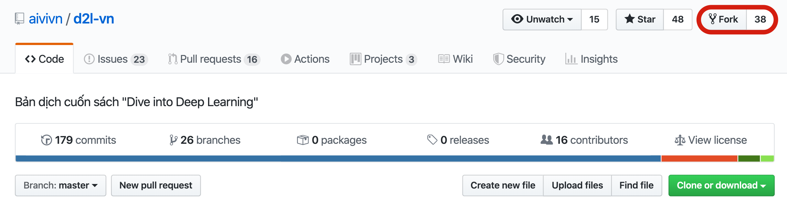

<!--
# Contributing to This Book
-->

# Đóng góp cho Quyển sách
:label:`sec_how_to_contribute`


<!--
Contributions by [readers](https://github.com/d2l-ai/d2l-en/graphs/contributors) help us improve this book.
If you find a typo, an outdated link, something where you think we missed a citation, 
where the code does not look elegant or where an explanation is unclear, please contribute back and help us help our readers.
While in regular books the delay between print runs (and thus between typo corrections) can be measured in years, 
it typically takes hours to days to incorporate an improvement in this book.
This is all possible due to version control and continuous integration testing.
To do so you need to submit a [pull request](https://github.com/d2l-ai/d2l-en/pulls) to the GitHub repository.
When your pull request is merged into the code repository by the author, you will become a contributor.
-->

Những đóng góp từ [cộng đồng](https://github.com/aivivn/d2l-vn/graphs/contributors) giúp chúng tôi cải thiện cuốn sách này.
Nếu bạn tìm thấy có lỗi đánh máy, đường dẫn hết hạn, hay phần nào đó mà bạn nghĩ chúng tôi thiếu trích dẫn,
phần mã nguồn không được thanh thoát hay có chỗ giải thích không rõ ràng, xin vui lòng đóng góp và giúp chúng tôi hỗ trợ những độc giả khác.
Trong khi với các quyển sách bình thường, khoảng cách giữa những lần xuất bản (đó là giữa các lần sửa lỗi đánh máy) có thể tính bằng năm,
thì giờ đây chúng tôi chỉ cần vài giờ đến vài ngày để đưa một cải thiện vào bản dịch này.
Để có thể đóng góp trực tiếp, bạn cần đăng một [pull request](https://github.com/aivivn/d2l-vn/pulls) lên GitHub của bản dịch này.
Khi pull request của bạn được nhóm dịch gộp (*merge*) vào repo, bạn sẽ trở thành một người đóng góp (*contributor*).
Một cách khác để bạn có thể đóng góp đơn giản hơn là tạo một [issues](https://github.com/aivivn/d2l-vn/issues) mới và báo cáo vấn đề bạn tìm thấy, 
tạo một [thảo luận](https://github.com/aivivn/d2l-vn/discussions) mới để cùng trao đổi nhiều vấn đề hơn với nhóm dịch thuật.


<!--
## Minor Text Changes
-->

## Thay đổi nhỏ trong Văn bản


<!--
The most common contributions are editing one sentence or fixing typos.
We recommend you to find the source file in the [github repo](https://github.com/d2l-ai/d2l-en) and edit the file directly.
For example, you can search the file through the [Find file](https://github.com/d2l-ai/d2l-en/find/master) 
button (:numref:`fig_edit_file`) to locate the source file, which is a markdown file.
Then you click the "Edit this file" button on the top-right corner to make your changes in the markdown file.
-->

Đóng góp phổ biến nhất là chỉnh sửa một câu hoặc chữa lỗi đánh máy.
Chúng tôi khuyến nghị bạn nên tìm tệp gốc trên [github](https://github.com/aivivn/d2l-vn) và trực tiếp chỉnh sửa tệp.
Ví dụ, bạn có thể tìm tệp thông qua nút [Find file](https://github.com/aivivn/d2l-vn/find/master)
(:numref:`fig_edit_file`) để định vị tệp gốc, tệp ở đây là một tệp markdown.
Sau đó bạn nhấn nút "Edit this file" ở góc trên bên phải để thay đổi tệp markdown này.


<!--

-->


:width:`300px`
:label:`fig_edit_file`


<!--
After you are done, fill in your change descriptions in the "Propose file change" panel on the page bottom and then click the "Propose file change" button.
It will redirect you to a new page to review your changes (:numref:`fig_git_createpr`).
If everything is good, you can submit a pull request by clicking the "Create pull request" button.
-->

Sau khi hoàn thành, điền mô tả thay đổi của bạn vào ô "Propose file change" ở cuối trang và sau đó nhấn nút "Propose file change".
Trang sẽ được chuyển hướng đến một trang mới để bạn có thể kiểm tra lại thay đổi của bạn (:numref:`fig_git_createpr`).
Nếu mọi thứ đều ổn, bạn có thể đăng một pull request bằng cách nhấn vào nút "Create pull request".


<!--
## Propose a Major Change
-->

## Đề xuất một Thay đổi Lớn


<!--
If you plan to update a large portion of text or code, then you need to know a little bit more about the format this book is using.
The source file is based on the [markdown format](https://daringfireball.net/projects/markdown/syntax) with a set 
of extensions through the [d2lbook](http://book.d2l.ai/user/markdown.html) package such as referring to equations, images, chapters, and citations.
You can use any Markdown editors to open these files and make your changes.
-->

Nếu bạn có dự định cập nhật một phần lớn văn bản hay mã nguồn thì bạn cần phải biết thêm một chút về định dạng mà cuốn sách này sử dụng.
Tệp nguồn được dựa trên [định dạng markdown](https://daringfireball.net/projects/markdown/syntax) với một tập
các phần mở rộng thông qua gói [d2lbook](http://book.d2l.ai/user/markdown.html) ví dụ như tham chiếu đến phương trình, hình ảnh, chương mục và trích dẫn.
Bạn có thể sử dụng bất kỳ trình biên tập Markdown nào để mở các tệp này và thực hiện chỉnh sửa.


<!--
If you would like to change the code, we recommend you to use Jupyter to open these Markdown files as described in :numref:`sec_jupyter`.
So that you can run and test your changes. Please remember to clear all outputs before submitting your changes, 
our CI system will execute the sections you updated to generate outputs.
-->

Nếu bạn muốn thay đổi mã nguồn, chúng tôi khuyến nghị các bạn sử dụng Jupyter để mở các tệp Markdown này như mô tả trong :numref:`sec_jupyter`.
Nhờ đó bạn có thể chạy và kiểm tra thay đổi của bạn. Xin vui lòng xóa toàn bộ các ô kết quả trước khi đăng thay đổi của bạn,
hệ thống CI của chúng tôi sẽ thực thi phần bạn cập nhật để sinh kết quả.


<!--
Some sections may support multiple framework implementations, you can use `d2lbook` to activate a particular framework, 
so other framework implementations become Markdown code blocks and will not be executed when you "Run All" in Jupyter. In other words, first install `d2lbook` by running
-->

Một số phần có thể hỗ trợ lập trình đa framework, bạn có thể sử dụng `d2lbook` để kích hoạt một framework cụ thể,
khi đó phần lập trình các framework khác trở thành khối mã Markdown và sẽ không được thực thi khi bạn chạy"Run All" trong Jupyter. 
Nói cách khác, đầu tiên cài đặt `d2lbook` bằng cách chạy


```bash
pip install git+https://github.com/d2l-ai/d2l-book
```


<!--
Then in the root directory of `d2l-en`, you can activate a particular implementation by running one of the following commands:
-->

Sau đó trong thư mục gốc `d2l-en`, bạn có thể kích hoạt một đoạn mã cụ thể bằng cách chạy một trong các lệnh sau:


```bash
d2lbook activate mxnet chapter_multilayer-perceptrons/mlp-scratch.md
d2lbook activate pytorch chapter_multilayer-perceptrons/mlp-scratch.md
d2lbook activate tensorflow chapter_multilayer-perceptrons/mlp-scratch.md
```


<!--
Before submitting your changes, please clear all code block outputs and activate all by
-->

Trước khi đăng thay đổi của bạn lên, xin vui lòng xóa toàn bộ các ô kết quả và kích hoạt tất cả bằng


```bash
d2lbook activate all chapter_multilayer-perceptrons/mlp-scratch.md
```


<!--
If you add a new code block not for the default implementation, which is MXNet, please use `#@tab` to mark this block on the beginning line.
For example, `#@tab pytorch` for a PyTorch code block, `#@tab tensorflow` for a TensorFlow code block, or `#@tab all` a shared code block for all implementations.
You may refer to [d2lbook](http://book.d2l.ai/user/code_tabs.html) for more information.
-->
Nếu bạn thêm một khối mã nguồn mới không có trong cách lập trình mặc định, tức MXNet, xin vui lòng sử dụng `#@tab` để đánh dấu khối này tại dòng đầu tiên.
Ví dụ, `#@tab pytorch` cho khối mã PyTorch, `#@tab tensorflow` cho khối mã TensorFlow, hoặc `#@tab all` cho khối mã được dùng chung cho tất cả các cách lập trình.
Bạn có thể tham khảo [d2lbook](http://book.d2l.ai/user/code_tabs.html) để biết thêm thông tin.


<!--
## Adding a New Section or a New Framework Implementation
-->

## Thêm một Phần Mới hoặc một Cách lập trình cho Framework Mới


<!--
If you want to create a new chapter, e.g. reinforcement learning, or add implementations of new frameworks, 
such as TensorFlow, please contact the authors first, either by emailing or using [github issues](https://github.com/d2l-ai/d2l-en/issues).
-->

Nếu bạn muốn tạo một chương mới, ví dụ như học tăng cường, hoặc thêm một cách lập trình cho một framework mới,
ví dụ như TensorFlow, trước tiên xin vui lòng liên hệ với nhóm dịch, có thể bằng email hoặc sử dụng [github issues](https://github.com/aivivn/d2l-vn/issues).


<!--
## Submitting a Major Change
-->

## Đăng một Thay đổi Lớn


<!--
We suggest you to use the standard `git` process to submit a major change.
In a nutshell the process works as described in :numref:`fig_contribute`.
-->

Chúng tôi đề nghị bạn phải sử dụng quy trình `git` chuẩn để đăng một thay đổi lớn.
Tóm lại, quy trình này hoạt động như mô tả trong :numref:`fig_contribute`.


<!--

-->


:label:`fig_contribute`


<!--
We will walk you through the steps in detail. If you are already familiar with Git you can skip this section.
For concreteness we assume that the contributor's user name is "astonzhang".
-->

Chúng tôi sẽ hướng dẫn chi tiết từng bước. Nếu bạn quen thuộc với Git bạn có thể bỏ qua phần này.
Để ngắn gọn chúng tôi giả sử người đóng góp có username là "astonzhang".


<!--
### Installing Git
-->

### Cài đặt Git


<!--
The Git open source book describes [how to install Git](https://git-scm.com/book/en/v2).
This typically works via `apt install git` on Ubuntu Linux, by installing the Xcode developer tools on macOS, 
or by using GitHub's [desktop client](https://desktop.github.com).
If you do not have a GitHub account, you need to sign up for one.
-->

Cuốn sách mã nguồn mở của Git mô tả chi tiết [cách cài đặt Git](https://git-scm.com/book/en/v2).
Việc này có thể được thực hiện thông qua `apt install git` trên Ubuntu Linux, bằng cách cài đặt công cụ phát triển Xcode trên macOS,
hoặc bằng cách sử dụng [desktop client](https://desktop.github.com) của GitHub.
Nếu bạn không có tài khoản GitHub, bạn cần phải đăng ký một tài khoản.


<!--
### Logging in to GitHub
-->

### Đăng nhập vào GitHub


<!--
Enter the [address](https://github.com/d2l-ai/d2l-en/) of the book's code repository in your browser.
Click on the `Fork` button in the red box at the top-right of :numref:`fig_git_fork`, to make a copy of the repository of this book.
This is now *your copy* and you can change it any way you want.
-->

Điền [địa chỉ](https://github.com/aivivn/d2l-vn/) của repo chứa mã nguồn bản dịch cuốn sách này vào trình duyệt web của bạn.
Chọn nút `Fork` trong khung đỏ ở phía trên bên phải của :numref:`fig_git_fork`, để tạo một bản sao cho repo của cuốn sách này.
Nó giờ đây là *bản sao của bạn* và bạn có thể tuỳ ý thay đổi nó.


<!--

-->


:width:`700px`
:label:`fig_git_fork`


<!--
Now, the code repository of this book will be forked (i.e., copied) to your username, 
such as `astonzhang/d2l-en` shown at the top-left of the screenshot :numref:`fig_git_forked`.
-->

Giờ thì repo chứa mã nguồn của cuốn sách đã được fork (tức sao chép) tới tên người dùng của bạn,
ví dụ như `astonzhang/d2l-en` được chỉ ra phía trên bên trái của ảnh chụp màn hình :numref:`fig_git_forked`.


<!--

-->


:width:`700px`
:label:`fig_git_forked`


<!--
### Cloning the Repository
-->

### Clone Repo


<!--
To clone the repository (i.e., to make a local copy) we need to get its repository address.
The green button in :numref:`fig_git_clone` displays this.
Make sure that your local copy is up to date with the main repository if you decide to keep this fork around for longer.
For now simply follow the instructions in :ref:`chap_installation` to get started.
The main difference is that you are now downloading *your own fork* of the repository.
-->

Để clone một repo (tức là tạo bản sao cục bộ) ta cần phải có địa chỉ của repo đó.
Nút màu xanh trong :numref:`fig_git_clone` hiển thị địa chỉ này.
Hãy đảm bảo rằng bản sao cục bộ của bạn cập nhật gần nhất với repo chính nếu bạn quyết định giữ bản fork này lâu dài.
Còn bây giờ chỉ cần đơn giản làm theo các hướng dẫn trong :ref:`chap_installation` để bắt đầu.
Điểm khác biệt chính ở đây là bạn đang tải về *bản fork của riêng bạn* cho repo này.


<!--

-->


:width:`700px`
:label:`fig_git_clone`


```
# Replace your_github_username with your GitHub username
git clone https://github.com/your_github_username/d2l-vn.git
```


<!--
### Editing the Book and Push
-->

### Chỉnh sửa Bản dịch và Đẩy lên


<!--
Now it is time to edit the book. It is best to edit the notebooks in Jupyter following instructions in :numref:`sec_jupyter`.
Make the changes and check that they are OK.
Assume we have modified a typo in the file `~/d2l-en/chapter_appendix_tools/how-to-contribute.md`.
You can then check which files you have changed:
-->

Giờ là lúc để chỉnh sửa bản dịch. Tốt nhất là chỉnh sửa các notebook trên Jupyter theo hướng dẫn trong :numref:`sec_jupyter`.
Tạo thay đổi và kiểm tra xem chúng ổn chưa.
Giả sử bạn đã điều chỉnh một lỗi đánh máy trong tệp `~/d2l-vn/chapter_appendix_tools/how-to-contribute.md`.
Sau đó bạn có thể kiểm tra xem bạn đã sửa đổi những tệp nào.


<!--
At this point Git will prompt that the `chapter_appendix_tools/how-to-contribute.md` file has been modified.
-->

Ở thời điểm này Git sẽ thông báo là tệp `chapter_appendix_tools/how-to-contribute.md` đã được sửa đổi.


```
mylaptop:d2l-vn me$ git status
On branch master
Your branch is up-to-date with 'origin/master'.

Changes not staged for commit:
  (use "git add <file>..." to update what will be committed)
  (use "git checkout -- <file>..." to discard changes in working directory)

	modified:   chapter_appendix_tools/how-to-contribute.md
```


<!--
After confirming that this is what you want, execute the following command:
-->

Sau khi xác nhận đây là những sửa đổi bạn muốn, thực thi lệnh sau:


```
git add chapter_appendix_tools/how-to-contribute.md
git commit -m 'fix typo in git documentation'
git push
```


<!--
The changed code will then be in your personal fork of the repository.
To request the addition of your change, you have to create a pull request for the official repository of the book.
-->

Đoạn mã được chỉnh sửa lúc này sẽ nằm trong bản fork cá nhân của bạn cho repo này.
Để yêu cầu thay đổi thêm, bạn cần phải tạo một pull request đối với repo chính thức của bản dịch.


<!--
### Pull Request
-->

### Pull Request


<!--
As shown in :numref:`fig_git_newpr`, go to your fork of the repository on GitHub and select "New pull request".
This will open up a screen that shows you the changes between your edits and what is current in the main repository of the book.
-->

Như chỉ ra trong :numref:`fig_git_newpr`, đi tới bản fork của bạn trên GitHub và chọn "New pull request".
Thao tác này sẽ mở ra một cửa sổ hiển thị những điểm khác nhau giữa bản chỉnh sửa của bạn và bản hiện trong repo chính của cuốn sách.


<!--

-->


:width:`700px`
:label:`fig_git_newpr`


<!--
### Submitting Pull Request
-->

### Đăng Pull Request lên


<!--
Finally, submit a pull request by clicking the button as shown in :numref:`fig_git_createpr`.
Make sure to describe the changes you have made in the pull request.
This will make it easier for the authors to review it and to merge it with the book.
Depending on the changes, this might get accepted right away, rejected, or more likely, you will get some feedback on the changes.
Once you have incorporated them, you are good to go.
-->

Cuối cùng, đăng một pull request lên bằng cách nhấn vào nút như chỉ ra trong :numref:`fig_git_createpr`.
Hãy đảm bảo mô tả các thay đổi bạn đã thực hiện trong pull request này.
Việc này sẽ giúp nhóm dịch dễ dàng hơn trong việc kiểm tra và gộp vào bản dịch.
Tuỳ thuộc vào các thay đổi, pull request này có thể được chấp thuận ngay lập tức, bác bỏ, hoặc khả năng cao hơn là bạn sẽ nhận được phản hồi trên các thay đổi này.
Một khi bạn đã hợp nhất được chúng, chúc mừng bạn đã hoàn thành và hãy tiếp tục phát huy.


<!--

-->


:width:`700px`
:label:`fig_git_createpr`


<!--
Your pull request will appear among the list of requests in the main repository.
We will make every effort to process it quickly.
-->

Pull request của bạn sẽ xuất hiện ở danh sách Pull requests trong repo chính.
Chúng tôi sẽ làm mọi thứ có thể để xử lý nó nhanh chóng.


## Tóm tắt

<!--
* You can use GitHub to contribute to this book.
* You can edit the file on GitHub directly for minor changes.
* For a major change, please fork the repository, edit things locally and only contribute back once you are ready.
* Pull requests are how contributions are being bundled up.
Try not to submit huge pull requests since this makes them hard to understand and incorporate. Better send several smaller ones.
-->

* Bạn có thể sử dụng GitHub để đóng góp cho bản dịch này.
* Bạn có thể chỉnh sửa tệp trực tiếp trên GitHub với những thay đổi nhỏ.
* Với một thay đổi lớn, xin vui lòng tạo fork cho repo này, tạo chỉnh sửa cục bộ và chỉ đóng góp một khi bạn đã sẵn sàng.
* Pull request là cách mà các đóng góp được gói lại.
Cố gắng đừng đăng một pull request quá lớn do điều này khiến chúng khó hiểu và khó để hợp nhất. Tốt hơn là gửi nhiều pull request nhỏ.


## Bài tập

<!--
1. Star and fork the `d2l-en` repository.
2. Find some code that needs improvement and submit a pull request.
3. Find a reference that we missed and submit a pull request.
4. It is usually a better practice to create a pull request using a new branch. 
Learn how to do it with [Git branching](https://git-scm.com/book/en/v2/Git-Branching-Branches-in-a-Nutshell).
-->

1. Star và tạo fork của repo `d2l-vn`.
2. Tìm đoạn mã nào đó cần cải thiện và đăng một pull request.
3. Tìm một trích dẫn mà chúng tôi bỏ sót và đăng một pull request.
4. Thường thì trong thực hành, tốt hơn hết là khi tạo một pull request thì sử dụng một nhánh (*branch*) mới.
Hãy học cách thực hiện việc này với [Git branching](https://git-scm.com/book/en/v2/Git-Branching-Branches-in-a-Nutshell).


## Thảo luận
* Tiếng Anh: [Main Forum](https://discuss.d2l.ai/t/426)
* Tiếng Việt: [Diễn đàn Machine Learning Cơ Bản](https://forum.machinelearningcoban.com/c/d2l)


## Những người thực hiện
Bản dịch trong trang này được thực hiện bởi:

* Đoàn Võ Duy Thanh
* Đỗ Trường Giang
* Nguyễn Văn Cường
* Nguyễn Mai Hoàng Long
