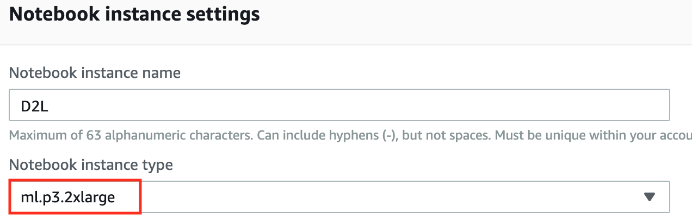
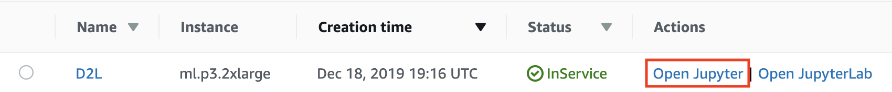

<!--
# Using Amazon SageMaker
-->

# Sử dụng Amazon SageMaker
:label:`sec_sagemaker`


<!--
Many deep learning applications require a significant amount of computation.
Your local machine might be too slow to solve these problems in a reasonable amount of time.
Cloud computing services give you access to more powerful computers to run the GPU-intensive portions of this book.
This tutorial will guide you through Amazon SageMaker: a service that allows you to run this book easily.
-->

Nhiều ứng dụng học sâu yêu cầu một lượng lớn các phép tính.
Máy tính của bạn có thể quá chậm để giải quyết vấn đề này trong một khoảng thời gian hợp lý.
Các dịch vụ điện toán đám mây cho phép bạn truy cập vào những máy tính mạnh mẽ hơn để chạy các phần yêu cầu GPU trong cuốn sách này.
Phần này sẽ cung cấp hướng dẫn về Amazon SageMaker: một dịch vụ cho phép bạn chạy các đoạn mã nguồn trong cuốn sách này một cách dễ dàng.


<!--
## Registering and Logging In
-->

## Đăng ký và Đăng nhập


<!--
First, we need to register an account at https://aws.amazon.com/.
We encourage you to use two-factor authentication for additional security.
It is also a good idea to set up detailed billing and spending alerts to avoid any unexpected surprises in case you forget to stop any running instance.
Note that you will need a credit card.
After logging into your AWS account, go to your [console](http://console.aws.amazon.com/) 
and search for "SageMaker" (see :numref:`fig_sagemaker`) then click to open the SageMaker panel.
-->

Đầu tiên, ta cần đăng ký tài khoản tại https://aws.amazon.com/.
Chúng tôi khuyến khích sử dụng xác thực hai yếu tố để tăng cường bảo mật.
Cũng là một ý tưởng tốt khi cài đặt thông tin thanh toán chi tiết và thông báo mức chi để tránh những chi phí ngoài ý muốn trong trường hợp bạn quên dừng máy ảo đang chạy.
Lưu ý rằng bạn sẽ cần một thẻ tín dụng.
Sau khi đăng nhập vào tài khoản AWS, đi tới [bảng điều khiển](http://console.aws.amazon.com/) của bạn và tìm kiếm từ khóa "Sagemaker" (như trong :numref:`fig_sagemaker`) rồi nhấp vào SageMaker.


<!--

-->


:width:`300px`
:label:`fig_sagemaker`


<!--
## Creating a SageMaker Instance
-->

## Tạo một Máy ảo SageMaker


<!--
Next, let us create a notebook instance as described in :numref:`fig_sagemaker-create`.
-->

Tiếp đến, hãy tạo một máy ảo notebook như đề cập trong :numref:`fig_sagemaker-create`.


<!--

-->


:width:`400px`
:label:`fig_sagemaker-create`


<!--
SageMaker provides multiple [instance types](https://aws.amazon.com/sagemaker/pricing/instance-types/) of different computational power and prices.
When creating an instance, we can specify the instance name and choose its type.
In :numref:`fig_sagemaker-create-2`, we choose `ml.p3.2xlarge`. With one Tesla V100 GPU and an 8-core CPU, this instance is powerful enough for most chapters.
-->

Sagemaker cung cấp đa dạng [các loại máy ảo](https://aws.amazon.com/sagemaker/pricing/instance-types/) với sức mạnh tính toán và mức chi phí khác nhau.
Khi tạo một máy ảo, ta có thể nêu chi tiết tên máy ảo và lựa chọn loại máy ảo mong muốn.
Trong :numref:`fig_sagemaker-create-2`, ta chọn `ml.p3.2xlarge`.
Với một GPU Tesla V100 và một CPU 8-nhân, máy ảo này là đã đủ mạnh mẽ cho hầu hết các chương.


<!--

-->


:width:`400px`
:label:`fig_sagemaker-create-2`


:begin_tab:`mxnet`
<!--
A Jupyter notebook version of this book for fitting SageMaker is available at https://github.com/d2l-ai/d2l-en-sagemaker.
We can specify this GitHub repository URL to let SageMaker clone this repository during instance creation, as shown in :numref:`fig_sagemaker-create-3`.
-->

Một phiên bản Jupyter notebook tương thích với Sagemaker có thể tìm thấy tại [https://github.com/d2l-ai/d2l-en-sagemaker](https://github.com/d2l-ai/d2l-en-sagemaker).
Ta có thể nêu chi tiết URL của Github repository này để Sagemaker clone về trong lúc tạo máy ảo, như minh họa ở :numref:`fig_sagemaker-create-3`.
:end_tab:


:begin_tab:`pytorch`
<!--
A Jupyter notebook version of this book for fitting SageMaker is available at https://github.com/d2l-ai/d2l-pytorch-sagemaker.
We can specify this GitHub repository URL to let SageMaker clone this repository during instance creation, as shown in :numref:`fig_sagemaker-create-3`.
-->

Một phiên bản Jupyter notebook tương thích với Sagemaker có thể tìm thấy tại [https://github.com/d2l-ai/d2l-pytorch-sagemaker](https://github.com/d2l-ai/d2l-pytorch-sagemaker).
Ta có thể nêu chi tiết URL của Github repository này để Sagemaker clone về trong lúc tạo máy ảo, như minh họa ở :numref:`fig_sagemaker-create-3`.
:end_tab:


:begin_tab:`tensorflow`
<!--
A Jupyter notebook version of this book for fitting SageMaker is available at https://github.com/d2l-ai/d2l-tensorflow-sagemaker.
We can specify this GitHub repository URL to let SageMaker clone this repository during instance creation, as shown in :numref:`fig_sagemaker-create-3`.
-->

Một phiên bản Jupyter notebook tương thích với Sagemaker có thể tìm thấy tại [https://github.com/d2l-ai/d2l-tensorflow-sagemaker](https://github.com/d2l-ai/d2l-tensorflow-sagemaker).
Ta có thể nêu chi tiết URL của Github repository này để Sagemaker clone về trong lúc tạo máy ảo, như minh họa ở :numref:`fig_sagemaker-create-3`.
:end_tab:


<!--

-->


:width:`400px`
:label:`fig_sagemaker-create-3`


<!--
## Running and Stopping an Instance
-->

## Chạy và Dừng một Máy ảo


<!--
It may take a few minutes before the instance is ready.
When it is ready, you can click on the "Open Jupyter" link as shown in :numref:`fig_sagemaker-open`.
-->

Có thể mất vài phút để khởi động máy ảo.
Khi đã khởi động xong, bạn có thể nhấp vào "Open Jupyter" như trong :numref:`fig_sagemaker-open`.


<!--

-->


:width:`400px`
:label:`fig_sagemaker-open`


<!--
Then, as shown in :numref:`fig_sagemaker-jupyter`, you may navigate through the Jupyter server running on this instance.
-->

Sau đó, như minh họa trong :numref:`fig_sagemaker-jupyter`, bạn có thể điều hướng thông qua máy chủ Jupyter đang chạy trên máy ảo này.


<!--

-->


:width:`400px`
:label:`fig_sagemaker-jupyter`


<!--
Running and editing Jupyter notebooks on the SageMaker instance is similar to what we have discussed in :numref:`sec_jupyter`.
After finishing your work, do not forget to stop the instance to avoid further charging, as shown in :numref:`fig_sagemaker-stop`.
-->

Chạy và chỉnh sửa các Jupyter notebook trên máy ảo Sagemaker cũng tương tự như những gì ta đã bàn luận ở :numref:`sec_jupyter`.
Sau khi xong việc, đừng quên dừng máy ảo để tránh bị tính thêm phí, như minh họa trong :numref:`fig_sagemaker-stop`.


<!--

-->


:width:`300px`
:label:`fig_sagemaker-stop`


<!--
## Updating Notebooks
-->

## Cập nhật Notebook


:begin_tab:`mxnet`
<!--
We will regularly update the notebooks in the [d2l-ai/d2l-en-sagemaker](https://github.com/d2l-ai/d2l-en-sagemaker) GitHub repository.
You can simply use the `git pull` command to update to the latest version.
-->

Các notebook bản tiếng Anh sẽ thường xuyên được cập nhật tại GitHub repo [d2l-ai/d2l-en-sagemaker](https://github.com/d2l-ai/d2l-en-sagemaker).
Bạn có thể đơn giản sử dụng lệnh `git pull` để cập nhật phiên bản mới nhất.
:end_tab:


:begin_tab:`pytorch`
<!--
We will regularly update the notebooks in the [d2l-ai/d2l-pytorch-sagemaker](https://github.com/d2l-ai/d2l-pytorch-sagemaker) GitHub repository.
You can simply use the `git pull` command to update to the latest version.
-->

Các notebook bản tiếng Anh sử dụng Pytorch sẽ thường xuyên được cập nhật tại GitHub repo [d2l-ai/d2l-pytorch-sagemaker](https://github.com/d2l-ai/d2l-pytorch-sagemaker).
Bạn có thể đơn giản sử dụng lệnh `git pull` để cập nhật phiên bản mới nhất.
:end_tab:


:begin_tab:`tensorflow`
<!--
We will regularly update the notebooks in the [d2l-ai/d2l-tensorflow-sagemaker](https://github.com/d2l-ai/d2l-tensorflow-sagemaker) GitHub repository.
You can simply use the `git pull` command to update to the latest version.
-->

Các notebook bản tiếng Anh sử dụng Tensorflow sẽ thường xuyên được cập nhật tại GitHub repo [d2l-ai/d2l-tensorflow-sagemaker](https://github.com/d2l-ai/d2l-tensorflow-sagemaker).
Bạn có thể đơn giản sử dụng lệnh `git pull` để cập nhật phiên bản mới nhất.
:end_tab:


<!--
First, you need to open a terminal as shown in :numref:`fig_sagemaker-terminal`.
-->

Đầu tiên, bạn cần mở một cửa sổ dòng lệnh như trong :numref:`fig_sagemaker-terminal`.


<!--

-->


:width:`300px`
:label:`fig_sagemaker-terminal`


<!--
You may want to commit your local changes before pulling the updates.
Alternatively, you can simply ignore all your local changes with the following commands in the terminal.
-->

Bạn có thể muốn commit những thay đổi được thực hiện trên máy tính trước khi kéo (*pull*) về những cập nhật mới.
Mặt khác, bạn có thể đơn giản phớt lờ những thay đổi của bạn với những dòng lệnh sau trong cửa sổ dòng lệnh.


:begin_tab:`mxnet`
```bash
cd SageMaker/d2l-en-sagemaker/
git reset --hard
git pull
```
:end_tab:

:begin_tab:`pytorch`
```bash
cd SageMaker/d2l-pytorch-sagemaker/
git reset --hard
git pull
```
:end_tab:

:begin_tab:`tensorflow`
```bash
cd SageMaker/d2l-tensorflow-sagemaker/
git reset --hard
git pull
```
:end_tab:


## Tóm tắt

<!--
* We can launch and stop a Jupyter server through Amazon SageMaker to run this book.
* We can update notebooks via the terminal on the Amazon SageMaker instance.
-->

* Ta có thể kích hoạt và dừng một máy chủ Jupyter thông qua Amazon Sagemaker để chạy cuốn sách này.
* Ta có thể cập nhật các notebook thông qua cửa sổ dòng lệnh trên máy ảo Amazon Sagemaker.


## Bài tập

<!--
1. Try to edit and run the code in this book using Amazon SageMaker.
2. Access the source code directory via the terminal.
-->

1. Thử thay đổi và chạy mã nguồn trong cuốn sách này trên Amazon Sagemaker.
2. Truy cập vào thư mục mã nguồn thông qua cửa sổ dòng lệnh.


## Thảo luận
* Tiếng Anh: [Main Forum](https://discuss.d2l.ai/t/422)
* Tiếng Việt: [Diễn đàn Machine Learning Cơ Bản](https://forum.machinelearningcoban.com/c/d2l)


## Những người thực hiện
Bản dịch trong trang này được thực hiện bởi:

* Đoàn Võ Duy Thanh
* Phạm Hồng Vinh
* Nguyễn Văn Quang
* Nguyễn Văn Cường
