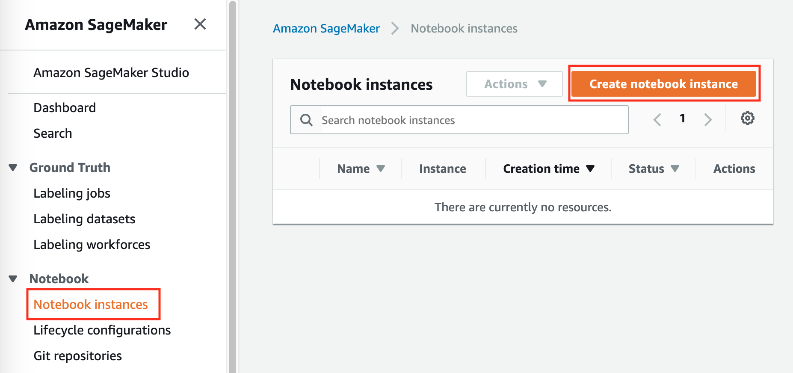
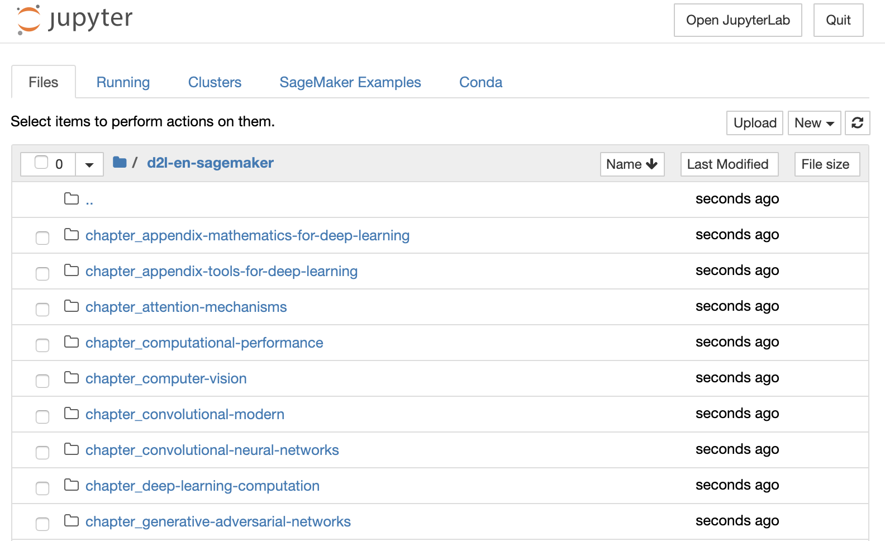
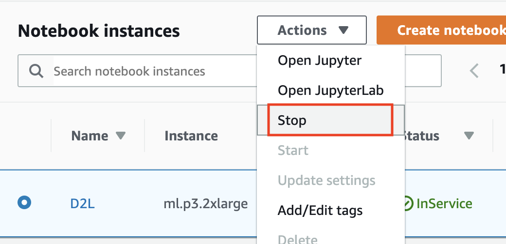
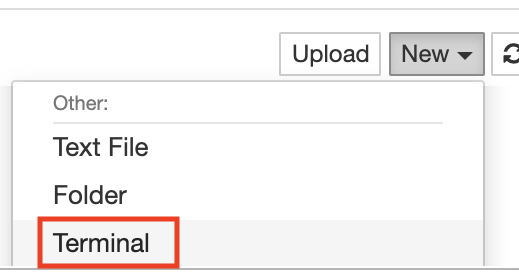

<!--
# Using Amazon SageMaker
-->

# Sử dụng Amazon SageMaker
:label:`sec_sagemaker`


<!--
Many deep learning applications require a significant amount of computation.
Your local machine might be too slow to solve these problems in a reasonable amount of time.
Cloud computing services give you access to more powerful computers to run the GPU-intensive portions of this book.
This tutorial will guide you through Amazon SageMaker: a service that allows you to run this book easily.
-->

*dịch đoạn phía trên*


<!--
## Registering and Logging In
-->

## *dịch tiêu đề trên*


<!--
First, we need to register an account at https://aws.amazon.com/.
We encourage you to use two-factor authentication for additional security.
It is also a good idea to set up detailed billing and spending alerts to avoid any unexpected surprises in case you forget to stop any running instance.
Note that you will need a credit card.
After logging into your AWS account, go to your [console](http://console.aws.amazon.com/) 
and search for "SageMaker" (see :numref:`fig_sagemaker`) then click to open the SageMaker panel.
-->

*dịch đoạn phía trên*


:width:`300px`
:label:`fig_sagemaker`


## Creating a SageMaker Instance
-->

## *dịch tiêu đề trên*


<!--
Next, let us create a notebook instance as described in :numref:`fig_sagemaker-create`.
-->

*dịch đoạn phía trên*



:width:`400px`
:label:`fig_sagemaker-create`


<!--
SageMaker provides multiple [instance types](https://aws.amazon.com/sagemaker/pricing/instance-types/) of different computational power and prices.
When creating an instance, we can specify the instance name and choose its type.
In :numref:`fig_sagemaker-create-2`, we choose `ml.p3.2xlarge`. With one Tesla V100 GPU and an 8-core CPU, this instance is powerful enough for most chapters.
-->

*dịch đoạn phía trên*


:width:`400px`
:label:`fig_sagemaker-create-2`


:begin_tab:`mxnet`
<!--
A Jupyter notebook version of this book for fitting SageMaker is available at https://github.com/d2l-ai/d2l-en-sagemaker.
We can specify this GitHub repository URL to let SageMaker clone this repository during instance creation, as shown in :numref:`fig_sagemaker-create-3`.
-->

*dịch đoạn phía trên*
:end_tab:


:begin_tab:`pytorch`
<!--
A Jupyter notebook version of this book for fitting SageMaker is available at https://github.com/d2l-ai/d2l-pytorch-sagemaker.
We can specify this GitHub repository URL to let SageMaker clone this repository during instance creation, as shown in :numref:`fig_sagemaker-create-3`.
-->

*dịch đoạn phía trên*
:end_tab:


:begin_tab:`tensorflow`
<!--
A Jupyter notebook version of this book for fitting SageMaker is available at https://github.com/d2l-ai/d2l-tensorflow-sagemaker.
We can specify this GitHub repository URL to let SageMaker clone this repository during instance creation, as shown in :numref:`fig_sagemaker-create-3`.
-->

*dịch đoạn phía trên*
:end_tab:


:width:`400px`
:label:`fig_sagemaker-create-3`


<!--
## Running and Stopping an Instance
-->

## *dịch tiêu đề trên*


<!--
It may take a few minutes before the instance is ready.
When it is ready, you can click on the "Open Jupyter" link as shown in :numref:`fig_sagemaker-open`.
-->

*dịch đoạn phía trên*


:width:`400px`
:label:`fig_sagemaker-open`


<!--
Then, as shown in :numref:`fig_sagemaker-jupyter`, you may navigate through the Jupyter server running on this instance.
-->

*dịch đoạn phía trên*



:width:`400px`
:label:`fig_sagemaker-jupyter`


<!--
Running and editing Jupyter notebooks on the SageMaker instance is similar to what we have discussed in :numref:`sec_jupyter`.
After finishing your work, do not forget to stop the instance to avoid further charging, as shown in :numref:`fig_sagemaker-stop`.
-->

*dịch đoạn phía trên*



:width:`300px`
:label:`fig_sagemaker-stop`


<!--
## Updating Notebooks
-->

## *dịch tiêu đề trên*


:begin_tab:`mxnet`
<!--
We will regularly update the notebooks in the [d2l-ai/d2l-en-sagemaker](https://github.com/d2l-ai/d2l-en-sagemaker) GitHub repository.
You can simply use the `git pull` command to update to the latest version.
-->

*dịch đoạn phía trên*
:end_tab:


:begin_tab:`pytorch`
<!--
We will regularly update the notebooks in the [d2l-ai/d2l-pytorch-sagemaker](https://github.com/d2l-ai/d2l-pytorch-sagemaker) GitHub repository.
You can simply use the `git pull` command to update to the latest version.
-->

*dịch đoạn phía trên*
:end_tab:


:begin_tab:`tensorflow`
<!--
We will regularly update the notebooks in the [d2l-ai/d2l-tensorflow-sagemaker](https://github.com/d2l-ai/d2l-tensorflow-sagemaker) GitHub repository.
You can simply use the `git pull` command to update to the latest version.
-->

*dịch đoạn phía trên*
:end_tab:


<!--
First, you need to open a terminal as shown in :numref:`fig_sagemaker-terminal`.
-->

*dịch đoạn phía trên*



:width:`300px`
:label:`fig_sagemaker-terminal`


<!--
You may want to commit your local changes before pulling the updates.
Alternatively, you can simply ignore all your local changes with the following commands in the terminal.
-->

*dịch đoạn phía trên*


:begin_tab:`mxnet`
```bash
cd SageMaker/d2l-en-sagemaker/
git reset --hard
git pull
```
:end_tab:

:begin_tab:`pytorch`
```bash
cd SageMaker/d2l-pytorch-sagemaker/
git reset --hard
git pull
```
:end_tab:

:begin_tab:`tensorflow`
```bash
cd SageMaker/d2l-tensorflow-sagemaker/
git reset --hard
git pull
```
:end_tab:


## Summary

<!--
* We can launch and stop a Jupyter server through Amazon SageMaker to run this book.
* We can update notebooks via the terminal on the Amazon SageMaker instance.
-->

*dịch đoạn phía trên*


## Exercises

<!--
1. Try to edit and run the code in this book using Amazon SageMaker.
2. Access the source code directory via the terminal.
-->

*dịch đoạn phía trên*


## Thảo luận
* Tiếng Anh: [Main Forum](https://discuss.d2l.ai/t/422)
* Tiếng Việt: [Diễn đàn Machine Learning Cơ Bản](https://forum.machinelearningcoban.com/c/d2l)


## Những người thực hiện
Bản dịch trong trang này được thực hiện bởi:
<!--
Tác giả của mỗi Pull Request điền tên mình và tên những người review mà bạn thấy
hữu ích vào từng phần tương ứng. Mỗi dòng một tên, bắt đầu bằng dấu `*`.

Tên đầy đủ của các reviewer có thể được tìm thấy tại https://github.com/aivivn/d2l-vn/blob/master/docs/contributors_info.md
-->

* Đoàn Võ Duy Thanh
<!-- Phần 1 -->
* 

<!-- Phần 2 -->
* 

<!-- Phần 3 -->
* 

*Lần cập nhật gần nhất: 13/09/2020. (Cập nhật lần cuối từ nội dung gốc: 22/08/2020)*
