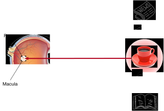
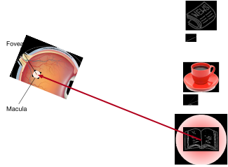
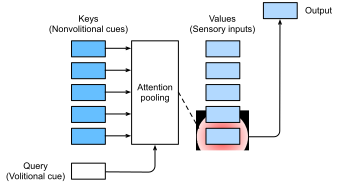

# Chú ý tín hiệu
:label:`sec_attention-cues`

Cảm ơn bạn đã quan tâm đến cuốn sách này. Chú ý là một nguồn tài nguyên khan hiếm: tại thời điểm bạn đang đọc cuốn sách này và bỏ qua phần còn lại. Do đó, tương tự như tiền, sự chú ý của bạn đang được trả bằng chi phí cơ hội. Để đảm bảo rằng sự đầu tư của bạn chú ý ngay bây giờ là đáng giá, chúng tôi đã rất có động lực để chú ý cẩn thận để sản xuất một cuốn sách hay. Sự chú ý là nền tảng trong vòm của cuộc sống và giữ chìa khóa cho bất kỳ tác phẩm ngoại lệ nào. 

Kể từ khi kinh tế học nghiên cứu việc phân bổ các nguồn lực khan hiếm, chúng ta đang ở trong thời đại của nền kinh tế chú ý, nơi sự chú ý của con người được coi là một hàng hóa hạn chế, có giá trị và khan hiếm có thể được trao đổi. Nhiều mô hình kinh doanh đã được phát triển để tận dụng nó. Trên các dịch vụ phát nhạc hoặc video, chúng tôi chú ý đến quảng cáo của họ hoặc trả tiền để ẩn chúng. Để tăng trưởng trong thế giới trò chơi trực tuyến, chúng tôi hoặc chú ý tham gia vào các trận chiến, thu hút các game thủ mới hoặc trả tiền để ngay lập tức trở nên mạnh mẽ. Không có gì đến miễn phí. 

Nói chung, thông tin trong môi trường của chúng ta không khan hiếm, chú ý là. Khi kiểm tra cảnh thị giác, dây thần kinh thị giác của chúng ta nhận được thông tin theo thứ tự $10^8$ bit mỗi giây, vượt xa những gì bộ não của chúng ta có thể xử lý hoàn toàn. May mắn thay, tổ tiên của chúng ta đã học được từ kinh nghiệm (còn được gọi là dữ liệu) rằng * không phải tất cả các đầu vào cảm giác được tạo ra bằng nhau*. Trong suốt lịch sử loài người, khả năng chỉ đạo sự chú ý đến một phần nhỏ thông tin quan tâm đã cho phép bộ não của chúng ta phân bổ tài nguyên thông minh hơn để tồn tại, phát triển và xã hội hóa, chẳng hạn như phát hiện kẻ săn mồi, săn mồi và bạn tình. 

## Các tín hiệu chú ý trong sinh học

Để giải thích cách sự chú ý của chúng ta được triển khai trong thế giới thị giác, một khung hai thành phần đã xuất hiện và phổ biến. Ý tưởng này có từ William James vào những năm 1890, người được coi là “cha đẻ của tâm lý học Mỹ” :cite:`James.2007`. Trong khuôn khổ này, các đối tượng có chọn lọc hướng sự chú ý của sự chú ý bằng cách sử dụng cả hai tín hiệu *phi ý dị* và *tín hiệu ý thích*. 

Các cue không có ý định dựa trên sự nổi bật và dễ thấy của các vật thể trong môi trường. Hãy tưởng tượng có năm đối tượng trước mặt bạn: một tờ báo, một bài báo nghiên cứu, một tách cà phê, một cuốn sổ và một cuốn sách như năm :numref:`fig_eye-coffee`. Trong khi tất cả các sản phẩm giấy được in màu đen và trắng, cốc cà phê có màu đỏ. Nói cách khác, cà phê này thực sự nổi bật và dễ thấy trong môi trường thị giác này, tự động và vô tình thu hút sự chú ý. Vì vậy, bạn mang fovea (trung tâm của điểm vàng nơi thị lực cao nhất) lên cà phê như thể hiện trong :numref:`fig_eye-coffee`. 


:width:`400px`
:label:`fig_eye-coffee`

Sau khi uống cà phê, bạn trở nên caffein và muốn đọc một cuốn sách. Vì vậy, bạn quay đầu, tập trung lại đôi mắt của bạn, và nhìn vào cuốn sách như mô tả trong :numref:`fig_eye-book`. Khác với trường hợp trong :numref:`fig_eye-coffee` nơi cà phê thiên vị bạn hướng tới lựa chọn dựa trên sự nổi bật, trong trường hợp phụ thuộc vào nhiệm vụ này, bạn chọn cuốn sách dưới sự kiểm soát nhận thức và ý chí. Sử dụng cue ý chí dựa trên các tiêu chí lựa chọn biến, hình thức chú ý này có chủ ý hơn. Nó cũng mạnh hơn với nỗ lực tự nguyện của đối tượng. 


:width:`400px`
:label:`fig_eye-book`

## Truy vấn, Khóa và Giá trị

Lấy cảm hứng từ các tín hiệu chú ý không có ý định và ý chí giải thích việc triển khai chú ý, trong phần sau, chúng tôi sẽ mô tả một khuôn khổ để thiết kế các cơ chế chú ý bằng cách kết hợp hai tín hiệu chú ý này. 

Để bắt đầu, hãy xem xét trường hợp đơn giản hơn, nơi chỉ có các tín hiệu phi nghĩa có sẵn. Để lựa chọn thiên vị so với các đầu vào cảm giác, chúng ta có thể chỉ cần sử dụng một lớp được kết nối đầy đủ được tham số hóa hoặc thậm chí là tổng hợp tối đa hoặc trung bình không tham số hóa. 

Do đó, điều đặt ra các cơ chế chú ý khác biệt với các lớp hoặc các lớp kết nối hoàn toàn đó là sự bao gồm các tín hiệu ý chí. Trong bối cảnh của các cơ chế chú ý, chúng tôi đề cập đến các tín hiệu ý chí là * queries*. Với bất kỳ truy vấn nào, lựa chọn thiên vị cơ chế chú ý so với các đầu vào cảm giác (ví dụ: biểu diễn tính năng trung gian) thông qua * chú ý cùng*. Những đầu vào cảm giác này được gọi là *giá trị* trong bối cảnh các cơ chế chú ý. Nói chung hơn, mọi giá trị được ghép nối với một * key*, có thể được nghĩ đến gợi ý phi nghĩa của đầu vào cảm giác đó. Như được hiển thị trong :numref:`fig_qkv`, chúng ta có thể thiết kế tập hợp sự chú ý để truy vấn đã cho (cue ý chí) có thể tương tác với các phím (tín hiệu phi nghĩa), hướng dẫn lựa chọn thiên vị so với các giá trị (đầu vào cảm giác). 


:label:`fig_qkv`

Lưu ý rằng có nhiều lựa chọn thay thế cho việc thiết kế các cơ chế chú ý. Ví dụ, chúng ta có thể thiết kế một mô hình chú ý không phân biệt có thể được đào tạo bằng phương pháp học tăng cường :cite:`Mnih.Heess.Graves.ea.2014`. Với sự thống trị của khuôn khổ trong :numref:`fig_qkv`, các mô hình trong khuôn khổ này sẽ là trung tâm của sự chú ý của chúng tôi trong chương này. 

## Hình dung của sự chú ý

Tổng hợp trung bình có thể được coi là trung bình trọng số của đầu vào, trong đó trọng lượng là đồng nhất. Trong thực tế, sự chú ý tập hợp các giá trị sử dụng trung bình trọng số, trong đó trọng lượng được tính toán giữa truy vấn đã cho và các khóa khác nhau.

```{.python .input}
from d2l import mxnet as d2l
from mxnet import np, npx
npx.set_np()
```

```{.python .input}
#@tab pytorch
from d2l import torch as d2l
import torch
```

```{.python .input}
#@tab tensorflow
from d2l import tensorflow as d2l
import tensorflow as tf
```

Để hình dung trọng lượng chú ý, chúng tôi xác định hàm `show_heatmaps`. Đầu vào của nó `matrices` có hình dạng (số hàng để hiển thị, số cột để hiển thị, số truy vấn, số phím).

```{.python .input}
#@tab all
#@save
def show_heatmaps(matrices, xlabel, ylabel, titles=None, figsize=(2.5, 2.5),
                  cmap='Reds'):
    """Show heatmaps of matrices."""
    d2l.use_svg_display()
    num_rows, num_cols = matrices.shape[0], matrices.shape[1]
    fig, axes = d2l.plt.subplots(num_rows, num_cols, figsize=figsize,
                                 sharex=True, sharey=True, squeeze=False)
    for i, (row_axes, row_matrices) in enumerate(zip(axes, matrices)):
        for j, (ax, matrix) in enumerate(zip(row_axes, row_matrices)):
            pcm = ax.imshow(d2l.numpy(matrix), cmap=cmap)
            if i == num_rows - 1:
                ax.set_xlabel(xlabel)
            if j == 0:
                ax.set_ylabel(ylabel)
            if titles:
                ax.set_title(titles[j])
    fig.colorbar(pcm, ax=axes, shrink=0.6);
```

Để trình diễn, chúng tôi xem xét một trường hợp đơn giản trong đó trọng lượng chú ý chỉ là một khi truy vấn và khóa giống nhau; nếu không thì nó bằng 0.

```{.python .input}
#@tab all
attention_weights = d2l.reshape(d2l.eye(10), (1, 1, 10, 10))
show_heatmaps(attention_weights, xlabel='Keys', ylabel='Queries')
```

Trong các phần tiếp theo, chúng ta thường sẽ gọi hàm này để hình dung trọng lượng chú ý. 

## Tóm tắt

* Sự chú ý của con người là một nguồn tài nguyên hạn chế, có giá trị và khan hiếm.
* Đối tượng có chọn lọc trực tiếp sự chú ý bằng cách sử dụng cả tín hiệu phi nghĩa và ý chí. Cái trước dựa trên sự nổi bật và cái sau phụ thuộc vào nhiệm vụ.
* Các cơ chế chú ý khác với các lớp được kết nối hoàn toàn hoặc các lớp tổng hợp do bao gồm các tín hiệu ý chí.
* Các cơ chế chú ý lựa chọn thiên vị so với các giá trị (đầu vào cảm giác) thông qua tập hợp sự chú ý, kết hợp các truy vấn (tín hiệu ý chí) và các phím (tín hiệu phi ý chí). Các phím và giá trị được ghép nối.
* Chúng ta có thể hình dung trọng lượng chú ý giữa các truy vấn và các phím.

## Bài tập

1. Điều gì có thể là cue ý chí khi giải mã một mã thông báo chuỗi bằng mã thông báo trong dịch máy? Các tín hiệu phi nghĩa và đầu vào cảm giác là gì?
1. Tạo ngẫu nhiên ma trận $10 \times 10$ và sử dụng thao tác softmax để đảm bảo mỗi hàng là một phân phối xác suất hợp lệ. Hình dung trọng lượng chú ý đầu ra.

:begin_tab:`mxnet`
[Discussions](https://discuss.d2l.ai/t/1596)
:end_tab:

:begin_tab:`pytorch`
[Discussions](https://discuss.d2l.ai/t/1592)
:end_tab:

:begin_tab:`tensorflow`
[Discussions](https://discuss.d2l.ai/t/1710)
:end_tab:
