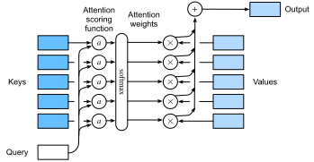

# Chức năng chấm điểm chú ý
:label:`sec_attention-scoring-functions`

Trong :numref:`sec_nadaraya-watson`, chúng tôi đã sử dụng một hạt nhân Gaussian để mô hình hóa tương tác giữa các truy vấn và khóa. Xử lý số mũ của hạt nhân Gaussian trong :eqref:`eq_nadaraya-watson-gaussian` như một chức năng ghi điểm *chú ý* (hoặc chức năng *ghi điểm*), kết quả của hàm này về cơ bản đã được đưa vào một hoạt động softmax. Kết quả là, chúng tôi thu được một phân phối xác suất (trọng lượng chú ý) so với các giá trị được ghép nối với các phím. Cuối cùng, đầu ra của sự chú ý tập hợp chỉ đơn giản là một tổng trọng số của các giá trị dựa trên các trọng lượng chú ý này. 

Ở cấp độ cao, chúng ta có thể sử dụng thuật toán trên để khởi tạo khuôn khổ của các cơ chế chú ý trong :numref:`fig_qkv`. Biểu thị một chức năng chấm điểm chú ý bởi $a$, :numref:`fig_attention_output` minh họa cách đầu ra của sự chú ý pooling có thể được tính như một tổng trọng số của các giá trị. Vì trọng lượng chú ý là một phân phối xác suất, tổng trọng số về cơ bản là một trung bình có trọng số. 


:label:`fig_attention_output`

Về mặt toán học, giả sử rằng chúng ta có một truy vấn $\mathbf{q} \in \mathbb{R}^q$ và $m$ cặp giá trị khóa $(\mathbf{k}_1, \mathbf{v}_1), \ldots, (\mathbf{k}_m, \mathbf{v}_m)$, trong đó bất kỳ $\mathbf{k}_i \in \mathbb{R}^k$ và $\mathbf{v}_i \in \mathbb{R}^v$ bất kỳ $\mathbf{v}_i \in \mathbb{R}^v$. Sự chú ý tập hợp $f$ được khởi tạo như một tổng trọng số của các giá trị: 

$$f(\mathbf{q}, (\mathbf{k}_1, \mathbf{v}_1), \ldots, (\mathbf{k}_m, \mathbf{v}_m)) = \sum_{i=1}^m \alpha(\mathbf{q}, \mathbf{k}_i) \mathbf{v}_i \in \mathbb{R}^v,$$
:eqlabel:`eq_attn-pooling`

trong đó trọng lượng chú ý (vô hướng) cho truy vấn $\mathbf{q}$ và khóa $\mathbf{k}_i$ được tính bằng hoạt động softmax của một chức năng ghi điểm chú ý $a$ ánh xạ hai vectơ đến vô hướng: 

$$\alpha(\mathbf{q}, \mathbf{k}_i) = \mathrm{softmax}(a(\mathbf{q}, \mathbf{k}_i)) = \frac{\exp(a(\mathbf{q}, \mathbf{k}_i))}{\sum_{j=1}^m \exp(a(\mathbf{q}, \mathbf{k}_j))} \in \mathbb{R}.$$
:eqlabel:`eq_attn-scoring-alpha`

Như chúng ta có thể thấy, các lựa chọn khác nhau của chức năng ghi điểm chú ý $a$ dẫn đến các hành vi khác nhau của sự chú ý chung. Trong phần này, chúng tôi giới thiệu hai chức năng tính điểm phổ biến mà chúng tôi sẽ sử dụng để phát triển các cơ chế chú ý phức tạp hơn sau này.

```{.python .input}
import math
from d2l import mxnet as d2l
from mxnet import np, npx
from mxnet.gluon import nn
npx.set_np()
```

```{.python .input}
#@tab pytorch
from d2l import torch as d2l
import math
import torch
from torch import nn
```

```{.python .input}
#@tab tensorflow
from d2l import tensorflow as d2l
import tensorflow as tf
```

## [** Masked Softmax Operation**]

Như chúng tôi vừa đề cập, một hoạt động softmax được sử dụng để tạo ra một phân phối xác suất như trọng lượng chú ý. Trong một số trường hợp, không phải tất cả các giá trị nên được đưa vào tập hợp chú ý. Ví dụ, để xử lý minibatch hiệu quả trong :numref:`sec_machine_translation`, một số chuỗi văn bản được đệm với các mã thông báo đặc biệt không mang ý nghĩa. Để thu hút sự chú ý chỉ có các token có ý nghĩa làm giá trị, chúng ta có thể chỉ định độ dài chuỗi hợp lệ (về số lượng token) để lọc ra những mã thông báo vượt quá phạm vi quy định này khi tính toán softmax. Bằng cách này, chúng ta có thể thực hiện một operation*masked softmax* như vậy trong hàm `masked_softmax` sau, trong đó bất kỳ giá trị nào vượt quá độ dài hợp lệ được che dấu là zero.

```{.python .input}
#@save
def masked_softmax(X, valid_lens):
    """Perform softmax operation by masking elements on the last axis."""
    # `X`: 3D tensor, `valid_lens`: 1D or 2D tensor
    if valid_lens is None:
        return npx.softmax(X)
    else:
        shape = X.shape
        if valid_lens.ndim == 1:
            valid_lens = valid_lens.repeat(shape[1])
        else:
            valid_lens = valid_lens.reshape(-1)
        # On the last axis, replace masked elements with a very large negative
        # value, whose exponentiation outputs 0
        X = npx.sequence_mask(X.reshape(-1, shape[-1]), valid_lens, True,
                              value=-1e6, axis=1)
        return npx.softmax(X).reshape(shape)
```

```{.python .input}
#@tab pytorch
#@save
def masked_softmax(X, valid_lens):
    """Perform softmax operation by masking elements on the last axis."""
    # `X`: 3D tensor, `valid_lens`: 1D or 2D tensor
    if valid_lens is None:
        return nn.functional.softmax(X, dim=-1)
    else:
        shape = X.shape
        if valid_lens.dim() == 1:
            valid_lens = torch.repeat_interleave(valid_lens, shape[1])
        else:
            valid_lens = valid_lens.reshape(-1)
        # On the last axis, replace masked elements with a very large negative
        # value, whose exponentiation outputs 0
        X = d2l.sequence_mask(X.reshape(-1, shape[-1]), valid_lens,
                              value=-1e6)
        return nn.functional.softmax(X.reshape(shape), dim=-1)
```

```{.python .input}
#@tab tensorflow
#@save
def masked_softmax(X, valid_lens):
    """Perform softmax operation by masking elements on the last axis."""
    # `X`: 3D tensor, `valid_lens`: 1D or 2D tensor
    if valid_lens is None:
        return tf.nn.softmax(X, axis=-1)
    else:
        shape = X.shape
        if len(valid_lens.shape) == 1:
            valid_lens = tf.repeat(valid_lens, repeats=shape[1])
            
        else:
            valid_lens = tf.reshape(valid_lens, shape=-1)
        # On the last axis, replace masked elements with a very large negative
        # value, whose exponentiation outputs 0    
        X = d2l.sequence_mask(tf.reshape(X, shape=(-1, shape[-1])), valid_lens, value=-1e6)    
        return tf.nn.softmax(tf.reshape(X, shape=shape), axis=-1)
```

Để [**chứng minh cách thức hoạt động của hàm này**], hãy xem xét một minibatch gồm hai ví dụ ma trận $2 \times 4$, trong đó độ dài hợp lệ cho hai ví dụ này là hai và ba, tương ứng. Kết quả của hoạt động softmax đeo mặt nạ, các giá trị vượt quá độ dài hợp lệ đều được che dấu là 0.

```{.python .input}
masked_softmax(np.random.uniform(size=(2, 2, 4)), d2l.tensor([2, 3]))
```

```{.python .input}
#@tab pytorch
masked_softmax(torch.rand(2, 2, 4), torch.tensor([2, 3]))
```

```{.python .input}
#@tab tensorflow
masked_softmax(tf.random.uniform(shape=(2, 2, 4)), tf.constant([2, 3]))
```

Tương tự, chúng ta cũng có thể sử dụng tensor hai chiều để chỉ định độ dài hợp lệ cho mỗi hàng trong mỗi ví dụ ma trận.

```{.python .input}
masked_softmax(np.random.uniform(size=(2, 2, 4)),
               d2l.tensor([[1, 3], [2, 4]]))
```

```{.python .input}
#@tab pytorch
masked_softmax(torch.rand(2, 2, 4), d2l.tensor([[1, 3], [2, 4]]))
```

```{.python .input}
#@tab tensorflow
masked_softmax(tf.random.uniform((2, 2, 4)), tf.constant([[1, 3], [2, 4]]))
```

## [**Phụ gia chú ý**]
:label:`subsec_additive-attention`

Nói chung, khi truy vấn và phím là vectơ có độ dài khác nhau, chúng ta có thể sử dụng sự chú ý phụ gia làm chức năng chấm điểm. Đưa ra một truy vấn $\mathbf{q} \in \mathbb{R}^q$ và một khóa $\mathbf{k} \in \mathbb{R}^k$, chức năng chấm điểm * phụ thuật* 

$$a(\mathbf q, \mathbf k) = \mathbf w_v^\top \text{tanh}(\mathbf W_q\mathbf q + \mathbf W_k \mathbf k) \in \mathbb{R},$$
:eqlabel:`eq_additive-attn`

trong đó các thông số có thể học được $\mathbf W_q\in\mathbb R^{h\times q}$, $\mathbf W_k\in\mathbb R^{h\times k}$ và $\mathbf w_v\in\mathbb R^{h}$. Tương đương với :eqref:`eq_additive-attn`, truy vấn và khóa được nối và đưa vào một MLP với một lớp ẩn duy nhất có số đơn vị ẩn là $h$, một siêu tham số. Bằng cách sử dụng $\tanh$ làm chức năng kích hoạt và vô hiệu hóa các thuật ngữ thiên vị, chúng tôi thực hiện sự chú ý phụ gia trong những điều sau đây.

```{.python .input}
#@save
class AdditiveAttention(nn.Block):
    """Additive attention."""
    def __init__(self, num_hiddens, dropout, **kwargs):
        super(AdditiveAttention, self).__init__(**kwargs)
        # Use `flatten=False` to only transform the last axis so that the
        # shapes for the other axes are kept the same
        self.W_k = nn.Dense(num_hiddens, use_bias=False, flatten=False)
        self.W_q = nn.Dense(num_hiddens, use_bias=False, flatten=False)
        self.w_v = nn.Dense(1, use_bias=False, flatten=False)
        self.dropout = nn.Dropout(dropout)

    def forward(self, queries, keys, values, valid_lens):
        queries, keys = self.W_q(queries), self.W_k(keys)
        # After dimension expansion, shape of `queries`: (`batch_size`, no. of
        # queries, 1, `num_hiddens`) and shape of `keys`: (`batch_size`, 1,
        # no. of key-value pairs, `num_hiddens`). Sum them up with
        # broadcasting
        features = np.expand_dims(queries, axis=2) + np.expand_dims(
            keys, axis=1)
        features = np.tanh(features)
        # There is only one output of `self.w_v`, so we remove the last
        # one-dimensional entry from the shape. Shape of `scores`:
        # (`batch_size`, no. of queries, no. of key-value pairs)
        scores = np.squeeze(self.w_v(features), axis=-1)
        self.attention_weights = masked_softmax(scores, valid_lens)
        # Shape of `values`: (`batch_size`, no. of key-value pairs, value
        # dimension)
        return npx.batch_dot(self.dropout(self.attention_weights), values)
```

```{.python .input}
#@tab pytorch
#@save
class AdditiveAttention(nn.Module):
    """Additive attention."""
    def __init__(self, key_size, query_size, num_hiddens, dropout, **kwargs):
        super(AdditiveAttention, self).__init__(**kwargs)
        self.W_k = nn.Linear(key_size, num_hiddens, bias=False)
        self.W_q = nn.Linear(query_size, num_hiddens, bias=False)
        self.w_v = nn.Linear(num_hiddens, 1, bias=False)
        self.dropout = nn.Dropout(dropout)

    def forward(self, queries, keys, values, valid_lens):
        queries, keys = self.W_q(queries), self.W_k(keys)
        # After dimension expansion, shape of `queries`: (`batch_size`, no. of
        # queries, 1, `num_hiddens`) and shape of `keys`: (`batch_size`, 1,
        # no. of key-value pairs, `num_hiddens`). Sum them up with
        # broadcasting
        features = queries.unsqueeze(2) + keys.unsqueeze(1)
        features = torch.tanh(features)
        # There is only one output of `self.w_v`, so we remove the last
        # one-dimensional entry from the shape. Shape of `scores`:
        # (`batch_size`, no. of queries, no. of key-value pairs)
        scores = self.w_v(features).squeeze(-1)
        self.attention_weights = masked_softmax(scores, valid_lens)
        # Shape of `values`: (`batch_size`, no. of key-value pairs, value
        # dimension)
        return torch.bmm(self.dropout(self.attention_weights), values)
```

```{.python .input}
#@tab tensorflow
#@save
class AdditiveAttention(tf.keras.layers.Layer):
    """Additive attention."""
    def __init__(self, key_size, query_size, num_hiddens, dropout, **kwargs):
        super().__init__(**kwargs)
        self.W_k = tf.keras.layers.Dense(num_hiddens, use_bias=False)
        self.W_q = tf.keras.layers.Dense(num_hiddens, use_bias=False)
        self.w_v = tf.keras.layers.Dense(1, use_bias=False)
        self.dropout = tf.keras.layers.Dropout(dropout)
        
    def call(self, queries, keys, values, valid_lens, **kwargs):
        queries, keys = self.W_q(queries), self.W_k(keys)
        # After dimension expansion, shape of `queries`: (`batch_size`, no. of
        # queries, 1, `num_hiddens`) and shape of `keys`: (`batch_size`, 1,
        # no. of key-value pairs, `num_hiddens`). Sum them up with
        # broadcasting
        features = tf.expand_dims(queries, axis=2) + tf.expand_dims(
            keys, axis=1)
        features = tf.nn.tanh(features)
        # There is only one output of `self.w_v`, so we remove the last
        # one-dimensional entry from the shape. Shape of `scores`:
        # (`batch_size`, no. of queries, no. of key-value pairs)
        scores = tf.squeeze(self.w_v(features), axis=-1)
        self.attention_weights = masked_softmax(scores, valid_lens)
        # Shape of `values`: (`batch_size`, no. of key-value pairs, value
        # dimension)
        return tf.matmul(self.dropout(
            self.attention_weights, **kwargs), values)
```

Hãy để chúng tôi [** chứng minh lớp `AdditiveAttention` ở trên**] với một ví dụ đồ chơi, trong đó các hình dạng (kích thước lô, số bước hoặc độ dài chuỗi trong thẻ, kích thước tính năng) của truy vấn, khóa và giá trị là ($2$, $1$, $20$), ($2$, $2$), và ($2$), ($2$, $10$, $4$), tương ứng. Đầu ra tập hợp chú ý có hình dạng (kích thước lô, số bước cho truy vấn, kích thước tính năng cho các giá trị).

```{.python .input}
queries, keys = d2l.normal(0, 1, (2, 1, 20)), d2l.ones((2, 10, 2))
# The two value matrices in the `values` minibatch are identical
values = np.arange(40).reshape(1, 10, 4).repeat(2, axis=0)
valid_lens = d2l.tensor([2, 6])

attention = AdditiveAttention(num_hiddens=8, dropout=0.1)
attention.initialize()
attention(queries, keys, values, valid_lens)
```

```{.python .input}
#@tab pytorch
queries, keys = d2l.normal(0, 1, (2, 1, 20)), d2l.ones((2, 10, 2))
# The two value matrices in the `values` minibatch are identical
values = torch.arange(40, dtype=torch.float32).reshape(1, 10, 4).repeat(
    2, 1, 1)
valid_lens = d2l.tensor([2, 6])

attention = AdditiveAttention(key_size=2, query_size=20, num_hiddens=8,
                              dropout=0.1)
attention.eval()
attention(queries, keys, values, valid_lens)
```

```{.python .input}
#@tab tensorflow
queries, keys = tf.random.normal(shape=(2, 1, 20)), tf.ones((2, 10, 2))
# The two value matrices in the `values` minibatch are identical
values = tf.repeat(tf.reshape(
    tf.range(40, dtype=tf.float32), shape=(1, 10, 4)), repeats=2, axis=0)
valid_lens = tf.constant([2, 6])

attention = AdditiveAttention(key_size=2, query_size=20, num_hiddens=8,
                              dropout=0.1)
attention(queries, keys, values, valid_lens, training=False)
```

Mặc dù sự chú ý phụ gia chứa các tham số có thể học được, vì mỗi khóa đều giống nhau trong ví dụ này, [** trọng lượng chú ý**] đều đồng nhất, được xác định bởi độ dài hợp lệ được chỉ định.

```{.python .input}
#@tab all
d2l.show_heatmaps(d2l.reshape(attention.attention_weights, (1, 1, 2, 10)),
                  xlabel='Keys', ylabel='Queries')
```

## [** Quy mô Dot-Product Attention**]

Một thiết kế hiệu quả tính toán hơn cho chức năng tính điểm có thể chỉ đơn giản là chấm sản phẩm. Tuy nhiên, hoạt động của sản phẩm chấm đòi hỏi cả truy vấn và khóa đều có cùng độ dài vector, giả sử $d$. Giả sử rằng tất cả các yếu tố của truy vấn và khóa là các biến ngẫu nhiên độc lập với không trung bình và phương sai đơn vị. Tích chấm của cả hai vectơ có trung bình bằng 0 và phương sai là $d$. Để đảm bảo rằng phương sai của sản phẩm chấm vẫn là một bất kể chiều dài vectơ, chức năng chấm điểm chú ý * thu nhỏ sản phẩm điểm 

$$a(\mathbf q, \mathbf k) = \mathbf{q}^\top \mathbf{k}  /\sqrt{d}$$

chia sản phẩm chấm cho $\sqrt{d}$. Trong thực tế, chúng ta thường nghĩ về minibatches cho hiệu quả, chẳng hạn như tính toán sự chú ý cho $n$ truy vấn và $m$ cặp giá trị khóa, trong đó các truy vấn và khóa có chiều dài $d$ và các giá trị có chiều dài $v$. Sự chú ý của sản phẩm điểm được chia tỷ lệ của truy vấn $\mathbf Q\in\mathbb R^{n\times d}$, phím $\mathbf K\in\mathbb R^{m\times d}$ và các giá trị $\mathbf V\in\mathbb R^{m\times v}$ là 

$$ \mathrm{softmax}\left(\frac{\mathbf Q \mathbf K^\top }{\sqrt{d}}\right) \mathbf V \in \mathbb{R}^{n\times v}.$$
:eqlabel:`eq_softmax_QK_V`

Trong việc thực hiện sau đây của sự chú ý của sản phẩm chấm thu nhỏ, chúng tôi sử dụng dropout để điều chỉnh mô hình.

```{.python .input}
#@save
class DotProductAttention(nn.Block):
    """Scaled dot product attention."""
    def __init__(self, dropout, **kwargs):
        super(DotProductAttention, self).__init__(**kwargs)
        self.dropout = nn.Dropout(dropout)

    # Shape of `queries`: (`batch_size`, no. of queries, `d`)
    # Shape of `keys`: (`batch_size`, no. of key-value pairs, `d`)
    # Shape of `values`: (`batch_size`, no. of key-value pairs, value
    # dimension)
    # Shape of `valid_lens`: (`batch_size`,) or (`batch_size`, no. of queries)
    def forward(self, queries, keys, values, valid_lens=None):
        d = queries.shape[-1]
        # Set `transpose_b=True` to swap the last two dimensions of `keys`
        scores = npx.batch_dot(queries, keys, transpose_b=True) / math.sqrt(d)
        self.attention_weights = masked_softmax(scores, valid_lens)
        return npx.batch_dot(self.dropout(self.attention_weights), values)
```

```{.python .input}
#@tab pytorch
#@save
class DotProductAttention(nn.Module):
    """Scaled dot product attention."""
    def __init__(self, dropout, **kwargs):
        super(DotProductAttention, self).__init__(**kwargs)
        self.dropout = nn.Dropout(dropout)

    # Shape of `queries`: (`batch_size`, no. of queries, `d`)
    # Shape of `keys`: (`batch_size`, no. of key-value pairs, `d`)
    # Shape of `values`: (`batch_size`, no. of key-value pairs, value
    # dimension)
    # Shape of `valid_lens`: (`batch_size`,) or (`batch_size`, no. of queries)
    def forward(self, queries, keys, values, valid_lens=None):
        d = queries.shape[-1]
        # Set `transpose_b=True` to swap the last two dimensions of `keys`
        scores = torch.bmm(queries, keys.transpose(1,2)) / math.sqrt(d)
        self.attention_weights = masked_softmax(scores, valid_lens)
        return torch.bmm(self.dropout(self.attention_weights), values)
```

```{.python .input}
#@tab tensorflow
#@save
class DotProductAttention(tf.keras.layers.Layer):
    """Scaled dot product attention."""
    def __init__(self, dropout, **kwargs):
        super().__init__(**kwargs)
        self.dropout = tf.keras.layers.Dropout(dropout)
        
    # Shape of `queries`: (`batch_size`, no. of queries, `d`)
    # Shape of `keys`: (`batch_size`, no. of key-value pairs, `d`)
    # Shape of `values`: (`batch_size`, no. of key-value pairs, value
    # dimension)
    # Shape of `valid_lens`: (`batch_size`,) or (`batch_size`, no. of queries)
    def call(self, queries, keys, values, valid_lens, **kwargs):
        d = queries.shape[-1]
        scores = tf.matmul(queries, keys, transpose_b=True)/tf.math.sqrt(
            tf.cast(d, dtype=tf.float32))
        self.attention_weights = masked_softmax(scores, valid_lens)
        return tf.matmul(self.dropout(self.attention_weights, **kwargs), values)
```

Để [**chứng minh lớp `DotProductAttention` ở trên**], chúng tôi sử dụng cùng một phím, giá trị và độ dài hợp lệ từ ví dụ đồ chơi trước đó để chú ý phụ gia. Đối với hoạt động sản phẩm chấm, chúng tôi làm cho kích thước tính năng của các truy vấn giống như kích thước của các phím.

```{.python .input}
queries = d2l.normal(0, 1, (2, 1, 2))
attention = DotProductAttention(dropout=0.5)
attention.initialize()
attention(queries, keys, values, valid_lens)
```

```{.python .input}
#@tab pytorch
queries = d2l.normal(0, 1, (2, 1, 2))
attention = DotProductAttention(dropout=0.5)
attention.eval()
attention(queries, keys, values, valid_lens)
```

```{.python .input}
#@tab tensorflow
queries = tf.random.normal(shape=(2, 1, 2))
attention = DotProductAttention(dropout=0.5)
attention(queries, keys, values, valid_lens, training=False)
```

Giống như trong trình diễn chú ý phụ gia, vì `keys` chứa cùng một yếu tố không thể phân biệt bằng bất kỳ truy vấn nào, [** trọng lượng chú ý thống nhất**] thu được.

```{.python .input}
#@tab all
d2l.show_heatmaps(d2l.reshape(attention.attention_weights, (1, 1, 2, 10)),
                  xlabel='Keys', ylabel='Queries')
```

## Tóm tắt

* Chúng ta có thể tính toán đầu ra của sự chú ý tập hợp như một trung bình trọng số của các giá trị, trong đó các lựa chọn khác nhau của chức năng chấm điểm chú ý dẫn đến các hành vi khác nhau của sự chú ý.
* Khi truy vấn và phím là vectơ có độ dài khác nhau, chúng ta có thể sử dụng chức năng chấm điểm chú ý phụ gia. Khi chúng giống nhau, chức năng ghi điểm chú ý dot-sản phẩm thu nhỏ sẽ hiệu quả hơn về mặt tính toán.

## Bài tập

1. Sửa đổi các phím trong ví dụ đồ chơi và hình dung trọng lượng chú ý. Do phụ gia chú ý và thu nhỏ sự chú ý của sản phẩm điểm vẫn xuất ra cùng một trọng lượng chú ý? Tại sao hoặc tại sao không?
1. Chỉ sử dụng phép nhân ma trận, bạn có thể thiết kế một chức năng tính điểm mới cho các truy vấn và các phím có độ dài vector khác nhau không?
1. Khi truy vấn và phím có cùng chiều dài vector, tổng kết vectơ có thiết kế tốt hơn so với sản phẩm chấm cho chức năng chấm điểm không? Tại sao hoặc tại sao không?

:begin_tab:`mxnet`
[Discussions](https://discuss.d2l.ai/t/346)
:end_tab:

:begin_tab:`pytorch`
[Discussions](https://discuss.d2l.ai/t/1064)
:end_tab:
