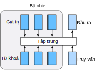
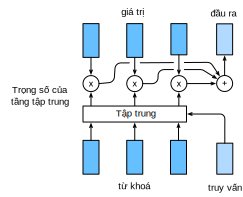

<!-- ===================== Bắt đầu dịch Phần 1 ==================== -->
<!-- ========================================= REVISE PHẦN 1 - BẮT ĐẦU =================================== -->

<!--
# Attention Mechanisms
-->

# Cơ chế Tập trung
:label:`sec_attention`

<!--
In :numref:`sec_seq2seq`, we encode the source sequence input information in the recurrent unit state and then pass it to the decoder to generate the target sequence.
A token in the target sequence may closely relate to one or more tokens in the source sequence, instead of the whole source sequence.
For example, when translating "Hello world." to "Bonjour le monde.", "Bonjour" maps to "Hello" and "monde" maps to "world".
In the seq2seq model, the decoder may implicitly select the corresponding information from the state passed by the encoder.
The attention mechanism, however, makes this selection explicit.
-->

Trong :numref:`sec_seq2seq`, chúng ta dùng mạng hồi tiếp để mã hóa thông tin của chuỗi nguồn đầu vào thành trạng thái ẩn và truyền nó tới bộ giải mã để sinh chuỗi đích.
Một token trong chuỗi đích có thể chỉ liên quan mật thiết tới một vài token chứ không nhất thiết là toàn bộ token trong chuỗi nguồn.
Ví dụ, khi dịch "Hello world." thành "Bonjour le monde.", từ "Bonjour" ánh xạ tới từ "Hello" và từ "monde" ánh xạ tới từ "world". 
Trong mô hình seq2seq, bộ giải mã có thể ngầm chọn thông tin tương ứng từ trạng thái ẩn được truyền đến từ bộ mã hóa.
Tuy nhiên, cơ chế tập trung (_attention mechanism_) thực hiện phép chọn này một cách tường minh.


<!--
*Attention* is a generalized pooling method with bias alignment over inputs.
The core component in the attention mechanism is the attention layer, or called *attention* for simplicity.
An input of the attention layer is called a *query*.
For a query, attention returns an output based on the memory---a set of key-value pairs encoded in the attention layer.
To be more specific, assume that the memory contains $n$ key-value pairs, 
$(\mathbf{k}_1, \mathbf{v}_1), \ldots, (\mathbf{k}_n, \mathbf{v}_n)$, with $\mathbf{k}_i \in \mathbb R^{d_k}$, $\mathbf{v}_i \in \mathbb R^{d_v}$.
Given a query $\mathbf{q} \in \mathbb R^{d_q}$, the attention layer returns an output $\mathbf{o} \in \mathbb R^{d_v}$ with the same shape as the value.
-->

Cơ chế *tập trung* có thể được coi là phép gộp tổng quát. Nó gộp đầu vào dựa trên các trọng số khác nhau.
Thành phần cốt lõi của cơ chế tập trung là tầng tập trung.
Đầu vào của tầng tập trung được gọi ngắn gọn là *câu truy vấn* (*query*).
Với mỗi câu truy vấn, tầng tập trung trả về đầu ra dựa trên bộ nhớ là tập các cặp khóa-giá trị được mã hóa trong tầng tập trung này. 
Cụ thể, giả sử bộ nhớ chứa $n$ cặp vector khóa-giá trị,
$(\mathbf{k}_1, \mathbf{v}_1), \ldots, (\mathbf{k}_n, \mathbf{v}_n)$, với $\mathbf{k}_i \in \mathbb R^{d_k}$, $\mathbf{v}_i \in \mathbb R^{d_v}$.
Với mỗi vector truy vấn $\mathbf{q} \in \mathbb R^{d_q}$, tầng tập trung trả về đầu ra $\mathbf{o} \in \mathbb R^{d_v}$ có cùng kích thước với vector giá trị.


<!--

-->


:label:`fig_attention`


<!--
The full process of attention mechanism is expressed in :numref:`fig_attention_output`.
To compute the output of attention, we first use a score function $\alpha$ that measures the similarity between the query and key.
Then for each key $(\mathbf{k}_1, \mathbf{v}_1), \ldots, (\mathbf{k}_n, \mathbf{v}_n)$, we compute the scores $a_1, \ldots, a_n$ by
-->

Chi tiết về cơ chế tập trung được minh họa trong :numref:`fig_attention_output`.
Để tính toán đầu ra của tầng tập trung, chúng ta sử dụng hàm tính điểm $\alpha$ để đo độ tương đồng giữa câu truy vấn và các khóa.
Sau đó, với mỗi khóa $(\mathbf{k}_1, \mathbf{v}_1), \ldots, (\mathbf{k}_n, \mathbf{v}_n)$, ta tính điểm $a_1, \ldots, a_n$ như sau:


$$a_i = \alpha(\mathbf q, \mathbf k_i).$$


<!--
Next we use softmax to obtain the attention weights, i.e.,
-->

Tiếp theo, chúng ta sử dụng hàm softmax để thu được các trọng số tập trung (_attention weights_), cụ thể:


$$\mathbf{b} = \mathrm{softmax}(\mathbf{a})\quad \text{trong đó }\quad
{b}_i = \frac{\exp(a_i)}{\sum_j \exp(a_j)}, \mathbf{b} = [b_1, \ldots, b_n]^T .$$

<!-- ===================== Kết thúc dịch Phần 1 ===================== -->

<!-- ===================== Bắt đầu dịch Phần 2 ===================== -->

<!--
Finally, the output is a weighted sum of the values:
-->

Cuối cùng, đầu ra của tầng là tổng trọng số của các giá trị:


$$\mathbf o = \sum_{i=1}^n b_i \mathbf v_i.$$


<!--

-->


:label:`fig_attention_output`


<!--
Different choices of the score function lead to different attention layers.
Below, we introduce two commonly used attention layers.
Before diving into the implementation, we first express two operators to get you up and running: a masked version of the softmax operator `masked_softmax` and a specialized dot operator `batched_dot`.
-->
Cách lựa chọn hàm tính điểm khác nhau sẽ tạo ra các tầng tập trung khác nhau.
Ở dưới đây chúng tôi sẽ trình bày hai tầng tập trung thường hay được sử dụng.
Đầu tiên chúng tôi giới thiệu hai toán tử cần thiết để lập trình hai tầng này: toán tử softmax có mặt nạ `masked_softmax` và toán tử tích vô hướng chuyên biệt theo batch `batched_dot`.


```{.python .input  n=1}
import math
from mxnet import np, npx
from mxnet.gluon import nn
npx.set_np()
```

<!--
The masked softmax takes a 3-dimensional input and enables us to filter out some elements by specifying a valid length for the last dimension.
(Refer to :numref:`sec_machine_translation` for the definition of a valid length).
As a result, any value outside the valid length will be masked as $0$.
Let us implement the `masked_softmax` function.
-->

Toán tử softmax có mặt nạ nhận đầu vào là một tensor 3 chiều và cho phép ta lọc ra một số phần tử bằng cách xác định độ dài hợp lệ cho chiều cuối cùng. (Tham khảo :numref:`sec_machine_translation` về định nghĩa của độ dài hợp lệ).
Do đó, những giá trị nằm ngoài độ dài hợp lệ sẽ được gán bằng $0$.
Chúng ta lập trình hàm `masked_softmax` như sau.


```{.python .input  n=6}
# Saved in the d2l package for later use
def masked_softmax(X, valid_len):
    # X: 3-D tensor, valid_len: 1-D or 2-D tensor
    if valid_len is None:
        return npx.softmax(X)
    else:
        shape = X.shape
        if valid_len.ndim == 1:
            valid_len = valid_len.repeat(shape[1], axis=0)
        else:
            valid_len = valid_len.reshape(-1)
        # Fill masked elements with a large negative, whose exp is 0
        X = npx.sequence_mask(X.reshape(-1, shape[-1]), valid_len, True,
                              axis=1, value=-1e6)
        return npx.softmax(X).reshape(shape)
```

<!--
To illustrate how this function works, we construct two $2 \times 4$ matrices as the input.
In addition, we specify that the valid length equals to 2 for the first example, and 3 for the second example.
Then, as we can see from the following outputs, the values outside valid lengths are masked as zero.
-->

Để minh họa cách hàm trên hoạt động, chúng ta hãy khởi tạo hai ma trận đầu vào kích thước là $2 \times 4$.
Bên cạnh đó, chúng ta sẽ gán độ dài hợp lệ cho mẫu thứ nhất là 2 và mẫu thứ hai là 3.
Từ đó, những giá trị đầu ra nằm ngoài độ dài hợp lệ sẽ được gán bằng $0$ như dưới đây.


```{.python .input  n=5}
masked_softmax(np.random.uniform(size=(2, 2, 4)), np.array([2, 3]))
```

<!--
Moreover, the second operator `batched_dot` takes two inputs $X$ and $Y$ with shapes $(b, n, m)$ and $(b, m, k)$, respectively, and returns an output with shape $(b, n, k)$.
To be specific, it computes $b$ dot products for $i= \{1,\ldots, b\}$, i.e.,
-->

Ngoài ra, toán tử thứ hai `batched_dot` nhận hai đầu vào là $X$ và $Y$ có kích thước lần lượt là $(b, n, m)$ và $(b, m, k)$, và trả về đầu ra có kích thước là $(b, n, k)$.
Cụ thể, toán tử này tính $b$ tích vô hướng với $i= \{1,\ldots, b\}$ như sau:


$$Z[i,:,:] = X[i,:,:]  Y[i,:,:].$$


```{.python .input  n=4}
npx.batch_dot(np.ones((2, 1, 3)), np.ones((2, 3, 2)))
```

<!-- ===================== Kết thúc dịch Phần 2 ===================== -->

<!-- ===================== Bắt đầu dịch Phần 3 ===================== -->

<!-- ========================================= REVISE PHẦN 1 - KẾT THÚC ===================================-->

<!-- ========================================= REVISE PHẦN 2 - BẮT ĐẦU ===================================-->
<!--
## Dot Product Attention
-->

## Tầng Tập trung Tích Vô hướng

<!--
Equipped with the above two operators: `masked_softmax` and `batched_dot`, let us dive into the details of two widely used attentions layers.
The first one is the *dot product attention*: it assumes that the query has the same dimension as the keys, namely $\mathbf q, \mathbf k_i \in\mathbb R^d$ for all $i$.
The dot product attention computes the scores by a dot product between the query and a key, which is then divided by $\sqrt{d}$ to minimize the unrelated influence of the dimension $d$ on the scores.
In other words,
-->

Với hai toán tử `masked_softmax` và `batched_dot` ở trên, chúng ta sẽ đi vào chi tiết hai loại tầng tập trung được sử dụng phổ biến.
Loại đầu tiên là *tập trung tích vô hướng* (_dot product attention_): nó giả định rằng câu truy vấn có cùng kích thước chiều với khóa, cụ thể là $\mathbf q, \mathbf k_i \in\mathbb R^d$ với mọi $i$.
Tầng tập trung tích vô hướng sẽ tính điểm bằng cách lấy tích vô hướng giữa câu truy vấn và khóa, sau đó chia cho $\sqrt{d}$ để giảm thiểu ảnh hưởng không liên quan của số chiều $d$ lên điểm số.
Nói cách khác,


$$\alpha(\mathbf q, \mathbf k) = \langle \mathbf q, \mathbf k \rangle /\sqrt{d}.$$


<!--
Beyond the single-dimensional queries and keys, we can always generalize them to multi-dimensional queries and keys.
Assume that $\mathbf Q\in\mathbb R^{m\times d}$ contains $m$ queries and $\mathbf K\in\mathbb R^{n\times d}$ has all the $n$ keys. We can compute all $mn$ scores by
-->

Mở rộng ra từ các câu truy vấn và khóa một chiều, chúng ta luôn có thể tổng quát hóa chúng lên thành các giá trị truy vấn và khóa đa chiều.
Giả định rằng $\mathbf Q\in\mathbb R^{m\times d}$ chứa $m$ câu truy vấn và $\mathbf K\in\mathbb R^{n\times d}$ chứa toàn bộ $n$ khóa. Chúng ta có thể tính toàn bộ $mn$ điểm số như sau


$$\alpha(\mathbf Q, \mathbf K) = \mathbf Q \mathbf K^\top /\sqrt{d}.$$
:eqlabel:`eq_alpha_QK`


<!--
With :eqref:`eq_alpha_QK`, we can implement the dot product attention layer `DotProductAttention` that supports a batch of queries and key-value pairs.
In addition, for regularization we also use a dropout layer.
-->


Với :eqref:`eq_alpha_QK`, chúng ta có thể lập trình tầng tập trung tích vô hướng `DotProductAttention` hỗ trợ một batch các câu truy vấn và các cặp khóa-giá trị.
Ngoài ra, chúng ta cũng dùng thêm một tầng dropout để điều chuẩn.

```{.python .input  n=5}
# Saved in the d2l package for later use
class DotProductAttention(nn.Block):
    def __init__(self, dropout, **kwargs):
        super(DotProductAttention, self).__init__(**kwargs)
        self.dropout = nn.Dropout(dropout)

    # query: (batch_size, #queries, d)
    # key: (batch_size, #kv_pairs, d)
    # value: (batch_size, #kv_pairs, dim_v)
    # valid_len: either (batch_size, ) or (batch_size, xx)
    def forward(self, query, key, value, valid_len=None):
        d = query.shape[-1]
        # Set transpose_b=True to swap the last two dimensions of key
        scores = npx.batch_dot(query, key, transpose_b=True) / math.sqrt(d)
        attention_weights = self.dropout(masked_softmax(scores, valid_len))
        return npx.batch_dot(attention_weights, value)
```


<!--
Let us test the class `DotProductAttention` in a toy example.
First, create two batches, where each batch has one query and 10 key-value pairs.
Via the `valid_len` argument, we specify that we will check the first $2$ key-value pairs for the first batch and $6$ for the second one.
Therefore, even though both batches have the same query and key-value pairs, we obtain different outputs.
-->


Hãy kiểm tra lớp `DotProductAttention` với một ví dụ nhỏ sau.
Đầu tiên ta tạo 2 batch, mỗi batch có 1 câu truy vấn và 10 cặp khóa-giá trị.
Thông qua đối số `valid_len`, ta chỉ định rằng ta sẽ kiểm tra $2$ cặp khóa-giá trị đầu tiên cho batch đầu tiên và $6$ cặp cho batch thứ hai.
Do đó, mặc dù cả hai batch đều có cùng câu truy vấn và các cặp khóa-giá trị, chúng ta sẽ thu được các đầu ra khác nhau.


```{.python .input  n=6}
atten = DotProductAttention(dropout=0.5)
atten.initialize()
keys = np.ones((2, 10, 2))
values = np.arange(40).reshape(1, 10, 4).repeat(2, axis=0)
atten(np.ones((2, 1, 2)), keys, values, np.array([2, 6]))
```


<!--
As we can see above, dot product attention simply multiplies the query and key together, and hopes to derive their similarities from there.
Whereas, the query and key may not be of the same dimension.
To address such an issue, we may resort to the multilayer perceptron attention.
-->

Như đã thấy ở trên, tập trung tích vô hướng chỉ đơn thuần nhân câu truy vấn và khóa lại với nhau, hi vọng rằng từ đó thu được những điểm tương đồng giữa chúng.
Tuy nhiên, câu truy vấn và khóa có thể không có cùng kích thước chiều.
Để giải quyết vấn đề này, chúng ta cần nhờ đến cơ chế tập trung perceptron đa tầng.

<!-- ===================== Kết thúc dịch Phần 3 ===================== -->

<!-- ===================== Bắt đầu dịch Phần 4 ===================== -->

<!--
## Multilayer Perceptron Attention
-->

## Tập trung Perceptron Đa tầng

<!--
In *multilayer perceptron attention*, we project both query and keys into $\mathbb R^{h}$ by learnable weights parameters.
Assume that the learnable weights are $\mathbf W_k\in\mathbb R^{h\times d_k}$, $\mathbf W_q\in\mathbb R^{h\times d_q}$, and $\mathbf v\in\mathbb R^{h}$. Then the score function is defined by
-->

Trong cơ chế *tập trung perceptron đa tầng* (_multilayer perceptron attention_), chúng ta chiếu cả câu truy vấn và các khóa lên $\mathbb R^{h}$ bằng các tham số trọng số được học.
Giả định rằng các trọng số được học là $\mathbf W_k\in\mathbb R^{h\times d_k}$, $\mathbf W_q\in\mathbb R^{h\times d_q}$ và $\mathbf v\in\mathbb R^{h}$. Hàm tính điểm sẽ được định nghĩa như sau


$$\alpha(\mathbf k, \mathbf q) = \mathbf v^\top \text{tanh}(\mathbf W_k \mathbf k + \mathbf W_q\mathbf q).$$


<!--
Intuitively, you can imagine $\mathbf W_k \mathbf k + \mathbf W_q\mathbf q$ as concatenating the key and value in the feature dimension 
and feeding them to a single hidden layer perceptron with hidden layer size $h$ and output layer size $1$.
In this hidden layer, the activation function is $\tanh$ and no bias is applied.
Now let us implement the multilayer perceptron attention.
-->

Một cách trực quan, ta có thể tưởng tượng $\mathbf W_k \mathbf k + \mathbf W_q\mathbf q$ chính là việc nối khóa và giá trị lại với nhau theo chiều đặc trưng và đưa chúng qua perceptron có một tầng ẩn với kích thước là $h$ và tầng đầu ra với kích thước là $1$.
Trong tầng ẩn này, hàm kích hoạt là $tanh$ và không có hệ số điều chỉnh.
Giờ hãy lập trình một tầng tập trung perceptron đa tầng.


```{.python .input  n=7}
# Saved in the d2l package for later use
class MLPAttention(nn.Block):
    def __init__(self, units, dropout, **kwargs):
        super(MLPAttention, self).__init__(**kwargs)
        # Use flatten=True to keep query's and key's 3-D shapes
        self.W_k = nn.Dense(units, activation='tanh',
                            use_bias=False, flatten=False)
        self.W_q = nn.Dense(units, activation='tanh',
                            use_bias=False, flatten=False)
        self.v = nn.Dense(1, use_bias=False, flatten=False)
        self.dropout = nn.Dropout(dropout)

    def forward(self, query, key, value, valid_len):
        query, key = self.W_q(query), self.W_k(key)
        # Expand query to (batch_size, #querys, 1, units), and key to
        # (batch_size, 1, #kv_pairs, units). Then plus them with broadcast
        features = np.expand_dims(query, axis=2) + np.expand_dims(key, axis=1)
        scores = np.squeeze(self.v(features), axis=-1)
        attention_weights = self.dropout(masked_softmax(scores, valid_len))
        return npx.batch_dot(attention_weights, value)
```

<!--
To test the above `MLPAttention` class, we use the same inputs as in the previous toy example.
As we can see below, despite `MLPAttention` containing an additional MLP model, we obtain the same outputs as for `DotProductAttention`.
-->

Để kiểm tra lớp `MLPAttention` phía trên, chúng ta sẽ sử dụng lại đầu vào ở ví dụ đơn giản trước.
Như ta thấy ở dưới, mặc dù `MLPAttention` chứa thêm một mô hình MLP, chúng ta vẫn thu được đầu ra tương tự `DotProductAttention`.


```{.python .input  n=8}
atten = MLPAttention(units=8, dropout=0.1)
atten.initialize()
atten(np.ones((2, 1, 2)), keys, values, np.array([2, 6]))
```

<!--
## Summary
-->

## Tóm tắt

<!--
* An attention layer explicitly selects related information.
* An attention layer's memory consists of key-value pairs, so its output is close to the values whose keys are similar to the queries.
* Two commonly used attention models are dot product attention and multilayer perceptron attention.
-->

* Tầng tập trung lựa chọn một cách tường minh các thông tin liên quan.
* Ô nhớ của tầng tập trung chứa các cặp khóa-giá trị, do đó đầu ra của nó gần các giá trị có khóa giống với câu truy vấn.
* Hai mô hình tập trung được sử dụng phổ biến là tập trung tích vô hướng và tập trung perceptron đa tầng.


<!--
## Exercises
-->

## Bài tập

<!--
What are the advantages and disadvantages for dot product attention and multilayer perceptron attention, respectively?
-->

Ưu và khuyết điểm của tầng tập trung tích vô hướng và tập trung perceptron đa tầng là gì?

<!-- ===================== Kết thúc dịch Phần 4 ===================== -->
<!-- ========================================= REVISE PHẦN 2 - KẾT THÚC ===================================-->


## Thảo luận
* [Tiếng Anh](https://discuss.mxnet.io/t/4343)
* [Tiếng Việt](https://forum.machinelearningcoban.com/c/d2l)

## Những người thực hiện
Bản dịch trong trang này được thực hiện bởi:

* Đoàn Võ Duy Thanh
* Nguyễn Văn Quang
* Nguyễn Cảnh Thướng
* Nguyễn Văn Cường 
* Võ Tấn Phát
* Lê Khắc Hồng Phúc
* Phạm Minh Đức
* Phạm Hồng Vinh
