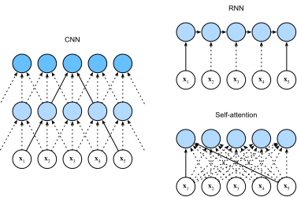

# Tự ghi nhận và mã hóa vị trí
:label:`sec_self-attention-and-positional-encoding`

In deep learning,
we often use CNNs or RNNs to encode a sequence.
Now with attention mechanisms,
imagine that we feed a sequence of tokens
into attention pooling
so that
the same set of tokens
act as queries, keys, and values.
Specifically,
each query attends to all the key-value pairs
and generates one attention output.
Since the queries, keys, and values
come from the same place,
this performs
In this section,
we will discuss sequence encoding using self-attention,
including using additional information for the sequence order.

```{.python .input}
from d2l import mxnet as d2l
import math
from mxnet import autograd, np, npx
from mxnet.gluon import nn
npx.set_np()
```

```{.python .input}
#@tab pytorch
from d2l import torch as d2l
import math
import torch
from torch import nn
```

```{.python .input}
#@tab tensorflow
from d2l import tensorflow as d2l
import numpy as np
import tensorflow as tf
```

## [**Self-Attention**]

Given a sequence of input tokens
$\mathbf{x}_1, \ldots, \mathbf{x}_n$ where any $\mathbf{x}_i \in \mathbb{R}^d$ ($1 \leq i \leq n$),
its self-attention outputs
a sequence of the same length
$\mathbf{y}_1, \ldots, \mathbf{y}_n$,
where

$$\mathbf{y}_i = f(\mathbf{x}_i, (\mathbf{x}_1, \mathbf{x}_1), \ldots, (\mathbf{x}_n, \mathbf{x}_n)) \in \mathbb{R}^d$$

according to the definition of attention pooling $f$ in
:eqref:`eq_attn-pooling`.
Using multi-head attention,
the following code snippet
computes the self-attention of a tensor
with shape (batch size, number of time steps or sequence length in tokens, $d$).
The output tensor has the same shape.

```{.python .input}
num_hiddens, num_heads = 100, 5
attention = d2l.MultiHeadAttention(num_hiddens, num_heads, 0.5)
attention.initialize()
```

```{.python .input}
#@tab pytorch
num_hiddens, num_heads = 100, 5
attention = d2l.MultiHeadAttention(num_hiddens, num_hiddens, num_hiddens,
                                   num_hiddens, num_heads, 0.5)
attention.eval()
```

```{.python .input}
#@tab tensorflow
num_hiddens, num_heads = 100, 5
attention = d2l.MultiHeadAttention(num_hiddens, num_hiddens, num_hiddens,
                                   num_hiddens, num_heads, 0.5)
```

```{.python .input}
#@tab mxnet, pytorch
batch_size, num_queries, valid_lens = 2, 4, d2l.tensor([3, 2])
X = d2l.ones((batch_size, num_queries, num_hiddens))
attention(X, X, X, valid_lens).shape
```

```{.python .input}
#@tab tensorflow
batch_size, num_queries, valid_lens = 2, 4, tf.constant([3, 2])
X = tf.ones((batch_size, num_queries, num_hiddens))
attention(X, X, X, valid_lens, training=False).shape
```

## So sánh CNN s, RNNs, và Self-Attention
:label:`subsec_cnn-rnn-self-attention`

Chúng ta hãy so sánh các kiến trúc để lập bản đồ một chuỗi các mã thông báo $n$ với một chuỗi khác có độ dài bằng nhau, trong đó mỗi mã thông báo đầu vào hoặc đầu ra được thể hiện bằng một vector $d$ chiều. Cụ thể, chúng tôi sẽ xem xét CNN, RNN và sự tự chú ý. Chúng tôi sẽ so sánh độ phức tạp tính toán, các hoạt động tuần tự và độ dài đường dẫn tối đa của chúng. Lưu ý rằng các phép toán tuần tự ngăn chặn tính toán song song, trong khi một đường dẫn ngắn hơn giữa bất kỳ tổ hợp các vị trí trình tự làm cho việc tìm hiểu các phụ thuộc tầm xa trong chuỗi :cite:`Hochreiter.Bengio.Frasconi.ea.2001` dễ dàng hơn. 


:label:`fig_cnn-rnn-self-attention`

Hãy xem xét một lớp phức tạp có kích thước hạt nhân là $k$. Chúng tôi sẽ cung cấp thêm chi tiết về xử lý trình tự sử dụng CNN trong các chương sau. Hiện tại, chúng ta chỉ cần biết rằng vì độ dài chuỗi là $n$, số lượng kênh đầu vào và đầu ra đều là $d$, độ phức tạp tính toán của lớp tích hợp là $\mathcal{O}(knd^2)$. Như :numref:`fig_cnn-rnn-self-attention` cho thấy, CNN có thứ bậc nên có $\mathcal{O}(1)$ phép toán tuần tự và độ dài đường dẫn tối đa là $\mathcal{O}(n/k)$. Ví dụ, $\mathbf{x}_1$ và $\mathbf{x}_5$ nằm trong trường tiếp nhận của CNN hai lớp với kích thước hạt nhân 3 trong :numref:`fig_cnn-rnn-self-attention`. 

Khi cập nhật trạng thái ẩn của RNNs, phép nhân của ma trận trọng lượng $d \times d$ và trạng thái ẩn $d$ chiều có độ phức tạp tính toán là $\mathcal{O}(d^2)$. Do độ dài trình tự là $n$, độ phức tạp tính toán của lớp tái phát là $\mathcal{O}(nd^2)$. Theo :numref:`fig_cnn-rnn-self-attention`, có $\mathcal{O}(n)$ phép toán tuần tự không thể song song và độ dài đường tối đa cũng là $\mathcal{O}(n)$. 

Trong sự tự chú ý, các truy vấn, khóa và giá trị đều là $n \times d$ ma trận. Hãy xem xét sự chú ý của sản phẩm điểm thu nhỏ trong :eqref:`eq_softmax_QK_V`, trong đó ma trận $n \times d$ được nhân với ma trận $d \times n$, sau đó ma trận $n \times n$ đầu ra được nhân với ma trận $n \times d$. Kết quả là, sự tự chú ý có độ phức tạp tính toán $\mathcal{O}(n^2d)$. Như chúng ta có thể thấy trong :numref:`fig_cnn-rnn-self-attention`, mỗi token được kết nối trực tiếp với bất kỳ mã thông báo nào khác thông qua sự tự chú ý. Do đó, tính toán có thể song song với $\mathcal{O}(1)$ phép toán tuần tự và độ dài đường tối đa cũng là $\mathcal{O}(1)$. 

Nói chung, cả CNN và sự tự chú ý đều được hưởng tính toán song song và sự tự chú ý có độ dài đường tối đa ngắn nhất. Tuy nhiên, độ phức tạp tính toán bậc hai đối với độ dài trình tự làm cho sự tự chú ý rất chậm đối với các trình tự rất dài. 

## [**Mã hóa vị trí**]
:label:`subsec_positional-encoding`

Unlike RNNs that recurrently process
tokens of a sequence one by one,
self-attention ditches
sequential operations in favor of 
parallel computation.
To use the sequence order information,
we can inject
absolute or relative
positional information
by adding *positional encoding*
to the input representations.
Positional encodings can be 
either learned or fixed.
In the following, 
we describe a fixed positional encoding
based on sine and cosine functions :cite:`Vaswani.Shazeer.Parmar.ea.2017`.

Suppose that
the input representation $\mathbf{X} \in \mathbb{R}^{n \times d}$ contains the $d$-dimensional embeddings for $n$ tokens of a sequence.
The positional encoding outputs
$\mathbf{X} + \mathbf{P}$
using a positional embedding matrix $\mathbf{P} \in \mathbb{R}^{n \times d}$ of the same shape,
whose element on the $i^\mathrm{th}$ row 
and the $(2j)^\mathrm{th}$
or the $(2j + 1)^\mathrm{th}$ column is

$$\begin{aligned} p_{i, 2j} &= \sin\left(\frac{i}{10000^{2j/d}}\right),\\p_{i, 2j+1} &= \cos\left(\frac{i}{10000^{2j/d}}\right).\end{aligned}$$
:eqlabel:`eq_positional-encoding-def`

At first glance,
this trigonometric-function
design looks weird.
Before explanations of this design,
let us first implement it in the following `PositionalEncoding` class.

```{.python .input}
#@save
class PositionalEncoding(nn.Block):
    """Positional encoding."""
    def __init__(self, num_hiddens, dropout, max_len=1000):
        super(PositionalEncoding, self).__init__()
        self.dropout = nn.Dropout(dropout)
        # Create a long enough `P`
        self.P = d2l.zeros((1, max_len, num_hiddens))
        X = d2l.arange(max_len).reshape(-1, 1) / np.power(
            10000, np.arange(0, num_hiddens, 2) / num_hiddens)
        self.P[:, :, 0::2] = np.sin(X)
        self.P[:, :, 1::2] = np.cos(X)

    def forward(self, X):
        X = X + self.P[:, :X.shape[1], :].as_in_ctx(X.ctx)
        return self.dropout(X)
```

```{.python .input}
#@tab pytorch
#@save
class PositionalEncoding(nn.Module):
    """Positional encoding."""
    def __init__(self, num_hiddens, dropout, max_len=1000):
        super(PositionalEncoding, self).__init__()
        self.dropout = nn.Dropout(dropout)
        # Create a long enough `P`
        self.P = d2l.zeros((1, max_len, num_hiddens))
        X = d2l.arange(max_len, dtype=torch.float32).reshape(
            -1, 1) / torch.pow(10000, torch.arange(
            0, num_hiddens, 2, dtype=torch.float32) / num_hiddens)
        self.P[:, :, 0::2] = torch.sin(X)
        self.P[:, :, 1::2] = torch.cos(X)

    def forward(self, X):
        X = X + self.P[:, :X.shape[1], :].to(X.device)
        return self.dropout(X)
```

```{.python .input}
#@tab tensorflow
#@save
class PositionalEncoding(tf.keras.layers.Layer):
    """Positional encoding."""
    def __init__(self, num_hiddens, dropout, max_len=1000):
        super().__init__()
        self.dropout = tf.keras.layers.Dropout(dropout)
        # Create a long enough `P`
        self.P = np.zeros((1, max_len, num_hiddens))
        X = np.arange(max_len, dtype=np.float32).reshape(
            -1,1)/np.power(10000, np.arange(
            0, num_hiddens, 2, dtype=np.float32) / num_hiddens)
        self.P[:, :, 0::2] = np.sin(X)
        self.P[:, :, 1::2] = np.cos(X)
        
    def call(self, X, **kwargs):
        X = X + self.P[:, :X.shape[1], :]
        return self.dropout(X, **kwargs)
```

In the positional embedding matrix $\mathbf{P}$,
[**rows correspond to positions within a sequence
and columns represent different positional encoding dimensions**].
In the example below,
we can see that
the $6^{\mathrm{th}}$ and the $7^{\mathrm{th}}$
columns of the positional embedding matrix 
have a higher frequency than 
the $8^{\mathrm{th}}$ and the $9^{\mathrm{th}}$
columns.
The offset between 
the $6^{\mathrm{th}}$ and the $7^{\mathrm{th}}$ (same for the $8^{\mathrm{th}}$ and the $9^{\mathrm{th}}$) columns
is due to the alternation of sine and cosine functions.

```{.python .input}
encoding_dim, num_steps = 32, 60
pos_encoding = PositionalEncoding(encoding_dim, 0)
pos_encoding.initialize()
X = pos_encoding(np.zeros((1, num_steps, encoding_dim)))
P = pos_encoding.P[:, :X.shape[1], :]
d2l.plot(d2l.arange(num_steps), P[0, :, 6:10].T, xlabel='Row (position)',
         figsize=(6, 2.5), legend=["Col %d" % d for d in d2l.arange(6, 10)])
```

```{.python .input}
#@tab pytorch
encoding_dim, num_steps = 32, 60
pos_encoding = PositionalEncoding(encoding_dim, 0)
pos_encoding.eval()
X = pos_encoding(d2l.zeros((1, num_steps, encoding_dim)))
P = pos_encoding.P[:, :X.shape[1], :]
d2l.plot(d2l.arange(num_steps), P[0, :, 6:10].T, xlabel='Row (position)',
         figsize=(6, 2.5), legend=["Col %d" % d for d in d2l.arange(6, 10)])
```

```{.python .input}
#@tab tensorflow
encoding_dim, num_steps = 32, 60
pos_encoding = PositionalEncoding(encoding_dim, 0)
X = pos_encoding(tf.zeros((1, num_steps, encoding_dim)), training=False)
P = pos_encoding.P[:, :X.shape[1], :]
d2l.plot(np.arange(num_steps), P[0, :, 6:10].T, xlabel='Row (position)',
         figsize=(6, 2.5), legend=["Col %d" % d for d in np.arange(6, 10)])
```

### Absolute Positional Information

Để xem tần số giảm đơn điệu dọc theo kích thước mã hóa liên quan đến thông tin vị trí tuyệt đối như thế nào, chúng ta hãy in ra [** đại diện nhị phân **] của $0, 1, \ldots, 7$. Như chúng ta có thể thấy, bit thấp nhất, bit thấp thứ hai và bit thấp nhất thứ ba thay thế trên mỗi số, mỗi hai số và mỗi bốn số, tương ứng.

```{.python .input}
#@tab all
for i in range(8):
    print(f'{i} in binary is {i:>03b}')
```

Trong biểu diễn nhị phân, một bit cao hơn có tần số thấp hơn một bit thấp hơn. Tương tự, như đã thể hiện trong bản đồ nhiệt bên dưới, [** mã hóa vị trí làm giảm tần số dọc theo kích thước mã hóa**] bằng cách sử dụng các hàm lượng giác. Vì các đầu ra là số float, các biểu diễn liên tục như vậy có hiệu quả không gian hơn so với biểu diễn nhị phân.

```{.python .input}
P = np.expand_dims(np.expand_dims(P[0, :, :], 0), 0)
d2l.show_heatmaps(P, xlabel='Column (encoding dimension)',
                  ylabel='Row (position)', figsize=(3.5, 4), cmap='Blues')
```

```{.python .input}
#@tab pytorch
P = P[0, :, :].unsqueeze(0).unsqueeze(0)
d2l.show_heatmaps(P, xlabel='Column (encoding dimension)',
                  ylabel='Row (position)', figsize=(3.5, 4), cmap='Blues')
```

```{.python .input}
#@tab tensorflow
P = tf.expand_dims(tf.expand_dims(P[0, :, :], axis=0), axis=0)
d2l.show_heatmaps(P, xlabel='Column (encoding dimension)',
                  ylabel='Row (position)', figsize=(3.5, 4), cmap='Blues')
```

### Relative Positional Information

Besides capturing absolute positional information,
the above positional encoding
also allows
a model to easily learn to attend by relative positions.
This is because
for any fixed position offset $\delta$,
the positional encoding at position $i + \delta$
can be represented by a linear projection
of that at position $i$.


This projection can be explained
mathematically.
Denoting
$\omega_j = 1/10000^{2j/d}$,
any pair of $(p_{i, 2j}, p_{i, 2j+1})$ 
in :eqref:`eq_positional-encoding-def`
can 
be linearly projected to $(p_{i+\delta, 2j}, p_{i+\delta, 2j+1})$
for any fixed offset $\delta$:

$$\begin{aligned}
&\begin{bmatrix} \cos(\delta \omega_j) & \sin(\delta \omega_j) \\  -\sin(\delta \omega_j) & \cos(\delta \omega_j) \\ \end{bmatrix}
\begin{bmatrix} p_{i, 2j} \\  p_{i, 2j+1} \\ \end{bmatrix}\\
=&\begin{bmatrix} \cos(\delta \omega_j) \sin(i \omega_j) + \sin(\delta \omega_j) \cos(i \omega_j) \\  -\sin(\delta \omega_j) \sin(i \omega_j) + \cos(\delta \omega_j) \cos(i \omega_j) \\ \end{bmatrix}\\
=&\begin{bmatrix} \sin\left((i+\delta) \omega_j\right) \\  \cos\left((i+\delta) \omega_j\right) \\ \end{bmatrix}\\
=& 
\begin{bmatrix} p_{i+\delta, 2j} \\  p_{i+\delta, 2j+1} \\ \end{bmatrix},
\end{aligned}$$

where the $2\times 2$ projection matrix does not depend on any position index $i$.

## Tóm tắt

* Trong sự tự chú ý, các truy vấn, khóa và giá trị đều đến từ cùng một nơi.
* Cả CNN và sự tự chú ý đều được hưởng tính toán song song và sự tự chú ý có độ dài đường tối đa ngắn nhất. Tuy nhiên, độ phức tạp tính toán bậc hai đối với độ dài trình tự làm cho sự tự chú ý rất chậm đối với các trình tự rất dài.
* Để sử dụng thông tin thứ tự trình tự, chúng ta có thể tiêm thông tin vị trí tuyệt đối hoặc tương đối bằng cách thêm mã hóa vị trí vào biểu diễn đầu vào.

## Bài tập

1. Giả sử rằng chúng ta thiết kế một kiến trúc sâu để đại diện cho một chuỗi bằng cách xếp chồng các lớp tự chú ý với mã hóa vị trí. Những gì có thể là vấn đề?
1. Bạn có thể thiết kế một phương pháp mã hóa vị trí có thể học được không?

:begin_tab:`mxnet`
[Discussions](https://discuss.d2l.ai/t/1651)
:end_tab:

:begin_tab:`pytorch`
[Discussions](https://discuss.d2l.ai/t/1652)
:end_tab:
