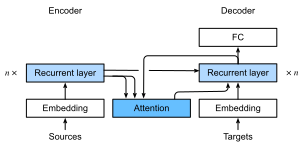

<!-- ===================== Bắt đầu dịch Phần 1 ==================== -->
<!-- ========================================= REVISE - BẮT ĐẦU =================================== -->

<!--
# Sequence to Sequence with Attention Mechanisms
-->

# Chuỗi sang Chuỗi áp dụng Cơ chế Tập trung
:label:`sec_seq2seq_attention`

<!--
In this section, we add the attention mechanism to the sequence to sequence (seq2seq) model as introduced in :numref:`sec_seq2seq` to explicitly aggregate states with weights.
:numref:`fig_s2s_attention` shows the model architecture for encoding and decoding at the timestep $t$.
Here, the memory of the attention layer consists of all the information that the encoder has seen---the encoder output at each timestep.
During the decoding, the decoder output from the previous timestep $t-1$ is used as the query.
The output of the attention model is viewed as the context information, and such context is concatenated with the decoder input $D_t$.
Finally, we feed the concatenation into the decoder.
-->

Trong phần này, chúng ta thêm cơ chế tập trung vào mô hình chuỗi sang chuỗi (seq2seq) giới thiệu trong :numref:`sec_seq2seq` để gộp các trạng thái theo trọng số tương ứng một cách tường minh.
:numref:`fig_s2s_attention` mô tả kiến trúc mô hình thực hiện mã hóa và giải mã tại bước thời gian $t$.
Bộ nhớ của tầng tập trung ở đây bao gồm tất cả thông tin mà bộ mã hóa đã được học---đầu ra của bộ mã hóa tại từng bước thời gian.
Trong quá trình giải mã, đầu ra của bộ giải mã tại bước thời gian trước đó $t-1$ được sử dụng làm câu truy vấn.
Đầu ra của mô hình tập trung có thể được hiểu là thông tin ngữ cảnh của chuỗi, phần ngữ cảnh này được ghép nối với đầu vào của bộ giải mã $D_t$ và kết quả được đưa vào bộ giải mã.

<!--

-->


:label:`fig_s2s_attention`


<!--
To illustrate the overall architecture of seq2seq with attention model, the layer structure of its encoder and decoder is shown in :numref:`fig_s2s_attention_details`.
-->

Để minh họa kiến trúc tổng thể của mô hình seq2seq áp dụng cơ chế tập trung, cấu trúc tầng của bộ mã hóa và bộ giải mã được mô tả trong :numref:`fig_s2s_attention_details`.

<!--

-->


:label:`fig_s2s_attention_details`


```{.python .input  n=1}
from d2l import mxnet as d2l
from mxnet import np, npx
from mxnet.gluon import rnn, nn
npx.set_np()
```

<!-- ===================== Kết thúc dịch Phần 1 ===================== -->

<!-- ===================== Bắt đầu dịch Phần 2 ===================== -->

<!--
## Decoder
-->

## Bộ Giải mã

<!--
Since the encoder of seq2seq with attention mechanisms is the same as `Seq2SeqEncoder` in :numref:`sec_seq2seq`, we will just focus on the decoder.
We add an MLP attention layer (`MLPAttention`) which has the same hidden size as the LSTM layer in the decoder.
Then we initialize the state of the decoder by passing three items from the encoder:
-->

Do bộ mã hóa của mô hình seq2seq áp dụng cơ chế tập trung giống với bộ mã hóa của `Seq2SeqEncoder` trong :numref:`sec_seq2seq` nên ở phần này, chúng ta sẽ chỉ tập trung vào bộ giải mã.
Ta thêm tầng tập trung MLP (`MLPAttention`) có cùng kích thước ẩn với tầng LSTM trong bộ giải mã. 
Sau đó ta khởi tạo trạng thái của bộ giải mã bằng cách truyền vào ba đầu ra thu được từ bộ mã hóa:

<!--
- **the encoder outputs of all timesteps**: they are used as the attention layer's memory with identical keys and values;
-->

- **Đầu ra của bộ mã hóa tại tất cả các bước thời gian**: được sử dụng như bộ nhớ của tầng tập trung có cùng các khóa và giá trị;

<!--
- **the hidden state of the encoder's final timestep**: it is used as the initial decoder's hidden state;
-->

- **Trạng thái ẩn của bộ mã hóa tại bước thời gian cuối cùng**: được sử dụng làm trạng thái ẩn ban đầu của bộ giải mã;

<!--
- **the encoder valid length**: so the attention layer will not consider the padding tokens with in the encoder outputs.
-->

- **Độ dài hợp lệ của bộ mã hóa**: để tầng tập trung có thể bỏ qua những token đệm có trong đầu ra của bộ mã hóa.

<!--
At each timestep of the decoding, we use the output of the decoder's last RNN layer as the query for the attention layer.
The attention model's output is then concatenated with the input embedding vector to feed into the RNN layer.
Although the RNN layer hidden state also contains history information from decoder,
the attention output explicitly selects the encoder outputs based on `enc_valid_len`, so that the attention output suspends other irrelevant information.
-->

Ở mỗi bước thời gian trong quá trình giải mã, ta sử dụng trạng thái ẩn của tầng RNN cuối cùng làm câu truy vấn cho tầng tập trung.
Đầu ra của mô hình tập trung sau đó được ghép nối với vector embedding đầu vào để đưa vào tầng RNN. 
Mặc dù trạng thái ẩn của tầng RNN cũng chứa thông tin từ bộ giải mã ở các bước thời gian trước đó nhưng đầu ra của tầng tập trung sẽ lựa chọn các đầu ra của bộ mã hóa một cách tường minh dựa vào `enc_valid_len`nhằm loại bỏ những thông tin không liên quan.

<!--
Let us implement the `Seq2SeqAttentionDecoder`, and see how it differs from the decoder in seq2seq from :numref:`sec_seq2seq_decoder`.
-->

Hãy cùng lập trình bộ giải mã `Seq2SeqAttentionDecoder` và xem xét sự khác biệt của nó so với bộ giải mã trong mô hình seq2seq ở :numref:`sec_seq2seq_decoder`.


```{.python .input  n=2}
class Seq2SeqAttentionDecoder(d2l.Decoder):
    def __init__(self, vocab_size, embed_size, num_hiddens, num_layers,
                 dropout=0, **kwargs):
        super(Seq2SeqAttentionDecoder, self).__init__(**kwargs)
        self.attention_cell = d2l.MLPAttention(num_hiddens, dropout)
        self.embedding = nn.Embedding(vocab_size, embed_size)
        self.rnn = rnn.LSTM(num_hiddens, num_layers, dropout=dropout)
        self.dense = nn.Dense(vocab_size, flatten=False)

    def init_state(self, enc_outputs, enc_valid_len, *args):
        outputs, hidden_state = enc_outputs
        # Transpose outputs to (batch_size, seq_len, num_hiddens)
        return (outputs.swapaxes(0, 1), hidden_state, enc_valid_len)

    def forward(self, X, state):
        enc_outputs, hidden_state, enc_valid_len = state
        X = self.embedding(X).swapaxes(0, 1)
        outputs = []
        for x in X:
            # query shape: (batch_size, 1, num_hiddens)
            query = np.expand_dims(hidden_state[0][-1], axis=1)
            # context has same shape as query
            context = self.attention_cell(
                query, enc_outputs, enc_outputs, enc_valid_len)
            # Concatenate on the feature dimension
            x = np.concatenate((context, np.expand_dims(x, axis=1)), axis=-1)
            # Reshape x to (1, batch_size, embed_size + num_hiddens)
            out, hidden_state = self.rnn(x.swapaxes(0, 1), hidden_state)
            outputs.append(out)
        outputs = self.dense(np.concatenate(outputs, axis=0))
        return outputs.swapaxes(0, 1), [enc_outputs, hidden_state,
                                        enc_valid_len]
```

<!--
Now we can test the seq2seq with attention model.
To be consistent with the model without attention in :numref:`sec_seq2seq`, we use the same hyper-parameters for `vocab_size`, `embed_size`, `num_hiddens`, and `num_layers`.
As a result, we get the same decoder output shape, but the state structure is changed.
-->

Giờ ta có thể chạy thử mô hình seq2seq áp dụng cơ chế tập trung.
Để nhất quán khi so sánh với mô hình không áp dụng cơ chế tập trung trong :numref:`sec_seq2seq`, những siêu tham số `vocab_size`, `embed_size`, `num_hiddens`, và `num_layers` sẽ được giữ nguyên.
Kết quả, ta thu được đầu ra của bộ giải mã có cùng kích thước nhưng khác về cấu trúc trạng thái.


```{.python .input  n=3}
encoder = d2l.Seq2SeqEncoder(vocab_size=10, embed_size=8,
                             num_hiddens=16, num_layers=2)
encoder.initialize()
decoder = Seq2SeqAttentionDecoder(vocab_size=10, embed_size=8,
                                  num_hiddens=16, num_layers=2)
decoder.initialize()
X = np.zeros((4, 7))
state = decoder.init_state(encoder(X), None)
out, state = decoder(X, state)
out.shape, len(state), state[0].shape, len(state[1]), state[1][0].shape
```

<!-- ===================== Kết thúc dịch Phần 2 ===================== -->

<!-- ===================== Bắt đầu dịch Phần 3 ===================== -->

<!--
## Training
-->

## Huấn luyện

<!--
Similar to :numref:`sec_seq2seq_training`, we try a toy model by applying the same training hyperparameters and the same training loss.
As we can see from the result, since the sequences in the training dataset are relative short, the additional attention layer does not lead to a significant improvement.
Due to the computational overhead of both the encoder's and the decoder's attention layers, this model is much slower than the seq2seq model without attention.
-->

Chúng ta hãy xây dựng một mô hình đơn giản sử dụng cùng một bộ siêu tham số và hàm mất mát để huấn luyện như :numref:`sec_seq2seq_training`.
Từ kết quả, ta thấy tầng tập trung được thêm vào mô hình không tạo ra cải thiện đáng kể nào do các chuỗi trong tập huấn luyện khá ngắn.
Bởi chi phí tính toán tốn thêm từ các tầng tập trung trong bộ mã hóa và bộ giải mã, mô hình này họat động chậm hơn nhiều so với mô hình seq2seq không áp dụng tập trung.


```{.python .input  n=5}
embed_size, num_hiddens, num_layers, dropout = 32, 32, 2, 0.0
batch_size, num_steps = 64, 10
lr, num_epochs, ctx = 0.005, 200, d2l.try_gpu()

src_vocab, tgt_vocab, train_iter = d2l.load_data_nmt(batch_size, num_steps)
encoder = d2l.Seq2SeqEncoder(
    len(src_vocab), embed_size, num_hiddens, num_layers, dropout)
decoder = Seq2SeqAttentionDecoder(
    len(tgt_vocab), embed_size, num_hiddens, num_layers, dropout)
model = d2l.EncoderDecoder(encoder, decoder)
d2l.train_s2s_ch9(model, train_iter, lr, num_epochs, ctx)
```

<!--
Last, we predict several sample examples.
-->

Cuối cùng, ta hãy thử dự đoán một vài mẫu dưới đây.


```{.python .input  n=6}
for sentence in ['Go .', 'Wow !', "I'm OK .", 'I won !']:
    print(sentence + ' => ' + d2l.predict_s2s_ch9(
        model, sentence, src_vocab, tgt_vocab, num_steps, ctx))
```

<!--
## Summary
-->

## Tóm tắt

<!--
* The seq2seq model with attention adds an additional attention layer to the model without attention.
* The decoder of the seq2seq with attention model passes three items from the encoder: the encoder outputs of all timesteps, the hidden state of the encoder's final timestep, and the encoder valid length.
-->

* Mô hình seq2seq áp dụng cơ chế tập trung thêm một tầng tập trung vào mô hình seq2seq ban đầu.
* Bộ giải mã của mô hình seq2seq áp dụng cơ chế tập trung được truyền vào ba đầu ra từ bộ mã hóa: đầu ra của bộ mã hóa tại tất cả các bước thời gian, trạng thái ẩn của bộ mã hóa tại bước thời gian cuối cùng, độ dài hợp lệ của bộ mã hóa.

<!--
## Exercises
-->

## Bài tập

<!--
1. Compare `Seq2SeqAttentionDecoder` and `Seq2seqDecoder` by using the same parameters and checking their losses.
2. Can you think of any use cases where `Seq2SeqAttentionDecoder` will outperform `Seq2seqDecoder`?
-->

1. So sánh `Seq2SeqAttentionDecoder` và `Seq2seqDecoder` bằng cách sử dụng cùng bộ tham số và kiểm tra giá trị hàm mất mát.
2. Bạn hãy thử suy nghĩ liệu có trường hợp nào mà `Seq2SeqAttentionDecoder` vượt trội hơn `Seq2seqDecoder`?

<!-- ===================== Kết thúc dịch Phần 3 ===================== -->
<!-- ========================================= REVISE - KẾT THÚC =================================== -->


## Thảo luận
* [Tiếng Anh](https://discuss.mxnet.io/t/4345)
* [Tiếng Việt](https://forum.machinelearningcoban.com/c/d2l)

## Những người thực hiện
Bản dịch trong trang này được thực hiện bởi:

* Đoàn Võ Duy Thanh
* Đỗ Trường Giang
* Nguyễn Văn Quang
* Nguyễn Văn Cường
* Lê Khắc Hồng Phúc
* Phạm Hồng Vinh
