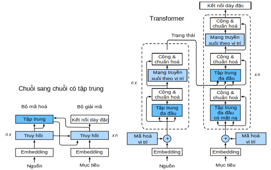
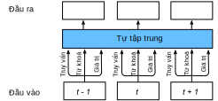
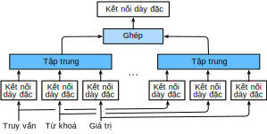
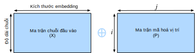
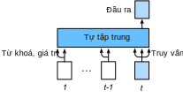

<!-- ===================== Bắt đầu dịch Phần 1 ==================== -->
<!-- ========================================= REVISE PHẦN 1 - BẮT ĐẦU =================================== -->

<!--
# Transformer
-->

# Kiến trúc Transformer
:label:`sec_transformer`

<!--
In previous chapters, we have covered major neural network architectures such as convolution neural networks (CNNs) and  recurrent neural networks (RNNs).
Let us recap their pros and cons:
-->

Trong các chương trước, ta đã đề cập đến các kiến trúc mạng nơ-ron quan trọng như mạng nơ-ron tích chập (CNN) và mạng nơ-ron hồi tiếp (RNN).
Ưu nhược điểm của hai kiến trúc mạng này có thể được tóm tắt như sau:

<!--
* **CNNs** are easy to parallelize at a layer but cannot capture the variable-length sequential dependency very well.
-->

* Các mạng **CNN** có thể dễ dàng được thực hiện song song ở một tầng nhưng không có khả năng nắm bắt các phụ thuộc chuỗi có độ dài biến thiên.

<!--
* **RNNs** are able to capture the long-range, variable-length sequential information, but suffer from inability to parallelize within a sequence.
-->

*  Các mạng **RNN** có khả năng nắm bắt các thông tin cách xa nhau trong chuỗi có độ dài biến thiên, nhưng không thể thực hiện song song trong một chuỗi.

<!--
To combine the advantages from both CNNs and RNNs, :cite:`Vaswani.Shazeer.Parmar.ea.2017` designed a novel architecture using the attention mechanism.
This architecture, which is called as *Transformer*, achieves parallelization by capturing recurrence sequence with attention and at the same time encodes each item's position in the sequence.
As a result, Transformer leads to a compatible model with significantly shorter training time.
-->

Để kết hợp các ưu điểm của CNN và RNN, :cite:`Vaswani.Shazeer.Parmar.ea.2017` đã thiết kế một kiến trúc mới bằng cách sử dụng cơ chế tập trung.
Kiến trúc này gọi là *Transformer*, song song hóa bằng cách học chuỗi hồi tiếp với cơ chế tập trung, đồng thời mã hóa vị trí của từng phần tử trong chuỗi.
Kết quả là ta có một mô hình tương thích với thời gian huấn luyện ngắn hơn đáng kể.

<!--
Similar to the seq2seq model in :numref:`sec_seq2seq`, Transformer is also based on the encoder-decoder architecture.
However, Transformer differs to the former by replacing the recurrent layers in seq2seq with *multi-head attention* layers, 
incorporating the position-wise information through *position encoding*, and applying *layer normalization*.
We  compare Transformer and seq2seq  side-by-side in :numref:`fig_transformer`.
-->

Tương tự như mô hình seq2seq trong :numref:`sec_seq2seq`, Transformer cũng dựa trên kiến trúc mã hóa-giải mã.
Tuy nhiên, nó thay thế các tầng hồi tiếp trong seq2seq bằng các tầng *tập trung đa đầu* (*multi-head attention*), kết hợp thông tin vị trí thông qua *biểu diễn vị trí* (*positional encoding*) và áp dụng *chuẩn hóa tầng* (*layer normalization*).
:numref:`fig_transformer` sẽ so sánh cấu trúc của Transformer và seq2seq.

<!--
Overall, these two models are similar to each other: the source sequence embeddings are fed into $n$ repeated blocks.
The outputs of the last block are then used as attention memory for the decoder.
The target sequence embeddings are similarly fed into $n$ repeated blocks in the decoder, and the final outputs are obtained by applying a dense layer with vocabulary size to the last block's outputs.
-->

Nhìn chung, hai mô hình này khá giống nhau: các embedding của chuỗi nguồn được đưa vào $n$ khối lặp lại.
Đầu ra của khối mã hóa cuối cùng sau đó được sử dụng làm bộ nhớ tập trung cho bộ giải mã.
Tương tự, các embedding của chuỗi đích được đưa vào $n$ khối lặp lại trong bộ giải mã. 
Ta thu được đầu ra cuối cùng bằng cách áp dụng một tầng dày đặc có kích thước bằng kích thước bộ từ vựng lên các đầu ra của khối giải mã cuối cùng.

<!--

-->


:width:`500px`
:label:`fig_transformer`

<!-- ===================== Kết thúc dịch Phần 1 ===================== -->

<!-- ===================== Bắt đầu dịch Phần 2 ===================== -->


<!--
On the flip side, Transformer differs from the seq2seq with attention model in the following:
-->

Mặt khác, Transformer khác với mô hình seq2seq sử dụng cơ chế tập trung như sau:

<!--
1. **Transformer block**: a recurrent layer in seq2seq is replaced by a *Transformer block*. 
This block contains a *multi-head attention* layer and a network with two *position-wise feed-forward network* layers for the encoder. 
For the decoder, another multi-head attention layer is used to take the encoder state.
2. **Add and norm**: the inputs and outputs of both the multi-head attention layer or the position-wise feed-forward network, 
are processed by two "add and norm" layer that contains a residual structure and a *layer normalization* layer.
3. **Position encoding**: since the self-attention layer does not distinguish the item order in a sequence, a positional encoding layer is used to add sequential information into each sequence item.
-->

1. **Khối Transformer**: một tầng hồi tiếp trong seq2seq được thay bằng một *Khối Transformer*.
Với bộ mã hóa, khối này chứa một tầng *tập trung đa đầu* và một *mạng truyền xuôi theo vị trí* (*position-wise feed-forward network*) gồm hai tầng dày đặc.
Đối với bộ giải mã, khối này có thêm một tầng tập trung đa đầu khác để nhận vào trạng thái bộ mã hóa.
2. **Cộng và chuẩn hóa**: đầu vào và đầu ra của cả tầng tập trung đa đầu hoặc mạng truyền xuôi theo vị trí được xử lý bởi hai tầng "cộng và chuẩn hóa" bao gồm cấu trúc phần dư và tầng *chuẩn hóa theo tầng* (*layer normalization*).
3. **Biễu diễn vị trí**: do tầng tự tập trung không phân biệt thứ tự phần tử trong một chuỗi, nên tầng biễu diễn vị trí được sử dụng để thêm thông tin vị trí vào từng phần tử trong chuỗi.


<!--
In the rest of this section, we will equip you with each new component introduced by Transformer, and get you up and running to construct a machine translation model.
-->

Tiếp theo, chúng ta sẽ tìm hiểu từng thành phần trong Transformer để có thể xây dựng một mô hình dịch máy.

```{.python .input  n=1}
from d2l import mxnet as d2l
import math
from mxnet import autograd, np, npx
from mxnet.gluon import nn
npx.set_np()
```

<!--
## Multi-Head Attention
-->

## Tập trung Đa đầu

<!--
Before the discussion of the *multi-head attention* layer, let us quick express the *self-attention* architecture.
The self-attention model is a normal attention model, with its query, its key, and its value being copied exactly the same from each item of the sequential inputs.
As we illustrate in :numref:`fig_self_attention`, self-attention outputs a same-length sequential output for each input item.
Compared with a recurrent layer, output items of a self-attention layer can be computed in parallel and, therefore, it is easy to obtain a highly-efficient implementation.
-->

Trước khi thảo luận về tầng *tập trung đa đầu*, hãy cùng tìm hiểu qua về kiến trúc *tự tập trung*.
Giống như các mô hình tập trung bình thường, mô hình tự tập trung cũng có câu truy vấn, khóa và giá trị nhưng chúng được sao chép từ các phần tử trong chuỗi đầu vào.
Như minh họa trong :numref:`fig_self_attention`, tầng tự tập trung trả về một đầu ra tuần tự có cùng độ dài với đầu vào.
So với tầng hồi tiếp, các phần tử đầu ra của tầng tự tập trung có thể được tính toán song song, do đó việc xây dựng các đoạn mã tốc độ cao khá dễ dàng.

<!--

-->


:label:`fig_self_attention`


<!--
The *multi-head attention* layer consists of $h$ parallel self-attention layers, each one is called a *head*.
For each head, before feeding into the attention layer, we project the queries, keys, and values with three dense layers with hidden sizes $p_q$, $p_k$, and $p_v$, respectively.
The outputs of these $h$ attention heads are concatenated and then processed by a final dense layer.
-->

Tầng *tập trung đa đầu* bao gồm $h$ *đầu* là các tầng tự tập trung song song.
Trước khi đưa vào mỗi đầu, ta chiếu các câu truy vấn, khóa và giá trị qua ba tầng dày đặc với kích thước ẩn lần lượt là $p_q$, $p_k$ và $p_v$.
Đầu ra của $h$ đầu này được nối lại và sau đó được xử lý bởi một tầng dày đặc cuối cùng.


<!--

-->


<!-- ===================== Kết thúc dịch Phần 2 ===================== -->

<!-- ===================== Bắt đầu dịch Phần 3 ===================== -->

<!--
Assume that the dimension for a query, a key, and a value are $d_q$, $d_k$, and $d_v$, respectively.
Then, for each head $i=1,\ldots, h$, we can train learnable parameters
$\mathbf W_q^{(i)}\in\mathbb R^{p_q\times d_q}$,
$\mathbf W_k^{(i)}\in\mathbb R^{p_k\times d_k}$,
and $\mathbf W_v^{(i)}\in\mathbb R^{p_v\times d_v}$. Therefore, the output for each head is
-->

Giả sử chiều của câu truy vấn, khóa và giá trị lần lượt là $d_q$, $d_k$ và $d_v$.
Khi đó, tại mỗi đầu $i=1,\ldots, h$, ta có thể học các tham số 
$\mathbf W_q^{(i)}\in\mathbb R^{p_q\times d_q}$,
$\mathbf W_k^{(i)}\in\mathbb R^{p_k\times d_k}$,
và $\mathbf W_v^{(i)}\in\mathbb R^{p_v\times d_v}$. Do đó, đầu ra tại mỗi đầu là


$$\mathbf o^{(i)} = \textrm{attention}(\mathbf W_q^{(i)}\mathbf q, \mathbf W_k^{(i)}\mathbf k,\mathbf W_v^{(i)}\mathbf v),$$


<!--
where $\textrm{attention}$ can be any attention layer, such as the `DotProductAttention` and `MLPAttention` as we introduced in :numref:`sec_attention`.
-->

trong đó $\textrm{attention}$ có thể là bất kỳ tầng tập trung nào, chẳng hạn như `DotProductAttention` và` MLPAttention` trong :numref:`sec_attention`.


<!--
After that, the output with length $p_v$ from each of the $h$ attention heads are concatenated to be an output of length $h p_v$, which is then passed the final dense layer with $d_o$ hidden units.
The weights of this dense layer can be denoted by $\mathbf W_o\in\mathbb R^{d_o\times h p_v}$.
As a result, the multi-head attention output will be
-->

Sau đó, $h$ đầu ra với độ dài $p_v$ tại mỗi đầu được nối với nhau thành đầu ra có độ dài $h p_v$, rồi được đưa vào tầng dày đặc cuối cùng với $d_o$ nút ẩn.
Các trọng số của tầng dày đặc này được ký hiệu là $\mathbf W_o\in\mathbb R^{d_o\times h p_v}$.
Do đó, đầu ra cuối cùng của tầng tập trung đa đầu sẽ là


$$\mathbf o = \mathbf W_o \begin{bmatrix}\mathbf o^{(1)}\\\vdots\\\mathbf o^{(h)}\end{bmatrix}.$$


<!--
Now we can implement the multi-head attention.
Assume that the multi-head attention contain the number heads `num_heads` $=h$, the hidden size `num_hiddens` $=p_q=p_k=p_v$ are the same for the query, key, and value dense layers.
In addition, since the multi-head attention keeps the same dimensionality between its input and its output, we have the output feature size $d_o =$ `num_hiddens` as well.
-->

Bây giờ chúng ta có thể lập trình tầng tập trung đa đầu.
Giả sử tầng tập trung đa đầu có số đầu là `num_heads` $=h$ và các tầng dày đặc cho câu truy vấn, khóa và giá trị có kích thước ẩn giống nhau `num_hiddens` $=p_q=p_k=p_v$.
Ngoài ra, do tầng tập trung đa đầu giữ nguyên kích thước chiều đầu vào, kích thước đặc trưng đầu ra cũng là $d_o =$ `num_hiddens`.


```{.python .input  n=2}
# Saved in the d2l package for later use
class MultiHeadAttention(nn.Block):
    def __init__(self, num_hiddens, num_heads, dropout, use_bias=False, **kwargs):
        super(MultiHeadAttention, self).__init__(**kwargs)
        self.num_heads = num_heads
        self.attention = d2l.DotProductAttention(dropout)
        self.W_q = nn.Dense(num_hiddens, use_bias=use_bias, flatten=False)
        self.W_k = nn.Dense(num_hiddens, use_bias=use_bias, flatten=False)
        self.W_v = nn.Dense(num_hiddens, use_bias=use_bias, flatten=False)
        self.W_o = nn.Dense(num_hiddens, use_bias=use_bias, flatten=False)

    def forward(self, query, key, value, valid_len):
        # For self-attention, query, key, and value shape:
        # (batch_size, seq_len, dim), where seq_len is the length of input
        # sequence. valid_len shape is either (batch_size, ) or
        # (batch_size, seq_len).

        # Project and transpose query, key, and value from
        # (batch_size, seq_len, num_hiddens) to
        # (batch_size * num_heads, seq_len, num_hiddens / num_heads).
        query = transpose_qkv(self.W_q(query), self.num_heads)
        key = transpose_qkv(self.W_k(key), self.num_heads)
        value = transpose_qkv(self.W_v(value), self.num_heads)

        if valid_len is not None:
            # Copy valid_len by num_heads times
            if valid_len.ndim == 1:
                valid_len = np.tile(valid_len, self.num_heads)
            else:
                valid_len = np.tile(valid_len, (self.num_heads, 1))

        # For self-attention, output shape:
        # (batch_size * num_heads, seq_len, num_hiddens / num_heads)
        output = self.attention(query, key, value, valid_len)

        # output_concat shape: (batch_size, seq_len, num_hiddens)
        output_concat = transpose_output(output, self.num_heads)
        return self.W_o(output_concat)
```


<!--
Here are the definitions of the transpose functions `transpose_qkv` and `transpose_output`, which are the inverse of each other.
-->

Dưới đây là định nghĩa của hai hàm chuyển vị `transpose_qkv` và `transpose_output`. Hai hàm này là nghịch đảo của nhau.


```{.python .input  n=3}
# Saved in the d2l package for later use
def transpose_qkv(X, num_heads):
    # Input X shape: (batch_size, seq_len, num_hiddens).
    # Output X shape:
    # (batch_size, seq_len, num_heads, num_hiddens / num_heads)
    X = X.reshape(X.shape[0], X.shape[1], num_heads, -1)

    # X shape: (batch_size, num_heads, seq_len, num_hiddens / num_heads)
    X = X.transpose(0, 2, 1, 3)

    # output shape: (batch_size * num_heads, seq_len, num_hiddens / num_heads)
    output = X.reshape(-1, X.shape[2], X.shape[3])
    return output


# Saved in the d2l package for later use
def transpose_output(X, num_heads):
    # A reversed version of transpose_qkv
    X = X.reshape(-1, num_heads, X.shape[1], X.shape[2])
    X = X.transpose(0, 2, 1, 3)
    return X.reshape(X.shape[0], X.shape[1], -1)
```


<!--
Let us test the `MultiHeadAttention` model in the a toy example. Create a multi-head attention with the hidden size $d_o = 100$, 
the output will share the same batch size and sequence length as the input, but the last dimension will be equal to the `num_hiddens` $= 100$.
-->

Hãy cùng kiểm tra mô hình `MultiHeadAttention` qua một ví dụ đơn giản. Tạo một tầng tập trung đa đầu với kích thước ẩn $d_o = 100$, đầu ra sẽ có cùng kích thước batch và độ dài chuỗi với đầu vào, nhưng có kích thước chiều cuối cùng bằng `num_hiddens` $= 100$.


```{.python .input  n=4}
cell = MultiHeadAttention(90, 9, 0.5)
cell.initialize()
X = np.ones((2, 4, 5))
valid_len = np.array([2, 3])
cell(X, X, X, valid_len).shape
```

<!-- ===================== Kết thúc dịch Phần 3 ===================== -->

<!-- ===================== Bắt đầu dịch Phần 4 ===================== -->

<!-- ========================================= REVISE PHẦN 1 - KẾT THÚC ===================================-->

<!-- ========================================= REVISE PHẦN 2 - BẮT ĐẦU ===================================-->

<!--
## Position-wise Feed-Forward Networks
-->

## Mạng truyền Xuôi theo Vị trí

<!--
Another key component in the Transformer block is called *position-wise feed-forward network (FFN)*.
It accepts a $3$-dimensional input with shape (batch size, sequence length, feature size).
The position-wise FFN consists of two dense layers that applies to the last dimension.
Since the same two dense layers are used for each position item in the sequence, we referred to it as *position-wise*.
Indeed, it is equivalent to applying two $1 \times 1$ convolution layers.
-->

Một thành phần quan trọng khác trong Khối Transformer là *mạng truyền xuôi theo vị trí* (*position-wise feed-forward network*).
Nó chấp nhận đầu vào $3$ chiều với kích thước là (kích thước batch, độ dài chuỗi, kích thước đặc trưng).
Mạng truyền xuôi theo vị trí bao gồm hai tầng dày đặc áp dụng trên chiều cuối cùng của đầu vào.
Vì hai tầng dày đặc này cùng được sử dụng cho từng vị trí trong chuỗi, nên ta gọi là mạng truyền xuôi *theo vị trí*.
Cách làm này tương đương với việc áp dụng hai tầng tích chập $1 \times 1$.

<!--
Below, the `PositionWiseFFN` shows how to implement a position-wise FFN with two dense layers of hidden size `ffn_num_hiddens` and `pw_num_outputs`, respectively.
-->

Lớp `PositionWiseFFN` dưới đây lập trình mạng truyền xuôi theo vị trí với hai tầng dày đặc có kích thước ẩn lần lượt là `ffn_num_hiddens` và `pw_num_outputs`.

```{.python .input  n=5}
# Saved in the d2l package for later use
class PositionWiseFFN(nn.Block):
    def __init__(self, ffn_num_hiddens, pw_num_outputs, **kwargs):
        super(PositionWiseFFN, self).__init__(**kwargs)
        self.dense1 = nn.Dense(ffn_num_hiddens, flatten=False,
                               activation='relu')
        self.dense2 = nn.Dense(pw_num_outputs, flatten=False)

    def forward(self, X):
        return self.dense2(self.dense1(X))
```

<!--
Similar to the multi-head attention, the position-wise feed-forward network will only change the last dimension size of the input---the feature dimension.
In addition, if two items in the input sequence are identical, the according outputs will be identical as well.
-->

Tương tự như tầng tập trung đa đầu, mạng truyền xuôi theo vị trí sẽ chỉ thay đổi kích thước chiều cuối cùng của đầu vào --- tức kích thước của đặc trưng.
Ngoài ra, nếu hai phần tử trong chuỗi đầu vào giống hệt nhau, thì hai đầu ra tương ứng cũng sẽ giống hệt nhau.

```{.python .input  n=6}
ffn = PositionWiseFFN(4, 8)
ffn.initialize()
ffn(np.ones((2, 3, 4)))[0]
```

<!--
## Add and Norm
-->

## Cộng và Chuẩn hóa

<!--
Besides the above two components in the Transformer block, the "add and norm" within the block also plays a key role to connect the inputs and outputs of other layers smoothly.
To explain, we add a layer that contains a residual structure and a *layer normalization* after both the multi-head attention layer and the position-wise FFN network.
*Layer normalization* is similar to batch normalization in :numref:`sec_batch_norm`.
One difference is that the mean and variances for the layer normalization are calculated along the last dimension, e.g `X.mean(axis=-1)` instead of the first batch dimension, e.g., `X.mean(axis=0)`.
Layer normalization prevents the range of values in the layers from changing too much, which allows faster training and better generalization ability.
-->

Trong kiến trúc Transformer, tầng "cộng và chuẩn hóa" cũng đóng vai trò thiết yếu trong việc kết nối đầu vào và đầu ra của các tầng khác một cách trơn tru.
Cụ thể, ta thêm một cấu trúc phần dư và tầng *chuẩn hóa theo tầng* sau tầng tập trung đa đầu và mạng truyền xuôi theo vị trí.
*Chuẩn hóa theo tầng* khá giống với chuẩn hóa theo batch trong :numref:`sec_batch_norm`.
Một điểm khác biệt là giá trị trung bình và phương sai của tầng chuẩn hóa này được tính theo chiều cuối cùng, tức `X.mean(axis=-1)`, thay vì theo chiều đầu tiên (theo batch) `X.mean(axis=0)` .
Chuẩn hóa tầng ngăn không cho phạm vi giá trị trong các tầng thay đổi quá nhiều, giúp huấn luyện nhanh hơn và khái quát hóa tốt hơn.

<!--
MXNet has both `LayerNorm` and `BatchNorm` implemented within the `nn` block.
Let us call both of them and see the difference in the example below.
-->

MXNet có cả `LayerNorm` và `BatchNorm` được lập trình trong khối `nn`.
Hãy cùng xem sự khác biệt giữa chúng qua ví dụ dưới đây.


```{.python .input  n=7}
layer = nn.LayerNorm()
layer.initialize()
batch = nn.BatchNorm()
batch.initialize()
X = np.array([[1, 2], [2, 3]])
# Compute mean and variance from X in the training mode
with autograd.record():
    print('layer norm:', layer(X), '\nbatch norm:', batch(X))
```

<!--
Now let us implement the connection block `AddNorm` together.
`AddNorm` accepts two inputs $X$ and $Y$. 
We can deem $X$ as the original input in the residual network, and $Y$ as the outputs from either the multi-head attention layer or the position-wise FFN network.
In addition, we apply dropout on $Y$ for regularization.
-->

Bây giờ hãy cùng lập trình khối `AddNorm`.
`AddNorm` nhận hai đầu vào $X$ và $Y$.
Ta có thể coi $X$ là đầu vào ban đầu trong mạng phần dư và $Y$ là đầu ra từ tầng tập trung đa đầu hoặc mạng truyền xuôi theo vị trí.
Ngoài ra, ta cũng sẽ áp dụng dropout lên $Y$ để điều chuẩn.


```{.python .input  n=8}
# Saved in the d2l package for later use
class AddNorm(nn.Block):
    def __init__(self, dropout, **kwargs):
        super(AddNorm, self).__init__(**kwargs)
        self.dropout = nn.Dropout(dropout)
        self.ln = nn.LayerNorm()

    def forward(self, X, Y):
        return self.ln(self.dropout(Y) + X)
```

<!--
Due to the residual connection, $X$ and $Y$ should have the same shape.
-->

Do có kết nối phần dư, $X$ và $Y$ sẽ có kích thước giống nhau.

```{.python .input  n=9}
add_norm = AddNorm(0.5)
add_norm.initialize()
add_norm(np.ones((2, 3, 4)), np.ones((2, 3, 4))).shape
```

<!-- ===================== Kết thúc dịch Phần 4 ===================== -->

<!-- ===================== Bắt đầu dịch Phần 5 ===================== -->

<!--
## Positional Encoding
-->

## Biểu diễn Vị trí


<!--
Unlike the recurrent layer, both the multi-head attention layer and the position-wise feed-forward network compute the output of each item in the sequence independently.
This feature enables us to parallelize the computation, but it fails to model the sequential information for a given sequence.
To better capture the sequential information, the Transformer model uses the *positional encoding* to maintain the positional information of the input sequence.
-->

Không giống như tầng hồi tiếp, cả tầng tập trung đa đầu và mạng truyền xuôi theo vị trí đều tính toán đầu ra cho từng phần tử trong chuỗi một cách độc lập.
Điều này cho phép song song hóa công việc tính toán nhưng lại không mô hình hóa được thông tin tuần tự trong chuỗi đầu vào.
Để nắm bắt các thông tin tuần tự một cách hiệu quả, mô hình Transformer sử dụng *biểu diễn vị trí* (_positional encoding_) để duy trì thông tin vị trí của chuỗi đầu vào. 

<!--
To explain, assume that $X\in\mathbb R^{l\times d}$ is the embedding of an example, where $l$ is the sequence length and $d$ is the embedding size.
This positional encoding layer encodes X's position $P\in\mathbb R^{l\times d}$ and outputs $P+X$.
-->

Cụ thể, giả sử $X\in\mathbb R^{l\times d}$ là embedding của mẫu đầu vào, trong đó $l$ là độ dài chuỗi và $d$ là kích thước embedding.
Tầng biểu diễn vị trí sẽ mã hóa vị trí $P\in\mathbb R^{l\times d}$ của X và trả về đầu ra $P+X$.

<!--
The position $P$ is a 2-D matrix, where $i$ refers to the order in the sentence, and $j$ refers to the position along the embedding vector dimension.
In this way, each value in the origin sequence is then maintained using the equations below:
-->

Vị trí $P$ là ma trận 2 chiều, trong đó $i$ là thứ tự trong câu, $j$ là vị trí theo chiều embedding.
Bằng cách này, mỗi vị trí trong chuỗi ban đầu được biểu biễn bởi hai phương trình dưới đây:


$$P_{i, 2j} = \sin(i/10000^{2j/d}),$$

$$\quad P_{i, 2j+1} = \cos(i/10000^{2j/d}),$$


<!--
for $i=0,\ldots, l-1$ and $j=0,\ldots,\lfloor(d-1)/2\rfloor$.
-->

với $i=0,\ldots, l-1$ và $j=0,\ldots,\lfloor(d-1)/2\rfloor$.


<!--
:numref:`fig_positional_encoding` illustrates the positional encoding.
-->

:numref:`fig_positional_encoding` minh họa biểu diễn vị trí.


<!--

-->


:label:`fig_positional_encoding`


```{.python .input  n=10}
# Saved in the d2l package for later use
class PositionalEncoding(nn.Block):
    def __init__(self, num_hiddens, dropout, max_len=1000):
        super(PositionalEncoding, self).__init__()
        self.dropout = nn.Dropout(dropout)
        # Create a long enough P
        self.P = np.zeros((1, max_len, num_hiddens))
        X = np.arange(0, max_len).reshape(-1, 1) / np.power(
            10000, np.arange(0, num_hiddens, 2) / num_hiddens)
        self.P[:, :, 0::2] = np.sin(X)
        self.P[:, :, 1::2] = np.cos(X)

    def forward(self, X):
        X = X + self.P[:, :X.shape[1], :].as_in_ctx(X.ctx)
        return self.dropout(X)
```


<!--
Now we test the `PositionalEncoding` class with a toy model for 4 dimensions.
As we can see, the $4^{\mathrm{th}}$ dimension has the same frequency as the $5^{\mathrm{th}}$ but with different offset.
The $5^{\mathrm{th}}$ and $6^{\mathrm{th}}$ dimensions have a lower frequency.
-->

Bây giờ chúng ta kiểm tra lớp `PositionalEncoding` ở trên bằng một mô hình đơn giản cho 4 chiều.
Có thể thấy, chiều thứ 4 và chiều thứ 5 có cùng tần số nhưng khác độ dời, còn chiều thứ 6 và 7 có tần số thấp hơn.


```{.python .input  n=11}
pe = PositionalEncoding(20, 0)
pe.initialize()
Y = pe(np.zeros((1, 100, 20)))
d2l.plot(np.arange(100), Y[0, :, 4:8].T, figsize=(6, 2.5),
         legend=["dim %d" % p for p in [4, 5, 6, 7]])
```

<!-- ===================== Kết thúc dịch Phần 5 ===================== -->

<!-- ===================== Bắt đầu dịch Phần 6 ===================== -->

<!-- ========================================= REVISE PHẦN 2 - KẾT THÚC ===================================-->

<!-- ========================================= REVISE PHẦN 3 - BẮT ĐẦU ===================================-->

<!--
## Encoder
-->

## Bộ Mã hóa


<!--
Armed with all the essential components of Transformer, let us first build a Transformer encoder block.
This encoder contains a multi-head attention layer, a position-wise feed-forward network, and two "add and norm" connection blocks.
As shown in the code, for both of the attention model and the positional FFN model in the `EncoderBlock`, their outputs' dimension are equal to the `num_hiddens`.
This is due to the nature of the residual block, as we need to add these outputs back to the original value during "add and norm".
-->

Với các thành phần thiết yếu trên, hãy xây dựng bộ mã hóa cho Transformer.
Bộ mã hóa này chứa một tầng tập trung đa đầu, một mạng truyền xuôi theo vị trí và hai khối kết nối "cộng và chuẩn hóa".
Trong mã nguồn, có thể thấy cả tầng tập trung và mạng truyền xuôi theo vị trí trong `EncoderBlock` đều có đầu ra với kích thước là `num_hiddens`.
Điều này là do kết nối phần dư trong quá trình "cộng và chuẩn hóa", khi ta cần cộng đầu ra của hai khối này với giá trị đầu vào của chúng.


```{.python .input  n=12}
# Saved in the d2l package for later use
class EncoderBlock(nn.Block):
    def __init__(self, num_hiddens, ffn_num_hiddens, num_heads, dropout,
                 use_bias=False, **kwargs):
        super(EncoderBlock, self).__init__(**kwargs)
        self.attention = MultiHeadAttention(num_hiddens, num_heads, dropout,
                                            use_bias)
        self.addnorm1 = AddNorm(dropout)
        self.ffn = PositionWiseFFN(ffn_num_hiddens, num_hiddens)
        self.addnorm2 = AddNorm(dropout)

    def forward(self, X, valid_len):
        Y = self.addnorm1(X, self.attention(X, X, X, valid_len))
        return self.addnorm2(Y, self.ffn(Y))
```


<!--
Due to the residual connections, this block will not change the input shape.
It means that the `num_hiddens` argument should be equal to the input size of the last dimension.
In our toy example below,  `num_hiddens` $= 24$, `ffn_num_hiddens` $=48$, `num_heads` $= 8$, and `dropout` $= 0.5$.
-->

Nhờ kết nối phần dư, khối mã hóa sẽ không thay đổi kích thước đầu vào.
Nói cách khác, giá trị `num_hiddens` phải bằng kích thước chiều cuối cùng của đầu vào.
Trong ví dụ đơn giản dưới đây, `num_hiddens` $= 24$,`ffn_num_hiddens` $=48$, `num_heads` $= 8$ và `dropout` $= 0.5$.


```{.python .input  n=13}
X = np.ones((2, 100, 24))
encoder_blk = EncoderBlock(24, 48, 8, 0.5)
encoder_blk.initialize()
encoder_blk(X, valid_len).shape
```

<!--
Now it comes to the implementation of the entire Transformer encoder.
With the Transformer encoder, $n$ blocks of `EncoderBlock` stack up one after another.
Because of the residual connection, the embedding layer size $d$ is same as the Transformer block output size.
Also note that we multiply the embedding output by $\sqrt{d}$ to prevent its values from being too small.
-->

Bây giờ hãy lập trình bộ mã hóa của Transformer hoàn chỉnh.
Trong bộ mã hóa, $n$ khối `EncoderBlock` được xếp chồng lên nhau.
Nhờ có kết nối phần dư, tầng embedding và đầu ra khối Transformer đều có kích thước là $d$.
Cũng lưu ý rằng ta nhân các embedding với $\sqrt{d}$ để tránh trường hợp giá trị này quá nhỏ.


```{.python .input  n=14}
# Saved in the d2l package for later use
class TransformerEncoder(d2l.Encoder):
    def __init__(self, vocab_size, num_hiddens, ffn_num_hiddens,
                 num_heads, num_layers, dropout, use_bias=False, **kwargs):
        super(TransformerEncoder, self).__init__(**kwargs)
        self.num_hiddens = num_hiddens
        self.embedding = nn.Embedding(vocab_size, num_hiddens)
        self.pos_encoding = PositionalEncoding(num_hiddens, dropout)
        self.blks = nn.Sequential()
        for _ in range(num_layers):
            self.blks.add(
                EncoderBlock(num_hiddens, ffn_num_hiddens, num_heads, dropout, use_bias))

    def forward(self, X, valid_len, *args):
        X = self.pos_encoding(self.embedding(X) * math.sqrt(self.num_hiddens))
        for blk in self.blks:
            X = blk(X, valid_len)
        return X
```


<!--
Let us create an encoder with two stacked Transformer encoder blocks, whose hyperparameters are the same as before.
Similar to the previous toy example's parameters, we add two more parameters `vocab_size` to be $200$ and `num_layers` to be $2$ here.
-->

Hãy tạo một bộ mã hóa với hai khối mã hóa Transformer với siêu tham số như ví dụ trên.
Ngoài ra, ta đặt hai tham số `vocab_size` bằng $200$ và `num_layers` bằng $2$.


```{.python .input  n=15}
encoder = TransformerEncoder(200, 24, 48, 8, 2, 0.5)
encoder.initialize()
encoder(np.ones((2, 100)), valid_len).shape
```

<!-- ===================== Kết thúc dịch Phần 6 ===================== -->

<!-- ===================== Bắt đầu dịch Phần 7 ===================== -->

<!--
## Decoder
-->

## Bộ Giải mã


<!--
The Transformer decoder block looks similar to the Transformer encoder block.
However, besides the two sub-layers (the multi-head attention layer and the positional encoding network), 
the decoder Transformer block contains a third sub-layer, which applies multi-head attention on the output of the encoder stack.
Similar to the Transformer encoder block, the  Transformer decoder block employs "add and norm", 
i.e., the residual connections and the layer normalization to connect each of the sub-layers.
-->

Khối giải mã của Transformer gần tương tự như khối mã hóa.
Tuy nhiên, bên cạnh hai tầng con (tập trung đa đầu và biểu diễn vị trí), khối giải mã còn chứa tầng tập trung đa đầu áp dụng lên đầu ra của bộ mã hóa.
Các tầng con này cũng được kết nối bằng các tầng "cộng và chuẩn hóa", gồm kết nối phần dư và chuẩn hóa theo tầng.

<!--
To be specific, at timestep $t$, assume that $\mathbf x_t$ is the current input, i.e., the query.
As illustrated in :numref:`fig_self_attention_predict`, the keys and values of the self-attention layer consist of the current query with all the past queries $\mathbf x_1, \ldots, \mathbf x_{t-1}$.
-->

Cụ thể, tại bước thời gian $t$, giả sử đầu vào hiện tại là câu truy vấn $\mathbf x_t$.
Như minh họa trong :numref:`fig_self_attention_predict`, các khóa và giá trị của tầng tập trung gồm có câu truy vấn ở bước thời gian hiện tại và tất cả các câu truy vấn ở các bước thời gian trước $\mathbf x_1, \ldots, \mathbf x_{t-1}$.


<!--

-->


:label:`fig_self_attention_predict`

<!--
During training, the output for the $t$-query could observe all the previous key-value pairs.
It results in an different behavior from prediction.
Thus, during prediction we can eliminate the unnecessary information by specifying the valid length to be $t$ for the $t^\textrm{th}$ query.
-->

Trong quá trình huấn luyện, đầu ra của câu truy vấn $t$ có thể quan sát được tất cả các cặp khóa - giá trị trước đó.
Điều này dẫn đến hai cách hoạt động khác nhau của mạng khi huấn luyện và dự đoán.
Vì thế, trong lúc dự đoán chúng ta có thể loại bỏ những thông tin không cần thiết bằng cách chỉ định độ dài hợp lệ là $t$ cho câu truy vấn thứ $t$.


```{.python .input  n=16}
class DecoderBlock(nn.Block):
    # i means it is the i-th block in the decoder
    def __init__(self, num_hiddens, ffn_num_hiddens, num_heads,
                 dropout, i, **kwargs):
        super(DecoderBlock, self).__init__(**kwargs)
        self.i = i
        self.attention1 = MultiHeadAttention(num_hiddens, num_heads, dropout)
        self.addnorm1 = AddNorm(dropout)
        self.attention2 = MultiHeadAttention(num_hiddens, num_heads, dropout)
        self.addnorm2 = AddNorm(dropout)
        self.ffn = PositionWiseFFN(ffn_num_hiddens, num_hiddens)
        self.addnorm3 = AddNorm(dropout)

    def forward(self, X, state):
        enc_outputs, enc_valid_len = state[0], state[1]
        # state[2][i] contains the past queries for this block
        if state[2][self.i] is None:
            key_values = X
        else:
            key_values = np.concatenate((state[2][self.i], X), axis=1)
        state[2][self.i] = key_values
        if autograd.is_training():
            batch_size, seq_len, _ = X.shape
            # Shape: (batch_size, seq_len), the values in the j-th column
            # are j+1
            valid_len = np.tile(np.arange(1, seq_len+1, ctx=X.ctx),
                                   (batch_size, 1))
        else:
            valid_len = None

        X2 = self.attention1(X, key_values, key_values, valid_len)
        Y = self.addnorm1(X, X2)
        Y2 = self.attention2(Y, enc_outputs, enc_outputs, enc_valid_len)
        Z = self.addnorm2(Y, Y2)
        return self.addnorm3(Z, self.ffn(Z)), state
```

<!--
Similar to the Transformer encoder block, `num_hiddens` should be equal to the last dimension size of $X$.
-->

Tương tự như khối mã hóa của Transformer, `num_hiddens` của khối giải mã phải bằng với kích thước chiều cuối cùng của $X$.

```{.python .input  n=17}
decoder_blk = DecoderBlock(24, 48, 8, 0.5, 0)
decoder_blk.initialize()
X = np.ones((2, 100, 24))
state = [encoder_blk(X, valid_len), valid_len, [None]]
decoder_blk(X, state)[0].shape
```

<!--
The construction of the entire Transformer decoder is identical to the Transformer encoder, except for the additional dense layer to obtain the output confidence scores.
-->

Bộ giải mã hoàn chỉnh của Transformer được lập trình tương tự như bộ mã hóa, ngoại trừ chi tiết tầng kết nối đầy đủ được thêm vào để tính điểm tin cậy của đầu ra.

<!--
Let us implement the Transformer decoder `TransformerDecoder`.
Besides the regular hyperparameters such as the `vocab_size` and `num_hiddens`, the Transformer decoder also needs the Transformer encoder's outputs `enc_outputs` and `env_valid_len`.
-->

Hãy lập trình bộ giải mã đầy đủ `TransformerDecoder`.
Ngoài các siêu tham số thường gặp như `vocab_size` và `num_hiddens`, bộ giải mã cần thêm kích thước đầu ra của bộ mã hóa `enc_outputs` và độ dài hợp lệ `env_valid_len`.


```{.python .input  n=18}
class TransformerDecoder(d2l.Decoder):
    def __init__(self, vocab_size, num_hiddens, ffn_num_hiddens,
                 num_heads, num_layers, dropout, **kwargs):
        super(TransformerDecoder, self).__init__(**kwargs)
        self.num_hiddens = num_hiddens
        self.num_layers = num_layers
        self.embedding = nn.Embedding(vocab_size, num_hiddens)
        self.pos_encoding = PositionalEncoding(num_hiddens, dropout)
        self.blks = nn.Sequential()
        for i in range(num_layers):
            self.blks.add(
                DecoderBlock(num_hiddens, ffn_num_hiddens, num_heads,
                             dropout, i))
        self.dense = nn.Dense(vocab_size, flatten=False)

    def init_state(self, enc_outputs, env_valid_len, *args):
        return [enc_outputs, env_valid_len, [None]*self.num_layers]

    def forward(self, X, state):
        X = self.pos_encoding(self.embedding(X) * math.sqrt(self.num_hiddens))
        for blk in self.blks:
            X, state = blk(X, state)
        return self.dense(X), state
```

<!-- ===================== Kết thúc dịch Phần 7 ===================== -->

<!-- ===================== Bắt đầu dịch Phần 8 ===================== -->

<!--
## Training
-->

## Huấn luyện

<!--
Finally, we can build an encoder-decoder model with the Transformer architecture.
Similar to the seq2seq with attention model in :numref:`sec_seq2seq_attention`, we use the following hyperparameters: two Transformer blocks with both the embedding size and the block output size to be $32$. In addition, we use $4$ heads, and set the hidden size to be twice larger than the output size.
-->

Cuối cùng, chúng ta có thể xây dựng một mô hình mã hóa - giải mã với kiến ​​trúc Transformer.
Tương tự như mô hình seq2seq áp dụng cơ chế tập trung trong :numref:`sec_seq2seq_attention`, chúng ta sử dụng các siêu tham số sau: hai khối Transformer có kích thước embedding và kích thước đầu ra đều là $32$. Bên cạnh đó, chúng ta sử dụng $4$ đầu trong tầng tập trung và đặt kích thước ẩn bằng hai lần kích thước đầu ra.


```{.python .input  n=19}
num_hiddens, num_layers, dropout, batch_size, num_steps = 32, 2, 0.0, 64, 10
lr, num_epochs, ctx = 0.005, 100, d2l.try_gpu()
ffn_num_hiddens, num_heads = 64, 4

src_vocab, tgt_vocab, train_iter = d2l.load_data_nmt(batch_size, num_steps)

encoder = TransformerEncoder(
    len(src_vocab), num_hiddens, ffn_num_hiddens, num_heads, num_layers,
    dropout)
decoder = TransformerDecoder(
    len(src_vocab), num_hiddens, ffn_num_hiddens, num_heads, num_layers,
    dropout)
model = d2l.EncoderDecoder(encoder, decoder)
d2l.train_s2s_ch9(model, train_iter, lr, num_epochs, ctx)
```

<!--
As we can see from the training time and accuracy, compared with the seq2seq model with attention model, Transformer runs faster per epoch, and converges faster at the beginning.
-->

Dựa trên thời gian huấn luyện và độ chính xác, ta thấy Transformer chạy nhanh hơn trên mỗi epoch và hội tụ nhanh hơn ở giai đoạn đầu so với seq2seq áp dụng cơ chế tập trung.

<!--
We can use the trained Transformer to translate some simple sentences.
-->

Chúng ta có thể sử dụng Transformer đã được huấn luyện để dịch một số câu đơn giản dưới đây.

```{.python .input  n=20}
for sentence in ['Go .', 'Wow !', "I'm OK .", 'I won !']:
    print(sentence + ' => ' + d2l.predict_s2s_ch9(
        model, sentence, src_vocab, tgt_vocab, num_steps, ctx))
```

<!--
## Summary
-->

## Tóm tắt

<!--
* The Transformer model is based on the encoder-decoder architecture.
* Multi-head attention layer contains $h$ parallel attention layers.
* Position-wise feed-forward network consists of two dense layers that apply to the last dimension.
* Layer normalization differs from batch normalization by normalizing along the last dimension (the feature dimension) instead of the first (batch size) dimension.
* Positional encoding is the only place that adds positional information to the Transformer model.
-->

* Mô hình Transformer dựa trên kiến ​​trúc mã hóa - giải mã.
* Tầng tập trung đa đầu gồm có $h$ tầng tập trung song song.
* Mạng truyền xuôi theo vị trí gồm hai tầng kết nối đầy đủ được áp dụng trên chiều cuối cùng.
* Chuẩn hóa theo tầng được áp dụng trên chiều cuối cùng (chiều đặc trưng), thay vì chiều đầu tiên (kích thước batch) như ở chuẩn hóa theo batch.
* Biểu diễn vị trí là nơi duy nhất đưa thông tin vị trí trong chuỗi vào mô hình Transformer.


<!--
## Exercises
-->

## Bài tập

<!--
1. Try a larger size of epochs and compare the loss between seq2seq model and Transformer model.
2. Can you think of any other benefit of positional encoding?
3. Compare layer normalization and batch normalization, when shall we apply which?
-->

1. Hãy thử huấn luyện với nhiều epoch hơn và so sánh mất mát giữa seq2seq và Transformer.
2. Biểu diễn vị trí còn có lợi ích gì khác không?
3. So sánh chuẩn hóa theo tầng với chuẩn hóa theo batch. Khi nào nên sử dụng một trong hai tầng chuẩn hóa thay vì tầng còn lại?


<!-- ===================== Kết thúc dịch Phần 8 ===================== -->
<!-- ========================================= REVISE PHẦN 3 - KẾT THÚC ===================================-->


## Thảo luận
* [Tiếng Anh](https://discuss.mxnet.io/t/4344)
* [Tiếng Việt](https://forum.machinelearningcoban.com/c/d2l)

## Những người thực hiện
Bản dịch trong trang này được thực hiện bởi:

* Đoàn Võ Duy Thanh
* Nguyễn Duy Du
* Lê Khắc Hồng Phúc
* Trần Yến Thy
* Phạm Minh Đức
* Nguyễn Văn Quang
* Phạm Hồng Vinh
* Nguyễn Văn Cường
* Nguyễn Cảnh Thướng
