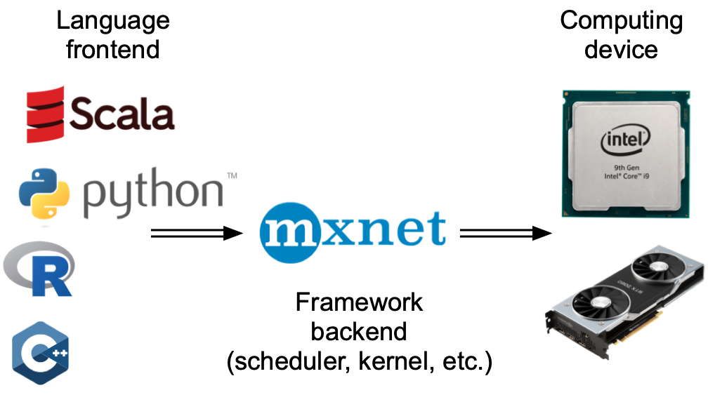
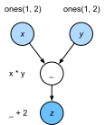
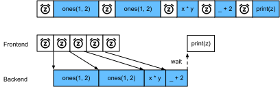

# Tính toán không đồng bộ
:label:`sec_async`

Máy tính ngày nay là các hệ thống song song cao, bao gồm nhiều lõi CPU (thường là nhiều luồng trên mỗi lõi), nhiều yếu tố xử lý trên mỗi GPU, và thường là nhiều GPU trên mỗi thiết bị. Nói tóm lại, chúng ta có thể xử lý nhiều thứ khác nhau cùng một lúc, thường là trên các thiết bị khác nhau. Thật không may Python không phải là một cách tuyệt vời để viết mã song song và không đồng bộ, ít nhất là không có một số trợ giúp bổ sung. Rốt cuộc, Python là một luồng và điều này không có khả năng thay đổi trong tương lai. Các khuôn khổ học sâu như MXNet và TensorFlow áp dụng mô hình lập trình không đồng bộ* * để cải thiện hiệu suất, trong khi PyTorch sử dụng trình lập lịch riêng của Python dẫn đến sự đánh đổi hiệu suất khác. Đối với PyTorch, theo mặc định, các hoạt động GPU là không đồng bộ. Khi bạn gọi một chức năng sử dụng GPU, các hoạt động được xếp hàng vào thiết bị cụ thể, nhưng không nhất thiết phải được thực hiện cho đến sau này. Điều này cho phép chúng tôi thực hiện song song nhiều tính toán hơn, bao gồm các hoạt động trên CPU hoặc các GPU khác. 

Do đó, hiểu cách thức hoạt động của lập trình không đồng bộ giúp chúng ta phát triển các chương trình hiệu quả hơn, bằng cách chủ động giảm các yêu cầu tính toán và phụ thuộc lẫn nhau. Điều này cho phép chúng tôi giảm chi phí bộ nhớ và tăng mức sử dụng bộ xử lý.

```{.python .input}
from d2l import mxnet as d2l
import numpy, os, subprocess
from mxnet import autograd, gluon, np, npx
from mxnet.gluon import nn
npx.set_np()
```

```{.python .input}
#@tab pytorch
from d2l import torch as d2l
import numpy, os, subprocess
import torch
from torch import nn
```

## Asynchrony qua Backend

:begin_tab:`mxnet`
Đối với một khởi động hãy xem xét vấn đề đồ chơi sau: chúng tôi muốn tạo ra một ma trận ngẫu nhiên và nhân nó. Chúng ta hãy làm điều đó cả trong NumPy và năm `mxnet.np` để thấy sự khác biệt.
:end_tab:

:begin_tab:`pytorch`
Đối với một khởi động hãy xem xét vấn đề đồ chơi sau: chúng tôi muốn tạo ra một ma trận ngẫu nhiên và nhân nó. Chúng ta hãy làm điều đó cả trong NumPy và trong tensor PyTorch để thấy sự khác biệt. Lưu ý rằng PyTorch `tensor` được xác định trên GPU.
:end_tab:

```{.python .input}
with d2l.Benchmark('numpy'):
    for _ in range(10):
        a = numpy.random.normal(size=(1000, 1000))
        b = numpy.dot(a, a)

with d2l.Benchmark('mxnet.np'):
    for _ in range(10):
        a = np.random.normal(size=(1000, 1000))
        b = np.dot(a, a)
```

```{.python .input}
#@tab pytorch
# Warmup for GPU computation
device = d2l.try_gpu()
a = torch.randn(size=(1000, 1000), device=device)
b = torch.mm(a, a)

with d2l.Benchmark('numpy'):
    for _ in range(10):
        a = numpy.random.normal(size=(1000, 1000))
        b = numpy.dot(a, a)

with d2l.Benchmark('torch'):
    for _ in range(10):
        a = torch.randn(size=(1000, 1000), device=device)
        b = torch.mm(a, a)
```

:begin_tab:`mxnet`
Đầu ra điểm chuẩn thông qua MXNet là các đơn đặt hàng cường độ nhanh hơn. Vì cả hai đều được thực hiện trên cùng một bộ xử lý một cái gì đó khác phải xảy ra. Buộc MXNet để hoàn thành tất cả các tính toán backend trước khi trả về cho thấy những gì đã xảy ra trước đây: tính toán được thực hiện bởi backend trong khi frontend trả về kiểm soát Python.
:end_tab:

:begin_tab:`pytorch`
Đầu ra điểm chuẩn thông qua PyTorch là đơn đặt hàng cường độ nhanh hơn. Sản phẩm chấm NumPy được thực thi trên bộ xử lý CPU trong khi phép nhân ma trận PyTorch được thực thi trên GPU và do đó sau này dự kiến sẽ nhanh hơn nhiều. Nhưng sự khác biệt thời gian rất lớn cho thấy một cái gì đó khác phải xảy ra. Theo mặc định, các hoạt động GPU không đồng bộ trong PyTorch. Buộc PyTorch hoàn thành tất cả các tính toán trước khi trả về cho thấy những gì đã xảy ra trước đây: tính toán đang được thực hiện bởi backend trong khi frontend trả về kiểm soát Python.
:end_tab:

```{.python .input}
with d2l.Benchmark():
    for _ in range(10):
        a = np.random.normal(size=(1000, 1000))
        b = np.dot(a, a)
    npx.waitall()
```

```{.python .input}
#@tab pytorch
with d2l.Benchmark():
    for _ in range(10):
        a = torch.randn(size=(1000, 1000), device=device)
        b = torch.mm(a, a)
    torch.cuda.synchronize(device)
```

:begin_tab:`mxnet`
Nói rộng ra, MXNet có một lối vào cho tương tác trực tiếp với người dùng, ví dụ, thông qua Python, cũng như một phụ trợ được sử dụng bởi hệ thống để thực hiện tính toán. Như thể hiện trong :numref:`fig_frontends`, người dùng có thể viết các chương trình MXNet bằng nhiều ngôn ngữ lối vào khác nhau, chẳng hạn như Python, R, Scala và C ++. Bất kể ngôn ngữ lập trình lối vào được sử dụng, việc thực hiện các chương trình MXNet xảy ra chủ yếu trong phần phụ trợ của triển khai C ++. Các hoạt động do ngôn ngữ frontend phát hành được chuyển sang phần phụ trợ để thực hiện. Phụ trợ quản lý các luồng riêng của nó liên tục thu thập và thực hiện các nhiệm vụ xếp hàng đợi. Lưu ý rằng để làm việc này, phụ trợ phải có khả năng theo dõi các phụ thuộc giữa các bước khác nhau trong biểu đồ tính toán. Do đó, không thể song song hóa các hoạt động phụ thuộc vào nhau.
:end_tab:

:begin_tab:`pytorch`
Nói rộng ra, PyTorch có lối vào để tương tác trực tiếp với người dùng, ví dụ, thông qua Python, cũng như một phụ trợ được hệ thống sử dụng để thực hiện tính toán. Như thể hiện trong :numref:`fig_frontends`, người dùng có thể viết các chương trình PyTorch bằng nhiều ngôn ngữ lối vào khác nhau, chẳng hạn như Python và C ++. Bất kể ngôn ngữ lập trình lối vào được sử dụng, việc thực hiện các chương trình PyTorch xảy ra chủ yếu trong phần phụ trợ của các triển khai C ++. Các hoạt động do ngôn ngữ frontend phát hành được chuyển sang phần phụ trợ để thực hiện. Phụ trợ quản lý các luồng riêng của nó liên tục thu thập và thực hiện các nhiệm vụ xếp hàng đợi. Lưu ý rằng để làm việc này, phụ trợ phải có khả năng theo dõi các phụ thuộc giữa các bước khác nhau trong biểu đồ tính toán. Do đó, không thể song song hóa các hoạt động phụ thuộc vào nhau.
:end_tab:


:width:`300px`
:label:`fig_frontends`

Chúng ta hãy nhìn vào một ví dụ đồ chơi khác để hiểu biểu đồ phụ thuộc tốt hơn một chút.

```{.python .input}
x = np.ones((1, 2))
y = np.ones((1, 2))
z = x * y + 2
z
```

```{.python .input}
#@tab pytorch
x = torch.ones((1, 2), device=device)
y = torch.ones((1, 2), device=device)
z = x * y + 2
z
```


:label:`fig_asyncgraph`

Đoạn mã ở trên cũng được minh họa trong :numref:`fig_asyncgraph`. Bất cứ khi nào Python frontend thread thực hiện một trong ba câu lệnh đầu tiên, nó chỉ đơn giản trả về nhiệm vụ cho hàng đợi phụ trợ. Khi kết quả của câu lệnh cuối cùng cần phải được * printed*, luồng giao diện người dùng Python sẽ chờ thread phụ trợ C++ kết thúc tính toán kết quả của biến `z`. Một lợi ích của thiết kế này là luồng giao diện người dùng Python không cần phải thực hiện các tính toán thực tế. Do đó, có rất ít tác động đến hiệu suất tổng thể của chương trình, bất kể hiệu suất của Python. :numref:`fig_threading` minh họa cách giao diện người dùng và phụ trợ tương tác. 


:label:`fig_threading`

## Rào cản và chặn

:begin_tab:`mxnet`
Có một số hoạt động sẽ buộc Python phải chờ hoàn thành: 

* Rõ ràng nhất là `npx.waitall()` chờ đợi cho đến khi tất cả các tính toán đã hoàn thành, bất kể khi nào các hướng dẫn tính toán được ban hành. Trong thực tế, việc sử dụng toán tử này là một ý tưởng tồi trừ khi hoàn toàn cần thiết vì nó có thể dẫn đến hiệu suất kém.
* Nếu chúng ta chỉ muốn đợi cho đến khi một biến cụ thể có sẵn, chúng ta có thể gọi `z.wait_to_read()`. Trong trường hợp này các khối MXNet trở lại Python cho đến khi biến `z` đã được tính toán. Các tính toán khác cũng có thể tiếp tục sau đó.

Hãy để chúng tôi xem làm thế nào điều này hoạt động trong thực tế.
:end_tab:

```{.python .input}
with d2l.Benchmark('waitall'):
    b = np.dot(a, a)
    npx.waitall()

with d2l.Benchmark('wait_to_read'):
    b = np.dot(a, a)
    b.wait_to_read()
```

:begin_tab:`mxnet`
Cả hai hoạt động đều mất khoảng cùng thời gian để hoàn thành. Bên cạnh các hoạt động chặn rõ ràng, chúng tôi khuyên bạn nên biết về trình chặn * ngụ ý*. In một biến rõ ràng yêu cầu biến phải có sẵn và do đó là một trình chặn. Cuối cùng, chuyển đổi sang NumPy qua `z.asnumpy()` và chuyển đổi sang vô hướng qua `z.item()` đang chặn, vì NumPy không có khái niệm không đồng bộ. Nó cần truy cập vào các giá trị giống như chức năng `print`.  

Sao chép một lượng nhỏ dữ liệu thường xuyên từ phạm vi của MXNet sang NumPy và trở lại có thể phá hủy hiệu suất của một mã hiệu quả khác, vì mỗi thao tác như vậy yêu cầu biểu đồ tính toán để đánh giá tất cả các kết quả trung gian cần thiết để có được thuật ngữ có liên quan * trước* bất cứ điều gì khác có thể được thực hiện.
:end_tab:

```{.python .input}
with d2l.Benchmark('numpy conversion'):
    b = np.dot(a, a)
    b.asnumpy()

with d2l.Benchmark('scalar conversion'):
    b = np.dot(a, a)
    b.sum().item()
```

## Cải thiện tính toán

:begin_tab:`mxnet`
Trên một hệ thống đa luồng nặng nề (thậm chí máy tính xách tay thông thường có 4 luồng trở lên và trên các máy chủ đa ổ cắm, con số này có thể vượt quá 256) chi phí của các hoạt động lên lịch có thể trở nên đáng kể. Đây là lý do tại sao nó là rất mong muốn để có tính toán và lập kế hoạch xảy ra không đồng bộ và song song. Để minh họa lợi ích của việc làm như vậy, chúng ta hãy xem những gì sẽ xảy ra nếu chúng ta tăng một biến thêm 1 nhiều lần, cả theo thứ tự hoặc không đồng bộ. Chúng tôi mô phỏng thực hiện đồng bộ bằng cách chèn một rào cản `wait_to_read` ở giữa mỗi lần bổ sung.
:end_tab:

```{.python .input}
with d2l.Benchmark('synchronous'):
    for _ in range(10000):
        y = x + 1
        y.wait_to_read()

with d2l.Benchmark('asynchronous'):
    for _ in range(10000):
        y = x + 1
    npx.waitall()
```

:begin_tab:`mxnet`
Một tương tác đơn giản hóa một chút giữa chuỗi giao diện Python và luồng phụ trợ C++ có thể được tóm tắt như sau:
1. Lối vào ra lệnh backend để chèn nhiệm vụ tính toán `y = x + 1` vào hàng đợi.
1. Backend sau đó nhận được các nhiệm vụ tính toán từ hàng đợi và thực hiện các tính toán thực tế.
1. Backend sau đó trả về kết quả tính toán cho lối vào.
Giả sử rằng thời lượng của ba giai đoạn này lần lượt là $t_1, t_2$ và $t_3$. Nếu chúng ta không sử dụng lập trình không đồng bộ, tổng thời gian thực hiện để thực hiện 10000 tính toán là khoảng $10000 (t_1+ t_2 + t_3)$. Nếu lập trình không đồng bộ được sử dụng, tổng thời gian thực hiện để thực hiện 10000 tính toán có thể được giảm xuống còn $t_1 + 10000 t_2 + t_3$ (giả sử $10000 t_2 > 9999t_1$), vì lối vào không phải đợi backend trả về kết quả tính toán cho mỗi vòng lặp.
:end_tab:

## Tóm tắt

* Các khuôn khổ học sâu có thể tách các lối vào Python từ một phụ trợ thực thi. Điều này cho phép chèn nhanh không đồng bộ các lệnh vào phụ trợ và song song liên quan.
* Asynchrony dẫn đến một lối vào khá đáp ứng. Tuy nhiên, hãy thận trọng không để lấp đầy hàng đợi tác vụ vì nó có thể dẫn đến tiêu thụ bộ nhớ quá mức. Bạn nên đồng bộ hóa cho mỗi minibatch để giữ lối vào và phụ trợ xấp xỉ đồng bộ hóa.
* Các nhà cung cấp chip cung cấp các công cụ phân tích hiệu suất tinh vi để có được cái nhìn sâu sắc hơn nhiều về hiệu quả của việc học sâu.

:begin_tab:`mxnet`
* Hãy nhận thức được thực tế là chuyển đổi từ quản lý bộ nhớ của MXNet sang Python sẽ buộc phụ trợ phải đợi cho đến khi biến cụ thể đã sẵn sàng. Các chức năng như `print`, `asnumpy` và `item` đều có tác dụng này. Điều này có thể là mong muốn nhưng việc sử dụng đồng bộ hóa bất cẩn có thể làm hỏng hiệu suất.
:end_tab:

## Bài tập

:begin_tab:`mxnet`
1. Chúng tôi đã đề cập ở trên rằng việc sử dụng tính toán không đồng bộ có thể làm giảm tổng lượng thời gian cần thiết để thực hiện 10000 tính toán xuống $t_1 + 10000 t_2 + t_3$. Tại sao chúng ta phải giả định $10000 t_2 > 9999 t_1$ ở đây?
1. Đo sự khác biệt giữa `waitall` và `wait_to_read`. Gợi ý: thực hiện một số hướng dẫn và đồng bộ hóa cho một kết quả trung gian.
:end_tab:

:begin_tab:`pytorch`
1. Trên CPU, điểm chuẩn các hoạt động nhân ma trận tương tự trong phần này. Bạn vẫn có thể quan sát sự không đồng bộ thông qua backend?
:end_tab:

:begin_tab:`mxnet`
[Discussions](https://discuss.d2l.ai/t/361)
:end_tab:

:begin_tab:`pytorch`
[Discussions](https://discuss.d2l.ai/t/2564)
:end_tab:
