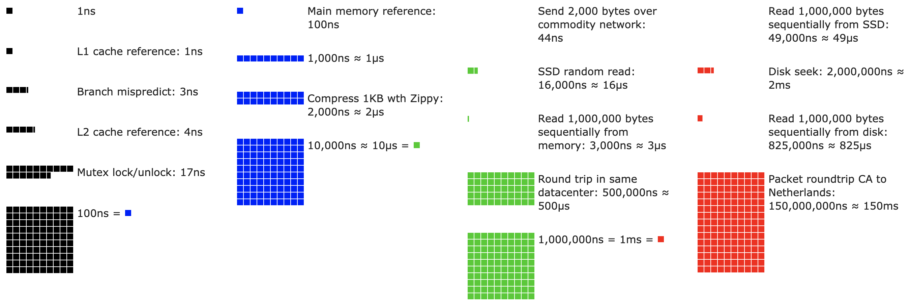

# Phần cứng
:label:`sec_hardware`

Xây dựng hệ thống với hiệu suất tuyệt vời đòi hỏi một sự hiểu biết tốt về các thuật toán và mô hình để nắm bắt các khía cạnh thống kê của vấn đề. Đồng thời nó cũng không thể thiếu để có ít nhất một modicum kiến thức về phần cứng cơ bản. Phần hiện tại không thay thế cho một khóa học thích hợp về thiết kế phần cứng và hệ thống. Thay vào đó, nó có thể đóng vai trò là điểm khởi đầu để hiểu lý do tại sao một số thuật toán hiệu quả hơn các thuật toán khác và làm thế nào để đạt được thông lượng tốt. Một thiết kế tốt có thể dễ dàng tạo ra sự khác biệt về thứ tự cường độ và đến lượt nó, điều này có thể tạo ra sự khác biệt giữa việc có thể đào tạo mạng (ví dụ: trong một tuần) và hoàn toàn không (trong 3 tháng, do đó thiếu thời hạn). Chúng tôi sẽ bắt đầu bằng cách nhìn vào máy tính. Sau đó, chúng tôi sẽ phóng to để xem xét kỹ hơn về CPU và GPU. Cuối cùng, chúng tôi thu nhỏ để xem xét cách nhiều máy tính được kết nối trong một trung tâm máy chủ hoặc trên đám mây.  

:label:`fig_latencynumbers`

Độc giả thiếu kiên nhẫn có thể có được bằng cách với :numref:`fig_latencynumbers`. Nó được lấy từ [bài viết tương tác] của Colin Scott (https://people.eecs.berkeley.edu/~rcs/research/interactive_latency.html) cung cấp một cái nhìn tổng quan tốt về sự tiến bộ trong thập kỷ qua. Những con số ban đầu là do [Stanford talk from 2010](https://static.googleusercontent.com/media/research.google.com/en//people/jeff/Stanford-DL-Nov-2010.pdf) của Jeff Dean. Cuộc thảo luận dưới đây giải thích một số lý do cho những con số này và cách họ có thể hướng dẫn chúng ta trong việc thiết kế các thuật toán. Các cuộc thảo luận dưới đây là mức độ rất cao và cursory. Nó rõ ràng là * không thay thế* cho một khóa học thích hợp mà chỉ có nghĩa là cung cấp đủ thông tin cho một người mô hình thống kê để đưa ra quyết định thiết kế phù hợp. Để biết tổng quan chuyên sâu về kiến trúc máy tính, chúng tôi giới thiệu người đọc đến :cite:`Hennessy.Patterson.2011` hoặc một khóa học gần đây về chủ đề này, chẳng hạn như khóa học của [Arste Asanovic](http://inst.eecs.berkeley.edu/~cs152/sp19/). 

## Máy vi tính

Hầu hết các nhà nghiên cứu và học viên học sâu có quyền truy cập vào một máy tính với một lượng bộ nhớ hợp lý, tính toán, một số dạng của một máy gia tốc như GPU, hoặc bội số của chúng. Một máy tính bao gồm các thành phần chính sau: 

* Bộ xử lý (còn được gọi là CPU) có thể thực thi các chương trình chúng tôi cung cấp cho nó (ngoài việc chạy hệ điều hành và nhiều thứ khác), thường bao gồm 8 lõi trở lên.
* Bộ nhớ (RAM) để lưu trữ và truy xuất các kết quả từ tính toán, chẳng hạn như vectơ trọng lượng và kích hoạt, và dữ liệu đào tạo.
* Một kết nối mạng Ethernet (đôi khi nhiều) với tốc độ từ 1 Gb/s đến 100 Gb/s.
* Một bus mở rộng tốc độ cao (PCIe) để kết nối hệ thống với một hoặc nhiều GPU. Máy chủ có tới 8 máy gia tốc, thường được kết nối trong một cấu trúc liên kết tiên tiến, trong khi các hệ thống máy tính để bàn có 1 hoặc 2, tùy thuộc vào ngân sách của người dùng và kích thước của nguồn điện.
* Lưu trữ bền, chẳng hạn như ổ đĩa cứng từ tính, ổ đĩa trạng thái rắn, trong nhiều trường hợp được kết nối bằng bus PCIe. Nó cung cấp chuyển dữ liệu đào tạo hiệu quả đến hệ thống và lưu trữ các trạm kiểm soát trung gian khi cần thiết.

:label:`fig_mobo-symbol`

Như :numref:`fig_mobo-symbol` chỉ ra, hầu hết các thành phần (mạng, GPU và lưu trữ) được kết nối với CPU trên bus PCIe. Nó bao gồm nhiều làn xe được gắn trực tiếp vào CPU. Ví dụ Threadripper 3 của AMD có 64 làn PCIe 4.0, mỗi làn có khả năng truyền dữ liệu 16 Gbit/s theo cả hai hướng. Bộ nhớ được gắn trực tiếp vào CPU với tổng băng thông lên tới 100 Gb/s. 

Khi chúng ta chạy mã trên máy tính, chúng ta cần xáo trộn dữ liệu vào bộ xử lý (CPU hoặc GPU), thực hiện tính toán, sau đó di chuyển kết quả ra khỏi bộ xử lý trở lại RAM và bộ nhớ bền. Do đó, để có được hiệu suất tốt, chúng ta cần đảm bảo rằng điều này hoạt động liền mạch mà không có bất kỳ hệ thống nào trở thành nút cổ chai lớn. Ví dụ, nếu chúng ta không thể tải hình ảnh đủ nhanh, bộ xử lý sẽ không có bất kỳ công việc nào để làm. Tương tự như vậy, nếu chúng ta không thể di chuyển ma trận đủ nhanh đến CPU (hoặc GPU), các yếu tố xử lý của nó sẽ chết đói. Cuối cùng, nếu chúng ta muốn đồng bộ hóa nhiều máy tính trên mạng, sau này không nên làm chậm tính toán. Một lựa chọn là giao tiếp xen kẽ và tính toán. Hãy để chúng tôi có một cái nhìn tại các thành phần khác nhau chi tiết hơn. 

## Bộ nhớ

Tại bộ nhớ cơ bản nhất của nó được sử dụng để lưu trữ dữ liệu cần phải dễ dàng truy cập. Hiện tại CPU RAM thường thuộc loại [DDR4](https://en.wikipedia.org/wiki/DDR4_SDRAM), cung cấp băng thông 20—25 Gb/s cho mỗi mô-đun. Mỗi mô-đun có một bus rộng 64 bit. Thông thường các cặp mô-đun bộ nhớ được sử dụng để cho phép nhiều kênh. CPU có từ 2 đến 4 kênh bộ nhớ, tức là chúng có từ 4 0GB/s đến băng thông bộ nhớ đỉnh 100 Gb/s. Thường có hai ngân hàng trên mỗi kênh. Ví dụ Zen 3 Threadripper của AMD có 8 khe cắm. 

Mặc dù những con số này rất ấn tượng, nhưng thực sự, họ chỉ kể một phần của câu chuyện. Khi chúng ta muốn đọc một phần từ bộ nhớ trước tiên chúng ta cần nói với mô-đun bộ nhớ nơi thông tin có thể được tìm thấy. Đó là, trước tiên chúng ta cần gửi *địa chỉ* đến RAM. Khi điều này được thực hiện, chúng ta có thể chọn chỉ đọc một bản ghi 64 bit duy nhất hoặc một chuỗi dài các bản ghi. Cái sau được gọi là *burst đọc*. Tóm lại, việc gửi một địa chỉ vào bộ nhớ và thiết lập việc chuyển mất khoảng 100 ns (chi tiết phụ thuộc vào hệ số thời gian cụ thể của chip bộ nhớ được sử dụng), mỗi lần chuyển tiếp theo chỉ mất 0,2 ns. Nói tóm lại, lần đọc đầu tiên đắt gấp 500 lần so với những lần tiếp theo! Lưu ý rằng chúng ta có thể thực hiện lên đến 10.000.000 lần đọc ngẫu nhiên mỗi giây. Điều này cho thấy rằng chúng ta tránh truy cập bộ nhớ ngẫu nhiên càng nhiều càng tốt và sử dụng burst reads (và ghi) thay thế. 

Các vấn đề phức tạp hơn một chút khi chúng tôi tính đến việc chúng tôi có nhiều *ngân hàng*. Mỗi ngân hàng có thể đọc bộ nhớ phần lớn độc lập. Điều này có nghĩa là hai điều. Một mặt, số lần đọc ngẫu nhiên hiệu quả cao hơn tới 4 lần, miễn là chúng được trải đều trên bộ nhớ. Điều đó cũng có nghĩa là vẫn là một ý tưởng tồi để thực hiện các lần đọc ngẫu nhiên vì lần đọc burst cũng nhanh hơn 4 lần. Mặt khác, do sự liên kết bộ nhớ với ranh giới 64 bit, nên căn chỉnh bất kỳ cấu trúc dữ liệu nào có cùng ranh giới. Trình biên dịch làm điều này khá nhiều [automatically](https://en.wikipedia.org/wiki/Data_structure_alignment) khi các cờ thích hợp được đặt. Độc giả tò mò được khuyến khích xem lại một bài giảng về DRams chẳng hạn như bài của [Zeshan Chishti](http://web.cecs.pdx.edu/~zeshan/ece585_lec5.pdf). 

Bộ nhớ GPU phải tuân theo yêu cầu băng thông thậm chí cao hơn vì chúng có nhiều yếu tố xử lý hơn CPU. Bởi và lớn có hai lựa chọn để giải quyết chúng. Đầu tiên là làm cho bus bộ nhớ rộng hơn đáng kể. Ví dụ, RTX 2080 Ti của NVIDIA có một bus rộng 352-bit. Điều này cho phép chuyển nhiều thông tin hơn cùng một lúc. Thứ hai, GPU sử dụng bộ nhớ hiệu suất cao cụ thể. Các thiết bị cấp tiêu dùng, chẳng hạn như dòng RTX và Titan của NVIDIA thường sử dụng chip [GDDR6](https://en.wikipedia.org/wiki/GDDR6_SDRAM) với băng thông tổng hợp hơn 500 Gb/s. Một cách khác là sử dụng các mô-đun HBM (bộ nhớ băng thông cao). Họ sử dụng một giao diện rất khác nhau và kết nối trực tiếp với GPU trên một wafer silicon chuyên dụng. Điều này làm cho chúng rất tốn kém và việc sử dụng chúng thường bị giới hạn ở các chip máy chủ cao cấp, chẳng hạn như dòng máy gia tốc NVIDIA Volta V100. Khá không có gì ngạc nhiên, bộ nhớ GPU nói chung là * nhiều* nhỏ hơn bộ nhớ CPU do chi phí cao hơn của trước đây. Đối với mục đích của chúng tôi, bởi và lớn đặc điểm hiệu suất của họ là tương tự nhau, chỉ nhanh hơn rất nhiều. Chúng ta có thể bỏ qua một cách an toàn các chi tiết cho mục đích của cuốn sách này. Chúng chỉ quan trọng khi điều chỉnh hạt GPU cho thông lượng cao. 

## Lưu trữ

Chúng tôi thấy rằng một số đặc điểm chính của RAM là * băng thông * và * độ trễ *. Điều tương tự cũng đúng đối với các thiết bị lưu trữ, chỉ là sự khác biệt có thể còn cực đoan hơn. 

### Ổ đĩa cứng

*Ổ đĩa cứng* (HDD) đã được sử dụng trong hơn nửa thế kỷ. Tóm lại, chúng chứa một số đĩa quay có đầu có thể được định vị để đọc hoặc viết tại bất kỳ bản nhạc nào. Đĩa cao cấp chứa tới 16 TB trên 9 đĩa. Một trong những lợi ích chính của ổ cứng là chúng tương đối rẻ tiền. Một trong nhiều nhược điểm của họ là các chế độ thất bại thảm khốc điển hình của chúng và độ trễ đọc tương đối cao.

Để hiểu sau này, hãy xem xét thực tế là ổ cứng quay ở khoảng 7.200 RPM (vòng quay mỗi phút). Nếu chúng nhanh hơn nhiều, chúng sẽ vỡ do lực ly tâm tác dụng lên đĩa. Điều này có một nhược điểm lớn khi truy cập vào một khu vực cụ thể trên đĩa: chúng ta cần đợi cho đến khi đĩa đã xoay ở vị trí (chúng ta có thể di chuyển các đầu nhưng không tăng tốc các đĩa thực tế). Do đó, nó có thể mất hơn 8 ms cho đến khi dữ liệu được yêu cầu có sẵn. Một cách phổ biến mà điều này được thể hiện là nói rằng ổ cứng có thể hoạt động ở khoảng 100 IOP (hoạt động đầu vào/đầu ra mỗi giây). Con số này về cơ bản vẫn không thay đổi trong hai thập kỷ qua. Tệ hơn nữa, việc tăng băng thông cũng khó khăn như nhau (theo thứ tự 100—200 MB/s). Rốt cuộc, mỗi đầu đọc một bản nhạc của bit, do đó tốc độ bit chỉ quy mô với căn bậc hai của mật độ thông tin. Do đó, ổ cứng nhanh chóng trở nên xuống hạng lưu trữ lưu trữ và lưu trữ cấp thấp cho các bộ dữ liệu rất lớn. 

### Ổ đĩa trạng thái rắn

Ổ đĩa trạng thái rắn (SSD) sử dụng bộ nhớ flash để lưu trữ thông tin liên tục. Điều này cho phép truy cập * nhanh hơn nhiều* vào các bản ghi được lưu trữ. SSD hiện đại có thể hoạt động ở mức 100.000 đến 500.000 IOP, tức là nhanh hơn 3 đơn hàng độ lớn hơn ổ cứng. Hơn nữa, băng thông của chúng có thể đạt 1-3GB/s, tức là, một bậc độ lớn nhanh hơn ổ cứng. Những cải tiến này nghe gần như quá tốt để trở thành sự thật. Thật vậy, chúng đi kèm với các cảnh báo sau đây, do cách SSD được thiết kế. 

* SSD lưu trữ thông tin trong các khối (256 KB hoặc lớn hơn). Chúng chỉ có thể được viết như một toàn thể, mất thời gian đáng kể. Do đó, viết ngẫu nhiên bit-wise trên SSD có hiệu suất rất kém. Tương tự như vậy, việc viết dữ liệu nói chung mất thời gian đáng kể vì khối phải được đọc, xóa và sau đó viết lại bằng thông tin mới. Đến nay bộ điều khiển SSD và firmware đã phát triển các thuật toán để giảm thiểu điều này. Tuy nhiên, ghi có thể chậm hơn nhiều, đặc biệt đối với SSD QLC (tế bào cấp bốn). Chìa khóa để cải thiện hiệu suất là duy trì một * queue* hoạt động, thích đọc và viết trong các khối lớn nếu có thể.
* Các tế bào bộ nhớ trong SSD hao mòn tương đối nhanh (thường là sau vài nghìn lần viết). Thuật toán bảo vệ cấp mài mòn có thể lây lan sự xuống cấp trên nhiều tế bào. Điều đó nói rằng, không nên sử dụng SSD để hoán đổi tệp hoặc cho các tập hợp lớn các tệp nhật ký.
* Cuối cùng, sự gia tăng lớn về băng thông đã buộc các nhà thiết kế máy tính phải gắn SSD trực tiếp vào bus PCIe. Các ổ đĩa có khả năng xử lý điều này, được gọi là NVMe (Bộ nhớ không bay hơi tăng cường), có thể sử dụng tối đa 4 làn PCIe. Số này lên tới 8GB/s trên PCIe 4.0.

### Lưu trữ đám mây

Lưu trữ đám mây cung cấp một phạm vi hiệu suất có thể cấu hình. Đó là, việc phân công lưu trữ cho các máy ảo là năng động, cả về số lượng và về tốc độ, theo lựa chọn của người dùng. Chúng tôi khuyên người dùng nên tăng số lượng IOP được cung cấp bất cứ khi nào độ trễ quá cao, ví dụ, trong quá trình đào tạo với nhiều hồ sơ nhỏ. 

## CPU

Các đơn vị xử lý trung tâm (CPU) là trung tâm của bất kỳ máy tính nào. Chúng bao gồm một số thành phần chính: * lõi bộ xử lý* có thể thực thi mã máy, * bus* kết nối chúng (cấu trúc liên kết cụ thể khác biệt đáng kể giữa các mô hình bộ xử lý, thế hệ và nhà cung cấp) và * caches* để cho phép băng thông cao hơn và truy cập bộ nhớ trễ thấp hơn so với có thể bằng cách đọc từ bộ nhớ chính. Cuối cùng, hầu hết tất cả các CPU hiện đại đều chứa các đơn vị xử lý vectơ * để hỗ trợ đại số tuyến tính hiệu suất cao và các phức tạp, vì chúng phổ biến trong xử lý phương tiện truyền thông và học máy. 

:label:`fig_skylake`

:numref:`fig_skylake` mô tả một CPU lõi tứ cấp tiêu dùng Intel Skylake. Nó có một GPU tích hợp, bộ nhớ cache và một ringbus kết nối bốn lõi. Các thiết bị ngoại vi, chẳng hạn như Ethernet, WiFi, Bluetooth, bộ điều khiển SSD và USB, là một phần của chipset hoặc được gắn trực tiếp (PCIe) vào CPU. 

### Kiến trúc vi mô

Mỗi lõi bộ xử lý bao gồm một bộ thành phần khá phức tạp. Trong khi các chi tiết khác nhau giữa các thế hệ và nhà cung cấp, chức năng cơ bản là khá nhiều tiêu chuẩn. Front-end tải hướng dẫn và cố gắng dự đoán đường dẫn nào sẽ được thực hiện (ví dụ, cho luồng điều khiển). Hướng dẫn sau đó được giải mã từ mã lắp ráp sang microinstructions. Mã hội thường không phải là mã cấp thấp nhất mà một bộ xử lý thực thi. Thay vào đó, các hướng dẫn phức tạp có thể được giải mã thành một tập hợp các hoạt động cấp thấp hơn. Chúng sau đó được xử lý bởi lõi thực hiện thực tế. Thường thì cái sau có khả năng thực hiện nhiều hoạt động cùng một lúc. Ví dụ, lõi ARM Cortex A77 của :numref:`fig_cortexa77` có thể thực hiện tối đa 8 thao tác cùng một lúc. 

:label:`fig_cortexa77`

Điều này có nghĩa là các chương trình hiệu quả có thể thực hiện nhiều hơn một lệnh cho mỗi chu kỳ đồng hồ, với điều kiện là chúng có thể được thực hiện độc lập. Không phải tất cả các đơn vị được tạo ra bằng nhau. Một số chuyên về hướng dẫn số nguyên trong khi những người khác được tối ưu hóa cho hiệu suất điểm nổi. Để tăng thông lượng, bộ xử lý cũng có thể theo nhiều đường dẫn mã đồng thời trong một hướng dẫn phân nhánh và sau đó loại bỏ kết quả của các nhánh không được thực hiện. Đây là lý do tại sao các đơn vị dự đoán chi nhánh quan trọng (trên front-end) sao cho chỉ những con đường hứa hẹn nhất được theo đuổi. 

### Vector hóa

Học sâu là cực kỳ đói tính toán. Do đó, để làm cho CPU phù hợp với học máy, người ta cần thực hiện nhiều thao tác trong một chu kỳ đồng hồ. Điều này đạt được thông qua các đơn vị vector. Họ có tên khác nhau: on ARM they are called NEON, on x86 they (a recent generation) are referred to as [AVX2](https://en.wikipedia.org/wiki/Advanced_Vector_Extensions) units. A common aspect is that they are able to perform SIMD (single instruction multiple data) operations. :numref:`fig_neon128` cho thấy cách 8 số nguyên ngắn có thể được thêm vào trong một chu kỳ đồng hồ trên ARM. 

:label:`fig_neon128`

Tùy thuộc vào lựa chọn kiến trúc, các thanh ghi như vậy dài tới 512 bit, cho phép kết hợp tối đa 64 cặp số. Ví dụ, chúng ta có thể nhân hai số và thêm chúng vào một phần ba, mà còn được gọi là một kết hợp multiply-add. [OpenVino](https://01.org/openvinotoolkit) của Intel sử dụng những thứ này để đạt được thông lượng đáng kính cho việc học sâu trên CPU cấp máy chủ. Tuy nhiên, lưu ý rằng con số này hoàn toàn bị lùn bởi những gì GPU có khả năng đạt được. Ví dụ, RTX 2080 Ti của NVIDIA có 4.352 lõi CIDA, mỗi lõi có khả năng xử lý một hoạt động như vậy bất cứ lúc nào. 

### Bộ nhớ cache

Hãy xem xét các tình huống sauđây: we have a modest CPU core with 4 cores as depicted in :numref:`fig_skylake` ở trên, chạy ở tần số 2 GHz. Hơn nữa, chúng ta hãy giả định rằng chúng tôi có số lượng IPC (hướng dẫn trên mỗi đồng hồ) là 1 và các đơn vị có AVX2 với kích hoạt chiều rộng 256-bit. Chúng ta hãy hơn nữa giả định rằng ít nhất một trong những thanh ghi được sử dụng cho các hoạt động AVX2 cần phải được lấy từ bộ nhớ. Điều này có nghĩa là CPU tiêu thụ $4 \times 256 \text{ bit} = 128 \text{ bytes}$ dữ liệu trên mỗi chu kỳ đồng hồ. Trừ khi chúng tôi có thể chuyển $2 \times 10^9 \times 128 = 256 \times 10^9$ byte sang bộ xử lý mỗi giây, các yếu tố xử lý sẽ chết đói. Thật không may, giao diện bộ nhớ của một con chip như vậy chỉ hỗ trợ truyền dữ liệu 20—40 Gb/s, tức là, một bậc độ lớn ít hơn. Việc khắc phục là để tránh tải dữ liệu * mới* từ bộ nhớ càng nhiều càng tốt và thay vào đó là bộ nhớ cache cục bộ trên CPU. Đây là nơi bộ nhớ cache có ích. Thông thường các tên hoặc khái niệm sau đây được sử dụng: 

* **Đăng ký** được nói đúng không phải là một phần của bộ nhớ cache. Họ giúp hướng dẫn sân khấu. Điều đó nói rằng, thanh ghi CPU là vị trí bộ nhớ mà CPU có thể truy cập ở tốc độ đồng hồ mà không bị phạt chậm trễ nào. CPU có hàng chục thanh ghi. Tùy thuộc vào trình biên dịch (hoặc lập trình viên) để sử dụng thanh ghi hiệu quả. Ví dụ ngôn ngữ lập trình C có từ khóa `register`.
* ** L1 caches** là tuyến phòng thủ đầu tiên chống lại các yêu cầu băng thông bộ nhớ cao. Bộ nhớ đệm L1 rất nhỏ (kích thước điển hình có thể là 32—64 KB) và thường được chia thành các bộ nhớ cache dữ liệu và hướng dẫn. Khi dữ liệu được tìm thấy trong bộ nhớ cache L1, truy cập rất nhanh. Nếu chúng không thể được tìm thấy ở đó, tìm kiếm sẽ tiến triển xuống hệ thống phân cấp bộ nhớ cache.
* ** L2 caches** là điểm dừng tiếp theo. Tùy thuộc vào thiết kế kiến trúc và kích thước bộ xử lý chúng có thể là độc quyền. Chúng chỉ có thể truy cập được bởi một lõi nhất định hoặc được chia sẻ giữa nhiều lõi. Bộ nhớ đệm L2 lớn hơn (thường là 256—512 KB cho mỗi lõi) và chậm hơn L1. Hơn nữa, để truy cập một cái gì đó trong L2, trước tiên chúng ta cần kiểm tra để nhận ra rằng dữ liệu không có trong L1, điều này thêm một lượng nhỏ độ trễ thêm.
* ** L3 caches** được chia sẻ giữa nhiều lõi và có thể khá lớn. CPU máy chủ Epyc 3 của AMD có một con số khổng lồ 256 MB bộ nhớ cache trải rộng trên nhiều chiplet. Các số điển hình hơn nằm trong phạm vi 4—8 MB.

Dự đoán các yếu tố bộ nhớ nào sẽ cần thiết tiếp theo là một trong những thông số tối ưu hóa chính trong thiết kế chip. Ví dụ, nên đi qua bộ nhớ theo hướng *forward* vì hầu hết các thuật toán bộ nhớ đệm sẽ cố gắng * đọc trước* thay vì ngược lại. Tương tự như vậy, giữ các mẫu truy cập bộ nhớ cục bộ là một cách tốt để cải thiện hiệu suất. 

Thêm bộ nhớ đệm là một thanh kiếm hai cạnh. Một mặt họ đảm bảo rằng các lõi bộ xử lý không chết đói dữ liệu. Đồng thời chúng tăng kích thước chip, sử dụng lên diện tích mà nếu không có thể đã được chi cho việc tăng sức mạnh xử lý. Hơn nữa, * nhớ cache * có thể tốn kém. Hãy xem xét trường hợp xấu nhất, * chia sẻ sai *, như được mô tả trong :numref:`fig_falsesharing`. Một vị trí bộ nhớ được lưu trữ trên bộ xử lý 0 khi một luồng trên bộ xử lý 1 yêu cầu dữ liệu. Để có được nó, bộ xử lý 0 cần phải dừng những gì nó đang làm, ghi lại thông tin vào bộ nhớ chính và sau đó cho phép bộ xử lý 1 đọc nó từ bộ nhớ. Trong hoạt động này cả hai bộ vi xử lý chờ đợi. Rất có khả năng mã như vậy chạy * khá chậm chừ* trên nhiều bộ xử lý khi so sánh với việc triển khai một bộ xử lý đơn hiệu quả. Đây là một lý do nữa cho lý do tại sao có một giới hạn thực tế đối với kích thước bộ nhớ cache (bên cạnh kích thước vật lý của chúng). 

:label:`fig_falsesharing`

## GPU và các bộ tăng tốc khác

Không phải là một cường điệu khi tuyên bố rằng học sâu sẽ không thành công nếu không có GPU. Bằng cùng một mã thông báo, khá hợp lý khi lập luận rằng vận may của các nhà sản xuất GPU đã tăng đáng kể do học sâu. Sự đồng phát triển của phần cứng và thuật toán này đã dẫn đến một tình huống mà học sâu tốt hơn hoặc tồi tệ hơn là mô hình mô hình mô hình hóa thống kê thích hợp hơn. Do đó, nó trả tiền để hiểu những lợi ích cụ thể mà GPU và các máy gia tốc liên quan như TPU :cite:`Jouppi.Young.Patil.ea.2017`. 

Lưu ý là một sự khác biệt thường được thực hiện trong thực tế: máy gia tốc được tối ưu hóa cho đào tạo hoặc suy luận. Đối với cái sau, chúng ta chỉ cần tính toán sự lan truyền chuyển tiếp trong một mạng. Không cần lưu trữ dữ liệu trung gian để truyền ngược. Hơn nữa, chúng ta có thể không cần tính toán rất chính xác (FP16 hoặc INT8 thường là đủ). Mặt khác, trong quá trình đào tạo tất cả các kết quả trung gian cần lưu trữ để tính toán độ dốc. Hơn nữa, tích lũy gradient đòi hỏi độ chính xác cao hơn để tránh dòng chảy số (hoặc tràn). Điều này có nghĩa là FP16 (hoặc độ chính xác hỗn hợp với FP32) là yêu cầu tối thiểu. Tất cả những điều này đòi hỏi bộ nhớ nhanh hơn và lớn hơn (HBM2 so với GDDR6) và sức mạnh xử lý nhiều hơn. Ví dụ, GPU [Turing](https://devblogs.nvidia.com/nvidia-turing-architecture-in-depth/) T4 của NVIDIA được tối ưu hóa cho suy luận trong khi GPU V100 thích hợp hơn để đào tạo. 

Nhớ lại vectorization như minh họa trong :numref:`fig_neon128`. Thêm các đơn vị vector vào lõi bộ xử lý cho phép chúng tôi tăng thông lượng đáng kể. Ví dụ: trong ví dụ trong :numref:`fig_neon128`, chúng tôi đã có thể thực hiện 16 thao tác cùng một lúc. Đầu tiên, điều gì sẽ xảy ra nếu chúng ta thêm các hoạt động tối ưu hóa không chỉ các hoạt động giữa các vectơ mà còn giữa các ma trận? Chiến lược này dẫn đến lõi tensor (sẽ được bảo hiểm trong thời gian ngắn). Thứ hai, nếu chúng ta thêm nhiều lõi nữa thì sao? Tóm lại, hai chiến lược này tóm tắt các quyết định thiết kế trong GPU. :numref:`fig_turing_processing_block` đưa ra một cái nhìn tổng quan về một khối xử lý cơ bản. Nó chứa 16 số nguyên và 16 đơn vị điểm nổi. Thêm vào đó, hai lõi tensor đẩy nhanh một tập hợp con hẹp của các hoạt động bổ sung có liên quan đến học sâu. Mỗi bộ xử lý phát trực tuyến bao gồm bốn khối như vậy. 

:width:`150px`
:label:`fig_turing_processing_block`

Tiếp theo, 12 bộ xử lý đa phát trực tuyến được nhóm thành các cụm xử lý đồ họa tạo nên bộ xử lý TU102 cao cấp. Các kênh bộ nhớ phong phú và bộ nhớ cache L2 bổ sung cho thiết lập. :numref:`fig_turing` có các chi tiết liên quan. Một trong những lý do để thiết kế một thiết bị như vậy là các khối riêng lẻ có thể được thêm hoặc loại bỏ khi cần thiết để cho phép các chip nhỏ gọn hơn và giải quyết các vấn đề năng suất (các mô-đun bị lỗi có thể không được kích hoạt). May mắn thay lập trình các thiết bị như vậy cũng được ẩn từ các nhà nghiên cứu học sâu thông thường bên dưới các lớp của CIDA và mã khung. Đặc biệt, nhiều hơn một trong các chương trình cũng có thể được thực thi đồng thời trên GPU, với điều kiện là có các tài nguyên có sẵn. Tuy nhiên, nó trả tiền để nhận thức được những hạn chế của các thiết bị để tránh chọn các mô hình không phù hợp với bộ nhớ thiết bị. 

:width:`350px`
:label:`fig_turing`

Một khía cạnh cuối cùng đáng nói đến chi tiết hơn là * lõi tensor*. Chúng là một ví dụ về xu hướng gần đây của việc thêm các mạch tối ưu hóa hơn có hiệu quả đặc biệt cho việc học sâu. Ví dụ, TPU đã thêm một mảng tâm thu :cite:`Kung.1988` để nhân ma trận nhanh. Ở đó, thiết kế là hỗ trợ một số rất nhỏ (một cho thế hệ đầu tiên của TPU) của các hoạt động lớn. Lõi Tensor ở đầu kia. Chúng được tối ưu hóa cho các hoạt động nhỏ liên quan đến giữa các ma trận $4 \times 4$ và $16 \times 16$, tùy thuộc vào độ chính xác số của chúng. :numref:`fig_tensorcore` đưa ra tổng quan về tối ưu hóa. 

:width:`400px`
:label:`fig_tensorcore`

Rõ ràng là khi tối ưu hóa tính toán, chúng ta sẽ tạo ra những thỏa hiệp nhất định. Một trong số đó là GPU không tốt trong việc xử lý các gián đoạn và dữ liệu thưa thớt. Mặc dù có những ngoại lệ đáng chú ý, chẳng hạn như [Gunrock](https://github.com/gunrock/gunrock) :cite:`Wang.Davidson.Pan.ea.2016`, mô hình truy cập của ma trận thưa thớt và vectơ không phù hợp với các hoạt động đọc liên tục băng thông cao trong đó GPU vượt trội. Phù hợp với cả hai mục tiêu là một lĩnh vực nghiên cứu tích cực. Xem ví dụ, [DGL](http://dgl.ai), một thư viện được điều chỉnh để học sâu về đồ thị. 

## Mạng và xe buýt

Bất cứ khi nào một thiết bị duy nhất không đủ để tối ưu hóa, chúng ta cần chuyển dữ liệu đến và đi từ nó để đồng bộ hóa xử lý. Đây là nơi mạng và xe buýt có ích. Chúng tôi có một số thông số thiết kế: băng thông, chi phí, khoảng cách và tính linh hoạt. Ở một đầu, chúng tôi có WiFi có phạm vi khá tốt, rất dễ sử dụng (không có dây, sau tất cả), giá rẻ nhưng nó cung cấp băng thông và độ trễ tương đối tầm thường. Không có nhà nghiên cứu máy học nào trong tâm trí đúng đắn của họ sẽ sử dụng nó để xây dựng một cụm máy chủ. Trong những gì sau đây, chúng tôi tập trung vào các kết nối phù hợp cho việc học sâu. 

* ** PCIe** là một xe buýt chuyên dụng cho các kết nối điểm-điểm băng thông rất cao (lên đến 32 Gb/s trên PCIe 4.0 trong một khe 16 làn) cho mỗi làn. Độ trễ theo thứ tự micro giây một chữ số (5 μs). Liên kết PCIe rất quý giá. Bộ xử lý chỉ có số lượng hạn chế: EPYC 3 của AMD có 128 làn xe, Xeon của Intel có tới 48 làn trên mỗi chip; trên CPU cấp máy tính để bàn, các con số tương ứng là 20 (Ryzen 9) và 16 (Core i9). Vì GPU thường có 16 làn, điều này giới hạn số lượng GPU có thể kết nối với CPU ở băng thông đầy đủ. Rốt cuộc, họ cần chia sẻ các liên kết với các thiết bị ngoại vi băng thông cao khác như lưu trữ và Ethernet. Cũng giống như với truy cập RAM, chuyển số lượng lớn là thích hợp hơn do giảm chi phí gói.
* **Ethernet** là cách kết nối máy tính được sử dụng phổ biến nhất. Mặc dù nó chậm hơn đáng kể so với PCIe, nhưng nó rất rẻ và đàn hồi để cài đặt và bao phủ khoảng cách xa hơn nhiều. Băng thông điển hình cho các máy chủ cấp thấp là 1 GBit/s. thiết bị cao cấp (ví dụ, [C5 instances](https://aws.amazon.com/ec2/instance-types/c5/) trong đám mây) cung cấp giữa 10 và 100 GBit/s băng thông. Như trong tất cả các trường hợp trước truyền dữ liệu có chi phí đáng kể. Lưu ý rằng chúng ta hầu như không bao giờ sử dụng Ethernet thô trực tiếp mà là một giao thức được thực thi trên đầu trang của kết nối vật lý (chẳng hạn như UDP hoặc TCP/IP). Điều này bổ sung thêm chi phí. Giống như PCIe, Ethernet được thiết kế để kết nối hai thiết bị, ví dụ, một máy tính và một công tắc.
* ** Switches** cho phép chúng tôi kết nối nhiều thiết bị theo cách mà bất kỳ cặp nào trong số họ có thể thực hiện kết nối điểm-điểm (thường là băng thông đầy đủ) cùng một lúc. Ví dụ: các thiết bị chuyển mạch Ethernet có thể kết nối 40 máy chủ ở băng thông mặt cắt ngang cao. Lưu ý rằng các thiết bị chuyển mạch không phải là duy nhất cho các mạng máy tính truyền thống. Ngay cả làn đường PCIe cũng có thể là [switched](https://www.broadcom.com/products/pcie-switches-bridges/pcie-switches). Điều này xảy ra, ví dụ, để kết nối một số lượng lớn GPU với bộ xử lý máy chủ, như trường hợp của [P2 instances](https://aws.amazon.com/ec2/instance-types/p2/).
* **NVLink** là một thay thế cho PCIe khi nói đến kết nối băng thông rất cao. Nó cung cấp tốc độ truyền dữ liệu lên đến 300 Gbit/s cho mỗi liên kết. GPU máy chủ (Volta V100) có sáu liên kết trong khi GPU cấp người tiêu dùng (RTX 2080 Ti) chỉ có một liên kết, hoạt động với tốc độ giảm 100 Gbit/s. Chúng tôi khuyên bạn nên sử dụng [NCCL](https://github.com/NVIDIA/nccl) để đạt được truyền dữ liệu cao giữa các GPU.

## Nhiều số độ trễ hơn

Tóm tắt trong :numref:`table_latency_numbers` và :numref:`table_latency_numbers_tesla` là từ [Eliot Eshelman](https://gist.github.com/eshelman), người duy trì phiên bản cập nhật của các số là [GitHub gist](https://gist.github.com/eshelman/343a1c46cb3fba142c1afdcdeec17646). 

:Số trễ chung. 

| Action | Time | Notes |
| :----------------------------------------- | -----: | :---------------------------------------------- |
| L1 cache reference/hit                     | 1.5 ns | 4 cycles                                        |
| Floating-point add/mult/FMA                | 1.5 ns | 4 cycles                                        |
| L2 cache reference/hit                     |   5 ns | 12 ~ 17 cycles                                  |
| Branch mispredict                          |   6 ns | 15 ~ 20 cycles                                  |
| L3 cache hit (unshared cache)              |  16 ns | 42 cycles                                       |
| L3 cache hit (shared in another core)      |  25 ns | 65 cycles                                       |
| Mutex lock/unlock                          |  25 ns |                                                 |
| L3 cache hit (modified in another core)    |  29 ns | 75 cycles                                       |
| L3 cache hit (on a remote CPU socket)      |  40 ns | 100 ~ 300 cycles (40 ~ 116 ns)                  |
| QPI hop to a another CPU (per hop)         |  40 ns |                                                 |
| 64MB memory ref. (local CPU)          |  46 ns | TinyMemBench on Broadwell E5-2690v4             |
| 64MB memory ref. (remote CPU)         |  70 ns | TinyMemBench on Broadwell E5-2690v4             |
| 256MB memory ref. (local CPU)         |  75 ns | TinyMemBench on Broadwell E5-2690v4             |
| Intel Optane random write                  |  94 ns | UCSD Non-Volatile Systems Lab                   |
| 256MB memory ref. (remote CPU)        | 120 ns | TinyMemBench on Broadwell E5-2690v4             |
| Intel Optane random read                   | 305 ns | UCSD Non-Volatile Systems Lab                   |
| Send 4KB over 100 Gbps HPC fabric          |   1 μs | MVAPICH2 over Intel Omni-Path                   |
| Compress 1KB with Google Snappy            |   3 μs |                                                 |
| Send 4KB over 10 Gbps ethernet             |  10 μs |                                                 |
| Write 4KB randomly to NVMe SSD             |  30 μs | DC P3608 NVMe SSD (QOS 99% is 500μs)            |
| Transfer 1MB to/from NVLink GPU            |  30 μs | ~33GB/s on NVIDIA 40GB NVLink                 |
| Transfer 1MB to/from PCI-E GPU             |  80 μs | ~12GB/s on PCIe 3.0 x16 link                  |
| Read 4KB randomly from NVMe SSD            | 120 μs | DC P3608 NVMe SSD (QOS 99%)                     |
| Read 1MB sequentially from NVMe SSD        | 208 μs | ~4.8GB/s DC P3608 NVMe SSD                    |
| Write 4KB randomly to SATA SSD             | 500 μs | DC S3510 SATA SSD (QOS 99.9%)                   |
| Read 4KB randomly from SATA SSD            | 500 μs | DC S3510 SATA SSD (QOS 99.9%)                   |
| Round trip within same datacenter          | 500 μs | One-way ping is ~250μs                          |
| Read 1MB sequentially from SATA SSD        |   2 ms | ~550MB/s DC S3510 SATA SSD                    |
| Read 1MB sequentially from disk            |   5 ms | ~200MB/s server HDD                           |
| Random Disk Access (seek+rotation)         |  10 ms |                                                 |
| Send packet CA->Netherlands->CA            | 150 ms |                                                 |
:label:`table_latency_numbers`

:Số độ trễ cho GPU NVIDIA Tesla. 

| Action | Time | Notes |
| :------------------------------ | -----: | :---------------------------------------- |
| GPU Shared Memory access        |  30 ns | 30~90 cycles (bank conflicts add latency) |
| GPU Global Memory access        | 200 ns | 200~800 cycles                            |
| Launch CUDA kernel on GPU       |  10 μs | Host CPU instructs GPU to start kernel    |
| Transfer 1MB to/from NVLink GPU |  30 μs | ~33GB/s on NVIDIA 40GB NVLink           |
| Transfer 1MB to/from PCI-E GPU  |  80 μs | ~12GB/s on PCI-Express x16 link         |
:label:`table_latency_numbers_tesla`

## Tóm tắt

* Các thiết bị có chi phí cho các hoạt động. Do đó, điều quan trọng là nhằm mục đích cho một số lượng nhỏ các chuyển lớn hơn là nhiều chuyển nhỏ. Điều này áp dụng cho RAM, SSD, mạng và GPU.
* Vector hóa là chìa khóa cho hiệu suất. Hãy chắc chắn rằng bạn nhận thức được các khả năng cụ thể của máy gia tốc của bạn. Ví dụ, một số CPU Intel Xeon đặc biệt tốt cho các hoạt động INT8, GPU NVIDIA Volta xuất sắc ở các hoạt động ma trận ma trận FP16 và NVIDIA Turing tỏa sáng ở các hoạt động FP16, INT8 và INT4.
* Tràn số do các kiểu dữ liệu nhỏ có thể là một vấn đề trong quá trình đào tạo (và ở mức độ thấp hơn trong quá trình suy luận).
* Aliasing có thể làm giảm đáng kể hiệu suất. Ví dụ, căn chỉnh bộ nhớ trên CPU 64 bit nên được thực hiện đối với ranh giới 64 bit. Trên GPU, bạn nên giữ cho các kích thước phức tạp được căn chỉnh, ví dụ, với lõi tensor.
* Phù hợp với thuật toán của bạn với phần cứng (ví dụ: dấu chân bộ nhớ và băng thông). Tốc độ lớn (đơn đặt hàng cường độ) có thể đạt được khi lắp các tham số vào bộ nhớ đệm.
* Chúng tôi khuyên bạn nên phác thảo hiệu suất của một thuật toán mới lạ trên giấy trước khi xác minh kết quả thử nghiệm. Sự khác biệt của một trật tự cường độ trở lên là những lý do cho mối quan tâm.
* Sử dụng profilers để gỡ lỗi tắc nghẽn hiệu suất.
* Phần cứng đào tạo và suy luận có điểm ngọt khác nhau về giá cả và hiệu suất.

## Bài tập

1. Viết mã C để kiểm tra xem có bất kỳ sự khác biệt nào về tốc độ giữa việc truy cập bộ nhớ được căn chỉnh hay không liên kết so với giao diện bộ nhớ ngoài. Gợi ý: hãy cẩn thận với các hiệu ứng bộ nhớ đệm.
1. Kiểm tra sự khác biệt về tốc độ giữa việc truy cập bộ nhớ theo trình tự hoặc với một sải chân nhất định.
1. Làm thế nào bạn có thể đo kích thước bộ nhớ cache trên CPU?
1. Làm thế nào bạn sẽ bố trí dữ liệu trên nhiều kênh bộ nhớ để có băng thông tối đa? Làm thế nào bạn sẽ đặt nó ra nếu bạn có nhiều chủ đề nhỏ?
1. Ổ cứng hạng doanh nghiệp đang quay với tốc độ 10.000 vòng/phút. Thời gian hoàn toàn tối thiểu một ổ cứng cần phải dành trường hợp xấu nhất trước khi nó có thể đọc dữ liệu (bạn có thể giả định rằng đầu di chuyển gần như ngay lập tức)? Tại sao ổ cứng 2.5 "trở nên phổ biến cho các máy chủ thương mại (tương đối với ổ đĩa 3.5" và 5,25")?
1. Giả sử rằng một nhà sản xuất HDD tăng mật độ lưu trữ từ 1 Tbit mỗi inch vuông lên 5 Tbit mỗi inch vuông. Bạn có thể lưu trữ bao nhiêu thông tin trên một chiếc nhẫn trên ổ cứng 2.5 "? Có sự khác biệt giữa các bản nhạc bên trong và bên ngoài không?
1. Đi từ 8 bit đến 16 bit loại dữ liệu làm tăng lượng silicon xấp xỉ bốn lần. Tại sao? Tại sao NVIDIA có thể thêm hoạt động INT4 vào GPU Turing của họ?
1. Làm thế nào nhanh hơn là nó để đọc về phía trước thông qua bộ nhớ so với đọc ngược? Con số này có khác nhau giữa các máy tính và nhà cung cấp CPU khác nhau không? Tại sao? Viết mã C và thử nghiệm với nó.
1. Bạn có thể đo kích thước bộ nhớ cache của đĩa của bạn? Nó là gì cho một ổ cứng điển hình? SSD có cần bộ nhớ cache không?
1. Đo chi phí gói khi gửi tin nhắn qua Ethernet. Tra cứu sự khác biệt giữa các kết nối UDP và TCP/IP.
1. Truy cập bộ nhớ trực tiếp cho phép các thiết bị khác ngoài CPU ghi (và đọc) trực tiếp vào bộ nhớ (từ). Tại sao đây là một ý tưởng tốt?
1. Nhìn vào các số hiệu suất cho GPU Turing T4. Tại sao hiệu suất “chỉ” tăng gấp đôi khi bạn đi từ FP16 sang INT8 và INT4?
1. Thời gian ngắn nhất nên mất cho một gói trong một chuyến đi khứ hồi giữa San Francisco và Amsterdam là bao nhiêu? Gợi ý: bạn có thể giả định rằng khoảng cách là 10.000 km.

[Discussions](https://discuss.d2l.ai/t/363)
