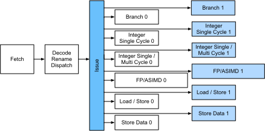
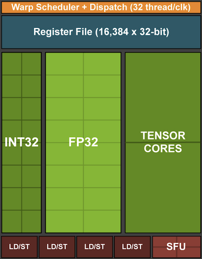

<!--
# Hardware
-->

# Phần cứng
:label:`sec_hardware`

<!--
Building systems with great performance requires a good understanding of the algorithms and models to capture the statistical aspects of the problem.
At the same time it is also indispensable to have at least a modicum of knowledge of the underlying hardware.
The current section is no substitute for a proper course on hardware and systems design.
Instead, it might serve as a starting point for understanding why some algorithms are more efficient than others and how to achieve good throughput.
Good design can easily make a difference of an order of magnitude and, in turn, this can make the difference between being able to train a network (e.g., in a week) 
or not at all (in 3 months, thus missing the deadline).
We will start by looking at computers.
Then we will zoom in to look more carefully at CPUs and GPUs.
Lastly we zoom out to review how multiple computers are connected in a server center or in the cloud.
This is not a GPU purchase guide.
For this review :numref:`sec_buy_gpu`.
An introduction to cloud computing with AWS can be found in :numref:`sec_aws`.
-->

Để xây dựng các hệ thống có hiệu năng cao, ta cần nắm chắc kiến thức về các thuật toán và mô hình để có thể biểu diễn được những khía cạnh thống kê của bài toán.
Đồng thời, ta cũng cần có một chút kiến thức cơ bản về phần cứng thực thi ở bên dưới.
Nội dung trong phần này không thể thay thế một khóa học đầy đủ về phần cứng và thiết kế hệ thống,
mà sẽ chỉ đóng vai trò như điểm bắt đầu để giúp người đọc hiểu tại sao một số thuật toán lại hiệu quả hơn các thuật toán khác và làm thế nào để đạt được thông lượng cao.
Thiết kế tốt có thể dễ dàng tạo ra sự khác biệt rất lớn, giữa việc có thể huấn luyện một mô hình (ví dụ trong khoảng một tuần) 
và không thể huấn luyện (ví dụ mất 3 tháng để huấn luyện xong, từ đó không kịp tiến độ). 
Ta sẽ bắt đầu bằng việc quan sát tổng thể một hệ thống máy tính.
Tiếp theo, ta sẽ đi sâu hơn và xem xét chi tiết về CPU và GPU.
Cuối cùng, ta sẽ tìm hiểu cách các máy tính được kết nối với nhau trong trạm máy chủ hay trên đám mây.
Cần lưu ý, phần này sẽ không hướng dẫn cách lựa chọn card GPU. 
Nếu bạn cần gợi ý, hãy xem :numref:`sec_buy_gpu`. 
Phần giới thiệu về điện toán đám mây trên AWS có thể tìm thấy tại :numref:`sec_aws`.

<!--
Impatient readers may be able to get by with :numref:`fig_latencynumbers`.
It is taken from Colin Scott's [interactive post](https://people.eecs.berkeley.edu/~rcs/research/interactive_latency.html) which gives a good overview of the progress over the past decade.
The original numbers are due to Jeff Dean's [Stanford talk from 2010](https://static.googleusercontent.com/media/research.google.com/en//people/jeff/Stanford-DL-Nov-2010.pdf).
The discussion below explains some of the rationale for these numbers and how they can guide us in designing algorithms.
The discussion below is very high level and cursory.
It is clearly *no substitute* for a proper course but rather just meant to provide enough information for a statistical modeler to make suitable design decisions.
For an in-depth overview of computer architecture we refer the reader to :cite:`Hennessy.Patterson.2011` or a recent course on the subject, 
such as the one by [Arste Asanovic](http://inst.eecs.berkeley.edu/~cs152/sp19/).
-->

Bạn đọc có thể tham khảo nhanh thông tin tóm tắt trong :numref:`fig_latencynumbers`.
Nội dung này được trích dẫn từ bài viết của [Colin Scott](https://people.eecs.berkeley.edu/~rcs/research/interactive_latency.html) trình bày tổng quan về những tiến bộ trong thập kỉ qua.
Số liệu gốc được trích dẫn từ buổi thảo luận của Jeff Dean tại [trường Stanford năm 2010](https://static.googleusercontent.com/media/research.google.com/en//people/jeff/Stanford-DL-Nov-2010.pdf).
Phần thảo luận dưới đây sẽ giải thích cơ sở cho những con số trên và cách mà chúng dẫn dắt ta trong quá trình thiết kế thuật toán.
Nội dung khái quát và ngắn gọn nên nó không thể thay thế một khóa học đầy đủ, nhưng sẽ cung cấp đủ thông tin cho những người làm mô hình thống kê để có thể đưa ra lựa chọn thiết kế phù hợp.
Để có cái nhìn tổng quan chuyên sâu về kiến trúc máy tính, bạn đọc có thể tham khảo :cite:`Hennessy.Patterson.2011` hay một khóa học gần đây của [Arste Asanovic](http://inst.eecs.berkeley.edu/~cs152/sp19/).

<!--

-->

:label:`fig_latencynumbers`

<!--
## Computers
-->

## Máy tính

<!--
Most deep learning researchers have access to a computer with a fair amount of memory, compute, some form of an accelerator such as a GPU, or multiples thereof. It consists of several key components:
-->

Hầu hết những nhà nghiên cứu học sâu đều được trang bị hệ thống máy tính có bộ nhớ và khả năng tính toán khá lớn với một hay nhiều GPU.
Những máy tính này thường có những thành phần chính sau:

<!--
* A processor, also referred to as CPU which is able to execute the programs we give it (in addition to running an operating system and many other things), typically consisting of 8 or more cores.
* Memory (RAM) to store and retrieve the results from computation, such as weight vectors, activations, often training data.
* An Ethernet network connection (sometimes multiple) with speeds ranging from 1Gbit/s to 100Gbit/s (on high end servers more advanced interconnects can be found).
* A high speed expansion bus (PCIe) to connect the system to one or more GPUs. Severs have up to 8 accelerators, 
often connected in an advanced topology, desktop systems have 1-2, depending on the budget of the user and the size of the power supply.
* Durable storage, such as a magnetic harddrive (HDD), solid state (SSD), in many cases connected using the PCIe bus, 
provides efficient transfer of training data to the system and storage of intermediate checkpoints as needed.
-->

* Bộ xử lý, thường được gọi là CPU, có khả năng thực thi các chương trình được nhập bởi người dùng (bên cạnh chức năng chạy hệ điều hành và các tác vụ khác), thường có 8 lõi (*core*) hoặc nhiều hơn.
* Bộ nhớ (RAM) được sử dụng để lưu trữ và truy xuất các kết quả tính toán như vector trọng số, giá trị kích hoạt và dữ liệu huấn luyện.
* Một hay nhiều kết nối Ethernet với tốc độ đường truyền từ 1 Gbit/s tới 100 Gbit/s (các máy chủ tân tiến còn có các phương thức kết nối cao cấp hơn nữa).
* Cổng giao tiếp bus mở rộng tốc độ cao (PCIe) kết nối hệ thống với một hay nhiều GPU. Các hệ thống máy chủ thường có tới 8 GPU được kết nối với nhau theo cấu trúc liên kết phức tạp.
Còn các hệ thống máy tính thông thường thì có 1-2 GPU, phụ thuộc vào túi tiền của người dùng và công suất nguồn điện.
* Bộ lưu trữ tốt, thường là ổ cứng từ (HDD) hay ổ cứng thể rắn (SSD), được kết nối bằng bus PCIe giúp truyền dữ liệu huấn luyện tới hệ thống và sao lưu các checkpoint trung gian một cách hiệu quả. 

<!--

-->

:label:`fig_mobo-symbol`

<!--
As :numref:`fig_mobo-symbol` indicates, most components (network, GPU, storage) are connected to the CPU across the PCI Express bus.
It consists of multiple lanes that are directly attached to the CPU.
For instance AMD's Threadripper 3 has 64 PCIe 4.0 lanes, each of which is capable 16 Gbit/s data transfer in both directions.
The memory is directly attached to the CPU with a total bandwidth of up to 100 GB/s.
-->

Hình :numref:`fig_mobo-symbol` cho thấy, hầu hết các thành phần (mạng, GPU, ổ lưu trữ) được kết nối tới GPU thông qua đường bus PCI mở rộng.
Đường truyền này gồm nhiều làn kết nối trực tiếp tới CPU.
Ví dụ, Threadripper 3 của AMD có 64 làn PCIe 4.0, mỗi làn có khả năng truyền dẫn 16 Gbit/s dữ liệu theo cả hai chiều.
Bộ nhớ được kết nối trực tiếp tới CPU với tổng băng thông lên đến 100 GB/s.

<!--
When we run code on a computer we need to shuffle data to the processors (CPU or GPU), perform computation and then move the results off the processor back to RAM and durable storage.
Hence, in order to get good performance we need to make sure that this works seamlessly without any one of the systems becoming a major bottleneck.
For instance, if we cannot load images quickly enough the processor will not have any work to do.
Likewise, if we cannot move matrices quickly enough to the CPU (or GPU), its processing elements will starve.
Finally, if we want to synchronize multiple computers across the network, the latter should not slow down computation. One option is to interleave communication and computation.
Let us have a look at the various components in more detail.
-->

Khi ta chạy chương trình trên máy tính, ta cần trộn dữ liệu ở các bộ xử lý (CPU hay GPU), thực hiện tính toán và sau đó truyền kết quả tới RAM hay ổ lưu trữ.
Do đó, để có hiệu năng tốt, ta cần đảm bảo rằng chương trình chạy mượt mà và hệ thống không có nút nghẽn cổ chai.
Ví dụ, nếu ta không thể tải ảnh đủ nhanh, bộ xử lý sẽ không có có dữ liệu để chạy.
Tương tự, nếu ta không thể truyền các ma trận tới CPU (hay GPU) đủ nhanh, bộ xử lý sẽ thiếu dữ liệu để hoạt động.
Cuối cùng, nếu ta muốn đồng bộ nhiều máy tính trong một mạng, kết nối mạng không nên làm chậm việc tính toán.
Xen kẽ việc giao tiếp và tính toán giữa các máy tính là một phương án cho vấn đề này.
Giờ hãy xem xét các thành phần trên một cách chi tiết hơn.

<!--
## Memory
-->

## Bộ nhớ

<!--
At its most basic memory is used to store data that needs to be readily accessible.
At present CPU RAM is typically of the [DDR4](https://en.wikipedia.org/wiki/DDR4_SDRAM) variety, offering 20-25GB/s bandwidth per module.
Each module has a 64 bit wide bus.
Typically pairs of memory modules are used to allow for multiple channels.
CPUs have between 2 and 4 memory channels, i.e., they have between 40GB/s and 100GB/s peak memory bandwidth.
Often there are two banks per channel. For instance AMD's Zen 3 Threadripper has 8 slots.
-->

Về cơ bản, bộ nhớ được sử dụng để lưu trữ dữ liệu khi cần sẵn sàng truy cập.
Hiện tại bộ nhớ RAM của CPU thường thuộc loại [DDR4](https://en.wikipedia.org/wiki/DDR4_SDRAM), trong đó mỗi mô-đun có băng thông 20-25GB/s và độ rộng bus 64 bit.
Thông thường, các cặp mô-đun bộ nhớ cho phép sử dụng đa kênh.
CPU có từ 2 đến 4 kênh bộ nhớ, nghĩa là chúng có băng thông bộ nhớ tối đa từ 40 GB/s đến 100 GB/s.
Thường thì mỗi kênh có hai dải (*bank*). Ví dụ, Zen 3 Threadripper của AMD có 8 khe cắm.

<!--
While these numbers are impressive, indeed, they only tell part of the story.
When we want to read a portion from memory we first need to tell the memory module where the information can be found.
That is, we first need to send the *address* to RAM.
Once this accomplished we can choose to read just a single 64bit record or a long sequence of records.
The latter is called *burst read*.
In a nutshell, sending an address to memory and setting up the transfer takes approximately 100ns (details depend on the specific timing coefficients of the memory chips used),
every subsequent transfer takes only 0.2ns.
In short, the first read is 500 times as expensive as subsequent ones!
We could perform up to $10,000,000$ random reads per second.
This suggests that we avoid random memory access as far as possible and use burst reads (and writes) instead.
-->

Dù những con số trên trông khá ấn tượng, trên thực tế chúng chỉ nói lên một phần nào đó.
Khi muốn đọc một phần nào đó từ bộ nhớ, trước tiên ta cần chỉ cho mô-đun bộ nhớ vị trí chứa thông tin, tức cần gửi *địa chỉ* đến RAM.
Khi thực hiện xong việc này, ta có thể chọn chỉ đọc một bản ghi 64 bit hoặc một chuỗi dài các bản ghi.
Lựa chọn thứ hai được gọi là *đọc nhanh* (*burst read*).
Nói ngắn gọn, việc gửi một địa chỉ vào bộ nhớ và thiết lập chuyển tiếp sẽ mất khoảng 100ns (thời gian cụ thể phụ thuộc vào hệ số thời gian của từng chip bộ nhớ được sử dụng),
mỗi lần chuyển tiếp sau đó chỉ mất 0.2ns.
Có thể thấy lần đọc đầu tiên tốn thời gian gấp 500 lần những lần sau!
Ta có thể đọc ngẫu nhiên tối đa $10,000,000$ lần mỗi giây.
Điều này cho thấy rằng ta nên hạn chế tối đa việc truy cập bộ nhớ ngẫu nhiên và thay vào đó nên sử dụng cách đọc (và ghi) nhanh (*burst read*, và *burst write*).

<!--
Matters are a bit more complex when we take into account that we have multiple banks.
Each bank can read memory largely independently.
This means two things: the effective number of random reads is up to 4x higher, provided that they are spread evenly across memory.
It also means that it is still a bad idea to perform random reads since burst reads are 4x faster, too.
Secondly, due to memory alignment to 64 bit boundaries it is a good idea to align any datastructures with the same boundaries.
Compilers do this pretty much [automatically](https://en.wikipedia.org/wiki/Data_structure_alignment) when the appropriate flags are set.
Curious readers are encouraged to review a lecture on DRAMs such as the one by [Zeshan Chishti](http://web.cecs.pdx.edu/~zeshan/ece585_lec5.pdf).
-->

Mọi thứ trở nên phức tạp hơn một chút khi ta tính đến việc có nhiều dải bộ nhớ.
Mỗi dải có thể đọc bộ nhớ gần như là độc lập với nhau.
Điều này có hai ý sau. 
Thứ nhất, số lần đọc ngẫu nhiên thực sự cao hơn tới 4 lần, miễn là chúng được trải đều trên bộ nhớ.
Điều đó cũng có nghĩa là việc thực hiện các lệnh đọc ngẫu nhiên vẫn không phải là một ý hay vì các lệnh đọc nhanh (*burst read*) cũng nhanh hơn gấp 4 lần.
Thứ hai, do việc căn chỉnh bộ nhớ theo biên 64 bit, ta nên căn chỉnh mọi cấu trúc dữ liệu theo cùng biên đó.
Trình biên dịch thực hiện việc này một cách [tự động](https://en.wikipedia.org/wiki/Data_structure_alocation) khi các cờ thích hợp được đặt.
Độc giả có thể tham khảo thêm bài giảng về DRAM ví dụ như [Zeshan Chishti](http://web.cecs.pdx.edu/~zeshan/ece585_lec5.pdf).

<!--
GPU memory is subject to even higher bandwidth requirements since they have many more processing elements than CPUs.
By and large there are two options to address them.
One is to make the memory bus significantly wider.
For instance NVIDIA's RTX 2080 Ti has a 352 bit wide bus.
This allows for much more information to be transferred at the same time.
Secondly, GPUs use specific high-performance memory.
Consumer grade devices, such as NVIDIA's RTX and Titan series typically use [GDDR6](https://en.wikipedia.org/wiki/GDDR6_SDRAM) chips with over 500 GB/s aggregate bandwidth.
An alternative is to use HBM (high bandwidth memory) modules.
They use a very different interface and connect directly with GPUs on a dedicated silicon wafer.
This makes them very expensive and their use is typically limited to high end server chips, such as the NVIDIA Volta V100 series of accelerators.
Quite unsurprisingly GPU memory is *much* smaller than CPU memory due to its higher cost.
For our purposes, by and large their performance characteristics are similar, just a lot faster.
We can safely ignore the details for the purpose of this book.
They only matter when tuning GPU kernels for high throughput.
-->

Bộ nhớ GPU còn yêu cầu băng thông cao hơn nữa vì chúng có nhiều phần tử xử lý hơn CPU.
Nhìn chung có hai phương án tiếp cận đối với vấn đề này.
Một cách là mở rộng bus bộ nhớ.
Chẳng hạn NVIDIA's RTX 2080 Ti dùng bus có kích thước 352 bit.
Điều này cho phép truyền đi lượng thông tin lớn hơn cùng lúc.
Một cách khác là sử dụng loại bộ nhớ chuyên biệt có hiệu năng cao cho GPU.
Các thiết bị hạng phổ thông, điển hình như dòng RTX và Titan của NVIDIA, dùng các chip [GDDR6](https://en.wikipedia.org/wiki/GDDR6_SDRAM) với băng thông tổng hợp hơn 500 GB/s.
Một loại bộ nhớ chuyên biệt khác là mô-đun HBM (bộ nhớ băng thông rộng).
Chúng dùng phương thức giao tiếp rất khác và kết nối trực tiếp với GPU trên một tấm bán dẫn silic chuyên biệt.
Điều này dẫn đến giá thành rất cao và chúng chỉ được sử dụng chủ yếu cho các chip máy chủ cao cấp, ví dụ như dòng GPU NVIDIA Volta V100.
Không quá ngạc nhiên, kích thước bộ nhớ GPU nhỏ hơn nhiều so với bộ nhớ CPU do giá thành cao của nó.
Nhìn chung các đặc tính hiệu năng của bộ nhớ GPU khá giống bộ nhớ CPU, nhưng nhanh hơn nhiều.
Ta có thể bỏ qua các chi tiết sâu hơn trong cuốn sách này,
do chúng chỉ quan trọng khi cần điều chỉnh các hạt nhân GPU để đạt thông lượng xử lý cao hơn.

<!--
## Storage
-->

## Lưu trữ

<!--
We saw that some of the key characteristics of RAM were *bandwidth* and *latency*.
The same is true for storage devices, just that the differences can be even more extreme.
-->

Chúng ta đã thấy đặc tính then chốt của RAM chính là *băng thông* và *độ trễ*.
Điều này cũng đúng đối với các thiết bị lưu trữ, sự khác biệt chỉ có thể là các đặc tính trên lớn hơn nhiều lần.

<!--
**Hard Disks** have been in use for over half a century.
In a nutshell they contain a number of spinning platters with heads that can be positioned to read / write at any given track.
High end end disks hold up to 16TB on 9 platters.
One of the key benefits of HDDs is that they are relatively inexpensive.
One of their many downsides are their typically catastrophic failure modes and their relatively high read latency.
-->

**Các ổ cứng** đã được sử dụng hơn nửa thế kỷ.
Một cách ngắn gọn, chúng chứa một số đĩa quay với những đầu kim có thể di chuyển để đọc/ghi ở bất cứ rãnh nào.
Các ổ đĩa cao cấp có thể lưu trữ lên tới 16 TB trên 9 đĩa.
Một trong những lợi ích chính của ổ đĩa cứng là chúng tương đối rẻ.
Nhược điểm của chúng là độ trễ tương đối cao khi đọc dữ liệu và hay bị hư hỏng nặng dẫn đến không thể đọc dữ liệu, thậm chí là mất dữ liệu.

<!--
To understand the latter, consider the fact that HDDs spin at around 7,200 RPM.
If they were much faster they would shatter due to the centrifugal force exerted on the platters.
This has a major downside when it comes to accessing a specific sector on the disk: we need to wait until the platter has rotated in position (we can move the heads but not accelerate the actual disks).
Hence it can take over 8ms until the requested data is available.
A common way this is expressed is to say that HDDs can operate at approximately 100 IOPs.
This number has essentially remained unchanged for the past two decades.
Worse still, it is equally difficult to increase bandwidth (it is in the order of 100-200 MB/s).
After all, each head reads a track of bits, hence the bit rate only scales with the square root of the information density.
As a result HDDs are quickly becoming relegated to archival storage and low-grade storage for very large datasets.
-->

Để hiểu về nhược điểm thứ hai, hãy xem xét thực tế rằng ổ cứng quay với tốc độ khoảng 7,200 vòng/phút.
Nếu tốc độ này cao hơn, các đĩa sẽ vỡ tan do tác dụng của lực ly tâm.
Điều này dẫn đến một nhược điểm lớn khi truy cập vào một khu vực cụ thể trên đĩa: chúng ta cần đợi cho đến khi đĩa quay đúng vị trí (chúng ta có thể di chuyển đầu kim nhưng không được tăng tốc các đĩa).
Do đó, có thể mất hơn 8ms cho đến khi truy cập được dữ liệu yêu cầu.
Vì thế mà ta hay nói ổ cứng có thể hoạt động ở mức xấp xỉ 100 IOP.
Con số này về cơ bản vẫn không thay đổi trong hai thập kỷ qua.
Tệ hơn nữa, việc tăng băng thông cũng khó khăn không kém (ở mức độ 100-200 MB/s). 
Rốt cuộc, mỗi đầu đọc một rãnh bit, do đó tốc độ bit chỉ tăng theo tỷ lệ căn bậc hai của mật độ thông tin.
Kết quả là các ổ cứng đang nhanh chóng biến thành nơi lưu trữ cấp thấp cho các bộ dữ liệu rất lớn. 

<!--
**Solid State Drives** use Flash memory to store information persistently.
This allows for *much faster* access to stored records.
Modern SSDs can operate at 100,000 to 500,000 IOPs, i.e., up to 3 orders of magnitude faster than HDDs.
Furthermore, their bandwidth can reach 1-3GB/s, i.e., one order of magnitude faster than HDDs.
These improvements sound almost too good to be true.
Indeed, they come with a number of caveats, due to the way SSDs are designed.
-->

**Ổ cứng thể rắn (SSD)** sử dụng bộ nhớ Flash để liên tục lưu trữ thông tin.
Điều này cho phép truy cập *nhanh hơn nhiều* vào các bản ghi đã được lưu trữ.
SSD hiện đại có thể hoạt động ở mức 100,000 đến 500,000 IOP, tức là nhanh hơn gấp 1000 lần so với ổ cứng HDD.
Hơn nữa, băng thông của chúng có thể đạt tới 1-3GB/s nghĩa là nhanh hơn 10 lần so với ổ cứng.
Những cải tiến này nghe có vẻ tốt đến mức khó tin.
Thật vậy, và SSD cũng đi kèm với một số hạn chế do cách mà chúng được thiết kế.

<!--
* SSDs store information in blocks (256 KB or larger).
They can only be written as a whole, which takes significant time.
Consequently bit-wise random writes on SSD have very poor performance.
Likewise, writing data in general takes significant time since the block has to be read, erased and then rewritten with new information.
By now SSD controllers and firmware have developed algorithms to mitigate this.
Nonetheless writes can be much slower, in particular for QLC (quad level cell) SSDs.
The key for improved performance is to maintain a *queue* of operations, to prefer reads and to write in large blocks if possible.
* The memory cells in SSDs wear out relatively quickly (often already after a few thousand writes).
Wear-level protection algorithms are able to spread the degradation over many cells.
That said, it is not recommended to use SSDs for swap files or for large aggregations of log-files.
* Lastly, the massive increase in bandwidth has forced computer designers to attach SSDs directly to the PCIe bus. 
The drives capable of handling this, referred to as NVMe (Non Volatile Memory enhanced), can use up to 4 PCIe lanes. 
This amounts to up to 8GB/s on PCIe 4.0.
-->

* Các ổ SSD lưu trữ thông tin theo khối (256 KB trở lên). 
Ta sẽ phải ghi cả khối cùng một lúc, mất thêm thời gian đáng kể.
Do đó việc ghi ngẫu nhiên theo bit trên SSD có hiệu suất rất tệ. 
Tương tự như vậy, việc ghi dữ liệu nói chung mất thời gian đáng kể vì khối phải được đọc, xóa và sau đó viết lại với thông tin mới.
Cho đến nay, bộ điều khiển và firmware của SSD đã phát triển các thuật toán để giảm thiểu vấn đề này. 
Tuy nhiên tốc độ ghi vẫn có thể chậm hơn nhiều, đặc biệt là đối với SSD QLC (ô bốn cấp).
Chìa khóa để cải thiện hiệu suất là đưa các thao tác vào một *hàng đợi* để ưu tiên việc đọc trước và chỉ ghi theo các khối lớn nếu có thể. 
* Các ô nhớ trong SSD bị hao mòn tương đối nhanh (thường sau vài nghìn lần ghi).
Các thuật toán bảo vệ mức hao mòn có thể phân bổ đều sự xuống cấp trên nhiều ô. 
Dù vậy, vẫn không nên sử dụng SSD cho các tệp hoán đổi (*swap file*) hoặc cho tập hợp lớn các tệp nhật ký (*log file*).
* Cuối cùng, sự gia tăng lớn về băng thông đã buộc các nhà thiết kế máy tính phải gắn SSD trực tiếp vào bus PCIe.
Các ổ đĩa có khả năng xử lý việc này, được gọi là NVMe (Bộ nhớ không biến động tăng cường - *Non Volatile Memory enhanced*), có thể sử dụng lên tới 4 làn PCIe. 
Băng thông có thể lên tới 8GB/s trên PCIe 4.0.

<!--
**Cloud Storage** provides a configurable range of performance.
That is, the assignment of storage to virtual machines is dynamic, both in terms of quantity and in terms speed, as chosen by the user.
We recommend that the user increase the provisioned number of IOPs whenever latency is too high, e.g., during training with many small records.
-->

**Lưu trữ đám mây** cung cấp nhiều lựa chọn hiệu suất có thể tùy chỉnh.
Nghĩa là, việc chỉ định bộ lưu trữ cho các máy ảo là tùy chỉnh, cả về số lượng và tốc độ, do người dùng quyết định.
Chúng tôi khuyên người dùng nên tăng số lượng IOP được cung cấp bất cứ khi nào độ trễ quá cao, ví dụ như trong quá trình huấn luyện với dữ liệu gồm nhiều bản ghi nhỏ.

<!--
## CPUs
-->

## CPU

<!--
Central Processing Units (CPUs) are the centerpiece of any computer (as before we give a very high level description focusing primarily on what matters for efficient deep learning models).
They consist of a number of key components: processor cores which are able to execute machine code, 
a bus connecting them (the specific topology differs significantly between processor models, generations and vendors), 
and caches to allow for higher bandwidth and lower latency memory access than what is possible by reads from main memory.
Lastly, almost all modern CPUs contain vector processing units to aid with high performance linear algebra and convolutions, as they are common in media processing and machine learning.
-->

Bộ xử lý trung tâm (Central Processing Units - CPU) là trung tâm của mọi máy tính (như ở phần trước, chúng tôi đã mô tả tổng quan về những phần cứng quan trọng cho các mô hình học sâu hiệu quả).
CPU gồm một số thành tố quan trọng: lõi xử lý (*core*) với khả năng thực thi mã máy,  
bus kết nối các lõi (cấu trúc kết nối cụ thể có sự khác biệt lớn giữa các mô hình xử lý, đời chip và nhà sản xuất)
và bộ nhớ đệm (*cache*) cho phép truy cập với băng thông cao hơn và độ trễ thấp hơn so với việc đọc từ bộ nhớ chính. 
Cuối cùng, hầu hết CPU hiện đại chứa những đơn vị xử lý vector để hỗ trợ tính toán đại số tuyến tính và tích chập với tốc độ cao vì chúng khá phổ biến trong xử lý phương tiện và học máy.

<!--

-->

:label:`fig_skylake`

<!--
:numref:`fig_skylake` depicts an Intel Skylake consumer grade quad-core CPU.
It has an integrated GPU, caches, and a ringbus connecting the four cores.
Peripherals (Ethernet, WiFi, Bluetooth, SSD controller, USB, etc.) are either part of the chipset or directly attached (PCIe) to the CPU.
-->

:numref:`fig_skylake` minh hoạ bộ xử lý Intel Skylake với CPU lõi tứ.
Nó có một GPU tích hợp, bộ nhớ cache và phương tiện kết nối bốn lõi.
Thiết bị ngoại vi (Ethernet, WiFi, Bluetooth, bộ điều khiển SSD, USB, v.v.) là một phần của chipset hoặc được đính kèm trực tiếp (PCIe) với CPU.

<!--
### Microarchitecture
-->

## Vi kiến trúc (Micro-architecture)

<!--
Each of the processor cores consists of a rather sophisticated set of components.
While details differ between generations and vendors, the basic functionality is pretty much standard.
The front end loads instructions and tries to predict which path will be taken (e.g., for control flow).
Instructions are then decoded from assembly code to microinstructions.
Assembly code is often not the lowest level code that a processor executes.
Instead, complex instructions may be decoded into a set of more lower level operations.
These are then processed by the actual execution core.
Often the latter is capable of performing many operations simultaneously.
For instance, the ARM Cortex A77 core of :numref:`fig_cortexa77` is able to perform up to 8 operations simultaneously.
-->

Mỗi nhân xử lý bao gồm các thành phần rất tinh vi.
Mặc dù chi tiết khác nhau giữa đời chip và nhà sản xuất, chức năng cơ bản của chúng đã được chuẩn hóa tương đối.
Front-end tải các lệnh và dự đoán nhánh nào sẽ được thực hiện (ví dụ: cho luồng điều khiển). 
Sau đó các lệnh được giải mã từ mã nguồn hợp ngữ (*assembly code*) thành vi lệnh.
Mã nguồn hợp ngữ thường chưa phải là mã nguồn cấp thấp nhất mà bộ xử lý thực thi.
Thay vào đó, các lệnh phức tạp có thể được giải mã thành một tập hợp các phép tính cấp thấp hơn.
Tiếp đó chúng được xử lý bằng một lõi thực thi.
Các bộ xử lý đời mới thường có khả năng thực hiện đồng thời nhiều câu lệnh.
Ví dụ, lõi ARM Cortex A77 trong :numref:`fig_cortexa77` có thể thực hiện lên đến 8 phép tính cùng một lúc.

<!--

-->

:label:`fig_cortexa77`

<!--
This means that efficient programs might be able to perform more than one instruction per clock cycle, *provided that* they can be carried out independently.
Not all units are created equal.
Some specialize in integer instructions whereas others are optimized for floating point performance.
To increase throughput the processor might also follow  multiple codepaths simultaneously in a branching instruction and then discard the results of the branch not taken.
This is why branch prediction units matter (on the frontend) such that only the most promising paths are pursued.
-->

Điều này có nghĩa là các chương trình hiệu quả có thể thực hiện nhiều hơn một lệnh trên một chu kỳ xung nhịp, *giả sử* rằng chúng có thể được thực hiện một cách độc lập.
Không phải tất cả các bộ xử lý đều được tạo ra như nhau.
Một số được thiết kế chuyên biệt cho các lệnh về số nguyên, trong khi một số khác được tối ưu hóa cho việc tính toán số thực dấu phẩy động.
Để tăng thông lượng, bộ xử lý cũng có thể theo đồng thời nhiều nhánh trong một lệnh rẽ nhánh và sau đó loại bỏ các kết quả của nhánh không được thực hiện.
Đây là lý do vì sao đơn vị dự đoán nhánh có vai trò quan trọng (trên front-end), bởi chúng chỉ chọn những nhánh có khả năng cao được rẽ.

<!--
### Vectorization
-->

## Vector hóa (Vectorization)

<!--
Deep learning is extremely compute hungry.
Hence, to make CPUs suitable for machine learning one needs to perform many operations in one clock cycle.
This is achieved via vector units.
They have different names: on ARM they are called NEON, on x86 the latest generation is referred to as [AVX2](https://en.wikipedia.org/wiki/Advanced_Vector_Extensions) units.
A common aspect is that they are able to perform SIMD (single instruction multiple data) operations.
:numref:`fig_neon128` shows how 8 short integers can be added in one clock cycle on ARM.
-->

Học sâu đòi hỏi sức mạnh tính toán cực kỳ lớn.
Vì vậy, CPU phù hợp với học máy cần phải thực hiện được nhiều thao tác trong một chu kỳ xung nhịp. 
Ta có thể đạt được điều này thông qua các đơn vị vector.
Trên chip ARM chúng được gọi là NEON, trên x86 thế hệ đơn vị vector mới nhất được gọi là [AVX2](https://en.wikipedia.org/wiki/Advanced_Vector_Extensions).
Một khía cạnh chung là chúng có thể thực hiện SIMD (đơn lệnh đa dữ liệu - *single instruction multiple data*). 
:numref:`fig_neon128` cho thấy cách cộng 8 số nguyên ngắn trong một chu kỳ xung nhịp trên ARM.

<!--

-->

:label:`fig_neon128`

<!--
Depending on architecture choices such registers are up to 512 bit long, allowing for the combination of up to 64 pairs of numbers.
For instance, we might be multiplying two numbers and adding them to a third, which is also known as a fused multiply-add.
Intel's [OpenVino](https://01.org/openvinotoolkit) uses these to achieve respectable throughput for deep learning on server grade CPUs.
Note, though, that this number is entirely dwarved by what GPUs are capable of achieving.
For instance, NVIDIA's RTX 2080 Ti has 4,352 CUDA cores, each of which is capable of processing such an operation at any time.
-->

Phụ thuộc vào các lựa chọn kiến trúc, các thanh ghi như vậy có thể dài tới 512 bit, cho phép tổ hợp tối đa 64 cặp số.
Chẳng hạn, ta có thể nhân hai số và cộng chúng với số thứ ba, cách này còn được biết đến như phép nhân-cộng hợp nhất (*fused multiply-add*).
[OpenVino](https://01.org/openvinotoolkit) của Intel sử dụng thao tác này để đạt được thông lượng đáng nể cho học sâu trên CPU máy chủ.
Tuy nhiên, xin lưu ý rằng tốc độ này hoàn toàn không đáng kể so với khả năng của GPU.
Ví dụ, RTX 2080 Ti của NVIDIA có 4,352 nhân CUDA, mỗi nhân có khả năng xử lý một phép tính như vậy tại bất cứ thời điểm nào.

<!--
### Cache
-->

## Bộ nhớ đệm

<!--
Consider the following situation: we have a modest CPU core with 4 cores as depicted in :numref:`fig_skylake` above, running at 2GHz frequency.
Moreover, let us assume that we have an IPC (instructions per clock) count of 1 and that the units have AVX2 with 256bit width enabled.
Let us furthermore assume that at least one of the registers used for AVX2 operations needs to be retrieved from memory.
This means that the CPU consumes 4x256bit = 1kbit of data per clock cycle.
Unless we are able to transfer $2 \cdot 10^9 \cdot 128 = 256 \cdot 10^9$ bytes to the processor per second the processing elements are going to starve.
Unfortunately the memory interface of such a chip only supports 20-40 GB/s data transfer, i.e., one order of magnitude less.
The fix is to avoid loading *new* data from memory as far as possible and rather to cache it locally on the CPU.
This is where caches come in handy (see this [Wikipedia article](https://en.wikipedia.org/wiki/Cache_hierarchy) for a primer).
Commonly the following names / concepts are used:
-->

Xét tình huống sau: ta có một CPU bình thường với 4 nhân như trong :numref:`fig_skylake` trên, hoạt động ở tần số 2 GHz.
Thêm nữa, hãy giả sử IPC (*instruction per clock* - số lệnh mỗi xung nhịp) là 1 và mỗi nhân đều đã kích hoạt AVX2 rộng 256 bit.
Ngoài ra, giả sử bộ nhớ cần truy cập ít nhất một thanh ghi được sử dụng trong các lệnh AVX2.
Điều này có nghĩa CPU xử lý 4 x 256 bit = 1 kbit dữ liệu mỗi chu kỳ xung nhịp.
Trừ khi ta có thể truyền $2 \cdot 10^9 \cdot 128 = 256 \cdot 10^9$ byte đến vi xử lý mỗi giây, các nhân sẽ thiếu dữ liệu để xử lý.
Tiếc thay giao diện bộ nhớ của bộ vi xử lý như trên chỉ hỗ trợ tốc độ truyền dữ liệu khoảng 20-40 GB/s, nghĩa là thấp hơn 10 lần.
Để khắc phục vấn đề này, ta cần tránh nạp dữ liệu *mới* từ bộ nhớ ngoài, và tốt hơn hết là lưu trong bộ nhớ cục bộ trên CPU.
Đây chính là lúc bộ nhớ đệm trở nên hữu ích (xem [bài viết trên Wikipedia](https://en.wikipedia.org/wiki/Cache_hierarchy) này để bắt đầu).
Một số tên gọi/khái niệm thường gặp:

<!--
* **Registers** are strictly speaking not part of the cache. They help stage instructions. 
That said, CPU registers are memory locations that a CPU can access at clock speed without any delay penalty. 
CPUs have tens of registers. It is up to the compiler (or programmer) to use registers efficiently. 
For instance the C programming language has a `register` keyword.
* **L1** caches are the first line of defense against high memory bandwidth requirements. 
L1 caches are tiny (typical sizes might be 32-64kB) and often split into data and instructions caches. 
When data is found in the L1 cache access is very fast. If it cannot be found there, the search progresses down the cache hierarchy.
* **L2** caches are the next stop. Depending on architecture design and processor size they might be exclusive. 
They might be accessible only by a given core or shared between multiple cores. 
L2 caches are larger (typically 256-512kB per core) and slower than L1. 
Furthermore, to access something in L2 we first need to check to realize that the data is not in L1, which adds a small amount of extra latency.
* **L3** caches are shared between multiple cores and can be quite large. 
AMD's Epyc 3 server CPUs have a whopping 256MB of cache spread across multiple chiplets. 
More typical numbers are in the 4-8MB range.
-->

* **Thanh ghi** không phải là một bộ phận của bộ nhớ đệm. Chúng hỗ trợ sắp xếp các câu lệnh cho CPU.
Nhưng dù sao thanh ghi cũng là một vùng nhớ mà CPU có thể truy cập với tốc độ xung nhịp mà không có độ trễ.
Các CPU thường có hàng chục thanh ghi. 
Việc sử dụng các thanh ghi sao cho hiệu quả hoàn toàn phụ thuộc vào trình biên dịch (hoặc lập trình viên).
Ví dụ như trong ngôn ngữ C, ta có thể sử dụng từ khóa `register` để lưu các biến vào thanh ghi thay vì bộ nhớ.
* Bộ nhớ đệm **L1** là lớp bảo vệ đầu tiên khi nhu cầu băng thông bộ nhớ quá cao.
Bộ nhớ đệm L1 rất nhỏ (kích thước điển hình khoảng 32-64 kB) và thường được chia thành bộ nhớ đệm dữ liệu và câu lệnh.
Nếu dữ liệu được tìm thấy trong bộ nhớ đệm L1, việc truy cập diễn ra rất nhanh chóng. Nếu không, việc tìm kiếm sẽ tiếp tục theo hệ thống phân cấp bộ nhớ đệm (*cache hierarchy*).
* Bộ nhớ đệm **L2** là điểm dừng tiếp theo. 
Vùng nhớ này có thể chuyên biệt tuỳ theo kiến trúc thiết kế và kích thước vi xử lý.
Nó có thể chỉ được truy cập từ một lõi nhất định hoặc được chia sẻ với nhiều lõi khác nhau.
Bộ nhớ đệm L2 có kích thước lớn hơn (thường là 256-512 kB mỗi lõi) và chậm hơn L1.
Hơn nữa, để truy cập vào dữ liệu trong L2, đầu tiên ta cần kiểm tra để chắc rằng dữ liệu đó không nằm trong L1, việc này làm tăng độ trễ lên một chút.
* Bộ nhớ đệm **L3** được sử dụng chung cho nhiều lõi khác nhau và có thể khá lớn.
CPU máy chủ Epyc 3 của AMD có bộ nhớ đệm 256MB cực lớn được phân bổ trên nhiều vi xử lý con (*chiplet*).
Thường thì kích thước của L3 nằm trong khoảng 4-8MB.

<!--
Predicting which memory elements will be needed next is one of the key optimization parameters in chip design.
For instance, it is advisable to traverse memory in a *forward* direction since most caching algorithms will try to *read ahead* rather than backwards.
Likewise, keeping memory access patterns local is agood way of improving performance.
Adding caches is a double-edge sword.
On one hand they ensure that the processor cores do not starve of data.
At the same time they increase chip size, using up area that otherwise could have been spent on increasing processing power.
Moreover, *cache misses* can be expensive.
Consider the worst case scenario, depicted in :numref:`fig_falsesharing`.
A memory location is cached on processor 0 when a thread on processor 1 requests the data.
To obtain it, processor 0 needs to stop what it is doing, write the information back to main memory and then let processor 1 read it from memory.
During this operation both processors wait.
Quite potentially such code runs *more slowly* on multiple processors when compared to an efficient single-processor implementation.
This is one more reason for why there is a practical limit to cache sizes (besides their physical size).
-->

Việc dự đoán phần tử bộ nhớ nào sẽ cần tiếp theo là một trong những tham số tối ưu chính trong thiết kế vi xử lý.
Ví dụ, việc duyệt *xuôi* bộ nhớ được coi là thích hợp do đa số các thuật toán ghi đệm (*caching algorithms*) sẽ cố gắng *đọc về trước* hơn là về sau.
Tương tự, việc giữ hành vi truy cập bộ nhớ ở mức cục bộ là một cách tốt để cải thiện hiệu năng.
Tăng số lượng bộ nhớ đệm là một con dao hai lưỡi.
Một mặt việc này đảm bảo các nhân vi xử lý không bị thiếu dữ liệu.
Mặt khác nó tăng kích thước vi xử lý, lấn chiếm phần diện tích mà đáng ra có thể được sử dụng vào việc tăng khả năng xử lý.
Xét trường hợp tệ nhất như mô tả trong :numref:`fig_falsesharing`.
Một địa chỉ bộ nhớ được lưu trữ tại vi xử lý 0 trong khi một luồng của vi xử lý 1 yêu cầu dữ liệu đó.
Để có thể lấy dữ liệu, vi xử lý 0 phải dừng công việc đang thực hiện, ghi lại thông tin vào bộ nhớ chính để vi xử lý 1 đọc dữ liệu từ đó.
Trong suốt quá trình này, cả hai vi xử lý đều ở trong trạng thái chờ.
Một đoạn mã như vậy khả năng cao là sẽ chạy *chậm hơn* trên một hệ đa vi xử lý so với một vi xử lý đơn được lập trình hiệu quả.
Đây là một lý do nữa cho việc tại sao thực tế phải giới hạn kích thước bộ nhớ đệm (ngoài việc chiếm diện tích vật lý).

<!--

-->

:label:`fig_falsesharing`

<!--
## GPUs and other Accelerators
-->

## GPU và các Thiết bị Tăng tốc khác

<!--
It is not an exaggeration to claim that deep learning would not have been successful without GPUs.
By the same token, it is quite reasonable to argue that GPU manufacturers' fortunes have been increased significantly due to deep learning.
This co-evolution of hardware and algorithms has led to a situation where for better or worse deep learning is the preferable statistical modeling paradigm.
Hence it pays to understand the specific benefits that GPUs and related accelerators such as the TPU :cite:`Jouppi.Young.Patil.ea.2017` offer.
-->

Không hề phóng đại khi nói rằng học sâu có lẽ sẽ không thành công nếu không có GPU.
Và cũng nhờ có học sâu mà tài sản của các công ty sản suất GPU tăng trưởng đáng kể.
Sự đồng tiến hóa giữa phần cứng và các thuật toán dẫn tới tình huống mà học sâu trở thành mẫu mô hình thống kê được ưa thích bất kể có hiệu quả hay không.
Do đó, ta cần phải hiểu rõ ràng lợi ích mà GPU và các thiết bị tăng tốc khác như TPU :cite:`Jouppi.Young.Patil.ea.2017` mang lại.

<!--
Of note is a distinction that is often made in practice: accelerators are optimized either for training or inference.
For the latter we only need to compute the forward pass in a network.
No storage of intermediate data is needed for backpropagation.
Moreover, we may not need very precise computation (FP16 or INT8 typically suffice).
On the other hand, during training all intermediate results need storing to compute gradients.
Moreover, accumulating gradients requires higher precision to avoid numerical underflow (or overflow).
This means that FP16 (or mixed precision with FP32) is the minimum required.
All of this necessitates faster and larger memory (HBM2 vs. GDDR6) and more processing power.
For instance, NVIDIA's [Turing](https://devblogs.nvidia.com/nvidia-turing-architecture-in-depth/) T4 GPUs are optimized for inference whereas the V100 GPUs are preferable for training.
-->

Ta cần chú ý đến đặc thù thường được sử dụng trong thực tế: thiết bị tăng tốc được tối ưu hoặc cho bước huấn luyện hoặc cho bước suy luận.
Đối với bước suy luận, ta chỉ cần tính toán lượt truyền xuôi qua mạng,
không cần sử dụng bộ nhớ để lưu dữ liệu trung gian ở bước lan truyền ngược.
Hơn nữa, ta có thể không cần đến phép tính quá chính xác (thường thì FP16 hoặc INT8 là đủ)
Mặt khác trong quá trình huấn luyện, tất cả kết quả trung gian đều cần phải lưu lại để tính gradient.
Hơn nữa, việc tích luỹ gradient yêu cầu độ chính xác cao hơn nhằm tránh lỗi tràn số trên hoặc dưới,
do đó bước huấn luyện yêu cầu tối thiểu độ chính xác FP16 (hoặc độ chính xác hỗn hợp khi kết hợp với FP32).
Tất cả các yếu tố trên đòi hỏi bộ nhớ nhanh hơn và lớn hơn (HBM2 hoặc GDDR6) và nhiều khả năng xử lý hơn.
Ví dụ, GPU [Turing](https://devblogs.nvidia.com/nvidia-turing-architecture-in-depth/) T4 của NVIDIA được tối ưu cho bước suy luận trong khi GPU V100 phù hợp cho quá trình huấn luyện.

<!--
Recall :numref:`fig_neon128`. Adding vector units to a processor core allowed us to increase throughput significantly (in the example in the figure we were able to perform 16 operations simultaneously).
What if we added operations that optimized not just operations between vectors but also between matrices?
This strategy led to Tensor Cores (more on this shortly).
Secondly, what if we added many more cores?
In a nutshell, these two strategies summarize the design decisions in GPUs.
:numref:`fig_turing_processing_block` gives an overview over a basic processing block.
It contains 16 integer and 16 floating point units.
In addition to that, two Tensor Cores accelerate a narrow subset of additional operations relevant for deep learning.
Each Streaming Multiprocessor (SM) consists of four such blocks.
-->

Xem lại :numref:`fig_neon128`. Việc thêm các đơn vị vector vào lõi vi xử lý cho phép ta tăng đáng kể thông lượng xử lý (ở ví dụ trong hình ta có thể thực hiện 16 thao tác cùng lúc).
Chuyện gì sẽ xảy ra nếu ta không chỉ tối ưu cho phép tính giữa các vector mà còn tối ưu cho các ma trận?
Chiến lược này dẫn tới sự ra đời của Lõi Tensor (chi tiết sẽ được thảo luận sau đây).
Thứ hai, nếu tăng số lượng lõi thì sao?
Nói tóm lại, hai chiến lược trên tóm tắt việc quyết định thiết kế của GPU.
:numref:`fig_turing_processing_block` mô tả tổng quan một khối xử lý đơn giản,
bao gồm 16 đơn vị số nguyên và 16 đơn vị dấu phẩy động.
Thêm vào đó, hai Lõi Tensor xử lý một tập nhỏ các thao thác liên quan đến học sâu được thêm vào.
Mỗi Hệ vi xử lý Luồng (*Streaming Multiprocessor* - SM) bao gồm bốn khối như vậy.

<!--

-->

:width:`150px`
:label:`fig_turing_processing_block`

<!--
12 streaming multiprocessors are then grouped into graphics processing clusters which make up the high-end TU102 processors.
Ample memory channels and an L2 cache complement the setup.
:numref:`fig_turing` has the relevant details.
One of the reasons for designing such a device is that individual blocks can be added or removed as needed to allow for more compact chips and to deal with yield issues (faulty modules might not be activated).
Fortunately programming such devices is well hidden from the casual deep learning researcher beneath layers of CUDA and framework code.
In particular, more than one of the programs might well be executed simultaneously on the GPU, provided that there are available resources.
Nonetheless it pays to be aware of the limitations of the devices to avoid picking models that do not fit into device memory.
-->

12 hệ vi xử lý luồng sau đó được nhóm vào một cụm xử lý đồ hoạ tạo nên vi xử lý cao cấp TU102.
Số lượng kênh bộ nhớ phong phú và bộ nhớ đệm L2 được bổ sung vào cấu trúc.
Thông tin chi tiết được mô tả trong :numref:`fig_turing`.
Một trong những lý do để thiết kế một thiết bị như vậy là từng khối riêng biệt có thể được thêm vào hoặc bỏ đi tuỳ theo nhu cầu để có thể tạo thành một vi xử lý nhỏ gọn và giải quyết một số vấn đề phát sinh (các mô-đun lỗi có thể không được kích hoạt).
May mắn thay, các nhà nghiên cứu học sâu bình thường không cần lập trình cho các thiết bị này do đã có các lớp mã nguồn framework CUDA ở tầng thấp.
Cụ thể, có thể có nhiều hơn một chương trình được thực thi đồng thời trên GPU, với điều kiện là còn đủ tài nguyên.
Tuy nhiên ta cũng cần để ý đến giới hạn của các thiết bị nhằm tránh việc lựa chọn mô hình quá lớn so với bộ nhớ của thiết bị.

<!--

-->

:width:`350px`
:label:`fig_turing`

<!--
A last aspect that is worth mentioning in more detail are TensorCores.
They are an example of a recent trend of adding more optimized circuits that are specifically effective for deep learning.
For instance, the TPU added a systolic array :cite:`Kung.1988` for fast matrix multiplication.
There the design was to support a very small number (one for the first generation of TPUs) of large operations.
TensorCores are at the other end.
They are optimized for small operations involving between 4x4 and 16x16 matrices, depending on their numerical precision.
:numref:`fig_tensorcore` gives an overview of the optimizations.
-->

Khía cạnh cuối cùng đáng để bàn luận chi tiết là Lõi Tensor (*TensorCore*).
Đây là một ví dụ của xu hướng gần đây là sử dụng thêm nhiều mạch đã được tối ưu để tăng hiệu năng cho học sâu.
Ví dụ, TPU có thêm một mảng tâm thu (*systolic array*) :cite:`Kung.1988` để tăng tốc độ nhân ma trận.
Thiết kế của TPU chỉ hỗ trợ một số lượng rất ít các phép tính kích thước lớn (thế hệ TPU đầu tiên hỗ trợ một phép tính).
Lõi Tensor thì ngược lại,
được tối ưu cho các phép tính kích thước nhỏ cho các ma trận kích thước 4x4 đến 16x16, tuỳ vào độ chính xác số học.
:numref:`fig_tensorcore` mô tả tổng quan quá trình tối ưu.

<!--

-->

:width:`400px`
:label:`fig_tensorcore`

<!--
Obviously when optimizing for computation we end up making certain compromises.
One of them is that GPUs are not very good at handling interrupts and sparse data.
While there are notable exceptions, such as [Gunrock](https://github.com/gunrock/gunrock) :cite:`Wang.Davidson.Pan.ea.2016`, 
the access pattern of sparse matrices and vectors do not go well with the high bandwidth burst read operations where GPUs excel.
Matching both goals is an area of active research.
See e.g., [DGL](http://dgl.ai), a library tuned for deep learning on graphs.
-->

Đương nhiên khi tối ưu cho quá trình tính toán, ta buộc phải có một số đánh đổi nhất định.
Một trong số đó là GPU không xử lý tốt dữ liệu ngắt quãng hoặc thưa.
Trừ một số ngoại lệ đáng chú ý, ví dụ như [Gunrock](https://github.com/gunrock/gunrock) :cite:`Wang.Davidson.Pan.ea.2016`,
việc truy cập vector và ma trận thưa không phù hợp với các thao tác đọc theo cụm (*burst read*) với băng thông cao của GPU.
Đạt được cả hai mục tiêu là một lĩnh vực đang được đẩy mạnh nghiên cứu.
Ví dụ, tham khảo [DGL](http://dgl.ai), một thư viện được điều chỉnh cho phù hợp với học sâu trên đồ thị.

<!--
## Networks and Buses
-->

## Mạng máy tính và Bus

<!--
Whenever a single device is insufficient for optimization we need to transfer data to and from it to synchronize processing.
This is where networks and buses come in handy.
We have a number of design parameters: bandwidth, cost, distance and flexibility.
On one end we have WiFi which has a pretty good range, is very easy to use (no wires, after all), cheap but it offers comparatively mediocre bandwidth and latency.
No machine learning researcher within their right mind would use it to build a cluster of servers.
In what follows we focus on interconnects that are suitable for deep learning.
-->

Mỗi khi một thiết bị đơn không đủ cho quá trình tối ưu, ta cần chuyển dữ liệu đến và đi khỏi nó để đồng bộ hóa quá trình xử lý.
Đây chính là lúc mà mạng máy tính và bus trở nên hữu dụng.
Ta có một vài tham số thiết kế gồm: băng thông, chi phí, khoảng cách và tính linh hoạt.
Tuy ta cũng có Wifi với phạm vi hoạt động tốt, dễ dàng để sử dụng (dù sao cũng là không dây), rẻ nhưng lại có băng thông không quá tốt và độ trễ lớn.
Sẽ không có bất cứ nhà nghiên cứu học máy tỉnh táo nào lại nghĩ đến việc sử dụng Wifi để xây dựng một cụm máy chủ.
Sau đây, ta sẽ chỉ tập trung vào các cách kết nối phù hợp cho học sâu.

<!--
* **PCIe** is a dedicated bus for very high bandwidth point to point connections (up to 16 Gbs on PCIe 4.0) per lane.
Latency is in the order of single-digit microseconds (5 μs).
PCIe links are precious.
Processors only have a limited number of them: AMD's EPYC 3 has 128 lanes, Intel's Xeon has up to 48 lanes per chip; on desktop grade CPUs the numbers are 20 (Ryzen 9) and 16 (Core i9) respectively.
Since GPUs have typically 16 lanes this limits the number of GPUs that can connect to the CPU at full bandwidth.
After all, they need to share the links with other high bandwidth peripherals such as storage and Ethernet.
Just like with RAM access, large bulk transfers are preferable due to reduced packet overhead.
* **Ethernet** is the most commonly used way of connecting computers.
While it is significantly slower than PCIe, it is very cheap and resilient to install and covers much longer distances.
Typical bandwidth for low-grade servers is 1 GBit/s.
Higher end devices (e.g., [C5 instances](https://aws.amazon.com/ec2/instance-types/c5/) in the cloud) offer between 10 and 100 GBit/s bandwidth.
As in all previous cases data transmission has significant overheads.
Note that we almost never use raw Ethernet directly but rather a protocol that is executed on top of the physical interconnect (such as UDP or TCP/IP).
This adds further overhead.
Like PCIe, Ethernet is designed to connect two devices, e.g., a computer and a switch.
* **Switches** allow us to connect multiple devices in a manner where any pair of them can carry out a (typically full bandwidth) point to point connection simultaneously.
For instance, Ethernet switches might connect 40 servers at high cross-sectional bandwidth.
Note that switches are not unique to traditional computer networks.
Even PCIe lanes can be [switched](https://www.broadcom.com/products/pcie-switches-bridges/pcie-switches).
This occurs e.g., to connect a large number of GPUs to a host processor, as is the case for the [P2 instances](https://aws.amazon.com/ec2/instance-types/p2/).
* **NVLink** is an alternative to PCIe when it comes to very high bandwidth interconnects.
It offers up to 300 Gbit/s data transfer rate per link.
Server GPUs (Volta V100) have 6 links whereas consumer grade GPUs (RTX 2080 Ti) have only one link, operating at a reduced 100 Gbit/s rate.
We recommend to use [NCCL](https://github.com/NVIDIA/nccl) to achieve high data transfer between GPUs.
-->

* **PCIe** là một bus riêng chỉ phục vụ cho kết nối điểm – điểm với băng thông trên mỗi làn rất lớn (lên đến 16 GB/s trên PCIe 4.0).
Độ trễ thường có giá trị cỡ vài micro giây (5 μs).
Kết nối PCIe khá quan trọng.
Vi xử lý chỉ có một số lượng làn PCIe nhất định: EPYC 3 của AMD có 128 làn, Xeon của Intel lên đến 48 làn cho mỗi chip; 
trên CPU dùng cho máy tính để bàn, số lượng này lần lượt là 20 (với Ryzen 9) và 16 (với Core i9).
Do GPU thường có 16 luồng nên số lượng GPU có thể kết nối với CPU bị giới hạn tại băng thông tối đa.
Xét cho cùng, chúng cần chia sẻ liên kết với các thiết bị ngoại vi khác như bộ nhớ và cổng Ethernet.
Giống như việc truy cập RAM, việc truyền lượng lớn dữ liệu thường được ưa chuộng hơn nhằm giảm tổng chi phí theo gói tin.
* **Ethernet** là cách phổ biến nhất để kết nối máy tính với nhau.
Dù nó chậm hơn đáng kể so với PCIe, nó rất rẻ và dễ cài đặt, bao phủ khoảng cách lớn hơn nhiều.
Băng thông đặc trưng đối với máy chủ cấp thấp là 1 GBit/s.
Các thiết bị cao cấp hơn (ví dụ như [máy chủ loại C5](https://aws.amazon.com/ec2/instance-types/c5/) trên AWS) cung cấp băng thông từ 10 đến 100 GBit/s.
Cũng như các trường hợp trên, việc truyền dữ liệu có tổng chi phí đáng kể. 
Chú ý rằng ta hầu như không bao giờ sử dụng trực tiếp Ethernet thuần mà sử dụng một giao thức được thực thi ở tầng trên của kết nối vật lý (ví dụ như UDP hay TCP/IP).
Việc này làm tăng tổng chi phí.
Giống như PCIe, Ethernet được thiết kế để kết nối hai thiết bị, ví dụ như máy tính với một bộ chuyển mạch (*switch*).
* **Bộ chuyển mạch** cho phép ta kết nối nhiều thiết bị theo cách mà bất cứ cặp thiết bị nào cũng có thể (thường là với băng thông tối đa) thực hiện kết nối điểm – điểm cùng lúc.
Ví dụ, bộ chuyển mạch Ethernet có thể kết nối 40 máy chủ với băng thông xuyên vùng (*cross-sectional bandwidth*) cao.
Chú ý rằng bộ chuyển mạch không phải chỉ có trong mạng máy tính truyền thống.
Ngay cả làn PCIe cũng có thể [chuyển mạch](https://www.broadcom.com/products/pcie-switches-bridges/pcie-switches).
Điều này xảy ra khi kết nối một lượng lớn GPU tới vi xử lý chính, như với trường hợp [máy chủ loại P2](https://aws.amazon.com/ec2/instance-types/p2/).
* **NVLink** là một phương pháp thay thế PCIe khi ta cần kết nối với băng thông rất lớn.
NVLink cung cấp tốc độ truyền dữ liệu lên đến 300 Gbit/s mỗi đường dẫn (*link*).
GPU máy chủ (Volta V100) có 6 đường dẫn, trong khi GPU thông dụng (RTX 2080 Ti) chỉ có một đường dẫn, hoạt động ở tốc độ thấp 100 Gbit/s.
Vì vậy, chúng tôi gợi ý sử dụng [NCCL](https://github.com/NVIDIA/nccl) để có thể đạt được tốc độ truyền dữ liệu cao giữa các GPU.

## Tóm tắt

<!--
* Devices have overheads for operations. Hence it is important to aim for a small number of large transfers rather than many small ones. This applies to RAM, SSDs, Networks and GPUs.
* Vectorization is key for performance. Make sure you are aware of the specific abilities of your accelerator.
E.g., some Intel Xeon CPUs are particularly good for INT8 operations, NVIDIA Volta GPUs excel at FP16 matrix-matrix operations and NVIDIA Turing shines at FP16, INT8 and INT4 operations.
* Numerical overflow due to small datatypes can be a problem during training (and to a lesser extent during inference).
* Aliasing can significantly degrade performance. For instance, memory alignment on 64 bit CPUs should be done with respect to 64 bit boundaries.
On GPUs it is a good idea to keep convolution sizes aligned e.g., to TensorCores.
* Match your algorithms to the hardware (memory footprint, bandwidth, etc.). Great speedup (orders of magnitude) can be achieved when fitting the parameters into caches.
* We recommend that you sketch out the performance of a novel algorithm on paper before verifying the experimental results. Discrepancies of an order-of-magnitude or more are reasons for concern.
* Use profilers to debug performance bottlenecks.
* Training and inference hardware have different sweet spots in terms of price / performance.
-->

* Các thiết bị đều có chi phí phụ trợ trên mỗi hành động. 
Do đó ta nên nhắm tới việc di chuyển ít lần các lượng dữ liệu lớn thay vì di chuyển nhiều lần các lượng dữ liệu nhỏ.
Điều này đúng với RAM, SSD, các thiết bị mạng và GPU.
* Vector hóa rất quan trọng để tăng hiệu năng. Hãy đảm bảo bạn hiểu các điểm mạnh đặc thù của thiết bị tăng tốc mình đang có.
Ví dụ, một vài CPU Intel Xeon thực hiện cực kỳ hiệu quả phép toán với dữ liệu kiểu INT8, 
GPU NVIDIA Volta rất phù hợp với các phép toán với ma trận dữ liệu kiểu FP16; 
còn NVIDIA Turing chạy tốt cho cả các phép toán với dữ liệu kiểu FP16, INT8, INT4.
* Hiện tượng tràn số trên do kiểu dữ liệu không đủ số bit để biểu diễn giá trị có thể là một vấn đề khi huấn luyện (và cả khi suy luận, dù ít nghiêm trọng hơn).
* Việc cùng dữ liệu nhưng có nhiều địa chỉ (*aliasing*) có thể làm giảm đáng kể hiệu năng. Ví dụ, việc sắp xếp dữ liệu trong bộ nhớ (*memory alignment*) trên CPU 64 bit nên được thực hiện theo từng khối 64 bit.
Trên GPU, tốt hơn là nên giữ kích thước tích chập đồng bộ, với TensorCores chẳng hạn.
* Sử dụng thuật toán phù hợp với phần cứng (về mức chiếm dụng bộ nhớ, băng thông, v.v).
Thời gian thực thi có thể giảm hàng trăm ngàn lần khi tất cả tham số đều được chứa trong bộ đệm.
* Chúng tôi khuyến khích bạn đọc tính toán trước hiệu năng của một thuật toán mới trước khi kiểm tra bằng thực nghiệm.
Sự khác biệt lên tới hàng chục lần hoặc hơn là dấu hiệu cần quan tâm.
* Sử dụng các công cụ phân tích hiệu năng (*profiler*) để tìm điểm nghẽn cổ chai của hệ thống.
* Phần cứng sử dụng cho huấn luyện và suy luận có các cấu hình hiệu quả khác nhau để cân đối giá tiền và hiệu năng.

<!--
## More Latency Numbers
-->

## Độ trễ

<!--
The summary in :numref:`table_latency_numbers` and :numref:`table_latency_numbers_tesla` are due to [Eliot Eshelman](https://gist.github.com/eshelman) 
who maintains an updated version of the numbers as a [GitHub Gist](https://gist.github.com/eshelman/343a1c46cb3fba142c1afdcdeec17646).
-->

Các thông tin trong :numref:`table_latency_numbers` và :numref:`table_latency_numbers_tesla` được [Eliot Eshelman](https://gist.github.com/eshelman) duy trì cập nhật trên [GitHub Gist](https://gist.github.com/eshelman/343a1c46cb3fba142c1afdcdeec17646).

<!--
:Common Latency Numbers.
-->

:Các độ trễ thường gặp.

<!--
| Action                                     | Time   | Notes                                           |
| :----------------------------------------- | -----: | :---------------------------------------------- |
| L1 cache reference/hit                     | 1.5 ns | 4 cycles                                        |
| Floating-point add/mult/FMA                | 1.5 ns | 4 cycles                                        |
| L2 cache reference/hit                     |   5 ns | 12 ~ 17 cycles                                  |
| Branch mispredict                          |   6 ns | 15 ~ 20 cycles                                  |
| L3 cache hit (unshared cache)              |  16 ns | 42 cycles                                       |
| L3 cache hit (shared in another core)      |  25 ns | 65 cycles                                       |
| Mutex lock/unlock                          |  25 ns |                                                 |
| L3 cache hit (modified in another core)    |  29 ns | 75 cycles                                       |
| L3 cache hit (on a remote CPU socket)      |  40 ns | 100 ~ 300 cycles (40 ~ 116 ns)                  |
| QPI hop to a another CPU (per hop)         |  40 ns |                                                 |
| 64MB memory ref. (local CPU)               |  46 ns | TinyMemBench on Broadwell E5-2690v4             |
| 64MB memory ref. (remote CPU)              |  70 ns | TinyMemBench on Broadwell E5-2690v4             |
| 256MB memory ref. (local CPU)              |  75 ns | TinyMemBench on Broadwell E5-2690v4             |
| Intel Optane random write                  |  94 ns | UCSD Non-Volatile Systems Lab                   |
| 256MB memory ref. (remote CPU)             | 120 ns | TinyMemBench on Broadwell E5-2690v4             |
| Intel Optane random read                   | 305 ns | UCSD Non-Volatile Systems Lab                   |
| Send 4KB over 100 Gbps HPC fabric          |   1 μs | MVAPICH2 over Intel Omni-Path                   |
| Compress 1KB with Google Snappy            |   3 μs |                                                 |
| Send 4KB over 10 Gbps ethernet             |  10 μs |                                                 |
| Write 4KB randomly to NVMe SSD             |  30 μs | DC P3608 NVMe SSD (QOS 99% is 500μs)            |
| Transfer 1MB to/from NVLink GPU            |  30 μs | ~33GB/s on NVIDIA 40GB NVLink                   |
| Transfer 1MB to/from PCI-E GPU             |  80 μs | ~12GB/s on PCIe 3.0 x16 link                    |
| Read 4KB randomly from NVMe SSD            | 120 μs | DC P3608 NVMe SSD (QOS 99%)                     |
| Read 1MB sequentially from NVMe SSD        | 208 μs | ~4.8GB/s DC P3608 NVMe SSD                      |
| Write 4KB randomly to SATA SSD             | 500 μs | DC S3510 SATA SSD (QOS 99.9%)                   |
| Read 4KB randomly from SATA SSD            | 500 μs | DC S3510 SATA SSD (QOS 99.9%)                   |
| Round trip within same datacenter          | 500 μs | One-way ping is ~250μs                          |
| Read 1MB sequentially from SATA SSD        |   2 ms | ~550MB/s DC S3510 SATA SSD                      |
| Read 1MB sequentially from disk            |   5 ms | ~200MB/s server HDD                             |
| Random Disk Access (seek+rotation)         |  10 ms |                                                 |
| Send packet CA->Netherlands->CA            | 150 ms |                                                 |
-->

| Hoạt động                                                   | Thời gian | Chú thích                                       |
| :---------------------------------------------------------- | --------: | :---------------------------------------------- |
| Truy xuất bộ đệm L1                                         | 1.5 ns    | 4 chu kỳ                                        |
| Cộng, nhân, cộng kết hợp nhân (*FMA*) số thực dấu phẩy động | 1.5 ns    | 4 chu kỳ                                        |
| Truy xuất bộ đệm L2                                         |   5 ns    | 12 ~ 17 chu kỳ                                  |
| Rẽ nhánh sai                                                |   6 ns    | 15 ~ 20 chu kỳ                                  |
| Truy xuất bộ đệm L3 (không chia sẻ)                         |  16 ns    | 42 chu kỳ                                       |
| Truy xuất bộ đệm L3 (chia sẻ với nhân khác)                 |  25 ns    | 65 chu kỳ                                       |
| Khóa/mở đèn báo lập trình (*mutex*)                         |  25 ns    |                                                 |
| Truy xuất bộ đệm L3 (được nhân khác thay đổi)               |  29 ns    | 75 chu kỳ                                       |
| Truy xuất bộ đệm L3 (tại CPU socket từ xa)                  |  40 ns    | 100 ~ 300 chu kỳ (40 ~ 116 ns)                  |
| QPI hop đến CPU khác (cho mỗi hop)                          |  40 ns    |                                                 |
| Truy xuất 64MB (CPU cục bộ)                                 |  46 ns    | TinyMemBench trên Broadwell E5-2690v4           |
| Truy xuất 64MB (CPU từ xa)                                  |  70 ns    | TinyMemBench trên Broadwell E5-2690v4           |
| Truy xuất 256MB (CPU cục bộ)                                |  75 ns    | TinyMemBench trên Broadwell E5-2690v4           |
| Ghi ngẫu nhiên vào Intel Optane                             |  94 ns    | UCSD Non-Volatile Systems Lab                   |
| Truy xuất 256MB (CPU từ xa)                                 | 120 ns    | TinyMemBench trên Broadwell E5-2690v4           |
| Đọc ngẫu nhiên từ Intel Optane                              | 305 ns    | UCSD Non-Volatile Systems Lab                   |
| Truyền 4KB trên sợi HPC 100 Gbps                            |   1 μs    | MVAPICH2 trên Intel Omni-Path                   |
| Nén 1KB với Google Snappy                                   |   3 μs    |                                                 |
| Truyền 4KB trên cáp mạng 10 Gbps                            |  10 μs    |                                                 |
| Ghi ngẫu nhiên 4KB vào SSD NVMe                             |  30 μs    | DC P3608 SSD NVMe (QOS 99% khoảng 500μs)        |
| Truyền 1MB từ/đến NVLink GPU                                |  30 μs    | ~33GB/s trên NVIDIA 40GB NVLink                 |
| Truyền 1MB từ/đến PCI-E GPU                                 |  80 μs    | ~12GB/s trên PCIe 3.0 x16 link                  |
| Đọc ngẫu nhiên 4KB từ SSD NVMe                              | 120 μs    | DC P3608 SSD NVMe (QOS 99%)                     |
| Đọc tuần tự 1MB từ SSD NVMe                                 | 208 μs    | ~4.8GB/s DC P3608 SSD NVMe                      |
| Ghi ngẫu nhiên 4KB vào SSD SATA                             | 500 μs    | DC S3510 SSD SATA (QOS 99.9%)                   |
| Đọc ngẫu nhiên 4KB từ SSD SATA                              | 500 μs    | DC S3510 SSD SATA (QOS 99.9%)                   |
| Truyền 2 chiều trong cùng trung tâm dữ liệu                 | 500 μs    | Ping một chiều ~250μs                           |
| Đọc tuần tự 1MB từ SSD SATA                                 |   2 ms    | ~550MB/s DC S3510 SSD SATA                      |
| Đọc tuần tự 1MB từ ổ đĩa                                    |   5 ms    | ~200MB/s server HDD                             |
| Truy cập ngẫu nhiên ổ đĩa (tìm + xoay)                      |  10 ms    |                                                 |
| Gửi gói dữ liệu từ California -> Hà Lan -> California       | 150 ms    |                                                 |
:label:`table_latency_numbers`

<!-- ===================== Kết thúc dịch Phần 12 ===================== -->

<!-- ===================== Bắt đầu dịch Phần 13 ===================== -->

<!--
:Latency Numbers for NVIDIA Tesla GPUs.
-->

:Độ trễ của GPU NVIDIA Tesla.

<!--
| Action                          | Time   | Notes                                     |
| :------------------------------ | -----: | :---------------------------------------- |
| GPU Shared Memory access        |  30 ns | 30~90 cycles (bank conflicts add latency) |
| GPU Global Memory access        | 200 ns | 200~800 cycles                            |
| Launch CUDA kernel on GPU       |  10 μs | Host CPU instructs GPU to start kernel    |
| Transfer 1MB to/from NVLink GPU |  30 μs | ~33GB/s on NVIDIA 40GB NVLink             |
| Transfer 1MB to/from PCI-E GPU  |  80 μs | ~12GB/s on PCI-Express x16 link           |
-->

| Hoạt động                        | Thời gian  | Chú thích                              |
| :------------------------------- | ---------: | :------------------------------------------- |
| Truy cập bộ nhớ chung của GPU    |  30 ns     | 30~90 chu kỳ (tính cả xung đột của các bank) |
| Truy cập bộ nhớ toàn cục của GPU | 200 ns     | 200~800 chu kỳ                               |
| Khởi chạy nhân CUDA trên GPU     |  10 μs     | CPU host ra lệnh cho GPU khởi chạy nhân      |
| Truyền 1MB từ/đến GPU NVLink     |  30 μs     | ~33GB/s trên NVIDIA NVLink 40GB              |
| Truyền 1MB từ/đến GPU PCI-E      |  80 μs     | ~12GB/s trên  PCI-Express link x16           |
:label:`table_latency_numbers_tesla`

## Bài tập

<!--
1. Write C code to test whether there is any difference in speed between accessing memory aligned or misaligned relative to the external memory interface. Hint: be careful of caching effects.
2. Test the difference in speed between accessing memory in sequence or with a given stride.
3. How could you measure the cache sizes on a CPU?
4. How would you lay out data across multiple memory channels for maximum bandwidth? How would you lay it out if you had many small threads?
5. An enterprise class HDD is spinning at 10,000 rpm. What is the absolutely minimum time an HDD needs to spend worst case before it can read data (you can assume that heads move almost instantaneously)?
Why are 2.5" HDDs becoming popular for commercial servers (relative to 3.5" and 5.25" drives)?
6. Assume that an HDD manufacturer increases the storage density from 1 Tbit per square inch to 5 Tbit per square inch.
How much information can you store on a ring on a 2.5" HDD?
Is there a difference between the inner and outer tracks?
7. The AWS P2 instances have 16 K80 Kepler GPUs. Use `lspci` on a p2.16xlarge and a p2.8xlarge instance to understand how the GPUs are connected to the CPUs. Hint: keep your eye out for PCI PLX bridges.
8. Going from 8 bit to 16 bit datatypes increases the amount of silicon approximately by 4x. Why? Why might NVIDIA have added INT4 operations to their Turing GPUs.
9. Given 6 high speed links between GPUs (such as for the Volta V100 GPUs), how would you connect 8 of them? Look up the connectivity used in the P3.16xlarge servers.
10. How much faster is it to read forward through memory vs. reading backwards? Does this number differ between different computers and CPU vendors? Why? Write C code and experiment with it.
11. Can you measure the cache size of your disk? What is it for a typical HDD? Do SSDs need a cache?
12. Measure the packet overhead when sending messages across the Ethernet. Look up the difference between UDP and TCP/IP connections.
13. Direct Memory Access allows devices other than the CPU to write (and read) directly to (from) memory. Why is this a good idea?
14. Look at the performance numbers for the Turing T4 GPU. Why does the performance 'only' double as you go from FP16 to INT8 and INT4?
15. What is the shortest time it should take for a packet on a roundtrip between San Francisco and Amsterdam? Hint: you can assume that the distance is 10,000km.
-->

1. Viết đoạn mã C để so sánh tốc độ khi truy cập bộ nhớ được sắp xếp theo khối (*aligned memory*) với khi truy cập bộ nhớ không được sắp xếp như vậy (một cách tương đối so với bộ nhớ ngoài).
**Gợi ý:** hãy loại bỏ hiệu ứng của bộ nhớ đệm.
2. So sánh tốc độ khi truy cập bộ nhớ tuần tự với khi truy cập theo sải bước cho trước.
3. Làm thế nào để đo kích thước bộ nhớ đệm trên CPU?
4. Bạn sẽ sắp xếp dữ liệu trên nhiều bộ nhớ như thế nào để có băng thông tối đa?
Sắp xếp như thế nào nếu bạn có nhiều luồng nhỏ?
5. Tốc độ quay của một ổ cứng HDD dùng cho công nghiệp là 10,000 rpm.
Thời gian tối thiểu mà HDD đó cần (trong trường hợp tệ nhất) trước khi có thể đọc dữ liệu là bao nhiêu (có thể giả sử các đầu đọc ổ đĩa di chuyển tức thời)?
6. Giả sử nhà sản xuất HDD tăng sức chứa bộ nhớ từ 1 Tbit mỗi inch vuông lên 5 Tbit mỗi inch vuông.
Có thể lưu bao nhiêu dữ liệu trên một đĩa từ của một HDD 2.5"?
Có sự khác biệt nào giữa track trong và track ngoài không? 
7. Một máy chủ loại P2 trên AWS có 16 GPU K80 Kepler. 
Sử dụng lệnh `lspci` trên một máy p2.16xlarge và một máy p2.8xlarge để hiểu cách các GPU được kết nối với các CPU.
**Gợi ý:** để ý đến chip cầu nối PLX cho chuẩn kết nối PCI.
8. Chuyển từ kiểu dữ liệu 8 bit sang 16 bit cần lượng silicon gấp 4 lần. Tại sao?
Tại sao NVIDIA thêm các phép toán cho kiểu dữ liệu INT4 vào GPU Turing? 
9. Có 6 đường truyền tốc độ cao giữa các GPU (như GPU Volta V100 chẳng hạn), bạn sẽ kết nối 8 GPU đó như thế nào?
Tham khảo cách kết nối cho máy chủ p3.16xlarge trên AWS.
10. Đọc xuôi bộ nhớ nhanh gấp bao nhiêu lần đọc ngược?
Sự chênh lệch này có khác nhau giữa các nhà sản xuất máy tính và CPU không? Tại sao?
Thí nghiệm với mã nguồn C. 
11. Bạn có thể đo kích thước bộ nhớ đệm trên ổ đĩa của mình không?
Bộ nhớ đệm trên HDD là gì?
SSD có cần bộ nhớ đệm không? 
12. Chi phí bộ nhớ phụ trợ khi gửi một gói dữ liệu qua cáp mạng (*Ethernet*) là bao nhiêu.
So sánh các giao thức UDP và TCP/IP.
13. Truy cập Bộ nhớ Trực tiếp (*Direct Memory Access*) cho phép các thiết bị khác ngoài CPU ghi (và đọc) trực tiếp vào (từ) bộ nhớ.
Tại sao đây là một ý tưởng hay?
14. Nhìn vào thông số hiệu năng của GPU Turing T4.
Tại sao hiệu năng *chỉ* tăng gấp đôi khi chuyển từ phép toán với kiểu dữ liệu FP16 sang INT8 và INT4?
15. Thời gian truyền một gói dữ liệu hai chiều giữa San Francisco và Amsterdam là bao nhiêu?
**Gợi ý:** giả sử khoảng cách giữa 2 thành phố là 10,000km.

## Thảo luận
* [Tiếng Anh](https://discuss.d2l.ai/t/363)
* [Tiếng Việt](https://forum.machinelearningcoban.com/c/d2l)

## Những người thực hiện
Bản dịch trong trang này được thực hiện bởi:

* Đoàn Võ Duy Thanh
* Nguyễn Văn Quang
* Phạm Minh Đức
* Lê Khắc Hồng Phúc
* Nguyễn Văn Cường
* Nguyễn Mai Hoàng Long
* Trần Yến Thy
* Nguyễn Thanh Hòa
* Đỗ Trường Giang
* Phạm Hồng Vinh
