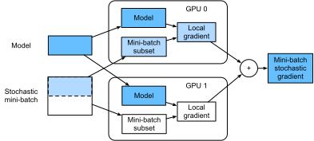

# Đào tạo về nhiều GPU
:label:`sec_multi_gpu`

Cho đến nay chúng tôi đã thảo luận về cách đào tạo các mô hình hiệu quả trên CPU và GPU. Chúng tôi thậm chí còn cho thấy cách các khung học sâu cho phép người ta song song tính toán và giao tiếp tự động giữa chúng trong :numref:`sec_auto_para`. Chúng tôi cũng đã chỉ ra trong :numref:`sec_use_gpu` cách liệt kê tất cả các GPU có sẵn trên máy tính bằng lệnh `nvidia-smi`. Những gì chúng tôi đã làm *không* thảo luận là làm thế nào để thực sự song song hóa đào tạo học sâu. Thay vào đó, chúng tôi ngụ ý trong việc truyền rằng bằng cách nào đó người ta sẽ chia dữ liệu trên nhiều thiết bị và làm cho nó hoạt động. Phần hiện tại điền vào các chi tiết và cho thấy cách đào tạo mạng song song khi bắt đầu từ đầu. Chi tiết về cách tận dụng chức năng trong các API cấp cao được xuống :numref:`sec_multi_gpu_concise`. Chúng tôi giả định rằng bạn đã quen thuộc với các thuật toán giảm dần ngẫu nhiên minibatch chẳng hạn như các thuật toán được mô tả trong :numref:`sec_minibatch_sgd`. 

## Chia tách vấn đề

Chúng ta hãy bắt đầu với một vấn đề tầm nhìn máy tính đơn giản và một mạng hơi cổ xưa, ví dụ, với nhiều lớp phức tạp, tổng hợp, và có thể là một vài lớp kết nối hoàn toàn cuối cùng. Đó là, chúng ta hãy bắt đầu với một mạng trông khá giống với LeNet :cite:`LeCun.Bottou.Bengio.ea.1998` hoặc AlexNet :cite:`Krizhevsky.Sutskever.Hinton.2012`. Với nhiều GPU (2 nếu là máy chủ máy tính để bàn, 4 trên một phiên bản AWS g4dn.12xlarge, 8 trên p3.16xlarge hoặc 16 trên p2.16xlarge), chúng tôi muốn phân vùng đào tạo theo cách để đạt được tốc độ tốt trong khi đồng thời được hưởng lợi từ các lựa chọn thiết kế đơn giản và tái tạo. Sau khi tất cả, nhiều GPU tăng cả * bộ nhớ* và * tính tị* khả năng. Tóm lại, chúng tôi có các lựa chọn sau, đưa ra một loạt dữ liệu đào tạo mà chúng tôi muốn phân loại. 

Đầu tiên, chúng ta có thể phân vùng mạng trên nhiều GPU. Đó là, mỗi GPU lấy như là đầu vào dữ liệu chảy vào một lớp cụ thể, xử lý dữ liệu trên một số lớp tiếp theo và sau đó gửi dữ liệu đến GPU tiếp theo. Điều này cho phép chúng tôi xử lý dữ liệu với các mạng lớn hơn khi so sánh với những gì một GPU duy nhất có thể xử lý. Bên cạnh đó, dấu chân bộ nhớ trên mỗi GPU có thể được kiểm soát tốt (đó là một phần nhỏ của tổng dấu chân mạng). 

Tuy nhiên, giao diện giữa các lớp (và do đó GPU) yêu cầu đồng bộ hóa chặt chẽ. Điều này có thể khó khăn, đặc biệt nếu khối lượng công việc tính toán không khớp đúng giữa các lớp. Vấn đề trở nên trầm trọng hơn đối với số lượng lớn GPU. Giao diện giữa các lớp cũng yêu cầu một lượng lớn truyền dữ liệu, chẳng hạn như kích hoạt và gradient. Điều này có thể áp đảo băng thông của các bus GPU. Hơn nữa, các hoạt động chuyên sâu về tính toán, nhưng tuần tự là không tầm thường đối với phân vùng. Xem ví dụ, :cite:`Mirhoseini.Pham.Le.ea.2017` để có một nỗ lực tốt nhất trong vấn đề này. Nó vẫn là một vấn đề khó khăn và không rõ liệu có thể đạt được tỷ lệ tốt (tuyến tính) trên các vấn đề không tầm thường hay không. Chúng tôi không khuyên bạn nên nó trừ khi có khung tuyệt vời hoặc hỗ trợ hệ điều hành để chuỗi nhiều GPU với nhau. 

Thứ hai, chúng ta có thể chia công việc theo từng lớp. Ví dụ, thay vì tính toán 64 kênh trên một GPU duy nhất, chúng tôi có thể chia nhỏ vấn đề trên 4 GPU, mỗi kênh tạo dữ liệu cho 16 kênh. Tương tự như vậy, đối với một lớp được kết nối hoàn toàn, chúng ta có thể chia số lượng đơn vị đầu ra. :numref:`fig_alexnet_original` (lấy từ :cite:`Krizhevsky.Sutskever.Hinton.2012`) minh họa thiết kế này, nơi chiến lược này được sử dụng để đối phó với GPU có dung lượng bộ nhớ rất nhỏ (2 GB vào thời điểm đó). Điều này cho phép mở rộng quy mô tốt về tính toán, với điều kiện là số lượng kênh (hoặc đơn vị) không quá nhỏ. Bên cạnh đó, nhiều GPU có thể xử lý các mạng ngày càng lớn hơn vì bộ nhớ có sẵn quy mô tuyến tính. 


:label:`fig_alexnet_original`

Tuy nhiên, chúng ta cần một * rất lớn* số lượng hoạt động đồng bộ hóa hoặc rào cản vì mỗi lớp phụ thuộc vào kết quả từ tất cả các lớp khác. Hơn nữa, lượng dữ liệu cần được truyền có khả năng thậm chí còn lớn hơn so với khi phân phối các lớp trên GPU. Do đó, chúng tôi không khuyên bạn nên cách tiếp cận này do chi phí băng thông và độ phức tạp của nó. 

Cuối cùng, chúng ta có thể phân vùng dữ liệu trên nhiều GPU. Bằng cách này, tất cả các GPU thực hiện cùng một loại công việc, mặc dù trên các quan sát khác nhau. Gradient được tổng hợp trên các GPU sau mỗi minibatch dữ liệu đào tạo. Đây là cách tiếp cận đơn giản nhất và nó có thể được áp dụng trong mọi tình huống. Chúng tôi chỉ cần đồng bộ hóa sau mỗi minibatch. Điều đó nói rằng, rất mong muốn bắt đầu trao đổi các tham số gradient trong khi những người khác vẫn đang được tính toán. Hơn nữa, số lượng GPU lớn hơn dẫn đến kích thước minibatch lớn hơn, do đó tăng hiệu quả đào tạo. Tuy nhiên, việc thêm nhiều GPU không cho phép chúng tôi đào tạo các mô hình lớn hơn. 


:label:`fig_splitting`

Một so sánh các cách song song khác nhau trên nhiều GPU được mô tả trong :numref:`fig_splitting`. Nhìn chung, song song dữ liệu là cách thuận tiện nhất để tiến hành, miễn là chúng tôi có quyền truy cập vào GPU với bộ nhớ đủ lớn. Xem thêm :cite:`Li.Andersen.Park.ea.2014` để biết mô tả chi tiết về phân vùng cho đào tạo phân tán. Bộ nhớ GPU từng là một vấn đề trong những ngày đầu học sâu. Đến bây giờ vấn đề này đã được giải quyết cho tất cả nhưng các trường hợp bất thường nhất. Chúng tôi tập trung vào sự song song dữ liệu trong những gì sau. 

## Dữ liệu song song

Giả sử rằng có $k$ GPU trên máy. Với mô hình được đào tạo, mỗi GPU sẽ duy trì một tập hợp đầy đủ các tham số mô hình một cách độc lập mặc dù các giá trị tham số trên các GPU giống hệt nhau và đồng bộ hóa. Ví dụ, :numref:`fig_data_parallel` minh họa đào tạo với sự song song dữ liệu khi $k=2$. 


:label:`fig_data_parallel`

Nói chung, việc đào tạo tiến hành như sau: 

* Trong bất kỳ lặp lại đào tạo nào, được đưa ra một minibatch ngẫu nhiên, chúng tôi chia các ví dụ trong lô thành $k$ phần và phân phối chúng đều trên GPU.
* Mỗi GPU tính toán tổn thất và độ dốc của các tham số mô hình dựa trên tập hợp con minibatch mà nó đã được gán.
* Các gradient cục bộ của mỗi GPU $k$ được tổng hợp để có được gradient ngẫu nhiên minibatch hiện tại.
* Gradient tổng hợp được phân phối lại cho mỗi GPU.
* Mỗi GPU sử dụng gradient stochastic minibatch này để cập nhật bộ thông số mô hình hoàn chỉnh mà nó duy trì.

Lưu ý rằng trong thực tế, chúng tôi * tăng* kích thước minibatch $k$-lần khi đào tạo trên $k$ GPU sao cho mỗi GPU có cùng một lượng công việc để làm như thể chúng tôi chỉ được đào tạo trên một GPU duy nhất. Trên máy chủ 16-GPU, điều này có thể làm tăng kích thước minibatch đáng kể và chúng tôi có thể phải tăng tốc độ học tập cho phù hợp. Cũng lưu ý rằng việc chuẩn hóa hàng loạt trong :numref:`sec_batch_norm` cần được điều chỉnh, ví dụ, bằng cách giữ một hệ số bình thường hóa hàng loạt riêng cho mỗi GPU. Trong những gì sau đây chúng tôi sẽ sử dụng một mạng đồ chơi để minh họa đào tạo đa GPU.

```{.python .input}
%matplotlib inline
from d2l import mxnet as d2l
from mxnet import autograd, gluon, np, npx
npx.set_np()
```

```{.python .input}
#@tab pytorch
%matplotlib inline
from d2l import torch as d2l
import torch
from torch import nn
from torch.nn import functional as F
```

## [**Một mạng đồ chơi**]

Chúng tôi sử dụng LeNet như được giới thiệu trong :numref:`sec_lenet` (với những sửa đổi nhỏ). Chúng tôi xác định nó từ đầu để minh họa chi tiết trao đổi và đồng bộ hóa tham số.

```{.python .input}
# Initialize model parameters
scale = 0.01
W1 = np.random.normal(scale=scale, size=(20, 1, 3, 3))
b1 = np.zeros(20)
W2 = np.random.normal(scale=scale, size=(50, 20, 5, 5))
b2 = np.zeros(50)
W3 = np.random.normal(scale=scale, size=(800, 128))
b3 = np.zeros(128)
W4 = np.random.normal(scale=scale, size=(128, 10))
b4 = np.zeros(10)
params = [W1, b1, W2, b2, W3, b3, W4, b4]

# Define the model
def lenet(X, params):
    h1_conv = npx.convolution(data=X, weight=params[0], bias=params[1],
                              kernel=(3, 3), num_filter=20)
    h1_activation = npx.relu(h1_conv)
    h1 = npx.pooling(data=h1_activation, pool_type='avg', kernel=(2, 2),
                     stride=(2, 2))
    h2_conv = npx.convolution(data=h1, weight=params[2], bias=params[3],
                              kernel=(5, 5), num_filter=50)
    h2_activation = npx.relu(h2_conv)
    h2 = npx.pooling(data=h2_activation, pool_type='avg', kernel=(2, 2),
                     stride=(2, 2))
    h2 = h2.reshape(h2.shape[0], -1)
    h3_linear = np.dot(h2, params[4]) + params[5]
    h3 = npx.relu(h3_linear)
    y_hat = np.dot(h3, params[6]) + params[7]
    return y_hat

# Cross-entropy loss function
loss = gluon.loss.SoftmaxCrossEntropyLoss()
```

```{.python .input}
#@tab pytorch
# Initialize model parameters
scale = 0.01
W1 = torch.randn(size=(20, 1, 3, 3)) * scale
b1 = torch.zeros(20)
W2 = torch.randn(size=(50, 20, 5, 5)) * scale
b2 = torch.zeros(50)
W3 = torch.randn(size=(800, 128)) * scale
b3 = torch.zeros(128)
W4 = torch.randn(size=(128, 10)) * scale
b4 = torch.zeros(10)
params = [W1, b1, W2, b2, W3, b3, W4, b4]

# Define the model
def lenet(X, params):
    h1_conv = F.conv2d(input=X, weight=params[0], bias=params[1])
    h1_activation = F.relu(h1_conv)
    h1 = F.avg_pool2d(input=h1_activation, kernel_size=(2, 2), stride=(2, 2))
    h2_conv = F.conv2d(input=h1, weight=params[2], bias=params[3])
    h2_activation = F.relu(h2_conv)
    h2 = F.avg_pool2d(input=h2_activation, kernel_size=(2, 2), stride=(2, 2))
    h2 = h2.reshape(h2.shape[0], -1)
    h3_linear = torch.mm(h2, params[4]) + params[5]
    h3 = F.relu(h3_linear)
    y_hat = torch.mm(h3, params[6]) + params[7]
    return y_hat

# Cross-entropy loss function
loss = nn.CrossEntropyLoss(reduction='none')
```

## Đồng bộ hóa dữ liệu

Để đào tạo đa GPU hiệu quả, chúng tôi cần hai hoạt động cơ bản. Đầu tiên chúng ta cần phải có khả năng [**phân phối một danh sách các tham số cho nhiều thiết bị**] và đính kèm gradient (`get_params`). Không có thông số, không thể đánh giá mạng trên GPU. Thứ hai, chúng ta cần khả năng tổng hợp các tham số trên nhiều thiết bị, tức là chúng ta cần một hàm `allreduce`.

```{.python .input}
def get_params(params, device):
    new_params = [p.copyto(device) for p in params]
    for p in new_params:
        p.attach_grad()
    return new_params
```

```{.python .input}
#@tab pytorch
def get_params(params, device):
    new_params = [p.to(device) for p in params]
    for p in new_params:
        p.requires_grad_()
    return new_params
```

Hãy để chúng tôi thử nó bằng cách sao chép các tham số mô hình vào một GPU.

```{.python .input}
#@tab all
new_params = get_params(params, d2l.try_gpu(0))
print('b1 weight:', new_params[1])
print('b1 grad:', new_params[1].grad)
```

Vì chúng tôi chưa thực hiện bất kỳ tính toán nào, gradient liên quan đến tham số thiên vị vẫn bằng không. Bây giờ chúng ta hãy giả định rằng chúng ta có một vector phân phối trên nhiều GPU. Chức năng [**`allreduce` sau đây thêm tất cả các vectơ và phát sóng kết quả trở lại tất cả các GPU **]. Lưu ý rằng để làm việc này, chúng ta cần sao chép dữ liệu vào thiết bị tích lũy kết quả.

```{.python .input}
def allreduce(data):
    for i in range(1, len(data)):
        data[0][:] += data[i].copyto(data[0].ctx)
    for i in range(1, len(data)):
        data[0].copyto(data[i])
```

```{.python .input}
#@tab pytorch
def allreduce(data):
    for i in range(1, len(data)):
        data[0][:] += data[i].to(data[0].device)
    for i in range(1, len(data)):
        data[i][:] = data[0].to(data[i].device)
```

Hãy để chúng tôi kiểm tra điều này bằng cách tạo các vectơ với các giá trị khác nhau trên các thiết bị khác nhau và tổng hợp chúng.

```{.python .input}
data = [np.ones((1, 2), ctx=d2l.try_gpu(i)) * (i + 1) for i in range(2)]
print('before allreduce:\n', data[0], '\n', data[1])
allreduce(data)
print('after allreduce:\n', data[0], '\n', data[1])
```

```{.python .input}
#@tab pytorch
data = [torch.ones((1, 2), device=d2l.try_gpu(i)) * (i + 1) for i in range(2)]
print('before allreduce:\n', data[0], '\n', data[1])
allreduce(data)
print('after allreduce:\n', data[0], '\n', data[1])
```

## Phân phối dữ liệu

Chúng ta cần một chức năng tiện ích đơn giản để [** phân phối một minibatch đều trên nhiều GPU **]. Ví dụ: trên hai GPU, chúng tôi muốn có một nửa dữ liệu được sao chép vào một trong hai GPU. Vì nó thuận tiện hơn và súc tích hơn, chúng tôi sử dụng chức năng tích hợp từ khung học sâu để thử nó trên ma trận $4 \times 5$.

```{.python .input}
data = np.arange(20).reshape(4, 5)
devices = [npx.gpu(0), npx.gpu(1)]
split = gluon.utils.split_and_load(data, devices)
print('input :', data)
print('load into', devices)
print('output:', split)
```

```{.python .input}
#@tab pytorch
data = torch.arange(20).reshape(4, 5)
devices = [torch.device('cuda:0'), torch.device('cuda:1')]
split = nn.parallel.scatter(data, devices)
print('input :', data)
print('load into', devices)
print('output:', split)
```

Để tái sử dụng sau này, chúng tôi xác định một hàm `split_batch` chia cả dữ liệu và nhãn.

```{.python .input}
#@save
def split_batch(X, y, devices):
    """Split `X` and `y` into multiple devices."""
    assert X.shape[0] == y.shape[0]
    return (gluon.utils.split_and_load(X, devices),
            gluon.utils.split_and_load(y, devices))
```

```{.python .input}
#@tab pytorch
#@save
def split_batch(X, y, devices):
    """Split `X` and `y` into multiple devices."""
    assert X.shape[0] == y.shape[0]
    return (nn.parallel.scatter(X, devices),
            nn.parallel.scatter(y, devices))
```

## Đào tạo

Bây giờ chúng ta có thể thực hiện [** đào tạo đa GPU trên một minibatch**]. Việc thực hiện nó chủ yếu dựa trên cách tiếp cận song song dữ liệu được mô tả trong phần này. Chúng tôi sẽ sử dụng các chức năng phụ mà chúng tôi vừa thảo luận, `allreduce` và `split_and_load`, để đồng bộ hóa dữ liệu giữa nhiều GPU. Lưu ý rằng chúng ta không cần phải viết bất kỳ mã cụ thể nào để đạt được sự song song. Vì đồ thị tính toán không có bất kỳ phụ thuộc nào trên các thiết bị trong một minibatch, nó được thực thi song song *automatically*.

```{.python .input}
def train_batch(X, y, device_params, devices, lr):
    X_shards, y_shards = split_batch(X, y, devices)
    with autograd.record():  # Loss is calculated separately on each GPU
        ls = [loss(lenet(X_shard, device_W), y_shard)
              for X_shard, y_shard, device_W in zip(
                  X_shards, y_shards, device_params)]
    for l in ls:  # Backpropagation is performed separately on each GPU
        l.backward()
    # Sum all gradients from each GPU and broadcast them to all GPUs
    for i in range(len(device_params[0])):
        allreduce([device_params[c][i].grad for c in range(len(devices))])
    # The model parameters are updated separately on each GPU
    for param in device_params:
        d2l.sgd(param, lr, X.shape[0])  # Here, we use a full-size batch
```

```{.python .input}
#@tab pytorch
def train_batch(X, y, device_params, devices, lr):
    X_shards, y_shards = split_batch(X, y, devices)
    # Loss is calculated separately on each GPU
    ls = [loss(lenet(X_shard, device_W), y_shard).sum()
          for X_shard, y_shard, device_W in zip(
              X_shards, y_shards, device_params)]
    for l in ls:  # Backpropagation is performed separately on each GPU
        l.backward()
    # Sum all gradients from each GPU and broadcast them to all GPUs
    with torch.no_grad():
        for i in range(len(device_params[0])):
            allreduce([device_params[c][i].grad for c in range(len(devices))])
    # The model parameters are updated separately on each GPU
    for param in device_params:
        d2l.sgd(param, lr, X.shape[0]) # Here, we use a full-size batch
```

Bây giờ, chúng ta có thể định nghĩa [** chức năng đào tạo**]. Nó hơi khác so với các chương được sử dụng trong các chương trước: chúng ta cần phân bổ GPU và sao chép tất cả các tham số mô hình cho tất cả các thiết bị. Rõ ràng mỗi lô được xử lý bằng chức năng `train_batch` để xử lý nhiều GPU. Để thuận tiện (và ngắn gọn của mã), chúng tôi tính toán độ chính xác trên một GPU duy nhất, mặc dù điều này là * không hiệu quả* vì các GPU khác không hoạt động.

```{.python .input}
def train(num_gpus, batch_size, lr):
    train_iter, test_iter = d2l.load_data_fashion_mnist(batch_size)
    devices = [d2l.try_gpu(i) for i in range(num_gpus)]
    # Copy model parameters to `num_gpus` GPUs
    device_params = [get_params(params, d) for d in devices]
    num_epochs = 10
    animator = d2l.Animator('epoch', 'test acc', xlim=[1, num_epochs])
    timer = d2l.Timer()
    for epoch in range(num_epochs):
        timer.start()
        for X, y in train_iter:
            # Perform multi-GPU training for a single minibatch
            train_batch(X, y, device_params, devices, lr)
            npx.waitall()
        timer.stop()
        # Evaluate the model on GPU 0
        animator.add(epoch + 1, (d2l.evaluate_accuracy_gpu(
            lambda x: lenet(x, device_params[0]), test_iter, devices[0]),))
    print(f'test acc: {animator.Y[0][-1]:.2f}, {timer.avg():.1f} sec/epoch '
          f'on {str(devices)}')
```

```{.python .input}
#@tab pytorch
def train(num_gpus, batch_size, lr):
    train_iter, test_iter = d2l.load_data_fashion_mnist(batch_size)
    devices = [d2l.try_gpu(i) for i in range(num_gpus)]
    # Copy model parameters to `num_gpus` GPUs
    device_params = [get_params(params, d) for d in devices]
    num_epochs = 10
    animator = d2l.Animator('epoch', 'test acc', xlim=[1, num_epochs])
    timer = d2l.Timer()
    for epoch in range(num_epochs):
        timer.start()
        for X, y in train_iter:
            # Perform multi-GPU training for a single minibatch
            train_batch(X, y, device_params, devices, lr)
            torch.cuda.synchronize()
        timer.stop()
        # Evaluate the model on GPU 0
        animator.add(epoch + 1, (d2l.evaluate_accuracy_gpu(
            lambda x: lenet(x, device_params[0]), test_iter, devices[0]),))
    print(f'test acc: {animator.Y[0][-1]:.2f}, {timer.avg():.1f} sec/epoch '
          f'on {str(devices)}')
```

Hãy để chúng tôi xem điều này hoạt động tốt như thế nào [** trên một GPU**] duy nhất. Đầu tiên chúng tôi sử dụng kích thước lô là 256 và tỷ lệ học tập là 0,2.

```{.python .input}
#@tab all
train(num_gpus=1, batch_size=256, lr=0.2)
```

Bằng cách giữ cho kích thước lô và tỷ lệ học tập không thay đổi và [** tăng số lượng GPU lên 2**], chúng ta có thể thấy rằng độ chính xác kiểm tra vẫn giữ nguyên so với thí nghiệm trước đó. Về các thuật toán tối ưu hóa, chúng giống hệt nhau. Thật không may, không có sự tăng tốc có ý nghĩa nào có thể đạt được ở đây: mô hình đơn giản là quá nhỏ; hơn nữa chúng tôi chỉ có một bộ dữ liệu nhỏ, nơi cách tiếp cận hơi không tinh vi của chúng tôi để thực hiện đào tạo đa GPU phải chịu đựng trên cao Python đáng kể. Chúng tôi sẽ gặp phải các mô hình phức tạp hơn và những cách song song tinh vi hơn trong tương lai. Hãy để chúng tôi xem những gì sẽ xảy ra dù sao cho thời trang-MNIST.

```{.python .input}
#@tab all
train(num_gpus=2, batch_size=256, lr=0.2)
```

## Tóm tắt

* Có nhiều cách để chia đào tạo mạng sâu qua nhiều GPU. Chúng ta có thể chia chúng giữa các lớp, qua các lớp hoặc trên dữ liệu. Hai người trước đây yêu cầu truyền dữ liệu được biên đạo chặt chẽ. Song song dữ liệu là chiến lược đơn giản nhất.
* Đào tạo song song dữ liệu là đơn giản. Tuy nhiên, nó làm tăng kích thước minibatch hiệu quả để có hiệu quả.
* Trong tính song song dữ liệu, dữ liệu được chia thành nhiều GPU, trong đó mỗi GPU thực hiện hoạt động chuyển tiếp và lùi của riêng mình và sau đó gradient được tổng hợp và kết quả được phát trở lại GPU.
* Chúng tôi có thể sử dụng tỷ lệ học tập tăng nhẹ cho các minibatches lớn hơn.

## Bài tập

1. Khi đào tạo trên $k$ GPU, hãy thay đổi kích thước minibatch từ $b$ thành $k \cdot b$, tức là, quy mô nó lên theo số lượng GPU.
1. So sánh độ chính xác cho các tỷ lệ học tập khác nhau. Làm thế nào để nó mở rộng quy mô với số lượng GPU?
1. Triển khai chức năng `allreduce` hiệu quả hơn tổng hợp các tham số khác nhau trên các GPU khác nhau? Tại sao nó hiệu quả hơn?
1. Thực hiện tính toán độ chính xác thử nghiệm đa GPU.

:begin_tab:`mxnet`
[Discussions](https://discuss.d2l.ai/t/364)
:end_tab:

:begin_tab:`pytorch`
[Discussions](https://discuss.d2l.ai/t/1669)
:end_tab:
