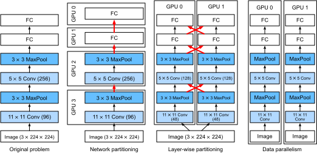

<!--
# Training on Multiple GPUs
-->

# Huấn luyện đa GPU
:label:`sec_multi_gpu`

<!--
So far we discussed how to train models efficiently on CPUs and GPUs.
We even showed how deep learning frameworks such as MXNet (and TensorFlow) allow one to parallelize computation and communication automatically between them in :numref:`sec_auto_para`.
Lastly, we showed in :numref:`sec_use_gpu` how to list all available GPUs on a computer using `nvidia-smi`.
What we did *not* discuss is how to actually parallelize deep learning training 
(we omit any discussion of *inference* on multiple GPUs here as it is a rather rarely used and advanced topic that goes beyond the scope of this book).
Instead, we implied in passing that one would somehow split the data across multiple devices and make it work.
The present section fills in the details and shows how to train a network in parallel when starting from scratch.
Details on how to take advantage of functionality in Gluon is relegated to :numref:`sec_multi_gpu_gluon`.
We assume that the reader is familiar with minibatch SGD algorithms such as the ones described in :numref:`sec_minibatch_sgd`.
-->

Đến nay ta đã thảo luận về cách huấn luyện mô hình trên CPU và GPU một cách hiệu quả.
Trong :numref:`sec_auto_para`, ta biết được cách mà các framework học sâu như MXNet (và TensorFlow) thực hiện song song hóa việc tính toán và giao tiếp giữa các thiết bị một cách tự động.
Cuối cùng, :numref:`sec_use_gpu` đã trình bày cách liệt kê toàn bộ các GPU có trong máy bằng lệnh `nvidia-smi`.
Thứ mà ta *chưa* thảo luận là cách song song hóa quá trình huấn luyện mô hình học sâu.
(Ta bỏ qua việc *dự đoán* trên nhiều GPU vì nó ít khi được sử dụng và là một chủ đề nâng cao nằm ngoài phạm vi của cuốn sách này.)
Chúng ta mới chỉ ngầm hiểu rằng bằng cách nào đó dữ liệu có thể được chia ra cho nhiều thiết bị khác nhau.
Phần này sẽ bổ sung những chi tiết còn thiếu ấy và mô tả cách huấn luyện song song một mạng học sâu từ đầu.
Chi tiết về cách tận dụng các tính năng của Gluon sẽ nằm ở :numref:`sec_multi_gpu_gluon`.
Vì vậy, chúng tôi xin giả định rằng độc giả đã quen với thuật toán SGD theo minibatch được mô tả ở :numref:`sec_minibatch_sgd`.

<!--
## Splitting the Problem
-->

## Chia nhỏ Vấn đề


<!--
Let us start with a simple computer vision problem and a slightly archaic network, e.g., with multiple layers of convolutions, pooling, and possibly a few dense layers in the end.
That is, let us start with a network that looks quite similar to LeNet :cite:`LeCun.Bottou.Bengio.ea.1998` or AlexNet :cite:`Krizhevsky.Sutskever.Hinton.2012`.
Given multiple GPUs (2 if it is a desktop server, 4 on a g4dn.12xlarge, 8 on an AWS p3.16xlarge, or 16 on a p2.16xlarge), 
we want to partition training in a manner as to achieve good speedup while simultaneously benefitting from simple and reproducible design choices.
Multiple GPUs, after all, increase both *memory* and *compute* ability.
In a nutshell, we have a number of choices, given a minibatch of training data that we want to classify.
-->

Hãy bắt đầu bằng một bài toán thị giác máy tính đơn giản cùng một kiến trúc mạng lâu đời chứa vài tầng tích chập, tầng gộp và có thể thêm vài tầng dày đặc ở cuối.
Như vậy, mạng này sẽ trông khá tương tự như LeNet :cite:`LeCun.Bottou.Bengio.ea.1998` hoặc AlexNet :cite:`Krizhevsky.Sutskever.Hinton.2012`.
Với nhiều GPU (máy chủ để bàn thường có 2, máy chủ g4dn.12xlarge thì có 4, AWS p3.16xlarge có 8, hoặc là 16 trên p2.16xlarge), 
ta muốn phân chia việc huấn luyện sao cho vừa tăng tốc độ lại vừa tận dụng được các thiết kế đơn giản và tái tạo được.
Sau cùng, việc sử dụng nhiều GPU là để tăng cả *bộ nhớ* và năng lực *tính toán*.
Nói ngắn gọn, với một minibatch dữ liệu huấn luyện, ta có một vài phương án phân chia khác nhau.

<!--

-->


:label:`fig_alexnet_original`


<!--
* We could partition the network layers across multiple GPUs. 
That is, each GPU takes as input the data flowing into a particular layer,processes data across a number of subsequent layers and then sends the data to the next GPU. 
    * This allows us to process data with larger networks when compared to what a single GPU could handle. 
    * Memory footprint per GPU can be well controlled (it is a fraction of the total network footprint)
    * The interface between layers (and thus GPUs) requires tight synchronization. 
    This can be tricky, in particular if the computational workloads are not properly matched between layers. The problem is exacerbated for large numbers of GPUs.
    * The interface between layers requires large amounts of data transfer (activations, gradients). This may overwhelm the bandwidth of the GPU buses.
    * Compute intensive, yet sequential operations are nontrivial to partition. 
    See e.g., :cite:`Mirhoseini.Pham.Le.ea.2017` for a best effort in this regard. 
    It remains a difficult problem and it is unclear whether it is possible to achieve good (linear) scaling on nontrivial problems. 
    We do not recommend it unless there is excellent framework / OS support for chaining together multiple GPUs.
* We could split the work required by individual layers. 
For instance, rather than computing 64 channels on a single GPU we could split up the problem across 4 GPUs, each of which generate data for 16 channels. 
Likewise, for a dense layer we could split the number of output neurons. 
:numref:`fig_alexnet_original` illustrates this design. 
The figure is taken from :cite:`Krizhevsky.Sutskever.Hinton.2012` where this strategy was used to deal with GPUs that had a very small memory footprint (2GB at the time). 
    * This allows for good scaling in terms of computation, provided that the number of channels (or neurons) is not too small. 
    * Multiple GPUs can process increasingly larger networks since the memory available scales linearly.
    * We need a *very large* number of synchronization / barrier operations since each layer depends on the results from all other layers.
    * The amount of data that needs to be transferred is potentially even larger than when distributing layers across GPUs. We do not recommend this approach due to its bandwidth cost and complexity.
* Lastly we could partition data across multiple GPUs. This way all GPUs perform the same type of work, albeit on different observations. Gradients are aggregated between GPUs after each minibatch.
    * This is the simplest approach and it can be applied in any situation.
    * Adding more GPUs does not allow us to train larger models.
    * We only need to synchronize after each minibatch. That said, it is highly desirable to start exchanging gradients parameters already while others are still being computed. 
    * Large numbers of GPUs lead to very large minibatch sizes, thus reducing training efficiency.
-->

* Chúng ta có thể phân chia các tầng mạng trên nhiều GPU.
Cụ thể, mỗi GPU sẽ nhận một luồng dữ liệu đưa vào từ một tầng xác định, truyền dữ liệu qua một số tầng kế tiếp nhau rồi gửi dữ liệu tới GPU kế tiếp. 
   * Điều này cho phép ta xử lý dữ liệu với các mạng lớn hơn, điều nằm ngoài khả năng khi chỉ sử dụng một GPU.
   * Bộ nhớ bị chiếm dụng trên mỗi GPU có thể được kiểm soát dễ dàng (mỗi GPU sẽ chỉ chiếm một phần tổng dung lượng bộ nhớ cấp phát cho cả mạng).
   * Giao tiếp giữa các tầng (cũng như giữa các GPU) đòi hỏi tính đồng bộ chặt chẽ.
   Điều này có thể sẽ rất khó, đặc biệt nếu khối lượng tính toán không được phân chia hợp lý cho các tầng. 
   Vấn đề sẽ trở nên nghiêm trọng với một số lượng lớn GPU.
   * Giao tiếp giữa các tầng yêu cầu một lượng lớn các thao tác truyền dữ liệu (các hàm kích hoạt, các gradient). Điều này có thể vượt quá mức băng thông các bus của GPU.
   * Các phép tính tuần tự nhưng nặng về mặt tính toán lại không hề dễ phân chia.
   :cite:`Mirhoseini.Pham.Le.ea.2017` là nỗ lực tốt nhất để giải quyết vấn đề này.
   Nó vẫn còn là một vấn đề khó và chưa rõ ràng liệu có thể đạt được khả năng mở rộng tốt (tăng theo tuyến tính) cho các bài toán không quá đơn giản không. 
   Chúng tôi không khuyến khích cách làm này trừ phi có một framework xuất sắc hay một hệ điều hành hỗ trợ cho việc xâu chuỗi nhiều GPU lại với nhau.
* Chúng ta có thể phân chia công việc của các tầng đơn lẻ.
Chẳng hạn, thay vì tính toán 64 kênh trên một GPU, ta có thể chia công việc này cho 4 GPU, mỗi GPU sẽ sinh dữ liệu cho 16 kênh. 
Tương tự, với một tầng kết nối dày đặc ta có thể chia nhỏ số nơ-ron đầu ra.
:numref:`fig_alexnet_original` mô tả thiết kế kiểu này. 
Hình này được trích từ :cite:`Krizhevsky.Sutskever.Hinton.2012`, khi chiến lược này được sử dụng để làm việc với nhiều GPU có dung lượng bộ nhớ rất nhỏ (2 GB ở thời điểm đó).
   * Điều này cho phép việc điều chỉnh kích thước tính toán tốt, với điều kiện là số kênh (hoặc số nơ-ron) không quá nhỏ.
   * Dùng nhiều GPU có thể xử lý các mạng ngày một lớn hơn vì dung lượng bộ nhớ khả dụng cũng tăng tuyến tính.
   * Chúng ta cần một lượng *rất lớn* các phép toán đồng bộ / lớp chặn vì mỗi tầng phụ thuộc vào các kết quả từ tất cả các tầng khác.
   * Lượng dữ liệu cần được truyền thậm chí có thể lớn hơn khi phân phối các tầng giữa các GPU.
   Chúng tôi không khuyến khích cách tiếp cận này do tính phức tạp và chi phí băng thông của nó.
* Cuối cùng, ta có thể phân chia dữ liệu cho nhiều GPU. 
Cách này cho phép tất cả GPU thực hiện cùng một công việc, chỉ là với các dữ liệu khác nhau. 
Các gradient được tổng hợp lại trên các GPU sau mỗi minibatch.
   * Đây là phương pháp đơn giản nhất và có thể sử dụng cho bất cứ tình huống nào.
   * Gắn thêm nhiều GPU không cho phép chúng ta huấn luyện mô hình lớn hơn. 
   * Chúng ta chỉ cần đồng bộ hóa sau mỗi minibatch. 
   Dù vậy, ta vẫn nên bắt đầu thực hiện trao đổi các gradient đã tính xong kể cả khi việc tính các gradient khác vẫn chưa được hoàn thiện.
   * Số lượng GPU lớn dẫn tới kích thước minibatch rất lớn, do đó giảm hiệu quả huấn luyện.
   
<!--

-->


:label:`fig_splitting`


<!--
By and large, data parallelism is the most convenient way to proceed, provided that we have access to GPUs with sufficiently large memory.
See also :cite:`Li.Andersen.Park.ea.2014` for a detailed description of partitioning for distributed training.
GPU memory used to be a problem in the early days of deep learning.
By now this issue has been resolved for all but the most unusual cases.
We focus on data parallelism in what follows.
-->

Nhìn chung việc song song hóa dữ liệu là cách thuận tiện nhất, với điều kiện là ta sở hữu các GPU với bộ nhớ đủ lớn.
Xem thêm :cite:`Li.Andersen.Park.ea.2014` để biết chi tiết cách phân chia cho việc huấn luyện phân tán.
Bộ nhớ GPU từng là một vấn đề trong những ngày đầu của học sâu.
Đến thời điểm này thì hầu hết các vấn đề đã được giải quyết trừ một số trường hợp rất ít gặp.
Ở phần kế tiếp, chúng ta sẽ tập trung vào việc song song hóa dữ liệu.


<!--
## Data Parallelism
-->

## Song song hóa Dữ liệu


<!--
Assume that there are $k$ GPUs on a machine.
Given the model to be trained, each GPU will maintain a complete set of model parameters independently.
Training proceeds as follows (see :numref:`fig_data_parallel` for details on data parallel training on two GPUs):
-->

Giả sử ta có một máy tính có $k$ GPU.
Với một mô hình cần được huấn luyện, mỗi GPU duy trì một tập đầy đủ các tham số mô hình độc lập với nhau.
Việc huấn luyện diễn ra như sau (xem :numref:`fig_data_parallel` để rõ hơn về việc huấn luyện song song với hai GPU):

<!--
* In any iteration of training, given a random minibatch, we split the examples in the batch into $k$ portions and distribute them evenly across the GPUs. 
* Each GPU calculates loss and gradient of the model parameters based on the minibatch subset it was assigned and the model parameters it maintains. 
* The local gradients of each of the $k$ GPUs are aggregated to obtain the current minibatch stochastic gradient. 
* The aggregate gradient is re-distributed to each GPU. 
* Each GPU uses this minibatch stochastic gradient to update the complete set of model parameters that it maintains. 
-->

* Ở bất cứ vòng huấn luyện nào, với một tập minibatch ngẫu nhiên cho trước, ta chia đều các mẫu từ batch ban đầu này thành $k$ phần rồi phân bố cho các GPU.
* Mỗi GPU sẽ tính mất mát và gradient của các tham số mô hình dựa trên tập mimibatch con mà nó được cấp và các tham số mô hình nó lưu trữ. 
* Các gradient cục bộ từ $k$ GPU được gom lại để thu được gradient ngẫu nhiên cho minibatch hiện tại.
* Gradient tổng hợp này được phân phối trở lại cho các GPU.
* Mỗi GPU dùng gradient ngẫu nhiên của minibatch này để cập nhật một tập đầy đủ các tham số mô hình mà nó lưu trữ.


<!--

-->


:label:`fig_data_parallel`


<!--
A comparison of different ways of parallelization on multiple GPUs is depicted in :numref:`fig_splitting`.
Note that in practice we *increase* the minibatch size $k$-fold when training on $k$ GPUs such that each GPU has the same amount of work to do as if we were training on a single GPU only.
On a 16 GPU server this can increase the minibatch size considerably and we may have to increase the learning rate accordingly.
Also note that :numref:`sec_batch_norm` needs to be adjusted (e.g., by keeping a separate batch norm coefficient per GPU). 
In what follows we will use :numref:`sec_lenet` as the toy network to illustrate multi-GPU training. As always we begin by importing the relevant packages and modules.
-->

:numref:`fig_splitting` so sánh các cách song song hóa khác nhau trên nhiều GPU.
Lưu ý rằng trong thực tế ta cần *tăng* kích thước minibatch lên $k$ lần khi huấn luyện trên $k$ GPU để mỗi GPU có cùng khối lượng công việc cần thực hiện như khi ta huấn luyện trên một GPU đơn lẻ.
Trên một server có 16 GPU có thể tăng kích thước minibatch một cách đáng kể và ta cũng có thể sẽ phải tăng tốc độ học một cách tương ứng.
Chú ý rằng :numref:`sec_batch_norm` cũng cần được điều chỉnh lại (ví dụ, ta có thể sử dụng các hệ số chuẩn hóa theo batch riêng cho mỗi GPU).
Trong phần tiếp theo ta sẽ dùng :numref:`sec_lenet` như một mạng thử nghiệm để minh họa việc huấn luyện đa GPU. Như mọi khi, ta bắt đầu bằng cách nạp các gói thư viện và mô-đun liên quan. 


```{.python .input  n=2}
%matplotlib inline
from d2l import mxnet as d2l
from mxnet import autograd, gluon, np, npx
npx.set_np()
```


<!--
## A Toy Network
-->

## Ví dụ Đơn giản


<!--
We use LeNet as introduced in :numref:`sec_lenet`. We define it from scratch to illustrate parameter exchange and synchronization in detail.
-->

Ta lập trình từ đầu LeNet trong :numref:`sec_lenet` để minh họa chi tiết cách trao đổi và đồng bộ tham số.


```{.python .input  n=10}
# Initialize model parameters
scale = 0.01
W1 = np.random.normal(scale=scale, size=(20, 1, 3, 3))
b1 = np.zeros(20)
W2 = np.random.normal(scale=scale, size=(50, 20, 5, 5))
b2 = np.zeros(50)
W3 = np.random.normal(scale=scale, size=(800, 128))
b3 = np.zeros(128)
W4 = np.random.normal(scale=scale, size=(128, 10))
b4 = np.zeros(10)
params = [W1, b1, W2, b2, W3, b3, W4, b4]

# Define the model
def lenet(X, params):
    h1_conv = npx.convolution(data=X, weight=params[0], bias=params[1],
                              kernel=(3, 3), num_filter=20)
    h1_activation = npx.relu(h1_conv)
    h1 = npx.pooling(data=h1_activation, pool_type='avg', kernel=(2, 2),
                     stride=(2, 2))
    h2_conv = npx.convolution(data=h1, weight=params[2], bias=params[3],
                              kernel=(5, 5), num_filter=50)
    h2_activation = npx.relu(h2_conv)
    h2 = npx.pooling(data=h2_activation, pool_type='avg', kernel=(2, 2),
                     stride=(2, 2))
    h2 = h2.reshape(h2.shape[0], -1)
    h3_linear = np.dot(h2, params[4]) + params[5]
    h3 = npx.relu(h3_linear)
    y_hat = np.dot(h3, params[6]) + params[7]
    return y_hat

# Cross-entropy loss function
loss = gluon.loss.SoftmaxCrossEntropyLoss()
```


<!--
## Data Synchronization
-->

## Đồng bộ Dữ liệu


<!--
For efficient multi-GPU training we need two basic operations: firstly we need to have the ability to distribute a list of parameters to multiple devices and to attach gradients (`get_params`).
Without parameters it is impossible to evaluate the network on a GPU.
Secondly, we need the ability to sum parameters across multiple devices, i.e., we need an `allreduce` function.
-->

Để huấn luyện hiệu quả trên nhiều GPU, ta cần hai thao tác cơ bản: 
thứ nhất là phân phối danh sách tham số đến nhiều GPU và gắn gradient, được định nghĩa trong hàm `get_params` dưới đây.
Nếu không có các tham số, ta không thể đánh giá mạng trên GPU.
Thứ hai, ta cần tính tổng giá trị các tham số trên nhiều thiết bị, khai báo ở hàm `allreduce`.


```{.python .input  n=12}
def get_params(params, device):
    new_params = [p.copyto(device) for p in params]
    for p in new_params:
        p.attach_grad()
    return new_params
```


<!--
Let us try it out by copying the model parameters of lenet to gpu(0).
-->

Hãy thử sao chép các tham số mô hình của LeNet tới gpu(0).


```{.python .input  n=13}
new_params = get_params(params, d2l.try_gpu(0))
print('b1 weight:', new_params[1])
print('b1 grad:', new_params[1].grad)
```


<!--
Since we didn't perform any computation yet, the gradient with regard to the bias weights is still $0$.
Now let us assume that we have a vector distributed across multiple GPUs.
The following allreduce function adds up all vectors and broadcasts the result back to all GPUs.
Note that for this to work we need to copy the data to the device accumulating the results.
-->

Vì chưa thực hiện tính toán nào, gradient ứng với hệ số điều chỉnh vẫn mang giá trị $0$.
Bây giờ giả sử ta có các vector được phân phối trên nhiều GPU.
Hàm `allreduce` dưới đây cộng các vector đó và truyền kết quả về tất cả GPU.
Chú ý, để hàm này hoạt động, ta cần sao chép dữ liệu đến GPU đang cộng dồn kết quả.


```{.python .input  n=14}
def allreduce(data):
    for i in range(1, len(data)):
        data[0][:] += data[i].copyto(data[0].ctx)
    for i in range(1, len(data)):
        data[0].copyto(data[i])
```


<!--
Let us test this by creating vectors with different values on different devices and aggregate them.
-->

Hãy kiểm tra bằng cách tạo các vector với giá trị khác nhau trên các thiết bị khác nhau và tổng hợp chúng.


```{.python .input  n=16}
data = [np.ones((1, 2), ctx=d2l.try_gpu(i)) * (i + 1) for i in range(2)]
print('before allreduce:\n', data[0], '\n', data[1])
allreduce(data)
print('after allreduce:\n', data[0], '\n', data[1])
```


<!--
## Distributing Data
-->

## Phân phối Dữ liệu


<!--
We need a simple utility function to distribute a minibatch evenly across multiple GPUs.
For instance, on 2 GPUs we'd like to have half of the data to be copied to each of the GPUs.
Since it is more convenient and more concise, we use the built-in split and load function in Gluon (to try it out on a $4 \times 5$ matrix).
-->

Ta cần một hàm hỗ trợ phân phối đều dữ liệu trong minibatch trên nhiều GPU.
Ví dụ với 2 GPU, có thể ta sẽ muốn sao chép một nửa dữ liệu tới mỗi GPU.
Ta sẽ sử dụng hàm có sẵn trong Gluon để chia và nạp dữ liệu (kiểm thử với ma trận $4 \times 5$).


```{.python .input  n=8}
data = np.arange(20).reshape(4, 5)
devices = [npx.gpu(0), npx.gpu(1)]
split = gluon.utils.split_and_load(data, devices)
print('input :', data)
print('load into', devices)
print('output:', split)
```


<!--
For later reuse we define a `split_batch` function which splits both data and labels.
-->

Để sử dụng về sau, ta định nghĩa hàm `split_batch` để chia cả dữ liệu và nhãn.


```{.python .input  n=9}
#@save
def split_batch(X, y, devices):
    """Split `X` and `y` into multiple devices."""
    assert X.shape[0] == y.shape[0]
    return (gluon.utils.split_and_load(X, devices),
            gluon.utils.split_and_load(y, devices))
```

<!--
## Training 
-->

## Huấn luyện


<!--
Now we can implement multi-GPU training on a single minibatch.
Its implementation is primarily based on the data parallelism approach described in this section.
We will use the auxiliary functions we just discussed, `allreduce` and `split_and_load`, to synchronize the data among multiple GPUs.
Note that we do not need to write any specific code to achieve parallelism.
Since the compute graph does not have any dependencies across devices within a minibatch, it is executed in parallel *automatically*.
-->

Giờ chúng ta có thể lập trình việc huấn luyện với một minibatch trên nhiều GPU.
Đoạn mã chủ yếu dựa trên phương pháp song song hóa dữ liệu trong chương này.
Ta sẽ dùng các hàm phụ trợ `allreduce` và `split_and_load` ở trên để đồng bộ dữ liệu trên nhiều GPU.
Lưu ý rằng ta không cần viết bất cứ đoạn mã cụ thể nào để song song hóa.
Vì đồ thị tính toán không có phụ thuộc nào xuyên suốt các thiết bị trong một minibatch, chúng được thực thi song song *một cách tự động*.


```{.python .input  n=10}
def train_batch(X, y, device_params, devices, lr):
    X_shards, y_shards = split_batch(X, y, devices)
    with autograd.record():  # Loss is calculated separately on each GPU
        losses = [loss(lenet(X_shard, device_W), y_shard)
                  for X_shard, y_shard, device_W in zip(
                      X_shards, y_shards, device_params)]
    for l in losses:  # Back Propagation is performed separately on each GPU
        l.backward()
    # Sum all gradients from each GPU and broadcast them to all GPUs
    for i in range(len(device_params[0])):
        allreduce([device_params[c][i].grad for c in range(len(devices))])
    # The model parameters are updated separately on each GPU
    for param in device_params:
        d2l.sgd(param, lr, X.shape[0])  # Here, we use a full-size batch
```


<!--
Now, we can define the training function.
It is slightly different from the ones used in the previous chapters: we need to allocate the GPUs and copy all the model parameters to all devices.
Obviously each batch is processed using `train_batch` to deal with multiple GPUs.
For convenience (and conciseness of code) we compute the accuracy on a single GPU (this is *inefficient* since the other GPUs are idle).
-->

Bây giờ ta có thể định nghĩa hàm huấn luyện.
Hàm này có một chút khác biệt so với hàm huấn luyện trong các chương trước: 
ta cần chỉ định GPU và sao chép các tham số mô hình tới tất cả thiết bị.
Mỗi batch được xử lý bằng `train_batch` nhằm tận dụng nhiều GPU.
Để thuận tiện (và để mã nguồn ngắn gọn), ta tính độ chính xác trên một GPU (cách này *không hiệu quả* vì các GPU khác không được tận dụng).


```{.python .input  n=61}
def train(num_gpus, batch_size, lr):
    train_iter, test_iter = d2l.load_data_fashion_mnist(batch_size)
    devices = [d2l.try_gpu(i) for i in range(num_gpus)]
    # Copy model parameters to num_gpus GPUs
    device_params = [get_params(params, d) for d in devices]
    # num_epochs, times, acces = 10, [], []
    num_epochs = 10
    animator = d2l.Animator('epoch', 'test acc', xlim=[1, num_epochs])
    timer = d2l.Timer()
    for epoch in range(num_epochs):
        timer.start()
        for X, y in train_iter:
            # Perform multi-GPU training for a single minibatch
            train_batch(X, y, device_params, devices, lr)
            npx.waitall()
        timer.stop()
        # Verify the model on GPU 0
        animator.add(epoch + 1, (d2l.evaluate_accuracy_gpu(
            lambda x: lenet(x, device_params[0]), test_iter, devices[0]),))
    print(f'test acc: {animator.Y[0][-1]:.2f}, {timer.avg():.1f} sec/epoch '
          f'on {str(devices)}')
```


<!--
## Experiment
-->

## Thí nghiệm


<!--
Let us see how well this works on a single GPU. We use a batch size of 256 and a learning rate of 0.2.
-->

Hãy xem hàm trên hoạt động như thế nào trên một GPU. Ta sử dụng kích thước batch 256 và tốc độ học 0.2.


```{.python .input  n=62}
train(num_gpus=1, batch_size=256, lr=0.2)
```

<!--
By keeping the batch size and learning rate unchanged and changing the number of GPUs to 2, 
we can see that the improvement in test accuracy is roughly the same as in the results from the previous experiment.
In terms of the optimization algorithms, they are identical.
Unfortunately there is no meaningful speedup to be gained here: the model is simply too small; 
moreover we only have a small dataset, where our slightly unsophisticated approach to implementing multi-GPU training suffered from significant Python overhead.
We will encounter more complex models and more sophisticated ways of parallelization going forward. Let us see what happens nonetheless for MNIST.
-->

Giữ nguyên kích thước batch và tốc độ học, tăng số GPU lên 2,
ta có thể thấy sự cải thiện về độ chính xác trên tập kiểm tra xấp xỉ bằng thí nghiệm trước.
Dưới góc nhìn thuật toán tối ưu, hai thí nghiệm là giống hệt nhau.
Không may, ta không đạt được sự tăng tốc đáng kể nào: đơn giản vì mô hình quá nhỏ;
hơn nữa tập dữ liệu cũng nhỏ, do đó cách huấn luyện không quá tinh vi của chúng ta trên nhiều GPU sẽ chịu chi phí đáng kể do Python.
Về sau ta sẽ gặp các mô hình phức tạp hơn và các cách song song hóa tinh vi hơn.
Hiện giờ hãy xem thí nghiệm trên Fashion-MNIST cho kết quả như thế nào.


```{.python .input  n=13}
train(num_gpus=2, batch_size=256, lr=0.2)
```


## Tóm tắt

<!--
* There are multiple ways to split deep network training over multiple GPUs. 
We could split them between layers, across layers, or across data. 
The former two require tightly choreographed data transfers. 
Data parallelism is the simplest strategy.
* Data parallel training is straightforward. However, it increases the effective minibatch size to be efficient. 
* Data is split across multiple GPUs, each GPU executes its own forward and backward operation and subsequently gradients are aggregated and results broadcast back to the GPUs. 
* Large minibatches may require a slightly increased learning rate.
-->

* Có nhiều cách để chia việc huấn luyện mạng học sâu cho nhiều GPU.
Có thể chia các tầng cho một GPU, dùng nhiều GPU cho một tầng, hoặc nhiều GPU cho dữ liệu.
Hai cách đầu yêu cầu điều khiển việc truyền dữ liệu chặt chẽ.
Song song hóa dữ liệu là cách đơn giản nhất.
* Không khó để huấn luyện bằng song song hóa dữ liệu. Tuy nhiên, cách này cần tăng kích thước hiệu dụng của minibatch để đạt hiệu quả.
* Dữ liệu được chia cho nhiều GPU, mỗi GPU thực thi các lượt truyền xuôi và ngược, sau đó các gradient được tổng hợp lại và kết quả được truyền về các GPU.
* Minibatch lớn có thể yêu cầu tốc độ học cao hơn một chút.


## Bài tập

<!--
1. When training on multiple GPUs, change the minibatch size from $b$ to $k \cdot b$, i.e., scale it up by the number of GPUs.
2. Compare accuracy for different learning rates. How does it scale with the number of GPUs. 
3. Implement a more efficient allreduce that aggregates different parameters on different GPUs (why is this more efficient in the first place). 
4. Implement multi-GPU test accuracy computation.
-->

1. Khi huấn luyện trên nhiều GPU, thử thay đổi kích thước minibatch từ $b$ thành $k \cdot b$, tức là nhân thêm số lượng GPU.
2. So sánh độ chính xác với các tốc độ học khác nhau. Tốc độ học thay đổi theo số lượng GPU như thế nào?
3. Lập trình hàm `allreduce` hiệu quả hơn để tổng hợp các tham số trên các GPU khác nhau (tại sao cách ban đầu không hiệu quả)?
4. Lập trình tính độ chính xác trên tập kiểm tra với nhiều GPU.


## Thảo luận
* [Tiếng Anh - MXNet](https://discuss.d2l.ai/t/364)
* [Tiếng Việt](https://forum.machinelearningcoban.com/c/d2l)


## Những người thực hiện
Bản dịch trong trang này được thực hiện bởi:

* Đoàn Võ Duy Thanh
* Lê Khắc Hồng Phúc
* Nguyễn Văn Cường
* Nguyễn Mai Hoàng Long
* Phạm Hồng Vinh
* Nguyễn Cảnh Thướng
* Phạm Minh Đức
* Nguyễn Lê Quang Nhật
