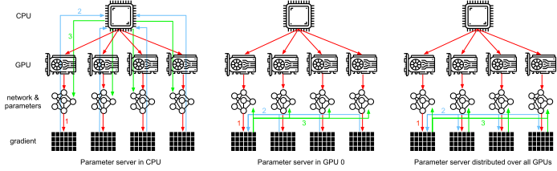

# Máy chủ tham số
:label:`sec_parameterserver`

Khi chúng tôi chuyển từ một GPU duy nhất sang nhiều GPU và sau đó đến nhiều máy chủ chứa nhiều GPU, có thể tất cả đều trải rộng trên nhiều giá đỡ và thiết bị chuyển mạch mạng, các thuật toán của chúng tôi để đào tạo phân tán và song song cần phải trở nên tinh vi hơn nhiều. Chi tiết quan trọng vì các kết nối khác nhau có băng thông rất khác nhau (ví dụ: NVLink có thể cung cấp tới 100 Gb/s trên 6 liên kết trong một cài đặt thích hợp, PCIe 4.0 (16 làn) cung cấp 32 Gb/s, trong khi thậm chí Ethernet 100GbE tốc độ cao chỉ lên tới 10 Gb/s). Đồng thời nó là không hợp lý để mong đợi rằng một mô hình thống kê là một chuyên gia về mạng và hệ thống. 

Ý tưởng cốt lõi của máy chủ tham số đã được giới thiệu trong :cite:`Smola.Narayanamurthy.2010` trong bối cảnh các mô hình biến tiềm ẩn phân tán. Một mô tả về ngữ nghĩa đẩy và kéo sau đó theo sau trong :cite:`Ahmed.Aly.Gonzalez.ea.2012` và một mô tả về hệ thống và một thư viện mã nguồn mở theo sau trong :cite:`Li.Andersen.Park.ea.2014`. Trong phần sau đây, chúng tôi sẽ thúc đẩy các thành phần cần thiết cho hiệu quả. 

## Đào tạo dữ liệu song song

Hãy để chúng tôi xem xét phương pháp đào tạo song song dữ liệu để đào tạo phân tán. Chúng tôi sẽ sử dụng điều này để loại trừ tất cả những người khác trong phần này vì nó đơn giản hơn đáng kể để thực hiện trong thực tế. Hầu như không có trường hợp sử dụng (bên cạnh việc học sâu trên đồ thị) trong đó bất kỳ chiến lược nào khác cho song song được ưa thích vì GPU có nhiều bộ nhớ hiện nay. :numref:`fig_parameterserver` mô tả biến thể của sự song song dữ liệu mà chúng tôi đã thực hiện trong :numref:`sec_multi_gpu`. Khía cạnh chính trong đó là sự tập hợp của gradient xảy ra trên GPU 0 trước khi các tham số cập nhật được phát lại cho tất cả các GPU. 

:label:`fig_parameterserver`

Nhìn lại, quyết định tổng hợp trên GPU 0 dường như khá ad-hoc. Sau khi tất cả, chúng ta có thể chỉ là cũng tổng hợp trên CPU. Trên thực tế, chúng tôi thậm chí có thể quyết định tổng hợp một số thông số trên một GPU và một số người khác trên một GPU khác. Với điều kiện là thuật toán tối ưu hóa hỗ trợ điều này, không có lý do thực sự cho lý do tại sao chúng ta không thể. Ví dụ, nếu chúng ta có bốn vectơ tham số với gradient liên quan $\mathbf{g}_1, \ldots, \mathbf{g}_4$, chúng ta có thể tổng hợp các gradient trên một GPU cho mỗi $\mathbf{g}_i$ ($i = 1, \ldots, 4$). 

Lý luận này có vẻ tùy tiện và phù phiếm. Rốt cuộc, toán học là như nhau trong suốt. Tuy nhiên, chúng tôi đang đối phó với phần cứng vật lý thực sự, nơi các xe buýt khác nhau có băng thông khác nhau như đã thảo luận trong :numref:`sec_hardware`. Hãy xem xét một máy chủ GPU 4 chiều thực sự như được mô tả trong :numref:`fig_bw_hierarchy`. Nếu nó được kết nối đặc biệt tốt, nó có thể có card mạng 100 Gbe. Các con số điển hình hơn nằm trong phạm vi 1—10 Gbe với băng thông hiệu quả từ 100 MB/giây đến 1 GB/giây vì các CPU có quá ít làn PCIe để kết nối trực tiếp với tất cả các GPU (ví dụ: CPU Intel cấp tiêu dùng có 24 làn), chúng ta cần [multiplexer](https://www.broadcom.com/products/pcie-switches-bridges/pcie-switches). Băng thông từ CPU trên liên kết 16x Gen3 là 16 Gb/s, đây cũng là tốc độ mà * mỗi* của GPU được kết nối với công tắc. Điều này có nghĩa là nó hiệu quả hơn để giao tiếp giữa các thiết bị. 

:label:`fig_bw_hierarchy`

Vì lợi ích của đối số chúng ta hãy giả định rằng độ dốc là 160 MB. Trong trường hợp này phải mất 30 ms để gửi gradient từ tất cả 3 GPU còn lại đến lần thứ tư (mỗi lần chuyển mất 10 ms = 160 MB/ 16 Gb/s). Thêm 30 ms khác để truyền các vectơ trọng lượng trở lại, chúng tôi đến tổng cộng 60 ms. Nếu chúng tôi gửi tất cả dữ liệu đến CPU, chúng tôi phải chịu một hình phạt 40 ms kể từ * mỗi* của bốn GPU cần gửi dữ liệu đến CPU, mang lại tổng cộng 80 ms. Cuối cùng giả định rằng chúng ta có thể chia gradient thành 4 phần 40 MB mỗi phần. Bây giờ chúng ta có thể tổng hợp từng phần trên một GPU khác nhau * đồng thời* vì công tắc PCIe cung cấp hoạt động toàn băng thông giữa tất cả các liên kết. Thay vì 30 ms, điều này mất 7,5 ms, mang lại tổng cộng 15 ms cho một hoạt động đồng bộ hóa. Nói tóm lại, tùy thuộc vào cách chúng ta đồng bộ hóa các thông số, hoạt động tương tự có thể mất từ 15 ms đến 80 ms. :numref:`fig_ps_distributed` mô tả các chiến lược khác nhau để trao đổi thông số. 

:label:`fig_ps_distributed`

Lưu ý rằng chúng tôi có một công cụ khác theo ý của chúng tôi khi cải thiện hiệu suất: in a deep network it takes some time to compute all gradients from the top to the bottom. We can begin synchronizing gradients for some parameter groups even while we are still busy computing them for others. See e.g., :cite:`Sergeev.Del-Balso.2018` để biết chi tiết về cách thực hiện việc này trong [Horovod](https://github.com/horovod/horovod). 

## Đồng bộ hóa vòng

Khi nói đến đồng bộ hóa trên phần cứng học sâu hiện đại, chúng ta thường gặp phải kết nối mạng bespoke đáng kể. Ví dụ, các phiên bản AWS p3.16xlarge và NVIDIA DGX-2 chia sẻ cấu trúc kết nối của :numref:`fig_nvlink`. Mỗi GPU kết nối với một CPU chủ thông qua một liên kết PCIe hoạt động tốt nhất với tốc độ 16 Gb/s Ngoài ra mỗi GPU cũng có 6 kết nối NVLink, mỗi trong số đó có khả năng truyền 300 Gbit/s hai chiều. Số này lên tới khoảng 18 Gb/s cho mỗi liên kết trên mỗi hướng. Tóm lại, băng thông NVLink tổng hợp cao hơn đáng kể so với băng thông PCIe. Câu hỏi là làm thế nào để sử dụng nó hiệu quả nhất. 

:label:`fig_nvlink`

Nó chỉ ra rằng chiến lược đồng bộ hóa tối ưu là phân hủy mạng thành hai vòng và sử dụng chúng để đồng bộ hóa dữ liệu trực tiếp :cite:`Wang.Li.Liberty.ea.2018`. :numref:`fig_nvlink_twoloop` minh họa rằng mạng có thể bị phân hủy thành một vòng (1-2-3-4-5-6-7-8-1) với băng thông NVLink đôi và thành một (1-4-6-3-5-8-2-7-1) với băng thông thường. Thiết kế một giao thức đồng bộ hóa hiệu quả trong trường hợp này là không tầm thường. 

:label:`fig_nvlink_twoloop`

Hãy xem xét thí nghiệm suy nghĩ sau: cho một vòng $n$ nút tính toán (hoặc GPU) chúng ta có thể gửi gradient từ nút đầu tiên đến nút thứ hai. Ở đó nó được thêm vào gradient cục bộ và được gửi đến nút thứ ba, v.v. Sau $n-1$ bước, gradient tổng hợp có thể được tìm thấy trong nút truy cập cuối cùng. Đó là, thời gian để tổng hợp gradient phát triển tuyến tính với số lượng nút. Nhưng nếu chúng ta làm điều này thuật toán khá kém hiệu quả. Rốt cuộc, bất cứ lúc nào chỉ có một trong các nút giao tiếp. Điều gì sẽ xảy ra nếu chúng ta phá vỡ gradient thành $n$ khối và bắt đầu đồng bộ hóa đoạn $i$ bắt đầu từ nút $i$? Vì mỗi đoạn có kích thước $1/n$ tổng thời gian bây giờ là $(n-1)/n \approx 1$. Nói cách khác, thời gian dành để tổng hợp gradient * không tăng trưởng* khi chúng ta tăng kích thước của vòng. Đây là một kết quả khá đáng kinh ngạc. :numref:`fig_ringsync` minh họa trình tự các bước trên $n=4$ nút. 

:label:`fig_ringsync`

Nếu chúng ta sử dụng cùng một ví dụ về đồng bộ hóa 160 MB trên 8 GPU V100, chúng tôi sẽ đến khoảng $2 \cdot 160 \mathrm{MB} / (3 \cdot 18 \mathrm{GB/s}) \approx 6 \mathrm{ms}$. Điều này tốt hơn so với việc sử dụng bus PCIe, mặc dù chúng tôi hiện đang sử dụng 8 GPU. Lưu ý rằng trong thực tế, những con số này tồi tệ hơn một chút, vì các khuôn khổ học sâu thường không lắp ráp giao tiếp thành các chuyển vụ nổ lớn.  

Lưu ý rằng có một quan niệm sai lầm phổ biến rằng đồng bộ hóa vòng về cơ bản khác với các thuật toán đồng bộ hóa khác. Sự khác biệt duy nhất là đường dẫn đồng bộ hóa có phần phức tạp hơn khi so sánh với một cây đơn giản. 

## Đào tạo đa máy

Đào tạo phân tán trên nhiều máy làm tăng thêm một thách thức: chúng ta cần giao tiếp với các máy chủ chỉ được kết nối trên một kết cấu băng thông tương đối thấp hơn có thể vượt quá mức độ chậm hơn trong một số trường hợp. Đồng bộ hóa trên các thiết bị là khó khăn. Rốt cuộc, các máy khác nhau chạy mã đào tạo sẽ có tốc độ khác nhau tinh tế. Do đó chúng ta cần phải * đồng bộ* chúng nếu chúng ta muốn sử dụng tối ưu hóa phân phối đồng bộ. :numref:`fig_ps_multimachine` minh họa cách đào tạo song song phân phối xảy ra. 

1. Một lô dữ liệu (khác nhau) được đọc trên mỗi máy, chia thành nhiều GPU và chuyển sang bộ nhớ GPU. Có dự đoán và độ dốc được tính toán trên mỗi lô GPU riêng biệt.
2. Các gradient từ tất cả các GPU cục bộ được tổng hợp trên một GPU (hoặc các phần của nó được tổng hợp trên các GPU khác nhau).
3. Các gradient được gửi đến các CPU.
4. Các CPU gửi gradient đến một máy chủ tham số trung tâm mà tập hợp tất cả các gradient.
5. Các gradient tổng hợp sau đó được sử dụng để cập nhật các tham số và các tham số cập nhật được phát lại cho các CPU riêng lẻ.
6. Thông tin được gửi đến một (hoặc nhiều) GPU.
7. Các thông số cập nhật được trải rộng trên tất cả các GPU.

:label:`fig_ps_multimachine`

Mỗi hoạt động này có vẻ khá đơn giản. Và, thực sự, chúng có thể được thực hiện hiệu quả * trong vòng* một máy duy nhất. Tuy nhiên, khi chúng ta nhìn vào nhiều máy, chúng ta có thể thấy rằng máy chủ tham số trung tâm trở thành nút cổ chai. Rốt cuộc, băng thông trên mỗi máy chủ bị hạn chế, do đó đối với $m$ công nhân thời gian cần thiết để gửi tất cả gradient đến máy chủ là $\mathcal{O}(m)$. Chúng ta có thể vượt qua rào cản này bằng cách tăng số lượng máy chủ lên $n$. Tại thời điểm này mỗi máy chủ chỉ cần lưu trữ $\mathcal{O}(1/n)$ các tham số, do đó tổng thời gian cập nhật và tối ưu hóa trở thành $\mathcal{O}(m/n)$. Phù hợp với cả hai con số đều mang lại tỷ lệ liên tục bất kể chúng tôi đang đối phó với bao nhiêu công nhân. Trong thực tế, chúng tôi sử dụng các máy * same* cả làm công nhân và làm máy chủ. :numref:`fig_ps_multips` minh họa thiết kế (xem thêm :cite:`Li.Andersen.Park.ea.2014` để biết chi tiết). Đặc biệt, đảm bảo rằng nhiều máy hoạt động mà không có sự chậm trễ không hợp lý là không cần thiết. Chúng tôi bỏ qua chi tiết về các rào cản và sẽ chỉ chạm ngắn gọn vào các bản cập nhật đồng bộ và không đồng bộ bên dưới. 

:label:`fig_ps_multips`

## Cửa hàng Key — Value

Thực hiện các bước cần thiết cho đào tạo đa GPU phân tán trong thực tế là không tầm thường. Đây là lý do tại sao nó trả tiền để sử dụng một trừu tượng phổ biến, cụ thể là của kho * key — value store* với ngữ nghĩa cập nhật được xác định lại.  

Trên nhiều công nhân và nhiều GPU, tính toán cho gradient $i$ có thể được định nghĩa là 

$$\mathbf{g}_{i} = \sum_{k \in \text{workers}} \sum_{j \in \text{GPUs}} \mathbf{g}_{ijk},$$

trong đó $\mathbf{g}_{ijk}$ là một phần của gradient $i$ chia trên GPU $j$ của công nhân $k$. Khía cạnh chính trong hoạt động này là nó là giảm giao hoán*, nghĩa là, nó biến nhiều vectơ thành một và thứ tự mà hoạt động được áp dụng không quan trọng. Điều này rất tốt cho mục đích của chúng tôi vì chúng tôi không (cần) có quyền kiểm soát hạt mịn khi nhận được gradient nào. Bên cạnh đó, lưu ý rằng hoạt động này độc lập giữa $i$ khác nhau. 

Điều này cho phép chúng ta xác định hai phép toán sau: * push*, tích lũy gradient và * pull*, lấy gradient tổng hợp. Vì chúng ta có nhiều bộ gradient khác nhau (sau tất cả, chúng ta có nhiều lớp), chúng ta cần lập chỉ mục gradient với một khóa $i$. Sự tương đồng này với các kho lưu trữ giá trị khóa, chẳng hạn như cửa hàng được giới thiệu trong Dynamo :cite:`DeCandia.Hastorun.Jampani.ea.2007` không phải do trùng hợp ngẫu nhiên. Chúng cũng đáp ứng nhiều đặc điểm tương tự, đặc biệt là khi phân phối các tham số trên nhiều máy chủ. 

Các thao tác đẩy và kéo cho các cửa hàng khóa-giá trị được mô tả như sau: 

* **push (key, value) ** gửi một gradient cụ thể (giá trị) từ một công nhân đến một bộ nhớ chung. Có giá trị được tổng hợp, ví dụ, bằng cách tổng hợp nó lên.
* **pull (key, value) ** lấy một giá trị tổng hợp từ lưu trữ chung, ví dụ, sau khi kết hợp gradient từ tất cả các công nhân.

Bằng cách ẩn tất cả sự phức tạp về đồng bộ hóa đằng sau một thao tác đẩy và kéo đơn giản, chúng ta có thể tách các mối quan tâm của các nhà mô hình thống kê, những người muốn có thể thể hiện tối ưu hóa một cách đơn giản và các kỹ sư hệ thống cần đối phó với sự phức tạp vốn có trong đồng bộ hóa phân tán. 

## Tóm tắt

* Đồng bộ hóa cần phải thích ứng cao với cơ sở hạ tầng mạng cụ thể và kết nối trong một máy chủ. Điều này có thể tạo ra sự khác biệt đáng kể so với thời gian cần thiết để đồng bộ hóa.
* Đồng bộ hóa vòng có thể tối ưu cho các máy chủ p3 và DGX-2. Đối với những người khác có thể không quá nhiều.
* Chiến lược đồng bộ hóa phân cấp hoạt động tốt khi thêm nhiều máy chủ tham số để tăng băng thông.

## Bài tập

1. Bạn có thể tăng đồng bộ hóa vòng hơn nữa không? Gợi ý: bạn có thể gửi tin nhắn theo cả hai hướng.
1. Có thể cho phép giao tiếp không đồng bộ (trong khi tính toán vẫn đang diễn ra)? Làm thế nào để nó ảnh hưởng đến hiệu suất?
1. Điều gì sẽ xảy ra nếu chúng ta mất một máy chủ trong một tính toán chạy dài? Làm thế nào chúng ta có thể thiết kế một cơ chế dung sai lỗi* để tránh khởi động lại tính toán đầy đủ?

[Discussions](https://discuss.d2l.ai/t/366)
