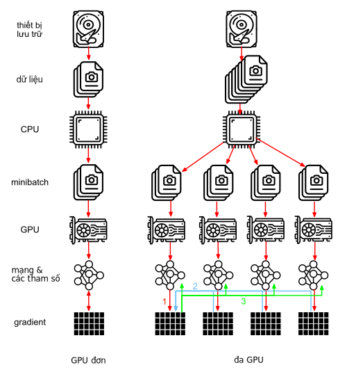
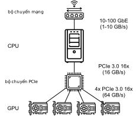
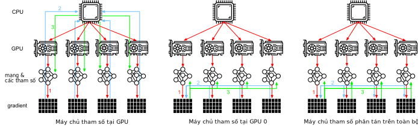
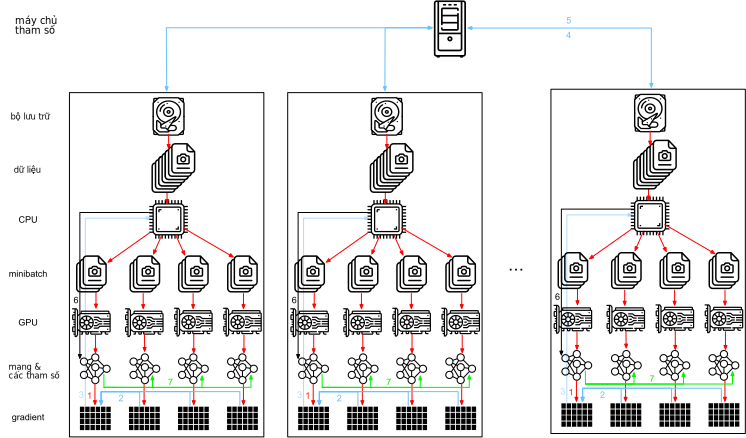
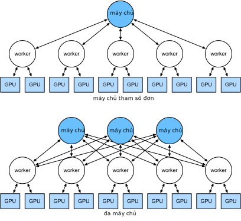

<!--
# Parameter Servers
-->

# Máy chủ Tham số
:label:`sec_parameterserver`

<!--
As we move from single GPUs to multiple GPUs and then to multiple servers containing multiple GPUs, 
possibly all spread out across multiple racks and network switches our algorithms for distributed and parallel training need to become much more sophisticated.
Details matter since different interconnects have very different bandwidth 
(e.g., NVLink can offer up to 100GB/s across 6 links in an appropriate setting, PCIe 3.0 16x lanes offer 16GB/s while even high speed 100 GbE Ethernet only amounts to 10GB/s).
At the same time it is unreasonable to expect that a statistical modeler be an expert in networking and systems.
-->

Khi ta chuyển từ các GPU đơn sang đa GPU rồi sang nhiều máy chủ đa GPU, có khả năng các GPU được dàn trải qua nhiều khay chứa và bộ chuyển mạch mạng. 
Điều này khiến các giải thuật huấn luyện phân tán và song song trở nên phức tạp hơn nhiều. 
Các chi tiết nhỏ cũng trở nên quan trọng vì các phương thức kết nối khác nhau có băng thông rất khác nhau.
Chẳng hạn, NVLink có băng thông lên tới 100GB/s qua 6 đường kết nối với cách thiết lập thích hợp, PCIe 3.0 16x làn có băng thông 16GB/s, trong khi ngay cả Ethernet 100GbE tốc độ cao chỉ đạt 10GB/s.
Ngoài ra, khó có thể hy vọng rằng một nhà xây dựng mô hình thống kê cũng là một chuyên gia về kết nối mạng và hệ thống.

<!--
The core idea of the parameter server was introduced in :cite:`Smola.Narayanamurthy.2010` in the context of distributed latent variable models.
A description of the push and pull semantics then followed in :cite:`Ahmed.Aly.Gonzalez.ea.2012` and a description of the system and an open source library followed in :cite:`Li.Andersen.Park.ea.2014`.
In the following we will motivate the components needed for efficiency.
-->

Ý tưởng cốt lõi của máy chủ tham số được đề xuất từ :cite:`Smola.Narayanamurthy.2010` trong ngữ cảnh các mô hình biến ẩn phân tán. 
Kế tiếp, một bản mô tả về ý nghĩa của tác vụ đẩy và kéo (*push and pull*) được giới thiệu trong :cite:`Ahmed.Aly.Gonzalez.ea.2012` và một bản mô tả về hệ thống này cùng với thư viện mã nguồn mở được công bố trong :cite:`Li.Andersen.Park.ea.2014`.
Trong phần kế tiếp, ta sẽ tìm hiểu các thành phần cần thiết để đạt được hiệu suất cao.

<!--
## Data Parallel Training
-->

## Huấn luyện Song song Dữ liệu

<!--
Let us review the data parallel training approach to distributed training.
We will use this to the exclusion of all others in this section since it is significantly simpler to implement in practice.
There are virtually no use cases (besides deep learning on graphs) where any other strategy for parallelism is preferred since GPUs have plenty of memory nowadays.
:numref:`fig_parameterserver` describes the variant of data parallelism that we implemented in the previous section.
The key aspect in it is that the aggregation of gradients occurs on GPU0 before the updated parameters are rebroadcast to all GPUs.
-->

Hãy cùng xem xét tổng quan phương pháp huấn luyện song song dữ liệu cho việc huấn luyện phân tán.
Ta bắt đầu bằng cách này vì việc lập trình sẽ trở nên đơn giản hơn nhiều so với những cách khác. 
Vì các GPU ngày nay có khá nhiều bộ nhớ, gần như không có một trường hợp đặc biệt nào (ngoại trừ phương pháp học sâu trên đồ thị) mà một phương pháp song song hóa khác lại thích hợp hơn.
:numref:`fig_parameterserver` mô tả biến thể của việc song song hóa dữ liệu mà ta đã lập trình ở phần trước.
Khía cạnh then chốt ở dạng này là việc tổng hợp gradient diễn ra trên GPU 0 trước khi các tham số cập nhật được phân phát tới tất cả GPU.

<!--

-->

:label:`fig_parameterserver`

<!--
In retrospect, the decision to aggregate on GPU0 seems rather ad-hoc.
After all, we might just as well aggregate on the CPU.
In fact, we could even decide to aggregate some of the parameters on one GPU and some others on another.
Provided that the optimization algorithm supports this, there is no real reason for why we could not.
For instance, if we have four parameter vectors $\mathbf{v}_1, \ldots, \mathbf{v}_4$ with associated gradients $\mathbf{g}_1, \ldots, \mathbf{g}_4$ we could aggregate the gradients on one GPU each.
-->

Nhìn lại, ta không có lý do gì đặc biệt khi quyết định tổng hợp gradient trên GPU 0.
Dù sao thì ta cũng có thể tổng hợp gradient trên CPU.
Và ta còn có thể tổng hợp một vài tham số trên một GPU và các tham số còn lại trên một GPU khác.
Miễn là thuật toán tối ưu hỗ trợ điều này, ta không có lý do gì để không thể thực hiện.
Ví dụ, giả sử ta có bốn vector tham số $\mathbf{v}_1, \ldots, \mathbf{v}_4$ với các gradient tương ứng là $\mathbf{g}_1, \ldots, \mathbf{g}_4$, ta có thể tổng hợp gradient của mỗi vector tham số trên một GPU.

$$\mathbf{g}_{i} = \sum_{j \in \mathrm{GPU}} \mathbf{g}_{ij}$$

<!--
This reasoning seems arbitrary and frivolous.
After all, the math is the same throughout.
However, we are dealing with real physical hardware where different buses have different bandwidth as discussed in :numref:`sec_hardware`.
Consider a real 4-way GPU server as described in :numref:`fig_bw_hierarchy`.
If it is particularly well connected, it might have a 100 GbE network card.
More typical numbers are in the 1-10 GbE range with an effective bandwidth of 100MB/s to 1GB/s.
Since the CPUs have too few PCIe lanes to connect to all GPUs directly 
(e.g., consumer grade Intel CPUs have 24 lanes) we need a [multiplexer](https://www.broadcom.com/products/pcie-switches-bridges/pcie-switches).
The bandwidth from the CPU on a 16x Gen3 link is 16GB/s.
This is also the speed at which *each* of the GPUs is connected to the switch. This means that it is more effective to communicate between the
-->

Cách lý luận này trông có vẻ rất tùy tiện và vô nghĩa.
Sau cùng, phần toán xuyên suốt bên dưới vẫn không thay đổi.
Nhưng ở đây chúng ta đang làm việc cùng các thiết bị phần cứng vật lý với các bus có băng thông khác nhau như đã thảo luận ở :numref:`sec_hardware`.
Xét một máy chủ GPU 4-chiều được mô tả trong :numref:`fig_bw_hierarchy`.
Nếu nó được kết nối cực kỳ tốt, nó có thể sở hữu một card mạng với tốc độ 100 GbE.
Những con số phổ biến hơn thường nằm trong khoảng 1-10 GbE với băng thông hiệu dụng từ 100MB/s đến 1GB/s.
Vì các CPU thường có quá ít làn PCIe để kết nối trực tiếp với toàn bộ GPU
(ví dụ, CPU thông dụng của Intel có 24 làn) ta cần một [mạch đa hợp (*multiplexer*)](https://www.broadcom.com/products/pcie-switches-bridges/pcie-switches).
Băng thông tới CPU qua cổng PCIe 16 làn thế hệ 3 là 16GB/s.
Đây cũng là tốc độ mà *mỗi* GPU được kết nối với bộ chuyển mạch. Điều này có nghĩa là việc truyền tin trực tiếp giữa các GPU sẽ hiệu quả hơn.

<!--

-->

:label:`fig_bw_hierarchy`

<!--
For the sake of the argument let us assume that the gradients 'weigh' 160MB.
In this case it takes 30ms to send the gradients from all 3 remaining GPUs to the fourth one (each transfer takes 10ms = 160MB / 16 GB/s).
Add another 30ms to transmit the weight vectors back we arrive at a total of 60ms.
If we send all data to the CPU we incur a penalty of 40ms since *each* of the four GPUs needs to send the data to the CPU, yielding a total of 80ms.
Lastly assume that we are able to split the gradients into 4 parts of 40MB each.
Now we can aggregate each of the parts on a different GPU *simultaneously* since the PCIe switch offers a full-bandwidth operation between all links.
Instead of 30ms this takes 7.5ms, yielding a total of 15ms for a synchronization operation.
In short, depending on how we synchronize parameters the same operation can take anywhere from 15ms to 80ms.
:numref:`fig_ps_distributed` depicts the different strategies for exchanging parameters.
-->

Để minh họa cho luận điểm trên, giả sử ta cần 160MB để lưu trữ các gradient.
Trong trường hợp này, sẽ tốn 30ms để gửi các giá trị gradient này từ 3 thiết bị GPU đến chiếc GPU còn lại (mỗi đợt truyền tin tốn 10ms = 160MB / 16GB/s).
Việc truyền lại các vector trọng số mất thêm 30ms nữa, tổng cộng tốn 60ms.
Nếu ta gửi toàn bộ dữ liệu đến CPU sẽ phát sinh thêm 40ms vì *mỗi* GPU cần gửi dữ liệu đến CPU, và tính cả thời gian truyền lại các vector trọng số sẽ tốn 80ms.
Cuối cùng, giả định rằng ta có thể chia nhỏ các giá trị gradient thành bốn phần, mỗi phần 40MB.
Giờ ta có thể tổng hợp mỗi phần trên một GPU riêng biệt *một cách đồng thời* vì bộ chuyển mạch PCIe cho phép sử dụng toàn bộ băng thông cho mỗi kết nối.
Thay vì 30ms như trước, quá trình này chỉ tốn 7.5ms và 15ms cho toàn bộ quá trình đồng bộ.
Nói ngắn gọn, tùy thuộc vào cách các tham số được đồng bộ với nhau, quá trình này có thể chiếm từ 15ms đến 80ms.
:numref:`fig_ps_distributed` minh họa sự khác biệt giữa các chiến lược trao đổi tham số khác nhau.

<!--

-->

:label:`fig_ps_distributed`

<!--
Note that we have yet another tool at our disposal when it comes to improving performance: in a deep network it takes some time to compute all gradients from the top to the bottom.
We can begin synchronizing gradients for some parameter groups even while we are still busy computing them for others (the technical details for that are somewhat involved).
See e.g., :cite:`Sergeev.Del-Balso.2018` for details on how to do this in [Horovod](https://github.com/horovod/horovod).
-->

Lưu ý rằng ta còn một công cụ nữa để sử dụng khi muốn cải thiện hiệu suất: trong một mạng sâu sẽ cần một khoảng thời gian để tính toán toàn bộ gradient từ trên xuống dưới.
Ta có thể bắt đầu đồng bộ gradient cho một vài nhóm tham số trong khi chúng ta vẫn đang bận tính gradient cho những nhóm khác (các chi tiết kỹ thuật để thực hiện việc này khá phức tạp).
Bạn đọc hãy tham khảo :cite:`Sergeev.Del-Balso.2018` để biết chi tiết cách làm điều này trong [Horovod](https://github.com/horovod/horovod).

<!--
## Ring Synchronization
-->

## Đồng bộ dạng Vòng

<!--
When it comes to synchronization on modern deep learning hardware we often encounter significantly bespoke network connectivity.
For instance, the AWS P3.16xlarge and NVIDIA DGX-2 instances share the connectivity structure of :numref:`fig_nvlink`.
Each GPU connects to a host CPU via a PCIe link which operates at best at 16 GB/s.
Additionally each GPU also has 6 NVLink connections, each of which is capable of transferring 300 Gbit/s bidirectionally.
This amounts to around 18 GB/s per link per direction.
In short, the aggregate NVLink bandwidth is significantly higher than the PCIe bandwidth.
The question is how to use it most efficiently.
-->

Khi nói tới đồng bộ hóa trên các phần cứng học sâu tiên tiến, ta thường gặp những cách kết nối mạng rất riêng.
Ví dụ, máy P3.16xlarge trên AWS và NVIDIA DGX-2 cùng sử dụng cấu trúc kết nối trong :numref:`fig_nvlink`.
Mỗi GPU kết nối với một CPU chủ thông qua kết nối PCIe có tốc độ tối đa là 16 GB/s.
Hơn nữa, mỗi GPU có 6 kết nối NVLink với khả năng truyền đến 300 Gbit/s theo cả hai hướng.
Điều này có nghĩa là mỗi kết nối sẽ có tốc độ khoảng 18 GB/s theo mỗi hướng.
Nói ngắn gọn, băng thông tổng hợp của NVLink lớn hơn đáng kể so với băng thông của PCIe.
Câu hỏi đặt ra là làm sao để tận dụng triệt để điều đó.

<!--

-->

:label:`fig_nvlink`

<!--
It turns out :cite:`Wang.Li.Liberty.ea.2018` that the optimal synchronization strategy is to decompose the network into two rings and to use them to synchronize data directly.
:numref:`fig_nvlink_twoloop` illustrates that the network can be decomposed into one ring (1-2-3-4-5-6-7-8-1) with double NVLink bandwidth and into one (1-4-6-3-5-8-2-7-1) with regular bandwidth.
Designing an efficient synchronization protocol in this case is nontrivial.
-->

Hóa ra theo :cite:`Wang.Li.Liberty.ea.2018`, chiến thuật đồng bộ tối ưu là phân tách mạng thành hai kết nối dạng vòng và sử dụng chúng để đồng bộ dữ liệu một cách trực tiếp.
:numref:`fig_nvlink_twoloop` minh họa việc mạng có thể được phân tách thành một kết nối dạng vòng (1-2-3-4-5-6-7-8-1) với băng thông NVLink gấp đôi và một kết nối dạng vòng khác (1-4-6-3-5-8-2-7-1) với băng thông bình thường.
Việc thiết kế một giao thức đồng bộ hóa hiệu quả trong trường hợp này không hề đơn giản.

<!--

-->

:label:`fig_nvlink_twoloop`

<!--
Consider the following thought experiment: given a ring of $n$ compute nodes (or GPUs) we can send gradients from the first to the second node.
There it is added to the local gradient and sent on to the third node, and so on.
After $n-1$ steps the aggregate gradient can be found in the last-visited node.
That is, the time to aggregate gradients grows linearly with the number of nodes.
But if we do this the algorithm is quite inefficient.
After all, at any time there is only one of the nodes communicating.
What if we broke the gradients into $n$ chunks and started synchronizing chunk $i$ starting at node $i$.
Since each chunk is of size $1/n$ the total time is now $(n-1)/n \approx 1$.
In other words, the time spent to aggregate gradients *does not grow* as we increase the size of the ring.
This is quite an astonishing result.
:numref:`fig_ringsync` illustrates the sequence of steps on $n=4$ nodes.
-->

Xét một thí nghiệm tưởng tượng như sau: cho một kết nối dạng vòng có $n$ đơn vị tính toán (GPU) ta có thể truyền các giá trị gradient từ thiết bị thứ nhất đến thiết bị thứ hai.
Ở đó nó sẽ được cộng thêm vào gradient cục bộ và rồi truyền tiếp đến thiết bị thứ ba, và tiếp tục như vậy với các thiết bị sau.
Sau $n-1$ bước, gradient tổng hợp sẽ nằm ở thiết bị cuối cùng.
Điều này có nghĩa là thời gian tổng hợp gradient sẽ tăng tuyến tính theo số lượng thiết bị trong mạng.
Nhưng nếu ta làm vậy, thuật toán sẽ hoạt động kém hiệu quả.
Dù sao, tại mọi thời điểm chỉ có một thiết bị thực hiện việc truyền tin.
Chuyện gì sẽ xảy ra nếu ta chia các giá trị gradient thành $n$ khúc và bắt đầu đồng bộ khúc thứ $i$ tại thiết bị $i$?
Vì mỗi khúc có kích thước $1/n$, tổng thời gian giờ sẽ là $(n-1)/n \approx 1$.
Nói cách khác, thời gian tổng hợp gradient *không tăng* khi ta tăng số thiết bị trong mạng.
Quả là một kết quả đáng kinh ngạc.
:numref:`fig_ringsync` minh họa chuỗi các bước với số thiết bị $n=4$.

<!--

-->

:label:`fig_ringsync`

<!--
If we use the same example of synchronizing 160MB across 8 V100 GPUs we arrive at approximately $2 \cdot 160 \mathrm{MB} / (3 \cdot 18 \mathrm{GB/s}) \approx 6 \mathrm{ms}$.
This is quite a bit better than using the PCIe bus, even though we are now using 8 GPUs.
Note that in practice these numbers are quite a bit worse, since deep learning frameworks often fail to assemble communication into large burst transfers. Moreover, timing is critical.
Note that there is a common misconception that ring synchronization is fundamentally different from other synchronization algorithms.
The only difference is that the synchronization path is somewhat more elaborate when compared to a simple tree.
-->

Nếu vẫn sử dụng ví dụ đồng bộ 160 MB trên 8 GPU V100, ta có thể đạt xấp xỉ $2 \cdot 160 \mathrm{MB} / (3 \cdot 18 \mathrm{GB/s}) \approx 6 \mathrm{ms}$.
Kết quả này tốt hơn so với việc sử dụng bus PCIe một chút, mặc dù lúc này ta sử dụng đến 8 GPU.
Chú ý rằng trong thực tế những con số này sẽ không được tốt như vậy, do các framework học sâu thường gặp khó khăn trong việc tổng hợp thông tin thành cụm lớn hơn để truyền đi.
Hơn nữa, việc định thời là cực kì quan trọng.
Lưu ý, mọi người thường hiểu nhầm rằng đồng bộ vòng có bản chất khác hẳn so với các thuật toán đồng bộ khác.
Thực ra điểm khác biệt duy nhất nằm ở đường đi đồng bộ có phần tinh vi hơn so với phương pháp cây đơn giản.

<!--
## Multi-Machine Training
-->

## Huấn luyện trên Nhiều Máy tính

<!--
Distributed training on multiple machines adds a further challenge: 
we need to communicate with servers that are only connected across a comparatively lower bandwidth fabric which can be over an order of magnitude slower in some cases.
Synchronization across devices is tricky.
After all, different machines running training code will have subtly different speed.
Hence we need to *synchronize* them if we want to use synchronous distributed optimization.
:numref:`fig_ps_multimachine` illustrates how distributed parallel training occurs.
-->

Việc huấn luyện phân tán trên nhiều máy tính tạo nên một thử thách mới:
ta cần phải giao tiếp với các máy chủ chỉ được liên kết với nhau qua loại cáp có băng thông tương đối thấp. Trong một số trường hợp tốc độ thậm chí có thể chậm gấp hơn 10 lần.
Đồng bộ nhiều thiết bị là công việc khá phức tạp.
Suy cho cùng, mỗi máy tính khác nhau chạy đoạn mã huấn luyện với tốc độ khác nhau đôi chút.
Do đó ta cần *đồng bộ* chúng nếu muốn sử dụng tối ưu phân tán đồng bộ.
:numref:`fig_ps_multimachine` mô tả quá trình huấn luyện phân tán song song.

<!--
1. A (different) batch of data is read on each machine, split across multiple GPUs and transferred to GPU memory. There predictions and gradients are computed on each GPU batch separately.
2. The gradients from all local GPUs are aggregated on one GPU (or alternatively parts of it are aggregated over different GPUs.
3. The gradients are sent to the CPU.
4. The CPU sends the gradients to a central parameter server which aggregates all the gradients.
5. The aggregate gradients are then used to update the weight vectors and the updated weight vectors are broadcast back to the individual CPUs.
6. The information is sent to one (or multiple) GPUs.
7. The updated weight vectors are spread across all GPUs.
-->

1. Một batch dữ liệu (khác nhau) được đọc trên mỗi máy tính, chia đều cho các GPU và truyền đến bộ nhớ của GPU.
Ở đó các dự đoán và gradient được tính toán riêng biệt theo từng batch trên các GPU khác nhau.
2. Các gradient trên tất cả các GPU cục bộ được tổng hợp trên một GPU (hoặc các phần khác nhau được tổng hợp trên nhiều GPU khác nhau).
3. Các gradient được truyền đến CPU.
4. CPU truyền các gradient đến máy chủ tham số trung tâm để tổng hợp tất cả các gradient.
5. Các gradient tổng sau đó được sử dụng để cập nhật các vector trọng số. Tiếp đó thì các vector trọng số mới được phân phát cho các CPU.
6. Thông tin cập nhật được truyền tới một (hoặc nhiều) GPU.
7. Các vector trọng số đã được cập nhật sau đó được phân bố đều cho tất cả các GPU.

<!--

-->

:label:`fig_ps_multimachine`

<!--
Each of these operations seems rather straightforward.
And, indeed, they can be carried out efficiently *within* a single machine.
Once we look at multiple machines, though, we can see that the central parameter server becomes the bottleneck.
After all, the bandwidth per server is limited, hence for $m$ workers the time it takes to send all gradients to the server is $O(m)$.
We can break through this barrier by increasing the number of servers to $n$.
At this point each server only needs to store $O(1/n)$ of the parameters, hence the total time for updates and optimization becomes $O(m/n)$.
Matching both numbers yields constant scaling regardless of how many workers we are dealing with.
In practice we use the *same* machines both as workers and as servers.
:numref:`fig_ps_multips` illustrates the design.
See also :cite:`Li.Andersen.Park.ea.2014` for details.
In particular, ensuring that multiple machines work without unreasonable delays is nontrivial.
We omit details on barriers and will only briefly touch on synchronous and asynchronous updates below.
-->

Các thao tác trên nhìn qua thì có vẻ khá dễ hiểu.
Quả thật, chúng có thể được thực hiện một cách hiệu quả *trong* một máy tính.
Tuy nhiên khi xét trên nhiều máy tính, ta có thể thấy rằng chính máy chủ tham số trung tâm đã trở thành nút nghẽn cổ chai.
Suy cho cùng, băng thông của mỗi máy chủ là có hạn, do đó đối với $m$ máy thợ, thời gian để truyền toàn bộ gradient đến máy chủ là $O(m)$.
Ta có thể vượt qua rào cản này bằng cách tăng số lượng máy chủ lên $n$.
Khi đó mỗi máy chủ chỉ cần lưu trữ $O(1/n)$ tham số, do đó tổng thời gian cần để cập nhật và tối ưu trở thành $O(m/n)$.
Tổng thời gian này sẽ tăng lên theo hằng số bất kể số lượng máy thợ ta sử dụng là bao nhiêu.
Trong thực tế, các máy tính sẽ vừa là máy chủ và máy thợ.
:numref:`fig_ps_multips` minh hoạ thiết kế này.
Độc giả có thể tham khảo :cite:`Li.Andersen.Park.ea.2014` để biết thêm chi tiết.
Đặc biệt, việc đảm bảo các máy tính hoạt động với độ trễ không quá lớn không phải là một chuyện dễ dàng.
Chúng tôi sẽ bỏ qua chi tiết về các rào cản và chỉ đề cập ngắn gọn tới việc cập nhật đồng bộ và bất đồng bộ dưới đây.

<!--

-->

:label:`fig_ps_multips`

<!--
## (key,value) Stores
-->

## Lưu trữ (Khóa, Giá trị)

<!--
Implementing the steps required for distributed multi-GPU training in practice is nontrivial.
In particular, given the many different choices that we might encounter.
This is why it pays to use a common abstraction, namely that of a (key,value) store with redefined update semantics.
Across many servers and many GPUs the gradient computation can be defined as
-->

Lập trình các bước cần thiết trên cho việc huấn luyện phân tán trên nhiều GPU trong thực tế không hề đơn giản.
Cụ thể, có khả năng ta sẽ gặp rất nhiều lựa chọn khác nhau.
Do đó, rất đáng để sử dụng một phép trừu tượng hóa khá phổ biến là lưu trữ cặp (khóa, giá trị) với cách cập nhật được định nghĩa lại.
Trên nhiều máy chủ và nhiều GPU, việc tính toán gradient có thể được định nghĩa như sau

$$\mathbf{g}_{i} = \sum_{k \in \mathrm{máy~thợ}} \sum_{j \in \mathrm{GPU}} \mathbf{g}_{ijk}.$$

<!--
The key aspect in this operation is that it is a *commutative reduction*, that is, it turns many vectors into one and the order in which the operation is applied does not matter.
This is great for our purposes since we do not (need to) have fine grained control over when which gradient is received.
Note that it is possible for us to perform the reduction stagewise.
Furthermore, note that this operation is independent between blocks $i$ pertaining to different parameters (and gradients).
-->

Đặc điểm chính của thao tác này nằm ở việc nó là một *phép rút gọn có tính giao hoán*, tức nó gộp nhiều vector thành một vector và thứ tự áp dụng thao tác này không quan trọng.
Vì không cần (phải) kiểm soát chi tiết thời điểm gradient được nhận, thao tác này rất phù hợp với mục đích của chúng ta.
Lưu ý rằng ta có thể thực hiện phép rút gọn theo từng bước.
Thêm nữa, chú ý rằng thao tác này độc lập giữa các khối $i$ gắn liền với các tham số (và các gradient) khác nhau.

<!--
This allows us to define the following two operations: push, which accumulates gradients, and pull, which retrieves aggregate gradients.
Since we have many different sets of gradients (after all, we have many layers), we need to index the gradients with a key $i$.
This similarity to (key,value) stores, such as the one introduced in Dynamo :cite:`DeCandia.Hastorun.Jampani.ea.2007` is not by coincidence.
They, too, satisfy many similar characteristics, in particular when it comes to distributing the parameters across multiple servers.
-->

Điều này cho phép ta định nghĩa hai thao tác sau: đẩy, để cộng dồn gradient; và kéo, để lấy lại gradient được cộng dồn.
Vì ta có nhiều tập gradient (do có nhiều tầng), ta cần gán chỉ số cho gradient bằng khóa $i$.
Sự giống nhau giữa phương pháp này và việc lưu trữ (khóa, giá trị) như phương pháp được giới thiệu trong Dynamo :cite:`DeCandia.Hastorun.Jampani.ea.2007` không phải là ngẫu nhiên.
Chúng thỏa mãn rất nhiều tính chất, cụ thể là khi phân phối các tham số cho nhiều máy chủ.

<!--
* **push(key, value)** sends a particular gradient (the value) from a worker to a common storage. There the parameter is aggregated, e.g., by summing it up.
* **pull(key, value)** retrieves an aggregate parameter from common storage, e.g., after combining the gradients from all workers.
-->

* **đẩy (khóa, giá trị)** gửi một gradient cụ thể (giá trị) từ máy thợ đến thiết bị lưu trữ chung.
Tại đây các tham số được tổng hợp lại, ví dụ bằng cách lấy tổng.
* **kéo (khóa, giá trị)** lấy lại tham số đã được tổng hợp từ thiết bị lưu trữ chung, sau khi đã kết hợp gradient từ tất cả máy thợ. 

<!--
By hiding all the complexity about synchronization behind a simple push and pull operation we can decouple the concerns of the statistical modeler 
who wants to be able to express optimization in simple terms and the systems engineer who needs to deal with the complexity inherent in distributed synchronization.
In the next section we will experiment with such a (key,value) store in practice.
-->

Bằng cách ẩn đi sự phức tạp của việc đồng bộ sau các thao tác đơn giản là đẩy và kéo, ta có thể tách những mối bận tâm theo hai hướng: của các nhà mô hình thống kê,
những người muốn biểu diễn việc tối ưu một cách đơn giản và các kỹ sư hệ thống, những người cần giải quyết sự phức tạp sẵn có trong việc đồng bộ hóa phân tán.
Trong phần tiếp theo ta sẽ thử nghiệm việc lưu trữ (khóa, giá trị) trong thực tế.

<!--
## Summary
-->

## Tóm tắt

<!--
* Synchronization needs to be highly adaptive to specific network infrastructure and connectivity within a server. This can make a significant difference to the time it takes to synchronize.
* Ring-synchronization can be optimal for P3 and DGX-2 servers. For others possibly not so much.
* A hierarchical synchronization strategy works well when adding multiple parameter servers for increased bandwidth.
* Asynchronous communication (while computation is still ongoing) can improve performance.
-->

* Việc đồng bộ cần có độ thích ứng cao với hạ tầng mạng cụ thể và kết nối trong máy chủ.
Điều này có thể tạo ra khác biệt đáng kể trong thời gian đồng bộ.
* Đồng bộ dạng vòng có thể là phương án tối ưu với các máy chủ P3 và DGX-2, còn với các loại máy chủ khác thì không hẳn.
* Chiến lược đồng bộ phân cấp rất tốt khi thêm nhiều máy chủ tham số để tăng băng thông.
* Giao tiếp bất đồng bộ (khi việc tính toán vẫn đang diễn ra) có thể cải thiện hiệu năng.

<!--
## Exercises
-->

## Bài tập

<!--
1. Can you increase the ring synchronization even further? Hint: you can send messages in both directions.
2. Fully asynchronous. Some delays permitted?
3. Fault tolerance. How? What if we lose a server? Is this a problem?
4. Checkpointing
5. Tree aggregation. Can you do it faster?
6. Other reductions (commutative semiring).
-->

1. Bạn có thể cải thiện đồng bộ dạng vòng hơn nữa không? Gợi ý: bạn có thể gửi thông tin theo cả hai chiều.
2. Đồng bộ bất đối xứng hoàn toàn có độ trễ nào không?
3. Nên để khả năng chịu lỗi (*fault tolerance*) như thế nào?  Nếu một máy chủ gặp trục trặc thì sao? Đây có phải vấn đề nghiêm trọng không?
4. Lưu checkpoint như thế nào?
5. Bạn có thể tăng tốc việc tổng hợp dạng cây (*tree aggregation*) không?
6. Tìm hiểu các cách rút gọn khác (như dạng bán vòng giao hoán - *commutative semiring*).

## Thảo luận
* [Tiếng Anh](https://discuss.d2l.ai/t/366)
* [Tiếng Việt](https://forum.machinelearningcoban.com/c/d2l)

## Những người thực hiện
Bản dịch trong trang này được thực hiện bởi:

* Đoàn Võ Duy Thanh
* Nguyễn Mai Hoàng Long
* Phạm Hồng Vinh
* Lê Khắc Hồng Phúc
* Nguyễn Văn Cường
* Đỗ Trường Giang
* Nguyễn Thanh Hòa
* Phạm Minh Đức
* Nguyễn Lê Quang Nhật
