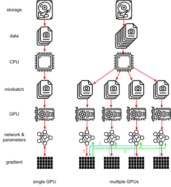
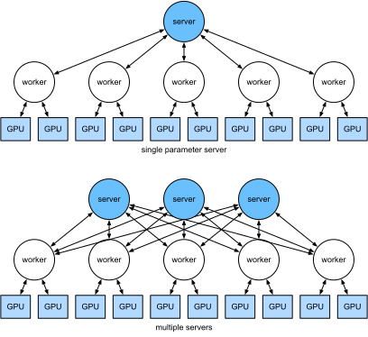

<!-- ===================== Bắt đầu dịch Phần  ==================== -->
<!-- ========================================= REVISE PHẦN  - BẮT ĐẦU =================================== -->

<!--
# Parameter Servers
-->

# *dịch tiêu đề phía trên*
:label:`sec_parameterserver`

<!--
As we move from single GPUs to multiple GPUs and then to multiple servers containing multiple GPUs, 
possibly all spread out across multiple racks and network switches our algorithms for distributed and parallel training need to become much more sophisticated.
Details matter since different interconnects have very different bandwidth 
(e.g., NVLink can offer up to 100GB/s across 6 links in an appropriate setting, PCIe 3.0 16x lanes offer 16GB/s while even high speed 100 GbE Ethernet only amounts to 10GB/s).
At the same time it is unreasonable to expect that a statistical modeler be an expert in networking and systems.
-->

*dịch đoạn phía trên*

<!--
The core idea of the parameter server was introduced in :cite:`Smola.Narayanamurthy.2010` in the context of distributed latent variable models.
A description of the push and pull semantics then followed in :cite:`Ahmed.Aly.Gonzalez.ea.2012` and a description of the system and an open source library followed in :cite:`Li.Andersen.Park.ea.2014`.
In the following we will motivate the components needed for efficiency.
-->

*dịch đoạn phía trên*

<!--
## Data Parallel Training
-->

## *dịch tiêu đề phía trên*

<!--
Let us review the data parallel training approach to distributed training.
We will use this to the exclusion of all others in this section since it is significantly simpler to implement in practice.
There are virtually no use cases (besides deep learning on graphs) where any other strategy for parallelism is preferred since GPUs have plenty of memory nowadays.
:numref:`fig_parameterserver` describes the variant of data parallelism that we implemented in the previous section.
The key aspect in it is that the aggregation of gradients occurs on GPU0 before the updated parameters are rebroadcast to all GPUs.
-->

*dịch đoạn phía trên*

<!--

-->

:label:`fig_parameterserver`

<!-- ===================== Kết thúc dịch Phần 1 ===================== -->

<!-- ===================== Bắt đầu dịch Phần 2 ===================== -->

<!--
In retrospect, the decision to aggregate on GPU0 seems rather ad-hoc.
After all, we might just as well aggregate on the CPU.
In fact, we could even decide to aggregate some of the parameters on one GPU and some others on another.
Provided that the optimization algorithm supports this, there is no real reason for why we could not.
For instance, if we have four parameter vectors $\mathbf{v}_1, \ldots, \mathbf{v}_4$ with associated gradients $\mathbf{g}_1, \ldots, \mathbf{g}_4$ we could aggregate the gradients on one GPU each.
-->

*dịch đoạn phía trên*

$$\mathbf{g}_{i} = \sum_{j \in \mathrm{GPU}} \mathbf{g}_{ij}$$

<!--
This reasoning seems arbitrary and frivolous.
After all, the math is the same throughout.
However, we are dealing with real physical hardware where different buses have different bandwidth as discussed in :numref:`sec_hardware`.
Consider a real 4-way GPU server as described in :numref:`fig_bw_hierarchy`.
If it is particularly well connected, it might have a 100 GbE network card.
More typical numbers are in the 1-10 GbE range with an effective bandwidth of 100MB/s to 1GB/s.
Since the CPUs have too few PCIe lanes to connect to all GPUs directly 
(e.g., consumer grade Intel CPUs have 24 lanes) we need a [multiplexer](https://www.broadcom.com/products/pcie-switches-bridges/pcie-switches).
The bandwidth from the CPU on a 16x Gen3 link is 16GB/s.
This is also the speed at which *each* of the GPUs is connected to the switch. This means that it is more effective to communicate between the
-->

*dịch đoạn phía trên*

<!--

-->

:label:`fig_bw_hierarchy`

<!--
For the sake of the argument let us assume that the gradients 'weigh' 160MB.
In this case it takes 30ms to send the gradients from all 3 remaining GPUs to the fourth one (each transfer takes 10ms = 160MB / 16 GB/s).
Add another 30ms to transmit the weight vectors back we arrive at a total of 60ms.
If we send all data to the CPU we incur a penalty of 40ms since *each* of the four GPUs needs to send the data to the CPU, yielding a total of 80ms.
Lastly assume that we are able to split the gradients into 4 parts of 40MB each.
Now we can aggregate each of the parts on a different GPU *simultaneously* since the PCIe switch offers a full-bandwidth operation between all links.
Instead of 30ms this takes 7.5ms, yielding a total of 15ms for a synchronization operation.
In short, depending on how we synchronize parameters the same operation can take anywhere from 15ms to 80ms.
:numref:`fig_ps_distributed` depicts the different strategies for exchanging parameters.
-->

*dịch đoạn phía trên*

<!--

-->

:label:`fig_ps_distributed`

<!--
Note that we have yet another tool at our disposal when it comes to improving performance: in a deep network it takes some time to compute all gradients from the top to the bottom.
We can begin synchronizing gradients for some parameter groups even while we are still busy computing them for others (the technical details for that are somewhat involved).
See e.g., :cite:`Sergeev.Del-Balso.2018` for details on how to do this in [Horovod](https://github.com/horovod/horovod).
-->

*dịch đoạn phía trên*

<!-- ===================== Kết thúc dịch Phần 2 ===================== -->

<!-- ===================== Bắt đầu dịch Phần 3 ===================== -->

<!--
## Ring Synchronization
-->

## *dịch tiêu đề phía trên*

<!--
When it comes to synchronization on modern deep learning hardware we often encounter significantly bespoke network connectivity.
For instance, the AWS P3.16xlarge and NVIDIA DGX-2 instances share the connectivity structure of :numref:`fig_nvlink`.
Each GPU connects to a host CPU via a PCIe link which operates at best at 16 GB/s.
Additionally each GPU also has 6 NVLink connections, each of which is capable of transferring 300 Gbit/s bidirectionally.
This amounts to around 18 GB/s per link per direction.
In short, the aggregate NVLink bandwidth is significantly higher than the PCIe bandwidth.
The question is how to use it most efficiently.
-->

*dịch đoạn phía trên*

<!--

-->

:label:`fig_nvlink`

<!--
It turns out :cite:`Wang.Li.Liberty.ea.2018` that the optimal synchronization strategy is to decompose the network into two rings and to use them to synchronize data directly.
:numref:`fig_nvlink_twoloop` illustrates that the network can be decomposed into one ring (1-2-3-4-5-6-7-8-1) with double NVLink bandwidth and into one (1-4-6-3-5-8-2-7-1) with regular bandwidth.
Designing an efficient synchronization protocol in this case is nontrivial.
-->

*dịch đoạn phía trên*

<!--

-->

:label:`fig_nvlink_twoloop`

<!--
Consider the following thought experiment: given a ring of $n$ compute nodes (or GPUs) we can send gradients from the first to the second node.
There it is added to the local gradient and sent on to the third node, and so on.
After $n-1$ steps the aggregate gradient can be found in the last-visited node.
That is, the time to aggregate gradients grows linearly with the number of nodes.
But if we do this the algorithm is quite inefficient.
After all, at any time there is only one of the nodes communicating.
What if we broke the gradients into $n$ chunks and started synchronizing chunk $i$ starting at node $i$.
Since each chunk is of site $1/n$ the total time is now $(n-1)/n \approx 1$.
In other words, the time spent to aggregate gradients *does not grow* as we increase the size of the ring.
This is quite an astonishing result.
:numref:`fig_ringsync` illustrates the sequence of steps on $n=4$ nodes.
-->

*dịch đoạn phía trên*

<!-- ===================== Kết thúc dịch Phần 3 ===================== -->

<!-- ===================== Bắt đầu dịch Phần 4 ===================== -->

<!--

-->

:label:`fig_ringsync`

<!--
If we use the same example of synchronizing 160MB across 8 V100 GPUs we arrive at approximately $2 \cdot 160 \mathrm{MB} / (3 \cdot 18 \mathrm{GB/s}) \approx 6 \mathrm{ms}$.
This is quite a bit better than using the PCIe bus, even though we are now using 8 GPUs.
Note that in practice these numbers are quite a bit worse, since deep learning frameworks often fail to assemble communication into large burst transfers. Moreover, timing is critical.
Note that there is a common misconception that ring synchronization is fundamentally different from other synchronization algorithms.
The only difference is that the synchronization path is somewhat more elaborate when compared to a simple tree.
-->

*dịch đoạn phía trên*

<!-- ========================================= REVISE PHẦN 1 - KẾT THÚC ===================================-->

<!-- ========================================= REVISE PHẦN 2 - BẮT ĐẦU ===================================-->

<!--
## Multi-Machine Training
-->

## *dịch tiêu đề phía trên*

<!--
Distributed training on multiple machines adds a further challenge: 
we need to communicate with servers that are only connected across a comparatively lower bandwidth fabric which can be over an order of magnitude slower in some cases.
Synchronization across devices is tricky.
After all, different machines running training code will have subtly different speed.
Hence we need to *synchronize* them if we want to use synchronous distributed optimization.
:numref:`fig_ps_multimachine` illustrates how distributed parallel training occurs.
-->

*dịch đoạn phía trên*

<!--
1. A (different) batch of data is read on each machine, split across multiple GPUs and transferred to GPU memory. There predictions and gradients are computed on each GPU batch separately.
2. The gradients from all local GPUs are aggregated on one GPU (or alternatively parts of it are aggregated over different GPUs.
3. The gradients are sent to the CPU.
4. The CPU sends the gradients to a central parameter server which aggregates all the gradients.
5. The aggregate gradients are then used to update the weight vectors and the updated weight vectors are broadcast back to the individual CPUs.
6. The information is sent to one (or multiple) GPUs.
7. The updated weight vectors are spread across all GPUs.
-->

*dịch đoạn phía trên*

<!--

-->

:label:`fig_ps_multimachine`

<!-- ===================== Kết thúc dịch Phần 4 ===================== -->

<!-- ===================== Bắt đầu dịch Phần 5 ===================== -->

<!--
Each of these operations seems rather straightforward.
And, indeed, they can be carried out efficiently *within* a single machine.
Once we look at multiple machines, though, we can see that the central parameter server becomes the bottleneck.
After all, the bandwidth per server is limited, hence for $m$ workers the time it takes to send all gradients to the server is $O(m)$.
We can break through this barrier by increasing the number of servers to $n$.
At this point each server only needs to store $O(1/n)$ of the parameters, hence the total time for updates and optimization becomes $O(m/n)$.
Matching both numbers yields constant scaling regardless of how many workers we are dealing with.
In practice we use the *same* machines both as workers and as servers.
:numref:`fig_ps_multips` illustrates the design.
See also :cite:`Li.Andersen.Park.ea.2014` for details.
In particular, ensuring that multiple machines work without unreasonable delays is nontrivial.
We omit details on barriers and will only briefly touch on synchronous and asynchronous updates below.
-->

Mỗi một thao tác trên nhìn qua thì có vẻ khá dễ hiểu.
Và, quả thực, chúng có thể được thực hiện một cách hiệu quả *trong* một máy tính đơn.
Tuy nhiên khi xét trên nhiều máy tính, ta có thể thấy rằng chính máy chủ tham số trung tâm trở thành nút thắt cổ chai (*bottleneck*).
Suy cho cùng, băng thông của mỗi máy chủ là có hạn, do đó đối với $m$ máy thợ thời gian để truyền toàn bộ gradient đến máy chủ là $O(m)$.
Ta có thể phá bỏ rào cản này bằng cách tăng số lượng máy chủ lên $n$.
Khi đó mỗi máy chủ chỉ cần lưu trữ $O(1/n)$ trên tổng số các tham số, do đó tổng thời gian cần để cập nhật và tối ưu trở thành $O(m/n)$.
Để chọn hai con số này sao cho phù hợp, ta buộc phải thay đổi tỉ lệ hằng số bất kể số lượng máy thợ ta sử dụng là bao nhiêu.
Trong thực tế các máy tính ta sử dụng vừa đóng vai trò là máy thợ, vừa đóng vai trò là máy chủ.
:numref:`fig_ps_multips` minh hoạ thiết kế này.
Bạn đọc có thể đọc :cite:`Li.Andersen.Park.ea.2014` để biết thêm chi tiết.
Cụ thể, việc đảm bảo các máy tính hoạt động với độ trễ không quá lớn không phải là một chuyện dễ dàng.
Ta bỏ qua chi tiết về các rào cản và chỉ đề cập ngắn gọn về việc cập nhật đồng bộ và bất đồng bộ ở dưới.

<!--

-->

:label:`fig_ps_multips`

<!--
## (key,value) Stores
-->

## Lưu trữ cặp (khoá, giá trị)

<!--
Implementing the steps required for distributed multi-GPU training in practice is nontrivial.
In particular, given the many different choices that we might encounter.
This is why it pays to use a common abstraction, namely that of a (key,value) store with redefined update semantics.
Across many servers and many GPUs the gradient computation can be defined as
-->

Lập trình các bước cần thiết trên cho việc huấn luyện phân tán trên nhiều GPU trong thực tế không hề đơn giản.
Cụ thể, ta có thể phải đối mặt với rất nhiều lựa chọn khác nhau.
Đây chính là lý do ta cần phải sử dụng một cách trừu tượng hoá khá phổ biến, ấy là lưu trữ cặp (khoá, giá trị) với cách cập nhật cần phải được định nghĩa lại.
Trên nhiều máy chủ và nhiều GPU, việc tính toán gradient có thể được định nghĩa là

$$\mathbf{g}_{i} = \sum_{k \in \mathrm{workers}} \sum_{j \in \mathrm{GPU}} \mathbf{g}_{ijk}.$$

<!--
The key aspect in this operation is that it is a *commutative reduction*, that is, it turns many vectors into one and the order in which the operation is applied does not matter.
This is great for our purposes since we do not (need to) have fine grained control over when which gradient is received.
Note that it is possible for us to perform the reduction stagewise.
Furthermore, note that this operation is independent between blocks $i$ pertaining to different parameters (and gradients).
-->

Đặc điểm chính của thao tác này nằm ở việc nó là một *phép rút gọn có tính giao hoán*, tức là nó biến đổi nhiều vector thành một vector và thứ tự áp dụng thao tác này không quan trọng.
Thao tác này hết sức phù hợp đối với mục đích của ta do ta không (cần phải) kiểm soát chi tiết từng chút một mỗi khi nhận được một gradient.
Chú ý rằng ta có thể thực hiện phép rút gọn theo từng bước.
Thêm nữa, chú ý rằng thao tác này là độc lập giữa các khối $i$ gắn liền với các tham số (và các gradient) khác nhau.

<!-- ===================== Kết thúc dịch Phần 5 ===================== -->

<!-- ===================== Bắt đầu dịch Phần 6 ===================== -->

<!--
This allows us to define the following two operations: push, which accumulates gradients, and pull, which retrieves aggregate gradients.
Since we have many different sets of gradients (after all, we have many layers), we need to index the gradients with a key $i$.
This similarity to (key,value) stores, such as the one introduced in Dynamo :cite:`DeCandia.Hastorun.Jampani.ea.2007` is not by coincidence.
They, too, satisfy many similar characteristics, in particular when it comes to distributing the parameters across multiple servers.
-->

*dịch đoạn phía trên*

<!--
* **push(key, value)** sends a particular gradient (the value) from a worker to a common storage. There the parameter is aggregated, e.g., by summing it up.
* **pull(key, value)** retrieves an aggregate parameter from common storage, e.g., after combining the gradients from all workers.
-->

*dịch đoạn phía trên*

<!--
By hiding all the complexity about synchronization behind a simple push and pull operation we can decouple the concerns of the statistical modeler 
who wants to be able to express optimization in simple terms and the systems engineer who needs to deal with the complexity inherent in distributed synchronization.
In the next section we will experiment with such a (key,value) store in practice.
-->

*dịch đoạn phía trên*

<!-- ===================== Kết thúc dịch Phần 6 ===================== -->

<!-- ===================== Bắt đầu dịch Phần 7 ===================== -->

<!--
## Summary
-->

## Tóm tắt

<!--
* Synchronization needs to be highly adaptive to specific network infrastructure and connectivity within a server. This can make a significant difference to the time it takes to synchronize.
* Ring-synchronization can be optimal for P3 and DGX-2 servers. For others possibly not so much.
* A hierarchical synchronization strategy works well when adding multiple parameter servers for increased bandwidth.
* Asynchronous communication (while computation is still ongoing) can improve performance.
-->

*dịch đoạn phía trên*

<!--
## Exercises
-->

## Bài tập

<!--
1. Can you increase the ring synchronization even further? Hint: you can send messages in both directions.
2. Fully asynchronous. Some delays permitted?
3. Fault tolerance. How? What if we lose a server? Is this a problem?
4. Checkpointing
5. Tree aggregation. Can you do it faster?
6. Other reductions (commutative semiring).
-->

*dịch đoạn phía trên*

<!-- ===================== Kết thúc dịch Phần 7 ===================== -->
<!-- ========================================= REVISE PHẦN 2 - KẾT THÚC ===================================-->

## Thảo luận
* [Tiếng Anh](https://discuss.mxnet.io/t/5319)
* [Tiếng Việt](https://forum.machinelearningcoban.com/c/d2l)

## Những người thực hiện
Bản dịch trong trang này được thực hiện bởi:
<!--
Tác giả của mỗi Pull Request điền tên mình và tên những người review mà bạn thấy
hữu ích vào từng phần tương ứng. Mỗi dòng một tên, bắt đầu bằng dấu `*`.

Tên đầy đủ của các reviewer có thể được tìm thấy tại https://github.com/aivivn/d2l-vn/blob/master/docs/contributors_info.md
-->

* Đoàn Võ Duy Thanh
<!-- Phần 1 -->
* 

<!-- Phần 2 -->
* 

<!-- Phần 3 -->
* 

<!-- Phần 4 -->
* 

<!-- Phần 5 -->
* Đỗ Trường Giang

<!-- Phần 6 -->
* 

<!-- Phần 7 -->
* 
