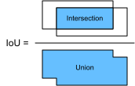

<!--
# Anchor Boxes
-->

# Khung neo
:label:`sec_anchor`


<!--
Object detection algorithms usually sample a large number of regions in the input image, determine whether these regions contain objects of interest,
and adjust the edges of the regions so as to predict the ground-truth bounding box of the target more accurately.
Different models may use different region sampling methods.
Here, we introduce one such method: it generates multiple bounding boxes with different sizes and aspect ratios while centering on each pixel.
These bounding boxes are called anchor boxes.
We will practice object detection based on anchor boxes in the following sections.
-->

Các giải thuật phát hiện vật thể thường lấy mẫu ở rất nhiều vùng của ảnh đầu vào, rồi xác định xem các vùng đó có chứa đối tượng cần quan tâm hay không, và điều chỉnh biên của vùng lấy mẫu này để dự đoán khung chứa nhãn gốc của đối tượng một cách chính xác hơn.
Các mô hình khác nhau có thể dùng các phương pháp lấy mẫu vùng ảnh khác nhau.
Ở đây, chúng tôi sẽ giới thiệu một phương pháp đó là: tạo ra nhiều khung chứa với kích thước và tỷ lệ cạnh khác nhau với tâm trên từng điểm ảnh.
Các khung chứa đó được gọi là các khung neo.
Chúng ta sẽ thực hành phát hiện vật thể dựa trên các khung neo ở các phần sau.

<!--
First, import the packages or modules required for this section.
Here, we have modified the printing accuracy of NumPy.
Because printing tensors actually calls the print function of NumPy, the floating-point numbers in tensors printed in this section are more concise.
-->

Trước tiên, hãy nhập các gói và mô-đun cần thiết cho mục này.
Tại đây, ta đã chỉnh sửa độ chính xác khi in số thực của Numpy.
Vì ta đang gọi hàm in của Numpy khi in các tensor, nên các tensor số thực dấu phẩy động sẽ được in ra dưới dạng súc tích hơn.


```{.python .input  n=1}
%matplotlib inline
from d2l import mxnet as d2l
from mxnet import gluon, image, np, npx

np.set_printoptions(2)
npx.set_np()
```


<!--
## Generating Multiple Anchor Boxes
-->

## Sinh nhiều Khung neo


<!--
Assume that the input image has a height of $h$ and width of $w$.
We generate anchor boxes with different shapes centered on each pixel of the image.
Assume the size is $s\in (0, 1]$, the aspect ratio is $r > 0$, and the width and height of the anchor box are $ws\sqrt{r}$ and $hs/\sqrt{r}$, respectively.
When the center position is given, an anchor box with known width and height is determined.
-->

Giả sử ảnh đầu vào có chiều cao $h$ và chiều rộng $w$.
Ta sinh ra các khung neo với kích thước khác nhau có tâm tại mỗi điểm ảnh.
Giả sử kích thước này $s\in (0, 1]$, tỷ lệ cạnh là $r >0$, chiều rộng và chiều cao của khung neo lần lượt là $ws\sqrt{r}$ và $hs/\sqrt{r}$.
Với một vị trí tâm cho trước, ta xác định được khung neo với chiều cao và chiều rộng như trên.

<!--
Below we set a set of sizes $s_1,\ldots, s_n$ and a set of aspect ratios $r_1,\ldots, r_m$.
If we use a combination of all sizes and aspect ratios with each pixel as the center, the input image will have a total of $whnm$ anchor boxes.
Although these anchor boxes may cover all ground-truth bounding boxes, the computational complexity is often excessive.
Therefore, we are usually only interested in a combination containing $s_1$ or $r_1$ sizes and aspect ratios, that is:
-->

Dưới đây, ta thiết lập một tập kích thước $s_1,\ldots, s_n$ và một tập tỷ lệ khung $r_1,\ldots, r_m$.
Nếu ta dùng tổ hợp tất cả các kích thước và tỷ lệ khung với mỗi điểm ảnh làm một tâm, ảnh đầu vào sẽ có tổng cộng $whnm$ khung neo.
Mặc dù các khung chứa chuẩn đối tượng có thể sẽ nằm trong số đó, nhưng độ phức tạp tính toán này thường quá cao.
Do đó, ta thường chỉ chú ý tới tổ hợp chứa $s_1$ kích thước hoặc $r_1$ tỷ lệ khung như sau:


$$(s_1, r_1), (s_1, r_2), \ldots, (s_1, r_m), (s_2, r_1), (s_3, r_1), \ldots, (s_n, r_1).$$


<!--
That is, the number of anchor boxes centered on the same pixel is $n+m-1$.
For the entire input image, we will generate a total of $wh(n+m-1)$ anchor boxes.
-->

Ở trên, số khung neo có tâm trên cùng một điểm ảnh là $n+m-1$.
Đối với toàn bộ bức ảnh đầu vào, ta sẽ sinh ra tổng cộng $wh(n+m-1)$ khung neo.


<!--
The above method of generating anchor boxes has been implemented in the `multibox_prior` function.
We specify the input, a set of sizes, and a set of aspect ratios, and this function will return all the anchor boxes entered.
-->

Phương pháp sinh khung neo ở trên được lập trình sẵn trong hàm `multibox_prior`.
Ta chỉ cần thiết lập đầu vào, tập các kích thước và tập các tỉ số cạnh, rồi hàm này sẽ trả về tất cả các khung neo như mong muốn.


```{.python .input  n=2}
img = image.imread('../img/catdog.jpg').asnumpy()
h, w = img.shape[0:2]

print(h, w)
X = np.random.uniform(size=(1, 3, h, w))  # Construct input data
Y = npx.multibox_prior(X, sizes=[0.75, 0.5, 0.25], ratios=[1, 2, 0.5])
Y.shape
```


<!--
We can see that the shape of the returned anchor box variable `y` is (batch size, number of anchor boxes, 4).
After changing the shape of the anchor box variable `y` to (image height, image width, number of anchor boxes centered on the same pixel, 4), 
we can obtain all the anchor boxes centered on a specified pixel position.
In the following example, we access the first anchor box centered on (250, 250).
It has four elements: the $x, y$ axis coordinates in the upper-left corner and the $x, y$ axis coordinates in the lower-right corner of the anchor box.
The coordinate values of the $x$ and $y$ axis are divided by the width and height of the image, respectively, so the value range is between 0 and 1.
-->

Ta có thể thấy rằng kích thước của khung neo được trả về ở biến `y` là (kích thước batch, số khung neo, 4).
Sau khi thay đổi kích thước của `y` thành (chiều cao ảnh, chiều rộng ảnh, số khung neo có tâm trên cùng một điểm ảnh, 4), ta sẽ thu được tất cả các khung neo với tâm ở một vị trí điểm ảnh nhất định.
Trong phần ví dụ dưới đây, ta truy xuất khung neo đầu tiên có tâm tại vị trí (250, 250).
Nó có bốn phần tử: tọa độ trục $x, y$ ở góc trên bên trái và tọa độ trục $x, y$ ở góc dưới bên phải của khung neo.
Tọa độ của các trục $x$ và $y$ được chia lần lượt cho chiều rộng và độ cao của ảnh, do đó giá trị của chúng sẽ nằm trong khoảng 0 và 1.


```{.python .input  n=4}
boxes = Y.reshape(h, w, 5, 4)
boxes[250, 250, 0, :]
```


<!--
In order to describe all anchor boxes centered on one pixel in the image, we first define the `show_bboxes` function to draw multiple bounding boxes on the image.
-->

Để mô tả tất cả các khung neo có tâm trên cùng một điểm của bức ảnh, trước hết ta sẽ định nghĩa hàm `show_bboxes` để vẽ nhóm khung chứa trên ảnh này.


```{.python .input  n=5}
#@save
def show_bboxes(axes, bboxes, labels=None, colors=None):
    """Show bounding boxes."""
    def _make_list(obj, default_values=None):
        if obj is None:
            obj = default_values
        elif not isinstance(obj, (list, tuple)):
            obj = [obj]
        return obj
    labels = _make_list(labels)
    colors = _make_list(colors, ['b', 'g', 'r', 'm', 'c'])
    for i, bbox in enumerate(bboxes):
        color = colors[i % len(colors)]
        rect = d2l.bbox_to_rect(bbox.asnumpy(), color)
        axes.add_patch(rect)
        if labels and len(labels) > i:
            text_color = 'k' if color == 'w' else 'w'
            axes.text(rect.xy[0], rect.xy[1], labels[i],
                      va='center', ha='center', fontsize=9, color=text_color,
                      bbox=dict(facecolor=color, lw=0))
```


<!--
As we just saw, the coordinate values of the $x$ and $y$ axis in the variable `boxes` have been divided by the width and height of the image, respectively.
When drawing images, we need to restore the original coordinate values of the anchor boxes and therefore define the variable `bbox_scale`.
Now, we can draw all the anchor boxes centered on (250, 250) in the image.
As you can see, the blue anchor box with a size of 0.75 and an aspect ratio of 1 covers the dog in the image well.
-->

Như chúng ta vừa thấy, các giá trị tọa độ của trục $x$ và $y$ trong biến `boxes` đã được chia lần lượt cho chiều rộng và chiều cao của ảnh.
Khi vẽ ảnh, ta cần khôi phục các giá trị tọa độ gốc của các khung neo và xác định biến `bbox_scale`.
Lúc này, ta có thể vẽ tất cả các khung neo có tâm tại vị trí (250, 250) của bức ảnh này.
Như bạn có thể thấy, khung neo màu xanh dương với kích thước 0.75 và tỉ số cạnh 1 sẽ bao quanh khá tốt chú chó trong hình này.


```{.python .input  n=7}
d2l.set_figsize()
bbox_scale = np.array((w, h, w, h))
fig = d2l.plt.imshow(img)
show_bboxes(fig.axes, boxes[250, 250, :, :] * bbox_scale,
            ['s=0.75, r=1', 's=0.5, r=1', 's=0.25, r=1', 's=0.75, r=2',
             's=0.75, r=0.5'])
```


<!--
## Intersection over Union
-->

## Giao trên Hợp

<!--
We just mentioned that the anchor box covers the dog in the image well.
If the ground-truth bounding box of the target is known, how can "well" here be quantified? An intuitive method is to measure the similarity between anchor boxes and the ground-truth bounding box.
We know that the Jaccard index can measure the similarity between two sets.
Given sets $\mathcal{A}$ and $\mathcal{B}$, their Jaccard index is the size of their intersection divided by the size of their union:
-->

Chúng ta chỉ mới đề cập rằng khung neo đó bao quanh tốt chú chó trong ảnh.
Nếu ta biết khung chứa nhãn gốc của đối tượng, làm thế nào để định lượng được “mức độ tốt” ở đây?
Một phương pháp đơn giản là đo điểm tương đồng giữa các khung neo và khung chứa nhãn gốc.
Và ta biết rằng hệ số Jaccard có thể đo lường sự tương đồng giữa hai tập dữ liệu.
Với hai tập hợp $\mathcal{A}$ và $\mathcal{B}$, chỉ số Jaccard của chúng là kích thước của phần giao trên kích thước của phần hợp:


$$J(\mathcal{A},\mathcal{B}) = \frac{\left|\mathcal{A} \cap \mathcal{B}\right|}{\left| \mathcal{A} \cup \mathcal{B}\right|}.$$


<!--
In fact, we can consider the pixel area of a bounding box as a collection of pixels.
In this way, we can measure the similarity of the two bounding boxes by the Jaccard index of their pixel sets.
When we measure the similarity of two bounding boxes, we usually refer the Jaccard index as intersection over union (IoU),
which is the ratio of the intersecting area to the union area of the two bounding boxes, as shown in :numref:`fig_iou`.
The value range of IoU is between 0 and 1: 0 means that there are no overlapping pixels between the two bounding boxes, while 1 indicates that the two bounding boxes are equal.
-->

Trong thực tế, chúng ta có thể coi vùng điểm ảnh trong khung chứa là một tập hợp các điểm ảnh.
Theo cách này, ta có thể đo lường được tính tương đồng của hai khung chứa bằng hệ số Jaccard của các tập điểm ảnh tương ứng.
Khi đo sự tương đồng giữa hai khung chứa, hệ số Jaccard thường được gọi là Giao trên Hợp (*Intersection over Union - IoU*), tức tỷ lệ giữa vùng giao nhau và vùng kết hợp của hai khung chứa ảnh, được thể hiện trong :numref:`fig_iou`.
Miền giá trị của IoU nằm trong khoảng từ 0 đến 1: giá trị 0 có nghĩa là không có điểm ảnh nào giao nhau giữa hai khung chứa, trong khi đó giá trị 1 chỉ ra rằng hai khung chứa ấy hoàn toàn trùng nhau.


<!--

-->


:label:`fig_iou`


<!--
For the remainder of this section, we will use IoU to measure the similarity between anchor boxes and ground-truth bounding boxes, and between different anchor boxes.
-->

Trong phần còn lại, chúng ta sẽ dùng IoU để đo sự tương đồng giữa các khung neo với khung chứa nhãn gốc và giữa các khung neo với nhau.


<!--
## Labeling Training Set Anchor Boxes
-->

## Gán nhãn Khung neo trong tập Huấn luyện


<!--
In the training set, we consider each anchor box as a training example.
In order to train the object detection model, we need to mark two types of labels for each anchor box: first, the category of the target contained in the anchor box (category) and, 
second, the offset of the ground-truth bounding box relative to the anchor box (offset).
In object detection, we first generate multiple anchor boxes, predict the categories and offsets for each anchor box, 
adjust the anchor box position according to the predicted offset to obtain the bounding boxes to be used for prediction, 
and finally filter out the prediction bounding boxes that need to be output.
-->

Trong tập huấn luyện, chúng ta xem mỗi khung neo là một mẫu huấn luyện.
Để huấn luyện mô hình phát hiện đối tượng, chúng ta cần đánh dấu hai loại nhãn cho mỗi khung neo: thứ nhất là hạng mục (*category*) của đối tượng trong khung neo, thứ hai là độ dời tương đối (*offset*) của khung chứa nhãn gốc so với khung neo.
Trong việc phát hiện đối tượng, trước tiên ta tạo ra nhiều khung neo, dự đoán các hạng mục và độ dời cho từng khung neo, hiệu chỉnh vị trí của chúng dựa theo độ lệch dự kiến để có được những khung chứa và sau cùng là lọc ra các khung chứa mà cần được dự đoán.


<!--
We know that, in the object detection training set, each image is labelled with the location of the ground-truth bounding box and the category of the target contained.
After the anchor boxes are generated, we primarily label anchor boxes based on the location and category information of the ground-truth bounding boxes similar to the anchor boxes.
So how do we assign ground-truth bounding boxes to anchor boxes similar to them?
-->

Chúng ta biết rằng, trong tập huấn luyện phát hiện đối tượng, mỗi hình ảnh được gán nhãn với vị trí của khung chứa nhãn gốc và hạng mục của đối tượng.
Ta gán nhãn cho các khung neo sau khi tạo chủ yếu dựa vào thông tin vị trí và hạng mục của các khung chứa nhãn gốc tương đồng với các khung neo đó.
Vậy làm thế nào để gán các khung chứa nhãn gốc cho những khung neo tương đồng với chúng?


<!--
Assume that the anchor boxes in the image are $A_1, A_2, \ldots, A_{n_a}$ and the ground-truth bounding boxes are $B_1, B_2, \ldots, B_{n_b}$ and $n_a \geq n_b$.
Define matrix $\mathbf{X} \in \mathbb{R}^{n_a \times n_b}$, where element $x_{ij}$ in the $i^\mathrm{th}$ row and $j^\mathrm{th}$ column is 
the IoU of the anchor box $A_i$ to the ground-truth bounding box $B_j$.
First, we find the largest element in the matrix $\mathbf{X}$ and record the row index and column index of the element as $i_1,j_1$.
We assign the ground-truth bounding box $B_{j_1}$ to the anchor box $A_{i_1}$.
Obviously, anchor box $A_{i_1}$ and ground-truth bounding box $B_{j_1}$ have the highest similarity among all the "anchor box--ground-truth bounding box" pairings.
Next, discard all elements in the $i_1$th row and the $j_1$th column in the matrix $\mathbf{X}$.
Find the largest remaining element in the matrix $\mathbf{X}$ and record the row index and column index of the element as $i_2,j_2$.
We assign ground-truth bounding box $B_{j_2}$ to anchor box $A_{i_2}$ and then discard all elements in the $i_2$th row and the $j_2$th column in the matrix $\mathbf{X}$.
At this point, elements in two rows and two columns in the matrix $\mathbf{X}$ have been discarded.
-->

Giả sử rằng các khung neo trên ảnh là $A_1, A_2, \ldots, A_{n_a}$ và các khung chứa nhãn gốc là $B_1, B_2, \ldots, B_{n_b}$ và $n_a \geq n_b$.
Xây dựng ma trận $\mathbf{X} \in \mathbb{R}^{n_a \times n_b}$, trong đó mỗi phần tử $x_{ij}$ trong hàng $i^\mathrm{th}$ và cột $j^\mathrm{th}$ là hệ số IoU của khung neo $A_i$ so với khung chứa nhãn gốc $B_j$.
Đầu tiên, ta tìm ra phần tử lớn nhất trong ma trận $\mathbf{X}$ rồi lưu lại chỉ mục hàng và cột của phần tử đó là $i_1,j_1$,
rồi gán khung chứa nhãn gốc $B_{j_1}$ cho khung neo $A_{i_1}$.
Rõ ràng, khung neo $A_{i_1}$ và khung chứa nhãn gốc $B_{j_1}$ có độ tương đồng cao nhất trong số tất cả các cặp "khung neo--khung chứa nhãn gốc".
Tiếp theo, loại bỏ các phần tử trong hàng $i_1$ và cột $j_1$ trong ma trận $\mathbf{X}$.
Tìm phần tử lớn nhất trong các phần tử còn lại trong ma trận $\mathbf{X}$ rồi cũng lưu lại chỉ mục hàng và cột của phần tử đó là $i_2,j_2$.
Chúng ta gán khung chứa nhãn gốc $B_{j_2}$ cho khung neo $A_{i_2}$ và sau đó loại bỏ mọi phần tử tại hàng $i_2$ và cột $j_2$ trong ma trận $\mathbf{X}$.
Như vậy, tại thời điểm này thì các phần tử trong hai hàng và hai cột của ma trận $\mathbf{X}$ đã bị loại bỏ.


<!--
We proceed until all elements in the $n_b$ column in the matrix $\mathbf{X}$ are discarded.
At this time, we have assigned a ground-truth bounding box to each of the $n_b$ anchor boxes.
Next, we only traverse the remaining $n_a - n_b$ anchor boxes.
Given anchor box $A_i$, find the bounding box $B_j$ with the largest IoU with $A_i$ according to the $i^\mathrm{th}$ row of the matrix $\mathbf{X}$, 
and only assign ground-truth bounding box $B_j$ to anchor box $A_i$ when the IoU is greater than the predetermined threshold.
-->

Ta tiến hành việc này cho đến khi các phần tử ở cột $n_b$ trong ma trận $\mathbf{X}$ đều bị loại bỏ.
Tại thời điểm này, chúng ta đều đã gán $n_b$ khung chứa nhãn gốc cho $n_b$ khung neo.
Tiếp đến, chỉ việc duyệt qua $n_a - n_b$ khung neo còn lại.
Với khung neo $A_i$, ta cần tìm ra khung chứa nhãn gốc $B_j$ sao cho khung chứa ấy có hệ số IoU so với $A_i$ là lớn nhất trên hàng $i$ của ma trận $\mathbf{X}$,
và chỉ gán khung chứa nhãn gốc $B_j$ cho khung neo $A_i$ khi mà hệ số IoU lớn hơn một ngưỡng cho trước.


<!--
As shown in :numref:`fig_anchor_label` (left), assuming that the maximum value in the matrix $\mathbf{X}$ is $x_{23}$, we will assign ground-truth bounding box $B_3$ to anchor box $A_2$.
Then, we discard all the elements in row 2 and column 3 of the matrix, find the largest element $x_{71}$ of the remaining shaded area, and assign ground-truth bounding box $B_1$ to anchor box $A_7$.
Then, as shown in :numref:`fig_anchor_label` (middle), discard all the elements in row 7 and column 1 of the matrix, 
find the largest element $x_{54}$ of the remaining shaded area, and assign ground-truth bounding box $B_4$ to anchor box $A_5$.
Finally, as shown in :numref:`fig_anchor_label` (right), discard all the elements in row 5 and column 4 of the matrix, 
find the largest element $x_{92}$ of the remaining shaded area, and assign ground-truth bounding box $B_2$ to anchor box $A_9$.
After that, we only need to traverse the remaining anchor boxes of $A_1, A_3, A_4, A_6, A_8$ 
and determine whether to assign ground-truth bounding boxes to the remaining anchor boxes according to the threshold.
-->

Như mô tả ở :numref:`fig_anchor_label` (trái), giả sử giá trị lớn nhất của ma trận $\mathbf{X}$ là $x_{23}$, ta gán khung chứa nhãn gốc $B_3$ cho khung neo $A_2$.
Tiếp theo ta loại bỏ tất cả các giá trị ở hàng 2 và cột 3 của ma trận, tìm phần tử lớn nhất $x_{71}$ của phần ma trận còn lại và gán khung chứa nhãn gốc $B_1$ cho khung neo $A_7$.
Sau đó, như trong :numref:`fig_anchor_label` (giữa), ta loại bỏ tất cả các giá trị ở hàng 7 và cột 1 của ma trận, 
tìm phần tử lớn nhất $x_{54}$ của phần ma trận còn lại và gán khung chứa nhãn gốc $B_4$ cho khung neo $A_5$.
Cuối cùng, trong :numref:`fig_anchor_label` (phải), ta loại bỏ tất cả các giá trị ở hàng 5 và cột 4 của ma trận, 
tìm phần tử lớn nhất $x_{92}$ của phần ma trận còn lại và gán khung chứa nhãn gốc $B_2$ cho khung neo $A_9$.
Sau đó ta chỉ cần duyệt các khung neo còn lại $A_1, A_3, A_4, A_6, A_8$ 
và dựa vào mức ngưỡng để quyết định có gán khung chứa nhãn gốc cho các khung neo này không.


<!--

-->


:label:`fig_anchor_label`


<!--
Now we can label the categories and offsets of the anchor boxes.
If an anchor box $A$ is assigned ground-truth bounding box $B$, the category of the anchor box $A$ is set to the category of $B$.
And the offset of the anchor box $A$ is set according to the relative position of the central coordinates of $B$ and $A$ and the relative sizes of the two boxes.
Because the positions and sizes of various boxes in the dataset may vary, 
these relative positions and relative sizes usually require some special transformations to make the offset distribution more uniform and easier to fit.
Assume the center coordinates of anchor box $A$ and its assigned ground-truth bounding box $B$ are $(x_a, y_a), (x_b, y_b)$, 
the widths of $A$ and $B$ are $w_a, w_b$, and their heights are $h_a, h_b$, respectively.
In this case, a common technique is to label the offset of $A$ as
-->

Giờ ta có thể gán nhãn hạng mục và độ dời cho các khung neo.
Nếu khung neo $A$ được gán khung chứa nhãn gốc $B$ thì khung neo $A$ sẽ có cùng hạng mục với $B$.
Độ dời của khung neo $A$ được đặt dựa theo vị trí tương đối của tọa độ tâm của $B$ và $A$ cũng như kích thước tương đối của hai khung.
Do vị trí và kích thước của các khung trong tập dữ liệu thường khá đa dạng,
các vị trí và kích thước tương đối này thường yêu cầu một số phép biến đổi đặc biệt sao cho phân phối của giá trị độ dời trở nên đều và dễ khớp hơn.
Giả sử tọa độ tâm của khung neo $A$ và khung chứa nhãn gốc $B$ được gán cho nó là $(x_a, y_a), (x_b, y_b)$, 
chiều rộng của $A$ và $B$ lần lượt là $w_a, w_b$, và chiều cao lần lượt là $h_a, h_b$.
Đối với trường hợp này, một kỹ thuật phổ biến là gán nhãn độ dời của $A$ như sau


$$\left( \frac{ \frac{x_b - x_a}{w_a} - \mu_x }{\sigma_x},
\frac{ \frac{y_b - y_a}{h_a} - \mu_y }{\sigma_y},
\frac{ \log \frac{w_b}{w_a} - \mu_w }{\sigma_w},
\frac{ \log \frac{h_b}{h_a} - \mu_h }{\sigma_h}\right),$$


<!--
The default values of the constant are $\mu_x = \mu_y = \mu_w = \mu_h = 0, \sigma_x=\sigma_y=0.1, and \sigma_w=\sigma_h=0.2$.
If an anchor box is not assigned a ground-truth bounding box, we only need to set the category of the anchor box to background.
Anchor boxes whose category is background are often referred to as negative anchor boxes, and the rest are referred to as positive anchor boxes.
-->

Giá trị mặc định của các hằng số là $\mu_x = \mu_y = \mu_w = \mu_h = 0, \sigma_x=\sigma_y=0.1, và \sigma_w=\sigma_h=0.2$.
Nếu một khung neo không được gán cho một khung chứa nhãn gốc, ta chỉ cần gán hạng mục của khung neo này là nền.
Các khung neo có hạng mục là nền thường được gọi là khung neo âm, và tất cả các khung neo còn lại được gọi là khung neo dương.


<!--
Below we demonstrate a detailed example.
We define ground-truth bounding boxes for the cat and dog in the read image, where the first element is category (0 for dog, 1 for cat) 
and the remaining four elements are the $x, y$ axis coordinates at top-left corner and $x, y$ axis coordinates at lower-right corner (the value range is between 0 and 1).
Here, we construct five anchor boxes to be labeled by the coordinates of the upper-left corner and the lower-right corner, 
which are recorded as $A_0, \ldots, A_4$, respectively (the index in the program starts from 0).
First, draw the positions of these anchor boxes and the ground-truth bounding boxes in the image.
-->

Dưới đây chúng tôi sẽ giải thích chi tiết một ví dụ.
Ta định nghĩa các khung chứa nhãn gốc cho con mèo và con chó trong ảnh đã đọc, trong đó phần tử đầu tiên là hạng mục (0 là chó, 1 là mèo) 
và bốn phần tử còn lại là các tọa độ $x, y$ của góc trên bên trái và tọa độ $x, y$ của góc dưới bên phải (dải giá trị nằm trong khoảng từ 0 đến 1).
Ở đây ta khởi tạo năm khung neo bằng tọa độ của góc trên bên trái và góc dưới bên phải để gán nhãn,
được kí hiệu lần lượt là $A_0, \ldots, A_4$ (chỉ số trong chương trình bắt đầu từ 0).
Đầu tiên, ta vẽ vị trí của các khung neo này và các khung chứa nhãn gốc vào ảnh.


```{.python .input  n=6}
ground_truth = np.array([[0, 0.1, 0.08, 0.52, 0.92],
                         [1, 0.55, 0.2, 0.9, 0.88]])
anchors = np.array([[0, 0.1, 0.2, 0.3], [0.15, 0.2, 0.4, 0.4],
                    [0.63, 0.05, 0.88, 0.98], [0.66, 0.45, 0.8, 0.8],
                    [0.57, 0.3, 0.92, 0.9]])

fig = d2l.plt.imshow(img)
show_bboxes(fig.axes, ground_truth[:, 1:] * bbox_scale, ['dog', 'cat'], 'k')
show_bboxes(fig.axes, anchors * bbox_scale, ['0', '1', '2', '3', '4']);
```


<!--
We can label categories and offsets for anchor boxes by using the `multibox_target` function.
This function sets the background category to 0 and increments the integer index of the target category from zero by 1 (1 for dog and 2 for cat).
We add example dimensions to the anchor boxes and ground-truth bounding boxes and construct random predicted results 
with a shape of (batch size, number of categories including background, number of anchor boxes) by using the `expand_dims` function.
-->

Ta có thể gán hạng mục và độ dời cho các khung neo này bằng cách sử dụng hàm `multibox_target`.
Hàm này đặt hạng mục nền bằng 0 và tăng chỉ số lên 1 với mỗi hạng mục mục tiêu (1 là chó và 2 là mèo).
Ta thêm chiều mẫu vào các tensor chứa khung neo và khung chứa nhãn gốc ở ví dụ trên và khởi tạo kết quả dự đoán ngẫu nhiên
với kích thước (kích thước batch, số hạng mục tính cả nền, số khung neo) bằng cách sử dụng hàm `expand_dims`.


```{.python .input  n=7}
labels = npx.multibox_target(np.expand_dims(anchors, axis=0),
                             np.expand_dims(ground_truth, axis=0),
                             np.zeros((1, 3, 5)))
```


<!--
There are three items in the returned result, all of which are in the tensor format.
The third item is represented by the category labeled for the anchor box.
-->

Có ba phần tử trong kết quả trả về, tất cả đều theo định dạng tensor.
Phần tử thứ ba là hạng mục được gán nhãn cho khung neo.


```{.python .input  n=8}
labels[2]
```


<!--
We analyze these labelled categories based on positions of anchor boxes and ground-truth bounding boxes in the image.
First, in all "anchor box--ground-truth bounding box" pairs, the IoU of anchor box $A_4$ to the ground-truth bounding box of the cat is the largest,so the category of anchor box $A_4$ is labeled as cat.
Without considering anchor box $A_4$ or the ground-truth bounding box of the cat, in the remaining "anchor box--ground-truth bounding box" pairs, 
the pair with the largest IoU is anchor box $A_1$ and the ground-truth bounding box of the dog, so the category of anchor box $A_1$ is labeled as dog.
Next, traverse the remaining three unlabeled anchor boxes. 
he category of the ground-truth bounding box with the largest IoU with anchor box $A_0$ is dog, but the IoU is smaller than the threshold (the default is 0.5), so the category is labeled as background; 
the category of the ground-truth bounding box with the largest IoU with anchor box $A_2$ is cat and the IoU is greater than the threshold, so the category is labeled as cat; 
the category of the ground-truth bounding box with the largest IoU with anchor box $A_3$ is cat, but the IoU is smaller than the threshold, so the category is labeled as background.
-->

Ta phân tích các hạng mục được gán nhãn này dựa theo vị trí của khung neo và khung chứa nhãn gốc trong ảnh.
Đầu tiên, trong tất cả các cặp "khung neo---khung chứa nhãn gốc", giá trị IoU của khung neo $A_4$ đối với khung chứa nhãn gốc mèo là lớn nhất, vậy hạng mục của khung neo $A_4$ được gán là mèo.
Nếu ta không xét khung neo $A_4$ hoặc khung chứa nhãn gốc mèo, trong các cặp "khung neo---khung chứa nhãn gốc" còn lại, 
cặp với giá trị IoU lớn nhất là khung neo $A_1$ và khung chứa nhãn gốc chó, vậy hạng mục của khung neo $A_1$ được gán là chó.
Tiếp theo ta xét ba khung neo còn lại chưa được gán nhãn.
Hạng mục của khung chứa nhãn gốc có giá trị IoU lớn nhất với khung neo $A_0$ là chó, tuy nhiên giá trị IoU này lại nhỏ hơn mức ngưỡng (mặc định là 0.5), do đó khung neo này được gán nhãn là nền;
hạng mục của khung chứa nhãn gốc có giá trị IoU lớn nhất với khung neo $A_2$ là mèo và giá trị IoU này lớn hơn mức ngưỡng, do đó khung neo này được gán nhãn là mèo;
hạng mục của khung chứa nhãn gốc có giá trị IoU lớn nhất với khung neo $A_3$ là mèo, tuy nhiên giá trị IoU này lại nhỏ hơn mức ngưỡng, do đó khung neo này được gán nhãn là nền.


<!--
The second item of the return value is a mask variable, with the shape of (batch size, four times the number of anchor boxes).
The elements in the mask variable correspond one-to-one with the four offset values of each anchor box.
Because we do not care about background detection, offsets of the negative class should not affect the target function.
By multiplying by element, the 0 in the mask variable can filter out negative class offsets before calculating target function.
-->

Phần tử thứ hai trong giá trị trả về là một biến mặt nạ (*mask variable*), với kích thước (kích thước batch, số khung neo nhân bốn).
Các phần tử trong biến mặt nạ tương ứng một - một với bốn giá trị độ dời của mỗi khung neo.
Do ta không cần quan tâm đến việc nhận diện nền nên độ dời thuộc lớp âm không ảnh hướng đến hàm mục tiêu.
Qua phép nhân theo từng phần tử, các giá trị 0 trong biến mặt nạ có thể lọc ra các độ dời thuộc lớp âm trước khi tính hàm mục tiêu.


```{.python .input  n=9}
labels[1]
```


<!--
The first item returned is the four offset values labeled for each anchor box, with the offsets of negative class anchor boxes labeled as 0.
-->

Phần tử đầu tiên trong giá trị trả về là bốn giá trị độ dời được gán nhãn cho mỗi khung neo, với giá trị độ dời của các khung neo thuộc lớp âm được gán nhãn là 0.


```{.python .input  n=10}
labels[0]
```


<!--
## Bounding Boxes for Prediction
-->

## Khung chứa khi Dự đoán


<!--
During model prediction phase, we first generate multiple anchor boxes for the image and then predict categories and offsets for these anchor boxes one by one.
Then, we obtain prediction bounding boxes based on anchor boxes and their predicted offsets.
When there are many anchor boxes, many similar prediction bounding boxes may be output for the same target.
To simplify the results, we can remove similar prediction bounding boxes.
A commonly used method is called non-maximum suppression (NMS).
-->

Trong giai đoạn dự đoán, đầu tiên ta tạo ra nhiều khung neo cho bức ảnh, sau đó dự đoán hạng mục và độ dời của từng khung neo.
Tiếp theo, ta thu được những khung chứa dự đoán dựa trên các khung neo và độ dời dự đoán của chúng.
Khi tồn tại nhiều khung neo, nhiều khung chứa dự đoán tương tự nhau có thể được tạo ra cho cùng một mục tiêu.
Để đơn giản hóa kết quả, ta có thể loại bỏ những khung chứa dự đoán giống nhau.
Một phương pháp thường được sử dụng là triệt phi cực đại (*non-maximum suppression - NMS*).


<!--
Let us take a look at how NMS works.
For a prediction bounding box $B$, the model calculates the predicted probability for each category.
Assume the largest predicted probability is $p$, the category corresponding to this probability is the predicted category of $B$.
We also refer to $p$ as the confidence level of prediction bounding box $B$.
On the same image, we sort the prediction bounding boxes with predicted categories other than background by confidence level from high to low, and obtain the list $L$.
Select the prediction bounding box $B_1$ with highest confidence level from $L$ as a baseline and remove all non-benchmark prediction bounding boxes 
with an IoU with $B_1$ greater than a certain threshold from $L$.
The threshold here is a preset hyperparameter.
At this point, $L$ retains the prediction bounding box with the highest confidence level and removes other prediction bounding boxes similar to it.
-->

Hãy cùng xem cách NMS hoạt động.
Đối với khung chứa dự đoán $B$, mô hình sẽ dự đoán xác suất cho từng hạng mục.
Giả sử rằng xác suất dự đoán lớn nhất là $p$, hạng mục tương ứng với xác suất này sẽ là hạng mục dự đoán của $B$.
Ta gọi $p$ là độ tin cậy (*confidence level*) của khung chứa dự đoán $B$.
Trên cùng một bức ảnh, ta sắp xếp các khung chứa dự đoán không phải là nền theo thứ tự giảm dần độ tin cậy, thu được danh sách $L$.
Ta chọn ra khung chứa dự đoán có mức tin cậy cao nhất $B_1$ từ $L$ để làm chuẩn so sánh và loại bỏ tất cả khung chứa dự đoán "không chuẩn" có hệ số IoU với khung chứa $B_1$ lớn hơn một ngưỡng nhất định khỏi danh sách $L$.
Mức ngưỡng này là một siêu tham số được định trước.
Tại thời điểm này, $L$ chỉ còn khung chứa dự đoán có độ tin cậy cao nhất sau khi đã loại bỏ những khung chứa giống nó.


<!--
Next, select the prediction bounding box $B_2$ with the second highest confidence level from $L$ as a baseline,
and remove all non-benchmark prediction bounding boxes with an IoU with $B_2$ greater than a certain threshold from $L$.
Repeat this process until all prediction bounding boxes in $L$ have been used as a baseline.
At this time, the IoU of any pair of prediction bounding boxes in $L$ is less than the threshold.
Finally, output all prediction bounding boxes in the list $L$.
-->

Sau đó, ta chọn tiếp khung chứa dự đoán $B_2$ có độ tin cậy cao thứ hai trong $L$ để làm chuẩn so sánh, và loại bỏ tất cả khung chứa dự đoán "không chuẩn" khác có hệ số IoU so với khung chứa $B_2$ lớn hơn một ngưỡng nhất định khỏi $L$.
Ta sẽ lặp lại quy trình này cho đến khi tất cả khung chứa dự đoán trong $L$ đã được sử dụng làm chuẩn so sánh.
Lúc này, IoU của bất cứ cặp khung chứa dự đoán nào trong $L$ đều nhỏ hơn ngưỡng cho trước.
Cuối cùng, đầu ra sẽ là mọi khung chứa dự đoán còn lại trong $L$.


<!--
Next, we will look at a detailed example.
First, construct four anchor boxes.
For the sake of simplicity, we assume that predicted offsets are all 0.
This means that the prediction bounding boxes are anchor boxes.
Finally, we construct a predicted probability for each category.
-->

Tiếp theo, hãy xem xét một ví dụ chi tiết.
Trước tiên, ta tạo bốn khung neo.
Để đơn giản hóa vấn đề, ta giả định rằng độ dời dự đoán đều bằng 0, nghĩa là các khung chứa dự đoán đều là các khung neo.
Cuối cùng, ta định ra một xác suất dự đoán cho từng lớp.


```{.python .input  n=11}
anchors = np.array([[0.1, 0.08, 0.52, 0.92], [0.08, 0.2, 0.56, 0.95],
                    [0.15, 0.3, 0.62, 0.91], [0.55, 0.2, 0.9, 0.88]])
offset_preds = np.array([0] * anchors.size)
cls_probs = np.array([[0] * 4,  # Predicted probability for background
                      [0.9, 0.8, 0.7, 0.1],  # Predicted probability for dog
                      [0.1, 0.2, 0.3, 0.9]])  # Predicted probability for cat
```


<!--
Print prediction bounding boxes and their confidence levels on the image.
-->

In các khung chứa dự đoán cùng với độ tin cậy trên ảnh


```{.python .input  n=12}
fig = d2l.plt.imshow(img)
show_bboxes(fig.axes, anchors * bbox_scale,
            ['dog=0.9', 'dog=0.8', 'dog=0.7', 'cat=0.9'])
```


<!--
We use the `multibox_detection` function to perform NMS and set the threshold to 0.5.
This adds an example dimension to the tensor input.
We can see that the shape of the returned result is (batch size, number of anchor boxes, 6).
The 6 elements of each row represent the output information for the same prediction bounding box.
The first element is the predicted category index, which starts from 0 (0 is dog, 1 is cat).
The value -1 indicates background or removal in NMS.
The second element is the confidence level of prediction bounding box.
The remaining four elements are the $x, y$ axis coordinates of the upper-left corner and the $x, y$ axis coordinates of the lower-right corner 
of the prediction bounding box (the value range is between 0 and 1).
-->

Ta dùng hàm `multibox_detection` để thực hiện triệt phi cực đại và đặt ngưỡng là 0.5.
Hàm này tạo thêm chiều mẫu trong tensor đầu vào.
Ta có thể thấy kích thước của kết quả trả về là (kích thước batch, số lượng khung neo, 6).
6 phần tử của từng hàng biểu diễn thông tin đầu ra của một khung chứa dự đoán.
Phần tử đầu tiên là chỉ số của hạng mục dự đoán, bắt đầu từ 0 (0 là chó, 1 là mèo).
Giá trị -1 cho biết đó là nền hoặc khung bị loại bỏ bởi triệt phi cực đại.
Phần tử thứ hai chính là độ tin cậy của khung chứa dự đoán.
Bốn phần tử còn lại là các tọa độ $x, y$ của góc trên bên trái và góc dưới bên phải của khung chứa dự đoán (miền giá trị nằm trong khoảng từ 0 đến 1).


```{.python .input  n=13}
output = npx.multibox_detection(
    np.expand_dims(cls_probs, axis=0),
    np.expand_dims(offset_preds, axis=0),
    np.expand_dims(anchors, axis=0),
    nms_threshold=0.5)
output
```


<!--
We remove the prediction bounding boxes of category -1 and visualize the results retained by NMS.
-->

Ta loại bỏ các khung chứa dự đoán có giá trị -1 rồi trực quan hóa các kết quả còn được giữ lại sau khi triệt phi cực đại. 


```{.python .input  n=14}
fig = d2l.plt.imshow(img)
for i in output[0].asnumpy():
    if i[0] == -1:
        continue
    label = ('dog=', 'cat=')[int(i[0])] + str(i[1])
    show_bboxes(fig.axes, [np.array(i[2:]) * bbox_scale], label)
```


<!--
In practice, we can remove prediction bounding boxes with lower confidence levels before performing NMS, thereby reducing the amount of computation for NMS.
We can also filter the output of NMS, for example, by only retaining results with higher confidence levels as the final output.
-->

Trong thực tế, ta có thể loại bỏ các khung chứa dự đoán có mức độ tin cậy thấp trước khi thực hiện triệt phi cực đại để giảm bớt chi phí tính toán.
Ta cũng có thể lọc các đầu ra sau khi triệt phi cực đại, ví dụ, bằng cách chỉ giữ lại những kết quả có độ tin cậy cao để làm đầu ra cuối cùng.


## Tóm tắt


<!--
* We generate multiple anchor boxes with different sizes and aspect ratios, centered on each pixel.
* IoU, also called Jaccard index, measures the similarity of two bounding boxes. It is the ratio of the intersecting area to the union area of two bounding boxes.
* In the training set, we mark two types of labels for each anchor box: 
one is the category of the target contained in the anchor box and the other is the offset of the ground-truth bounding box relative to the anchor box.
* When predicting, we can use non-maximum suppression (NMS) to remove similar prediction bounding boxes, thereby simplifying the results.
-->

* Chúng ta tạo ra nhiều khung neo với nhiều kích thước và tỷ lệ khác nhau, bao quanh từng điểm ảnh.
* IoU, còn được gọi là hệ số Jaccard, đo lường độ tương đồng giữa hai khung chứa. Đó là tỷ lệ của phần giao trên phần hợp của hai khung chứa.
* Trong tập huấn luyện, ta đánh dấu hai loại nhãn cho mỗi khung neo:
hạng mục của đối tượng trong khung neo và độ dời của khung chứa chuẩn so với khung neo.
* Khi dự đoán, ta có thể dùng triệt phi cực đại để loại bỏ các khung chứa dự đoán tương tự nhau, từ đó đơn giản hóa kết quả.


## Bài tập


<!--
1. Change the `sizes` and `ratios` values in the `multibox_prior` function and observe the changes to the generated anchor boxes.
2. Construct two bounding boxes with an IoU of 0.5, and observe their coincidence.
3. Verify the output of offset `labels[0]` by marking the anchor box offsets as defined in this section (the constant is the default value).
4. Modify the variable `anchors` in the "Labeling Training Set Anchor Boxes" and "Output Bounding Boxes for Prediction" sections. How do the results change?
-->

1. Hãy thay đổi giá trị `size` và `ratios` trong hàm `multibox_prior` và quan sát sự thay đổi của các khung neo được tạo.
2. Tạo hai khung chứa với giá trị IoU là 0.5 và quan sát sự chồng nhau giữa chúng.
3. Xác thực kết quả độ dời `labels[0]` bằng cách đánh dấu các độ dời của khung neo như định nghĩa trong phần này (hằng số là một giá trị mặc định).
4. Thay đổi biến `anchors` trong phần "Gán nhãn Khung neo ở tập Huấn luyện" và "Khung chứa khi Dự đoán". Kết quả thay đổi như thế nào?


## Thảo luận
* [Tiếng Anh - MXNet](https://discuss.d2l.ai/t/370)
* [Tiếng Việt](https://forum.machinelearningcoban.com/c/d2l)


## Những người thực hiện
Bản dịch trong trang này được thực hiện bởi:

* Đoàn Võ Duy Thanh
* Nguyễn Mai Hoàng Long
* Phạm Minh Đức
* Phạm Đăng Khoa
* Đỗ Trường Giang
* Lê Khắc Hồng Phúc
* Nguyễn Văn Cường
