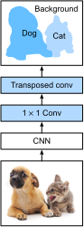

# Mạng kết nối hoàn toàn
:label:`sec_fcn`

Như đã thảo luận trong :numref:`sec_semantic_segmentation`, phân đoạn ngữ nghĩa phân loại hình ảnh ở mức pixel. Một mạng phức tạp hoàn toàn (FCN) sử dụng mạng thần kinh phức tạp để chuyển đổi pixel hình ảnh thành các lớp pixel :cite:`Long.Shelhamer.Darrell.2015`. Không giống như các CNN mà chúng ta gặp phải trước đó để phân loại hình ảnh hoặc phát hiện đối tượng, một mạng phức tạp hoàn toàn biến đổi chiều cao và chiều rộng của bản đồ tính năng trung gian trở lại hình ảnh đầu vào: điều này đạt được bằng lớp biến đổi được giới thiệu trong :numref:`sec_transposed_conv`. Do đó, đầu ra phân loại và hình ảnh đầu vào có sự tương ứng một-một ở mức pixel: kích thước kênh ở bất kỳ điểm ảnh đầu ra nào giữ kết quả phân loại cho pixel đầu vào ở cùng một vị trí không gian.

```{.python .input}
%matplotlib inline
from d2l import mxnet as d2l
from mxnet import gluon, image, init, np, npx
from mxnet.gluon import nn

npx.set_np()
```

```{.python .input}
#@tab pytorch
%matplotlib inline
from d2l import torch as d2l
import torch
import torchvision
from torch import nn
from torch.nn import functional as F
```

## Mô hình

Ở đây chúng tôi mô tả thiết kế cơ bản của mô hình mạng phức tạp hoàn toàn. Như thể hiện trong :numref:`fig_fcn`, mô hình này đầu tiên sử dụng CNN để trích xuất các tính năng hình ảnh, sau đó chuyển đổi số lượng kênh thành số lượng lớp thông qua lớp ghép $1\times 1$ và cuối cùng biến đổi chiều cao và chiều rộng của bản đồ tính năng sang hình ảnh đầu vào thông qua sự phức tạp chuyển tiếp được giới thiệu trong :numref:`sec_transposed_conv`. Do đó, đầu ra mô hình có cùng chiều cao và chiều rộng với hình ảnh đầu vào, trong đó kênh đầu ra chứa các lớp dự đoán cho pixel đầu vào ở cùng một vị trí không gian. 


:label:`fig_fcn`

Dưới đây, chúng ta [**sử dụng mô hình ResNet-18 được đào tạo trước trên bộ dữ liệu ImageNet để trích xuất các tính năng hình ảnh**] và biểu thị phiên bản model là `pretrained_net`. Vài lớp cuối cùng của mô hình này bao gồm một lớp tổng hợp trung bình toàn cầu và một lớp kết nối hoàn toàn: chúng không cần thiết trong mạng phức tạp hoàn toàn.

```{.python .input}
pretrained_net = gluon.model_zoo.vision.resnet18_v2(pretrained=True)
pretrained_net.features[-3:], pretrained_net.output
```

```{.python .input}
#@tab pytorch
pretrained_net = torchvision.models.resnet18(pretrained=True)
list(pretrained_net.children())[-3:]
```

Tiếp theo, chúng ta [** tạo phiên bản mạng hoàn toàn phức tạp `net`**]. Nó sao chép tất cả các lớp được đào tạo trước trong ResNet-18 ngoại trừ lớp tổng hợp trung bình toàn cầu cuối cùng và lớp kết nối hoàn toàn gần đầu ra nhất.

```{.python .input}
net = nn.HybridSequential()
for layer in pretrained_net.features[:-2]:
    net.add(layer)
```

```{.python .input}
#@tab pytorch
net = nn.Sequential(*list(pretrained_net.children())[:-2])
```

Với một đầu vào với chiều cao và chiều rộng 320 và 480 tương ứng, sự lan truyền về phía trước của `net` làm giảm chiều cao và chiều rộng đầu vào xuống 1/32 của bản gốc, cụ thể là 10 và 15.

```{.python .input}
X = np.random.uniform(size=(1, 3, 320, 480))
net(X).shape
```

```{.python .input}
#@tab pytorch
X = torch.rand(size=(1, 3, 320, 480))
net(X).shape
```

Tiếp theo, chúng ta [** sử dụng một lớp ghép $1\times 1$ để chuyển đổi số kênh đầu ra thành số lớp (21) của tập dữ liệu Pascal VOC2012. **] Cuối cùng, chúng ta cần (** tăng chiều cao và chiều rộng của bản đồ tính năng lên 32 lần**) để thay đổi chúng trở lại chiều cao và chiều rộng của hình ảnh đầu vào. Nhớ lại cách tính hình dạng đầu ra của một lớp phức tạp trong :numref:`sec_padding`. Kể từ $(320-64+16\times2+32)/32=10$ và $(480-64+16\times2+32)/32=15$, chúng tôi xây dựng một lớp ghép chuyển đổi với sải chân $32$, thiết lập chiều cao và chiều rộng của hạt nhân là $64$, đệm là $16$. Nói chung, chúng ta có thể thấy rằng đối với sải chân $s$, đệm $s/2$ (giả sử $s/2$ là một số nguyên) và chiều cao và chiều rộng của hạt nhân $2s$, sự phức tạp chuyển tiếp sẽ làm tăng chiều cao và chiều rộng của đầu vào lên $s$ lần.

```{.python .input}
num_classes = 21
net.add(nn.Conv2D(num_classes, kernel_size=1),
        nn.Conv2DTranspose(
            num_classes, kernel_size=64, padding=16, strides=32))
```

```{.python .input}
#@tab pytorch
num_classes = 21
net.add_module('final_conv', nn.Conv2d(512, num_classes, kernel_size=1))
net.add_module('transpose_conv', nn.ConvTranspose2d(num_classes, num_classes,
                                    kernel_size=64, padding=16, stride=32))
```

## [**Initializing Transposed Convolutional Layers**]

Chúng ta đã biết rằng các lớp phức tạp chuyển tiếp có thể làm tăng chiều cao và chiều rộng của bản đồ tính năng. Trong xử lý hình ảnh, chúng ta có thể cần phải mở rộng một hình ảnh, tức là, * upsampling*.
*Nội suy song sinh*
là một trong những kỹ thuật lấy mẫu thường được sử dụng. Nó cũng thường được sử dụng để khởi tạo các lớp phức tạp chuyển tiếp. 

Để giải thích nội suy song tuyến, hãy nói rằng cho một hình ảnh đầu vào, chúng tôi muốn tính toán từng pixel của hình ảnh đầu ra được lấy mẫu lên. Để tính điểm ảnh của hình ảnh đầu ra ở tọa độ $(x, y)$, bản đồ đầu tiên $(x, y)$ phối hợp $(x', y')$ trên hình ảnh đầu vào, ví dụ, theo tỷ lệ kích thước đầu vào với kích thước đầu ra. Lưu ý rằng $x′$ and $y′$ ánh xạ là số thực. Sau đó, tìm bốn pixel gần nhất với tọa độ $(x', y')$ trên hình ảnh đầu vào. Cuối cùng, pixel của hình ảnh đầu ra ở tọa độ $(x, y)$ được tính dựa trên bốn pixel gần nhất trên ảnh đầu vào và khoảng cách tương đối của chúng từ $(x', y')$.  

Upsampling của nội suy bilinear có thể được thực hiện bởi lớp ghép chuyển đổi với hạt nhân được xây dựng bởi hàm `bilinear_kernel` sau đây. Do hạn chế về không gian, chúng tôi chỉ cung cấp việc triển khai hàm `bilinear_kernel` bên dưới mà không cần thảo luận về thiết kế thuật toán của nó.

```{.python .input}
def bilinear_kernel(in_channels, out_channels, kernel_size):
    factor = (kernel_size + 1) // 2
    if kernel_size % 2 == 1:
        center = factor - 1
    else:
        center = factor - 0.5
    og = (np.arange(kernel_size).reshape(-1, 1),
          np.arange(kernel_size).reshape(1, -1))
    filt = (1 - np.abs(og[0] - center) / factor) * \
           (1 - np.abs(og[1] - center) / factor)
    weight = np.zeros((in_channels, out_channels, kernel_size, kernel_size))
    weight[range(in_channels), range(out_channels), :, :] = filt
    return np.array(weight)
```

```{.python .input}
#@tab pytorch
def bilinear_kernel(in_channels, out_channels, kernel_size):
    factor = (kernel_size + 1) // 2
    if kernel_size % 2 == 1:
        center = factor - 1
    else:
        center = factor - 0.5
    og = (torch.arange(kernel_size).reshape(-1, 1),
          torch.arange(kernel_size).reshape(1, -1))
    filt = (1 - torch.abs(og[0] - center) / factor) * \
           (1 - torch.abs(og[1] - center) / factor)
    weight = torch.zeros((in_channels, out_channels,
                          kernel_size, kernel_size))
    weight[range(in_channels), range(out_channels), :, :] = filt
    return weight
```

Hãy để chúng tôi [**thử nghiệm với upsampling of bilinear interpolation**] được thực hiện bởi một lớp ghép chuyển tiếp. Chúng tôi xây dựng một lớp tích hợp chuyển tiếp tăng gấp đôi chiều cao và trọng lượng, và khởi tạo hạt nhân của nó với hàm `bilinear_kernel`.

```{.python .input}
conv_trans = nn.Conv2DTranspose(3, kernel_size=4, padding=1, strides=2)
conv_trans.initialize(init.Constant(bilinear_kernel(3, 3, 4)))
```

```{.python .input}
#@tab pytorch
conv_trans = nn.ConvTranspose2d(3, 3, kernel_size=4, padding=1, stride=2,
                                bias=False)
conv_trans.weight.data.copy_(bilinear_kernel(3, 3, 4));
```

Đọc hình ảnh `X` và gán đầu ra lấy mẫu lên `Y`. Để in hình ảnh, chúng ta cần điều chỉnh vị trí của kích thước kênh.

```{.python .input}
img = image.imread('../img/catdog.jpg')
X = np.expand_dims(img.astype('float32').transpose(2, 0, 1), axis=0) / 255
Y = conv_trans(X)
out_img = Y[0].transpose(1, 2, 0)
```

```{.python .input}
#@tab pytorch
img = torchvision.transforms.ToTensor()(d2l.Image.open('../img/catdog.jpg'))
X = img.unsqueeze(0)
Y = conv_trans(X)
out_img = Y[0].permute(1, 2, 0).detach()
```

Như chúng ta có thể thấy, lớp biến thể chuyển đổi làm tăng cả chiều cao và chiều rộng của hình ảnh bằng một yếu tố là hai. Ngoại trừ các thang đo khác nhau về tọa độ, hình ảnh được thu nhỏ bằng nội suy song tuyến và hình ảnh gốc được in trong :numref:`sec_bbox` trông giống nhau.

```{.python .input}
d2l.set_figsize()
print('input image shape:', img.shape)
d2l.plt.imshow(img.asnumpy());
print('output image shape:', out_img.shape)
d2l.plt.imshow(out_img.asnumpy());
```

```{.python .input}
#@tab pytorch
d2l.set_figsize()
print('input image shape:', img.permute(1, 2, 0).shape)
d2l.plt.imshow(img.permute(1, 2, 0));
print('output image shape:', out_img.shape)
d2l.plt.imshow(out_img);
```

Trong một mạng phức tạp hoàn toàn, chúng ta [** khởi tạo lớp ghép chuyển tiếp với upsampling của nội suy song sinh. Đối với lớp ghép $1\times 1$, chúng tôi sử dụng khởi tạo Xavier. **]

```{.python .input}
W = bilinear_kernel(num_classes, num_classes, 64)
net[-1].initialize(init.Constant(W))
net[-2].initialize(init=init.Xavier())
```

```{.python .input}
#@tab pytorch
W = bilinear_kernel(num_classes, num_classes, 64)
net.transpose_conv.weight.data.copy_(W);
```

## [**Đọc dữ liệu**]

Chúng tôi đọc tập dữ liệu phân đoạn ngữ nghĩa như được giới thiệu trong :numref:`sec_semantic_segmentation`. Hình dạng hình ảnh đầu ra của cắt xén ngẫu nhiên được chỉ định là $320\times 480$: cả chiều cao và chiều rộng đều chia hết cho $32$.

```{.python .input}
#@tab all
batch_size, crop_size = 32, (320, 480)
train_iter, test_iter = d2l.load_data_voc(batch_size, crop_size)
```

## [**Đào tạo**]

Bây giờ chúng ta có thể đào tạo mạng lưới phức tạp được xây dựng hoàn toàn của chúng tôi. Chức năng mất mát và tính chính xác ở đây về cơ bản không khác với các chức năng trong phân loại hình ảnh của các chương trước đó. Bởi vì chúng ta sử dụng kênh đầu ra của lớp tích hợp chuyển tiếp để dự đoán lớp cho mỗi pixel, kích thước kênh được chỉ định trong phép tính tổn thất. Ngoài ra, độ chính xác được tính dựa trên tính chính xác của lớp dự đoán cho tất cả các pixel.

```{.python .input}
num_epochs, lr, wd, devices = 5, 0.1, 1e-3, d2l.try_all_gpus()
loss = gluon.loss.SoftmaxCrossEntropyLoss(axis=1)
net.collect_params().reset_ctx(devices)
trainer = gluon.Trainer(net.collect_params(), 'sgd',
                        {'learning_rate': lr, 'wd': wd})
d2l.train_ch13(net, train_iter, test_iter, loss, trainer, num_epochs, devices)
```

```{.python .input}
#@tab pytorch
def loss(inputs, targets):
    return F.cross_entropy(inputs, targets, reduction='none').mean(1).mean(1)

num_epochs, lr, wd, devices = 5, 0.001, 1e-3, d2l.try_all_gpus()
trainer = torch.optim.SGD(net.parameters(), lr=lr, weight_decay=wd)
d2l.train_ch13(net, train_iter, test_iter, loss, trainer, num_epochs, devices)
```

## [**Prediction**]

Khi dự đoán, chúng ta cần chuẩn hóa hình ảnh đầu vào trong mỗi kênh và chuyển đổi hình ảnh thành định dạng đầu vào bốn chiều theo yêu cầu của CNN.

```{.python .input}
def predict(img):
    X = test_iter._dataset.normalize_image(img)
    X = np.expand_dims(X.transpose(2, 0, 1), axis=0)
    pred = net(X.as_in_ctx(devices[0])).argmax(axis=1)
    return pred.reshape(pred.shape[1], pred.shape[2])
```

```{.python .input}
#@tab pytorch
def predict(img):
    X = test_iter.dataset.normalize_image(img).unsqueeze(0)
    pred = net(X.to(devices[0])).argmax(dim=1)
    return pred.reshape(pred.shape[1], pred.shape[2])
```

Để [** visualize the predicted class**] của mỗi pixel, chúng ta ánh xạ lớp dự đoán trở lại màu nhãn của nó trong tập dữ liệu.

```{.python .input}
def label2image(pred):
    colormap = np.array(d2l.VOC_COLORMAP, ctx=devices[0], dtype='uint8')
    X = pred.astype('int32')
    return colormap[X, :]
```

```{.python .input}
#@tab pytorch
def label2image(pred):
    colormap = torch.tensor(d2l.VOC_COLORMAP, device=devices[0])
    X = pred.long()
    return colormap[X, :]
```

Hình ảnh trong tập dữ liệu thử nghiệm khác nhau về kích thước và hình dạng. Kể từ khi mô hình sử dụng một lớp ghép chuyển tiếp với sải chân là 32, khi chiều cao hoặc chiều rộng của một hình ảnh đầu vào là không thể chia cắt bởi 32, chiều cao đầu ra hoặc chiều rộng của lớp ghép chuyển tiếp sẽ lệch khỏi hình dạng của hình ảnh đầu vào. Để giải quyết vấn đề này, chúng ta có thể cắt nhiều vùng hình chữ nhật với chiều cao và chiều rộng là bội số nguyên là 32 trong hình ảnh và thực hiện lan truyền về phía trước trên các pixel trong các khu vực này một cách riêng biệt. Lưu ý rằng sự kết hợp của các khu vực hình chữ nhật này cần phải bao phủ hoàn toàn hình ảnh đầu vào. Khi một pixel được bao phủ bởi nhiều khu vực hình chữ nhật, trung bình của các đầu ra tích hợp chuyển đổi trong các khu vực riêng biệt cho cùng một điểm ảnh này có thể được nhập vào hoạt động softmax để dự đoán lớp. 

Để đơn giản, chúng tôi chỉ đọc một vài hình ảnh thử nghiệm lớn hơn và cắt một khu vực $320\times480$ để dự đoán bắt đầu từ góc trên bên trái của một hình ảnh. Đối với những hình ảnh thử nghiệm này, chúng tôi in các khu vực cắt, kết quả dự đoán và sự thật mặt đất từng hàng.

```{.python .input}
voc_dir = d2l.download_extract('voc2012', 'VOCdevkit/VOC2012')
test_images, test_labels = d2l.read_voc_images(voc_dir, False)
n, imgs = 4, []
for i in range(n):
    crop_rect = (0, 0, 480, 320)
    X = image.fixed_crop(test_images[i], *crop_rect)
    pred = label2image(predict(X))
    imgs += [X, pred, image.fixed_crop(test_labels[i], *crop_rect)]
d2l.show_images(imgs[::3] + imgs[1::3] + imgs[2::3], 3, n, scale=2);
```

```{.python .input}
#@tab pytorch
voc_dir = d2l.download_extract('voc2012', 'VOCdevkit/VOC2012')
test_images, test_labels = d2l.read_voc_images(voc_dir, False)
n, imgs = 4, []
for i in range(n):
    crop_rect = (0, 0, 320, 480)
    X = torchvision.transforms.functional.crop(test_images[i], *crop_rect)
    pred = label2image(predict(X))
    imgs += [X.permute(1,2,0), pred.cpu(),
             torchvision.transforms.functional.crop(
                 test_labels[i], *crop_rect).permute(1,2,0)]
d2l.show_images(imgs[::3] + imgs[1::3] + imgs[2::3], 3, n, scale=2);
```

## Tóm tắt

* Mạng phức tạp hoàn toàn đầu tiên sử dụng CNN để trích xuất các tính năng hình ảnh, sau đó chuyển đổi số lượng kênh thành số lượng lớp thông qua lớp ghép $1\times 1$ và cuối cùng biến đổi chiều cao và chiều rộng của bản đồ tính năng thành các hình ảnh đầu vào thông qua sự chuyển đổi.
* Trong một mạng phức tạp hoàn toàn, chúng ta có thể sử dụng upsampling của nội suy song tuyến để khởi tạo lớp chuyển đổi.

## Bài tập

1. Nếu chúng ta sử dụng khởi tạo Xavier cho lớp tích hợp chuyển tiếp trong thí nghiệm, kết quả thay đổi như thế nào?
1. Bạn có thể cải thiện hơn nữa độ chính xác của mô hình bằng cách điều chỉnh các siêu tham số?
1. Dự đoán các lớp của tất cả các pixel trong hình ảnh thử nghiệm.
1. Giấy mạng phức tạp hoàn toàn ban đầu cũng sử dụng đầu ra của một số lớp CNN trung gian :cite:`Long.Shelhamer.Darrell.2015`. Cố gắng thực hiện ý tưởng này.

:begin_tab:`mxnet`
[Discussions](https://discuss.d2l.ai/t/377)
:end_tab:

:begin_tab:`pytorch`
[Discussions](https://discuss.d2l.ai/t/1582)
:end_tab:
