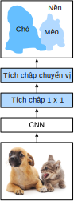

<!--
# Fully Convolutional Networks (FCN)
-->

# Mạng Tích chập Đầy đủ
:label:`sec_fcn`


<!--
We previously discussed semantic segmentation using each pixel in an image for category prediction.
A fully convolutional network (FCN) :cite:`Long.Shelhamer.Darrell.2015` uses a convolutional neural network to transform image pixels to pixel categories.
Unlike the convolutional neural networks previously introduced, an FCN transforms the height and width 
of the intermediate layer feature map back to the size of input image through the transposed convolution layer, 
so that the predictions have a one-to-one correspondence with input image in spatial dimension (height and width).
Given a position on the spatial dimension, the output of the channel dimension will be a category prediction of the pixel corresponding to the location.
-->

Ở phần trước, chúng ta đã thảo luận về phân vùng theo ngữ nghĩa bằng cách dự đoán hạng mục trên từng điểm ảnh.
Mạng tích chập đầy đủ (*fully convolutional network* - FCN) :cite:`Long.Shelhamer.Darrell.2015` sử dụng mạng nơ-ron tích chập để biến đổi các điểm ảnh thành các hạng mục tương ứng của điểm ảnh.
Khác với các mạng nơ-ron tích chập được giới thiệu trước đây, mạng FCN biến đổi chiều cao và chiều rộng của ánh xạ đặc trưng ở tầng trung gian về kích thước ảnh đầu vào thông qua các tầng tích chập chuyển vị, sao cho các dự đoán có sự tương xứng một–một với ảnh đầu vào theo không gian (chiều cao và chiều rộng).
Với một vị trí trên chiều không gian, đầu ra theo chiều kênh sẽ là hạng mục được dự đoán tương ứng với điểm ảnh tại vị trí đó.


<!--
We will first import the package or module needed for the experiment and then explain the transposed convolution layer.
-->

Đầu tiên, ta sẽ nhập gói thư viện và mô-đun cần thiết cho thí nghiệm này, sau đó sẽ đi đến giải thích về tầng tích chập chuyển vị.


```{.python .input  n=2}
%matplotlib inline
from d2l import mxnet as d2l
from mxnet import gluon, image, init, np, npx
from mxnet.gluon import nn

npx.set_np()
```


<!--
## Constructing a Model
-->

## Xây dựng Mô hình


<!--
Here, we demonstrate the most basic design of a fully convolutional network model.
As shown in :numref:`fig_fcn`, the fully convolutional network first uses the convolutional neural network to extract image features, 
then transforms the number of channels into the number of categories through the $1\times 1$ convolution layer, 
and finally transforms the height and width of the feature map to the size of the input image by using the transposed convolution layer :numref:`sec_transposed_conv`. 
The model output has the same height and width as the input image and has a one-to-one correspondence in spatial positions. 
The final output channel contains the category prediction of the pixel of the corresponding spatial position.
-->

Ở đây, chúng tôi sẽ trình bày một thiết kế cơ bản nhất của mô hình tích chập đầy đủ.
Như mô tả trong hình :numref:`fig_fcn`, đầu tiên mạng tích chập đầy đủ sử dụng mạng nơ-ron tích chập để trích xuất đặc trưng ảnh, sau đó biến đổi số lượng kênh thành số lượng hạng mục thông qua tầng tích chập $1\times 1$, và cuối cùng biến đổi chiều cao và chiều rộng của ánh xạ đặc trưng bằng với kích thước của ảnh đầu vào bằng cách sử dụng tầng tích chập chuyển vị :numref:`sec_transposed_conv`.
Đầu ra của mạng có cùng chiều cao và chiều rộng với ảnh gốc, đồng thời cũng có sự tương xứng một-một theo vị trí không gian.
Kênh đầu ra cuối cùng chứa hạng mục dự đoán của từng điểm ảnh ở vị trí không gian tương ứng. 

<!--

-->


:label:`fig_fcn`


<!--
Below, we use a ResNet-18 model pre-trained on the ImageNet dataset to extract image features and record the network instance as `pretrained_net`.
As you can see, the last two layers of the model member variable `features` are the global maximum pooling layer `GlobalAvgPool2D` and example flattening layer `Flatten`.
The `output` module contains the fully connected layer used for output.
These layers are not required for a fully convolutional network.
-->

Dưới đây, ta sử dụng mô hình ResNet-18 đã được tiền huấn luyện trên ImageNet để trích xuất đặc trưng và lưu thực thể mô hình là `pretrained_net`.
Như ta có thể thấy, hai tầng cuối của mô hình nằm trong biến thành viên `features` là tầng gộp cực đại toàn cục `GlobalAvgPool2D` và tầng trải phẳng `Flatten`. 
Mô-đun `output` chứa tầng kết nối đầy đủ được sử dụng cho đầu ra.
Các tầng này không bắt buộc phải có trong mạng tích chập đầy đủ.


```{.python .input  n=5}
pretrained_net = gluon.model_zoo.vision.resnet18_v2(pretrained=True)
pretrained_net.features[-4:], pretrained_net.output
```


<!--
Next, we create the fully convolutional network instance `net`.
It duplicates all the neural layers except the last two layers of the instance member variable `features` of `pretrained_net` and the model parameters obtained after pre-training.
-->

Tiếp theo, ta khởi tạo một thực thể mạng tích chập đầy đủ `net`.
Thực thể này sao chép tất cả các tầng nơ-ron ngoại trừ hai tầng cuối cùng của biến thành viên `features` trong `pretrained_net` và các tham số mô hình thu được từ bước tiền huấn luyện.


```{.python .input  n=6}
net = nn.HybridSequential()
for layer in pretrained_net.features[:-2]:
    net.add(layer)
```


<!--
Given an input of a height and width of 320 and 480 respectively, 
the forward computation of `net` will reduce the height and width of the input to $1/32$ of the original, i.e., 10 and 15.
-->

Với đầu vào có chiều cao và chiều rộng là 320 và 480,
bước tính toán lượt truyền xuôi của `net` sẽ giảm chiều cao và chiều rộng của đầu vào thành $1/32$ kích thước ban đầu, tức 10 và 15.


```{.python .input  n=7}
X = np.random.uniform(size=(1, 3, 320, 480))
net(X).shape
```


<!--
Next, we transform the number of output channels to the number of categories of Pascal VOC2012 (21) through the $1\times 1$ convolution layer.
Finally, we need to magnify the height and width of the feature map by a factor of 32 to change them back to the height and width of the input image.
Recall the calculation method for the convolution layer output shape described in :numref:`sec_padding`.
Because $(320-64+16\times2+32)/32=10$ and $(480-64+16\times2+32)/32=15$, 
we construct a transposed convolution layer with a stride of 32 and set the height and width of the convolution kernel to 64 and the padding to 16.
It is not difficult to see that, if the stride is $s$, the padding is $s/2$ (assuming $s/2$ is an integer), and the height and width of the convolution kernel are $2s$,
the transposed convolution kernel will magnify both the height and width of the input by a factor of $s$.
-->

Tiếp đến, ta biến đổi số lượng kênh đầu ra bằng với số lượng hạng mục trong tập dữ liệu Pascal VOC2012 (21) thông qua tầng tích chập $1\times 1$.
Cuối cùng, ta cần phóng đại chiều cao và chiều rộng của ánh xạ đặc trưng lên gấp 32 lần để bằng với chiều cao và chiều rộng của ảnh đầu vào.
Hãy xem lại phương pháp tính kích thước đầu ra của tầng tích chập được mô tả trong :numref:`sec_padding`.
Vì $(320-64+16\times2+32)/32=10$ và $(480-64+16\times2+32)/32=15$, ta sẽ xây dựng một tầng tích chập chuyển vị với sải bước 32, đặt chiều dài và chiều rộng của hạt nhân tích chập bằng 64 và kích thước đệm bằng 16.
Không khó để nhận ra rằng nếu sải bước bằng $s$, kích thước đệm là $s/2$ (giả sử $s/2$ là số nguyên) và hạt nhân tích chập có chiều dài và chiều rộng bằng $2s$, thì hạt nhân tích chập chuyển vị sẽ phóng đại chiều cao và chiều rộng của đầu vào lên $s$ lần.
 

```{.python .input  n=8}
num_classes = 21
net.add(nn.Conv2D(num_classes, kernel_size=1),
        nn.Conv2DTranspose(
            num_classes, kernel_size=64, padding=16, strides=32))
```


<!--
## Initializing the Transposed Convolution Layer
-->

## Khởi tạo Tầng Tích chập Chuyển vị


<!--
We already know that the transposed convolution layer can magnify a feature map.
In image processing, sometimes we need to magnify the image, i.e., upsampling.
There are many methods for upsampling, and one common method is bilinear interpolation.
Simply speaking, in order to get the pixel of the output image at the coordinates $(x, y)$, the coordinates are first mapped to the coordinates of the input image $(x', y')$.
This can be done based on the ratio of the size of three input to the size of the output.
The mapped values $x'$ and $y'$ are usually real numbers.
Then, we find the four pixels closest to the coordinate $(x', y')$ on the input image.
Finally, the pixels of the output image at coordinates $(x, y)$ are calculated based on these four pixels on the input image and their relative distances to $(x', y')$.
Upsampling by bilinear interpolation can be implemented by transposed convolution layer of the convolution kernel constructed using the following `bilinear_kernel` function.
Due to space limitations, we only give the implementation of the `bilinear_kernel` function and will not discuss the principles of the algorithm.
-->

Chúng ta đã biết tầng tích chập chuyển vị có thể phóng đại ánh xạ đặc trưng.
Trong xử lý ảnh, đôi khi ta cần phóng đại ảnh hay còn được biết đến là phép tăng mẫu. 
Có rất nhiều phương pháp tăng mẫu, và một phương pháp phổ biến là nội suy song tuyến tính (*bilinear interpolation*).
Nói một cách đơn giản, để lấy điểm ảnh của ảnh đầu ra tại tọa độ $(x, y)$, đầu tiên tọa độ này sẽ được ánh xạ tới tọa độ $(x', y')$ trong ảnh đầu vào.
Điều này có thể được thực hiện dựa trên tỷ lệ kích thước của ba đầu vào tới kích thước của đầu ra.
Giá trị được ánh xạ $x'$ và $y'$ thường là các số thực.
Sau đó, ta tìm bốn điểm ảnh gần tọa độ $(x', y')$ nhất trên ảnh đầu vào.
Cuối cùng, các điểm ảnh tại tọa độ $(x, y)$ của đầu ra sẽ được tính toán dựa trên bốn điểm ảnh của ảnh đầu vào và khoảng cách tương đối của chúng tới $(x', y')$.
Phép tăng mẫu bằng nội suy song tuyến tính có thể được lập trình bằng tầng tích chập chuyển vị với hạt nhân tích chập được xây dựng bằng hàm `bilinear_kernel` dưới đây.
Do có nhiều giới hạn, chúng tôi sẽ chỉ cung cấp cách lập trình hàm `bilinear_kernel` và sẽ không thảo luận về nguyên tắc của thuật toán.


```{.python .input  n=9}
def bilinear_kernel(in_channels, out_channels, kernel_size):
    factor = (kernel_size + 1) // 2
    if kernel_size % 2 == 1:
        center = factor - 1
    else:
        center = factor - 0.5
    og = (np.arange(kernel_size).reshape(-1, 1),
          np.arange(kernel_size).reshape(1, -1))
    filt = (1 - np.abs(og[0] - center) / factor) * \
           (1 - np.abs(og[1] - center) / factor)
    weight = np.zeros((in_channels, out_channels, kernel_size, kernel_size))
    weight[range(in_channels), range(out_channels), :, :] = filt
    return np.array(weight)
```


<!--
Now, we will experiment with bilinear interpolation upsampling implemented by transposed convolution layers.
Construct a transposed convolution layer that magnifies height and width of input by a factor of 2 and initialize its convolution kernel with the `bilinear_kernel` function.
-->

Bây giờ, ta sẽ thí nghiệm với phép tăng mẫu sử dụng phép nội suy song tuyến tính được thực hiện bằng tầng tích chập chuyển vị. 
Ta sẽ xây dựng tầng tích chập chuyển vị để phóng đại chiều cao và chiều rộng của đầu vào lên hai lần và khởi tạo hạt nhân tích chập với hàm `bilinear_kernel`.


```{.python .input  n=11}
conv_trans = nn.Conv2DTranspose(3, kernel_size=4, padding=1, strides=2)
conv_trans.initialize(init.Constant(bilinear_kernel(3, 3, 4)))
```


<!--
Read the image `X` and record the result of upsampling as `Y`.
In order to print the image, we need to adjust the position of the channel dimension.
-->

Ta sẽ đọc ảnh `X` và lưu kết quả của phép tăng mẫu là `Y`. 
Để in ảnh, ta cần điều chỉnh vị trí của chiều kênh.


```{.python .input}
img = image.imread('../img/catdog.jpg')
X = np.expand_dims(img.astype('float32').transpose(2, 0, 1), axis=0) / 255
Y = conv_trans(X)
out_img = Y[0].transpose(1, 2, 0)
```


<!--
As you can see, the transposed convolution layer magnifies both the height and width of the image by a factor of 2.
It is worth mentioning that, besides to the difference in coordinate scale, the image magnified by bilinear interpolation and original image printed in :numref:`sec_bbox` look the same.
-->

Như ta có thể thấy, tầng tích chập chuyển vị phóng đại cả chiều cao và chiều rộng của ảnh lên hai lần.
Điều đáng nói là bên cạnh sự khác biệt trong tỷ lệ tọa độ, ảnh được phóng đại bởi phép nội suy song tuyến tính và ảnh ban đầu được in :numref:`sec_bbox` nhìn giống nhau.

```{.python .input}
d2l.set_figsize()
print('input image shape:', img.shape)
d2l.plt.imshow(img.asnumpy());
print('output image shape:', out_img.shape)
d2l.plt.imshow(out_img.asnumpy());
```


<!--
In a fully convolutional network, we initialize the transposed convolution layer for upsampled bilinear interpolation.
For a $1\times 1$ convolution layer, we use Xavier for randomly initialization.
-->

Trong mạng tích chập đầy đủ, ta khởi tạo tầng tích chập chuyển vị để thực hiện phép tăng mẫu nội suy song tuyến tính.
Với tầng tích chập $1\times 1$, ta sử dụng phương pháp khởi tạo ngẫu nhiên Xavier.


```{.python .input  n=12}
W = bilinear_kernel(num_classes, num_classes, 64)
net[-1].initialize(init.Constant(W))
net[-2].initialize(init=init.Xavier())
```


<!--
## Reading the Dataset
-->

## Đọc Dữ liệu


<!--
We read the dataset using the method described in the previous section.
Here, we specify shape of the randomly cropped output image as $320\times 480$, so both the height and width are divisible by 32.
-->

Ta đọc dữ liệu bằng phương thức được mô tả ở phần trước.
Ở đây, ta định rõ kích thước của ảnh đầu ra sau khi cắt ngẫu nhiên là $320\times 480$, để cả chiều cao và chiều rộng chia hết cho 32.


```{.python .input  n=13}
batch_size, crop_size = 32, (320, 480)
train_iter, test_iter = d2l.load_data_voc(batch_size, crop_size)
```


<!--
## Training
-->

## Huấn luyện


<!--
Now we can start training the model.
The loss function and accuracy calculation here are not substantially different from those used in image classification.
Because we use the channel of the transposed convolution layer to predict pixel categories, the `axis=1` (channel dimension) option is specified in `SoftmaxCrossEntropyLoss`.
In addition, the model calculates the accuracy based on whether the prediction category of each pixel is correct.
-->

Bây giờ ta có thể bắt đầu huấn luyện mô hình.
Hàm mất mát và hàm tính độ chính xác được sử dụng ở đây không quá khác biệt so với các hàm được sử dụng trong bài toán phân loại ảnh.
Vì ta sử dụng kênh của tầng tích chập chuyển vị để dự đoán hạng mục cho điểm ảnh, tham số `axis=1` (chiều kênh) được định rõ trong `SoftmaxCrossEntropyLoss`.
Thêm vào đó, dựa trên hạng mục của từng điểm ảnh có được dự đoán đúng hay không mà mô hình sẽ tính toán độ chính xác.


```{.python .input  n=12}
num_epochs, lr, wd, devices = 5, 0.1, 1e-3, d2l.try_all_gpus()
loss = gluon.loss.SoftmaxCrossEntropyLoss(axis=1)
net.collect_params().reset_ctx(devices)
trainer = gluon.Trainer(net.collect_params(), 'sgd',
                        {'learning_rate': lr, 'wd': wd})
d2l.train_ch13(net, train_iter, test_iter, loss, trainer, num_epochs, devices)
```


<!--
## Prediction
-->

## Dự đoán


<!--
During predicting, we need to standardize the input image in each channel and transform them into the four-dimensional input format required by the convolutional neural network.
-->

Trong quá trình dự đoán, ta cần chuẩn tắc hóa ảnh đầu vào theo từng kênh và chuyển đổi chúng thành tensor 4 chiều như yêu cầu của mạng nơ-ron tích chập.


```{.python .input  n=13}
def predict(img):
    X = test_iter._dataset.normalize_image(img)
    X = np.expand_dims(X.transpose(2, 0, 1), axis=0)
    pred = net(X.as_in_ctx(devices[0])).argmax(axis=1)
    return pred.reshape(pred.shape[1], pred.shape[2])
```


<!--
To visualize the predicted categories for each pixel, we map the predicted categories back to their labeled colors in the dataset.
-->

Để biểu diễn trực quan các hạng mục được dự đoán cho từng điểm ảnh, ta ánh xạ các hạng mục dự đoán về nhãn màu trong tập dữ liệu.


```{.python .input  n=14}
def label2image(pred):
    colormap = np.array(d2l.VOC_COLORMAP, ctx=devices[0], dtype='uint8')
    X = pred.astype('int32')
    return colormap[X, :]
```


<!--
The size and shape of the images in the test dataset vary.
Because the model uses a transposed convolution layer with a stride of 32, when the height or width of the input image is not divisible by 32, 
the height or width of the transposed convolution layer output deviates from the size of the input image.
In order to solve this problem, we can crop multiple rectangular areas in the image with heights and widths as integer multiples of 32, 
and then perform forward computation on the pixels in these areas. 
When combined, these areas must completely cover the input image.
When a pixel is covered by multiple areas, the average of the transposed convolution layer output in the forward computation 
of the different areas can be used as an input for the softmax operation to predict the category.
-->

Kích thước và hình dạng của ảnh trong tập kiểm tra không cố định.
Vì mô hình sử dụng tầng tích chập chuyển vị với sải bước bằng 32, nên khi chiều cao và chiều rộng của ảnh đầu vào không chia hết cho 32 thì chiều cao và chiều rộng của đầu ra tầng tích chập chuyển vị sẽ chênh lệch so với kích thước của ảnh đầu vào.
Để giải quyết vấn đề này, ta có thể cắt nhiều vùng hình chữ nhật trong ảnh với chiều cao và chiều rộng chia hết cho 32, sau đó thực hiện lượt truyền xuôi trên các điểm ảnh của những vùng này. 
Khi kết hợp các kết quả lại, các vùng này sẽ khôi phục lại toàn bộ ảnh đầu vào.
Khi một điểm ảnh nằm trong nhiều vùng khác nhau, trung bình đầu ra của tầng tích chập chuyển vị sau lan truyền xuôi của các vùng khác nhau có thể được sử dụng để làm đầu vào cho phép toán softmax nhằm dự đoán hạng mục.


<!--
For the sake of simplicity, we only read a few large test images and crop an area with a shape of $320\times480$ from the top-left corner of the image.
Only this area is used for prediction. For the input image, we print the cropped area first, then print the predicted result, and finally print the labeled category.
-->

Để đơn giản, ta chỉ đọc một vài ảnh kiểm tra có kích thước lớn và cắt các vùng với kích thước $320\times480$ từ góc trái trên cùng của ảnh, và chỉ sử dụng vùng này để dự đoán.
Với ảnh đầu vào, đầu tiên ta in ra vùng được cắt, sau đó in ra kết quả dự đoán, và cuối cùng in ra hạng mục nhãn gốc.


```{.python .input  n=15}
voc_dir = d2l.download_extract('voc2012', 'VOCdevkit/VOC2012')
test_images, test_labels = d2l.read_voc_images(voc_dir, False)
n, imgs = 4, []
for i in range(n):
    crop_rect = (0, 0, 480, 320)
    X = image.fixed_crop(test_images[i], *crop_rect)
    pred = label2image(predict(X))
    imgs += [X, pred, image.fixed_crop(test_labels[i], *crop_rect)]
d2l.show_images(imgs[::3] + imgs[1::3] + imgs[2::3], 3, n, scale=2);
```


## Tóm tắt

<!--
* The fully convolutional network first uses the convolutional neural network to extract image features, then transforms the number of channels into the number of categories through the $1\times 1$ convolution layer, and finally transforms the height and width of the feature map to the size of the input image by using the transposed convolution layer to output the category of each pixel.
* In a fully convolutional network, we initialize the transposed convolution layer for upsampled bilinear interpolation.
-->

* Đầu tiên, mạng tích chập đầy đủ sử dụng một mạng nơ-ron tích chập để trích xuất đặc trưng ảnh, sau đó biến đổi số lượng kênh thành số lượng các hạng mục bằng tầng tích chập $1\times 1$, và cuối cùng biến đổi chiều cao và chiều rộng của ánh xạ đặc trưng thành kích thước ban đầu của ảnh bằng cách sử dụng tầng tích chập chuyển vị để cho ra hạng mục của từng điểm ảnh.
* Trong mạng tích chập đầy đủ, ta khởi tạo tầng tích chập chuyển vị cho phép tăng mẫu nội suy song tuyến tính.


## Bài tập

<!--
1. If we use Xavier to randomly initialize the transposed convolution layer, what will happen to the result?
2. Can you further improve the accuracy of the model by tuning the hyperparameters?
3. Predict the categories of all pixels in the test image.
4. The outputs of some intermediate layers of the convolutional neural network are also used in the paper on fully convolutional networks[1]. Try to implement this idea.
-->

1. Nếu ta sử dụng Xavier để khởi tạo ngẫu nhiên tầng tích chập chuyển vị, kết quả thay đổi ra sao?
2. Bạn có thể cải thiện độ chính xác của mô hình bằng cách điều chỉnh các siêu tham số hay không?
3. Hãy dự đoán các hạng mục của tất cả các điểm ảnh trong ảnh kiểm tra.
4. Trong bài báo về mạng tích chập đầy đủ [1], đầu ra của một số tầng trung gian của mạng nơ-ron tích chập cũng được sử dụng. Hãy thử lập trình lại ý tưởng này.


## Thảo luận
* [Tiếng Anh - MXNet](https://discuss.d2l.ai/t/377)
* [Tiếng Việt](https://forum.machinelearningcoban.com/c/d2l)


## Những người thực hiện
Bản dịch trong trang này được thực hiện bởi:

* Đoàn Võ Duy Thanh
* Nguyễn Văn Quang
* Lê Khắc Hồng Phúc
* Phạm Minh Đức
* Phạm Hồng Vinh
* Nguyễn Lê Quang Nhật
* Nguyễn Văn Cường
