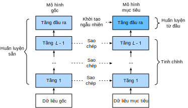

<!-- ===================== Bắt đầu dịch Phần 1 ==================== -->
<!-- ========================================= REVISE PHẦN 1 - BẮT ĐẦU =================================== -->

<!--
# Fine-Tuning
-->

# *dịch tiêu đề phía trên*
:label:`sec_fine_tuning`


<!--
In earlier chapters, we discussed how to train models on the Fashion-MNIST training dataset, which only has 60,000 images.
We also described ImageNet, the most widely used large-scale image dataset in the academic world, with more than 10 million images and objects of over 1000 categories.
However, the size of datasets that we often deal with is usually larger than the first, but smaller than the second.
-->

*dịch đoạn phía trên*


<!--
Assume we want to identify different kinds of chairs in images and then push the purchase link to the user.
One possible method is to first find a hundred common chairs, take one thousand different images with different angles for each chair, and then train a classification model on the collected image dataset.
Although this dataset may be larger than Fashion-MNIST, the number of examples is still less than one tenth of ImageNet.
This may result in the overfitting of the complicated model applicable to ImageNet on this dataset.
At the same time, because of the limited amount of data, the accuracy of the final trained model may not meet the practical requirements.
-->

*dịch đoạn phía trên*


<!--
In order to deal with the above problems, an obvious solution is to collect more data.
However, collecting and labeling data can consume a lot of time and money.
For example, in order to collect the ImageNet datasets, researchers have spent millions of dollars of research funding.
Although, recently, data collection costs have dropped significantly, the costs still cannot be ignored.
-->

*dịch đoạn phía trên*


<!--
Another solution is to apply transfer learning to migrate the knowledge learned from the source dataset to the target dataset.
For example, although the images in ImageNet are mostly unrelated to chairs, 
models trained on this dataset can extract more general image features that can help identify edges, textures, shapes, and object composition.
These similar features may be equally effective for recognizing a chair.
-->

*dịch đoạn phía trên*

<!-- ===================== Kết thúc dịch Phần 1 ===================== -->

<!-- ===================== Bắt đầu dịch Phần 2 ===================== -->


<!--
In this section, we introduce a common technique in transfer learning: fine tuning. 
As shown in :numref:`fig_finetune`, fine tuning consists of the following four steps:
-->

*dịch đoạn phía trên*


<!--
1. Pre-train a neural network model, i.e., the source model, on a source dataset (e.g., the ImageNet dataset).
2. Create a new neural network model, i.e., the target model. 
This replicates all model designs and their parameters on the source model, except the output layer.
We assume that these model parameters contain the knowledge learned from the source dataset and this knowledge will be equally applicable to the target dataset. 
We also assume that the output layer of the source model is closely related to the labels of the source dataset and is therefore not used in the target model.
3. Add an output layer whose output size is the number of target dataset categories to the target model, and randomly initialize the model parameters of this layer.
4. Train the target model on a target dataset, such as a chair dataset. 
We will train the output layer from scratch, while the parameters of all remaining layers are fine-tuned based on the parameters of the source model.
-->

*dịch đoạn phía trên*


<!--

-->


:label:`fig_finetune`


<!--
## Hot Dog Recognition
-->

## *dịch tiêu đề phía trên*


<!--
Next, we will use a specific example for practice: hot dog recognition.
We will fine-tune the ResNet model trained on the ImageNet dataset based on a small dataset.
This small dataset contains thousands of images, some of which contain hot dogs.
We will use the model obtained by fine tuning to identify whether an image contains a hot dog.
-->

*dịch đoạn phía trên*


<!--
First, import the packages and modules required for the experiment.
Gluon's `model_zoo` package provides a common pre-trained model.
If you want to get more pre-trained models for computer vision, you can use the [GluonCV Toolkit](https://gluon-cv.mxnet.io).
-->

*dịch đoạn phía trên*


```{.python .input  n=1}
%matplotlib inline
from d2l import mxnet as d2l
from mxnet import gluon, init, np, npx
from mxnet.gluon import nn
import os

npx.set_np()
```

<!-- ===================== Kết thúc dịch Phần 2 ===================== -->

<!-- ===================== Bắt đầu dịch Phần 3 ===================== -->

<!--
### Obtaining the Dataset
-->

### Lấy dữ liệu


<!--
The hot dog dataset we use was taken from online images and contains $1,400$ positive images containing hot dogs and the same number of negative images containing other foods.
$1,000$ images of various classes are used for training and the rest are used for testing.
-->

Bộ dữ liệu bánh mì kẹp xúc xích mà ta sử dụng được lấy từ internet, gồm $1,400$ ảnh mẫu dương chứa bánh mì kẹp xúc xích và $1,400$ ảnh mẫu âm chứa các loại thức ăn khác.
$1,000$ ảnh thuộc nhiều lớp khác nhau được sử dụng để huấn luyện và phần còn lại được dùng để kiểm tra.


<!--
We first download the compressed dataset and get two folders `hotdog/train` and `hotdog/test`.
Both folders have `hotdog` and `not-hotdog` category subfolders, each of which has corresponding image files.
-->

Đầu tiên ta tải bộ dữ liệu được nén và thu được 2 tập tin `hotdog/train` và `hotdog/test`.
Cả hai đều có hai tập tin phụ `hotdog` và `not-hotdog` chứa các ảnh với phân loại tương ứng.


```{.python .input  n=2}
#@save
d2l.DATA_HUB['hotdog'] = (d2l.DATA_URL+'hotdog.zip', 
                         'fba480ffa8aa7e0febbb511d181409f899b9baa5')

data_dir = d2l.download_extract('hotdog')
```


<!--
We create two `ImageFolderDataset` instances to read all the image files in the training dataset and testing dataset, respectively.
-->

Ta tạo hai thực thể `ImageFolderDataset` để đọc toàn bộ các files ảnh trong bộ huấn luyện và bộ kiểm tra.


```{.python .input  n=3}
train_imgs = gluon.data.vision.ImageFolderDataset(
    os.path.join(data_dir, 'train'))
test_imgs = gluon.data.vision.ImageFolderDataset(
    os.path.join(data_dir, 'test'))
```


<!--
The first 8 positive examples and the last 8 negative images are shown below.
As you can see, the images vary in size and aspect ratio.
-->

Dưới đây là 8 mẫu dương đầu tiên và 8 mẫu âm cuối cùng.
Bạn có thể thấy những hình ảnh có nhiều kích thước và tỉ lệ khác nhau.


```{.python .input  n=4}
hotdogs = [train_imgs[i][0] for i in range(8)]
not_hotdogs = [train_imgs[-i - 1][0] for i in range(8)]
d2l.show_images(hotdogs + not_hotdogs, 2, 8, scale=1.4);
```


<!--
During training, we first crop a random area with random size and random aspect ratio from the image and then scale the area to an input with a height and width of 224 pixels.
During testing, we scale the height and width of images to 256 pixels, and then crop the center area with height and width of 224 pixels to use as the input.
In addition, we normalize the values of the three RGB (red, green, and blue) color channels.
The average of all values of the channel is subtracted from each value and then the result is divided by the standard deviation of all values of the channel to produce the output.
-->

Trong quá trình huấn luyện, chúng ta cắt (*crop*) ảnh với kích thước và tỉ lệ ngẫu nhiên sau đó biến đổi tỷ lệ (*scale*) để có chiều dài và chiều rộng 224 pixel.
Khi kiểm tra, ta biến đổi tỷ lệ chiều dài và chiều rộng của ảnh về kích thước 256 pixel, sau đó cắt ở vùng trung tâm để thu được ảnh có chiều dài và rộng là 224 pixel để làm đầu vào cho mô hình.
Thêm vào đó, chúng ta chuẩn hoá (*normalize*) các giá trị của ba kênh màu RGB (red, green, blue).
Tất cả giá trị trên ảnh sẽ được trừ đi giá trị trung bình trên kênh màu và kết quả này sẽ được chia cho độ lệch chuẩn của chúng để thu được ảnh được xử lý.


```{.python .input  n=5}
# We specify the mean and variance of the three RGB channels to normalize the
# image channel
normalize = gluon.data.vision.transforms.Normalize(
    [0.485, 0.456, 0.406], [0.229, 0.224, 0.225])

train_augs = gluon.data.vision.transforms.Compose([
    gluon.data.vision.transforms.RandomResizedCrop(224),
    gluon.data.vision.transforms.RandomFlipLeftRight(),
    gluon.data.vision.transforms.ToTensor(),
    normalize])

test_augs = gluon.data.vision.transforms.Compose([
    gluon.data.vision.transforms.Resize(256),
    gluon.data.vision.transforms.CenterCrop(224),
    gluon.data.vision.transforms.ToTensor(),
    normalize])
```

<!-- ===================== Kết thúc dịch Phần 3 ===================== -->

<!-- ===================== Bắt đầu dịch Phần 4 ===================== -->

<!-- ========================================= REVISE PHẦN 1 - KẾT THÚC ===================================-->

<!-- ========================================= REVISE PHẦN 2 - BẮT ĐẦU ===================================-->

<!--
### Defining and Initializing the Model
-->

### *dịch tiêu đề phía trên*


<!--
We use ResNet-18, which was pre-trained on the ImageNet dataset, as the source model.
Here, we specify `pretrained=True` to automatically download and load the pre-trained model parameters.
The first time they are used, the model parameters need to be downloaded from the Internet.
-->

*dịch đoạn phía trên*


```{.python .input  n=6}
pretrained_net = gluon.model_zoo.vision.resnet18_v2(pretrained=True)
```


<!--
The pre-trained source model instance contains two member variables: `features` and `output`.
The former contains all layers of the model, except the output layer, and the latter is the output layer of the model.
The main purpose of this division is to facilitate the fine tuning of the model parameters of all layers except the output layer.
The member variable `output` of source model is given below.
As a fully connected layer, it transforms ResNet's final global average pooling layer output into 1000 class output on the ImageNet dataset.
-->

*dịch đoạn phía trên*


```{.python .input  n=7}
pretrained_net.output
```


<!--
We then build a new neural network to use as the target model.
It is defined in the same way as the pre-trained source model, but the final number of outputs is equal to the number of categories in the target dataset.
In the code below, the model parameters in the member variable `features` of the target model instance `finetune_net` are initialized to model parameters of the corresponding layer of the source model.
Because the model parameters in `features` are obtained by pre-training on the ImageNet dataset, it is good enough.
Therefore, we generally only need to use small learning rates to "fine-tune" these parameters.
In contrast, model parameters in the member variable `output` are randomly initialized and generally require a larger learning rate to learn from scratch.
Assume the learning rate in the `Trainer` instance is $\eta$ and use a learning rate of $10\eta$ to update the model parameters in the member variable `output`.
-->

*dịch đoạn phía trên*


```{.python .input  n=8}
finetune_net = gluon.model_zoo.vision.resnet18_v2(classes=2)
finetune_net.features = pretrained_net.features
finetune_net.output.initialize(init.Xavier())
# The model parameters in output will be updated using a learning rate ten
# times greater
finetune_net.output.collect_params().setattr('lr_mult', 10)
```

<!-- ===================== Kết thúc dịch Phần 4 ===================== -->

<!-- ===================== Bắt đầu dịch Phần 5 ===================== -->

<!--
### Fine Tuning the Model
-->

### *dịch tiêu đề phía trên*


<!--
We first define a training function `train_fine_tuning` that uses fine tuning so it can be called multiple times.
-->

*dịch đoạn phía trên*


```{.python .input  n=9}
def train_fine_tuning(net, learning_rate, batch_size=128, num_epochs=5):
    train_iter = gluon.data.DataLoader(
        train_imgs.transform_first(train_augs), batch_size, shuffle=True)
    test_iter = gluon.data.DataLoader(
        test_imgs.transform_first(test_augs), batch_size)
    devices = d2l.try_all_gpus()
    net.collect_params().reset_ctx(devices)
    net.hybridize()
    loss = gluon.loss.SoftmaxCrossEntropyLoss()
    trainer = gluon.Trainer(net.collect_params(), 'sgd', {
        'learning_rate': learning_rate, 'wd': 0.001})
    d2l.train_ch13(net, train_iter, test_iter, loss, trainer, num_epochs,
                   devices)
```


<!--
We set the learning rate in the `Trainer` instance to a smaller value, such as 0.01, in order to fine-tune the model parameters obtained in pretraining.
Based on the previous settings, we will train the output layer parameters of the target model from scratch using a learning rate ten times greater.
-->

*dịch đoạn phía trên*


```{.python .input  n=10}
train_fine_tuning(finetune_net, 0.01)
```


<!--
For comparison, we define an identical model, but initialize all of its model parameters to random values.
Since the entire model needs to be trained from scratch, we can use a larger learning rate.
-->

*dịch đoạn phía trên*


```{.python .input  n=12}
scratch_net = gluon.model_zoo.vision.resnet18_v2(classes=2)
scratch_net.initialize(init=init.Xavier())
train_fine_tuning(scratch_net, 0.1)
```


<!--
As you can see, the fine-tuned model tends to achieve higher precision in the same epoch because the initial values of the parameters are better.
-->

*dịch đoạn phía trên*

<!-- ===================== Kết thúc dịch Phần 5 ===================== -->

<!-- ===================== Bắt đầu dịch Phần 6 ===================== -->

## Tóm tắt

<!--
* Transfer learning migrates the knowledge learned from the source dataset to the target dataset. Fine tuning is a common technique for transfer learning.
* The target model replicates all model designs and their parameters on the source model, except the output layer, and fine-tunes these parameters based on the target dataset. In contrast, the output layer of the target model needs to be trained from scratch.
* Generally, fine tuning parameters use a smaller learning rate, while training the output layer from scratch can use a larger learning rate.
-->

*dịch đoạn phía trên*


## Bài tập

<!--
1. Keep increasing the learning rate of `finetune_net`. How does the precision of the model change?
2. Further tune the hyperparameters of `finetune_net` and `scratch_net` in the comparative experiment. Do they still have different precisions?
3. Set the parameters in `finetune_net.features` to the parameters of the source model and do not update them during training. What will happen? You can use the following code.
-->

*dịch đoạn phía trên*


```{.python .input}
finetune_net.features.collect_params().setattr('grad_req', 'null')
```


<!--
4. In fact, there is also a "hotdog" class in the `ImageNet` dataset.
Its corresponding weight parameter at the output layer can be obtained by using the following code.
How can we use this parameter?
-->

*dịch đoạn phía trên*


```{.python .input  n=13}
weight = pretrained_net.output.weight
hotdog_w = np.split(weight.data(), 1000, axis=0)[713]
hotdog_w.shape
```


<!-- ===================== Kết thúc dịch Phần 6 ===================== -->
<!-- ========================================= REVISE PHẦN 2 - KẾT THÚC ===================================-->


## Thảo luận
* [Tiếng Anh - MXNet](https://discuss.d2l.ai/t/368)
* [Tiếng Việt](https://forum.machinelearningcoban.com/c/d2l)


## Những người thực hiện
Bản dịch trong trang này được thực hiện bởi:
<!--
Tác giả của mỗi Pull Request điền tên mình và tên những người review mà bạn thấy
hữu ích vào từng phần tương ứng. Mỗi dòng một tên, bắt đầu bằng dấu `*`.

Tên đầy đủ của các reviewer có thể được tìm thấy tại https://github.com/aivivn/d2l-vn/blob/master/docs/contributors_info.md
-->

* Đoàn Võ Duy Thanh
<!-- Phần 1 -->
* 

<!-- Phần 2 -->
* 

<!-- Phần 3 -->
* Nguyễn Thanh Hoà

<!-- Phần 4 -->
* 

<!-- Phần 5 -->
* 

<!-- Phần 6 -->
* 
