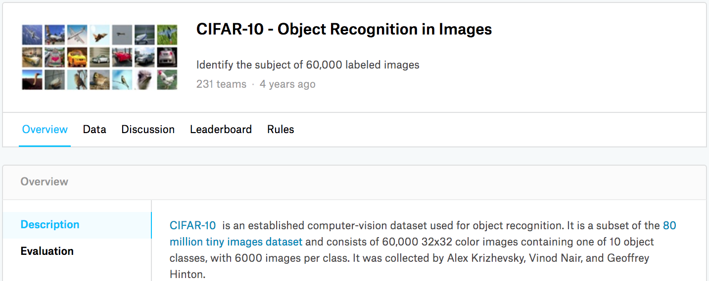

# Phân loại hình ảnh (CIFAR-10) trên Kaggle
:label:`sec_kaggle_cifar10`

Cho đến nay, chúng tôi đã sử dụng các API cấp cao của các framework deep learning để trực tiếp lấy tập dữ liệu hình ảnh ở định dạng tensor. Tuy nhiên, các tập dữ liệu hình ảnh tùy chỉnh thường có dạng tệp hình ảnh. Trong phần này, chúng ta sẽ bắt đầu từ các tệp hình ảnh thô và sắp xếp, đọc, sau đó chuyển đổi chúng thành định dạng tensor từng bước. 

Chúng tôi đã thử nghiệm với tập dữ liệu CIFAR-10 trong :numref:`sec_image_augmentation`, đây là một tập dữ liệu quan trọng trong tầm nhìn máy tính. Trong phần này, chúng tôi sẽ áp dụng kiến thức chúng tôi đã học được trong các phần trước để thực hành cuộc thi Kaggle của phân loại hình ảnh CIFAR-10. (**Địa chỉ web của cuộc thi là https://www.kaggle.com/c/cifar-10 **) 

:numref:`fig_kaggle_cifar10` hiển thị thông tin trên trang web của cuộc thi. Để gửi kết quả, bạn cần đăng ký tài khoản Kaggle. 


:width:`600px`
:label:`fig_kaggle_cifar10`

```{.python .input}
import collections
from d2l import mxnet as d2l
import math
from mxnet import gluon, init, npx
from mxnet.gluon import nn
import os
import pandas as pd
import shutil

npx.set_np()
```

```{.python .input}
#@tab pytorch
import collections
from d2l import torch as d2l
import math
import torch
import torchvision
from torch import nn
import os
import pandas as pd
import shutil
```

## Lấy và tổ chức tập dữ liệu

Tập dữ liệu cuộc thi được chia thành một bộ đào tạo và một bộ thử nghiệm, có chứa 50000 và 300000 hình ảnh, tương ứng. Trong bộ thử nghiệm, 10000 hình ảnh sẽ được sử dụng để đánh giá, trong khi 290000 hình ảnh còn lại sẽ không được đánh giá: chúng được bao gồm chỉ để làm cho nó khó khăn để lừa dối
*kết quả được dán nhãn bằng tay* của bộ thử nghiệm.
Các hình ảnh trong tập dữ liệu này là tất cả các tệp hình ảnh màu png (kênh RGB), có chiều cao và chiều rộng đều là 32 pixel. Các hình ảnh bao gồm tổng cộng 10 loại, cụ thể là máy bay, ô tô, chim, mèo, hươu, chó, ếch, ngựa, thuyền và xe tải. Góc trên bên trái của :numref:`fig_kaggle_cifar10` cho thấy một số hình ảnh về máy bay, ô tô và chim trong bộ dữ liệu. 

### Tải xuống tập dữ liệu

Sau khi đăng nhập vào Kaggle, chúng ta có thể nhấp vào tab “Dữ liệu” trên trang web cạnh tranh phân loại hình ảnh CIFAR-10 được hiển thị trong :numref:`fig_kaggle_cifar10` và tải xuống tập dữ liệu bằng cách nhấp vào nút “Tải xuống tất cả”. Sau khi giải nén tệp đã tải xuống trong `../data` và giải nén `train.7z` và `test.7z` bên trong tệp đó, bạn sẽ tìm thấy toàn bộ bộ dữ liệu trong các đường dẫn sau: 

* `../data/cifar-10/train/[1-50000].png`
* `../data/cifar-10/test/[1-300000].png`
* `../data/cifar-10/trainLabels.csv`
* `../data/cifar-10/sampleSubmission.csv`

trong đó các thư mục `train` và `test` chứa các hình ảnh đào tạo và thử nghiệm, tương ứng, `trainLabels.csv` cung cấp nhãn cho các hình ảnh đào tạo, và `sample_submission.csv` là một tập tin gửi mẫu. 

Để bắt đầu dễ dàng hơn, [**chúng tôi cung cấp một mẫu quy mô nhỏ của bộ dữ liệu chứa 1000 hình ảnh đào tạo đầu tiên và 5 hình ảnh thử nghiệm ngẫu nhiên.**] Để sử dụng bộ dữ liệu đầy đủ của cuộc thi Kaggle, bạn cần đặt biến `demo` sau thành `False`.

```{.python .input}
#@tab all
#@save
d2l.DATA_HUB['cifar10_tiny'] = (d2l.DATA_URL + 'kaggle_cifar10_tiny.zip',
                                '2068874e4b9a9f0fb07ebe0ad2b29754449ccacd')

# If you use the full dataset downloaded for the Kaggle competition, set
# `demo` to False
demo = True

if demo:
    data_dir = d2l.download_extract('cifar10_tiny')
else:
    data_dir = '../data/cifar-10/'
```

### [**Torganizing the Dataset**]

Chúng ta cần tổ chức các tập dữ liệu để tạo điều kiện cho việc đào tạo và thử nghiệm mô hình. Trước tiên chúng ta hãy đọc các nhãn từ tệp csv. Hàm sau trả về một từ điển mà ánh xạ phần không mở rộng của tên tập tin vào nhãn của nó.

```{.python .input}
#@tab all
#@save
def read_csv_labels(fname):
    """Read `fname` to return a filename to label dictionary."""
    with open(fname, 'r') as f:
        # Skip the file header line (column name)
        lines = f.readlines()[1:]
    tokens = [l.rstrip().split(',') for l in lines]
    return dict(((name, label) for name, label in tokens))

labels = read_csv_labels(os.path.join(data_dir, 'trainLabels.csv'))
print('# training examples:', len(labels))
print('# classes:', len(set(labels.values())))
```

Tiếp theo, chúng ta định nghĩa hàm `reorg_train_valid` thành [** chia xác thực được đặt ra khỏi tập đào tạo ban đầu.**] Đối số `valid_ratio` trong hàm này là tỷ lệ giữa số ví dụ trong xác thực được đặt thành số ví dụ trong bộ đào tạo ban đầu. Cụ thể hơn, hãy để $n$ là số lượng hình ảnh của lớp với ít ví dụ nhất, và $r$ là tỷ lệ. Bộ xác nhận sẽ chia ra $\max(\lfloor nr\rfloor,1)$ hình ảnh cho mỗi lớp. Hãy để chúng tôi sử dụng `valid_ratio=0.1` làm ví dụ. Vì bộ đào tạo ban đầu có 50000 hình ảnh, sẽ có 45000 hình ảnh được sử dụng để đào tạo trong đường `train_valid_test/train`, trong khi 5000 hình ảnh khác sẽ được chia ra như xác nhận được đặt trong đường `train_valid_test/valid`. Sau khi tổ chức tập dữ liệu, hình ảnh của cùng một lớp sẽ được đặt dưới cùng một thư mục.

```{.python .input}
#@tab all
#@save
def copyfile(filename, target_dir):
    """Copy a file into a target directory."""
    os.makedirs(target_dir, exist_ok=True)
    shutil.copy(filename, target_dir)

#@save
def reorg_train_valid(data_dir, labels, valid_ratio):
    """Split the validation set out of the original training set."""
    # The number of examples of the class that has the fewest examples in the
    # training dataset
    n = collections.Counter(labels.values()).most_common()[-1][1]
    # The number of examples per class for the validation set
    n_valid_per_label = max(1, math.floor(n * valid_ratio))
    label_count = {}
    for train_file in os.listdir(os.path.join(data_dir, 'train')):
        label = labels[train_file.split('.')[0]]
        fname = os.path.join(data_dir, 'train', train_file)
        copyfile(fname, os.path.join(data_dir, 'train_valid_test',
                                     'train_valid', label))
        if label not in label_count or label_count[label] < n_valid_per_label:
            copyfile(fname, os.path.join(data_dir, 'train_valid_test',
                                         'valid', label))
            label_count[label] = label_count.get(label, 0) + 1
        else:
            copyfile(fname, os.path.join(data_dir, 'train_valid_test',
                                         'train', label))
    return n_valid_per_label
```

Hàm `reorg_test` bên dưới [** tổ chức bộ thử nghiệm để tải dữ liệu trong quá trình dự đoán. **]

```{.python .input}
#@tab all
#@save
def reorg_test(data_dir):
    """Organize the testing set for data loading during prediction."""
    for test_file in os.listdir(os.path.join(data_dir, 'test')):
        copyfile(os.path.join(data_dir, 'test', test_file),
                 os.path.join(data_dir, 'train_valid_test', 'test',
                              'unknown'))
```

Cuối cùng, chúng ta sử dụng một hàm để [**invoke**] `read_csv_labels`, `reorg_train_valid`, và `reorg_test` (**functions được định nghĩa ở trên.**)

```{.python .input}
#@tab all
def reorg_cifar10_data(data_dir, valid_ratio):
    labels = read_csv_labels(os.path.join(data_dir, 'trainLabels.csv'))
    reorg_train_valid(data_dir, labels, valid_ratio)
    reorg_test(data_dir)
```

Ở đây chúng tôi chỉ đặt kích thước lô thành 32 cho mẫu quy mô nhỏ của tập dữ liệu. Khi đào tạo và thử nghiệm tập dữ liệu hoàn chỉnh của cuộc thi Kaggle, `batch_size` nên được đặt thành một số nguyên lớn hơn, chẳng hạn như 128. Chúng tôi chia ra 10% các ví dụ đào tạo là xác nhận được thiết lập để điều chỉnh các siêu tham số.

```{.python .input}
#@tab all
batch_size = 32 if demo else 128
valid_ratio = 0.1
reorg_cifar10_data(data_dir, valid_ratio)
```

## [**Image Augmentation**]

Chúng tôi sử dụng nâng hình ảnh để giải quyết overfitting. Ví dụ, hình ảnh có thể được lật theo chiều ngang ngẫu nhiên trong quá trình đào tạo. Chúng tôi cũng có thể thực hiện tiêu chuẩn hóa cho ba kênh RGB của hình ảnh màu. Dưới đây liệt kê một số hoạt động mà bạn có thể tinh chỉnh.

```{.python .input}
transform_train = gluon.data.vision.transforms.Compose([
    # Scale the image up to a square of 40 pixels in both height and width
    gluon.data.vision.transforms.Resize(40),
    # Randomly crop a square image of 40 pixels in both height and width to
    # produce a small square of 0.64 to 1 times the area of the original
    # image, and then scale it to a square of 32 pixels in both height and
    # width
    gluon.data.vision.transforms.RandomResizedCrop(32, scale=(0.64, 1.0),
                                                   ratio=(1.0, 1.0)),
    gluon.data.vision.transforms.RandomFlipLeftRight(),
    gluon.data.vision.transforms.ToTensor(),
    # Standardize each channel of the image
    gluon.data.vision.transforms.Normalize([0.4914, 0.4822, 0.4465],
                                           [0.2023, 0.1994, 0.2010])])
```

```{.python .input}
#@tab pytorch
transform_train = torchvision.transforms.Compose([
    # Scale the image up to a square of 40 pixels in both height and width
    torchvision.transforms.Resize(40),
    # Randomly crop a square image of 40 pixels in both height and width to
    # produce a small square of 0.64 to 1 times the area of the original
    # image, and then scale it to a square of 32 pixels in both height and
    # width
    torchvision.transforms.RandomResizedCrop(32, scale=(0.64, 1.0),
                                                   ratio=(1.0, 1.0)),
    torchvision.transforms.RandomHorizontalFlip(),
    torchvision.transforms.ToTensor(),
    # Standardize each channel of the image
    torchvision.transforms.Normalize([0.4914, 0.4822, 0.4465],
                                     [0.2023, 0.1994, 0.2010])])
```

Trong quá trình thử nghiệm, chúng tôi chỉ thực hiện tiêu chuẩn hóa trên hình ảnh để loại bỏ sự ngẫu nhiên trong kết quả đánh giá.

```{.python .input}
transform_test = gluon.data.vision.transforms.Compose([
    gluon.data.vision.transforms.ToTensor(),
    gluon.data.vision.transforms.Normalize([0.4914, 0.4822, 0.4465],
                                           [0.2023, 0.1994, 0.2010])])
```

```{.python .input}
#@tab pytorch
transform_test = torchvision.transforms.Compose([
    torchvision.transforms.ToTensor(),
    torchvision.transforms.Normalize([0.4914, 0.4822, 0.4465],
                                     [0.2023, 0.1994, 0.2010])])
```

## Đọc tập dữ liệu

Tiếp theo, chúng ta [** đọc tập dữ liệu có tổ chức bao gồm các tập tin hình ảnh thô**]. Mỗi ví dụ bao gồm một hình ảnh và một nhãn.

```{.python .input}
train_ds, valid_ds, train_valid_ds, test_ds = [
    gluon.data.vision.ImageFolderDataset(
        os.path.join(data_dir, 'train_valid_test', folder))
    for folder in ['train', 'valid', 'train_valid', 'test']]
```

```{.python .input}
#@tab pytorch
train_ds, train_valid_ds = [torchvision.datasets.ImageFolder(
    os.path.join(data_dir, 'train_valid_test', folder),
    transform=transform_train) for folder in ['train', 'train_valid']]

valid_ds, test_ds = [torchvision.datasets.ImageFolder(
    os.path.join(data_dir, 'train_valid_test', folder),
    transform=transform_test) for folder in ['valid', 'test']]
```

Trong quá trình đào tạo, chúng ta cần [** chỉ định tất cả các thao tác nâng hình ảnh được xác định ở trên**]. Khi bộ xác thực được sử dụng để đánh giá mô hình trong quá trình điều chỉnh siêu tham số, không nên giới thiệu tính ngẫu nhiên từ việc tăng hình ảnh. Trước khi dự đoán cuối cùng, chúng tôi đào tạo mô hình trên bộ đào tạo kết hợp và bộ xác nhận để tận dụng tối đa tất cả dữ liệu được dán nhãn.

```{.python .input}
train_iter, train_valid_iter = [gluon.data.DataLoader(
    dataset.transform_first(transform_train), batch_size, shuffle=True,
    last_batch='discard') for dataset in (train_ds, train_valid_ds)]

valid_iter = gluon.data.DataLoader(
    valid_ds.transform_first(transform_test), batch_size, shuffle=False,
    last_batch='discard')

test_iter = gluon.data.DataLoader(
    test_ds.transform_first(transform_test), batch_size, shuffle=False,
    last_batch='keep')
```

```{.python .input}
#@tab pytorch
train_iter, train_valid_iter = [torch.utils.data.DataLoader(
    dataset, batch_size, shuffle=True, drop_last=True)
    for dataset in (train_ds, train_valid_ds)]

valid_iter = torch.utils.data.DataLoader(valid_ds, batch_size, shuffle=False,
                                         drop_last=True)

test_iter = torch.utils.data.DataLoader(test_ds, batch_size, shuffle=False,
                                        drop_last=False)
```

## Xác định [**Mẫu**]

:begin_tab:`mxnet`
Ở đây, chúng tôi xây dựng các khối còn lại dựa trên lớp `HybridBlock`, hơi khác so với việc triển khai được mô tả trong :numref:`sec_resnet`. Điều này là để cải thiện hiệu quả tính toán.
:end_tab:

```{.python .input}
class Residual(nn.HybridBlock):
    def __init__(self, num_channels, use_1x1conv=False, strides=1, **kwargs):
        super(Residual, self).__init__(**kwargs)
        self.conv1 = nn.Conv2D(num_channels, kernel_size=3, padding=1,
                               strides=strides)
        self.conv2 = nn.Conv2D(num_channels, kernel_size=3, padding=1)
        if use_1x1conv:
            self.conv3 = nn.Conv2D(num_channels, kernel_size=1,
                                   strides=strides)
        else:
            self.conv3 = None
        self.bn1 = nn.BatchNorm()
        self.bn2 = nn.BatchNorm()

    def hybrid_forward(self, F, X):
        Y = F.npx.relu(self.bn1(self.conv1(X)))
        Y = self.bn2(self.conv2(Y))
        if self.conv3:
            X = self.conv3(X)
        return F.npx.relu(Y + X)
```

:begin_tab:`mxnet`
Tiếp theo, chúng tôi xác định mô hình ResNet-18.
:end_tab:

```{.python .input}
def resnet18(num_classes):
    net = nn.HybridSequential()
    net.add(nn.Conv2D(64, kernel_size=3, strides=1, padding=1),
            nn.BatchNorm(), nn.Activation('relu'))

    def resnet_block(num_channels, num_residuals, first_block=False):
        blk = nn.HybridSequential()
        for i in range(num_residuals):
            if i == 0 and not first_block:
                blk.add(Residual(num_channels, use_1x1conv=True, strides=2))
            else:
                blk.add(Residual(num_channels))
        return blk

    net.add(resnet_block(64, 2, first_block=True),
            resnet_block(128, 2),
            resnet_block(256, 2),
            resnet_block(512, 2))
    net.add(nn.GlobalAvgPool2D(), nn.Dense(num_classes))
    return net
```

:begin_tab:`mxnet`
Chúng tôi sử dụng khởi tạo Xavier được mô tả trong :numref:`subsec_xavier` trước khi đào tạo bắt đầu.
:end_tab:

:begin_tab:`pytorch`
Chúng tôi xác định mô hình ResNet-18 được mô tả trong :numref:`sec_resnet`.
:end_tab:

```{.python .input}
def get_net(devices):
    num_classes = 10
    net = resnet18(num_classes)
    net.initialize(ctx=devices, init=init.Xavier())
    return net

loss = gluon.loss.SoftmaxCrossEntropyLoss()
```

```{.python .input}
#@tab pytorch
def get_net():
    num_classes = 10
    net = d2l.resnet18(num_classes, 3)
    return net

loss = nn.CrossEntropyLoss(reduction="none")
```

## Xác định [**đào tạo chức năng**]

Chúng tôi sẽ chọn các mô hình và điều chỉnh các siêu tham số theo hiệu suất của mô hình trên bộ xác thực. Sau đây, chúng tôi xác định hàm đào tạo mô hình `train`.

```{.python .input}
def train(net, train_iter, valid_iter, num_epochs, lr, wd, devices, lr_period,
          lr_decay):
    trainer = gluon.Trainer(net.collect_params(), 'sgd',
                            {'learning_rate': lr, 'momentum': 0.9, 'wd': wd})
    num_batches, timer = len(train_iter), d2l.Timer()
    legend = ['train loss', 'train acc']
    if valid_iter is not None:
        legend.append('valid acc')
    animator = d2l.Animator(xlabel='epoch', xlim=[1, num_epochs],
                            legend=legend)
    for epoch in range(num_epochs):
        metric = d2l.Accumulator(3)
        if epoch > 0 and epoch % lr_period == 0:
            trainer.set_learning_rate(trainer.learning_rate * lr_decay)
        for i, (features, labels) in enumerate(train_iter):
            timer.start()
            l, acc = d2l.train_batch_ch13(
                net, features, labels.astype('float32'), loss, trainer,
                devices, d2l.split_batch)
            metric.add(l, acc, labels.shape[0])
            timer.stop()
            if (i + 1) % (num_batches // 5) == 0 or i == num_batches - 1:
                animator.add(epoch + (i + 1) / num_batches,
                             (metric[0] / metric[2], metric[1] / metric[2],
                              None))
        if valid_iter is not None:
            valid_acc = d2l.evaluate_accuracy_gpus(net, valid_iter,
                                                   d2l.split_batch)
            animator.add(epoch + 1, (None, None, valid_acc))
    measures = (f'train loss {metric[0] / metric[2]:.3f}, '
                f'train acc {metric[1] / metric[2]:.3f}')
    if valid_iter is not None:
        measures += f', valid acc {valid_acc:.3f}'
    print(measures + f'\n{metric[2] * num_epochs / timer.sum():.1f}'
          f' examples/sec on {str(devices)}')
```

```{.python .input}
#@tab pytorch
def train(net, train_iter, valid_iter, num_epochs, lr, wd, devices, lr_period,
          lr_decay):
    trainer = torch.optim.SGD(net.parameters(), lr=lr, momentum=0.9,
                              weight_decay=wd)
    scheduler = torch.optim.lr_scheduler.StepLR(trainer, lr_period, lr_decay)
    num_batches, timer = len(train_iter), d2l.Timer()
    legend = ['train loss', 'train acc']
    if valid_iter is not None:
        legend.append('valid acc')
    animator = d2l.Animator(xlabel='epoch', xlim=[1, num_epochs],
                            legend=legend)
    net = nn.DataParallel(net, device_ids=devices).to(devices[0])
    for epoch in range(num_epochs):
        net.train()
        metric = d2l.Accumulator(3)
        for i, (features, labels) in enumerate(train_iter):
            timer.start()
            l, acc = d2l.train_batch_ch13(net, features, labels,
                                          loss, trainer, devices)
            metric.add(l, acc, labels.shape[0])
            timer.stop()
            if (i + 1) % (num_batches // 5) == 0 or i == num_batches - 1:
                animator.add(epoch + (i + 1) / num_batches,
                             (metric[0] / metric[2], metric[1] / metric[2],
                              None))
        if valid_iter is not None:
            valid_acc = d2l.evaluate_accuracy_gpu(net, valid_iter)
            animator.add(epoch + 1, (None, None, valid_acc))
        scheduler.step()
    measures = (f'train loss {metric[0] / metric[2]:.3f}, '
                f'train acc {metric[1] / metric[2]:.3f}')
    if valid_iter is not None:
        measures += f', valid acc {valid_acc:.3f}'
    print(measures + f'\n{metric[2] * num_epochs / timer.sum():.1f}'
          f' examples/sec on {str(devices)}')
```

## [**Đào tạo và xác thực mô hình**]

Bây giờ, chúng ta có thể đào tạo và xác thực mô hình. Tất cả các siêu tham số sau đây có thể được điều chỉnh. Ví dụ, chúng ta có thể tăng số lượng kỷ nguyên. Khi `lr_period` và `lr_decay` được đặt thành 4 và 0,9, tương ứng, tốc độ học tập của thuật toán tối ưu hóa sẽ được nhân với 0,9 sau mỗi 4 kỷ nguyên. Chỉ để dễ dàng trình diễn, chúng tôi chỉ đào tạo 20 kỷ nguyên ở đây.

```{.python .input}
devices, num_epochs, lr, wd = d2l.try_all_gpus(), 20, 0.02, 5e-4
lr_period, lr_decay, net = 4, 0.9, get_net(devices)
net.hybridize()
train(net, train_iter, valid_iter, num_epochs, lr, wd, devices, lr_period,
      lr_decay)
```

```{.python .input}
#@tab pytorch
devices, num_epochs, lr, wd = d2l.try_all_gpus(), 20, 2e-4, 5e-4
lr_period, lr_decay, net = 4, 0.9, get_net()
train(net, train_iter, valid_iter, num_epochs, lr, wd, devices, lr_period,
      lr_decay)
```

## [**Phân loại bộ thử nghiệm**] và gửi kết quả trên Kaggle

Sau khi có được một mô hình đầy hứa hẹn với các siêu tham số, chúng tôi sử dụng tất cả dữ liệu được dán nhãn (bao gồm cả bộ xác thực) để đào tạo lại mô hình và phân loại bộ thử nghiệm.

```{.python .input}
net, preds = get_net(devices), []
net.hybridize()
train(net, train_valid_iter, None, num_epochs, lr, wd, devices, lr_period,
      lr_decay)

for X, _ in test_iter:
    y_hat = net(X.as_in_ctx(devices[0]))
    preds.extend(y_hat.argmax(axis=1).astype(int).asnumpy())
sorted_ids = list(range(1, len(test_ds) + 1))
sorted_ids.sort(key=lambda x: str(x))
df = pd.DataFrame({'id': sorted_ids, 'label': preds})
df['label'] = df['label'].apply(lambda x: train_valid_ds.synsets[x])
df.to_csv('submission.csv', index=False)
```

```{.python .input}
#@tab pytorch
net, preds = get_net(), []
train(net, train_valid_iter, None, num_epochs, lr, wd, devices, lr_period,
      lr_decay)

for X, _ in test_iter:
    y_hat = net(X.to(devices[0]))
    preds.extend(y_hat.argmax(dim=1).type(torch.int32).cpu().numpy())
sorted_ids = list(range(1, len(test_ds) + 1))
sorted_ids.sort(key=lambda x: str(x))
df = pd.DataFrame({'id': sorted_ids, 'label': preds})
df['label'] = df['label'].apply(lambda x: train_valid_ds.classes[x])
df.to_csv('submission.csv', index=False)
```

Mã trên sẽ tạo ra một tập tin `submission.csv`, có định dạng đáp ứng yêu cầu của cuộc thi Kaggle. Phương pháp gửi kết quả cho Kaggle tương tự như trong :numref:`sec_kaggle_house`. 

## Tóm tắt

* Chúng ta có thể đọc các bộ dữ liệu chứa các tệp hình ảnh thô sau khi sắp xếp chúng thành định dạng cần thiết.

:begin_tab:`mxnet`
* Chúng ta có thể sử dụng các mạng thần kinh phức tạp, nâng hình ảnh và lập trình lai trong một cuộc thi phân loại hình ảnh.
:end_tab:

:begin_tab:`pytorch`
* Chúng ta có thể sử dụng mạng thần kinh phức tạp và nâng hình ảnh trong một cuộc thi phân loại hình ảnh.
:end_tab:

## Bài tập

1. Sử dụng bộ dữ liệu CIFAR-10 hoàn chỉnh cho cuộc thi Kaggle này. Đặt các siêu tham số là `batch_size = 128`, `num_epochs = 100`, `lr = 0.1`, `lr_period = 50` và `lr_decay = 0.1`. Xem độ chính xác và thứ hạng bạn có thể đạt được trong cuộc thi này. Bạn có thể cải thiện thêm chúng?
1. Độ chính xác nào bạn có thể nhận được khi không sử dụng nâng hình ảnh?

:begin_tab:`mxnet`
[Discussions](https://discuss.d2l.ai/t/379)
:end_tab:

:begin_tab:`pytorch`
[Discussions](https://discuss.d2l.ai/t/1479)
:end_tab:
