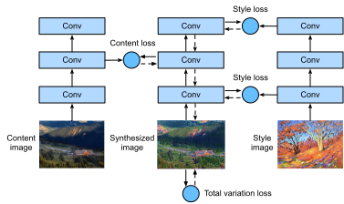

# Chuyển kiểu thần kinh

Nếu bạn là một người đam mê nhiếp ảnh, bạn có thể đã quen thuộc với bộ lọc. Nó có thể thay đổi kiểu màu của ảnh để ảnh phong cảnh trở nên sắc nét hơn hoặc ảnh chân dung đã làm trắng da. Tuy nhiên, một bộ lọc thường chỉ thay đổi một khía cạnh của ảnh. Để áp dụng một phong cách lý tưởng cho ảnh, có lẽ bạn cần thử nhiều kết hợp bộ lọc khác nhau. Quá trình này phức tạp như điều chỉnh các siêu tham số của một mô hình. 

Trong phần này, chúng ta sẽ tận dụng các biểu diễn theo lớp của CNN để tự động áp dụng kiểu của một hình ảnh cho một hình ảnh khác, tức là, * phong cách transfer* :cite:`Gatys.Ecker.Bethge.2016`. Nhiệm vụ này cần hai hình ảnh đầu vào: một là hình ảnh* nội dung hình ảnh* và cái còn lại là hình ảnh* phong cách*. Chúng tôi sẽ sử dụng mạng nơ-ron để sửa đổi hình ảnh nội dung để làm cho nó gần với hình ảnh phong cách theo phong cách. Ví dụ, hình ảnh nội dung trong :numref:`fig_style_transfer` là một bức ảnh phong cảnh do chúng tôi chụp trong Vườn quốc gia Núi Rainier ở ngoại ô Seattle, trong khi hình ảnh phong cách là một bức tranh sơn dầu với chủ đề cây sồi mùa thu. Trong hình ảnh tổng hợp đầu ra, các nét cọ dầu của hình ảnh phong cách được áp dụng, dẫn đến màu sắc sống động hơn, đồng thời vẫn giữ được hình dạng chính của các đối tượng trong hình ảnh nội dung. 


:label:`fig_style_transfer`

## Phương pháp

:numref:`fig_style_transfer_model` minh họa phương thức chuyển kiểu dựa trên CNN với một ví dụ đơn giản hóa. Đầu tiên, chúng tôi khởi tạo hình ảnh tổng hợp, ví dụ, vào hình ảnh nội dung. Hình ảnh tổng hợp này là biến duy nhất cần được cập nhật trong quá trình chuyển kiểu, tức là các tham số mô hình được cập nhật trong quá trình đào tạo. Sau đó, chúng tôi chọn CNN được đào tạo trước để trích xuất các tính năng hình ảnh và đóng băng các thông số mô hình của nó trong quá trình đào tạo. CNN sâu này sử dụng nhiều lớp để trích xuất các tính năng phân cấp cho hình ảnh. Chúng ta có thể chọn đầu ra của một số lớp này làm tính năng nội dung hoặc tính năng phong cách. Lấy :numref:`fig_style_transfer_model` làm ví dụ. Mạng nơ-ron được đào tạo trước ở đây có 3 lớp phức tạp, trong đó lớp thứ hai xuất ra các tính năng nội dung, và các lớp thứ nhất và thứ ba xuất ra các tính năng kiểu. 


:label:`fig_style_transfer_model`

Tiếp theo, chúng ta tính toán hàm mất của chuyển kiểu thông qua lan truyền về phía trước (hướng của mũi tên rắn), và cập nhật các tham số mô hình (hình ảnh tổng hợp cho đầu ra) thông qua truyền ngược (hướng của các mũi tên đứt nét). Chức năng mất thường được sử dụng trong chuyển phong cách bao gồm ba phần: (i) * mất nội dung* làm cho hình ảnh tổng hợp và hình ảnh nội dung gần gũi trong các tính năng nội dung; (ii) * phong cách mất đi* làm cho hình ảnh tổng hợp và phong cách gần gũi trong các tính năng phong cách; và (iii) * mất biến thể* giúp giảm noise tiếng ồn in the synthesized tổng hợp image hình ảnh. Cuối cùng, khi đào tạo mô hình kết thúc, chúng tôi xuất các thông số mô hình của chuyển kiểu để tạo ra hình ảnh tổng hợp cuối cùng. 

Sau đây, chúng tôi sẽ giải thích các chi tiết kỹ thuật của chuyển phong cách thông qua một thí nghiệm cụ thể. 

## [**Đọc nội dung và phong cách hình ảnh**]

Đầu tiên, chúng tôi đọc nội dung và phong cách hình ảnh. Từ các trục tọa độ in của chúng, chúng ta có thể nói rằng những hình ảnh này có kích thước khác nhau.

```{.python .input}
%matplotlib inline
from d2l import mxnet as d2l
from mxnet import autograd, gluon, image, init, np, npx
from mxnet.gluon import nn

npx.set_np()

d2l.set_figsize()
content_img = image.imread('../img/rainier.jpg')
d2l.plt.imshow(content_img.asnumpy());
```

```{.python .input}
#@tab pytorch
%matplotlib inline
from d2l import torch as d2l
import torch
import torchvision
from torch import nn

d2l.set_figsize()
content_img = d2l.Image.open('../img/rainier.jpg')
d2l.plt.imshow(content_img);
```

```{.python .input}
style_img = image.imread('../img/autumn-oak.jpg')
d2l.plt.imshow(style_img.asnumpy());
```

```{.python .input}
#@tab pytorch
style_img = d2l.Image.open('../img/autumn-oak.jpg')
d2l.plt.imshow(style_img);
```

## [**Tiền xử lý và xử lý sau**]

Dưới đây, chúng tôi xác định hai chức năng cho hình ảnh tiền xử lý và xử lý hậu kỳ. Chức năng `preprocess` chuẩn hóa mỗi kênh trong ba kênh RGB của hình ảnh đầu vào và biến đổi kết quả thành định dạng đầu vào CNN. Hàm `postprocess` khôi phục các giá trị điểm ảnh trong hình ảnh đầu ra về giá trị ban đầu của chúng trước khi tiêu chuẩn hóa. Vì chức năng in ảnh yêu cầu mỗi pixel có giá trị điểm nổi từ 0 đến 1, chúng ta thay thế bất kỳ giá trị nào nhỏ hơn 0 hoặc lớn hơn 1 với 0 hoặc 1, tương ứng.

```{.python .input}
rgb_mean = np.array([0.485, 0.456, 0.406])
rgb_std = np.array([0.229, 0.224, 0.225])

def preprocess(img, image_shape):
    img = image.imresize(img, *image_shape)
    img = (img.astype('float32') / 255 - rgb_mean) / rgb_std
    return np.expand_dims(img.transpose(2, 0, 1), axis=0)

def postprocess(img):
    img = img[0].as_in_ctx(rgb_std.ctx)
    return (img.transpose(1, 2, 0) * rgb_std + rgb_mean).clip(0, 1)
```

```{.python .input}
#@tab pytorch
rgb_mean = torch.tensor([0.485, 0.456, 0.406])
rgb_std = torch.tensor([0.229, 0.224, 0.225])

def preprocess(img, image_shape):
    transforms = torchvision.transforms.Compose([
        torchvision.transforms.Resize(image_shape),
        torchvision.transforms.ToTensor(),
        torchvision.transforms.Normalize(mean=rgb_mean, std=rgb_std)])
    return transforms(img).unsqueeze(0)

def postprocess(img):
    img = img[0].to(rgb_std.device)
    img = torch.clamp(img.permute(1, 2, 0) * rgb_std + rgb_mean, 0, 1)
    return torchvision.transforms.ToPILImage()(img.permute(2, 0, 1))
```

## [**tính năng chiết xuất**]

Chúng tôi sử dụng mô hình VGG-19 được đào tạo trước trên bộ dữ liệu ImageNet để trích xuất các tính năng hình ảnh :cite:`Gatys.Ecker.Bethge.2016`.

```{.python .input}
pretrained_net = gluon.model_zoo.vision.vgg19(pretrained=True)
```

```{.python .input}
#@tab pytorch
pretrained_net = torchvision.models.vgg19(pretrained=True)
```

Để trích xuất các tính năng nội dung và tính năng kiểu của hình ảnh, chúng ta có thể chọn đầu ra của các lớp nhất định trong mạng VGG. Nói chung, càng gần lớp đầu vào, dễ dàng hơn để trích xuất chi tiết của hình ảnh, và ngược lại, dễ dàng hơn để trích xuất thông tin toàn cầu của hình ảnh. Để tránh giữ lại quá mức các chi tiết của hình ảnh nội dung trong hình ảnh tổng hợp, chúng tôi chọn một lớp VGG gần đầu ra hơn làm lớp nội dung *để xuất các tính năng nội dung của hình ảnh. Chúng tôi cũng chọn đầu ra của các lớp VGG khác nhau để trích xuất các tính năng kiểu địa phương và toàn cầu. Các lớp này còn được gọi là lớp kiểu *. Như đã đề cập trong :numref:`sec_vgg`, mạng VGG sử dụng 5 khối phức tạp. Trong thí nghiệm, chúng ta chọn lớp phức tạp cuối cùng của khối phức tạp thứ tư làm lớp nội dung, và lớp phức tạp đầu tiên của mỗi khối phức tạp làm lớp phong cách. Các chỉ số của các lớp này có thể thu được bằng cách in phiên bản `pretrained_net`.

```{.python .input}
#@tab all
style_layers, content_layers = [0, 5, 10, 19, 28], [25]
```

Khi trích xuất các đối tượng bằng cách sử dụng các lớp VGG, chúng ta chỉ cần sử dụng tất cả các đối tượng từ lớp input đến lớp nội dung hoặc layer style gần nhất với lớp đầu ra nhất. Chúng ta hãy xây dựng một phiên bản mạng mới `net`, chỉ giữ lại tất cả các lớp VGG được sử dụng để trích xuất tính năng.

```{.python .input}
net = nn.Sequential()
for i in range(max(content_layers + style_layers) + 1):
    net.add(pretrained_net.features[i])
```

```{.python .input}
#@tab pytorch
net = nn.Sequential(*[pretrained_net.features[i] for i in
                      range(max(content_layers + style_layers) + 1)])
```

Với đầu vào `X`, nếu chúng ta chỉ đơn giản gọi tuyên truyền chuyển tiếp `net(X)`, chúng ta chỉ có thể nhận được đầu ra của lớp cuối cùng. Vì chúng ta cũng cần các đầu ra của các lớp trung gian, chúng ta cần thực hiện tính toán từng lớp và giữ cho các đầu ra lớp nội dung và kiểu dáng.

```{.python .input}
#@tab all
def extract_features(X, content_layers, style_layers):
    contents = []
    styles = []
    for i in range(len(net)):
        X = net[i](X)
        if i in style_layers:
            styles.append(X)
        if i in content_layers:
            contents.append(X)
    return contents, styles
```

Hai chức năng được định nghĩa dưới đây: hàm `get_contents` trích xuất các tính năng nội dung từ hình ảnh nội dung và hàm `get_styles` trích xuất các tính năng kiểu từ hình ảnh phong cách. Vì không cần cập nhật các thông số mô hình của VGG được đào tạo trước trong quá trình đào tạo, chúng tôi có thể trích xuất nội dung và các tính năng phong cách ngay cả trước khi bắt đầu đào tạo. Vì hình ảnh tổng hợp là một tập hợp các tham số mô hình được cập nhật để chuyển kiểu, chúng ta chỉ có thể trích xuất nội dung và tính năng kiểu dáng của hình ảnh tổng hợp bằng cách gọi hàm `extract_features` trong quá trình đào tạo.

```{.python .input}
def get_contents(image_shape, device):
    content_X = preprocess(content_img, image_shape).copyto(device)
    contents_Y, _ = extract_features(content_X, content_layers, style_layers)
    return content_X, contents_Y

def get_styles(image_shape, device):
    style_X = preprocess(style_img, image_shape).copyto(device)
    _, styles_Y = extract_features(style_X, content_layers, style_layers)
    return style_X, styles_Y
```

```{.python .input}
#@tab pytorch
def get_contents(image_shape, device):
    content_X = preprocess(content_img, image_shape).to(device)
    contents_Y, _ = extract_features(content_X, content_layers, style_layers)
    return content_X, contents_Y

def get_styles(image_shape, device):
    style_X = preprocess(style_img, image_shape).to(device)
    _, styles_Y = extract_features(style_X, content_layers, style_layers)
    return style_X, styles_Y
```

## [**Defining the Loss Function**]

Bây giờ chúng ta sẽ mô tả chức năng mất để chuyển phong cách. Chức năng mất bao gồm mất nội dung, mất phong cách và mất hoàn toàn biến thể. 

### Mất nội dung

Tương tự như chức năng mất trong hồi quy tuyến tính, mất nội dung đo lường sự khác biệt về các tính năng nội dung giữa hình ảnh tổng hợp và hình ảnh nội dung thông qua chức năng mất bình phương. Hai đầu vào của hàm mất bình phương là cả hai đầu ra của lớp nội dung được tính toán bởi hàm `extract_features`.

```{.python .input}
def content_loss(Y_hat, Y):
    return np.square(Y_hat - Y).mean()
```

```{.python .input}
#@tab pytorch
def content_loss(Y_hat, Y):
    # We detach the target content from the tree used to dynamically compute
    # the gradient: this is a stated value, not a variable. Otherwise the loss
    # will throw an error.
    return torch.square(Y_hat - Y.detach()).mean()
```

### Phong cách mất

Mất phong cách, tương tự như mất nội dung, cũng sử dụng chức năng mất bình phương để đo lường sự khác biệt về phong cách giữa hình ảnh tổng hợp và hình ảnh phong cách. Để thể hiện đầu ra kiểu của bất kỳ layer style nào, trước tiên chúng ta sử dụng hàm `extract_features` để tính toán đầu ra layer style. Giả sử rằng đầu ra có 1 ví dụ, $c$ kênh, chiều cao $h$ và chiều rộng $w$, chúng ta có thể chuyển đổi đầu ra này thành ma trận $\mathbf{X}$ với $c$ hàng và $hw$ cột. Ma trận này có thể được coi là sự nối của $c$ vectơ $\mathbf{x}_1, \ldots, \mathbf{x}_c$, mỗi vectơ có chiều dài $hw$. Ở đây, vector $\mathbf{x}_i$ đại diện cho tính năng phong cách của kênh $i$. 

Trong ma trận *Gram* của các vectơ $\mathbf{X}\mathbf{X}^\top \in \mathbb{R}^{c \times c}$, phần tử $x_{ij}$ trong hàng $i$ và cột $j$ là tích chấm của vectơ $\mathbf{x}_i$ và $\mathbf{x}_j$. Nó đại diện cho mối tương quan của các tính năng phong cách của các kênh $i$ và $j$. Chúng tôi sử dụng ma trận Gram này để đại diện cho đầu ra kiểu của bất kỳ layer style nào. Lưu ý rằng khi giá trị của $hw$ lớn hơn, nó có thể dẫn đến các giá trị lớn hơn trong ma trận Gram. Cũng lưu ý rằng chiều cao và chiều rộng của ma trận Gram đều là số kênh $c$. Để cho phép mất kiểu không bị ảnh hưởng bởi các giá trị này, hàm `gram` bên dưới chia ma trận Gram cho số phần tử của nó, tức là $chw$.

```{.python .input}
#@tab all
def gram(X):
    num_channels, n = X.shape[1], d2l.size(X) // X.shape[1]
    X = d2l.reshape(X, (num_channels, n))
    return d2l.matmul(X, X.T) / (num_channels * n)
```

Rõ ràng, hai đầu vào ma trận Gram của hàm mất bình phương để mất kiểu được dựa trên đầu ra lớp kiểu cho hình ảnh tổng hợp và hình ảnh phong cách. Người ta cho rằng ma trận Gram `gram_Y` dựa trên hình ảnh phong cách đã được tính toán trước.

```{.python .input}
def style_loss(Y_hat, gram_Y):
    return np.square(gram(Y_hat) - gram_Y).mean()
```

```{.python .input}
#@tab pytorch
def style_loss(Y_hat, gram_Y):
    return torch.square(gram(Y_hat) - gram_Y.detach()).mean()
```

### Tổng Biến Thể Mất

Đôi khi, hình ảnh tổng hợp đã học có rất nhiều nhiễu tần số cao, tức là, đặc biệt là các pixel sáng hoặc tối. Một phương pháp giảm tiếng ồn phổ biến là
*tổng biến thể biểu tượng*.
Biểu thị bằng $x_{i, j}$ giá trị điểm ảnh ở tọa độ $(i, j)$. Giảm tổng tổn thất biến thể 

$$\sum_{i, j} \left|x_{i, j} - x_{i+1, j}\right| + \left|x_{i, j} - x_{i, j+1}\right|$$

làm cho các giá trị của các pixel lân cận trên hình ảnh tổng hợp gần hơn.

```{.python .input}
#@tab all
def tv_loss(Y_hat):
    return 0.5 * (d2l.abs(Y_hat[:, :, 1:, :] - Y_hat[:, :, :-1, :]).mean() +
                  d2l.abs(Y_hat[:, :, :, 1:] - Y_hat[:, :, :, :-1]).mean())
```

### Chức năng mất

[**Chức năng mất của chuyển phong cách là tổng trọng số của mất nội dung, mất phong cách, và mất biến thể tổng số**]. Bằng cách điều chỉnh các siêu tham số trọng lượng này, chúng ta có thể cân bằng giữa việc lưu giữ nội dung, chuyển kiểu và giảm nhiễu trên hình ảnh tổng hợp.

```{.python .input}
#@tab all
content_weight, style_weight, tv_weight = 1, 1e3, 10

def compute_loss(X, contents_Y_hat, styles_Y_hat, contents_Y, styles_Y_gram):
    # Calculate the content, style, and total variance losses respectively
    contents_l = [content_loss(Y_hat, Y) * content_weight for Y_hat, Y in zip(
        contents_Y_hat, contents_Y)]
    styles_l = [style_loss(Y_hat, Y) * style_weight for Y_hat, Y in zip(
        styles_Y_hat, styles_Y_gram)]
    tv_l = tv_loss(X) * tv_weight
    # Add up all the losses
    l = sum(10 * styles_l + contents_l + [tv_l])
    return contents_l, styles_l, tv_l, l
```

## [**Initializing the Synthesized Image**]

Trong chuyển phong cách, hình ảnh tổng hợp là biến duy nhất cần được cập nhật trong quá trình đào tạo. Do đó, chúng ta có thể xác định một mô hình đơn giản, `SynthesizedImage` và coi hình ảnh tổng hợp như các tham số mô hình. Trong mô hình này, tuyên truyền chuyển tiếp chỉ trả về các tham số mô hình.

```{.python .input}
class SynthesizedImage(nn.Block):
    def __init__(self, img_shape, **kwargs):
        super(SynthesizedImage, self).__init__(**kwargs)
        self.weight = self.params.get('weight', shape=img_shape)

    def forward(self):
        return self.weight.data()
```

```{.python .input}
#@tab pytorch
class SynthesizedImage(nn.Module):
    def __init__(self, img_shape, **kwargs):
        super(SynthesizedImage, self).__init__(**kwargs)
        self.weight = nn.Parameter(torch.rand(*img_shape))

    def forward(self):
        return self.weight
```

Tiếp theo, ta định nghĩa hàm `get_inits`. Hàm này tạo ra một ví dụ mô hình ảnh tổng hợp và khởi tạo nó thành hình ảnh `X`. Ma trận gram cho hình ảnh phong cách ở các lớp phong cách khác nhau, `styles_Y_gram`, được tính toán trước khi đào tạo.

```{.python .input}
def get_inits(X, device, lr, styles_Y):
    gen_img = SynthesizedImage(X.shape)
    gen_img.initialize(init.Constant(X), ctx=device, force_reinit=True)
    trainer = gluon.Trainer(gen_img.collect_params(), 'adam',
                            {'learning_rate': lr})
    styles_Y_gram = [gram(Y) for Y in styles_Y]
    return gen_img(), styles_Y_gram, trainer
```

```{.python .input}
#@tab pytorch
def get_inits(X, device, lr, styles_Y):
    gen_img = SynthesizedImage(X.shape).to(device)
    gen_img.weight.data.copy_(X.data)
    trainer = torch.optim.Adam(gen_img.parameters(), lr=lr)
    styles_Y_gram = [gram(Y) for Y in styles_Y]
    return gen_img(), styles_Y_gram, trainer
```

## [**Đào tạo**]

Khi đào tạo mô hình để chuyển phong cách, chúng tôi liên tục trích xuất các tính năng nội dung và tính năng phong cách của hình ảnh tổng hợp và tính toán chức năng mất mát. Dưới đây xác định vòng lặp đào tạo.

```{.python .input}
def train(X, contents_Y, styles_Y, device, lr, num_epochs, lr_decay_epoch):
    X, styles_Y_gram, trainer = get_inits(X, device, lr, styles_Y)
    animator = d2l.Animator(xlabel='epoch', ylabel='loss',
                            xlim=[10, num_epochs], ylim=[0, 20],
                            legend=['content', 'style', 'TV'],
                            ncols=2, figsize=(7, 2.5))
    for epoch in range(num_epochs):
        with autograd.record():
            contents_Y_hat, styles_Y_hat = extract_features(
                X, content_layers, style_layers)
            contents_l, styles_l, tv_l, l = compute_loss(
                X, contents_Y_hat, styles_Y_hat, contents_Y, styles_Y_gram)
        l.backward()
        trainer.step(1)
        if (epoch + 1) % lr_decay_epoch == 0:
            trainer.set_learning_rate(trainer.learning_rate * 0.8)
        if (epoch + 1) % 10 == 0:
            animator.axes[1].imshow(postprocess(X).asnumpy())
            animator.add(epoch + 1, [float(sum(contents_l)),
                                     float(sum(styles_l)), float(tv_l)])
    return X
```

```{.python .input}
#@tab pytorch
def train(X, contents_Y, styles_Y, device, lr, num_epochs, lr_decay_epoch):
    X, styles_Y_gram, trainer = get_inits(X, device, lr, styles_Y)
    scheduler = torch.optim.lr_scheduler.StepLR(trainer, lr_decay_epoch, 0.8)
    animator = d2l.Animator(xlabel='epoch', ylabel='loss',
                            xlim=[10, num_epochs],
                            legend=['content', 'style', 'TV'],
                            ncols=2, figsize=(7, 2.5))
    for epoch in range(num_epochs):
        trainer.zero_grad()
        contents_Y_hat, styles_Y_hat = extract_features(
            X, content_layers, style_layers)
        contents_l, styles_l, tv_l, l = compute_loss(
            X, contents_Y_hat, styles_Y_hat, contents_Y, styles_Y_gram)
        l.backward()
        trainer.step()
        scheduler.step()
        if (epoch + 1) % 10 == 0:
            animator.axes[1].imshow(postprocess(X))
            animator.add(epoch + 1, [float(sum(contents_l)),
                                     float(sum(styles_l)), float(tv_l)])
    return X
```

Bây giờ chúng ta [** bắt đầu đào tạo mô hình**]. Chúng tôi giải thích chiều cao và chiều rộng của nội dung và phong cách hình ảnh lên 300 x 450 pixel. Chúng tôi sử dụng hình ảnh nội dung để khởi tạo hình ảnh tổng hợp.

```{.python .input}
device, image_shape = d2l.try_gpu(), (450, 300)
net.collect_params().reset_ctx(device)
content_X, contents_Y = get_contents(image_shape, device)
_, styles_Y = get_styles(image_shape, device)
output = train(content_X, contents_Y, styles_Y, device, 0.9, 500, 50)
```

```{.python .input}
#@tab pytorch
device, image_shape = d2l.try_gpu(), (300, 450)  # PIL Image (h, w)
net = net.to(device)
content_X, contents_Y = get_contents(image_shape, device)
_, styles_Y = get_styles(image_shape, device)
output = train(content_X, contents_Y, styles_Y, device, 0.3, 500, 50)
```

Chúng ta có thể thấy rằng hình ảnh tổng hợp giữ lại cảnh quan và đối tượng của hình ảnh nội dung và chuyển màu sắc của hình ảnh phong cách cùng một lúc. Ví dụ, hình ảnh tổng hợp có các khối màu giống như trong hình ảnh phong cách. Một số khối này thậm chí còn có kết cấu tinh tế của nét cọ. 

## Tóm tắt

* Chức năng mất mát thường được sử dụng trong chuyển phong cách bao gồm ba phần: (i) mất nội dung làm cho hình ảnh tổng hợp và hình ảnh nội dung gần với các tính năng nội dung; (ii) mất phong cách làm cho hình ảnh tổng hợp và hình ảnh phong cách gần gũi trong các tính năng phong cách; và (iii) mất biến đổi tổng thể giúp giảm nhiễu trong the synthesized tổng hợp image hình ảnh.
* Chúng ta có thể sử dụng CNN được đào tạo trước để trích xuất các tính năng hình ảnh và giảm thiểu chức năng mất mát để liên tục cập nhật hình ảnh tổng hợp dưới dạng tham số mô hình trong quá trình đào tạo.
* Chúng ta sử dụng ma trận Gram để biểu diễn các đầu ra kiểu dáng từ các layer style.

## Bài tập

1. Làm thế nào để đầu ra thay đổi khi bạn chọn các lớp nội dung và kiểu khác nhau?
1. Điều chỉnh các siêu tham số trọng lượng trong chức năng mất mát. Đầu ra có giữ được nhiều nội dung hơn hoặc ít tiếng ồn hơn?
1. Sử dụng nội dung khác nhau và hình ảnh phong cách. Bạn có thể tạo ra những hình ảnh tổng hợp thú vị hơn không?
1. Chúng ta có thể áp dụng chuyển kiểu cho văn bản không? Hint: you may refer to the survey paper by Hu et al. :cite:`Hu.Lee.Aggarwal.ea.2020`.

:begin_tab:`mxnet`
[Discussions](https://discuss.d2l.ai/t/378)
:end_tab:

:begin_tab:`pytorch`
[Discussions](https://discuss.d2l.ai/t/1476)
:end_tab:
