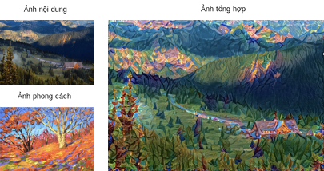
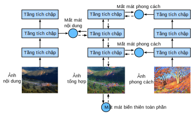
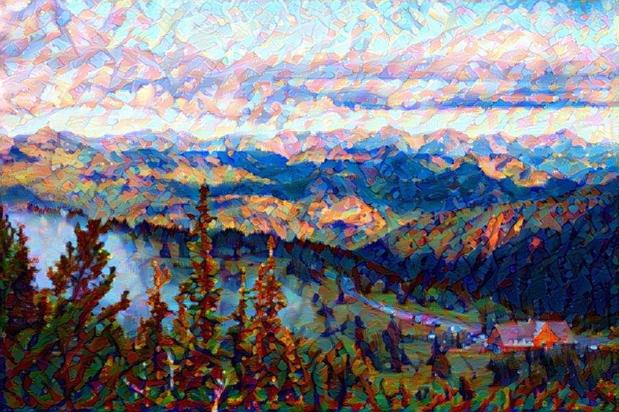

<!-- ===================== Bắt đầu dịch Phần 1 ==================== -->
<!-- ========================================= REVISE PHẦN 1 - BẮT ĐẦU =================================== -->

<!--
# Neural Style Transfer
-->

# Truyền tải Phong cách Nơ-ron


<!--
If you use social sharing apps or happen to be an amateur photographer, you are familiar with filters. 
Filters can alter the color styles of photos to make the background sharper or people's faces whiter. 
However, a filter generally can only change one aspect of a photo. 
To create the ideal photo, you often need to try many different filter combinations. 
This process is as complex as tuning the hyperparameters of a model.
-->

Nếu có sử dụng các ứng dụng mạng xã hội hoặc là một nhiếp ảnh gia không chuyên, chắc hẳn bạn cũng đã quen thuộc với kính lọc (*filter*).
Kính lọc có thể biến đổi tông màu của ảnh để làm cho khung cảnh phía sau sắc nét hơn hoặc mặt của những người trong ảnh trở nên trắng trẻo hơn.
Tuy nhiên, thường một kính lọc chỉ có thể thay đổi một khía cạnh của bức ảnh.
Để có được bức ảnh hoàn hảo, ta thường phải thử nghiệm với nhiều cách kết hợp kính lọc khác nhau.
Quá trình này phức tạp ngang với việc tinh chỉnh siêu tham số của mô hình.

<!--
In this section, we will discuss how we can use convolution neural networks (CNNs) to automatically apply the style of one image to another image, 
an operation known as style transfer :cite:`Gatys.Ecker.Bethge.2016`.
Here, we need two input images, one content image and one style image. 
We use a neural network to alter the content image so that its style mirrors that of the style image. 
In :numref:`fig_style_transfer`, the content image is a landscape photo the author took in Mount Rainier National Part near Seattle. 
The style image is an oil painting of oak trees in autumn. 
The output composite image retains the overall shapes of the objects in the content image, 
but applies the oil painting brushwork of the style image and makes the overall color more vivid.
-->

Trong phần này, ta sẽ thảo luận cách sử dụng mạng nơ-ron tích chập (CNN) để tự động áp dụng phong cách của ảnh này cho ảnh khác. Thao tác này được gọi là truyền tải phong cách (*style transfer*) :cite:`Gatys.Ecker.Bethge.2016`.
Ở đây ta sẽ cần hai ảnh đầu vào, một ảnh nội dung và một ảnh phong cách.
Ta sẽ dùng mạng nơ-ron để biến đổi ảnh nội dung sao cho phong cách của nó giống như ảnh phong cách đã cho.
Trong :numref:`fig_style_transfer`, ảnh nội dung là một bức ảnh phong cảnh được tác giả chụp ở công viên quốc gia Mount Rainier, gần Seattle.
Ảnh phong cách là một bức tranh sơn dầu vẽ cây gỗ sồi vào mùa thu.
Đầu ra là một ảnh kết hợp giữ lại được các hình dạng tổng thể của các vật trong ảnh nội dung, nhưng được áp dụng phong cách tranh sơn dầu của ảnh phong cách và giúp cho màu sắc trở nên sống động hơn.

<!--

-->


:label:`fig_style_transfer`


<!--
## Technique
-->

## Kĩ thuật


<!--
The CNN-based style transfer model is shown in :numref:`fig_style_transfer_model`.
First, we initialize the composite image. 
For example, we can initialize it as the content image. 
This composite image is the only variable that needs to be updated in the style transfer process, i.e., the model parameter to be updated in style transfer. 
Then, we select a pre-trained CNN to extract image features. 
These model parameters do not need to be updated during training. 
The deep CNN uses multiple neural layers that successively extract image features. 
We can select the output of certain layers to use as content features or style features. 
If we use the structure in :numref:`fig_style_transfer_model`, the pre-trained neural network contains three convolutional layers. 
The second layer outputs the image content features, while the outputs of the first and third layers are used as style features. 
Next, we use forward propagation (in the direction of the solid lines) to compute the style transfer loss function 
and backward propagation (in the direction of the dotted lines) to update the model parameter, constantly updating the composite image. 
The loss functions used in style transfer generally have three parts: 
1. Content loss is used to make the composite image approximate the content image as regards content features. 
2. Style loss is used to make the composite image approximate the style image in terms of style features. 
3. Total variation loss helps reduce the noise in the composite image. 
Finally, after we finish training the model, we output the style transfer model parameters to obtain the final composite image.
-->

Mô hình truyền tải phong cách dựa trên CNN được biểu diễn trong :numref:`fig_style_transfer_model`.
Đầu tiên ta sẽ khởi tạo ảnh kết hợp,
có thể bằng cách sử dụng ảnh nội dung.
Ảnh kết hợp này là biến (tức tham số mô hình) duy nhất cần được cập nhật trong quá trình truyền tải phong cách.
Sau đó, ta sẽ chọn một CNN đã được tiền huấn luyện để thực hiện trích xuất đặc trưng của ảnh.
Ta không cần phải cập nhật tham số của mạng CNN này trong quá trình huấn luyện.
Mạng CNN sâu sử dụng nhiều tầng nơ-ron liên tiếp để trích xuất đặc trưng của ảnh.
Ta có thể chọn đầu ra của một vài tầng nhất định làm đặc trưng nội dung hoặc đặc trưng phong cách.
Nếu ta sử dụng cấu trúc trong :numref:`fig_style_transfer_model`, mạng nơ-ron đã tiền huấn luyện sẽ chứa ba tầng tích chập.
Đầu ra của tầng thứ hai là đặc trưng nội dung ảnh, trong khi đầu ra của tầng thứ nhất và thứ ba được sử dụng làm đặc trưng phong cách.
Tiếp theo, ta thực hiện lan truyền xuôi (theo hướng của các đường nét liền) để tính hàm mất mát truyền tải phong cách
và lan truyền ngược (theo hướng của các đường nét đứt) để liên tục cập nhật ảnh kết hợp.
Hàm mất mát được sử dụng trong việc truyền tải phong cách thường có ba phần:
1. Mất mát nội dung giúp ảnh kết hợp có đặc trưng nội dung xấp xỉ với ảnh nội dung.
2. Mất mát phong cách giúp ảnh kết hợp có đặc trưng phong cách xấp xỉ với ảnh phong cách.
3. Mất mát biến thiên toàn phần giúp giảm nhiễu trong ảnh kết hợp.
Cuối cùng, sau khi huấn luyện xong, ta sẽ có tham số của mô hình truyền tải phong cách và từ đó thu được ảnh kết hợp cuối.

<!--

-->


:label:`fig_style_transfer_model`


<!--
Next, we will perform an experiment to help us better understand the technical details of style transfer.
-->

Tiếp theo, ta sẽ thực hiện một thí nghiệm để giúp hiểu rõ hơn các chi tiết kỹ thuật của truyền tải phong cách.

<!-- ===================== Kết thúc dịch Phần 1 ===================== -->

<!-- ===================== Bắt đầu dịch Phần 2 ===================== -->


<!--
## Reading the Content and Style Images
-->

## Đọc ảnh nội dung và ảnh phong cách


<!--
First, we read the content and style images. 
By printing out the image coordinate axes, we can see that they have different dimensions.
-->

Trước hết, ta đọc các ảnh nội dung và ảnh phong cách.
Bằng cách in ra các trục tọa độ ảnh, ta có thể thấy rằng chúng có các chiều khác nhau.


```{.python .input  n=1}
%matplotlib inline
from d2l import mxnet as d2l
from mxnet import autograd, gluon, image, init, np, npx
from mxnet.gluon import nn

npx.set_np()

d2l.set_figsize()
content_img = image.imread('../img/rainier.jpg')
d2l.plt.imshow(content_img.asnumpy());
```

```{.python .input  n=2}
style_img = image.imread('../img/autumn_oak.jpg')
d2l.plt.imshow(style_img.asnumpy());
```


<!--
## Preprocessing and Postprocessing
-->

## Tiền xử lý và hậu xử lý

<!--
Below, we define the functions for image preprocessing and postprocessing. 
The `preprocess` function normalizes each of the three RGB channels of the input images and transforms the results to a format that can be input to the CNN. 
The `postprocess` function restores the pixel values in the output image to their original values before normalization. 
Because the image printing function requires that each pixel has a floating point value from 0 to 1, 
we use the `clip` function to replace values smaller than 0 or greater than 1 with 0 or 1, respectively.
-->

Dưới đây, ta định nghĩa các hàm tiền xử lý và hậu xử lý ảnh.
Hàm `preprocess` chuẩn hóa các kênh RGB của ảnh đầu vào và chuyển kết quả sang định dạng có thể đưa vào mạng CNN.
Hàm `postprocess` khôi phục các giá trị điểm ảnh của ảnh đầu ra về các giá trị gốc của nó trước khi chuẩn hóa.
Vì hàm in ảnh đòi hỏi mỗi điểm ảnh có giá trị thực từ 0 tới 1,
ta sử dụng hàm `clip` để thay thế các giá trị nhỏ hơn 0 hoặc lớn hơn 1 lần lượt bằng 0 hoặc 1.


```{.python .input  n=3}
rgb_mean = np.array([0.485, 0.456, 0.406])
rgb_std = np.array([0.229, 0.224, 0.225])

def preprocess(img, image_shape):
    img = image.imresize(img, *image_shape)
    img = (img.astype('float32') / 255 - rgb_mean) / rgb_std
    return np.expand_dims(img.transpose(2, 0, 1), axis=0)

def postprocess(img):
    img = img[0].as_in_ctx(rgb_std.ctx)
    return (img.transpose(1, 2, 0) * rgb_std + rgb_mean).clip(0, 1)
```

<!-- ========================================= REVISE PHẦN 1 - KẾT THÚC ===================================-->

<!-- ========================================= REVISE PHẦN 2 - BẮT ĐẦU ===================================-->

<!--
## Extracting Features
-->

## Trích xuất đặc trưng


<!--
We use the VGG-19 model pre-trained on the ImageNet dataset to extract image features[1].
-->

Ta sử dụng mô hình VGG-19 tiền huấn luyện trên tập dữ liệu ImagNet để trích các đặc trưng của ảnh[1].


```{.python .input  n=4}
pretrained_net = gluon.model_zoo.vision.vgg19(pretrained=True)
```


<!--
To extract image content and style features, we can select the outputs of certain layers in the VGG network. 
In general, the closer an output is to the input layer, the easier it is to extract image detail information. 
The farther away an output is, the easier it is to extract global information. 
To prevent the composite image from retaining too many details from the content image, we select a VGG network layer near the output layer to output the image content features. 
This layer is called the content layer. 
We also select the outputs of different layers from the VGG network for matching local and global styles. 
These are called the style layers. 
As we mentioned in :numref:`sec_vgg`, VGG networks have five convolutional blocks. 
In this experiment, we select the last convolutional layer of the fourth convolutional block as the content layer and the first layer of each block as style layers. 
We can obtain the indexes for these layers by printing the `pretrained_net` instance.
-->

Để trích các đặc trưng nội dung và phong cách, ta có thể chọn đầu ra của một số tầng nhất định trong mạng VGG. 
Nói chung, đầu ra càng gần với tầng đầu vào, việc trích thông tin chi tiết của ảnh càng dễ hơn.
Trong khi đầu ra xa hơn thì dễ trích các thông tin toàn cục hơn.
Để ngăn ảnh tổng hợp không giữ quá nhiều chi tiết của ảnh nội dung, ta chọn một tầng mạng VGG gần tầng đầu ra để lấy các đặc trưng nội dung của ảnh đó.
Tầng này được gọi là tầng nội dung.
Ta cũng chọn các đầu ra ở các tầng khác nhau từ mạng VGG để phối hợp với các phong cách cục bộ và toàn cục.
Các tầng đó được gọi là các tầng phong cách.
Như ta đã đề cập trong :numref:`sec_vgg`, mạng VGG có năm khối tích chập.
Trong thử nghiệm này, ta chọn tầng cuối của khối tích chập thứ tư làm tầng nội dung và tầng đầu tiên của mỗi khối làm các tầng phong cách.
Ta có thể nhận được các chỉ số ở các tầng đó thông qua việc in thử `pretrained_net`.

```{.python .input  n=5}
style_layers, content_layers = [0, 5, 10, 19, 28], [25]
```

<!-- ===================== Kết thúc dịch Phần 2 ===================== -->

<!-- ===================== Bắt đầu dịch Phần 3 ===================== -->

<!--
During feature extraction, we only need to use all the VGG layers from the input layer to the content or style layer nearest the output layer. 
Below, we build a new network, `net`, which only retains the layers in the VGG network we need to use. We then use `net` to extract features.
-->

*dịch đoạn phía trên*


```{.python .input  n=6}
net = nn.Sequential()
for i in range(max(content_layers + style_layers) + 1):
    net.add(pretrained_net.features[i])
```


<!--
Given input `X`, if we simply call the forward computation `net(X)`, we can only obtain the output of the last layer. 
Because we also need the outputs of the intermediate layers, we need to perform layer-by-layer computation and retain the content and style layer outputs.
-->

*dịch đoạn phía trên*


```{.python .input  n=7}
def extract_features(X, content_layers, style_layers):
    contents = []
    styles = []
    for i in range(len(net)):
        X = net[i](X)
        if i in style_layers:
            styles.append(X)
        if i in content_layers:
            contents.append(X)
    return contents, styles
```


<!--
Next, we define two functions: The `get_contents` function obtains the content features extracted from the content image, 
while the `get_styles` function obtains the style features extracted from the style image. 
Because we do not need to change the parameters of the pre-trained VGG model during training, 
we can extract the content features from the content image and style features from the style image before the start of training. 
As the composite image is the model parameter that must be updated during style transfer, 
we can only call the `extract_features` function during training to extract the content and style features of the composite image.
-->

*dịch đoạn phía trên*


```{.python .input  n=8}
def get_contents(image_shape, device):
    content_X = preprocess(content_img, image_shape).copyto(device)
    contents_Y, _ = extract_features(content_X, content_layers, style_layers)
    return content_X, contents_Y

def get_styles(image_shape, device):
    style_X = preprocess(style_img, image_shape).copyto(device)
    _, styles_Y = extract_features(style_X, content_layers, style_layers)
    return style_X, styles_Y
```

<!-- ===================== Kết thúc dịch Phần 3 ===================== -->

<!-- ===================== Bắt đầu dịch Phần 4 ===================== -->

<!--
## Defining the Loss Function
-->

## *dịch tiêu đề phía trên*


<!--
Next, we will look at the loss function used for style transfer.
The loss function includes the content loss, style loss, and total variation loss.
-->

*dịch đoạn phía trên*


<!--
### Content Loss
-->

### *dịch tiêu đề phía trên*


<!--
Similar to the loss function used in linear regression, content loss uses a square error function to measure the difference in content features between the composite image and content image.
The two inputs of the square error function are both content layer outputs obtained from the `extract_features` function.
-->

*dịch đoạn phía trên*


```{.python .input  n=10}
def content_loss(Y_hat, Y):
    return np.square(Y_hat - Y).mean()
```


<!--
### Style Loss
-->

### *dịch tiêu đề phía trên*


<!--
Style loss, similar to content loss, uses a square error function to measure the difference in style between the composite image and style image.
To express the styles output by the style layers, we first use the `extract_features` function to compute the style layer output.
Assuming that the output has 1 example, $c$ channels, and a height and width of $h$ and $w$, we can transform the output into the matrix $\mathbf{X}$, which has $c$ rows and $h \cdot w$ columns.
You can think of matrix $\mathbf{X}$ as the combination of the $c$ vectors $\mathbf{x}_1, \ldots, \mathbf{x}_c$, which have a length of $hw$.
Here, the vector $\mathbf{x}_i$ represents the style feature of channel $i$.
In the Gram matrix of these vectors $\mathbf{X}\mathbf{X}^\top \in \mathbb{R}^{c \times c}$, element $x_{ij}$ in row $i$ column $j$ is the inner product of vectors $\mathbf{x}_i$ and $\mathbf{x}_j$.
It represents the correlation of the style features of channels $i$ and $j$.
We use this type of Gram matrix to represent the style output by the style layers.
You must note that, when the $h \cdot w$ value is large, this often leads to large values in the Gram matrix.
In addition, the height and width of the Gram matrix are both the number of channels $c$.
To ensure that the style loss is not affected by the size of these values, we define the `gram` function below to divide the Gram matrix by the number of its elements, i.e., $c \cdot h \cdot w$.
-->

*dịch đoạn phía trên*


```{.python .input  n=11}
def gram(X):
    num_channels, n = X.shape[1], X.size // X.shape[1]
    X = X.reshape(num_channels, n)
    return np.dot(X, X.T) / (num_channels * n)
```


<!--
Naturally, the two Gram matrix inputs of the square error function for style loss are taken from the composite image and style image style layer outputs.
Here, we assume that the Gram matrix of the style image, `gram_Y`, has been computed in advance.
-->

*dịch đoạn phía trên*


```{.python .input  n=12}
def style_loss(Y_hat, gram_Y):
    return np.square(gram(Y_hat) - gram_Y).mean()
```

<!-- ===================== Kết thúc dịch Phần 4 ===================== -->

<!-- ===================== Bắt đầu dịch Phần 5 ===================== -->

<!--
### Total Variance Loss
-->

### Mất mát Biến thiên Toàn phần


<!--
Sometimes, the composite images we learn have a lot of high-frequency noise, particularly bright or dark pixels.
One common noise reduction method is total variation denoising.
We assume that $x_{i, j}$ represents the pixel value at the coordinate $(i, j)$, so the total variance loss is:
-->

Đôi khi các ảnh tổng hợp mà ta học có nhiều nhiễu tần số cao, cụ thể là các điểm ảnh sáng hoặc tối.
Khử nhiễu biến thiên toàn phần (*total variation denoising*) là một phương pháp phổ biến nhằm giảm nhiễu.
Ta giả định $x_{i, j}$ biểu diễn giá trị điểm ảnh tại toạ độ $(i, j)$, mất mát biến thiên toàn phần bằng:


$$\sum_{i, j} \left|x_{i, j} - x_{i+1, j}\right| + \left|x_{i, j} - x_{i, j+1}\right|.$$


<!--
We try to make the values of neighboring pixels as similar as possible.
-->

Ta sẽ cố làm cho giá trị của các điểm ảnh lân cận càng giống nhau càng tốt.


```{.python .input  n=13}
def tv_loss(Y_hat):
    return 0.5 * (np.abs(Y_hat[:, :, 1:, :] - Y_hat[:, :, :-1, :]).mean() +
                  np.abs(Y_hat[:, :, :, 1:] - Y_hat[:, :, :, :-1]).mean())
```


<!--
### The Loss Function
-->

### Hàm Mất mát


<!--
The loss function for style transfer is the weighted sum of the content loss, style loss, and total variance loss.
By adjusting these weight hyperparameters, we can balance the retained content, transferred style, and noise reduction in the composite image according to their relative importance.
-->

Hàm mất mát trong truyền tải phong cách bằng tổng có trọng số của mất mát nội dung, mất mát phong cách, và mất mát biến thiên toàn phần.
Thông qua việc điều chỉnh các siêu tham số trọng số này, ta có thể cân bằng giữa phần nội dung giữ lại, phong cách truyền tải và mức giảm nhiễu trong ảnh tổng hợp dựa theo từng giá trị tương ứng của chúng.


```{.python .input  n=14}
content_weight, style_weight, tv_weight = 1, 1e3, 10

def compute_loss(X, contents_Y_hat, styles_Y_hat, contents_Y, styles_Y_gram):
    # Calculate the content, style, and total variance losses respectively
    contents_l = [content_loss(Y_hat, Y) * content_weight for Y_hat, Y in zip(
        contents_Y_hat, contents_Y)]
    styles_l = [style_loss(Y_hat, Y) * style_weight for Y_hat, Y in zip(
        styles_Y_hat, styles_Y_gram)]
    tv_l = tv_loss(X) * tv_weight
    # Add up all the losses
    l = sum(styles_l + contents_l + [tv_l])
    return contents_l, styles_l, tv_l, l
```

<!-- ========================================= REVISE PHẦN 2 - KẾT THÚC ===================================-->

<!-- ========================================= REVISE PHẦN 3 - BẮT ĐẦU ===================================-->

<!--
## Creating and Initializing the Composite Image
-->

## Khai báo và Khởi tạo Ảnh Tổng hợp


<!--
In style transfer, the composite image is the only variable that needs to be updated.
Therefore, we can define a simple model, `GeneratedImage`, and treat the composite image as a model parameter.
In the model, forward computation only returns the model parameter.
-->

Trong truyền tải phong cách, ảnh tổng hợp là biến số duy nhất mà ta cần cập nhật.
Do đó, ta có thể định nghĩa một mô hình đơn giản, `GeneratedImage`, và coi ảnh tổng hợp như một tham số mô hình.
Trong mô hình này, lượt truyền xuôi chỉ trả về tham số mô hình.


```{.python .input  n=15}
class GeneratedImage(nn.Block):
    def __init__(self, img_shape, **kwargs):
        super(GeneratedImage, self).__init__(**kwargs)
        self.weight = self.params.get('weight', shape=img_shape)

    def forward(self):
        return self.weight.data()
```


<!--
Next, we define the `get_inits` function. This function creates a composite image model instance and initializes it to the image `X`.
The Gram matrix for the various style layers of the style image, `styles_Y_gram`, is computed prior to training.
-->

Tiếp theo, ta định nghĩa hàm `get_inits`. Hàm này khai báo một đối tượng mô hình ảnh tổng hợp và khởi tạo đối tượng theo ảnh `X`.
Ma trận Gram cho các tầng phong cách khác nhau của ảnh phong cách, `styles_Y_gram`, được tính trước khi huấn luyện.


```{.python .input  n=16}
def get_inits(X, device, lr, styles_Y):
    gen_img = GeneratedImage(X.shape)
    gen_img.initialize(init.Constant(X), ctx=device, force_reinit=True)
    trainer = gluon.Trainer(gen_img.collect_params(), 'adam',
                            {'learning_rate': lr})
    styles_Y_gram = [gram(Y) for Y in styles_Y]
    return gen_img(), styles_Y_gram, trainer
```

<!-- ===================== Kết thúc dịch Phần 5 ===================== -->

<!-- ===================== Bắt đầu dịch Phần 6 ===================== -->

<!--
## Training
-->

## Huấn luyện


<!--
During model training, we constantly extract the content and style features of the composite image and calculate the loss function.
Recall our discussion of how synchronization functions force the front end to wait for computation results in :numref:`sec_async`.
Because we only call the `asscalar` synchronization function every 50 epochs, the process may occupy a great deal of memory.
Therefore, we call the `waitall` synchronization function during every epoch.
-->

Trong suốt quá trình huấn luyện mô hình, ta liên tục trích xuất các đặc trưng nội dung và đặc trưng phong cách của ảnh tổng hợp và tính toán hàm mất mát.
Nhớ lại thảo luận về cách mà các hàm đồng bộ hoá buộc front-end phải chờ kết quả tính toán trong :numref:`sec_async`.
Do ta chỉ gọi hàm đồng bộ hoá `asnumpy` sau mỗi 10 epoch, quá trình huấn luyện có thể chiếm dụng lượng lớn bộ nhớ. <!-- bản gốc sai, sửa lại theo code phía dưới https://github.com/d2l-ai/d2l-en/pull/1350/files -->
Do đó, ta gọi đến hàm đồng bộ hoá `waitall` tại tất cả các epoch.


```{.python .input  n=17}
def train(X, contents_Y, styles_Y, device, lr, num_epochs, lr_decay_epoch):
    X, styles_Y_gram, trainer = get_inits(X, device, lr, styles_Y)
    animator = d2l.Animator(xlabel='epoch', ylabel='loss',
                            xlim=[1, num_epochs],
                            legend=['content', 'style', 'TV'],
                            ncols=2, figsize=(7, 2.5))
    for epoch in range(1, num_epochs+1):
        with autograd.record():
            contents_Y_hat, styles_Y_hat = extract_features(
                X, content_layers, style_layers)
            contents_l, styles_l, tv_l, l = compute_loss(
                X, contents_Y_hat, styles_Y_hat, contents_Y, styles_Y_gram)
        l.backward()
        trainer.step(1)
        npx.waitall()
        if epoch % lr_decay_epoch == 0:
            trainer.set_learning_rate(trainer.learning_rate * 0.1)
        if epoch % 10 == 0:
            animator.axes[1].imshow(postprocess(X).asnumpy())
            animator.add(epoch, [float(sum(contents_l)),
                                 float(sum(styles_l)),
                                 float(tv_l)])
    return X
```


<!--
Next, we start to train the model.
First, we set the height and width of the content and style images to 150 by 225 pixels.
We use the content image to initialize the composite image.
-->

Tiếp theo, ta bắt đầu huấn luyện mô hình.
Đầu tiên, ta đặt chiều cao và chiều rộng của ảnh nội dung và ảnh phong cách bằng 150 nhân 225 pixel.
Ta sử dụng chính ảnh nội dung để khởi tạo cho ảnh tổng hợp.


```{.python .input  n=18}
device, image_shape = d2l.try_gpu(), (225, 150)
net.collect_params().reset_ctx(device)
content_X, contents_Y = get_contents(image_shape, device)
_, styles_Y = get_styles(image_shape, device)
output = train(content_X, contents_Y, styles_Y, device, 0.01, 500, 200)
```


<!--
As you can see, the composite image retains the scenery and objects of the content image, while introducing the color of the style image.
Because the image is relatively small, the details are a bit fuzzy.
-->

Như bạn có thể thấy, ảnh tổng hợp giữ lại phong cảnh và vật thể trong ảnh nội dung, trong khi đưa vào màu sắc của ảnh phong cách.
Do ảnh này khá nhỏ, các chi tiết có hơi mờ một chút.


<!--
To obtain a clearer composite image, we train the model using a larger image size: $900 \times 600$.
We increase the height and width of the image used before by a factor of four and initialize a larger composite image.
-->

Để thu được ảnh tổng hợp rõ ràng hơn, ta sử dụng ảnh có kích cỡ lớn hơn: $900 \times 600$, để huấn luyện mô hình.
Ta tăng chiều cao và chiều rộng của ảnh vừa sử dụng lên bốn lần và khởi tạo ảnh tổng hợp lớn hơn.


```{.python .input  n=19}
image_shape = (900, 600)
_, content_Y = get_contents(image_shape, device)
_, style_Y = get_styles(image_shape, device)
X = preprocess(postprocess(output) * 255, image_shape)
output = train(X, content_Y, style_Y, device, 0.01, 300, 100)
d2l.plt.imsave('../img/neural-style.jpg', postprocess(output).asnumpy())
```


<!--
As you can see, each epoch takes more time due to the larger image size.
As shown in :numref:`fig_style_transfer_large`, the composite image produced retains more detail due to its larger size.
The composite image not only has large blocks of color like the style image, but these blocks even have the subtle texture of brush strokes.
-->

Như bạn có thể thấy, mỗi epoch cần nhiều thời gian hơn do kích thước ảnh lớn hơn.
Như thể hiện trong :numref:`fig_style_transfer_large`, ảnh tổng hợp được sinh ra giữ lại nhiều chi tiết hơn nhờ có kích thước lớn hơn.
Ảnh tổng hợp không những có các khối màu giống như ảnh phong cách, mà các khối này còn có hoa văn phảng phất nét vẽ bút lông.


<!--

-->


:width:`500px`
:label:`fig_style_transfer_large`


<!-- ===================== Kết thúc dịch Phần 6 ===================== -->

<!-- ===================== Bắt đầu dịch Phần 7 ===================== -->


## Tóm tắt


<!--
* The loss functions used in style transfer generally have three parts: 
  1. Content loss is used to make the composite image approximate the content image as regards content features.
  2. Style loss is used to make the composite image approximate the style image in terms of style features.
  3. Total variation loss helps reduce the noise in the composite image.
* We can use a pre-trained CNN to extract image features and minimize the loss function to continuously update the composite image.
* We use a Gram matrix to represent the style output by the style layers.
-->

* Các hàm mất mát được sử dụng trong truyền tải phong cách thường bao gồm ba phần:
1. Mất mát nội dung được sử dụng để ảnh tổng hợp xấp xỉ ảnh nội dung mà tập trung vào các đặc trưng về nội dung.
2. Mất mát phong cách được sử dụng để ảnh tổng hợp xấp xỉ ảnh phong cách dưới dạng các đặc trưng phong cách.
3. Mất mát biến thiên toàn phần giúp giảm nhiễu trong ảnh tổng hợp.
* Ta có thể sử dụng CNN đã được tiền huấn luyện để trích xuất đặc trưng ảnh và cực tiểu hoá hàm mất mát để liên tục cập nhật ảnh tổng hợp.
* Ta sử dụng ma trận Gram để biểu diễn phong cách đưa ra bởi các tầng phong cách.


## Bài tập

<!--
1. How does the output change when you select different content and style layers?
2. Adjust the weight hyperparameters in the loss function. Does the output retain more content or have less noise?
3. Use different content and style images. Can you create more interesting composite images?
-->

1. Đầu ra thay đổi thế nào khi bạn chọn tầng nội dung và phong cách khác?
2. Điều chỉnh các siêu tham số trọng số của hàm mất mát. Đầu ra khi đó liệu có giữ lại nhiều nội dung hơn hay có ít nhiễu hơn?
3. Sử dụng ảnh nội dung và ảnh phong cách khác. Bạn hãy thử tạo ra các ảnh tổng hợp khác thú vị hơn.


<!-- ===================== Kết thúc dịch Phần 7 ===================== -->
<!-- ========================================= REVISE PHẦN 3 - KẾT THÚC ===================================-->

## Thảo luận
* [Tiếng Anh - MXNet](https://discuss.d2l.ai/t/378)
* [Tiếng Việt](https://forum.machinelearningcoban.com/c/d2l)


## Những người thực hiện
Bản dịch trong trang này được thực hiện bởi:
<!--
Tác giả của mỗi Pull Request điền tên mình và tên những người review mà bạn thấy
hữu ích vào từng phần tương ứng. Mỗi dòng một tên, bắt đầu bằng dấu `*`.

Tên đầy đủ của các reviewer có thể được tìm thấy tại https://github.com/aivivn/d2l-vn/blob/master/docs/contributors_info.md
-->

* Đoàn Võ Duy Thanh
<!-- Phần 1 -->
* Phạm Minh Đức
* Nguyễn Văn Cường

<!-- Phần 2 -->
* Nguyễn Mai Hoàng Long

<!-- Phần 3 -->
* 

<!-- Phần 4 -->
* 

<!-- Phần 5 -->
* Đỗ Trường Giang
* Nguyễn Văn Cường

<!-- Phần 6 -->
* Đỗ Trường Giang

<!-- Phần 7 -->
* Đỗ Trường Giang

