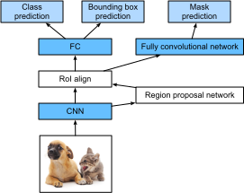

# CNN dựa trên khu vực (R-CNN)
:label:`sec_rcnn`

Bên cạnh việc phát hiện multibox shot đơn được mô tả trong :numref:`sec_ssd`, CNN dựa trên khu vực hoặc các khu vực có tính năng CNN (R-CNN) cũng là một trong nhiều phương pháp tiên phong trong việc áp dụng học sâu vào phát hiện đối tượng :cite:`Girshick.Donahue.Darrell.ea.2014`. Trong phần này, chúng tôi sẽ giới thiệu R-CNN và một loạt các cải tiến của nó: R-CNN :cite:`Girshick.2015` nhanh, R-CNN :cite:`Ren.He.Girshick.ea.2015` nhanh hơn và mặt nạ R-CNN :cite:`He.Gkioxari.Dollar.ea.2017`. Do không gian hạn chế, chúng tôi sẽ chỉ tập trung vào việc thiết kế các mô hình này. 

## R-CNN

*R-CNN* đầu tiên trích xuất nhiều (ví dụ: 2000) * khu vực đề xuất* từ hình ảnh đầu vào (ví dụ, hộp neo cũng có thể được coi là đề xuất khu vực), dán nhãn các lớp và hộp giới hạn của chúng (ví dụ: bù đắp). :cite:`Girshick.Donahue.Darrell.ea.2014` Sau đó, CNN được sử dụng để thực hiện tuyên truyền chuyển tiếp trên mỗi đề xuất khu vực để trích xuất của nó tính năng. Tiếp theo, các tính năng của mỗi đề xuất khu vực được sử dụng để dự đoán lớp và hộp giới hạn của đề xuất khu vực này. 


:label:`fig_r-cnn`

:numref:`fig_r-cnn` cho thấy mô hình R-CNN. Cụ thể hơn, R-CNN bao gồm bốn bước sau: 

1. Thực hiện * tìm kiếm chọn lọc* để trích xuất nhiều đề xuất khu vực chất lượng cao trên hình ảnh đầu vào :cite:`Uijlings.Van-De-Sande.Gevers.ea.2013`. Những vùng đề xuất này thường được chọn ở nhiều thang đo với hình dạng và kích cỡ khác nhau. Mỗi đề xuất khu vực sẽ được dán nhãn với một lớp học và một hộp giới hạn sự thật mặt đất.
1. Chọn một CNN được đào tạo trước và cắt ngắn nó trước lớp đầu ra. Thay đổi kích thước mỗi đề xuất khu vực theo kích thước đầu vào theo yêu cầu của mạng và xuất các tính năng trích xuất cho đề xuất khu vực thông qua tuyên truyền chuyển tiếp. 
1. Lấy các tính năng trích xuất và lớp được dán nhãn của mỗi đề xuất khu vực làm ví dụ. Đào tạo nhiều máy vector hỗ trợ để phân loại các đối tượng, trong đó mỗi máy vector hỗ trợ riêng xác định xem ví dụ có chứa một lớp cụ thể hay không.
1. Lấy các tính năng được trích xuất và hộp giới hạn được dán nhãn của mỗi đề xuất khu vực làm ví dụ. Đào tạo một mô hình hồi quy tuyến tính để dự đoán hộp giới hạn chân thất-chân lý.

Mặc dù mô hình R-CNN sử dụng CNN được đào tạo trước để trích xuất hiệu quả các tính năng hình ảnh, nhưng nó chậm. Hãy tưởng tượng rằng chúng tôi chọn hàng ngàn đề xuất khu vực từ một hình ảnh đầu vào duy nhất: điều này đòi hỏi hàng ngàn tuyên truyền chuyển tiếp CNN để thực hiện phát hiện đối tượng. Tải trọng điện toán lớn này làm cho việc sử dụng rộng rãi R-CNN trong các ứng dụng trong thế giới thực không khả thi. 

## R-CNN nhanh

Nút cổ chai hiệu suất chính của R-CNN nằm ở việc tuyên truyền chuyển tiếp CNN độc lập cho từng đề xuất khu vực, mà không chia sẻ tính toán. Vì những vùng này thường có sự chồng chéo, các trích xuất tính năng độc lập dẫn đến tính toán lặp đi lặp lại nhiều. Một trong những cải tiến lớn của * nhanh R-CNN* từ R-CNN là CNN chuyển tiếp CNN chỉ được thực hiện trên toàn bộ hình ảnh :cite:`Girshick.2015`.  


:label:`fig_fast_r-cnn`

:numref:`fig_fast_r-cnn` mô tả mô hình R-CNN nhanh. Các tính toán chính của nó như sau: 

1. So với R-CNN, trong R-CNN nhanh, đầu vào của CNN để trích xuất tính năng là toàn bộ hình ảnh, chứ không phải là các đề xuất khu vực riêng lẻ. Hơn nữa, CNN này là có thể đào tạo. Với một hình ảnh đầu vào, hãy để hình dạng của đầu ra CNN là $1 \times c \times h_1  \times w_1$.
1. Giả sử rằng tìm kiếm chọn lọc tạo ra $n$ đề xuất khu vực. Các đề xuất khu vực này (có hình dạng khác nhau) đánh dấu các vùng được quan tâm (có hình dạng khác nhau) trên đầu ra CNN. Sau đó, các khu vực quan tâm hơn nữa trích xuất các tính năng của cùng một hình dạng (nói chiều cao $h_2$ và chiều rộng $w_2$ được chỉ định) để dễ dàng nối. Để đạt được điều này, R-CNN nhanh giới thiệu lớp cộp* khu vực quan tâm (ROI): các đề xuất đầu ra và khu vực CNN được nhập vào lớp này, xuất các tính năng nối của hình dạng $n \times c \times h_2 \times w_2$ được trích xuất thêm cho tất cả các đề xuất khu vực.
1. Sử dụng một lớp được kết nối hoàn toàn, biến đổi các tính năng nối thành một đầu ra của hình dạng $n \times d$, trong đó $d$ phụ thuộc vào thiết kế mô hình.
1. Dự đoán lớp học và hộp giới hạn cho mỗi đề xuất khu vực $n$. Cụ thể hơn, trong lớp và dự đoán hộp giới hạn, biến đổi đầu ra lớp được kết nối hoàn toàn thành một đầu ra của hình dạng $n \times q$ ($q$ là số lớp) và một đầu ra của hình dạng $n \times 4$, tương ứng. Dự đoán lớp sử dụng hồi quy softmax.

Khu vực của lớp tổng hợp quan tâm được đề xuất trong R-CNN nhanh khác với lớp tổng hợp được giới thiệu vào năm :numref:`sec_pooling`. Trong layer pooling, chúng ta gián tiếp kiểm soát hình dạng đầu ra bằng cách chỉ định kích thước của cửa sổ pooling, padding, và sải chân. Ngược lại, chúng ta có thể trực tiếp chỉ định hình dạng đầu ra trong khu vực của lớp tổng hợp quan tâm. 

Ví dụ: chúng ta hãy chỉ định chiều cao và chiều rộng đầu ra cho mỗi khu vực là $h_2$ và $w_2$, tương ứng. Đối với bất kỳ khu vực nào của cửa sổ quan tâm của hình dạng $h \times w$, cửa sổ này được chia thành một lưới $h_2 \times w_2$ của subwindows, trong đó hình dạng của mỗi cửa sổ con là khoảng $(h/h_2) \times (w/w_2)$. Trong thực tế, chiều cao và chiều rộng của bất kỳ cửa sổ con nào sẽ được làm tròn và phần tử lớn nhất sẽ được sử dụng làm đầu ra của cửa sổ con. Do đó, khu vực của lớp tổng hợp quan tâm có thể trích xuất các tính năng có cùng hình dạng ngay cả khi các vùng quan tâm có hình dạng khác nhau. 

Như một ví dụ minh họa, trong :numref:`fig_roi`, khu vực quan tâm $3\times 3$ phía trên bên trái được chọn trên một đầu vào $4 \times 4$. Đối với khu vực quan tâm này, chúng tôi sử dụng một $2\times 2$ khu vực của lớp tổng hợp quan tâm để có được một sản lượng $2\times 2$. Lưu ý rằng mỗi trong bốn phân chia chứa các phần tử 0, 1, 4 và 5 (5 là tối đa); 2 và 6 (6 là tối đa); 8 và 9 (9 là tối đa); và 10. 


:label:`fig_roi`

Dưới đây chúng tôi chứng minh tính toán của khu vực của lớp tổng hợp quan tâm. Giả sử rằng chiều cao và chiều rộng của các tính năng trích xuất CNN `X` đều là 4 và chỉ có một kênh duy nhất.

```{.python .input}
from mxnet import np, npx

npx.set_np()

X = np.arange(16).reshape(1, 1, 4, 4)
X
```

```{.python .input}
#@tab pytorch
import torch
import torchvision

X = torch.arange(16.).reshape(1, 1, 4, 4)
X
```

Chúng ta hãy giả sử thêm rằng chiều cao và chiều rộng của hình ảnh đầu vào là cả 40 pixel và tìm kiếm chọn lọc tạo ra hai đề xuất khu vực trên hình ảnh này. Mỗi đề xuất vùng được thể hiện dưới dạng năm yếu tố: lớp đối tượng của nó tiếp theo là tọa độ $(x, y)$ của các góc trên bên trái và dưới bên phải của nó.

```{.python .input}
rois = np.array([[0, 0, 0, 20, 20], [0, 0, 10, 30, 30]])
```

```{.python .input}
#@tab pytorch
rois = torch.Tensor([[0, 0, 0, 20, 20], [0, 0, 10, 30, 30]])
```

Bởi vì chiều cao và chiều rộng của `X` là $1/10$ chiều cao và chiều rộng của hình ảnh đầu vào, các tọa độ của hai đề xuất khu vực được nhân với 0,1 theo đối số `spatial_scale` được chỉ định. Sau đó, hai khu vực quan tâm được đánh dấu trên `X` là `X[:, :, 0:3, 0:3]` và `X[:, :, 1:4, 0:4]`, tương ứng. Cuối cùng trong khu vực $2\times 2$ thu hút sự quan tâm, mỗi khu vực quan tâm được chia thành một mạng lưới các cửa sổ phụ để trích xuất thêm các tính năng có cùng hình dạng $2\times 2$.

```{.python .input}
npx.roi_pooling(X, rois, pooled_size=(2, 2), spatial_scale=0.1)
```

```{.python .input}
#@tab pytorch
torchvision.ops.roi_pool(X, rois, output_size=(2, 2), spatial_scale=0.1)
```

## R-CNN nhanh hơn

Để chính xác hơn trong việc phát hiện đối tượng, mô hình R-CNN nhanh thường phải tạo ra rất nhiều đề xuất khu vực trong tìm kiếm chọn lọc. Để giảm đề xuất khu vực mà không mất độ chính xác, R-CNN* nhanh hơn đề xuất thay thế tìm kiếm chọn lọc bằng mạng đề xuất khu vực*:cite:`Ren.He.Girshick.ea.2015`. 


:label:`fig_faster_r-cnn`

:numref:`fig_faster_r-cnn` cho thấy mô hình R-CNN nhanh hơn. So với R-CNN nhanh, R-CNN nhanh hơn chỉ thay đổi phương pháp đề xuất khu vực từ tìm kiếm chọn lọc sang mạng đề xuất khu vực. Phần còn lại của mô hình vẫn không thay đổi. Mạng đề xuất khu vực hoạt động theo các bước sau: 

1. Sử dụng lớp ghép $3\times 3$ với lớp đệm 1 để chuyển đổi đầu ra CNN sang đầu ra mới với $c$ kênh. Bằng cách này, mỗi đơn vị dọc theo kích thước không gian của các bản đồ tính năng trích xuất CNN được một vector tính năng mới có chiều dài $c$.
1. Tập trung vào từng điểm ảnh của bản đồ tính năng, tạo ra nhiều hộp neo có tỷ lệ và tỷ lệ khung hình khác nhau và dán nhãn chúng.
1. Sử dụng vector tính năng length $c$ ở giữa mỗi hộp neo, dự đoán lớp nhị phân (nền hoặc đối tượng) và hộp giới hạn cho hộp neo này.
1. Hãy xem xét những hộp giới hạn dự đoán có lớp dự đoán là các đối tượng. Loại bỏ kết quả chồng chéo bằng cách sử dụng ức chế không tối đa. Các hộp giới hạn dự đoán còn lại cho các đối tượng là các đề xuất khu vực theo yêu cầu của khu vực của lớp tổng hợp quan tâm.

Điều đáng chú ý là, là một phần của mô hình R-CNN nhanh hơn, mạng lưới đề xuất khu vực được cùng đào tạo với phần còn lại của mô hình. Nói cách khác, hàm khách quan của R-CNN nhanh hơn bao gồm không chỉ dự đoán lớp và hộp giới hạn trong phát hiện đối tượng, mà còn là lớp nhị phân và dự đoán hộp giới hạn của các hộp neo trong mạng đề xuất khu vực. Kết quả của việc đào tạo từ đầu đến cuối, mạng đề xuất khu vực học cách tạo các đề xuất khu vực chất lượng cao, để duy trì chính xác trong việc phát hiện đối tượng với số lượng đề xuất khu vực được học từ dữ liệu giảm. 

## Mặt nạ R-CNN

Trong tập dữ liệu đào tạo, nếu vị trí cấp pixel của đối tượng cũng được dán nhãn trên hình ảnh, *mask R-CNN* có thể tận dụng hiệu quả các nhãn chi tiết như vậy để cải thiện hơn nữa độ chính xác của phát hiện đối tượng :cite:`He.Gkioxari.Dollar.ea.2017`. 


:label:`fig_mask_r-cnn`

Như thể hiện trong :numref:`fig_mask_r-cnn`, mặt nạ R-CNN được sửa đổi dựa trên R-CNN nhanh hơn. Cụ thể, mặt nạ R-CNN thay thế khu vực của lớp tổng hợp quan tâm bằng
*khu vực quan tâm (ROI) sắp xếp* lớp. 
Vùng liên kết mối quan tâm này sử dụng nội suy song tuyến để bảo tồn thông tin không gian trên các bản đồ tính năng, phù hợp hơn cho dự đoán mức pixel. Đầu ra của lớp này chứa các bản đồ tính năng có cùng hình dạng cho tất cả các vùng quan tâm. Chúng được sử dụng để dự đoán không chỉ lớp và hộp giới hạn cho mỗi khu vực quan tâm, mà còn là vị trí cấp pixel của đối tượng thông qua một mạng phức tạp hoàn toàn bổ sung. Thông tin chi tiết về việc sử dụng mạng phức tạp hoàn toàn để dự đoán ngữ nghĩa cấp pixel của một hình ảnh sẽ được cung cấp trong các phần tiếp theo của chương này. 

## Tóm tắt

* R-CNN trích xuất nhiều đề xuất khu vực từ hình ảnh đầu vào, sử dụng CNN để thực hiện tuyên truyền chuyển tiếp trên mỗi đề xuất khu vực để trích xuất các tính năng của nó, sau đó sử dụng các tính năng này để dự đoán lớp và hộp giới hạn của đề xuất khu vực này.
* Một trong những cải tiến lớn của R-CNN nhanh từ R-CNN là việc truyền chuyển tiếp CNN chỉ được thực hiện trên toàn bộ hình ảnh. Nó cũng giới thiệu khu vực của lớp tổng hợp quan tâm, do đó các tính năng của cùng một hình dạng có thể được chiết xuất thêm cho các khu vực quan tâm có hình dạng khác nhau.
* R-CNN nhanh hơn thay thế tìm kiếm chọn lọc được sử dụng trong R-CNN nhanh bằng mạng lưới đề xuất khu vực được đào tạo chung, để cái trước có thể giữ chính xác trong việc phát hiện đối tượng với số lượng đề xuất khu vực giảm.
* Dựa trên R-CNN nhanh hơn, mặt nạ R-CNN cũng giới thiệu một mạng lưới phức tạp hoàn toàn, để tận dụng các nhãn cấp pixel để cải thiện hơn nữa độ chính xác của việc phát hiện đối tượng.

## Bài tập

1. Chúng ta có thể đóng khung phát hiện đối tượng như một vấn đề hồi quy duy nhất, chẳng hạn như dự đoán các hộp giới hạn và xác suất lớp không? Bạn có thể tham khảo thiết kế của mẫu YOLO :cite:`Redmon.Divvala.Girshick.ea.2016`.
1. So sánh phát hiện multibox shot đơn với các phương pháp được giới thiệu trong phần này. Sự khác biệt lớn của họ là gì? Bạn có thể tham khảo Hình 2 của :cite:`Zhao.Zheng.Xu.ea.2019`.

:begin_tab:`mxnet`
[Discussions](https://discuss.d2l.ai/t/374)
:end_tab:

:begin_tab:`pytorch`
[Discussions](https://discuss.d2l.ai/t/1409)
:end_tab:
