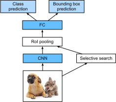
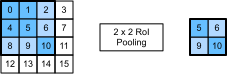
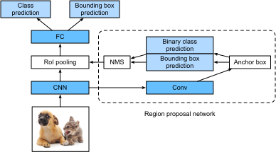

<!--
# Region-based CNNs (R-CNNs)
-->

# CNN theo Vùng (R-CNN)


<!--
Region-based convolutional neural networks or regions with CNN features (R-CNNs) are a pioneering approach that applies deep models to object detection :cite:`Girshick.Donahue.Darrell.ea.2014`.
In this section, we will discuss R-CNNs and a series of improvements made to them: Fast R-CNN :cite:`Girshick.2015`, 
Faster R-CNN :cite:`Ren.He.Girshick.ea.2015`, and Mask R-CNN :cite:`He.Gkioxari.Dollar.ea.2017`.
Due to space limitations, we will confine our discussion to the designs of these models.
-->

Mạng nơ-ron tích chập theo vùng, hay các vùng với đặc trưng CNN (R-CNN) 
là một hướng tiếp cận tiên phong ứng dụng mô hình sâu cho bài toán phát hiện vật thể :cite:`Girshick.Donahue.Darrell.ea.2014`.
Trong phần này, chúng ta sẽ thảo luận về R-CNN và một loạt các cải tiến sau đó: Fast R-CNN :cite:`Girshick.2015`, 
Faster R-CNN :cite:`Ren.He.Girshick.ea.2015`, và Mask R-CNN :cite:`He.Gkioxari.Dollar.ea.2017`.


<!--
## R-CNNs
-->

## R-CNN


<!--
R-CNN models first select several proposed regions from an image (for example, anchor boxes are one type of selection method) and then label their categories and bounding boxes (e.g., offsets).
Then, they use a CNN to perform forward computation to extract features from each proposed area.
Afterwards, we use the features of each proposed region to predict their categories and bounding boxes.
:numref:`fig_r-cnn` shows an R-CNN model.
-->

Đầu tiên, các mô hình R-CNN sẽ chọn một số vùng đề xuất từ ảnh (ví dụ, các khung neo cũng là một phương pháp lựa chọn) 
và sau đó gán nhãn hạng mục và khung chứa (ví dụ, các giá trị độ dời) cho các vùng này.
Tiếp đến, các mô hình này sử dụng CNN để thực hiện lượt truyền xuôi nhằm trích xuất đặc trưng từ từng vùng đề xuất.
Sau đó, ta sử dụng các đặc trưng của từng vùng được đề xuất để dự đoán hạng mục và khung chứa.
:numref:`fig_r-cnn` mô tả một mô hình R-CNN.


<!--

-->


:label:`fig_r-cnn`


<!--
Specifically, R-CNNs are composed of four main parts:
-->

Cụ thể, R-CNN có bốn phần chính sau:


<!--
1. Selective search is performed on the input image to select multiple high-quality proposed regions :cite:`Uijlings.Van-De-Sande.Gevers.ea.2013`.
These proposed regions are generally selected on multiple scales and have different shapes and sizes.
The category and ground-truth bounding box of each proposed region is labeled.
2. A pre-trained CNN is selected and placed, in truncated form, before the output layer.
It transforms each proposed region into the input dimensions required by the network and uses forward computation to output the features extracted from the proposed regions.
3. The features and labeled category of each proposed region are combined as an example to train multiple support vector machines for object classification.
Here, each support vector machine is used to determine whether an example belongs to a certain category.
4. The features and labeled bounding box of each proposed region are combined as an example to train a linear regression model for ground-truth bounding box prediction.
-->

1. Tìm kiếm chọn lọc trên ảnh đầu vào để lựa chọn các vùng đề xuất tiềm năng :cite:`Uijlings.Van-De-Sande.Gevers.ea.2013`.
Các vùng đề xuất thông thường sẽ có nhiều tỷ lệ với hình dạng và kích thước khác nhau.
Hạng mục và khung chứa nhãn gốc sẽ được gán cho từng vùng đề xuất.
2. Sử dụng một mạng CNN đã qua tiền huấn luyện, ở dạng rút gọn, đặt trước tầng đầu ra.
Mạng này biến đổi từng vùng đề xuất thành các đầu vào có chiều phù hợp với mạng và thực hiện các lượt truyền xuôi để trích xuất đặc trưng từ các vùng đề xuất tương ứng.
1. Các đặc trưng và nhãn hạng mục của từng vùng đề xuất được kết hợp thành một mẫu để huấn luyện các máy vector hỗ trợ cho phép phân loại vật thể.
Ở đây, mỗi máy vector hỗ trợ được sử dụng để xác định một mẫu có thuộc về một hạng mục nào đó hay không.
4. Các đặc trưng và khung chứa được gán nhãn của mỗi vùng đề xuất được kết hợp thành một mẫu để huấn luyện mô hình hồi quy tuyến tính, để phục vụ dự đoán khung chứa nhãn gốc. 

<!--
Although R-CNN models use pre-trained CNNs to effectively extract image features, the main downside is the slow speed.
As you can imagine, we can select thousands of proposed regions from a single image, requiring thousands of forward computations from the CNN to perform object detection.
This massive computing load means that R-CNNs are not widely used in actual applications.
-->

Mặc dù các mô hình R-CNN sử dụng các mạng CNN đã được tiền huấn luyện để trích xuất các đặc trưng ảnh một cách hiệu quả, điểm hạn chế chính yếu đó là tốc độ chậm.
Có thể hình dung, với hàng ngàn vùng đề xuất từ một ảnh, ta cần tới hàng ngàn phép tính truyền xuôi từ mạng CNN để phát hiện vật thể. 
Khối lượng tính toán nặng nề khiến các mô hình R-CNN không được sử dụng rộng rãi trong các ứng dụng thực tế.


<!--
## Fast R-CNN
-->

## Fast R-CNN


<!--
The main performance bottleneck of an R-CNN model is the need to independently extract features for each proposed region.
As these regions have a high degree of overlap, independent feature extraction results in a high volume of repetitive computations.
Fast R-CNN improves on the R-CNN by only performing CNN forward computation on the image as a whole.
-->

Điểm nghẽn cổ chai chính về hiệu năng của R-CNN đó là việc trích xuất đặc trưng cho từng vùng đề xuất một cách độc lập.
Do các vùng đề xuất này có độ chồng lặp cao, việc trích xuất đặc trưng một cách độc lập sẽ dẫn đến một số lượng lớn các phép tính lặp lại.
Fast R-CNN cải thiện R-CNN bằng cách chỉ thực hiện lượt truyền xuôi qua mạng CNN trên toàn bộ ảnh.


<!--

-->


:label:`fig_fast_r-cnn`


<!--
:numref:`fig_fast_r-cnn` shows a Fast R-CNN model.
It is primary computation steps are described below:
-->

:numref:`fig_fast_r-cnn` mô tả mạng Fast R-CNN.
Các bước tính toán chính yếu được mô tả như sau:


<!--
1. Compared to an R-CNN model, a Fast R-CNN model uses the entire image as the CNN input for feature extraction, rather than each proposed region.
Moreover, this network is generally trained to update the model parameters.
As the input is an entire image, the CNN output shape is $1 \times c \times h_1 \times w_1$.
2. Assuming selective search generates $n$ proposed regions, their different shapes indicate regions of interests (RoIs) of different shapes on the CNN output.
Features of the same shapes must be extracted from these RoIs (here we assume that the height is $h_2$ and the width is $w_2$).
Fast R-CNN introduces RoI pooling, which uses the CNN output and RoIs as input to output a concatenation 
of the features extracted from each proposed region with the shape $n \times c \times h_2 \times w_2$.
3. A fully connected layer is used to transform the output shape to $n \times d$, where $d$ is determined by the model design.
4. During category prediction, the shape of the fully connected layer output is again transformed to $n \times q$ and we use softmax regression ($q$ is the number of categories).
During bounding box prediction, the shape of the fully connected layer output is again transformed to $n \times 4$.
This means that we predict the category and bounding box for each proposed region.
-->

1. So với mạng R-CNN, mạng Fast R-CNN sử dụng toàn bộ ảnh làm đầu vào cho CNN để trích xuất đặc trưng thay vì từng vùng đề xuất.
Hơn nữa, mạng này được huấn luyện như bình thường để cập nhật tham số mô hình.
Do đầu vào là toàn bộ ảnh, đầu ra của mạng CNN có kích thước $1 \times c \times h_1 \times w_1$.
2. Giả sử thuật toán tìm kiếm chọn lọc chọn ra $n$ vùng đề xuất, kích thước khác nhau của các vùng này chỉ ra rằng vùng quan tâm (*regions of interests - RoI*) tại đầu ra của CNN có kích thước khác nhau.
Các đặc trưng có cùng kích thước phải được trích xuất từ các vùng quan tâm này (giả sử có chiều cao là $h_2$ và chiều rộng là $w_2$).
Mạng Fast R-CNN đề xuất phép gộp RoI (*RoI pooling*), nhận đầu ra từ CNN và các vùng quan tâm làm đầu vào rồi ghép nối các đặc trưng được trích xuất từ mỗi vùng quan tâm làm đầu ra có kích thước $n \times c \times h_2 \times w_2$.
3. Tầng kết nối đầy đủ được sử dụng để biến đổi kích thước đầu ra thành $n \times d$, trong đó $d$ được xác định khi thiết kế mô hình.
4. Khi dự đoán hạng mục, kích thước đầu ra của tầng kết nối đầy đủ lại được biến đổi thành $n \times q$ và áp dụng phép hồi quy softmax ($q$ là số lượng hạng mục).
Khi dự đoán khung chứa, kích thước đầu ra của tầng đầy đủ lại được biến đổi thành $n \times 4$.
Nghĩa là ta dự đoán hạng mục và khung chứa cho từng vùng đề xuất.


<!--
The RoI pooling layer in Fast R-CNN is somewhat different from the pooling layers we have discussed before.
In a normal pooling layer, we set the pooling window, padding, and stride to control the output shape.
In an RoI pooling layer, we can directly specify the output shape of each region, such as specifying the height and width of each region as $h_2, w_2$.
Assuming that the height and width of the RoI window are $h$ and $w$, this window is divided into a grid of sub-windows with the shape $h_2 \times w_2$.
The size of each sub-window is about $(h/h_2) \times (w/w_2)$.
The sub-window height and width must always be integers and the largest element is used as the output for a given sub-window.
This allows the RoI pooling layer to extract features of the same shape from RoIs of different shapes.
-->

Tầng gộp RoI trong mạng Fast R-CNN có phần khác với các tầng gộp mà ta đã thảo luận trước đó.
Trong tầng gộp thông thường, ta thiết lập cửa sổ gộp, giá trị đệm, và sải bước để quyết định kích thước đầu ra.
Trong tầng gộp RoI, ta có thể trực tiếp định rõ kích thước đầu ra của từng vùng, ví dụ chiều cao và chiều rộng của từng vùng sẽ là $h_2, w_2$.
Giả sử chiều cao và chiều rộng của cửa sổ RoI là $h$ và $w$, cửa sổ này được chia thành một lưới có $h_2 \times w_2$ cửa sổ con.
Mỗi cửa sổ con có kích thước xấp xỉ $(h/h_2) \times (w/w_2)$.
Chiều cao và chiều rộng của cửa sổ con phải luôn là số nguyên và thành phần lớn nhất được sử dụng là đầu ra cho cửa sổ con đó.
Điều này cho phép tầng gộp RoI trích xuất đặc trưng có cùng kích thước từ các vùng quan tâm có kích thước khác nhau.


<!--
In :numref:`fig_roi`, we select an $3\times 3$ region as an RoI of the $4 \times 4$ input.
For this RoI, we use a $2\times 2$ RoI pooling layer to obtain a single $2\times 2$ output.
When we divide the region into four sub-windows, they respectively contain the elements 0, 1, 4, and 5 (5 is the largest); 2 and 6 (6 is the largest); 8 and 9 (9 is the largest); and 10.
-->

Trong :numref:`fig_roi`, ta chọn một vùng $3\times 3$ làm RoI của một đầu vào $4 \times 4$.
Với RoI này, ta sử dụng một tầng gộp RoI $2\times 2$ để thu được một đầu ra đơn $2\times 2$.
Khi chia vùng này thành bốn cửa sổ con, chúng lần lượt chứa các phần tử 0, 1, 4 và 5 (5 là lớn nhất); 2 và 6 (6 là lớn nhất); 8 và 9 (9 là lớn nhất); và 10.

<!--

-->


:label:`fig_roi`


<!--
We use the `ROIPooling` function to demonstrate the RoI pooling layer computation.
Assume that the CNN extracts the feature `X` with both a height and width of 4 and only a single channel.
-->

Ta sử dụng hàm `ROIPooling` để thực hiện việc tính toán tầng gộp RoI.
Giả sử rằng CNN trích xuất đặc trưng `X` với chiều rộng và chiều cao là 4 với một kênh duy nhất.


```{.python .input  n=4}
from mxnet import np, npx

npx.set_np()

X = np.arange(16).reshape(1, 1, 4, 4)
X
```


<!--
Assume that the height and width of the image are both 40 pixels and that selective search generates two proposed regions on the image.
Each region is expressed as five elements: the region's object category and the $x, y$ coordinates of its upper-left and bottom-right corners.
-->

Giả sử chiều cao và chiều rộng của ảnh là 40 pixel và tìm kiếm chọn lọc sinh ra hai vùng đề xuất trên ảnh này.
Mỗi vùng được biểu diễn bằng 5 phần tử: hạng mục của đối tượng trong vùng đó và các tọa độ $x, y$ của góc trên bên trái và góc dưới bên phải.


```{.python .input  n=5}
rois = np.array([[0, 0, 0, 20, 20], [0, 0, 10, 30, 30]])
```


<!--
Because the height and width of `X` are $1/10$ of the height and width of the image, the coordinates of the two proposed regions are multiplied by 0.1 according to the `spatial_scale`, 
and then the RoIs are labeled on `X` as `X[:, :, 0:3, 0:3]` and `X[:, :, 1:4, 0:4]`, respectively. 
Finally, we divide the two RoIs into a sub-window grid and extract features with a height and width of 2.
-->

Vì chiều cao và chiều rộng của `X` bằng $1/10$ chiều cao và chiều rộng của ảnh, các tọa độ của hai vùng được đề xuất sẽ nhân với 0.1 thông qua `spatial_scale`,
tiếp theo các RoI được gán nhãn trên `X` lần lượt là `X[:, :, 0:3, 0:3]` và `X[:, :, 1:4, 0:4]`.
Sau cùng, ta chia hai RoI thành một lưới cửa sổ con và trích xuất đặc trưng với chiều cao và chiều rộng là 2.


```{.python .input  n=6}
npx.roi_pooling(X, rois, pooled_size=(2, 2), spatial_scale=0.1)
```


<!--
## Faster R-CNN
-->

## Faster R-CNN


<!--
In order to obtain precise object detection results, Fast R-CNN generally requires that many proposed regions be generated in selective search.
Faster R-CNN replaces selective search with a region proposal network. This reduces the number of proposed regions generated, while ensuring precise object detection.
-->

Để có kết quả phát hiện đối tượng chính xác, Fast R-CNN thường đòi hỏi tạo ra nhiều vùng đề xuất khi tìm kiếm chọn lọc.
Faster R-CNN thay thế tìm kiếm chọn lọc bằng mạng đề xuất vùng. Mạng này làm giảm số vùng đề xuất, trong khi vẫn đảm bảo phát hiện chính xác đối tượng.


<!--

-->


:label:`fig_faster_r-cnn`


<!--
:numref:`fig_faster_r-cnn` shows a Faster R-CNN model.
Compared to Fast R-CNN, Faster R-CNN only changes the method for generating proposed regions from selective search to region proposal network.
The other parts of the model remain unchanged.
The detailed region proposal network computation process is described below:
-->

:numref:`fig_faster_r-cnn` minh họa mô hình Faster R-CNN.
So với Fast R-CNN, Faster R-CNN chỉ thay thế phương pháp sản sinh các vùng đề xuất từ tìm kiếm chọn lọc sang mạng đề xuất vùng.
Những phần còn lại trong mô hình không đổi.
Quy trình tính toán của mạng đề xuất vùng được mô tả chi tiết dưới đây:


<!--
1. We use a $3\times 3$ convolutional layer with a padding of 1 to transform the CNN output and set the number of output channels to $c$.
This way, each element in the feature map the CNN extracts from the image is a new feature with a length of $c$.
2. We use each element in the feature map as a center to generate multiple anchor boxes of different sizes and aspect ratios and then label them.
3. We use the features of the elements of length $c$ at the center on the anchor boxes to predict the binary category (object or background) and bounding box for their respective anchor boxes.
4. Then, we use non-maximum suppression to remove similar bounding box results that correspond to category predictions of "object".
Finally, we output the predicted bounding boxes as the proposed regions required by the RoI pooling layer.
-->

1. Dùng một tầng tích chập $3\times 3$ với đệm bằng 1 để biến đổi đầu ra của CNN và đặt số kênh đầu ra bằng $c$.
Bằng cách này, mỗi phần tử trong ánh xạ đặc trưng mà CNN trích xuất ra từ bức ảnh là một đặc trưng mới có độ dài bằng $c$.
2. Lấy mỗi phần tử trong ánh xạ đặc trưng làm tâm để tạo ra nhiều khung neo có kích thước và tỷ lệ khác nhau, sau đó gán nhãn cho chúng.
3. Lấy những đặc trưng của các phần tử có độ dài $c$ ở tâm khung neo để phân loại nhị phân (là vật thể hay là nền) và dự đoán khung chứa tương ứng cho các khung neo.
4. Sau đó, sử dụng triệt phi cực đại (*non-maximum suppression*) để loại bỏ các khung chứa có kết quả giống nhau của hạng mục "vật thể".
Cuối cùng, ta xuất ra các khung chứa dự đoán là các vùng đề xuất rồi đưa vào tầng gộp RoI.


<!--
It is worth noting that, as a part of the Faster R-CNN model, the region proposal network is trained together with the rest of the model.
In addition, the Faster R-CNN object functions include the category and bounding box predictions in object detection, 
as well as the binary category and bounding box predictions for the anchor boxes in the region proposal network.
Finally, the region proposal network can learn how to generate high-quality proposed regions, which reduces the number of proposed regions while maintaining the precision of object detection.
-->

Lưu ý rằng, vì là một phần của mô hình Faster R-CNN, nên mạng đề xuất vùng được huấn luyện cùng với phần còn lại trong mô hình.
Ngoài ra, trong đối tượng Faster R-CNN còn chứa các hàm dự đoán hạng mục và khung chứa trong bài toán phát hiện vật thể,
cũng như các hàm dự đoán hạng mục nhị phân và khung chứa cho các khung neo trong mạng đề xuất vùng.
Sau cùng, mạng đề xuất vùng có thể học được cách sinh ra những vùng đề xuất có chất lượng cao, giảm đi số lượng vùng đề xuất trong khi vẫn giữ được độ chính xác khi phát hiện vật thể.


<!--
## Mask R-CNN
-->

## Mask R-CNN


<!--
If training data is labeled with the pixel-level positions of each object in an image, 
a Mask R-CNN model can effectively use these detailed labels to further improve the precision of object detection.
-->

Nếu dữ liệu huấn luyện được gán nhãn với các vị trí ở cấp độ từng điểm ảnh trong bức hình, 
thì mô hình Mask R-CNN có thể sử dụng hiệu quả các nhãn chi tiết này để cải thiện độ chính xác của việc phát hiện đối tượng.


<!--

-->


:label:`fig_mask_r-cnn`


<!--
As shown in :numref:`fig_mask_r-cnn`, Mask R-CNN is a modification to the Faster R-CNN model.
Mask R-CNN models replace the RoI pooling layer with an RoI alignment layer.
This allows the use of bilinear interpolation to retain spatial information on feature maps, making Mask R-CNN better suited for pixel-level predictions.
The RoI alignment layer outputs feature maps of the same shape for all RoIs.
This not only predicts the categories and bounding boxes of RoIs, but allows us to use an additional fully convolutional network to predict the pixel-level positions of objects.
We will describe how to use fully convolutional networks to predict pixel-level semantics in images later in this chapter.
-->

Trong :numref:`fig_mask_r-cnn`, có thể thấy Mask R-CNN là một sự hiệu chỉnh của Faster R-CNN.
Mask R-CNN thay thế tầng tổng hợp RoI bằng tầng căn chỉnh RoI (*RoI alignment layer*).
Điều này cho phép sử dụng phép nội suy song tuyến tính (*bilinear interpolation*) để giữ lại thông tin không gian trong ánh xạ đặc trưng, làm cho Mask R-CNN trở nên phù hợp hơn với các dự đoán cấp điểm ảnh.
Lớp căn chỉnh RoI xuất ra các ánh xạ đặc trưng có cùng kích thước cho mọi RoI.
Điều này không những dự đoán các lớp và khung chứa của RoI, mà còn cho phép chúng ta bổ sung một mạng nơ-ron tích chập đầy đủ (*fully convolutional network*) để dự đoán vị trí cấp điểm ảnh của các đối tượng.
Chúng tôi sẽ mô tả cách sử dụng mạng nơ-ron tích chập đầy đủ để dự đoán ngữ nghĩa cấp điểm ảnh ở phần sau của chương này. 


## Tóm tắt


<!--
* An R-CNN model selects several proposed regions and uses a CNN to perform forward computation and extract the features from each proposed region.
It then uses these features to predict the categories and bounding boxes of proposed regions.
* Fast R-CNN improves on the R-CNN by only performing CNN forward computation on the image as a whole.
It introduces an RoI pooling layer to extract features of the same shape from RoIs of different shapes.
* Faster R-CNN replaces the selective search used in Fast R-CNN with a region proposal network.
This reduces the number of proposed regions generated, while ensuring precise object detection.
* Mask R-CNN uses the same basic structure as Faster R-CNN, but adds a fully convolution layer to help locate objects at the pixel level and further improve the precision of object detection.
-->

* Mô hình R-CNN chọn ra nhiều vùng đề xuất và sử dụng CNN để thực hiện tính toán truyền xuôi rồi trích xuất đặc trưng từ mỗi vùng đề xuất.
Sau đó dùng các đặc trưng này để dự đoán hạng mục và khung chứa của những vùng đề xuất.
* Fast R-CNN cải thiện R-CNN bằng cách chỉ thực hiện tính toán truyền xuôi CNN trên toàn bộ bức ảnh.
Mạng này sử dụng một tầng gộp RoI để trích xuất các đặc trưng có cùng kích thước từ các vùng quan tâm có kích thước khác nhau.
* Faster R-CNN thay thế tìm kiếm chọn lọc trong Fast R-CNN bằng mạng đề xuất vùng.
Điều này làm giảm số lượng vùng đề xuất tạo ra, nhưng vẫn đảm bảo độ chính xác khi phát hiện đối tượng.
* Mask R-CNN có cấu trúc cơ bản giống Faster R-CNN, nhưng có thêm một mạng nơ-ron tích chập đầy đủ giúp định vị đối tượng ở cấp điểm ảnh và cải thiện hơn nữa độ chính xác của việc phát hiện đối tượng.


## Bài tập


<!--
Study the implementation of each model in the [GluonCV toolkit](https://github.com/dmlc/gluon-cv/) related to this section.
-->

Tìm hiểu cách thực thi từng mô hình trong [bộ công cụ GluonCV](https://github.com/dmlc/gluon-cv/) liên quan đến phần này.


## Thảo luận
* [Tiếng Anh](https://discuss.d2l.ai/t/374)
* [Tiếng Việt](https://forum.machinelearningcoban.com/c/d2l)


## Những người thực hiện
Bản dịch trong trang này được thực hiện bởi:

* Đoàn Võ Duy Thanh
* Nguyễn Văn Quang
* Lê Khắc Hồng Phúc
* Nguyễn Mai Hoàng Long
* Phạm Đăng Khoa
* Nguyễn Lê Quang Nhật
* Phạm Hồng Vinh
* Nguyễn Văn Cường
