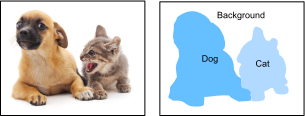

<!--
# Semantic Segmentation and the Dataset
-->

# Phân vùng theo Ngữ nghĩa và Tập dữ liệu
:label:`sec_semantic_segmentation`


<!--
In our discussion of object detection issues in the previous sections, we only used rectangular bounding boxes to label and predict objects in images.
In this section, we will look at semantic segmentation, which attempts to segment images into regions with different semantic categories.
These semantic regions label and predict objects at the pixel level.
:numref:`fig_segmentation` shows a semantically-segmented image, with areas labeled "dog", "cat", and "background".
As you can see, compared to object detection, semantic segmentation labels areas with pixel-level borders, for significantly greater precision.
-->

Khi thảo luận ở những phần trước về các vấn đề liên quan tới phát hiện vật thể, chúng ta chỉ sử dụng các khung chứa chữ nhật để gán nhãn và dự đoán các vật thể trong ảnh.
Trong phần này, ta sẽ xem xét việc phân vùng theo ngữ nghĩa (*semantic segmentation*), tức là phân chia ảnh thành các vùng với hạng mục ngữ nghĩa khác nhau.
Các vùng ngữ nghĩa đó gán nhãn và dự đoán các đối tượng ở mức độ điểm ảnh.
:numref:`fig_segmentation` minh họa một ảnh đã được phân vùng ngữ nghĩa, với các vùng được gán nhãn "chó", "mèo" và "nền".
Như bạn có thể thấy, so với việc phát hiện vật thể, việc phân vùng theo ngữ nghĩa sẽ gán nhãn các vùng theo đường biên ở mức điểm ảnh, đem lại độ chính xác lớn hơn đáng kể.

<!--

-->


:label:`fig_segmentation`


<!--
## Image Segmentation and Instance Segmentation
-->

## Phân vùng Ảnh và Phân vùng Thực thể


<!--
In the computer vision field, there are two important methods related to semantic segmentation: image segmentation and instance segmentation.
Here, we will distinguish these concepts from semantic segmentation as follows:
-->

Trong lĩnh vực thị giác máy tính, có hai phương pháp quan trọng liên quan tới phân vùng theo ngữ nghĩa, đó là: phân vùng ảnh và phân vùng thực thể.
Ta phân biệt các khái niệm này với phân vùng theo ngữ nghĩa như sau:


<!--
* Image segmentation divides an image into several constituent regions.
This method generally uses the correlations between pixels in an image.
During training, labels are not needed for image pixels.
However, during prediction, this method cannot ensure that the segmented regions have the semantics we want.
If we input the image in 9.10, image segmentation might divide the dog into two regions, 
one covering the dog's mouth and eyes where black is the prominent color and the other covering the rest of the dog where yellow is the prominent color.
* Instance segmentation is also called simultaneous detection and segmentation.
This method attempts to identify the pixel-level regions of each object instance in an image.
In contrast to semantic segmentation, instance segmentation not only distinguishes semantics, but also different object instances.
If an image contains two dogs, instance segmentation will distinguish which pixels belong to which dog.
-->

* Phân vùng ảnh (*Image segmentation*) chia một bức ảnh thành các vùng thành phần.
Phương pháp này thường sử dụng độ tương quan giữa các điểm ảnh trên ảnh.
Trong suốt quá trình huấn luyện, nhãn cho các điểm ảnh là không cần thiết.
Tuy nhiên, trong quá trình dự đoán, phương pháp này có thể không đảm bảo các vùng được phân chia chứa ngữ nghĩa mà ta mong muốn.
Nếu ta đưa vào bức ảnh trong :numref:`fig_segmentation`, phân vùng ảnh có thể chia con chó thành hai vùng,
một vùng bao phủ phần miệng và cặp mắt nơi màu đen là chủ đạo và vùng thứ hai phủ trên phần còn lại của chú chó nơi màu vàng chiếm ưu thế.
* Phân vùng thực thể (*Instance segmentation*) còn được gọi là phát hiện và phân vùng đồng thời.
Phương pháp này cố gắng xác định các vùng ở mức điểm ảnh theo từng đối tượng riêng biệt ngay trong ảnh.
Khác với phân vùng theo ngữ nghĩa, phân vùng thực thể không chỉ phân biệt ngữ nghĩa mà còn cả các thực thể khác nhau.
Nếu một ảnh có chứa hai chú chó, phân vùng thực thể sẽ phân biệt những điểm ảnh thuộc về từng chú chó. 


<!--
## The Pascal VOC2012 Semantic Segmentation Dataset
-->

## Tập dữ liệu Phân vùng theo Ngữ nghĩa Pascal VOC2012


<!--
In the semantic segmentation field, one important dataset is [Pascal VOC2012](http://host.robots.ox.ac.uk/pascal/VOC/voc2012/).
To better understand this dataset, we must first import the package or module needed for the experiment.
-->

Trong phân vùng theo ngữ nghĩa, [Pascal VOC2012](http://host.robots.ox.ac.uk/pascal/VOC/voc2012/) là một tập dữ liệu quan trọng.
Để hiểu rõ hơn về tập dữ liệu này, đầu tiên ta nhập vào gói thư viện hoặc mô-đun cần thiết.


```{.python .input  n=1}
%matplotlib inline
from d2l import mxnet as d2l
from mxnet import gluon, image, np, npx
import os

npx.set_np()
```


<!--
The original site might be unstable, so we download the data from a mirror site.
The archive is about 2 GB, so it will take some time to download.
After you decompress the archive, the dataset is located in the `../data/VOCdevkit/VOC2012` path.
-->

Trang gốc có thể không ổn định nên ta tải dữ liệu về từ một trang nhân bản.
Tập tin nặng khoảng 2 GB nên thời gian tải về có thể sẽ hơi lâu.
Sau khi giải nén tập tin, tập dữ liệu được lưu tại đường dẫn `../data/VOCdevkit/VOC2012`.


```{.python .input  n=2}
#@save
d2l.DATA_HUB['voc2012'] = (d2l.DATA_URL + 'VOCtrainval_11-May-2012.tar',
                           '4e443f8a2eca6b1dac8a6c57641b67dd40621a49')

voc_dir = d2l.download_extract('voc2012', 'VOCdevkit/VOC2012')
```


<!--
Go to `../data/VOCdevkit/VOC2012` to see the different parts of the dataset.
The `ImageSets/Segmentation` path contains text files that specify the training and testing examples.
The `JPEGImages` and `SegmentationClass` paths contain the example input images and labels, respectively.
These labels are also in image format, with the same dimensions as the input images to which they correspond.
In the labels, pixels with the same color belong to the same semantic category.
The `read_voc_images` function defined below reads all input images and labels to the memory.
-->

Đi tới thư mục `../data/VOCdevkit/VOC2012` để quan sát các phần khác nhau của tập dữ liệu.
Thư mục `ImageSets/Segmentation` chứa các tệp văn bản định rõ ví dụ để huấn luyện và kiểm tra.
Thư mục `JPEGImages` và `SegmentationClass` lần lượt chứa các mẫu ảnh đầu vào và nhãn.
Các nhãn này cũng mang định dạng ảnh, với số chiều bằng với ảnh đầu vào tương ứng.
Trong các nhãn, các điểm ảnh cùng màu thì thuộc cùng hạng mục ngữ nghĩa.
Hàm `read_voc_images` định nghĩa dưới đây đọc và lưu vào bộ nhớ tất cả các ảnh đầu vào và nhãn tương ứng.


```{.python .input  n=3}
#@save
def read_voc_images(voc_dir, is_train=True):
    """Read all VOC feature and label images."""
    txt_fname = os.path.join(voc_dir, 'ImageSets', 'Segmentation',
                             'train.txt' if is_train else 'val.txt')
    with open(txt_fname, 'r') as f:
        images = f.read().split()
    features, labels = [], []
    for i, fname in enumerate(images):
        features.append(image.imread(os.path.join(
            voc_dir, 'JPEGImages', f'{fname}.jpg')))
        labels.append(image.imread(os.path.join(
            voc_dir, 'SegmentationClass', f'{fname}.png')))
    return features, labels

train_features, train_labels = read_voc_images(voc_dir, True)
```


<!--
We draw the first five input images and their labels.
In the label images, white represents borders and black represents the background.
Other colors correspond to different categories.
-->

Ta vẽ năm ảnh đầu vào đầu tiên và nhãn của chúng.
Trong ảnh nhãn, màu trắng biểu diễn viền và màu đen biểu diễn nền.
Các màu khác tương ứng với các hạng mục khác nhau.


```{.python .input  n=4}
n = 5
imgs = train_features[0:n] + train_labels[0:n]
d2l.show_images(imgs, 2, n);
```


<!--
Next, we list each RGB color value in the labels and the categories they label.
-->

Tiếp theo, ta liệt kê từng giá trị màu RGB của các nhãn và hạng mục của nhãn đó.


```{.python .input  n=5}
#@save
VOC_COLORMAP = [[0, 0, 0], [128, 0, 0], [0, 128, 0], [128, 128, 0],
                [0, 0, 128], [128, 0, 128], [0, 128, 128], [128, 128, 128],
                [64, 0, 0], [192, 0, 0], [64, 128, 0], [192, 128, 0],
                [64, 0, 128], [192, 0, 128], [64, 128, 128], [192, 128, 128],
                [0, 64, 0], [128, 64, 0], [0, 192, 0], [128, 192, 0],
                [0, 64, 128]]

#@save
VOC_CLASSES = ['background', 'aeroplane', 'bicycle', 'bird', 'boat',
               'bottle', 'bus', 'car', 'cat', 'chair', 'cow',
               'diningtable', 'dog', 'horse', 'motorbike', 'person',
               'potted plant', 'sheep', 'sofa', 'train', 'tv/monitor']
```


<!--
After defining the two constants above, we can easily find the category index for each pixel in the labels.
-->

Sau khi khai báo hai hằng số trên, ta có thể dễ dàng tìm chỉ số hạng mục cho mỗi điểm ảnh trong các nhãn.


```{.python .input  n=6}
#@save
def build_colormap2label():
    """Build an RGB color to label mapping for segmentation."""
    colormap2label = np.zeros(256 ** 3)
    for i, colormap in enumerate(VOC_COLORMAP):
        colormap2label[(colormap[0]*256 + colormap[1])*256 + colormap[2]] = i
    return colormap2label

#@save
def voc_label_indices(colormap, colormap2label):
    """Map an RGB color to a label."""
    colormap = colormap.astype(np.int32)
    idx = ((colormap[:, :, 0] * 256 + colormap[:, :, 1]) * 256
           + colormap[:, :, 2])
    return colormap2label[idx]
```

<!--
For example, in the first example image, the category index for the front part of the airplane is 1 and the index for the background is 0.
-->

Ví dụ, trong ảnh ví dụ đầu tiên, phần đầu máy bay có chỉ số hạng mục là một và chỉ số của nền là 0.


```{.python .input  n=7}
y = voc_label_indices(train_labels[0], build_colormap2label())
y[105:115, 130:140], VOC_CLASSES[1]
```


<!--
### Data Preprocessing
-->

### Tiền xử lý Dữ liệu


<!--
In the preceding chapters, we scaled images to make them fit the input shape of the model.
In semantic segmentation, this method would require us to re-map the predicted pixel categories back to the original-size input image.
It would be very difficult to do this precisely, especially in segmented regions with different semantics.
To avoid this problem, we crop the images to set dimensions and do not scale them.
Specifically, we use the random cropping method used in image augmentation to crop the same region from input images and their labels.
-->

Trong chương trước, ta biến đổi tỷ lệ của ảnh để khớp với kích thước đầu vào của mô hình.
Với phương pháp phân vùng theo ngữ nghĩa, ta phải tái ánh xạ hạng mục được dự đoán của điểm ảnh về kích thước gốc của ảnh đầu vào.
Sẽ rất khó để thực hiện việc này một cách chính xác, nhất là ở các phân vùng mang ngữ nghĩa khác nhau.
Để tránh vấn đề này, ta cắt ảnh để chỉnh kích thước chứ không biến đổi tỷ lệ ảnh.
Cụ thể, ta sử dụng phương pháp cắt ngẫu nhiên được sử dụng trong kỹ thuật tăng cường ảnh để cắt cùng một vùng từ cả ảnh đầu vào và nhãn của nó.


```{.python .input  n=8}
#@save
def voc_rand_crop(feature, label, height, width):
    """Randomly crop for both feature and label images."""
    feature, rect = image.random_crop(feature, (width, height))
    label = image.fixed_crop(label, *rect)
    return feature, label

imgs = []
for _ in range(n):
    imgs += voc_rand_crop(train_features[0], train_labels[0], 200, 300)
d2l.show_images(imgs[::2] + imgs[1::2], 2, n);
```


<!--
### Dataset Classes for Custom Semantic Segmentation
-->

### Các lớp của Tập dữ liệu cho Phân vùng theo Ngữ nghĩa Tuỳ chỉnh


<!--
We use the inherited `Dataset` class provided by Gluon to customize the semantic segmentation dataset class `VOCSegDataset`.
By implementing the `__getitem__` function, we can arbitrarily access the input image with the index `idx` and the category indexes for each of its pixels from the dataset.
As some images in the dataset may be smaller than the output dimensions specified for random cropping, we must remove these example by using a custom `filter` function.
In addition, we define the `normalize_image` function to normalize each of the three RGB channels of the input images.
-->

Ta kế thừa lớp `Dataset` cung cấp bởi Gluon để tuỳ chỉnh tập dữ liệu phân vùng theo ngữ nghĩa `VOCSegDataset`.
Bằng việc lập trình hàm `__getitem__`, ta có thể tuỳ ý truy cập từ tập dữ liệu ảnh đầu vào với chỉ số `idx` và các chỉ số hạng mục của từng điểm ảnh trong ảnh đó.
Do một số ảnh trong tập dữ liệu có thể nhỏ hơn chiều đầu ra mong muốn trong phép cắt ngẫu nhiên, ta cần loại bỏ các ví dụ đó bằng hàm `filter`.
Thêm vào đó, ta định nghĩa hàm `normalize_image` để chuẩn hoá từng kênh RGB của các ảnh đầu vào.


```{.python .input  n=9}
#@save
class VOCSegDataset(gluon.data.Dataset):
    """A customized dataset to load VOC dataset."""

    def __init__(self, is_train, crop_size, voc_dir):
        self.rgb_mean = np.array([0.485, 0.456, 0.406])
        self.rgb_std = np.array([0.229, 0.224, 0.225])
        self.crop_size = crop_size
        features, labels = read_voc_images(voc_dir, is_train=is_train)
        self.features = [self.normalize_image(feature)
                         for feature in self.filter(features)]
        self.labels = self.filter(labels)
        self.colormap2label = build_colormap2label()
        print('read ' + str(len(self.features)) + ' examples')

    def normalize_image(self, img):
        return (img.astype('float32') / 255 - self.rgb_mean) / self.rgb_std

    def filter(self, imgs):
        return [img for img in imgs if (
            img.shape[0] >= self.crop_size[0] and
            img.shape[1] >= self.crop_size[1])]

    def __getitem__(self, idx):
        feature, label = voc_rand_crop(self.features[idx], self.labels[idx],
                                       *self.crop_size)
        return (feature.transpose(2, 0, 1),
                voc_label_indices(label, self.colormap2label))

    def __len__(self):
        return len(self.features)
```


<!--
### Reading the Dataset
-->

### Đọc tập Dữ liệu


<!--
Using the custom `VOCSegDataset` class, we create the training set and testing set instances.
We assume the random cropping operation output images in the shape $320\times 480$.
Below, we can see the number of examples retained in the training and testing sets.
-->

Sử dụng lớp `VOCSegDataset` được tuỳ chỉnh ở trên, ta có thể khởi tạo đối tượng tập huấn luyện và tập kiểm tra.
Giả sử thao tác cắt ngẫu nhiên tạo ra ảnh có kích thước $320\times 480$.
Dưới đây ta có thể thấy số lượng ảnh được giữ lại trong tập huấn luyện và tập kiểm tra.


```{.python .input  n=10}
crop_size = (320, 480)
voc_train = VOCSegDataset(True, crop_size, voc_dir)
voc_test = VOCSegDataset(False, crop_size, voc_dir)
```


<!--
We set the batch size to 64 and define the iterators for the training and testing sets.
Print the shape of the first minibatch.
In contrast to image classification and object recognition, labels here are three-dimensional arrays.
-->

Ta đặt kích thước batch là 64 và định nghĩa các iterator cho tập huấn luyện và tập kiểm tra.
Sau đó ta sẽ in ra kích thước của minibatch đầu tiên.
Khác với phân loại ảnh và nhận dạng vật thể, các nhãn ở đây là các mảng ba chiều.


```{.python .input  n=11}
batch_size = 64
train_iter = gluon.data.DataLoader(voc_train, batch_size, shuffle=True,
                                   last_batch='discard',
                                   num_workers=d2l.get_dataloader_workers())
for X, Y in train_iter:
    print(X.shape)
    print(Y.shape)
    break
```


<!--
### Putting All Things Together
-->

### Kết hợp Tất cả lại với nhau


<!--
Finally, we define a function `load_data_voc` that  downloads and loads this dataset, and then returns the data iterators.
-->

Cuối cùng, ta định nghĩa hàm `load_data_voc` để tải xuống và nạp tập dữ liệu, sau đó trả về các iterator dữ liệu.


```{.python .input  n=12}
#@save
def load_data_voc(batch_size, crop_size):
    """Download and load the VOC2012 semantic dataset."""
    voc_dir = d2l.download_extract('voc2012', os.path.join(
        'VOCdevkit', 'VOC2012'))
    num_workers = d2l.get_dataloader_workers()
    train_iter = gluon.data.DataLoader(
        VOCSegDataset(True, crop_size, voc_dir), batch_size,
        shuffle=True, last_batch='discard', num_workers=num_workers)
    test_iter = gluon.data.DataLoader(
        VOCSegDataset(False, crop_size, voc_dir), batch_size,
        last_batch='discard', num_workers=num_workers)
    return train_iter, test_iter
```


## Tóm tắt


<!--
* Semantic segmentation looks at how images can be segmented into regions with different semantic categories.
* In the semantic segmentation field, one important dataset is Pascal VOC2012.
* Because the input images and labels in semantic segmentation have a one-to-one correspondence at the pixel level, we randomly crop them to a fixed size, rather than scaling them.
-->

* Phân vùng theo ngữ nghĩa tập trung vào việc phân vùng ảnh thành các vùng với hạng mục ngữ nghĩa khác nhau.
* Trong lĩnh vực này, Pascal VOC2012 là một tập dữ liệu quan trọng.
* Do các ảnh đầu vào và nhãn trong phân vùng ảnh theo ngữ nghĩa có mối tương quan một-một ở cấp độ điểm ảnh, 
ta cắt các ảnh này một cách ngẫu nhiên theo kích thước cố định thay vì biến đổi tỷ lệ của chúng.


## Bài tập


<!--
Recall the content we covered in :numref:`sec_image_augmentation`.
Which of the image augmentation methods used in image classification would be hard to use in semantic segmentation?
-->

Xem lại nội dung được trình bày trong :numref:`sec_image_augmentation`.
Phương pháp tăng cường ảnh nào sử dụng trong phân loại ảnh có thể khó sử dụng trong phân vùng ảnh theo ngữ nghĩa?


## Thảo luận
* [Tiếng Anh - MXNet](https://discuss.d2l.ai/t/375)
* [Tiếng Việt](https://forum.machinelearningcoban.com/c/d2l)


## Những người thực hiện
Bản dịch trong trang này được thực hiện bởi:

* Đoàn Võ Duy Thanh
* Nguyễn Mai Hoàng Long
* Đỗ Trường Giang
* Lê Khắc Hồng Phúc
* Phạm Minh Đức
* Nguyễn Lê Quang Nhật
* Phạm Hồng Vinh
* Nguyễn Văn Cường
