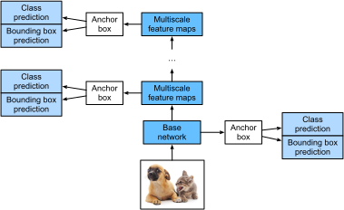

<!-- ===================== Bắt đầu dịch Phần 1 ==================== -->
<!-- ========================================= REVISE PHẦN 1 - BẮT ĐẦU =================================== -->

<!--
# Single Shot Multibox Detection (SSD)
-->

# Phát hiện Nhiều khung trong Một lần Thực hiện (SSD)


<!--
In the previous few sections, we have introduced bounding boxes, anchor boxes, multiscale object detection, and datasets.
Now, we will use this background knowledge to construct an object detection model: single shot multibox detection (SSD) :cite:`Liu.Anguelov.Erhan.ea.2016`.
This quick and easy model is already widely used.
Some of the design concepts and implementation details of this model are also applicable to other object detection models.
-->

Ở một số phần trước, chúng tôi đã giới thiệu về khung chứa, khung neo, phát hiện vật thể đa tỉ lệ và tập dữ liệu.
Giờ ta sẽ sử dụng phần kiến thức nền này để xây dựng một mô hình phát hiện vật thể: phát hiện nhiều khung trong một lần thực hiện (Single Shot Multibox Detection - SSD) :cite:`Liu.Anguelov.Erhan.ea.2016`.
Mô hình này đang được sử dụng rộng rãi nhờ tốc độ và tính đơn giản của nó.
Một số khái niệm thiết kế và chi tiết lập trình của mô hình này cũng có thể được áp dụng cho các mô hình phát hiện vật thể khác.


<!--
## Model
-->

## Mô hình


<!--
:numref:`fig_ssd` shows the design of an SSD model.
The model's main components are a base network block and several multiscale feature blocks connected in a series.
Here, the base network block is used to extract features of original images, and it generally takes the form of a deep convolutional neural network.
The paper on SSDs chooses to place a truncated VGG before the classification layer :cite:`Liu.Anguelov.Erhan.ea.2016`, but this is now commonly replaced by ResNet.
We can design the base network so that it outputs larger heights and widths.
In this way, more anchor boxes are generated based on
this feature map, allowing us to detect smaller objects.
Next, each multiscale feature block reduces the height and width of the feature map provided by the previous layer (for example, it may reduce the sizes by half).
The blocks then use each element in the feature map to expand the receptive field on the input image.
In this way, the closer a multiscale feature block is to the top of :numref:`fig_ssd` the smaller its output feature map, and the fewer the anchor boxes that are generated based on the feature map.
In addition, the closer a feature block is to the top, the larger the receptive field of each element in the feature map and the better suited it is to detect larger objects.
As the SSD generates different numbers of anchor boxes of different sizes based on the base network block a
nd each multiscale feature block and then predicts the categories and offsets (i.e., predicted bounding boxes) 
of the anchor boxes in order to detect objects of different sizes, SSD is a multiscale object detection model.
-->

:numref:`fig_ssd` mô tả thiết kế của một mô hình SSD.
Các thành phần chính của mô hình gồm có một khối mạng cơ sở và các khối đặc trưng đa tỉ lệ được liên kết thành một chuỗi.
Trong đó khối mạng cơ sở được sử dụng để tách các đặc trưng của ảnh gốc, thường dưới dạng một mạng nơ-ron tích chập sâu.
Bài báo về SSD chọn dùng mạng VGG-16 trước tầng phân loại :cite:`Liu.Anguelov.Erhan.ea.2016`, tuy nhiên gần đây nó thường bị thay thế bởi ResNet.
Ta có thể thiết kế mạng cơ sở để cho ra chiều cao và chiều rộng lớn hơn.
Bằng cách này, sẽ có nhiều khung neo được sinh ra bởi ánh xạ đặc trưng này hơn,
cho phép ta phát hiện các vật thể nhỏ hơn.
Tiếp theo, mỗi khối đặc trưng đa tỉ lệ giảm chiều cao và chiều rộng của ánh xạ đặc trưng ở tầng trước (ví dụ, nó có thể giảm kích thước này đi một nửa).
Các khối này sau đó sử dụng từng phần tử trong ánh xạ đặc trưng để mở rộng vùng tiếp nhận trên ảnh đầu vào.
Bằng cách này, khối đặc trưng đa tỉ lệ càng gần đỉnh mô hình trong :numref:`fig_ssd` thì có ánh xạ đặc trưng ở đầu ra càng nhỏ, và số khung neo được sinh ra bởi ánh xạ đầu ra đó càng ít.
Hơn nữa, khối đặc trưng càng gần đỉnh mô hình thì vùng tiếp nhận của mỗi phần tử trong ánh xạ đặc trưng càng lớn và càng phù hợp để phát hiện những vật thể lớn.
Vì SSD sinh ra các tập khung neo với số lượng và kích thước khác nhau dựa trên mạng cơ sở
và từng khối đặc trưng đa tỉ lệ rồi sau đó dự đoán lớp và độ dời (ví dụ như dự đoán khung chứa) cho các khung neo để phát hiện các vật thể với kích cỡ khác nhau, có thể nói SSD là một mô hình phát hiện vật thể đa tỉ lệ.


<!--

-->


:label:`fig_ssd`


<!--
Next, we will describe the implementation of the modules in :numref:`fig_ssd`.
First, we need to discuss the implementation of category prediction and bounding box prediction.
-->

Tiếp theo, ta sẽ mô tả phần lập trình cho các mô-đun trong :numref:`fig_ssd`.
Đầu tiên, ta cần phải thảo luận về việc lập trình cho phần dự đoán lớp và dự đoán khung chứa.


<!-- ===================== Kết thúc dịch Phần 1 ===================== -->

<!-- ===================== Bắt đầu dịch Phần 2 ===================== -->

<!--
### Category Prediction Layer
-->

### Tầng Dự đoán Lớp


<!--
Set the number of object categories to $q$. In this case, the number of anchor box categories is $q+1$, with 0 indicating an anchor box that only contains background.
For a certain scale, set the height and width of the feature map to $h$ and $w$, respectively.
If we use each element as the center to generate $a$ anchor boxes, we need to classify a total of $hwa$ anchor boxes.
If we use a fully connected layer (FCN) for the output, this will likely result in an excessive number of model parameters.
Recall how we used convolutional layer channels to output category predictions in :numref:`sec_nin`.
SSD uses the same method to reduce the model complexity.
-->

Đặt số lớp cho vật thể là $q$. Trong trường hợp này, số lớp cho khung neo là $q+1$, với 0 kí hiệu khung neo chỉ chứa nền.
Ở một tỉ lệ nhất định, đặt chiều cao và chiều rộng của ánh xạ đặc trưng lần lượt là  $h$ và $w$.
Nếu ta sử dụng từng phần tử làm tâm để sinh $a$ khung neo, ta cần phân loại tổng cộng $hwa$ khung neo.
Nếu ta sử dụng một tầng kết nối đầy đủ (FCN) làm đầu ra thì khả năng cao là số lượng tham số mô hình sẽ quá lớn.
Nhớ lại cách ta sử dụng các kênh trong tầng tích chập để đưa ra dự đoán lớp trong :numref:`sec_nin`.
SSD sử dụng phương pháp tương tự để giảm độ phức tạp của mô hình.


<!--
Specifically, the category prediction layer uses a convolutional layer that maintains the input height and width.
Thus, the output and input have a one-to-one correspondence to the spatial coordinates along the width and height of the feature map.
Assuming that the output and input have the same spatial coordinates $(x, y)$, the channel for the coordinates $(x, y)$ on the output
feature map contains the category predictions for all anchor boxes generated using the input feature map coordinates $(x, y)$ as the center.
Therefore, there are $a(q+1)$ output channels, with the output channels indexed as $i(q+1) + j$
($0 \leq j \leq q$) representing the predictions of the category index $j$ for the anchor box index $i$.
-->

Cụ thể, tầng dự đoán lớp sử dụng một tầng tích chập giữ nguyên chiều cao và chiều rộng của đầu vào.
Do đó, toạ độ trong không gian của đầu ra và đầu vào quan hệ một-một với nhau dọc theo cả chiều cao và chiều rộng của ánh xạ đặc trưng.
Giả sử rằng đầu ra và đầu vào này có cùng toạ độ $(x, y)$ trong không gian, các kênh của ánh xạ đặc trưng đầu ra tại toạ độ $(x, y)$
đại diện cho các dự đoán lớp của tất cả các khung neo được sinh ra khi sử dụng toạ độ $(x, y)$ của ánh xạ đặc trưng đầu vào làm trung tâm.
Bởi lẽ đó, có tất cả $a(q+1)$ kênh đầu ra, với các kênh đầu ra được đánh chỉ số theo $i(q+1) + j$
($0 \leq j \leq q$) biểu diễn dự đoán lớp có chỉ số $j$ cho khung neo chỉ số $i$.


<!--
Now, we will define a category prediction layer of this type.
After we specify the parameters $a$ and $q$, it uses a $3\times3$ convolutional layer with a padding of 1.
The heights and widths of the input and output of this convolutional layer remain unchanged.
-->

Bây giờ, ta định nghĩa một tầng dự đoán lớp theo dạng này.
Sau khi ta xác định các tham số $a$ và $q$, tầng này sử dụng một tầng tích chập $3\times3$ với đệm bằng 1.
Chiều cao và chiều rộng của đầu ra và đầu vào của tầng tích chập này không đổi.


```{.python .input  n=1}
%matplotlib inline
from d2l import mxnet as d2l
from mxnet import autograd, gluon, image, init, np, npx
from mxnet.gluon import nn

npx.set_np()

def cls_predictor(num_anchors, num_classes):
    return nn.Conv2D(num_anchors * (num_classes + 1), kernel_size=3,
                     padding=1)
```

<!-- ===================== Kết thúc dịch Phần 2 ===================== -->

<!-- ===================== Bắt đầu dịch Phần 3 ===================== -->

<!--
### Bounding Box Prediction Layer
-->

### Tầng Dự đoán Khung chứa


<!--
The design of the bounding box prediction layer is similar to that of the category prediction layer.
The only difference is that, here, we need to predict 4 offsets for each anchor box, rather than $q+1$ categories.
-->

Thiết kế của tầng dự đoán khung chứa tương tự như tầng dự đoán hạng mục.
Điểm khác biệt duy nhất đó là ta cần dự đoán 4 giá trị độ dời (offset) cho từng khung neo, thay vì $q+1$ hạng mục.


```{.python .input  n=2}
def bbox_predictor(num_anchors):
    return nn.Conv2D(num_anchors * 4, kernel_size=3, padding=1)
```

<!-- ========================================= REVISE PHẦN 1 - KẾT THÚC ===================================-->

<!-- ========================================= REVISE PHẦN 2 - BẮT ĐẦU ===================================-->

<!--
### Concatenating Predictions for Multiple Scales
-->

### Ghép nối các Dự đoán Đa Tỷ lệ


<!--
As we mentioned, SSD uses feature maps based on multiple scales to generate anchor boxes and predict their categories and offsets.
Because the shapes and number of anchor boxes centered on the same element differ for the feature maps of different scales, the prediction outputs at different scales may have different shapes.
-->

Như đã đề cập, SSD sử dụng các ánh xạ đặc trưng dựa trên nhiều tỷ lệ để sinh các khung neo và dự đoán hạng mục và độ dời tương ứng.
Vì kích thước và số lượng các khung neo có tâm đặt tại cùng một điểm là khác nhau đối với ánh xạ đặc trưng có tỷ lệ khác nhau, các đầu ra dự đoán tại các tỷ lệ khác nhau có thể sẽ có kích thước khác nhau.


<!--
In the following example, we use the same batch of data to construct feature maps of two different scales, `Y1` and `Y2`.
Here, `Y2` has half the height and half the width of `Y1`.
Using category prediction as an example, we assume that each element in the `Y1` and `Y2` feature maps generates five (Y1) or three (Y2) anchor boxes.
When there are 10 object categories, the number of category prediction output channels is either $5\times(10+1)=55$ or $3\times(10+1)=33$.
The format of the prediction output is (batch size, number of channels, height, width).
As you can see, except for the batch size, the sizes of the other dimensions are different.
Therefore, we must transform them into a consistent format and concatenate the predictions of the multiple scales to facilitate subsequent computation.
-->

Trong ví dụ dưới đây, ta sử dụng cùng một batch dữ liệu để xây dựng ánh xạ đặc trưng `Y1` và `Y2` của hai tỷ lệ khác nhau.
Trong đó, `Y2` có chiều cao và chiều rộng bằng một nửa `Y1`.
Lấy ví dụ về dự đoán hạng mục, ta giả sử rằng mỗi điểm trong ánh xạ đặc trưng `Y1` và `Y2` sinh 5 (Y1) và 3 (Y2) khung neo tương ứng.
Với 10 hạng mục vật thể, số lượng kênh đầu ra của tầng dự đoán hạng mục sẽ là $5\times(10+1)=55$ hoặc $3\times(10+1)=33$ tương ứng.
Định dạng của đầu ra dự đoán sẽ là (kích thước batch, số lượng kênh, chiều cao, chiều rộng).
Ta thấy, ngoại trừ kích thước batch, kích thước của các chiều còn lại là khác nhau.
Do đó, ta phải biến đổi chúng về cùng một định dạng và ghép nối dự đoán đa tỉ lệ để tính toán về sau.

```{.python .input  n=3}
def forward(x, block):
    block.initialize()
    return block(x)

Y1 = forward(np.zeros((2, 8, 20, 20)), cls_predictor(5, 10))
Y2 = forward(np.zeros((2, 16, 10, 10)), cls_predictor(3, 10))
(Y1.shape, Y2.shape)
```


<!--
The channel dimension contains the predictions for all anchor boxes with the same center.
We first move the channel dimension to the final dimension.
Because the batch size is the same for all scales, we can convert the prediction results to binary format (batch size, height $\times$ width $\times$ number of channels) 
to facilitate subsequent concatenation on the $1^{\mathrm{st}}$ dimension.
-->

Chiều kênh bao gồm dự đoán cho tất cả các khung neo có cùng tâm.
Đầu tiên, ta sẽ chuyển chiều kênh thành chiều cuối cùng.
Do kích thước batch là giống nhau với mọi tỷ lệ, ta có thể chuyển đổi kết quả dự đoán thành định dạng nhị phân (kích thước batch, chiều cao $\times$ chiều rộng $\times$ số lượng kênh) để việc ghép nối trên chiều thứ $1^{\mathrm{st}}$ dễ dàng hơn.


```{.python .input  n=4}
def flatten_pred(pred):
    return npx.batch_flatten(pred.transpose(0, 2, 3, 1))

def concat_preds(preds):
    return np.concatenate([flatten_pred(p) for p in preds], axis=1)
```


<!--
Thus, regardless of the different shapes of `Y1` and `Y2`, we can still concatenate the prediction results for the two different scales of the same batch.
-->

Do đó, ta có thể ghép nối kết quả dự đoán cho hai tỷ lệ khác nhau trên cùng một batch dù `Y1` và `Y2` có kích thước khác nhau.


```{.python .input  n=5}
concat_preds([Y1, Y2]).shape
```

<!-- ===================== Kết thúc dịch Phần 3 ===================== -->

<!-- ===================== Bắt đầu dịch Phần 4 ===================== -->


<!--
### Height and Width Downsample Block
-->

### Khối giảm chiều cao và chiều rộng


<!--
For multiscale object detection, we define the following `down_sample_blk` block, which reduces the height and width by 50%.
This block consists of two $3\times3$ convolutional layers with a padding of 1 and a $2\times2$ maximum pooling layer with a stride of 2 connected in a series.
As we know, $3\times3$ convolutional layers with a padding of 1 do not change the shape of feature maps.
However, the subsequent pooling layer directly reduces the size of the feature map by half.
Because $1\times 2+(3-1)+(3-1)=6$, each element in the output feature map has a receptive field on the input feature map of the shape $6\times6$.
As you can see, the height and width downsample block enlarges the receptive field of each element in the output feature map.
-->


Với bài toán phát hiện vật thể đa tỷ lệ, ta định nghĩa khối `down_sample_blk` sau đây để giảm chiều cao và chiều rộng 50%. 
Khối này bao gồm 2 tầng tích chập $3\times3$ với đệm bằng 1 và tầng gộp cực đại $2\times2$ với sải bước bằng 2 được kết nối tuần tự.
Như ta đã biết, tầng tích chập $3\times3$ với đệm bằng 1 sẽ không thay đổi kích thước của ánh xạ đặc trưng.
Tuy nhiên, tầng gộp cực đại tiếp theo giảm kích thước đặc trưng còn một nửa.
Do $1\times 2+(3-1)+(3-1)=6$, mỗi điểm trong ánh xạ đặc trưng đầu ra sẽ có vùng tiếp nhận với kích thước $6\times6$ trên ánh xạ đặc trưng đầu vào.
Ta có thể thấy, khối giảm chiều cao và chiều rộng mở rộng vùng tiếp nhận của mỗi điểm trong ánh xạ đặc trưng đầu ra.


```{.python .input  n=6}
def down_sample_blk(num_channels):
    blk = nn.Sequential()
    for _ in range(2):
        blk.add(nn.Conv2D(num_channels, kernel_size=3, padding=1),
                nn.BatchNorm(in_channels=num_channels),
                nn.Activation('relu'))
    blk.add(nn.MaxPool2D(2))
    return blk
```

<!--
By testing forward computation in the height and width downsample block, we can see that it changes the number of input channels and halves the height and width.
-->


Bằng phép kiểm tra tính toán truyền xuôi trong khối giảm chiều cao và chiều rộng, ta có thể thấy khối này thay đổi số kênh đầu vào và giảm một nửa chiều cao và chiều rộng.


```{.python .input  n=7}
forward(np.zeros((2, 3, 20, 20)), down_sample_blk(10)).shape
```


<!--
### Base Network Block
-->

### Khối Mạng Cơ sở


<!--
The base network block is used to extract features from original images.
To simplify the computation, we will construct a small base network.
This network consists of three height and width downsample blocks connected in a series, so it doubles the number of channels at each step.
When we input an original image with the shape $256\times256$, the base network block outputs a feature map with the shape $32 \times 32$.
-->


Khối mạng cơ sở được sử dụng để trích xuất đặc trưng từ ảnh gốc ban đầu.
Để đơn giản hoá phép tính, ta sẽ xây dựng một mạng cơ sở nhỏ. 
Mạng này bao gồm các khối giảm chiều cao và chiều rộng được kết nối tuần tự sao cho số lượng kênh tăng gấp đôi sau mỗi tầng.
Khi ta truyền ảnh đầu vào với kích thước $256\times256$, khối mạng cơ sở sẽ cho ra ánh xạ đặc trưng có kích thước $32 \times 32$.


```{.python .input  n=8}
def base_net():
    blk = nn.Sequential()
    for num_filters in [16, 32, 64]:
        blk.add(down_sample_blk(num_filters))
    return blk

forward(np.zeros((2, 3, 256, 256)), base_net()).shape
```

<!-- ===================== Kết thúc dịch Phần 4 ===================== -->

<!-- ===================== Bắt đầu dịch Phần 5 ===================== -->


<!--
### The Complete Model
-->

### Mô hình hoàn chỉnh


<!--
The SSD model contains a total of five modules.
Each module outputs a feature map used to generate anchor boxes and predict the categories and offsets of these anchor boxes.
The first module is the base network block, modules two to four are height and width downsample blocks, and the fifth module is a global maximum pooling layer that reduces the height and width to 1.
Therefore, modules two to five are all multiscale feature blocks shown in :numref:`fig_ssd`.
-->

Mô hình SSD chứa tất cả năm mô-đun.
Mỗi mô-đun xuất một ánh xạ đặc trưng dùng để sinh các khung neo, dự đoán hạng mục và độ dời của các khung neo đó.
Mô-đun đầu tiên là khối mạng cơ sở, các mô-đun từ hai tới bốn là các khối giảm chiều cao và chiều rộng, và khối thứ năm là tầng gộp cực đại toàn cục nhằm giảm chiều cao và chiều rộng xuống còn 1.


```{.python .input  n=9}
def get_blk(i):
    if i == 0:
        blk = base_net()
    elif i == 4:
        blk = nn.GlobalMaxPool2D()
    else:
        blk = down_sample_blk(128)
    return blk
```


<!--
Now, we will define the forward computation process for each module.
In contrast to the previously-described convolutional neural networks, this module not only returns feature map `Y` output by convolutional computation, 
but also the anchor boxes of the current scale generated from `Y` and their predicted categories and offsets.
-->

Bây giờ, ta sẽ định nghĩa luợt tính xuôi cho từng mô-đun.
Khác với các mạng nơ-ron tích chập đã mô tả trước đây, mô-đun này không chỉ trả về ánh xạ đặc trưng `Y` xuất ra từ phép tích chập, mà còn sinh ra  từ `Y` cả các khung neo ở tỉ lệ hiện tại cùng với các dự đoán hạng mục và độ dời.


```{.python .input  n=10}
def blk_forward(X, blk, size, ratio, cls_predictor, bbox_predictor):
    Y = blk(X)
    anchors = npx.multibox_prior(Y, sizes=size, ratios=ratio)
    cls_preds = cls_predictor(Y)
    bbox_preds = bbox_predictor(Y)
    return (Y, anchors, cls_preds, bbox_preds)
```


<!--
As we mentioned, the closer a multiscale feature block is to the top in :numref:`fig_ssd`, the larger the objects it detects and the larger the anchor boxes it must generate.
Here, we first divide the interval from 0.2 to 1.05 into five equal parts to determine the sizes of smaller anchor boxes at different scales: 0.2, 0.37, 0.54, etc.
Then, according to $\sqrt{0.2 \times 0.37} = 0.272$, $\sqrt{0.37 \times 0.54} = 0.447$, and similar formulas, we determine the sizes of larger anchor boxes at the different scales.
-->

Như ta đã đề cập, khối đặc trưng đa tỉ lệ càng gần đỉnh như trong :numref:`fig_ssd`, các vật thể nó phát hiện và các khung neo nó tạo ra càng lớn.
Ở đây, ta trước hết chia khoảng từ 0.2 tới 1.05 thành năm phần bằng nhau để xác định các kích thước của các khung neo nhỏ hơn ở các tỉ lệ: 0.2, 0.37, 0.54 v.v.
Kế đến, theo  $\sqrt{0.2 \times 0.37} = 0.272$, $\sqrt{0.37 \times 0.54} = 0.447, và các công thức tương tự, ta xác định kích thước của các khung neo lớn hơn ở các tỉ lệ khác nhau.


```{.python .input  n=11}
sizes = [[0.2, 0.272], [0.37, 0.447], [0.54, 0.619], [0.71, 0.79],
         [0.88, 0.961]]
ratios = [[1, 2, 0.5]] * 5
num_anchors = len(sizes[0]) + len(ratios[0]) - 1
```


<!--
Now, we can define the complete model, `TinySSD`.
-->

Bây giờ, ta có thể định nghĩa mô hình hoàn chỉnh, `TinySSD`.


```{.python .input  n=12}
class TinySSD(nn.Block):
    def __init__(self, num_classes, **kwargs):
        super(TinySSD, self).__init__(**kwargs)
        self.num_classes = num_classes
        for i in range(5):
            # The assignment statement is self.blk_i = get_blk(i)
            setattr(self, f'blk_{i}', get_blk(i))
            setattr(self, f'cls_{i}', cls_predictor(num_anchors, num_classes))
            setattr(self, f'bbox_{i}', bbox_predictor(num_anchors))

    def forward(self, X):
        anchors, cls_preds, bbox_preds = [None] * 5, [None] * 5, [None] * 5
        for i in range(5):
            # getattr(self, 'blk_%d' % i) accesses self.blk_i
            X, anchors[i], cls_preds[i], bbox_preds[i] = blk_forward(
                X, getattr(self, f'blk_{i}'), sizes[i], ratios[i],
                getattr(self, f'cls_{i}'), getattr(self, f'bbox_{i}'))
        # In the reshape function, 0 indicates that the batch size remains
        # unchanged
        anchors = np.concatenate(anchors, axis=1)
        cls_preds = concat_preds(cls_preds)
        cls_preds = cls_preds.reshape(
            cls_preds.shape[0], -1, self.num_classes + 1)
        bbox_preds = concat_preds(bbox_preds)
        return anchors, cls_preds, bbox_preds
```


<!--
We now create an SSD model instance and use it to perform forward computation on image minibatch `X`, which has a height and width of 256 pixels.
As we verified previously, the first module outputs a feature map with the shape $32 \times 32$.
Because modules two to four are height and width downsample blocks, module five is a global pooling layer, 
and each element in the feature map is used as the center for 4 anchor boxes, a total of $(32^2 + 16^2 + 8^2 + 4^2 + 1)\times 4 = 5444$ anchor boxes are generated for each image at the five scales.
-->

Bây giờ ta tạo thử một mô hình SSD và sử dụng nó để thực hiện lượt truyền xuôi trên minibatch ảnh `X` có chiều rộng và chiều cao là 256 điểm ảnh.
Như ta đã kiểm nghiệm trước đó, mô-đun đầu tiên xuất ánh xạ đặc trưng với kích thước $32 \times 32$.
Bởi vì các mô-đun từ thứ hai tới thứ tư là các khối giảm chiều cao và chiều rộng, còn mô-đun thứ năm là tầng gộp toàn cục, 
và mỗi phần tử trong ánh xạ đặc trưng này được dùng làm tâm cho bốn khung neo, tổng cộng $(32^2 + 16^2 + 8^2 + 4^2 + 1)\times 4 = 5444$ khung neo được tạo ra cho mỗi ảnh ở năm tỉ lệ đó.


```{.python .input  n=13}
net = TinySSD(num_classes=1)
net.initialize()
X = np.zeros((32, 3, 256, 256))
anchors, cls_preds, bbox_preds = net(X)

print('output anchors:', anchors.shape)
print('output class preds:', cls_preds.shape)
print('output bbox preds:', bbox_preds.shape)
```

<!-- ===================== Kết thúc dịch Phần 5 ===================== -->

<!-- ===================== Bắt đầu dịch Phần 6 ===================== -->

<!-- ========================================= REVISE PHẦN 2 - KẾT THÚC ===================================-->

<!-- ========================================= REVISE PHẦN 3 - BẮT ĐẦU ===================================-->

<!--
## Training
-->

## Huấn luyện


<!--
Now, we will explain, step by step, how to train the SSD model for object detection.
-->

Ở bước này chúng tôi sẽ giải thích từng bước một, làm thế nào để huấn luyện mô hình SSD trong phát hiện vật thể.


<!--
### Data Reading and Initialization
-->

### Đọc Dữ liệu và Khởi tạo


<!--
We read the Pikachu dataset we created in the previous section.
-->

Ta đọc tập dữ liệu Pikachu được tạo ở phần trước.


```{.python .input  n=14}
batch_size = 32
train_iter, _ = d2l.load_data_pikachu(batch_size)
```


<!--
There is 1 category in the Pikachu dataset.
After defining the module, we need to initialize the model parameters and define the optimization algorithm.
-->

Có 1 lớp trong tập dữ liệu Pikachu.
Sau khi định nghĩa mô-đun, ta cần khởi tạo các tham số của mô hình và định nghĩa thuật toán tối ưu.


```{.python .input  n=15}
device, net = d2l.try_gpu(), TinySSD(num_classes=1)
net.initialize(init=init.Xavier(), ctx=device)
trainer = gluon.Trainer(net.collect_params(), 'sgd',
                        {'learning_rate': 0.2, 'wd': 5e-4})
```


<!--
### Defining Loss and Evaluation Functions
-->

### Định nghĩa Hàm mất mát và Hàm đánh giá


<!--
Object detection is subject to two types of losses. The first is anchor box category loss.
For this, we can simply reuse the cross-entropy loss function we used in image classification.
The second loss is positive anchor box offset loss.
Offset prediction is a normalization problem.
However, here, we do not use the squared loss introduced previously.
Rather, we use the $L_1$ norm loss, which is the absolute value of the difference between the predicted value and the ground-truth value.
The mask variable `bbox_masks` removes negative anchor boxes and padding anchor boxes from the loss calculation.
Finally, we add the anchor box category and offset losses to find the final loss function for the model.
-->

Phát hiện vật thể có hai loại mất mát. Đầu tiên là mất mát khi phân loại lớp của khung neo.
Đối với mất mát này, ta hoàn toàn có thể sử dụng lại hàm mất mát entropy chéo trong phân loại ảnh.
Loại mất mát thứ hai là mất mát của độ dời khung neo dương.
Dự đoán độ dời là một bài toán chuẩn hoá.
Tuy nhiên, ở đây ta không sử dụng hàm mất mát bình phương đã được giới thiệu từ trước.
Thay vào đó, ta sử dụng mất mát chuẩn $L_1$, tức là trị tuyệt đối hiệu của giá trị dự đoán và giá trị nhãn gốc.
Biến mặt nạ `bbox_masks` loại bỏ các khung neo âm và khung neo đệm khỏi phép tính mất mát.
Cuối cùng, ta cộng mất mát lớp và mất mát độ dời của khung neo để có hàm mất mát cuối cùng cho mô hình.


```{.python .input  n=16}
cls_loss = gluon.loss.SoftmaxCrossEntropyLoss()
bbox_loss = gluon.loss.L1Loss()

def calc_loss(cls_preds, cls_labels, bbox_preds, bbox_labels, bbox_masks):
    cls = cls_loss(cls_preds, cls_labels)
    bbox = bbox_loss(bbox_preds * bbox_masks, bbox_labels * bbox_masks)
    return cls + bbox
```


<!--
We can use the accuracy rate to evaluate the classification results. As we use the $L_1$ norm loss, we will use the average absolute error to evaluate the bounding box prediction results.
-->

Ta có thể sử dụng tỉ lệ độ chính xác để đánh giá kết quả phân loại. Do ta sử dụng mất mát chuẩn $L_1$, ta sẽ sử dụng trung bình sai số tuyệt đối (*average absolute error*) để đánh giá kết quả dự đoán khung chứa.


```{.python .input  n=17}
def cls_eval(cls_preds, cls_labels):
    # Because the category prediction results are placed in the final
    # dimension, argmax must specify this dimension
    return float((cls_preds.argmax(axis=-1).astype(
        cls_labels.dtype) == cls_labels).sum())

def bbox_eval(bbox_preds, bbox_labels, bbox_masks):
    return float((np.abs((bbox_labels - bbox_preds) * bbox_masks)).sum())
```

<!-- ===================== Kết thúc dịch Phần 6 ===================== -->

<!-- ===================== Bắt đầu dịch Phần 7 ===================== -->


<!--
### Training the Model
-->

### Huấn luyện Mô hình


<!--
During model training, we must generate multiscale anchor boxes (`anchors`) in the model's forward computation process and predict the category (`cls_preds`) and offset (`bbox_preds`) for each anchor box.
Afterwards, we label the category (`cls_labels`) and offset (`bbox_labels`) of each generated anchor box based on the label information `Y`.
Finally, we calculate the loss function using the predicted and labeled category and offset values.
To simplify the code, we do not evaluate the training dataset here.
-->

Trong suốt quá trình huấn luyện mô hình, ta phải tạo ra các khung neo trên nhiều tỉ lệ (`anchors`) trong quá trình tính toán lượt truyền xuôi rồi dự đoán lớp (`cls_preds`) và độ dời (`bbox_preds`) cho mỗi khung neo.
Sau đó, ta gán nhãn lớp (`cls_labels`) và độ dời (`bbox_labels`) cho từng khung neo được tạo ở trên dựa vào thông tin nhãn `Y`.
Cuối cùng, ta tính toán hàm mất mát sử dụng lớp dự đoán và lớp gán nhãn và giá trị độ dời.
Để đơn giản hoá mã nguồn, ta sẽ không đánh giá tập huấn luyện ở đây.


```{.python .input  n=29}
num_epochs, timer = 20, d2l.Timer()
animator = d2l.Animator(xlabel='epoch', xlim=[1, num_epochs],
                        legend=['class error', 'bbox mae'])
for epoch in range(num_epochs):
    # accuracy_sum, mae_sum, num_examples, num_labels
    metric = d2l.Accumulator(4)
    train_iter.reset()  # Read data from the start.
    for batch in train_iter:
        timer.start()
        X = batch.data[0].as_in_ctx(device)
        Y = batch.label[0].as_in_ctx(device)
        with autograd.record():
            # Generate multiscale anchor boxes and predict the category and
            # offset of each
            anchors, cls_preds, bbox_preds = net(X)
            # Label the category and offset of each anchor box
            bbox_labels, bbox_masks, cls_labels = npx.multibox_target(
                anchors, Y, cls_preds.transpose(0, 2, 1))
            # Calculate the loss function using the predicted and labeled
            # category and offset values
            l = calc_loss(cls_preds, cls_labels, bbox_preds, bbox_labels,
                          bbox_masks)
        l.backward()
        trainer.step(batch_size)
        metric.add(cls_eval(cls_preds, cls_labels), cls_labels.size,
                   bbox_eval(bbox_preds, bbox_labels, bbox_masks),
                   bbox_labels.size)
    cls_err, bbox_mae = 1-metric[0]/metric[1], metric[2]/metric[3]
    animator.add(epoch+1, (cls_err, bbox_mae))
print(f'class err {cls_err:.2e}, bbox mae {bbox_mae:.2e}')
print(f'{train_iter.num_image/timer.stop():.1f} examples/sec on '
      f'{str(device)}')
```


<!--
## Prediction
-->

## Dự đoán


<!--
In the prediction stage, we want to detect all objects of interest in the image.
Below, we read the test image and transform its size.
Then, we convert it to the four-dimensional format required by the convolutional layer.
-->

Trong bước dự đoán, ta muốn phát hiện tất cả các vật thể trong vùng quan tâm trong ảnh.
Ở đoạn mã dưới, ta đọc vào ảnh kiểm tra và biến đổi kích thước của nó.
Sau đó ta chuyển nó thành dạng bốn chiều mà tầng tích chập yêu cầu.


```{.python .input  n=20}
img = image.imread('../img/pikachu.jpg')
feature = image.imresize(img, 256, 256).astype('float32')
X = np.expand_dims(feature.transpose(2, 0, 1), axis=0)
```


<!--
Using the `MultiBoxDetection` function, we predict the bounding boxes based on the anchor boxes and their predicted offsets.
Then, we use non-maximum suppression to remove similar bounding boxes.
-->

Ta sử dụng hàm `MultiBoxDetection` để dự đoán các khung chứa dựa theo các khung neo và giá trị độ dời dự đoán của chúng.
Sau đó ta sử dụng thuật toán triệt tiêu phi tối đa (*non-maximum suppression*) để loại bỏ các khung chứa giống nhau.


```{.python .input  n=21}
def predict(X):
    anchors, cls_preds, bbox_preds = net(X.as_in_ctx(device))
    cls_probs = npx.softmax(cls_preds).transpose(0, 2, 1)
    output = npx.multibox_detection(cls_probs, bbox_preds, anchors)
    idx = [i for i, row in enumerate(output[0]) if row[0] != -1]
    return output[0, idx]

output = predict(X)
```


<!--
Finally, we take all the bounding boxes with a confidence level of at least 0.3 and display them as the final output.
-->

Cuối cùng, ta lấy toàn bộ khung chứa có độ tin cậy tối thiểu là 0.3 và hiển thị chúng làm kết quả cuối cùng.


```{.python .input  n=22}
def display(img, output, threshold):
    d2l.set_figsize((5, 5))
    fig = d2l.plt.imshow(img.asnumpy())
    for row in output:
        score = float(row[1])
        if score < threshold:
            continue
        h, w = img.shape[0:2]
        bbox = [row[2:6] * np.array((w, h, w, h), ctx=row.ctx)]
        d2l.show_bboxes(fig.axes, bbox, '%.2f' % score, 'w')

display(img, output, threshold=0.3)
```


## Tóm tắt


<!--
* SSD is a multiscale object detection model. This model generates different numbers of anchor boxes of different sizes 
based on the base network block and each multiscale feature block and predicts the categories and offsets of the anchor boxes to detect objects of different sizes.
* During SSD model training, the loss function is calculated using the predicted and labeled category and offset values.
-->

* SSD là một mô hình phát hiện vật thể đa tỉ lệ. Mô hình này sinh ra các tập khung neo với số lượng và kích thước khác nhau 
dựa trên khối mạng cơ sở và từng khối đặc trưng đa tỉ lệ rồi dự đoán lớp và độ dời cho các khung neo để phát hiện các vật thể với kích cỡ khác nhau.
* Trong suốt quá trình huấn luyện mô hình SSD, hàm mất mát được tính bằng giá trị dự đoán và nhãn của lớp và độ dời.


## Bài tập


<!--
Due to space limitations, we have ignored some of the implementation details of SSD models in this experiment.
Can you further improve the model in the following areas?
-->

Do giới hạn về độ dài bài viết, chúng tôi đã bỏ qua một số chi tiết phần lập trình cho mô hình SSD trong thí nghiệm này.
Liệu bạn có thể cải thiện mô hình hơn nữa theo các hướng sau?

<!-- ===================== Kết thúc dịch Phần 7 ===================== -->

<!-- ===================== Bắt đầu dịch Phần 8 ===================== -->


<!--
### Loss Function
-->

### Hàm mất mát


<!--
For the predicted offsets, replace $L_1$ norm loss with $L_1$ regularization loss.
This loss function uses a square function around zero for greater smoothness.
This is the regularized area controlled by the hyperparameter $\sigma$:
-->

Để dự đoán độ dời, thay thế mất mát chuẩn $L_1$ bằng mất mát điều chuẩn $L_1$.
Hàm mất mát này sử dụng hàm bình phương xung quanh giá trị không để tăng độ mượt.
Đây chính là vùng được điều chuẩn và được xác định bởi siêu tham số $\sigma$:

$$
f(x) =
    \begin{cases}
    (\sigma x)^2/2,& \text{if }|x| < 1/\sigma^2\\
    |x|-0.5/\sigma^2,& \text{otherwise}
    \end{cases}
$$


<!--
When $\sigma$ is large, this loss is similar to the $L_1$ norm loss.
When the value is small, the loss function is smoother.
-->

Khi  $\sigma$ lớn, mất mát này tương đương với mất mát chuẩn $L_1$.
Khi giá trị này nhỏ, hàm mất mát trở nên mượt hơn.


```{.python .input  n=23}
sigmas = [10, 1, 0.5]
lines = ['-', '--', '-.']
x = np.arange(-2, 2, 0.1)
d2l.set_figsize()

for l, s in zip(lines, sigmas):
    y = npx.smooth_l1(x, scalar=s)
    d2l.plt.plot(x.asnumpy(), y.asnumpy(), l, label='sigma=%.1f' % s)
d2l.plt.legend();
```


<!--
In the experiment, we used cross-entropy loss for category prediction.
Now, assume that the prediction probability of the actual category $j$ is $p_j$ and the cross-entropy loss is $-\log p_j$.
We can also use the focal loss :cite:`Lin.Goyal.Girshick.ea.2017`.
Given the positive hyperparameters $\gamma$ and $\alpha$, this loss is defined as:
-->

Trong thí nghiệm ở phần này, ta sử dụng hàm mất mát entropy chéo để dự đoán lớp.
Còn giờ, giả sử rằng xác suất dự đoán được đúng lớp $j$ là $p_j$ và mất mát entropy chéo là $-\log p_j$.
Ta cũng có thể sử dụng mất mát tiêu điểm (*focal loss*) :cite:`Lin.Goyal.Girshick.ea.2017`.
Cho siêu tham số $\gamma$ and $\alpha$ dương, mất mát này được định nghĩa như sau:


$$ - \alpha (1-p_j)^{\gamma} \log p_j.$$


<!--
As you can see, by increasing $\gamma$, we can effectively reduce the loss when the probability of predicting the correct category is high.
-->

Như bạn có thể thấy, bằng cách tăng $\gamma$, ta thực chất có thể giảm giá trị mất mát đi khi khả năng dự đoán đúng hạng mục là lớn.


```{.python .input  n=24}
def focal_loss(gamma, x):
    return -(1 - x) ** gamma * np.log(x)

x = np.arange(0.01, 1, 0.01)
for l, gamma in zip(lines, [0, 1, 5]):
    y = d2l.plt.plot(x.asnumpy(), focal_loss(gamma, x).asnumpy(), l,
                     label='gamma=%.1f' % gamma)
d2l.plt.legend();
```


<!--
### Training and Prediction
-->

### Huấn luyện và Dự đoán


<!--
1. When an object is relatively large compared to the image, the model normally adopts a larger input image size.
2. This generally produces a large number of negative anchor boxes when labeling anchor box categories.
We can sample the negative anchor boxes to better balance the data categories.
To do this, we can set the `MultiBoxTarget` function's `negative_mining_ratio` parameter.
3. Assign hyperparameters with different weights to the anchor box category loss and positive anchor box offset loss in the loss function.
4. Refer to the SSD paper. What methods can be used to evaluate the precision of object detection models :cite:`Liu.Anguelov.Erhan.ea.2016`?
-->

1. Khi một vật thể có kích thước khá lớn so với ảnh, mô hình thường chấp nhận kích thước ảnh đầu vào lớn hơn.
2. Điều này thường sản sinh lượng lớn các khung neo âm khi gán nhãn hạng mục cho khung neo.
Ta có thể lấy mẫu các khung neo âm để cân bằng các lớp trong dữ liệu tốt hơn.
Để thực hiện điều này, ta có thể đặt tham số `negative_mining_ratio` của hàm `MultiBoxTarget`.
3. Trong hàm mất mát, sử dụng các trọng số khác nhau cho mất mát hạng mục của các khung neo và mất mát độ dời cho các khung neo dương.
4. Tham khảo bài báo SSD. Phương pháp nào có thể được sử dụng để đánh giá giá trị precision của các mô hình phát hiện vật thể :cite:`Liu.Anguelov.Erhan.ea.2016`?


<!-- ===================== Kết thúc dịch Phần 8 ===================== -->
<!-- ========================================= REVISE PHẦN 3 - KẾT THÚC ===================================-->

## Thảo luận
* [Tiếng Anh - MXNet](https://discuss.d2l.ai/t/373)
* [Tiếng Việt](https://forum.machinelearningcoban.com/c/d2l)
* 

## Những người thực hiện
Bản dịch trong trang này được thực hiện bởi:
<!--
Tác giả của mỗi Pull Request điền tên mình và tên những người review mà bạn thấy
hữu ích vào từng phần tương ứng. Mỗi dòng một tên, bắt đầu bằng dấu `*`.

Tên đầy đủ của các reviewer có thể được tìm thấy tại https://github.com/aivivn/d2l-vn/blob/master/docs/contributors_info.md
-->

* Đoàn Võ Duy Thanh
<!-- Phần 1 -->
* Đỗ Trường Giang
* Phạm Hồng Vinh

<!-- Phần 2 -->
* Đỗ Trường Giang
* Phạm Hồng Vinh

<!-- Phần 3 -->
* Nguyễn Văn Quang
* Nguyễn Văn Cường
<!-- Phần 4 -->
* Nguyễn Văn Quang

<!-- Phần 5 -->
* Nguyễn Mai Hoàng Long

<!-- Phần 6 -->
* Đỗ Trường Giang
* Nguyễn Văn Cường

<!-- Phần 7 -->
* Đỗ Trường Giang
* Nguyễn Văn Cường

<!-- Phần 8 -->
* Đỗ Trường Giang