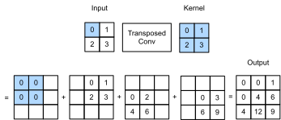
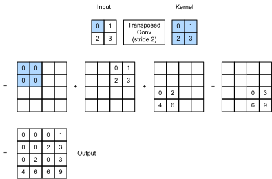

# Chuyển đổi Convolution
:label:`sec_transposed_conv`

Các lớp CNN chúng ta đã thấy cho đến nay, chẳng hạn như các lớp phức tạp (:numref:`sec_conv_layer`) và các lớp tổng hợp (:numref:`sec_pooling`), thường làm giảm (downsample) kích thước không gian (chiều cao và chiều rộng) của đầu vào, hoặc giữ chúng không thay đổi. Trong phân đoạn ngữ nghĩa phân loại ở cấp pixel, sẽ thuận tiện nếu kích thước không gian của đầu vào và đầu ra giống nhau. Ví dụ: kích thước kênh tại một điểm ảnh đầu ra có thể giữ kết quả phân loại cho pixel đầu vào ở cùng một vị trí không gian. 

Để đạt được điều này, đặc biệt là sau khi các kích thước không gian bị giảm bởi các lớp CNN, chúng ta có thể sử dụng một loại lớp CNN khác có thể tăng (upsample) kích thước không gian của bản đồ tính năng trung gian. Trong phần này, chúng tôi sẽ giới thiệu 
*chuyển đổi*, mà còn được gọi là * phân số strided convolution* :cite:`Dumoulin.Visin.2016`, 
để đảo ngược các hoạt động lấy mẫu xuống bằng sự covolution.

```{.python .input}
from mxnet import np, npx, init
from mxnet.gluon import nn
from d2l import mxnet as d2l

npx.set_np()
```

```{.python .input}
#@tab pytorch
import torch
from torch import nn
from d2l import torch as d2l
```

## Hoạt động cơ bản

Bỏ qua các kênh bây giờ, chúng ta hãy bắt đầu với hoạt động phức tạp chuyển tiếp cơ bản với sải chân 1 và không có đệm. Giả sử rằng chúng ta được đưa ra một tensor đầu vào $n_h \times n_w$ và một hạt nhân $k_h \times k_w$. Trượt cửa sổ hạt nhân với sải chân 1 cho $n_w$ lần trong mỗi hàng và $n_h$ lần trong mỗi cột mang lại tổng cộng $n_h n_w$ kết quả trung gian. Mỗi kết quả trung gian là một tensor $(n_h + k_h - 1) \times (n_w + k_w - 1)$ được khởi tạo dưới dạng số không. Để tính từng tensor trung gian, mỗi phần tử trong tensor đầu vào được nhân với hạt nhân sao cho tensor $k_h \times k_w$ kết quả thay thế một phần trong mỗi tensor trung gian. Lưu ý rằng vị trí của phần thay thế trong mỗi tensor trung gian tương ứng với vị trí của phần tử trong tensor đầu vào được sử dụng cho tính toán. Cuối cùng, tất cả các kết quả trung gian được tóm tắt để tạo ra đầu ra. 

Ví dụ, :numref:`fig_trans_conv` minh họa cách chuyển đổi phức tạp với một hạt nhân $2\times 2$ được tính toán cho một tensor đầu vào $2\times 2$. 


:label:`fig_trans_conv`

Chúng ta có thể (** triển khai hoạt động chuyển tiếp cơ bản này**) `trans_conv` cho một ma trận đầu vào `X` và một ma trận hạt nhân `K`.

```{.python .input}
#@tab all
def trans_conv(X, K):
    h, w = K.shape
    Y = d2l.zeros((X.shape[0] + h - 1, X.shape[1] + w - 1))
    for i in range(X.shape[0]):
        for j in range(X.shape[1]):
            Y[i: i + h, j: j + w] += X[i, j] * K
    return Y
```

Trái ngược với sự phức tạp thông thường (trong :numref:`sec_conv_layer`) mà * giảm các yếu tố đầu vào thông qua hạt nhân, sự biến đổi chuyển đổi
*phát sóng * yếu tố đầu vào 
thông qua hạt nhân, do đó tạo ra một đầu ra lớn hơn đầu vào. Chúng ta có thể xây dựng tensor đầu vào `X` và tensor kernel `K` từ :numref:`fig_trans_conv` đến [** xác nhận đầu ra của việc triển khai ở trên**] của hoạt động phức tạp chuyển tiếp hai chiều cơ bản.

```{.python .input}
#@tab all
X = d2l.tensor([[0.0, 1.0], [2.0, 3.0]])
K = d2l.tensor([[0.0, 1.0], [2.0, 3.0]])
trans_conv(X, K)
```

Ngoài ra, khi đầu vào `X` và hạt nhân `K` đều là hàng chục bốn chiều, chúng ta có thể [** sử dụng API cấp cao để có được kết quả tương tự**].

```{.python .input}
X, K = X.reshape(1, 1, 2, 2), K.reshape(1, 1, 2, 2)
tconv = nn.Conv2DTranspose(1, kernel_size=2)
tconv.initialize(init.Constant(K))
tconv(X)
```

```{.python .input}
#@tab pytorch
X, K = X.reshape(1, 1, 2, 2), K.reshape(1, 1, 2, 2)
tconv = nn.ConvTranspose2d(1, 1, kernel_size=2, bias=False)
tconv.weight.data = K
tconv(X)
```

## [**Đệm, sải bước và nhiều kênh**]

Khác với trong sự phức tạp thông thường nơi đệm được áp dụng cho đầu vào, nó được áp dụng cho đầu ra trong quá trình chuyển đổi. Ví dụ: khi chỉ định số đệm ở hai bên của chiều cao và chiều rộng là 1, các hàng và cột đầu tiên và cuối cùng sẽ bị xóa khỏi đầu ra phức tạp được chuyển đổi.

```{.python .input}
tconv = nn.Conv2DTranspose(1, kernel_size=2, padding=1)
tconv.initialize(init.Constant(K))
tconv(X)
```

```{.python .input}
#@tab pytorch
tconv = nn.ConvTranspose2d(1, 1, kernel_size=2, padding=1, bias=False)
tconv.weight.data = K
tconv(X)
```

Trong quá trình chuyển đổi, các bước tiến được chỉ định cho các kết quả trung gian (do đó đầu ra), không phải cho đầu vào. Sử dụng cùng một đầu vào và kernel tenors từ :numref:`fig_trans_conv`, thay đổi sải chân từ 1 đến 2 làm tăng cả chiều cao và trọng lượng của hàng chục trung gian, do đó tensor đầu ra trong :numref:`fig_trans_conv_stride2`. 


:label:`fig_trans_conv_stride2`

Đoạn mã sau đây có thể xác nhận đầu ra phức tạp transposed cho sải chân của 2 trong :numref:`fig_trans_conv_stride2`.

```{.python .input}
tconv = nn.Conv2DTranspose(1, kernel_size=2, strides=2)
tconv.initialize(init.Constant(K))
tconv(X)
```

```{.python .input}
#@tab pytorch
tconv = nn.ConvTranspose2d(1, 1, kernel_size=2, stride=2, bias=False)
tconv.weight.data = K
tconv(X)
```

Đối với nhiều kênh đầu vào và đầu ra, sự tích tụ được chuyển tiếp hoạt động theo cách tương tự như sự phức tạp thông thường. Giả sử rằng đầu vào có $c_i$ các kênh và sự phức tạp transposed gán một tensor hạt nhân $k_h\times k_w$ cho mỗi kênh đầu vào. Khi nhiều kênh đầu ra được chỉ định, chúng tôi sẽ có hạt nhân $c_i\times k_h\times k_w$ cho mỗi kênh đầu ra. 

Như trong tất cả, nếu chúng ta cung cấp $\mathsf{X}$ vào một lớp phức tạp $f$ để xuất ra $\mathsf{Y}=f(\mathsf{X})$ và tạo ra một lớp tích hợp chuyển đổi $g$ với các siêu tham số tương tự như $f$ ngoại trừ số lượng kênh đầu ra là số kênh trong $\mathsf{X}$, sau đó $g(Y)$ sẽ có hình dạng tương tự như $\mathsf{X}$. Điều này có thể được minh họa trong ví dụ sau.

```{.python .input}
X = np.random.uniform(size=(1, 10, 16, 16))
conv = nn.Conv2D(20, kernel_size=5, padding=2, strides=3)
tconv = nn.Conv2DTranspose(10, kernel_size=5, padding=2, strides=3)
conv.initialize()
tconv.initialize()
tconv(conv(X)).shape == X.shape
```

```{.python .input}
#@tab pytorch
X = torch.rand(size=(1, 10, 16, 16))
conv = nn.Conv2d(10, 20, kernel_size=5, padding=2, stride=3)
tconv = nn.ConvTranspose2d(20, 10, kernel_size=5, padding=2, stride=3)
tconv(conv(X)).shape == X.shape
```

## [**Kết nối với Ma trận Transposition**]
:label:`subsec-connection-to-mat-transposition`

Sự phức tạp chuyển tiếp được đặt tên theo chuyển vị ma trận. Để giải thích, trước tiên chúng ta hãy xem làm thế nào để thực hiện các phức tạp bằng cách sử dụng phép nhân ma trận. Trong ví dụ dưới đây, chúng ta định nghĩa một $3\times 3$ đầu vào `X` và một hạt nhân ghép $2\times 2$ `K`, và sau đó sử dụng hàm `corr2d` để tính toán đầu ra phức tạp `Y`.

```{.python .input}
#@tab all
X = d2l.arange(9.0).reshape(3, 3)
K = d2l.tensor([[1.0, 2.0], [3.0, 4.0]])
Y = d2l.corr2d(X, K)
Y
```

Tiếp theo, chúng ta viết lại hạt nhân phức tạp `K` dưới dạng ma trận trọng lượng thưa `W` chứa rất nhiều số không. Hình dạng của ma trận trọng lượng là ($4$, $9$), trong đó các phần tử phi bằng không đến từ hạt nhân phức tạp `K`.

```{.python .input}
#@tab all
def kernel2matrix(K):
    k, W = d2l.zeros(5), d2l.zeros((4, 9))
    k[:2], k[3:5] = K[0, :], K[1, :]
    W[0, :5], W[1, 1:6], W[2, 3:8], W[3, 4:] = k, k, k, k
    return W

W = kernel2matrix(K)
W
```

Nối đầu vào `X` từng hàng để có được một vectơ có chiều dài 9. Sau đó, phép nhân ma trận của `W` và `X` vectơ hóa cho một vectơ có chiều dài 4. Sau khi định hình lại nó, chúng ta có thể thu được kết quả tương tự `Y` từ hoạt động phức tạp ban đầu ở trên: chúng ta chỉ thực hiện các phép phức tạp bằng cách sử dụng phép nhân ma trận.

```{.python .input}
#@tab all
Y == d2l.matmul(W, d2l.reshape(X, -1)).reshape(2, 2)
```

Tương tự như vậy, chúng ta có thể thực hiện các phép chuyển đổi bằng cách sử dụng phép nhân ma trận. Trong ví dụ sau, chúng ta lấy đầu ra $2 \times 2$ `Y` từ sự phức tạp thông thường ở trên làm đầu vào cho sự phức tạp được chuyển tiếp. Để thực hiện thao tác này bằng cách nhân ma trận, chúng ta chỉ cần chuyển vị ma trận trọng lượng `W` với hình dạng mới $(9, 4)$.

```{.python .input}
#@tab all
Z = trans_conv(Y, K)
Z == d2l.matmul(W.T, d2l.reshape(Y, -1)).reshape(3, 3)
```

Cân nhắc việc thực hiện sự phức tạp bằng cách nhân ma trận. Với một vector đầu vào $\mathbf{x}$ và một ma trận trọng lượng $\mathbf{W}$, chức năng lan truyền chuyển tiếp của sự phức tạp có thể được thực hiện bằng cách nhân đầu vào của nó với ma trận trọng lượng và xuất ra một vector $\mathbf{y}=\mathbf{W}\mathbf{x}$. Kể từ khi backpropagation tuân theo quy tắc chuỗi và $\nabla_{\mathbf{x}}\mathbf{y}=\mathbf{W}^\top$, chức năng truyền ngược của sự phức tạp có thể được thực hiện bằng cách nhân đầu vào của nó với ma trận trọng lượng transposed $\mathbf{W}^\top$. Do đó, lớp tích lũy chuyển tiếp chỉ có thể trao đổi chức năng lan truyền về phía trước và chức năng lan truyền ngược của lớp ghép: các chức năng lan truyền về phía trước và lan truyền ngược của nó nhân vectơ đầu vào của chúng với $\mathbf{W}^\top$ và $\mathbf{W}$, tương ứng. 

## Tóm tắt

* Ngược lại với sự phức tạp thông thường làm giảm các phần tử đầu vào thông qua hạt nhân, sự phức tạp chuyển phát các phần tử đầu vào thông qua hạt nhân, từ đó tạo ra một đầu ra lớn hơn đầu vào.
* Nếu chúng ta cho $\mathsf{X}$ vào một lớp phức hợp $f$ để xuất ra $\mathsf{Y}=f(\mathsf{X})$ và tạo ra một lớp tích hợp chuyển đổi $g$ với các siêu tham số tương tự như $f$ ngoại trừ số lượng kênh đầu ra là số kênh trong $\mathsf{X}$, thì $g(Y)$ sẽ có hình dạng tương tự như $\mathsf{X}$.
* Chúng ta có thể thực hiện các phức tạp bằng cách sử dụng phép nhân ma trận. Lớp ghép chuyển tiếp chỉ có thể trao đổi chức năng lan truyền về phía trước và chức năng lan truyền ngược của lớp ghép.

## Bài tập

1. Trong :numref:`subsec-connection-to-mat-transposition`, đầu vào covolution `X` và đầu ra phức tạp transposed `Z` có hình dạng tương tự. Họ có cùng giá trị không? Tại sao?
1. Có hiệu quả khi sử dụng phép nhân ma trận để thực hiện các phức tạp không? Tại sao?

:begin_tab:`mxnet`
[Discussions](https://discuss.d2l.ai/t/376)
:end_tab:

:begin_tab:`pytorch`
[Discussions](https://discuss.d2l.ai/t/1450)
:end_tab:
