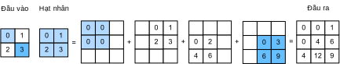

<!--
# Transposed Convolution
-->

# Tích chập Chuyển vị
:label:`sec_transposed_conv`


<!--
The layers we introduced so far for convolutional neural networks, 
including convolutional layers (:numref:`sec_conv_layer`) and pooling layers (:numref:`sec_pooling`), 
often reduce the input width and height, or keep them unchanged.
Applications such as semantic segmentation (:numref:`sec_semantic_segmentation`) and generative adversarial networks (:numref:`sec_dcgan`), 
however, require to predict values for each pixel and therefore needs to increase input width and height. 
Transposed convolution, also named fractionally-strided convolution :cite:`Dumoulin.Visin.2016` or deconvolution :cite:`Long.Shelhamer.Darrell.2015`, serves this purpose.
-->

Các tầng trong mạng nơ-ron tích chập, bao gồm tầng tích chập (:numref:`sec_conv_layer`) và tầng gộp (:numref:`sec_pooling`), 
thường giảm chiều rộng và chiều cao của đầu vào, hoặc giữ nguyên chúng.
Tuy nhiên, các ứng dụng như phân vùng theo ngữ nghĩa (:numref:`sec_semantic_segmentation`) và mạng đối sinh (*GAN* - :numref:`sec_dcgan`), 
yêu cầu phải dự đoán các giá trị cho mỗi pixel vì thế cần tăng chiều rộng và chiều cao của đầu vào.
Tích chập chuyển vị, cũng có tên là tích chập sải bước phân số (*fractionally-strided convolution*) :cite:`Dumoulin.Visin.2016` 
hay phân tách tích chập (*deconvolution*) :cite:`Long.Shelhamer.Darrell.2015`, phục vụ cho mục đích này.


```{.python .input  n=13}
from mxnet import np, npx, init
from mxnet.gluon import nn
from d2l import mxnet as d2l

npx.set_np()
```


<!--
## Basic 2D Transposed Convolution
-->

## Tích chập Chuyển vị 2D Cơ bản


<!--
Let us consider a basic case that both input and output channels are 1, with 0 padding and 1 stride.
:numref:`fig_trans_conv` illustrates how transposed convolution with a $2\times 2$ kernel is computed on the $2\times 2$ input matrix.
-->

Xét một trường hợp cơ bản với số kênh đầu vào và đầu ra là 1, với đệm 0 và sải bước 1. 
:numref:`fig_trans_conv` mô tả cách tích chập chuyển vị với một hạt nhân $2\times 2$ được tính toán trên một ma trận đầu vào kích thước $2\times 2$.


<!--

-->


:label:`fig_trans_conv`

<!--
We can implement this operation by giving matrix kernel $K$ and matrix input $X$.
-->

Ta có thể lập trình phép tính này với ma trận hạt nhân $K$ và ma trận đầu vào $X$.


```{.python .input}
def trans_conv(X, K):
    h, w = K.shape
    Y = np.zeros((X.shape[0] + h - 1, X.shape[1] + w - 1))
    for i in range(X.shape[0]):
        for j in range(X.shape[1]):
            Y[i: i + h, j: j + w] += X[i, j] * K
    return Y
```


<!--
Remember the convolution computes results by `Y[i, j] = (X[i: i + h, j: j + w] * K).sum()` (refer to `corr2d` in :numref:`sec_conv_layer`), which summarizes input values through the kernel.
While the transposed convolution broadcasts input values through the kernel, which results in a larger output shape.
-->

Nhớ lại rằng kết quả tính tích chập là `Y[i, j] = (X[i: i + h, j: j + w] * K).sum()` (đọc lại `corr2d` trong :numref:`sec_conv_layer`), tức tổng hợp các giá trị đầu vào thông qua hạt nhân.
Trong khi tích chập chuyển vị lan truyền từng giá trị đầu vào khắp hạt nhân, tạo thành đầu ra có kích thước lớn hơn.


<!--
Verify the results in :numref:`fig_trans_conv`.
-->

Kiểm chứng các kết quả trong :numref:`fig_trans_conv`.


```{.python .input}
X = np.array([[0, 1], [2, 3]])
K = np.array([[0, 1], [2, 3]])
trans_conv(X, K)
```


<!--
Or we can use `nn.Conv2DTranspose` to obtain the same results.
As `nn.Conv2D`, both input and kernel should be 4-D tensors.
-->

Hoặc ta có thể sử dụng `nn.Conv2DTranspose` để thu được kết quả tương tự.
Vì đang sử dụng `nn.Conv2D`, cả đầu vào và hạt nhân phải là tensor 4 chiều.


```{.python .input  n=17}
X, K = X.reshape(1, 1, 2, 2), K.reshape(1, 1, 2, 2)
tconv = nn.Conv2DTranspose(1, kernel_size=2)
tconv.initialize(init.Constant(K))
tconv(X)
```


<!--
## Padding, Strides, and Channels
-->

## Đệm, Sải bước và Kênh


<!--
We apply padding elements to the input in convolution, while they are applied to the output in transposed convolution.
A $1\times 1$ padding means we first compute the output as normal, then remove the first/last rows and columns.
-->

Khi tính tích chập ta áp dụng đệm lên đầu vào, nhưng với tích chập chuyển vị, chúng được áp dụng vào đầu ra.
Ví dụ, với đệm $1\times 1$, đầu tiên ta tính toán đầu ra như bình thường, sau đó bỏ đi dòng và cột đầu tiên / cuối cùng.


```{.python .input}
tconv = nn.Conv2DTranspose(1, kernel_size=2, padding=1)
tconv.initialize(init.Constant(K))
tconv(X)
```


<!--
Similarly, strides are applied to outputs as well.
-->

Tương tự, sải bước cũng được áp dụng vào các đầu ra.


```{.python .input}
tconv = nn.Conv2DTranspose(1, kernel_size=2, strides=2)
tconv.initialize(init.Constant(K))
tconv(X)
```


<!--
The multi-channel extension of the transposed convolution is the same as the convolution.
When the input has multiple channels, denoted by $c_i$, the transposed convolution assigns a $k_h\times k_w$ kernel matrix to each input channel.
If the output has a channel size $c_o$, then we have a $c_i\times k_h\times k_w$ kernel for each output channel.
-->

Phần mở rộng đa kênh của tích chập chuyển vị cũng giống như tích chập.
Khi đầu vào có $c_i$ kênh, tích chập chuyển vị gán một ma trận hạt nhân có kích thước $k_h\times k_w$ vào mỗi kênh đầu vào.
Nếu số kênh đầu ra là $c_o$, thì hạt nhân có kích thước $c_i\times k_h\times k_w$ cho mỗi kênh đầu ra.


<!--
As a result, if we feed $X$ into a convolutional layer $f$ to compute $Y=f(X)$ and create a transposed convolution layer $g$ with 
the same hyperparameters as $f$ except for the output channel set to be the channel size of $X$, then $g(Y)$ should has the same shape as $X$. 
Let us verify this statement.
-->

Do đó, nếu ta đưa $X$ qua một tầng tích chập $f$ để tính $Y=f(X)$ và tạo một tầng tích chập chuyển vị $g$ với
cùng một siêu tham số như $f$ ngoại trừ kênh đầu ra được đặt thành kích thước kênh $X$, thì $g(Y)$ sẽ có cùng kích thước với $X$.
Ta hãy xác minh phát biểu này.


```{.python .input}
X = np.random.uniform(size=(1, 10, 16, 16))
conv = nn.Conv2D(20, kernel_size=5, padding=2, strides=3)
tconv = nn.Conv2DTranspose(10, kernel_size=5, padding=2, strides=3)
conv.initialize()
tconv.initialize()
tconv(conv(X)).shape == X.shape
```


<!--
## Analogy to Matrix Transposition
-->

## Sự Tương đồng với Chuyển vị Ma trận


<!--
The transposed convolution takes its name from the matrix transposition.
In fact, convolution operations can also be achieved by matrix multiplication.
In the example below, we define a $3\times$ input $X$ with a $2\times 2$ kernel $K$, and then use `corr2d` to compute the convolution output.
-->

Tên của tích chập chuyển vị xuất phát từ phép chuyển vị ma trận.
Thật vậy, phép tích chập có thể tính thông qua phép nhân ma trận.
Trong ví dụ dưới đây, ta định nghĩa một biến đầu vào $X$ $3\times 3$ với một hạt nhân $K$ $2\times 2$, rồi dùng `corr2d` để tính tích chập.


```{.python .input}
X = np.arange(9).reshape(3, 3)
K = np.array([[0, 1], [2, 3]])
Y = d2l.corr2d(X, K)
Y
```


<!--
Next, we rewrite convolution kernel $K$ as a matrix $W$.
Its shape will be $(4, 9)$, where the $i^\mathrm{th}$ row present applying the kernel to the input to generate the $i^\mathrm{th}$ output element.
-->

Kế tiếp, ta viết lại hạt nhân chập $K$ dưới dạng ma trận $W$.
Kích thước của nó sẽ là $(4, 9)$, hàng thứ $i$ biểu diễn việc sử dụng hạt nhân lên đầu vào để sinh ra phần tử đầu ra thứ $i$.


```{.python .input}
def kernel2matrix(K):
    k, W = np.zeros(5), np.zeros((4, 9))
    k[:2], k[3:5] = K[0, :], K[1, :]
    W[0, :5], W[1, 1:6], W[2, 3:8], W[3, 4:] = k, k, k, k
    return W

W = kernel2matrix(K)
W
```


<!--
Then the convolution operator can be implemented by matrix multiplication with proper reshaping.
-->

Rồi toán tử chập có thể được thực hiện nhờ phép nhân ma trận với việc chỉnh lại kích thước phù hợp.


```{.python .input}
Y == np.dot(W, X.reshape(-1)).reshape(2, 2)
```


<!--
We can implement transposed convolution as a matrix multiplication as well by reusing `kernel2matrix`.
To reuse the generated $W$, we construct a $2\times 2$ input, so the corresponding weight matrix will have a shape $(9, 4)$, which is $W^\top$. Let us verify the results.
-->

Ta có thể thực hiện phép chập chuyển vị giống như phép nhân ma trận bằng cách sử dụng lại `kernel2matrix`.
Để sử dụng lại ma trận $W$ đã tạo ra, ta xây dựng một đầu vào $2\times 2$, nên ma trận trọng số $W^\top$ tương ứng sẽ có kích thước $(9, 4)$. 
Ta hãy cùng kiểm tra lại kết quả.


```{.python .input}
X = np.array([[0, 1], [2, 3]])
Y = trans_conv(X, K)
Y == np.dot(W.T, X.reshape(-1)).reshape(3, 3)
```


## Tóm tắt

<!--
* Compared to convolutions that reduce inputs through kernels, transposed convolutions broadcast inputs.
* If a convolution layer reduces the input width and height by $n_w$ and $h_h$ time, respectively.
Then a transposed convolution layer with the same kernel sizes, padding and strides will increase the input width and height by $n_w$ and $n_h$, respectively.
* We can implement convolution operations by the matrix multiplication, the corresponding transposed convolutions can be done by transposed matrix multiplication.
-->

* So với phương pháp tích chập nén đầu vào thông qua hạt nhân, phép tích chập chuyển vị làm tăng số chiều của đầu vào.
* Nếu một tầng tích chập nén chiều rộng và chiều cao của đầu vào lần lượt đi $n_w$ và $n_h$ lần,
thì một tầng tích chập chuyển vị có cùng kích thước hạt nhân, đệm và sải bước sẽ tăng chiều dài và chiều cao của đầu vào lần lượt lên $n_w$ và $n_h$ lần.
* Ta có thể lập trình thao tác tích chập bằng phép nhân ma trận, và phép tích chập chuyển vị tương ứng cũng có thể thực hiện bằng phép nhân ma trận chuyển vị.


## Bài tập

<!--
Is it efficient to use matrix multiplication to implement convolution operations? Why?
-->

Việc sử dụng phép nhân ma trận để lập trình cho thao tác tích chập liệu có thực sự hiệu quả? Tại sao?


## Thảo luận
* [Tiếng Anh - MXNet](https://discuss.d2l.ai/t/376)
* [Tiếng Việt](https://forum.machinelearningcoban.com/c/d2l)


## Những người thực hiện
Bản dịch trong trang này được thực hiện bởi:

* Đoàn Võ Duy Thanh
* Trần Yến Thy
* Nguyễn Văn Cường
* Nguyễn Mai Hoàng Long
* Đỗ Trường Giang
* Lê Khắc Hồng Phúc
* Phạm Hồng Vinh
