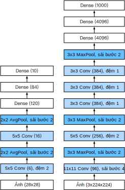

<!-- ===================== Bắt đầu dịch Phần 1 ==================== -->
<!-- ========================================= REVISE PHẦN 1 - BẮT ĐẦU =================================== -->

<!--
# Deep Convolutional Neural Networks (AlexNet)
-->
# Mạng Nơ-ron Tích chập Sâu (AlexNet)
:label:`sec_alexnet`

<!--
Although convolutional neural networks were well known in the computer vision and machine learning communities following the introduction of LeNet, they did not immediately dominate the field.
Although LeNet achieved good results on early small datasets, the performance and feasability of training convolutional networks on larger, more realistic datasets had yet to be established.
In fact, for much of the intervening time between the early 1990s and the watershed results of 2012, neural networks were often surpassed by other machine learning methods, such as support vector machines.
-->

Mặc dù đã trở nên nổi tiếng trong cộng đồng thị giác máy tính và học máy sau khi LeNet được giới thiệu, mạng nơ-ron tích chập chưa lập tức thống trị lĩnh vực này.
Dẫu LeNet đã đạt được kết quả tốt trên những tập dữ liệu nhỏ, chất lượng và tính khả thi của việc huấn luyện mạng tích chập trên một tập dữ liệu lớn và sát thực tế hơn vẫn là một câu hỏi.
Trên thực tế, hầu hết trong khoảng thời gian từ đầu những năm 1990 cho tới năm 2012 với những thành tựu mang tính bước ngoặt, mạng nơ-ron tích chập thường không sánh bằng những phương pháp học máy khác, như Máy Vector hỗ trợ - SVM.

<!--
For computer vision, this comparison is perhaps not fair.
That is although the inputs to convolutional networks consist of raw or lightly-processed (e.g., by centering) pixel values, practitioners would never feed raw pixels into traditional models.
Instead, typical computer vision pipelines consisted of manually engineering feature extraction pipelines.
Rather than *learn the features*, the features were *crafted*.
Most of the progress came from having more clever ideas for features, and the learning algorithm was often relegated to an afterthought.
-->

Với thị giác máy tính, phép so sánh này dường như không công bằng.
Nguyên nhân là do giá trị đầu vào của mạng tích chập chỉ bao gồm giá trị điểm ảnh thô hoặc đã xử lý thô (như định tâm ảnh (*centering*)), và kinh nghiệm cho thấy những giá trị thô này không bao giờ nên dùng trực tiếp trong các mô hình truyền thống.
Thay vào đó, các hệ thống thị giác máy tính cổ điển dùng những pipeline trích xuất đặc trưng một cách thủ công.
Thay vì được *học*, các đặc trưng được *tạo thủ công*.
Hầu hết những tiến triển trong ngành đều đến từ các ý tưởng thông minh hơn trong tạo đặc trưng và ít để ý hơn tới thuật toán học.

<!--
Although some neural network accelerators were available in the 1990s, they were not yet sufficiently powerful to make deep multichannel, 
multilayer convolutional neural networks with a large number of parameters.
Moreover, datasets were still relatively small.
Added to these obstacles, key tricks for training neural networks including parameter initialization heuristics, clever variants of stochastic gradient descent,
non-squashing activation functions, and effective regularization techniques were still missing.
-->

Mặc dù cũng đã có các thiết bị phần cứng tăng tốc độ thực thi mạng nơ-ron vào đầu những năm 1990, chúng vẫn chưa đủ mạnh để triển khai những mạng nơ-ron nhiều kênh, nhiều tầng với số lượng tham số lớn.
Ngoài ra, những tập dữ liệu vẫn còn tương đối nhỏ.
Thêm vào đó, những thủ thuật chính để huấn luyện mạng nơ-ron bao gồm khởi tạo tham số dựa trên thực nghiệm, các biến thể tốt hơn của hạ gradient ngẫu nhiên, hàm kích hoạt không ép (*non-squashing activation functions*), và thiếu các kỹ thuật điều chuẩn hiệu quả.

<!--
Thus, rather than training *end-to-end* (pixel to classification) systems, classical pipelines looked more like this:
-->
Vì vậy, thay vì huấn luyện các hệ thống *đầu-cuối* (từ điểm ảnh đến phân loại), các pipeline cổ điển sẽ thực hiện các bước sau:

<!-- ===================== Kết thúc dịch Phần 1 ===================== -->

<!-- ===================== Bắt đầu dịch Phần 2 ===================== -->

<!--
1. Obtain an interesting dataset. In early days, these datasets required expensive sensors (at the time, 1 megapixel images were state of the art).
2. Preprocess the dataset with hand-crafted features based on some knowledge of optics, geometry, other analytic tools, 
and occasionally on the serendipitous discoveries of lucky graduate students.
3. Feed the data through a standard set of feature extractors such as [SIFT](https://en.wikipedia.org/wiki/Scale-invariant_feature_transform), the Scale-Invariant Feature Transform, 
or [SURF](https://en.wikipedia.org/wiki/Speeded_up_robust_features), the Speeded-Up Robust Features, or any number of other hand-tuned pipelines.
4. Dump the resulting representations into your favorite classifier, likely a linear model or kernel method, to learn a classifier.
-->

1. Thu thập tập dữ liệu đáng chú ý. Trong những ngày đầu, các tập dữ liệu này đòi hỏi các cảm biến đắt tiền (ảnh có 1 triệu điểm ảnh đã được coi là tối tân nhất vào thời điểm đó).
2. Tiền xử lý tập dữ liệu với các đặc trưng được tạo thủ công dựa trên các kiến thức quang học, hình học, các công cụ phân tích khác và thi thoảng dựa trên các khám phá tình cờ của các nghiên cứu sinh.
3. Đưa dữ liệu qua một bộ trích chọn đặc trưng tiêu chuẩn như [SIFT](https://en.wikipedia.org/wiki/Scale-invariant_feature_transform), hoặc [SURF](https://en.wikipedia.org/wiki/Speeded_up_robust_features), hay bất kỳ pipeline được tinh chỉnh thủ công nào. 
4. Dùng các kết quả biểu diễn để huấn luyện một bộ phân loại ưa thích, có thể là một mô hình tuyến tính hoặc phương pháp hạt nhân.

<!--
If you spoke to machine learning researchers, they believed that machine learning was both important and beautiful.
Elegant theories proved the properties of various classifiers.
The field of machine learning was thriving, rigorous and eminently useful.
However, if you spoke to a computer vision researcher, you’d hear a very different story.
The dirty truth of image recognition, they’d tell you, is that features, not learning algorithms, drove progress.
Computer vision researchers justifiably believed that a slightly bigger or cleaner dataset
or a slightly improved feature-extraction pipeline mattered far more to the final accuracy than any learning algorithm.
-->

Khi tiếp xúc với những nhà nghiên cứu học máy, bạn sẽ thấy họ tin rằng học máy không những quan trọng mà còn "đẹp" nữa.
Bởi lẽ có nhiều lý thuyết tinh vi được đưa ra để chứng minh các tính chất của nhiều bộ phân loại.
Và cứ như vậy, lĩnh vực học máy ngày một lớn mạnh, nghiêm ngặt, và hữu dụng hơn bao giờ hết.
Tuy nhiên, nếu có dịp thảo luận với một nhà nghiên cứu thị giác máy tính, thì có thể ta lại được nghe một câu chuyện rất khác.
Họ sẽ nói rằng sự thật trần trụi trong nhận dạng ảnh là "đặc trưng mới mang tính quyết định tới chất lượng chứ không phải thuật toán học".
Những nhà nghiên cứu thị giác máy tính thời đó có lý do để tin rằng chỉ cần một tập dữ liệu hơi lớn hơn, sạch hơn hoặc một pipeline trích xuất đặc trưng tốt hơn một chút sẽ có ảnh hưởng lớn hơn bất kỳ thuật toán học nào.

<!-- ========================================= REVISE PHẦN 1 - KẾT THÚC ===================================-->

<!-- ========================================= REVISE PHẦN 2 - BẮT ĐẦU ===================================-->

<!--
## Learning Feature Representation
-->

## Học Biểu diễn Đặc trưng

<!--
Another way to cast the state of affairs is that the most important part of the pipeline was the representation.
And up until 2012 the representation was calculated mechanically.
In fact, engineering a new set of feature functions, improving results, and writing up the method was a prominent genre of paper.
[SIFT](https://en.wikipedia.org/wiki/Scale-invariant_feature_transform),
[SURF](https://en.wikipedia.org/wiki/Speeded_up_robust_features),
[HOG](https://en.wikipedia.org/wiki/Histogram_of_oriented_gradients),
[Bags of visual words](https://en.wikipedia.org/wiki/Bag-of-words_model_in_computer_vision)
and similar feature extractors ruled the roost.
-->

Nói một cách khác, tại thời điểm đó phần lớn các nhà nghiên cứu tin rằng phần quan trọng nhất của pipeline là sự biểu diễn.
Và cho tới năm 2012 việc biểu diễn vẫn được tính toán một cách máy móc.
Trong thực tế, thiết kế và xây dựng một tập các hàm đặc trưng mới, cải thiện kết quả, và viết ra phương pháp thực hiện từng là một phần quan trọng của các bài báo nghiên cứu.
[SIFT](https://en.wikipedia.org/wiki/Scale-invariant_feature_transform), 
[SURF](https://en.wikipedia.org/wiki/Speeded_up_robust_features), 
[HOG](https://en.wikipedia.org/wiki/Histogram_of_oriented_gradients), 
[Bags of visual words](https://en.wikipedia.org/wiki/Bag-of-words_model_in_computer_vision) 
và các bộ trích chọn đặc trưng tương tự đã chiếm ưu thế vượt trội.

<!--
Another group of researchers, including Yann LeCun, Geoff Hinton, Yoshua Bengio,
Andrew Ng, Shun-ichi Amari, and Juergen Schmidhuber, had different plans.
They believed that features themselves ought to be learned.
Moreover, they believed that to be reasonably complex, the features ought to be hierarchically composed with multiple jointly learned layers, each with learnable parameters.
In the case of an image, the lowest layers might come to detect edges, colors, and textures.
Indeed, :cite:`Krizhevsky.Sutskever.Hinton.2012` proposed a new variant of a convolutional neural network which achieved excellent performance in the ImageNet challenge.
-->

Một nhóm các nhà nghiên cứu bao gồm Yann LeCun, Geoff Hinton, Yoshua Bengio, Andrew Ng, Shun-ichi Amari, và Juergen Schmidhuber, lại có những kế hoạch khác.
Họ tin rằng đặc trưng cũng có thể được học.
Hơn nữa, họ cũng cho rằng để có được độ phức tạp hợp lý, các đặc trưng nên được phân thành thứ lớp với nhiều tầng học cùng nhau, mỗi tầng có các tham số có thể được huấn luyện.
Trong trường hợp ảnh, các tầng thấp nhất có thể dùng để phát hiện biên, màu sắc và đường nét.
Thật vậy, :cite:`Krizhevsky.Sutskever.Hinton.2012` giới thiệu một biến thể mới của mạng nơ-ron tích chập đã đạt được hiệu năng xuất sắc trong cuộc thi ImageNet. 

<!-- ===================== Kết thúc dịch Phần 2 ===================== -->

<!-- ===================== Bắt đầu dịch Phần 3 ===================== -->

<!--
Interestingly in the lowest layers of the network, the model learned feature extractors that resembled some traditional filters.
:numref:`fig_filters` is reproduced from this paper and describes lower-level image descriptors.
-->

Một điều thú vị là ở các tầng thấp nhất của mạng, mô hình đã học được cách trích xuất đặc trưng giống như các bộ lọc truyền thống. 
:numref:`fig_filters` được tái tạo từ bài báo khoa học trên mô tả các đặc trưng cấp thấp của hình ảnh.

<!--

-->


:width:`400px`
:label:`fig_filters`

<!--
Higher layers in the network might build upon these representations to represent larger structures, like eyes, noses, blades of grass, etc.
Even higher layers might represent whole objects like people, airplanes, dogs, or frisbees.
Ultimately, the final hidden state learns a compact representation of the image that summarizes its contents such that data belonging to different categories be separated easily.
-->

Các tầng cao hơn của mạng sẽ dựa vào các biểu diễn này để thể hiện các cấu trúc lớn hơn như mắt, mũi, ngọn cỏ, v.v.
Thậm chí các tầng cao hơn nữa có thể đại diện cho nguyên một vật thể như con người, máy bay, chó hoặc là đĩa ném. 
Sau cùng, tầng trạng thái ẩn cuối sẽ học cách biểu diễn cô đọng của toàn bộ hình ảnh để tổng hợp lại nội dung sao cho dữ liệu thuộc các lớp khác nhau có thể được dễ dàng phân biệt. 


<!--
While the ultimate breakthrough for many-layered convolutional networks came in 2012, 
a core group of researchers had dedicated themselves to this idea, attempting to learn hierarchical representations of visual data for many years.
The ultimate breakthrough in 2012 can be attributed to two key factors.
-->

Mặc dù bước đột phá của các mạng tích chập nhiều tầng xuất hiện vào năm 2012, một nhóm nòng cốt các nhà nghiên cứu đã theo đuổi ý tưởng này, tìm cách học các biểu diễn phân tầng của dữ liệu hình ảnh trong nhiều năm.
Có hai yếu tố chính dẫn tới bước đột phá lớn vào năm 2012. 


<!--
### Missing Ingredient - Data
-->

### Yếu tố bị Thiếu - Dữ liệu

<!--
Deep models with many layers require large amounts of data in order to enter the regime where they significantly outperform traditional methods based on convex optimizations (e.g., linear and kernel methods).
However, given the limited storage capacity of computers, the relative expense of sensors, and the comparatively tighter research budgets in the 1990s, most research relied on tiny datasets.
Numerous papers addressed the UCI collection of datasets, many of which contained only hundreds or (a few) thousands of images captured in unnatural settings with low resolution.
-->

Mô hình học sâu với nhiều tầng đòi hỏi phải có một lượng dữ liệu lớn để đạt hiệu quả vượt trội so với các phương pháp truyền thống dựa trên tối ưu lồi (ví dụ: phương pháp tuyến tính và phương pháp nhân). 
Tuy nhiên, do khả năng lưu trữ của máy tính còn hạn chế, các bộ cảm biến khá đắt đỏ, và ngân sách dành cho việc nghiên cứu tương đối bị thắt chặt vào những năm 1990, phần lớn các nghiên cứu đều dựa trên những bộ dữ liệu nhỏ.
Có rất nhiều bài báo nghiên cứu khoa học giải quyết các vấn đề dựa trên bộ dữ liệu tổng hợp UCI, nhiều bộ dữ liệu trong số đó chỉ chứa khoảng vài trăm hoặc (một vài) ngàn hình ảnh được chụp trong điều kiện không tự nhiên với độ phân giải thấp.

<!--
In 2009, the ImageNet dataset was released, challenging researchers to learn models from 1 million examples, 1,000 each from 1,000 distinct categories of objects.
The researchers, led by Fei-Fei Li, who introduced this dataset leveraged Google Image Search to prefilter large candidate sets for each category 
and employed the Amazon Mechanical Turk crowdsourcing pipeline to confirm for each image whether it belonged to the associated category.
This scale was unprecedented.
The associated competition, dubbed the ImageNet Challenge pushed computer vision and machine learning research forward,
challenging researchers to identify which models performed best at a greater scale than academics had previously considered.
-->

Năm 2009, tập dữ liệu ImageNet được ban hành, thách thức các nhà nghiên cứu huấn luyện những mô hình với 1 triệu hình ảnh, trong đó có 1.000 ảnh cho mỗi 1.000 lớp đối tượng khác nhau.
Các nhà nghiên cứu giới thiệu tập dữ liệu này, dẫn đầu bởi Fei-Fei Li, đã tận dụng công cụ Tìm kiếm Hình ảnh của Google để lọc sơ bộ các tập dữ liệu hình ảnh lớn cho mỗi lớp 
và sử dụng dịch vụ cộng đồng (*crowdsourcing*) Amazon Mechanical Turk để xác thực nhãn cho từng ảnh. 
Đây là quy mô lớn chưa từng có từ trước đến nay. 
Cuộc thi đi liền với tập dữ liệu này được đặt tên là ImageNet Challenge và đã thúc đẩy sự phát triển của nghiên cứu thị giác máy tính và học máy, 
thách thức các nhà nghiên cứu tìm ra mô hình tốt nhất ở quy mô lớn hơn bao giờ hết trong toàn giới học thuật. 

<!-- ===================== Kết thúc dịch Phần 3 ===================== -->

<!-- ===================== Bắt đầu dịch Phần 4 ===================== -->

<!-- ========================================= REVISE PHẦN 2 - KẾT THÚC ===================================-->

<!-- ========================================= REVISE PHẦN 3 - BẮT ĐẦU ===================================-->

<!--
### Missing Ingredient - Hardware
-->

### Yếu tố bị Thiếu - Phần cứng

<!--
Deep learning models are voracious consumers of compute cycles.
Training can take hundreds of epochs, and each iteration requires passing data through many layers of computationally-expensive linear algebra operations.
This is one of the main reasons why in the 90s and early 2000s, simple algorithms based on the more-efficiently optimized convex objectives were preferred.
-->

Các mô hình học sâu đòi hỏi rất nhiều chu kỳ tính toán. 
Quá trình huấn luyện có thể cần hàng trăm epoch, với mỗi vòng lặp yêu cầu đưa dữ liệu qua nhiều tầng nơi các phép toán đại số tuyến tính cồng kềnh được thực thi. 
Đây là một trong những lý do chính tại sao vào những năm 90 tới đầu những năm 2000, các thuật toán đơn giản dựa trên những mục tiêu tối ưu lồi hiệu quả lại được ưa chuộng hơn.

<!--
Graphical processing units (GPUs) proved to be a game changer in make deep learning feasible.
These chips had long been developed for accelerating graphics processing to benefit computer games.
In particular, they were optimized for high throughput 4x4 matrix-vector products, which are needed for many computer graphics tasks.
Fortunately, this math is strikingly similar to that required to calculate convolutional layers.
Around that time, NVIDIA and ATI had begun optimizing GPUs for general compute operations, going as far as to market them as General Purpose GPUs (GPGPU).
-->

Bộ xử lý đồ hoạ (GPU) đóng vai trò thay đổi hoàn toàn cuộc chơi khi làm cho việc học sâu trở nên khả thi.
Những vi xử lý này đã được phát triển một thời gian dài để tăng tốc độ xử lý đồ họa dành cho các trò chơi máy tính. 
Cụ thể, chúng được tối ưu hoá cho các phép nhân ma trận - vector 4x4 thông lượng cao, cần thiết cho nhiều tác vụ đồ hoạ. 
May mắn thay, phép toán này rất giống với phép toán sử dụng trong các tầng tích chập. 
Trong khoảng thời gian này, hai công ty NVIDIA và ATI đã bắt đầu tối ưu GPU cho mục đích tính toán tổng quát, thậm chí còn tiếp thị chúng dưới dạng GPU đa dụng (*General Purpose GPUs - GPGPU*).

<!--
To provide some intuition, consider the cores of a modern microprocessor (CPU).
Each of the cores is fairly powerful running at a high clock frequency and sporting large caches (up to several MB of L3).
Each core is well-suited to executing a wide range of instructions, with branch predictors, a deep pipeline, and other bells and whistles that enable it to run a large variety of programs.
This apparent strength, however, is also its Achilles heel: general purpose cores are very expensive to build.
They require lots of chip area, a sophisticated support structure (memory interfaces, caching logic between cores, high speed interconnects, etc.),
and they are comparatively bad at any single task.
Modern laptops have up to 4 cores, and even high end servers rarely exceed 64 cores, simply because it is not cost effective.
-->

Để hình dung rõ hơn, hãy cùng xem lại các nhân của bộ vi xử lý CPU hiện đại.
Mỗi nhân thì khá mạnh khi chạy ở tần số xung nhịp cao với bộ nhớ đệm lớn (lên đến vài MB ở bộ nhớ đệm L3).
Mỗi nhân phù hợp với việc thực hiện hàng loạt các loại chỉ dẫn khác nhau, với các bộ dự báo rẽ nhánh, một pipeline sâu và những tính năng phụ trợ khác cho phép nó có khả năng chạy một lượng lớn các chương trình khác nhau.
Tuy nhiên, sức mạnh rõ rệt này cũng có điểm yếu: sản xuất các nhân đa dụng rất đắt đỏ. 
Chúng đòi hỏi nhiều diện tích cho vi xử lý, cùng cấu trúc hỗ trợ phức tạp (giao diện bộ nhớ, logic bộ nhớ đệm giữa các nhân, kết nối tốc độ cao, v.v.), và chúng tương đối tệ ở bất kỳ tác vụ đơn lẻ nào. 
Những máy tính xách tay ngày nay chỉ có tới 4 nhân, và thậm chí những máy chủ cao cấp hiếm khi vượt quá 64 nhân, đơn giản bởi vì chúng không hiệu quả về chi phí.

<!--
By comparison, GPUs consist of 100-1000 small processing elements (the details differ somewhat between NVIDIA, ATI, ARM and other chip vendors), 
often grouped into larger groups (NVIDIA calls them warps).
While each core is relatively weak, sometimes even running at sub-1GHz clock frequency, 
it is the total number of such cores that makes GPUs orders of magnitude faster than CPUs.
For instance, NVIDIA's latest Volta generation offers up to 120 TFlops per chip for specialized instructions (and up to 24 TFlops for more general purpose ones), 
while floating point performance of CPUs has not exceeded 1 TFlop to date.
The reason for why this is possible is actually quite simple: first, power consumption tends to grow *quadratically* with clock frequency.
Hence, for the power budget of a CPU core that runs 4x faster (a typical number), you can use 16 GPU cores at 1/4 the speed, which yields 16 x 1/4 = 4x the performance.
Furthermore, GPU cores are much simpler (in fact, for a long time they were not even *able* to execute general purpose code), which makes them more energy efficient.
Last, many operations in deep learning require high memory bandwidth.
Again, GPUs shine here with buses that are at least 10x as wide as many CPUs.
-->

Để so sánh, GPU bao gồm 100-1000 các phần tử xử lý nhỏ (về chi tiết có khác nhau đôi chút giữa NVIDIA, ATI, ARM và các nhà sản xuất khác), 
thường được gộp thành các nhóm lớn hơn (NVIDIA gọi các nhóm này là luồng (*warp*)). 
Mặc dù mỗi nhân thì tương đối yếu, đôi khi thậm chí chạy ở tần số xung nhịp dưới 1GHZ,
nhưng số lượng của những nhân này giúp cho GPUs có tốc độ nhanh hơn rất nhiều so với CPUs.
Chẳng hạn, thế hệ Volta mới nhất của NVIDIA có thể thực hiện tới 120 nghìn tỷ phép toán dấu phẩy động (TFlop) với mỗi vi xử lý cho những lệnh chuyên biệt (và lên tới 24 TFlop cho các lệnh đa dụng), 
trong khi hiệu năng của CPU trong việc thực hiện tính toán số thực dấu phẩy động cho đến nay không vượt quá 1 TFlop. 
Lý do khá đơn giản: thứ nhất, mức độ tiêu thụ năng lượng có xu hướng tăng theo hàm bậc hai so với tần số xung nhịp.
Do đó, với cùng lượng năng lượng để một nhân CPU chạy nhanh gấp 4 lần tốc độ hiện tại (mức tăng thường gặp), chúng ta có thể thay bằng 16 nhân GPU với tốc độ mỗi nhân giảm còn 1/4, cũng sẽ cho kết quả là 16 x 1/4 = 4 lần tốc độ hiện tại. 
Hơn nữa, các nhân của GPU thì đơn giản hơn nhiều (trên thực tế, trong một khoảng thời gian dài những nhân này thậm chí *không thể* thực thi được các mã lệnh đa dụng), điều này giúp chúng tiết kiệm năng lượng hơn.
Cuối cùng, nhiều phép tính trong quá trình học sâu đòi hỏi bộ nhớ băng thông cao.
Và một lần nữa, GPUs tỏa sáng khi độ rộng đường bus của nó lớn hơn ít nhất 10 lần so với nhiều loại CPUs. 

<!-- ===================== Kết thúc dịch Phần 4 ===================== -->

<!-- ===================== Bắt đầu dịch Phần 5 ===================== -->

<!--
Back to 2012. A major breakthrough came when Alex Krizhevsky and Ilya Sutskever implemented a deep convolutional neural network that could run on GPU hardware.
They realized that the computational bottlenecks in CNNs (convolutions and matrix multiplications) are all operations that could be parallelized in hardware.
Using two NVIDIA GTX 580s with 3GB of memory, they implemented fast convolutions.
The code [cuda-convnet](https://code.google.com/archive/p/cuda-convnet/) was good enough that for several years it was the industry standard and powered the first couple years of the deep learning boom.
-->
Quay trở lại năm 2012. Một bước đột phá lớn khi Alex Krizhevsky và Ilya Sutskever đã xây dựng thành công một mạng nơ-ron tích chập sâu có thể chạy trên phần cứng GPU.
Họ nhận ra rằng nút thắt cổ chai khi tính toán trong CNN (phép nhân tích chập và ma trận) có thể được xử lý song song trên phần cứng.
Sử dụng hai card đồ họa NVIDIA GTX 580s với 3GB bộ nhớ, họ đã xây dựng các phép toán tích chập nhanh.
Phần mã nguồn [cuda-convnet](https://code.google.com/archive/p/cuda-convnet/) được xem là ngòi nổ cho sự phát triển vượt bậc của học sâu ngày nay. 

<!--
## AlexNet
-->
## Mạng AlexNet

<!--
AlexNet was introduced in 2012, named after Alex Krizhevsky, the first author of the breakthrough ImageNet classification paper :cite:`Krizhevsky.Sutskever.Hinton.2012`.
AlexNet, which employed an 8-layer convolutional neural network, won the ImageNet Large Scale Visual Recognition Challenge 2012 by a phenomenally large margin.
This network proved, for the first time, that the features obtained by learning can transcend manually-design features, breaking the previous paradigm in computer vision.
The architectures of AlexNet and LeNet are *very similar*, as :numref:`fig_alexnet` illustrates.
Note that we provide a slightly streamlined version of AlexNet removing some of the design quirks that were needed in 2012 to make the model fit on two small GPUs.
-->

Mạng AlexNet được giới thiệu vào năm 2012, được đặt theo tên của Alex Krizhevsky, tác giả thứ nhất của bài báo đột phá trong phân loại ImageNet :cite:`Krizhevsky.Sutskever.Hinton.2012`. 
Mạng AlexNet bao gồm 8 tầng mạng nơ-ron tích chập, đã chiến thắng cuộc thi **ImageNet Large Scale Visual Recognition Challenge** năm 2012 với cách biệt không tưởng.
AlexNet lần đầu tiên đã chứng minh được rằng các đặc trưng thu được bởi việc học có thể vượt qua các đặc trưng được thiết kế thủ công, phá vỡ định kiến trước đây trong nghiên cứu thị giác máy tính. 
Cấu trúc mạng AlexNet và LeNet *rất giống nhau*, như :numref:`fig_alexnet` đã minh họa. 
Lưu ý rằng chúng tôi cung cấp một phiên bản AlexNet được sắp xếp hợp lý, loại bỏ một số điểm thiết kế có từ năm 2012 với mục đích làm cho mô hình phù hợp với hai GPU dung lượng nhỏ mà bây giờ đã không còn cần thiết. 


<!--

-->

:label:`fig_alexnet`

<!--
The design philosophies of AlexNet and LeNet are very similar, but there are also significant differences.
First, AlexNet is much deeper than the comparatively small LeNet5.
AlexNet consists of eight layers: five convolutional layers, two fully-connected hidden layers, and one fully-connected output layer.
Second, AlexNet used the ReLU instead of the sigmoid as its activation function.
Let us delve into the details below.
-->

Các triết lý thiết kế của AlexNet và LeNet rất giống nhau, nhưng cũng có những khác biệt đáng kể. 
Đầu tiên, AlexNet sâu hơn nhiều so với LeNet5. 
AlexNet có tám tầng gồm: năm tầng tích chập, hai tầng ẩn kết nối đầy đủ, và một tầng đầu ra kết nối đầy đủ. 
Thứ hai, AlexNet sử dụng ReLU thay vì sigmoid làm hàm kích hoạt.
Chúng tôi sẽ đi sâu hơn vào chi tiết ở dưới đây.


<!-- ===================== Kết thúc dịch Phần 5 ===================== -->

<!-- ===================== Bắt đầu dịch Phần 6 ===================== -->

<!-- ========================================= REVISE PHẦN 3 - KẾT THÚC ===================================-->

<!-- ========================================= REVISE PHẦN 4 - BẮT ĐẦU ===================================-->

<!--
### Architecture
-->

### Kiến trúc

<!--
In AlexNet's first layer, the convolution window shape is $11\times11$.
Since most images in ImageNet are more than ten times higher and wider than the MNIST images, objects in ImageNet data tend to occupy more pixels.
Consequently, a larger convolution window is needed to capture the object.
The convolution window shape in the second layer is reduced to $5\times5$, followed by $3\times3$.
In addition, after the first, second, and fifth convolutional layers, the network adds maximum pooling layers with a window shape of $3\times3$ and a stride of 2.
Moreover, AlexNet has ten times more convolution channels than LeNet.
-->

Trong tầng thứ nhất của AlexNet, kích thước cửa sổ tích chập là $11\times11$. 
Vì hầu hết các ảnh trong ImageNet đều có chiều cao và chiều rộng lớn gấp hơn mười lần so với các ảnh trong MNIST, các vật thể trong dữ liệu ImageNet thường có xu hướng chiếm nhiều điểm ảnh hơn.
Do đó, ta cần sử dụng một cửa sổ tích chập lớn hơn để xác định được các vật thể này. 
Kích thước cửa sổ tích chập trong tầng thứ hai được giảm xuống còn $5\times5$ và sau đó là $3\times3$.
Ngoài ra, theo sau các tầng chập thứ nhất, thứ hai và thứ năm là các tầng gộp cực đại với kích thước cửa sổ là $3\times3$ và sải bước bằng 2. 
Hơn nữa, số lượng các kênh tích chập trong AlexNet nhiều hơn gấp mười lần so với LeNet. 

<!--
After the last convolutional layer are two fully-connected layers with 4096 outputs.
These two huge fully-connected layers produce model parameters of nearly 1 GB.
Due to the limited memory in early GPUs, the original AlexNet used a dual data stream design, so that each of their two GPUs could be responsible for storing and computing only its half of the model.
Fortunately, GPU memory is comparatively abundant now, so we rarely need to break up models across GPUs these days (our version of the AlexNet model deviates from the original paper in this aspect).
-->

Sau tầng tích chập cuối cùng là hai tầng kết nối đầy đủ với 4096 đầu ra. 
Hai tầng này tạo ra tới gần 1 GB các tham số mô hình.
Do các GPU thế hệ trước bị giới hạn về bộ nhớ, phiên bản gốc của AlexNet sử dụng thiết kế luồng dữ liệu kép cho hai GPU, trong đó mỗi GPU chỉ phải chịu trách nhiệm lưu trữ và tính toán cho một nửa mô hình. 
May mắn thay, hiện nay các GPU có bộ nhớ tương đối dồi dào, vì vậy ta hiếm khi cần phải chia nhỏ mô hình trên các GPU (phiên bản mô hình AlexNet của ta khác với bài báo ban đầu ở khía cạnh này). 

<!--
### Activation Functions
-->

### Các hàm Kích hoạt

<!--
Second, AlexNet changed the sigmoid activation function to a simpler ReLU activation function.
On the one hand, the computation of the ReLU activation function is simpler.
For example, it does not have the exponentiation operation found in the sigmoid activation function.
On the other hand, the ReLU activation function makes model training easier when using different parameter initialization methods.
This is because, when the output of the sigmoid activation function is very close to 0 or 1, the gradient of these regions is almost 0, 
so that back propagation cannot continue to update some of the model parameters.
In contrast, the gradient of the ReLU activation function in the positive interval is always 1.
Therefore, if the model parameters are not properly initialized, the sigmoid function may obtain a gradient of almost 0 in the positive interval, 
so that the model cannot be effectively trained.
-->

Thứ hai, AlexNet đã thay hàm kích hoạt sigmoid bằng hàm kích hoạt ReLU đơn giản hơn.
Một mặt là giảm việc tính toán, bởi ReLu không có phép lũy thừa như trong hàm kích hoạt sigmoid.
Mặt khác, hàm kích hoạt ReLU giúp cho việc huấn luyện mô hình trở nên dễ dàng hơn khi sử dụng các phương thức khởi tạo tham số khác nhau.
Điều này là do khi đầu ra của hàm kích hoạt sigmoid rất gần với 0 hoặc 1 thì gradient sẽ gần như bằng 0,
vì vậy khiến cho lan truyền ngược không thể tiếp tục cập nhật một số tham số mô hình.
Ngược lại, gradient của hàm kích hoạt ReLU trong khoảng dương luôn bằng 1.
Do đó, nếu các tham số mô hình không được khởi tạo đúng cách thì hàm sigmoid có thể có gradient gần bằng 0 trong khoảng dương, dẫn đến việc mô hình không được huấn luyện một cách hiệu quả. 

<!-- ===================== Kết thúc dịch Phần 6 ===================== -->

<!-- ===================== Bắt đầu dịch Phần 7 ===================== -->

<!--
### Capacity Control and Preprocessing
-->

### Kiểm soát năng lực mô hình và Tiền xử lý

<!--
AlexNet controls the model complexity of the fully-connected layer by dropout (:numref:`sec_dropout`), while LeNet only uses weight decay.
To augment the data even further, the training loop of AlexNet added a great deal of image augmentation, such as flipping, clipping, and color changes.
This makes the model more robust and the larger sample size effectively reduces overfitting.
We will discuss data augmentation in greater detail in :numref:`sec_image_augmentation`.
-->

AlexNet kiểm soát năng lực của tầng kết nối đầy đủ bằng cách áp dụng dropout (:numref:`sec_dropout`), trong khi LeNet chỉ sử dụng suy giảm trọng số.
Để tăng cường dữ liệu thì trong quá trình huấn luyện, AlexNet đã bổ sung rất nhiều kỹ thuật tăng cường hình ảnh chẳng hạn như lật, cắt hay thay đổi màu sắc.
Điều này giúp cho mô hình trở nên mạnh mẽ hơn, cùng với đó kích thước dữ liệu lớn hơn giúp làm giảm hiện tượng quá khớp một cách hiệu quả.
Ta sẽ thảo luận chi tiết hơn về việc tăng cường dữ liệu trong :numref:`sec_image_augmentation`.

```{.python .input  n=1}
from d2l import mxnet as d2l
from mxnet import np, npx
from mxnet.gluon import nn
npx.set_np()

net = nn.Sequential()
# Here, we use a larger 11 x 11 window to capture objects. At the same time,
# we use a stride of 4 to greatly reduce the height and width of the output.
# Here, the number of output channels is much larger than that in LeNet
net.add(nn.Conv2D(96, kernel_size=11, strides=4, activation='relu'),
        nn.MaxPool2D(pool_size=3, strides=2),
        # Make the convolution window smaller, set padding to 2 for consistent
        # height and width across the input and output, and increase the
        # number of output channels
        nn.Conv2D(256, kernel_size=5, padding=2, activation='relu'),
        nn.MaxPool2D(pool_size=3, strides=2),
        # Use three successive convolutional layers and a smaller convolution
        # window. Except for the final convolutional layer, the number of
        # output channels is further increased. Pooling layers are not used to
        # reduce the height and width of input after the first two
        # convolutional layers
        nn.Conv2D(384, kernel_size=3, padding=1, activation='relu'),
        nn.Conv2D(384, kernel_size=3, padding=1, activation='relu'),
        nn.Conv2D(256, kernel_size=3, padding=1, activation='relu'),
        nn.MaxPool2D(pool_size=3, strides=2),
        # Here, the number of outputs of the fully connected layer is several
        # times larger than that in LeNet. Use the dropout layer to mitigate
        # overfitting
        nn.Dense(4096, activation="relu"), nn.Dropout(0.5),
        nn.Dense(4096, activation="relu"), nn.Dropout(0.5),
        # Output layer. Since we are using Fashion-MNIST, the number of
        # classes is 10, instead of 1000 as in the paper
        nn.Dense(10))
```

<!--
We construct a single-channel data instance with both height and width of 224 to observe the output shape of each layer.
It matches our diagram above.
-->

Ta sẽ tạo một thực thể dữ liệu đơn kênh với chiều cao và chiều rộng đều bằng 224 để quan sát kích thước đầu ra của mỗi tầng. 
Kết quả in ra khớp với sơ đồ bên trên. 

```{.python .input  n=2}
X = np.random.uniform(size=(1, 1, 224, 224))
net.initialize()
for layer in net:
    X = layer(X)
    print(layer.name, 'output shape:\t', X.shape)
```

<!-- ========================================= REVISE PHẦN 4 - KẾT THÚC ===================================-->

<!-- ========================================= REVISE PHẦN 5 - BẮT ĐẦU ===================================-->

<!--
## Reading the Dataset
-->

## Đọc Tập dữ liệu

<!--
Although AlexNet uses ImageNet in the paper, we use Fashion-MNIST here since training an ImageNet model to convergence could take hours or days even on a modern GPU.
One of the problems with applying AlexNet directly on Fashion-MNIST is that our images are lower resolution ($28 \times 28$ pixels) than ImageNet images.
To make things work, we upsample them to $224 \times 224$ (generally not a smart practice, but we do it here to be faithful to the AlexNet architecture).
We perform this resizing with the `resize` argument in `load_data_fashion_mnist`.
-->

Mặc dù AlexNet sử dụng ImageNet trong bài báo nêu trên, ở đây ta sẽ sử dụng Fashion-MNIST vì ngay cả với một GPU hiện đại thì việc huấn luyện một mô hình trên ImageNet có thể mất nhiều giờ hoặc nhiều ngày để hội tụ. 
Một trong những vấn đề khi áp dụng AlexNet trực tiếp trên Fashion-MNIST là các ảnh trong tập dữ liệu này có độ phân giải thấp hơn ($28 \times 28$ điểm ảnh) so với các ảnh trong ImageNet. 
Để có thể tiến hành được thử nghiệm, ta sẽ nâng kích thước ảnh lên $224 \times 224$ (nói chung đây không phải là một giải pháp thông minh, nhưng ta cần làm việc này để có thể sử dụng kiến trúc gốc của AlexNet).
Việc thay đổi kích thước có thể được thực hiện thông qua đối số `resize` trong hàm `load_data_fashion_mnist`.


```{.python .input  n=3}
batch_size = 128
train_iter, test_iter = d2l.load_data_fashion_mnist(batch_size, resize=224)
```

<!-- ===================== Kết thúc dịch Phần 7 ===================== -->

<!-- ===================== Bắt đầu dịch Phần 8 ===================== -->

<!--
## Training
-->

## Huấn luyện

<!--
Now, we can start training AlexNet.
Compared to LeNet in the previous section, the main change here is the use of a smaller learning rate and much slower training due to the deeper and wider network, 
the higher image resolution and the more costly convolutions.
-->

Bây giờ, ta có thể bắt đầu quá trình huấn luyện AlexNet. 
So với LeNet, thay đổi chính ở đây là việc sử dụng tốc độ học nhỏ hơn và quá trình huấn luyện chậm hơn nhiều do tính chất sâu và rộng hơn của mạng, 
đồng thời do độ phân giải hình ảnh cao hơn và việc tính toán các phép tích chập tốn kém hơn. 

```{.python .input  n=5}
lr, num_epochs = 0.01, 10
d2l.train_ch6(net, train_iter, test_iter, num_epochs, lr)
```

<!--
## Summary
-->

## Tóm tắt

<!--
* AlexNet has a similar structure to that of LeNet, but uses more convolutional layers and a larger parameter space to fit the large-scale dataset ImageNet.
* Today AlexNet has been surpassed by much more effective architectures but it is a key step from shallow to deep networks that are used nowadays.
* Although it seems that there are only a few more lines in AlexNet's implementation than in LeNet, it took the academic community many years to embrace this conceptual change and take advantage of its excellent experimental results. This was also due to the lack of efficient computational tools.
* Dropout, ReLU and preprocessing were the other key steps in achieving excellent performance in computer vision tasks.
-->

* AlexNet có cấu trúc tương tự như LeNet, nhưng sử dụng nhiều tầng tích chập hơn với không gian tham số lớn hơn để khớp tập dữ liệu ImageNet với kích thước lớn. 
* Ngày nay AlexNet đã bị vượt qua bởi các kiến trúc hiệu quả hơn nhiều nhưng nó là một bước quan trọng để đi từ các mạng nông đến các mạng sâu được sử dụng ngày nay. 
* Mặc dù có vẻ như chỉ tốn thêm một vài dòng trong mã nguồn của AlexNet so với LeNet, nhưng cộng đồng học thuật đã phải mất nhiều năm 
để đón nhận sự thay đổi khái niệm này và tận dụng những kết quả thực nghiệm tuyệt vời của nó. Một phần cũng do sự thiếu thốn của các công cụ tính toán hiệu quả. 
* Dropout, ReLU và tiền xử lý là những bước quan trọng khác để đạt được kết quả xuất sắc trong các bài toán thị giác máy tính. 

<!--
## Exercises
-->

## Bài tập

<!--
1. Try increasing the number of epochs. Compared with LeNet, how are the results different? Why?
2. AlexNet may be too complex for the Fashion-MNIST dataset.
    * Try to simplify the model to make the training faster, while ensuring that the accuracy does not drop significantly.
    * Can you design a better model that works directly on $28 \times 28$ images.
3. Modify the batch size, and observe the changes in accuracy and GPU memory.
4. Rooflines:
    * What is the dominant part for the memory footprint of AlexNet?
    * What is the dominant part for computation in AlexNet?
    * How about memory bandwidth when computing the results?
5. Apply dropout and ReLU to LeNet5. Does it improve? How about preprocessing?
-->

1. Thử tăng số lượng epoch và xem kết quả khác như thế nào so với LeNet? Tại sao lại có sự khác nhau như vậy? 
2. AlexNet có thể là quá phức tạp đối với tập dữ liệu Fashion-MNIST. Vậy: 
    * Hãy thử đơn giản hóa mô hình để làm cho việc huấn luyện trở nên nhanh hơn nhưng đồng thời vẫn đảm bảo độ chính xác không bị giảm đi đáng kể. 
    * Hãy thử thiết kế một mô hình tốt hơn có thể hoạt động trực tiếp trên các ảnh có kích thước $28 \times 28$. 
3. Điều chỉnh kích thước batch và quan sát các thay đổi về độ chính xác và việc tiêu thụ bộ nhớ GPU. 
4. Băng thông bộ nhớ hoạt động như thế nào khi tính toán các kết quả? Phần nào trong thiết kế của AlexNet có ảnh hưởng lớn đến:
    * Việc sử dụng bộ nhớ của mạng này?
    * Sự tính toán của mạng này?
5. Khi áp dụng dropout và ReLU cho LeNet5, độ chính xác của mô hình có được cải thiện hay không? Dữ liệu được tiền xử lý như thế nào? 

<!-- ===================== Kết thúc dịch Phần 8 ===================== -->
<!-- ========================================= REVISE PHẦN 5 - KẾT THÚC ===================================-->


## Thảo luận
* [Tiếng Anh](https://discuss.mxnet.io/t/2354)
* [Tiếng Việt](https://forum.machinelearningcoban.com/c/d2l)

## Những người thực hiện
Bản dịch trong trang này được thực hiện bởi:

* Đoàn Võ Duy Thanh
* Vũ Hữu Tiệp
* Nguyễn Cảnh Thướng
* Phạm Hồng Vinh
* Nguyễn Đình Nam
* Nguyễn Mai Hoàng Long
* Nguyễn Lê Quang Nhật
* Đinh Đắc
* Nguyễn Văn Cường
* Lê Khắc Hồng Phúc
* Phạm Minh Đức
* Nguyễn Thành Nhân