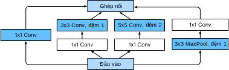

<!-- ===================== Bắt đầu dịch Phần 1 ==================== -->
<!-- ========================================= REVISE PHẦN 1 - BẮT ĐẦU =================================== -->

<!--
# Networks with Parallel Concatenations (GoogLeNet)
-->

# Mạng nối song song (GoogLeNet)
:label:`sec_googlenet`

<!--
In 2014, :cite:`Szegedy.Liu.Jia.ea.2015` won the ImageNet Challenge, proposing a structure that combined the strengths of the NiN and repeated blocks paradigms.
One focus of the paper was to address the question of which sized convolutional kernels are best.
After all, previous popular networks employed choices as small as $1 \times 1$ and as large as $11 \times 11$.
One insight in this paper was that sometimes it can be advantageous to employ a combination of variously-sized kernels.
In this section, we will introduce GoogLeNet, presenting a slightly simplified version of the original model---we
omit a few ad hoc features that were added to stabilize training but are unnecessary now with better training algorithms available.
-->

Vào năm 2014, bài báo khoa học :cite:`Szegedy.Liu.Jia.ea.2015` đã giành chiến thắng ở cuộc thi ImageNet, bằng việc đề xuất một cấu trúc kết hợp những điểm mạnh của mô hình NiN và mô hình chứa các khối lặp lại.
Bài báo này tập trung giải quyết câu hỏi: kích thước nào của bộ lọc tích chập là tốt nhất.
Suy cho cùng, các mạng phổ biến trước đây chọn kích thước bộ lọc từ nhỏ như $1 \times 1$ tới lớn như $11 \times 11$.
Một góc nhìn sâu sắc trong bài báo này là đôi khi việc kết hợp các bộ lọc có kích thước khác nhau có thể sẽ hiệu quả.
Trong phần này, chúng tôi sẽ giới thiệu mô hình GoogLeNet, bằng việc trình bày một phiên bản đơn giản hơn một chút so với phiên bản gốc---bỏ qua một số tính năng đặc biệt trước đây được thêm vào nhằm ổn định quá trình huấn luyện nhưng hiện nay không cần thiết nữa do đã có các thuật toán huấn luyện tốt hơn.

<!--
## Inception Blocks
-->

## Khối Inception

<!--
The basic convolutional block in GoogLeNet is called an Inception block,
likely named due to a quote from the movie Inception ("We Need To Go Deeper"), which launched a viral meme.
-->

Khối tích chập cơ bản trong mô hình GoogLeNet được gọi là Inception, 
nhiều khả năng được đặt tên dựa theo câu nói "Chúng ta cần đi sâu hơn" ("_We Need To Go Deeper_") trong bộ phim Inception, sau này đã tạo ra một trào lưu lan rộng trên internet.

<!--

-->


<!--
As depicted in the figure above, the inception block consists of four parallel paths.
The first three paths use convolutional layers with window sizes of $1\times 1$, $3\times 3$, and $5\times 5$ to extract information from different spatial sizes.
The middle two paths perform a $1\times 1$ convolution on the input to reduce the number of input channels, reducing the model's complexity.
The fourth path uses a $3\times 3$ maximum pooling layer, followed by a $1\times 1$ convolutional layer to change the number of channels.
The four paths all use appropriate padding to give the input and output the same height and width.
Finally, the outputs along each path are concatenated along the channel dimension and comprise the block's output.
The commonly-tuned parameters of the Inception block are the number of output channels per layer.
-->

Như mô tả ở hình trên, khối inception bao gồm bốn nhánh song song với nhau. 
Ba nhánh đầu sử dụng các tầng tích chập với kích thước cửa sổ trượt lần lượt là $1\times 1$, $3\times 3$, và $5\times 5$ để trích xuất thông tin từ các vùng không gian có kích thước khác nhau. 
Hai nhánh giữa thực hiện phép tích chập $1\times 1$ trên dữ liệu đầu vào để giảm số kênh đầu vào, từ đó giảm độ phức tạp của mô hình.
Nhánh thứ tư sử dụng một tầng gộp cực đại kích thước $3\times 3$, theo sau là một tầng tích chập $1\times 1$ để thay đổi số lượng kênh. 
Cả bốn nhánh sử dụng phần đệm phù hợp để đầu vào và đầu ra của khối có cùng chiều cao và chiều rộng.
Cuối cùng, các đầu ra của mỗi nhánh sẽ được nối lại theo chiều kênh để tạo thành đầu ra của cả khối.
Các tham số thường được tinh chỉnh của khối Inception là số lượng kênh đầu ra mỗi tầng.

<!-- ===================== Kết thúc dịch Phần 1 ===================== -->

<!-- ===================== Bắt đầu dịch Phần 2 ===================== -->

```{.python .input  n=1}
from d2l import mxnet as d2l
from mxnet import np, npx
from mxnet.gluon import nn
npx.set_np()

class Inception(nn.Block):
    # c1 - c4 are the number of output channels for each layer in the path
    def __init__(self, c1, c2, c3, c4, **kwargs):
        super(Inception, self).__init__(**kwargs)
        # Path 1 is a single 1 x 1 convolutional layer
        self.p1_1 = nn.Conv2D(c1, kernel_size=1, activation='relu')
        # Path 2 is a 1 x 1 convolutional layer followed by a 3 x 3
        # convolutional layer
        self.p2_1 = nn.Conv2D(c2[0], kernel_size=1, activation='relu')
        self.p2_2 = nn.Conv2D(c2[1], kernel_size=3, padding=1,
                              activation='relu')
        # Path 3 is a 1 x 1 convolutional layer followed by a 5 x 5
        # convolutional layer
        self.p3_1 = nn.Conv2D(c3[0], kernel_size=1, activation='relu')
        self.p3_2 = nn.Conv2D(c3[1], kernel_size=5, padding=2,
                              activation='relu')
        # Path 4 is a 3 x 3 maximum pooling layer followed by a 1 x 1
        # convolutional layer
        self.p4_1 = nn.MaxPool2D(pool_size=3, strides=1, padding=1)
        self.p4_2 = nn.Conv2D(c4, kernel_size=1, activation='relu')

    def forward(self, x):
        p1 = self.p1_1(x)
        p2 = self.p2_2(self.p2_1(x))
        p3 = self.p3_2(self.p3_1(x))
        p4 = self.p4_2(self.p4_1(x))
        # Concatenate the outputs on the channel dimension
        return np.concatenate((p1, p2, p3, p4), axis=1)
```

<!--
To gain some intuition for why this network works so well, consider the combination of the filters.
They explore the image in varying ranges.
This means that details at different extents can be recognized efficiently by different filters.
At the same time, we can allocate different amounts of parameters for different ranges (e.g., more for short range but not ignore the long range entirely).
-->

Để hiểu trực quan tại sao mạng này hoạt động tốt, hãy cùng tìm hiểu sự kết hợp của các bộ lọc.
Chúng khám phá hình ảnh trên các vùng có kích thước khác nhau. 
Tức là những chi tiết ở những mức độ khác nhau sẽ được nhận diện một cách hiệu quả bằng các bộ lọc khác nhau.
Đồng thời, chúng ta có thể phân bổ số lượng tham số khác nhau cho những vùng có phạm vi khác nhau (ví dụ: nhiều tham số hơn cho vùng phạm vi nhỏ nhưng không bỏ qua hoàn toàn vùng phạm vi lớn).

<!-- ========================================= REVISE PHẦN 1 - KẾT THÚC ===================================-->

<!-- ========================================= REVISE PHẦN 2 - BẮT ĐẦU ===================================-->

<!--
## GoogLeNet Model
-->

## Mô hình GoogLeNet

<!--
As shown in :numref:`fig_inception_full`, GoogLeNet uses a stack of a total of 9 inception blocks and global average pooling to generate its estimates.
Maximum pooling between inception blocks reduced the dimensionality.
The first part is identical to AlexNet and LeNet, the stack of blocks is inherited from VGG and the global average pooling avoids a stack of fully-connected layers at the end.
The architecture is depicted below.
-->

Như trình bày ở :numref:`fig_inception_full`, mô hình GoogLeNet sử dụng tổng cộng 9 khối inception và tầng gộp trung bình toàn cục xếp chồng lên nhau. 
Phép gộp cực đại giữa các khối inception có tác dụng làm giảm kích thước chiều. 
Phần đầu tiên của GoogleNet giống AlexNet và LeNet, có các khối xếp chồng lên nhau kế thừa từ thiết kế của VGG và phép gộp trung bình toàn cục giúp tránh phải sử dụng nhiều tầng kết nối đầy đủ liên tiếp ở cuối. 
Cấu trúc của mô hình được mô tả như dưới đây.

<!--

-->


:label:`fig_inception_full`

<!--
We can now implement GoogLeNet piece by piece.
The first component uses a 64-channel 7×7 convolutional layer.
-->

Bây giờ chúng ta có thể lập trình GoogLeNet theo từng phần.
Thành phần đầu tiên sử dụng một tầng tích chập đầu ra 64 kênh và cửa sổ trượt kích thước $7\times 7$.

```{.python .input  n=2}
b1 = nn.Sequential()
b1.add(nn.Conv2D(64, kernel_size=7, strides=2, padding=3, activation='relu'),
       nn.MaxPool2D(pool_size=3, strides=2, padding=1))
```

<!--
The second component uses two convolutional layers: first, a 64-channel $1\times 1$ convolutional layer,
then a $3\times 3$ convolutional layer that triples the number of channels.
This corresponds to the second path in the Inception block.
-->

Thành phần thứ hai sử dụng hai tầng tích chập: tầng đầu tiên có đầu ra 64 kênh và cửa sổ $1\times 1$, 
tiếp theo là một tầng có cửa sổ $3\times 3$ và số kênh đầu ra gấp ba lần số kênh đầu vào. 
Phần này giống với nhánh thứ hai trong khối Inception.

```{.python .input  n=3}
b2 = nn.Sequential()
b2.add(nn.Conv2D(64, kernel_size=1, activation='relu'),
       nn.Conv2D(192, kernel_size=3, padding=1, activation='relu'),
       nn.MaxPool2D(pool_size=3, strides=2, padding=1))
```

<!-- ===================== Kết thúc dịch Phần 2 ===================== -->

<!-- ===================== Bắt đầu dịch Phần 3 ===================== -->

<!--
The third component connects two complete Inception blocks in series.
The number of output channels of the first Inception block is $64+128+32+32=256$, and the ratio to the output channels of the four paths is $64:128:32:32=2:4:1:1$.
The second and third paths first reduce the number of input channels to $96/192=1/2$ and $16/192=1/12$, respectively, and then connect the second convolutional layer.
The number of output channels of the second Inception block is increased to $128+192+96+64=480$, and the ratio to the number of output channels per path is $128:192:96:64 = 4:6:3:2$.
The second and third paths first reduce the number of input channels to $128/256=1/2$ and $32/256=1/8$, respectively.
-->

Thành phần thứ ba kết nối hai khối Inception hoàn chỉnh một cách tuần tự. 
Số kênh đầu ra của khối Inception đầu tiên là $64+128+32+32=256$, và tỉ lệ số kênh của bốn nhánh là $64:128:32:32=2:4:1:1$. 
Nhánh thứ hai và nhánh thứ ba của khối này ở tầng tích chập đầu tiên làm giảm số lượng kênh đầu vào với tỉ lệ lần lượt là $96/192=1/2$ và $16/192=1/12$, sau đó kết nối với tầng tích chập thứ hai. 
Số kênh đầu ra của khối Inception thứ hai tăng lên tới $128+192+96+64=480$, và tỉ lệ số kênh của bốn nhánh là $128:192:96:64 = 4:6:3:2$. 
Tầng tích chập đầu tiên của nhánh thứ hai và thứ ba làm giảm số kênh đầu vào với tỉ lệ lần lượt là $128/256=1/2$ và $32/256=1/8$. 

```{.python .input  n=4}
b3 = nn.Sequential()
b3.add(Inception(64, (96, 128), (16, 32), 32),
       Inception(128, (128, 192), (32, 96), 64),
       nn.MaxPool2D(pool_size=3, strides=2, padding=1))
```

<!--
The fourth block is more complicated.
It connects five Inception blocks in series, and they have $192+208+48+64=512$, $160+224+64+64=512$,
$128+256+64+64=512$, $112+288+64+64=528$, and $256+320+128+128=832$ output channels, respectively.
The number of channels assigned to these paths is similar to that in the third module: 
the second path with the $3\times 3$ convolutional layer outputs the largest number of channels,
followed by the first path with only the $1\times 1$ convolutional layer, 
the third path with the $5\times 5$ convolutional layer, and the fourth path with the $3\times 3$ maximum pooling layer.
The second and third paths will first reduce the number of channels according the ratio.
These ratios are slightly different in different Inception blocks.
-->

Thành phần thứ tư phức tạp hơn. 
Thành phần này kết nối năm khối Inception có số kênh đầu ra lần lượt là $192+208+48+64=512$, $160+224+64+64=512$,
$128+256+64+64=512$, $112+288+64+64=528$, và $256+320+128+128=832$.
Số kênh được gán cho các nhánh tương tự như trong mô đun thứ ba: 
nhánh thứ hai với tầng tích chập $3\times 3$ sẽ cho đầu ra với số kênh lớn nhất, 
tiếp theo là nhánh thứ nhất với tầng tích chập $1\times 1$, nhánh thứ ba với tầng tích chập $5\times 5$, cuối cùng là nhánh thứ tư với tầng gộp cực đại $3\times 3$.
Đầu tiên, nhánh thứ hai và thứ ba sẽ làm giảm số lượng kênh theo một tỷ lệ nhất định.
Tỷ lệ này sẽ hơi khác nhau trong các khối Inception khác nhau.

```{.python .input  n=5}
b4 = nn.Sequential()
b4.add(Inception(192, (96, 208), (16, 48), 64),
       Inception(160, (112, 224), (24, 64), 64),
       Inception(128, (128, 256), (24, 64), 64),
       Inception(112, (144, 288), (32, 64), 64),
       Inception(256, (160, 320), (32, 128), 128),
       nn.MaxPool2D(pool_size=3, strides=2, padding=1))
```

<!--
The fifth block has two Inception blocks with $256+320+128+128=832$ and $384+384+128+128=1024$ output channels.
The number of channels assigned to each path is the same as that in the third and fourth modules, but differs in specific values.
It should be noted that the fifth block is followed by the output layer.
This block uses the global average pooling layer to change the height and width of each channel to 1, just as in NiN.
Finally, we turn the output into a two-dimensional array followed by a fully-connected layer whose number of outputs is the number of label classes.
-->

Thành phần thứ năm có hai khối Inception với số kênh đầu ra lần lượt là $256+320+128+128=832$ và $384+384+128+128=1024$. 
Số lượng kênh được gán cho mỗi nhánh tương tự như trong mô-đun thứ ba và thứ tư, chỉ khác nhau ở giá trị cụ thể.
Lưu ý rằng thành phần thứ năm được theo sau bởi tầng đầu ra.
Thành phần này sử dụng tầng gộp trung bình toàn cục để giảm chiều cao và chiều rộng của mỗi kênh xuống còn 1, giống như trong mô hình NiN. 
Cuối cùng, chúng ta biến đổi đầu ra thành một mảng hai chiều, đưa vào một tầng kết nối đầy đủ với số đầu ra bằng số lượng lớp của nhãn.

```{.python .input  n=6}
b5 = nn.Sequential()
b5.add(Inception(256, (160, 320), (32, 128), 128),
       Inception(384, (192, 384), (48, 128), 128),
       nn.GlobalAvgPool2D())

net = nn.Sequential()
net.add(b1, b2, b3, b4, b5, nn.Dense(10))
```

<!--
The GoogLeNet model is computationally complex, so it is not as easy to modify the number of channels as in VGG.
To have a reasonable training time on Fashion-MNIST, we reduce the input height and width from 224 to 96.
This simplifies the computation.
The changes in the shape of the output between the various modules is demonstrated below.
-->

Mô hình GoogLeNet khá phức tạp về mặt tính toán, nên không dễ để thay đổi số lượng kênh giống như VGG.
Để có thời gian huấn luyện hợp lý trên bộ dữ liệu Fashion-MNIST, chúng ta cần giảm chiều cao và chiều rộng của đầu vào từ 224 xuống 96.
Điều này làm đơn giản hoá việc tính toán.
Sự thay đổi ở kích thước đầu ra giữa các mô đun khác nhau được minh hoạ như dưới đây.

```{.python .input  n=7}
X = np.random.uniform(size=(1, 1, 96, 96))
net.initialize()
for layer in net:
    X = layer(X)
    print(layer.name, 'output shape:\t', X.shape)
```

<!-- ===================== Kết thúc dịch Phần 3 ===================== -->

<!-- ===================== Bắt đầu dịch Phần 4 ===================== -->

<!-- ========================================= REVISE PHẦN 2 - KẾT THÚC ===================================-->

<!-- ========================================= REVISE PHẦN 3 - BẮT ĐẦU ===================================-->

<!--
## Data Acquisition and Training
-->

## Thu thập Dữ liệu và Huấn luyện 

<!--
As before, we train our model using the Fashion-MNIST dataset.
We transform it to $96 \times 96$ pixel resolution before invoking the training procedure.
-->

Vẫn như trước, chúng ta sử dụng tập dữ liệu Fashion-MNIST để huấn luyện mô hình. 
Chúng ta chuyển đổi độ phân giải hình ảnh thành $96 \times 96$ điểm ảnh trước khi bắt đầu quá trình huấn luyện.

```{.python .input  n=8}
lr, num_epochs, batch_size = 0.1, 10, 128
train_iter, test_iter = d2l.load_data_fashion_mnist(batch_size, resize=96)
d2l.train_ch6(net, train_iter, test_iter, num_epochs, lr)
```

<!--
## Summary
-->

## Tóm tắt

<!--
* The Inception block is equivalent to a subnetwork with four paths. 
It extracts information in parallel through convolutional layers of different window shapes and maximum pooling layers. 
$1 \times 1$ convolutions reduce channel dimensionality on a per-pixel level. Max-pooling reduces the resolution.
* GoogLeNet connects multiple well-designed Inception blocks with other layers in series. 
The ratio of the number of channels assigned in the Inception block is obtained through a large number of experiments on the ImageNet dataset.
* GoogLeNet, as well as its succeeding versions, was one of the most efficient models on ImageNet, providing similar test accuracy with lower computational complexity.
-->

* Khối Inception tương đương với một mạng con với bốn nhánh. 
Nó trích xuất thông tin một cách song song thông qua các tầng tích chập với kích thước cửa sổ khác nhau và các tầng gộp cực đại.
* Phép tích chập $1 \times 1$ giảm số kênh ở mức độ điểm ảnh. Phép gộp cực đại giảm độ phân giải.
* Trong GoogLeNet, nhiều khối Inception với thiết kế khéo léo được nối với các tầng khác theo chuỗi.
Tỷ lệ số kênh trong khối Inception được xác định dựa vào nhiều kết quả thử nghiệm trên tập dữ liệu ImageNet.
* Mô hình GoogLeNet, cũng như các phiên bản kế tiếp của nó, là một trong những mô hình hiệu quả nhất trên ImageNet, với độ chính xác tương tự trên tập kiểm tra nhưng độ phức tạp tính toán lại thấp hơn.

<!--
## Exercises
-->

## Bài tập

<!--
1. There are several iterations of GoogLeNet. Try to implement and run them. Some of them include the following:
    * Add a batch normalization layer :cite:`Ioffe.Szegedy.2015`, as described later in :numref:`sec_batch_norm`.
    * Make adjustments to the Inception block :cite:`Szegedy.Vanhoucke.Ioffe.ea.2016`.
    * Use "label smoothing" for model regularization :cite:`Szegedy.Vanhoucke.Ioffe.ea.2016`.
    * Include it in the residual connection :cite:`Szegedy.Ioffe.Vanhoucke.ea.2017`, as described later in :numref:`sec_resnet`.
2. What is the minimum image size for GoogLeNet to work?
3. Compare the model parameter sizes of AlexNet, VGG, and NiN with GoogLeNet. How do the latter two network architectures significantly reduce the model parameter size?
4. Why do we need a large range convolution initially?
-->

1. Có nhiều biến thể của mô hình GoogLeNet. Hãy thử lập trình và chạy chúng. Một số biến thể bao gồm:
    * Thêm vào một tầng chuẩn hoá theo batch :cite:`Ioffe.Szegedy.2015`, như đã được mô tả ở phần :numref:`sec_batch_norm`.
    * Chỉnh sửa khối Inception theo :cite:`Szegedy.Vanhoucke.Ioffe.ea.2016`.
    * Sử dụng kỹ thuật "làm mượt nhãn" (*label smoothing*) để điều chuẩn mô hình :cite:`Szegedy.Vanhoucke.Ioffe.ea.2016`.
    * Tích hợp nó vào kết nối phần dư :cite:`Szegedy.Ioffe.Vanhoucke.ea.2017`, như mô tả trong phần sau :numref:`sec_resnet`.
2. Kích thước tối thiểu của hình ảnh với GoogLeNet là bao nhiêu?
3. So sánh số lượng tham số mô hình của AlexNet, VGG và NiN với GoogLeNet. NiN và GoogLeNet đã giảm được đáng kể số lượng tham số như thế nào? 
4. Tại sao chúng ta cần tầng tích chập kích thước lớn ở đầu mạng?

<!-- ===================== Kết thúc dịch Phần 4 ===================== -->
<!-- ========================================= REVISE PHẦN 3 - KẾT THÚC ===================================-->

## Thảo luận
* [Tiếng Anh](https://discuss.mxnet.io/t/2357)
* [Tiếng Việt](https://forum.machinelearningcoban.com/c/d2l)

## Những người thực hiện
Bản dịch trong trang này được thực hiện bởi:

* Đoàn Võ Duy Thanh
* Đinh Đắc
* Lê Khắc Hồng Phúc
* Nguyễn Văn Cường
* Nguyễn Văn Quang
* Phạm Minh Đức