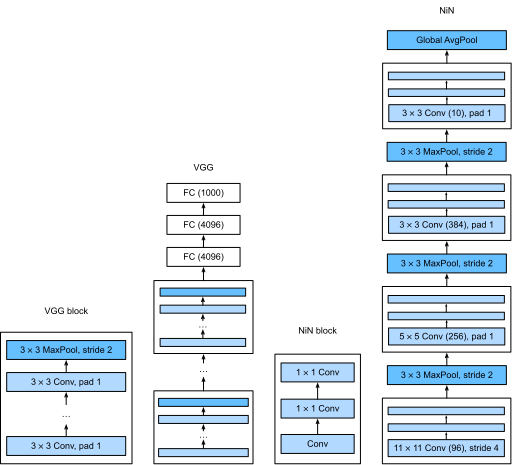

<!-- ===================== Bắt đầu dịch Phần 1 ==================== -->
<!-- ========================================= REVISE PHẦN 1 - BẮT ĐẦU =================================== -->

<!--
# Network in Network (NiN)
-->

# Mạng trong Mạng (_Network in Network - NiN_)
:label:`sec_nin`

<!--
LeNet, AlexNet, and VGG all share a common design pattern: extract features exploiting *spatial* structure via a sequence of convolutions and pooling layers
and then post-process the representations via fully-connected layers.
The improvements upon LeNet by AlexNet and VGG mainly lie in how these later networks widen and deepen these two modules.
Alternatively, one could imagine using fully-connected layers earlier in the process.
However, a careless use of dense layers might give up the spatial structure of the representation entirely,
Network in Network (NiN) blocks offer an alternative.
They were proposed in :cite:`Lin.Chen.Yan.2013` based on a very simple insight---to use an MLP on the channels for each pixel separately.
-->

LeNet, AlexNet và VGG đều có chung một khuôn mẫu thiết kế: trích xuất các đặc trưng khai thác cấu trúc *không gian* thông qua một chuỗi các phép tích chập và các tầng gộp, sau đó hậu xử lý các biểu diễn thông qua các tầng kết nối đầy đủ. 
Những cải tiến so với LeNet của AlexNet và VGG chủ yếu nằm ở việc mở rộng và tăng chiều sâu hai mô-đun này. 
Một lựa chọn khác là ta có thể sử dụng các tầng kết nối đầy đủ ngay từ giai đoạn trước.
Tuy nhiên, việc tùy tiện sử dụng các tầng kết nối dày đặc có thể làm mất đi cấu trúc không gian của biểu diễn. 
Dùng các khối của Mạng trong Mạng (_Network in Network - NiN_) là một giải pháp thay thế khác. 
Ý tưởng này được đề xuất trong :cite:`Lin.Chen.Yan.2013` dựa trên một thay đổi rất đơn giản --- sử dụng MLP trên các kênh cho từng điểm ảnh riêng biệt. 

<!--
## NiN Blocks
-->

## Khối NiN

<!--
Recall that the inputs and outputs of convolutional layers consist of four-dimensional arrays with axes corresponding to the batch, channel, height, and width.
Also recall that the inputs and outputs of fully-connected layers are typically two-dimensional arrays corresponding to the batch, and features.
The idea behind NiN is to apply a fully-connected layer at each pixel location (for each height and  width).
If we tie the weights across each spatial location, we could think of this as a $1\times 1$ convolutional layer
(as described in :numref:`sec_channels`) or as a fully-connected layer acting independently on each pixel location.
Another way to view this is to think of each element in the spatial dimension (height and width) as equivalent to an example
and the channel as equivalent to a feature. :numref:`fig_nin` illustrates the main structural differences between NiN and AlexNet, VGG, and other networks.
-->


Hãy nhớ lại rằng đầu vào và đầu ra của các tầng tích chập là các mảng bốn chiều với các trục tương ứng với batch, kênh, chiều cao và chiều rộng. 
Đầu vào và đầu ra của các tầng kết nối đầy đủ thường là các mảng hai chiều tương ứng với batch và các đặc trưng. 
Ý tưởng chính của NiN là áp dụng một tầng kết nối đầy đủ tại mỗi vị trí điểm ảnh (theo chiều cao và chiều rộng). 
Nếu trọng số tại mỗi vị trí không gian được chia sẻ với nhau, ta có thể coi đây là một tầng chập $1\times 1$ (như được mô tả trong :numref:`sec_channels`) hoặc như một tầng kết nối đầy đủ được áp dụng độc lập trên từng vị trí điểm ảnh. 
Nói theo một cách khác, ta có thể coi từng phần tử trong chiều không gian (chiều cao và chiều rộng) là tương đương với một mẫu và mỗi kênh tương đương với một đặc trưng.
:numref:`fig_nin` minh họa sự khác biệt chính về cấu trúc giữa NiN và AlexNet, VGG cũng như các mạng khác. 

<!--

-->


:width:`600px`
:label:`fig_nin`


<!--
The NiN block consists of one convolutional layer followed by two $1\times 1$ convolutional layers that act as per-pixel fully-connected layers with ReLU activations.
The convolution width of the first layer is typically set by the user.
The subsequent widths are fixed to $1 \times 1$.
-->

Khối NiN bao gồm một tầng tích chập theo sau bởi hai tầng tích chập $1\times 1$ hoạt động như các tầng kết nối đầy đủ trên điểm ảnh và sau đó là hàm kích hoạt ReLU. 
Kích thước cửa sổ tích chập của tầng thứ nhất thường được định nghĩa bởi người dùng. 
Kích thước cửa sổ tích chập ở các tầng tiếp theo được cố định bằng $1 \times 1$. 

```{.python .input  n=2}
from d2l import mxnet as d2l
from mxnet import np, npx
from mxnet.gluon import nn
npx.set_np()

def nin_block(num_channels, kernel_size, strides, padding):
    blk = nn.Sequential()
    blk.add(nn.Conv2D(num_channels, kernel_size, strides, padding,
                      activation='relu'),
            nn.Conv2D(num_channels, kernel_size=1, activation='relu'),
            nn.Conv2D(num_channels, kernel_size=1, activation='relu'))
    return blk
```

<!-- ===================== Kết thúc dịch Phần 1 ===================== -->

<!-- ===================== Bắt đầu dịch Phần 2 ===================== -->

<!-- ========================================= REVISE PHẦN 1 - KẾT THÚC ===================================-->

<!-- ========================================= REVISE PHẦN 2 - BẮT ĐẦU ===================================-->

<!--
## NiN Model
-->

## Mô hình NiN

<!--
The original NiN network was proposed shortly after AlexNet and clearly draws some inspiration.
NiN uses convolutional layers with window shapes of $11\times 11$, $5\times 5$, and $3\times 3$, and the corresponding numbers of output channels are the same as in AlexNet.
Each NiN block is followed by a maximum pooling layer with a stride of 2 and a window shape of $3\times 3$.
-->

Cấu trúc mạng NiN gốc được đề xuất ngay sau và rõ ràng lấy cảm hứng từ mạng Alexnet.
NiN sử dụng các tầng tích chập có kích thước cửa sổ $11\times 11$, $5\times 5$, $3\times 3$, và số lượng các kênh đầu ra tương ứng giống với AlexNet.
Mỗi khối NiN theo sau bởi một tầng gộp cực đại với sải bước 2 và kích thước cửa sổ $3\times 3$. 

<!--
Once significant difference between NiN and AlexNet is that NiN avoids dense connections altogether.
Instead, NiN uses an NiN block with a number of output channels equal to the number of label classes, followed by a *global* average pooling layer,
yielding a vector of [logits](https://en.wikipedia.org/wiki/Logit).
One advantage of NiN's design is that it significantly reduces the number of required model parameters.
However, in practice, this design sometimes requires increased model training time.
-->

Một điểm khác biệt đáng chú ý so với AlexNet là NiN tránh hoàn toàn việc sử dụng các kết nối dày đặc. 
Thay vào đó, mạng này sử dụng các khối NiN với số kênh đầu ra bằng với số lớp nhãn, theo sau bởi một tầng gộp trung bình *toàn cục*, 
tạo ra một vector [logit](https://en.wikipedia.org/wiki/Logit).
Một lợi thế của thiết kế NiN là giảm được các tham số cần thiết của mô hình một cách đáng kể. 
Tuy nhiên, trong thực tế, cách thiết kế này đôi lúc đòi hỏi tăng thời gian huấn luyện mô hình. 

```{.python .input  n=9}
net = nn.Sequential()
net.add(nin_block(96, kernel_size=11, strides=4, padding=0),
        nn.MaxPool2D(pool_size=3, strides=2),
        nin_block(256, kernel_size=5, strides=1, padding=2),
        nn.MaxPool2D(pool_size=3, strides=2),
        nin_block(384, kernel_size=3, strides=1, padding=1),
        nn.MaxPool2D(pool_size=3, strides=2),
        nn.Dropout(0.5),
        # There are 10 label classes
        nin_block(10, kernel_size=3, strides=1, padding=1),
        # The global average pooling layer automatically sets the window shape
        # to the height and width of the input
        nn.GlobalAvgPool2D(),
        # Transform the four-dimensional output into two-dimensional output
        # with a shape of (batch size, 10)
        nn.Flatten())
```

<!--
We create a data example to see the output shape of each block.
-->

Chúng ta tạo một mẫu dữ liệu để kiểm tra kích thước đầu ra của từng khối. 

```{.python .input}
X = np.random.uniform(size=(1, 1, 224, 224))
net.initialize()
for layer in net:
    X = layer(X)
    print(layer.name, 'output shape:\t', X.shape)
```

<!-- ===================== Kết thúc dịch Phần 2 ===================== -->

<!-- ===================== Bắt đầu dịch Phần 3 ===================== -->

<!--
## Data Acquisition and Training
-->

## Thu thập Dữ liệu và Huấn luyện

<!--
As before we use Fashion-MNIST to train the model.
NiN's training is similar to that for AlexNet and VGG, but it often uses a larger learning rate.
-->

Như thường lệ, ta sẽ sử dụng Fashion-MNIST để huấn luyện mô hình. 
Quá trình huấn luyện NiN cũng tương tự như AlexNet và VGG, nhưng thường sử dụng tốc độ học lớn hơn. 

```{.python .input}
lr, num_epochs, batch_size = 0.1, 10, 128
train_iter, test_iter = d2l.load_data_fashion_mnist(batch_size, resize=224)
d2l.train_ch6(net, train_iter, test_iter, num_epochs, lr)
```

<!--
## Summary
-->

## Tóm tắt

<!--
* NiN uses blocks consisting of a convolutional layer and multiple $1\times 1$ convolutional layer. This can be used within the convolutional stack to allow for more per-pixel nonlinearity.
* NiN removes the fully connected layers and replaces them with global average pooling (i.e., summing over all locations) after reducing the number of channels to the desired number of outputs (e.g., 10 for Fashion-MNIST).
* Removing the dense layers reduces overfitting. NiN has dramatically fewer parameters.
* The NiN design influenced many subsequent convolutional neural networks designs.
-->

* NiN sử dụng các khối được cấu thành từ một tầng tích chập thông thường và nhiều tầng tích chập $1\times 1$. 
Kỹ thuật này có thể dùng trong các khối tích chập để tăng tính phi tuyến trên điểm ảnh. 
* NiN loại bỏ các tầng kết nối đầy đủ và thay thế chúng bằng phép gộp trung bình toàn cục (nghĩa là tính trung bình cộng từ tất cả các vị trí) sau khi giảm số lượng kênh xuống bằng với số lượng đầu ra mong muốn (ví dụ: 10 kênh cho Fashion-MNIST). 
* Việc bỏ đi các các tầng dày đặc giúp làm giảm hiện tượng quá khớp. NiN có số lượng tham số ít hơn đáng kể. 
* Thiết kế của NiN đã ảnh hưởng đến thiết kế của nhiều mạng nơ-ron tích chập sau này. 

<!--
## Exercises
-->

## Bài tập

<!--
1. Tune the hyper-parameters to improve the classification accuracy.
2. Why are there two $1\times 1$ convolutional layers in the NiN block? Remove one of them, and then observe and analyze the experimental phenomena.
3. Calculate the resource usage for NiN
    * What is the number of parameters?
    * What is the amount of computation?
    * What is the amount of memory needed during training?
    * What is the amount of memory needed during inference?
4. What are possible problems with reducing the $384 \times 5 \times 5$ representation to a $10 \times 5 \times 5$ representation in one step?
-->

1. Điều chỉnh các siêu tham số để cải thiện độ chính xác phân loại.
2. Tại sao có hai tầng chập $1\times 1$ trong khối NiN? Thử loại bỏ một trong số chúng, sau đó quan sát và phân tích các hiện tượng thực nghiệm.
3. Tính toán việc sử dụng tài nguyên của NiN với:
    * Số lượng tham số?
    * Số lượng phép tính?
    * Lượng bộ nhớ cần thiết trong quá trình huấn luyện? 
    * Lượng bộ nhớ cần thiết trong quá trình dự đoán? 
4. Các vấn đề nào sẽ nảy sinh khi giảm biểu diễn từ $384 \times 5 \times 5$ xuống $10 \times 5 \times 5$ trong một bước?

<!-- ===================== Kết thúc dịch Phần 3 ===================== -->
<!-- ========================================= REVISE PHẦN 2 - KẾT THÚC ===================================-->

## Thảo luận
* [Tiếng Anh](https://discuss.mxnet.io/t/2356)
* [Tiếng Việt](https://forum.machinelearningcoban.com/c/d2l)

## Những người thực hiện
Bản dịch trong trang này được thực hiện bởi:

* Đoàn Võ Duy Thanh
* Vũ Hữu Tiệp
* Nguyễn Duy Du
* Lê Khắc Hồng Phúc
* Nguyễn Lê Quang Nhật
* Nguyễn Cảnh Thướng
* Lê Khắc Hồng Phúc
* Nguyễn Văn Cường