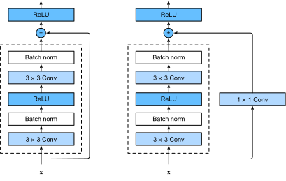

<!-- ===================== Bắt đầu dịch Phần 1 ==================== -->
<!-- ========================================= REVISE PHẦN 1 - BẮT ĐẦU =================================== -->

<!--
# Residual Networks (ResNet)
-->

# Mạng phần dư (ResNet)
:label:`sec_resnet`

<!--
As we design increasingly deeper networks it becomes imperative to understand how adding layers can increase the complexity and expressiveness of the network.
Even more important is the ability to design networks where adding layers makes networks strictly more expressive rather than just different.
To make some progress we need a bit of theory.
-->

Khi thiết kế các mạng ngày càng sâu, ta cần hiểu việc thêm các tầng sẽ tăng độ phức tạp và khả năng biểu diễn của mạng như thế nào.
Quan trọng hơn là khả năng thiết kế các mạng trong đó việc thêm các tầng vào mạng chắc chắn sẽ làm tăng tính biểu diễn thay vì chỉ tạo ra một chút khác biệt.
Để làm được điều này, chúng ta cần một chút lý thuyết.

<!--
## Function Classes
-->

## Các Lớp Hàm Số

<!--
Consider $\mathcal{F}$, the class of functions that a specific network architecture (together with learning rates and other hyperparameter settings) can reach.
That is, for all $f \in \mathcal{F}$ there exists some set of parameters $W$ that can be obtained through training on a suitable dataset.
Let us assume that $f^*$ is the function that we really would like to find.
If it is in $\mathcal{F}$, we are in good shape but typically we will not be quite so lucky.
Instead, we will try to find some $f^*_\mathcal{F}$ which is our best bet within $\mathcal{F}$.
For instance, given a dataset with features $\mathbf{X}$ and labels $\mathbf{y}$,
we might try finding it by solving the following optimization problem:
-->

Coi $\mathcal{F}$ là một lớp các hàm mà một kiến trúc mạng cụ thể (cùng với tốc độ học và các siêu tham số khác) có thể đạt được.
Nói cách khác, với mọi hàm số $f \in \mathcal{F}$, luôn tồn tại một số tập tham số $W$ có thể tìm được bằng việc huấn luyện trên một tập dữ liệu phù hợp.
Giả sử $f^*$ là hàm cần tìm.
Sẽ rất thuận lợi nếu hàm này thuộc tập $\mathcal{F}$, nhưng thường không may mắn như vậy.
Thay vào đó, ta sẽ cố gắng tìm các hàm số $f^*_\mathcal{F}$ tốt nhất có thể trong tập $\mathcal{F}$.
Ví dụ, với tập dữ liệu có đặc trưng $\mathbf{X}$ và nhãn $\mathbf{y}$,
có thể thử tìm $f^*_\mathcal{F}$ bằng cách giải bài toán tối ưu sau:

$$f^*_\mathcal{F} := \mathop{\mathrm{argmin}}_f L(X, Y, f) \text{ đối~tượng~thoả~mãn } f \in \mathcal{F}.$$

<!--
It is only reasonable to assume that if we design a different and more powerful architecture $\mathcal{F}'$ we should arrive at a better outcome.
In other words, we would expect that $f^*_{\mathcal{F}'}$ is "better" than $f^*_{\mathcal{F}}$.
However, if $\mathcal{F} \not\subseteq \mathcal{F}'$ there is no guarantee that this should even happen.
In fact, $f^*_{\mathcal{F}'}$ might well be worse.
As illustrated by :numref:`fig_functionclasses`, for non-nested function classes, a larger function class does not always move closer to the "truth" function $f^*$.
For instance, on the left of :numref:`fig_functionclasses`, though $\mathcal{F}_3$ is closer to $f^*$ than $\mathcal{F}_1$, $\mathcal{F}_6$ moves away and there is no guarantee that further increasing the complexity can reduce the distance from $f^*$.
With nested function classes where $\mathcal{F}_1 \subseteq \ldots \subseteq \mathcal{F}_6$ on the right of :numref:`fig_functionclasses`, we can avoid the aforementioned issue from the non-nested function classes.
-->

Khá hợp lý khi giả sử rằng nếu thiết kế một kiến trúc khác $\mathcal{F}'$ mạnh mẽ hơn thì sẽ đạt được kết quả tốt hơn.
Nói cách khác, ta kỳ vọng hàm số $f^*_{\mathcal{F}'}$ sẽ "tốt hơn" $f^*_{\mathcal{F}}$.
Tuy nhiên, nếu $\mathcal{F} \not\subseteq \mathcal{F}'$, thì không khẳng định được $f^*_{\mathcal{F}'}$ "tốt hơn" $f^*_{\mathcal{F}}$.
Trên thực tế, $f^*_{\mathcal{F}'}$ có thể còn tệ hơn.
Như minh họa trong :numref:`fig_functionclasses`, với các lớp hàm số tổng quát, phần lớn các lớp hàm số không phải lúc nào cũng tiến tới hàm "gốc" $f^*$.
Ví dụ, như bên trái :numref:`fig_functionclasses`, dù $\mathcal{F}_3$ gần $f^*$ hơn so với $\mathcal{F}_1$, $\mathcal{F}_6$ lại cách xa hơn và không thể đảm bảo rằng việc tiếp tục tăng độ phức tạp có thể giảm khoảng cách tới $f^*$.
Với các lớp hàm số lồng nhau khi $\mathcal{F}_1 \subseteq \ldots \subseteq \mathcal{F}_6$ như bên phải :numref:`fig_functionclasses`, ta có thể tránh vấn đề đối với các lớp hàm số tổng quát như đã nêu.

<!--

-->


:label:`fig_functionclasses`

<!-- ===================== Kết thúc dịch Phần 1 ===================== -->

<!-- ===================== Bắt đầu dịch Phần 2 ===================== -->

<!-- Thus, only if larger function classes contain the smaller ones are we guaranteed that increasing them strictly increases the expressive power of the network.
For deep neural networks, if we can train the newly-added layer into an identity function $f(\mathbf{x}) = \mathbf{x}$, the new model will be as effective as the original model.
As the new model may get a better solution to fit the training dataset, the added layer might make it easier to reduce training errors. -->

Do đó, chỉ khi các lớp hàm lớn hơn chứa các lớp nhỏ hơn, thì mới đảm bảo rằng việc tăng thêm các tầng sẽ tăng khả năng biểu diễn của mạng.
Với mạng nơ-ron sâu, nếu ta có thể huấn luyện cho tầng mới được thêm vào thành hàm đồng nhất $f(\mathbf{x}) = \mathbf{x}$, mô hình mới sẽ có hiệu quả y hệt mô hình ban đầu.
Do mô hình mới có thể tìm ra giải pháp tốt hơn nhằm khớp tập huấn luyện, tầng được thêm vào có lẽ sẽ giúp giảm lỗi huấn luyện.

<!-- This is the question that He et al. considered when working on very deep computer vision models :cite:`He.Zhang.Ren.ea.2016`.
At the heart of their proposed *residual network* (*ResNet*) is the idea that every additional layer should more easily contain the identity function as one of its elements.
These considerations are rather profound but they led to a surprisingly simple solution, a *residual block*.
With it, ResNet won the ImageNet Large Scale Visual Recognition Challenge in 2015. The design had a profound influence on how to build deep neural networks. -->

Đây là câu hỏi mà He và các cộng sự đã suy nghĩ khi nghiên cứu các mô hình thị giác sâu :cite:`He.Zhang.Ren.ea.2016`.
Ý tưởng trọng tâm của *mạng phần dư* (*residual network* - *ResNet*) là mỗi tầng được thêm vào nên có một thành phần là hàm số đồng nhất.
Cách suy nghĩ này khá trừu tượng nhưng lại dẫn đến một lời giải đơn giản đáng ngạc nhiên, một *khối phần dư* (*residual block*).
Với ý tưởng này, ResNet đã chiến thắng cuộc thi Nhận dạng Ảnh ImageNet năm 2015.
Thiết kế này có ảnh hưởng sâu sắc tới việc xây dựng các mạng nơ-ron sâu.

<!--
## Residual Blocks
-->

## Khối phần dư

<!--
Let us focus on a local part of a neural network, as depicted in :numref:`fig_residual_block`.
Denote the input by $\mathbf{x}$.
We assume that the desired underlying mapping we want to obtain by learning is $f(\mathbf{x})$, to be used as the input to the activation function on the top.
On the left of :numref:`fig_residual_block`, the portion within the dotted-line box must directly learn the mapping $f(\mathbf{x})$.
On the right, the portion within the dotted-line box needs to learn the *residual mapping* $f(\mathbf{x}) - \mathbf{x}$, which is how the residual block derives its name.
If the identity mapping $f(\mathbf{x}) = \mathbf{x}$ is the desired underlying mapping, the residual mapping is easier to learn:
we only need to push the weights and biases of the upper weight layer (e.g., fully-connected layer and convolutional layer) within the dotted-line box to zero.
The right figure in :numref:`fig_residual_block` illustrates the  *residual block* of ResNet, where the solid line carrying the layer input $\mathbf{x}$ to the addition operator is called a *residual connection* (or *shortcut connection*).
With residual blocks, inputs can forward propagate faster through the residual connections across layers. -->

Bây giờ, hãy tập trung vào một phần của mạng nơ-ron, như mô tả trong :numref:`fig_residual_block`.
Ký hiệu đầu vào là $\mathbf{x}$.
Giả sử ánh xạ lý tưởng cơ bản ta muốn học là $f(\mathbf{x})$, và được dùng làm đầu vào của hàm kích hoạt.
Bên trái :numref:`fig_residual_block`, phần nằm trong viền nét đứt phải khớp trực tiếp với ánh xạ $f(\mathbf{x})$.
Phía bên phải, phần nằm trong viền nét đứt cần học *ánh xạ phần dư* $f(\mathbf{x}) - \mathbf{x}$, do đó khối phần dư được đặt tên như vậy.
Nếu ánh xạ đồng nhất $f(\mathbf{x}) = \mathbf{x}$ là ánh xạ lý tưởng cơ bản, ánh xạ phần dư sẽ được học dễ dàng hơn:
ta chỉ cần gán trọng số và độ chệch của tầng trọng số phía trên (tức là tầng kết nối đầy đủ và tầng tích chập) nằm trong viền nét đứt bằng 0.
Bên phải hình vẽ trong :numref:`fig_residual_block` minh họa *khối phần dư* của ResNet, với đầu vào $\mathbf{x}$ đi theo đường liền nét tới phương tức cộng được gọi là *liên kết phần dư* (hay *liên kết tắt* - *shortcut connection*).
Với các khối phần dư, đầu vào có thể được truyền xuôi nhanh hơn tới các liên kết phần dư giữa các tầng.

<!--

-->


:label:`fig_residual_block`

<!-- ===================== Kết thúc dịch Phần 2 ===================== -->

<!-- ===================== Bắt đầu dịch Phần 3 ===================== -->

<!--
ResNet follows VGG's full $3\times 3$ convolutional layer design.
The residual block has two $3\times 3$ convolutional layers with the same number of output channels.
Each convolutional layer is followed by a batch normalization layer and a ReLU activation function.
Then, we skip these two convolution operations and add the input directly before the final ReLU activation function.
This kind of design requires that the output of the two convolutional layers be of the same shape as the input, so that they can be added together.
If we want to change the number of channels or the stride, we need to introduce an additional $1\times 1$ convolutional layer to transform the input into the desired shape for the addition operation.
Let us have a look at the code below.
-->

ResNet có thiết kế tầng tích chập $3\times 3$ giống VGG.
Khối phần dư có hai tầng tích chập $3\times 3$ với cùng số kênh đầu ra.
Mỗi tầng tích chập được theo sau bởi một tầng chuẩn hóa theo batch và một hàm kích hoạt ReLU.
Ta đưa đầu vào qua khối phần dư rồi cộng với chính nó trước hàm kích hoạt ReLU cuối cùng.
Thiết kế này đòi hỏi đầu ra của hai tầng tích chập phải có cùng kích thước với đầu vào, để có thể cộng lại với nhau.
Nếu muốn thay đổi số lượng kênh hoặc sải bước trong khối phần dư, cần thêm một tầng tích chập $1\times 1$ để thay đổi kích thước đầu vào tương ứng ở nhánh ngoài.
Hãy cùng xem đoạn mã bên dưới.

```{.python .input  n=1}
from d2l import mxnet as d2l
from mxnet import np, npx
from mxnet.gluon import nn
npx.set_np()

# Saved in the d2l package for later use
class Residual(nn.Block):
    def __init__(self, num_channels, use_1x1conv=False, strides=1, **kwargs):
        super(Residual, self).__init__(**kwargs)
        self.conv1 = nn.Conv2D(num_channels, kernel_size=3, padding=1,
                               strides=strides)
        self.conv2 = nn.Conv2D(num_channels, kernel_size=3, padding=1)
        if use_1x1conv:
            self.conv3 = nn.Conv2D(num_channels, kernel_size=1,
                                   strides=strides)
        else:
            self.conv3 = None
        self.bn1 = nn.BatchNorm()
        self.bn2 = nn.BatchNorm()

    def forward(self, X):
        Y = npx.relu(self.bn1(self.conv1(X)))
        Y = self.bn2(self.conv2(Y))
        if self.conv3:
            X = self.conv3(X)
        return npx.relu(Y + X)
```

<!--
This code generates two types of networks: one where we add the input to the output before applying the ReLU nonlinearity, 
and whenever `use_1x1conv=True`, one where we adjust channels and resolution by means of a $1 \times 1$ convolution before adding.
:numref:`fig_resnet_block` illustrates this:
-->

Đoạn mã này tạo ra hai loại mạng: một loại cộng đầu vào vào đầu ra trước khi áp dụng hàm phi tuyến ReLU (khi `use_1x1conv=True`), 
còn ở loại thứ hai chúng ta thay đổi số kênh và độ phân giải bằng một tầng tích chập $1 \times 1$ trước khi thực hiện phép cộng.
:numref:`fig_resnet_block` minh họa điều này:

<!--

-->


:label:`fig_resnet_block`

<!--
Now let us look at a situation where the input and output are of the same shape.
-->

Giờ hãy xem xét tình huống khi cả đầu vào và đầu ra có cùng kích thước.

```{.python .input  n=2}
blk = Residual(3)
blk.initialize()
X = np.random.uniform(size=(4, 3, 6, 6))
blk(X).shape
```

<!--
We also have the option to halve the output height and width while increasing the number of output channels.
-->

Chúng ta cũng có thể giảm một nửa kích thước chiều cao và chiều rộng của đầu ra trong khi tăng số kênh.

```{.python .input  n=3}
blk = Residual(6, use_1x1conv=True, strides=2)
blk.initialize()
blk(X).shape
```

<!-- ===================== Kết thúc dịch Phần 3 ===================== -->

<!-- ===================== Bắt đầu dịch Phần 4 ===================== -->

<!-- ========================================= REVISE PHẦN 1 - KẾT THÚC ===================================-->

<!-- ========================================= REVISE PHẦN 2 - BẮT ĐẦU ===================================-->

<!--
## ResNet Model
-->

## Mô hình ResNet

<!--
The first two layers of ResNet are the same as those of the GoogLeNet we described before: 
the $7\times 7$ convolutional layer with 64 output channels and a stride of 2 is followed by the $3\times 3$ maximum pooling layer with a stride of 2.
The difference is the batch normalization layer added after each convolutional layer in ResNet.
-->

Hai tầng đầu tiên của ResNet giống hai tầng đầu tiên của GoogLeNet:
tầng tích chập $7\times 7$ với 64 kênh đầu ra và sải bước 2, theo sau bởi tầng gộp cực đại $3 \times 3$ với sải bước 2.
Sự khác biệt là trong ResNet, mỗi tầng tích chập theo sau bởi tầng chuẩn hóa theo batch.

```{.python .input}
net = nn.Sequential()
net.add(nn.Conv2D(64, kernel_size=7, strides=2, padding=3),
        nn.BatchNorm(), nn.Activation('relu'),
        nn.MaxPool2D(pool_size=3, strides=2, padding=1))
```

<!--
GoogLeNet uses four blocks made up of Inception blocks.
However, ResNet uses four modules made up of residual blocks, each of which uses several residual blocks with the same number of output channels.
The number of channels in the first module is the same as the number of input channels.
Since a maximum pooling layer with a stride of 2 has already been used, it is not necessary to reduce the height and width.
In the first residual block for each of the subsequent modules, the number of channels is doubled compared with that of the previous module, and the height and width are halved.
-->

GoogLeNet sử dụng bốn mô-đun được tạo thành từ các khối Inception.
ResNet sử dụng bốn mô-đun được tạo thành từ các khối phần dư có cùng số kênh đầu ra.
Mô-đun đầu tiên có số kênh bằng số kênh đầu vào.
Vì trước đó đã sử dụng tầng gộp cực đại với sải bước 2, nên không cần phải giảm chiều cao và chiều rộng ở mô-đun này.
Trong các mô-đun sau, khối phần dư đầu tiên nhân đôi số kênh, đồng thời giảm một nửa chiều cao và chiều rộng.

<!--
Now, we implement this module.
Note that special processing has been performed on the first module.
-->

Bây giờ ta sẽ lập trình mô-đun này.
Chú ý rằng mô-đun đầu tiên được xử lý khác một chút.

```{.python .input  n=4}
def resnet_block(num_channels, num_residuals, first_block=False):
    blk = nn.Sequential()
    for i in range(num_residuals):
        if i == 0 and not first_block:
            blk.add(Residual(num_channels, use_1x1conv=True, strides=2))
        else:
            blk.add(Residual(num_channels))
    return blk
```

<!--
Then, we add all the residual blocks to ResNet.
Here, two residual blocks are used for each module.
-->

Sau đó, chúng ta thêm các khối phần dư vào ResNet.
Ở đây, mỗi mô-đun có hai khối phần dư.

```{.python .input  n=5}
net.add(resnet_block(64, 2, first_block=True),
        resnet_block(128, 2),
        resnet_block(256, 2),
        resnet_block(512, 2))
```

<!-- ===================== Kết thúc dịch Phần 4 ===================== -->

<!-- ===================== Bắt đầu dịch Phần 5 ===================== -->

<!--
Finally, just like GoogLeNet, we add a global average pooling layer, followed by the fully connected layer output.
-->

Cuối cùng, giống như GoogLeNet, ta thêm một tầng gộp trung bình toàn cục và một tầng kết nối đầy đủ.

```{.python .input}
net.add(nn.GlobalAvgPool2D(), nn.Dense(10))
```

<!--
There are 4 convolutional layers in each module (excluding the $1\times 1$ convolutional layer).
Together with the first convolutional layer and the final fully connected layer, there are 18 layers in total.
Therefore, this model is commonly known as ResNet-18.
By configuring different numbers of channels and residual blocks in the module, we can create different ResNet models, such as the deeper 152-layer ResNet-152.
Although the main architecture of ResNet is similar to that of GoogLeNet, ResNet's structure is simpler and easier to modify.
All these factors have resulted in the rapid and widespread use of ResNet.
:numref:`fig_ResNetFull` is a diagram of the full ResNet-18.
-->

Có 4 tầng tích chập trong mỗi mô-đun (không tính tầng tích chập $1 \times 1$).
Cộng thêm tầng tích chập đầu tiên và tầng kết nối đầy đủ cuối cùng, mô hình có tổng cộng 18 tầng.
Do đó, mô hình này thường được gọi là ResNet-18.
Có thể thay đổi số kênh và các khối phần dư trong mô-đun để tạo ra các mô hình ResNet khác nhau, 
ví dụ mô hình 152 tầng của ResNet-152.
Mặc dù có kiến trúc lõi tương tự như GoogLeNet, cấu trúc của ResNet đơn giản và dễ sửa đổi hơn.
Tất cả các yếu tố này dẫn đến sự phổ cập nhanh chóng và rộng rãi của ResNet.
:numref:`fig_ResNetFull` là sơ đồ đầy đủ của ResNet-18.

<!--

-->


:label:`fig_ResNetFull`

<!--
Before training ResNet, let us observe how the input shape changes between different modules in ResNet.
As in all previous architectures, the resolution decreases while the number of channels increases up until the point where a global average pooling layer aggregates all features.
-->

Trước khi huấn luyện, hãy quan sát thay đổi của kích thước đầu vào qua các mô-đun khác nhau trong ResNet.
Như trong tất cả các kiến trúc trước, độ phân giải giảm trong khi số lượng kênh tăng đến khi tầng gộp trung bình toàn cục tổng hợp tất cả các đặc trưng.

```{.python .input  n=6}
X = np.random.uniform(size=(1, 1, 224, 224))
net.initialize()
for layer in net:
    X = layer(X)
    print(layer.name, 'output shape:\t', X.shape)
```

<!-- ===================== Kết thúc dịch Phần 5 ===================== -->

<!-- ===================== Bắt đầu dịch Phần 6 ===================== -->

<!--
## Training
-->

## Huấn luyện

<!--
We train ResNet on the Fashion-MNIST dataset, just like before.
-->

Giống như các phần trước, chúng ta huấn luyện ResNet trên bộ dữ liệu Fashion-MNIST.

```{.python .input}
lr, num_epochs, batch_size = 0.05, 10, 256
train_iter, test_iter = d2l.load_data_fashion_mnist(batch_size, resize=96)
d2l.train_ch6(net, train_iter, test_iter, num_epochs, lr)
```

<!--
## Summary
-->

## Tóm tắt

<!--
* Nested function classes are desirable. Learning an additional layer in deep neural networks as an identity function (though this is an extreme case) should be made easy.
* The residual mapping can learn the identity function more easily, such as pushing parameters in the weight layer to zero.
* We can train an effective deep neural network by having residual blocks. Inputs can forward propagate faster through the residual connections across layers.
* ResNet had a major influence on the design of subsequent deep neural networks, both for convolutional and sequential nature.
-->

* Các lớp hàm số lồng nhau là lý tưởng. Việc học thêm một tầng trong mạng nơ-ron sâu ví dụ như hàm đồng nhất (dù đây là trường hợp cực hạn) nên được thực hiện một cách dễ dàng.
* Ánh xạ phần dư có thể dễ dàng học hàm đồng nhất hơn, bằng cách gán cho các tham số của tầng trọng số bằng 0.
* Chúng ta có thể huấn luyện mạng nơ-ron sâu một cách hiệu quả nhờ khối phần dư. Đầu vào có thể được truyền xuôi nhanh hơn thông qua các liên kết phần dư giữa các tầng.
* ResNet có ảnh hưởng lớn đến thiết kế sau này của các mạng nơ-ron sâu, cả tích chập và tuần tự.

<!--
## Exercises
-->

## Bài tập

<!--
1. What are the major differences between the Inception block in :numref:`fig_inception` and the residual block? After removing some paths in the Inception block, how are they related to each other?
2. Refer to Table 1 in the :cite:`He.Zhang.Ren.ea.2016` to implement different variants.
3. For deeper networks, ResNet introduces a "bottleneck" architecture to reduce model complexity. Try to implement it.
4. In subsequent versions of ResNet, the author changed the "convolution, batch normalization, and activation" architecture to the "batch normalization,
   activation, and convolution" architecture. Make this improvement yourself. See Figure 1 in :cite:`He.Zhang.Ren.ea.2016*1` for details.
5. Why cannot we just increase the complexity of functions without bound, even if the function classes are nested?
-->

1. Các sự khác nhau chính giữa khối Inception trong :numref:`fig_inception` và khối phần dư là gì? Sau khi loại bỏ một số đường trong khối Inception, chúng liên hệ với nhau như thế nào?
2. Tham khảo Bảng 1 trong :cite:`He.Zhang.Ren.ea.2016` để lập trình các biến thể khác nhau.
3. Đối với các mạng sâu hơn, ResNet giới thiệu kiến trúc "thắt cổ chai" để giảm độ phức tạp của mô hình. Hãy thử lập trình kiến trúc đó.
4. Trong các phiên bản sau của ResNet, tác giả đã thay đổi kiến trúc "tích chập, chuẩn hóa theo batch, và hàm kích hoạt" thành "chuẩn hóa theo batch, hàm kích hoạt, và tích chập". Hãy tự lập trình kiến trúc này. Xem hình 1 trong :cite:`He.Zhang.Ren.ea.2016*1` để biết chi tiết.
5. Tại sao không thể tăng không giới hạn độ phức tạp của các hàm số, ngay cả với các lớp hàm lồng nhau?

<!-- ===================== Kết thúc dịch Phần 6 ===================== -->
<!-- ========================================= REVISE PHẦN 2 - KẾT THÚC ===================================-->

## Thảo luận
* [Tiếng Anh](https://discuss.mxnet.io/t/2359)
* [Tiếng Việt](https://forum.machinelearningcoban.com/c/d2l)

## Những người thực hiện
Bản dịch trong trang này được thực hiện bởi:

* Đoàn Võ Duy Thanh
* Nguyễn Văn Quang
* Nguyễn Cảnh Thướng
* Lê Khắc Hồng Phúc
* Nguyễn Văn Cường
* Nguyễn Đình Nam
* Phạm Minh Đức
* Phạm Hồng Vinh
* Đỗ Trường Giang
