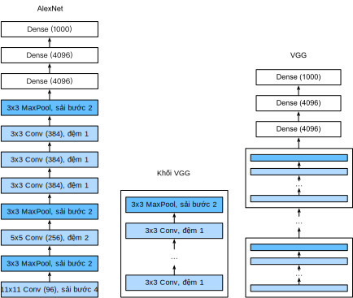

<!-- ===================== Bắt đầu dịch Phần 1 ==================== -->
<!-- ========================================= REVISE PHẦN 1 - BẮT ĐẦU =================================== -->

<!--
# Networks Using Blocks (VGG)
-->

# Mạng sử dụng Khối (VGG)
:label:`sec_vgg`

<!--
While AlexNet proved that deep convolutional neural networks can achieve good results, it did not offer a general template to guide subsequent researchers in designing new networks.
In the following sections, we will introduce several heuristic concepts commonly used to design deep networks.
-->

Mặc dù AlexNet đã chứng minh rằng các mạng nơ-ron tích chập có thể đạt được kết quả tốt, nó lại không cung cấp một khuôn mẫu chung để định hướng nghiên cứu sau này trong việc thiết kế các mạng mới. 
Trong các phần tiếp theo, chúng tôi sẽ giới thiệu một số khái niệm dựa trên thực nghiệm được sử dụng rộng rãi khi thiết kế mạng học sâu. 

<!--
Progress in this field mirrors that in chip design where engineers went from placing transistors to logical elements to logic blocks.
Similarly, the design of neural network architectures had grown progressively more abstract, with researchers moving from thinking in terms of
individual neurons to whole layers, and now to blocks, repeating patterns of layers.
-->

Sự phát triển trong lĩnh vực này có nét tương đồng tiến triển trong ngành thiết kế vi xử lý, chuyển từ việc sắp đặt các bóng bán dẫn, đến các phần tử logic và các khối logic.  
Tương tự như vậy, việc thiết kế kiến trúc các mạng nơ-ron đã phát triển theo hướng ngày một trừu tượng hơn. Điển hình là việc các nhà nghiên cứu đã thay đổi suy nghĩ từ quy mô các nơ-ron riêng lẻ sang các tầng, và giờ đây là các khối chứa các tầng lặp lại theo khuôn mẫu. 

<!--
The idea of using blocks first emerged from the [Visual Geometry Group](http://www.robots.ox.ac.uk/~vgg/) (VGG) at Oxford University, in their eponymously-named VGG network.
It is easy to implement these repeated structures in code with any modern deep learning framework by using loops and subroutines.
-->

Ý tưởng sử dụng các khối lần đầu xuất hiện trong mạng VGG, được đặt theo tên của nhóm [VGG](http://www.robots.ox.ac.uk/~vgg/) thuộc Đại học Oxford.
Sử dụng bất kỳ các framework học sâu hiện đại nào với vòng lặp và chương trình con để xây dựng các cấu trúc lặp lại này là tương đối dễ dàng.

<!--
## VGG Blocks
-->

## Khối VGG

<!--
The basic building block of classic convolutional networks is a sequence of the following layers:
(i) a convolutional layer (with padding to maintain the resolution),
(ii) a nonlinearity such as a ReLU, (iii) a pooling layer such as a max pooling layer.
One VGG block consists of a sequence of convolutional layers, followed by a max pooling layer for spatial downsampling.
In the original VGG paper :cite:`Simonyan.Zisserman.2014`, the authors employed convolutions with $3\times3$ kernels
and $2 \times 2$ max pooling with stride of $2$ (halving the resolution after each block).
In the code below, we define a function called `vgg_block` to implement one VGG block.
The function takes two arguments corresponding to the number of convolutional layers `num_convs` and the number of output channels `num_channels`.
-->

Khối cơ bản của mạng tích chập cổ điển là một chuỗi các tầng sau đây:
(i) một tầng tích chập (với phần đệm để duy trì độ phân giải),
(ii) một tầng phi tuyến như ReLU, (iii) một tầng gộp như tầng gộp cực đại.
Một khối VGG gồm một chuỗi các tầng tích chập, tiếp nối bởi một tầng gộp cực đại để giảm chiều không gian. 
Trong bài báo gốc của VGG :cite:`Simonyan.Zisserman.2014`, tác giả sử dụng tích chập với các hạt nhân $3\times3$ và tầng gộp cực đại $2 \times 2$ với sải bước bằng $2$ (giảm một nửa độ phân giải sau mỗi khối).
Trong mã nguồn dưới đây, ta định nghĩa một hàm tên `vgg_block` để tạo một khối VGG. 
Hàm này nhận hai đối số `num_convs` và `num_channels` tương ứng lần lượt với số tầng tích chập và số kênh đầu ra. 

```{.python .input  n=1}
from d2l import mxnet as d2l
from mxnet import np, npx
from mxnet.gluon import nn
npx.set_np()

def vgg_block(num_convs, num_channels):
    blk = nn.Sequential()
    for _ in range(num_convs):
        blk.add(nn.Conv2D(num_channels, kernel_size=3,
                          padding=1, activation='relu'))
    blk.add(nn.MaxPool2D(pool_size=2, strides=2))
    return blk
```

<!-- ===================== Kết thúc dịch Phần 1 ===================== -->

<!-- ===================== Bắt đầu dịch Phần 2 ===================== -->

<!-- ========================================= REVISE PHẦN 1 - KẾT THÚC ===================================-->

<!-- ========================================= REVISE PHẦN 2 - BẮT ĐẦU ===================================-->

<!--
## VGG Network
-->

## Mạng VGG

<!--
Like AlexNet and LeNet, the VGG Network can be partitioned into two parts: the first consisting mostly of convolutional and pooling layers and a second consisting of fully-connected layers.
The convolutional portion of the net connects several `vgg_block` modules in succession.
In :numref:`fig_vgg`, the variable `conv_arch` consists of a list of tuples (one per block), where each contains two values: 
the number of convolutional layers and the number of output channels, which are precisely the arguments requires to call the `vgg_block` function.
The fully-connected module is identical to that covered in AlexNet.
-->

Giống như AlexNet và LeNet, mạng VGG có thể được phân chia thành hai phần: phần đầu tiên bao gồm chủ yếu các tầng tích chập và tầng gộp, còn phần thứ hai bao gồm các tầng kết nối đầy đủ. 
Phần tích chập của mạng gồm các mô-đun `vgg_block` kết nối liên tiếp với nhau.
Trong :numref:`fig_vgg`, biến `conv_arch` bao gồm một danh sách các tuples (một tuple cho mỗi khối), trong đó mỗi tuple chứa hai giá trị: 
số lượng tầng tích chập và số kênh đầu ra, cũng chính là những đối số cần thiết để gọi hàm `vgg_block`. 
Mô-đun kết nối đầy đủ giống hệt với mô-đun tương ứng trong AlexNet.

<!--

-->


:width:`400px`
:label:`fig_vgg`

<!--
The original VGG network had 5 convolutional blocks, among which the first two have one convolutional layer each and the latter three contain two convolutional layers each.
The first block has 64 output channels and each subsequent block doubles the number of output channels, until that number reaches $512$.
Since this network uses $8$ convolutional layers and $3$ fully-connected layers, it is often called VGG-11.
-->

Mạng VGG gốc có 5 khối tích chập, trong đó hai khối đầu tiên bao gồm một tầng tích chập ở mỗi khối, ba khối còn lại chứa hai tầng tích chập ở mỗi khối.
Khối đầu tiên có 64 kênh đầu ra, mỗi khối tiếp theo nhân đôi số kênh đầu ra cho tới khi đạt giá trị $512$.
Vì mạng này sử dụng $8$ tầng tích chập và $3$ tầng kết nối đầy đủ nên nó thường được gọi là VGG-11. 

```{.python .input  n=2}
conv_arch = ((1, 64), (1, 128), (2, 256), (2, 512), (2, 512))
```

<!--
The following code implements VGG-11. This is a simple matter of executing a for loop over `conv_arch`.
-->

Đoạn mã nguồn sau đây lập trình mạng VGG-11. Ở đây ta chỉ đơn thuần thực hiện vòng lặp `for` trên biến `conv_arch`.

```{.python .input  n=3}
def vgg(conv_arch):
    net = nn.Sequential()
    # The convolutional layer part
    for (num_convs, num_channels) in conv_arch:
        net.add(vgg_block(num_convs, num_channels))
    # The fully connected layer part
    net.add(nn.Dense(4096, activation='relu'), nn.Dropout(0.5),
            nn.Dense(4096, activation='relu'), nn.Dropout(0.5),
            nn.Dense(10))
    return net

net = vgg(conv_arch)
```

<!--
Next, we will construct a single-channel data example with a height and width of 224 to observe the output shape of each layer.
-->

Tiếp theo, chúng ta sẽ tạo một mẫu dữ liệu một kênh với chiều cao và chiều rộng là 224 để quan sát kích thước đầu ra của mỗi tầng.

```{.python .input  n=4}
net.initialize()
X = np.random.uniform(size=(1, 1, 224, 224))
for blk in net:
    X = blk(X)
    print(blk.name, 'output shape:\t', X.shape)
```

<!--
As you can see, we halve height and width at each block, finally reaching a height and width of 7 before flattening the representations for processing by the fully-connected layer.
-->

Như bạn thấy, ta đã giảm chiều cao và chiều rộng đi một nửa sau mỗi khối, cuối cùng kích thước của các biễu diễn chỉ còn là 7 trên mỗi chiều trước khi được trải phẳng ra để tiếp tục xử lý trong tầng kết nối đầy đủ.

<!-- ===================== Kết thúc dịch Phần 2 ===================== -->

<!-- ===================== Bắt đầu dịch Phần 3 ===================== -->

<!--
## Model Training
-->

## Huấn luyện Mô hình

<!--
Since VGG-11 is more computationally-heavy than AlexNet we construct a network with a smaller number of channels.
This is more than sufficient for training on Fashion-MNIST.
-->

Vì VGG-11 thực hiện nhiều tính toán hơn AlexNet, ta sẽ xây dựng một mạng với số kênh nhỏ hơn.
Như vậy vẫn là quá đủ để huấn luyện trên bộ dữ liệu Fashion-MNIST.

```{.python .input  n=5}
ratio = 4
small_conv_arch = [(pair[0], pair[1] // ratio) for pair in conv_arch]
net = vgg(small_conv_arch)
```

<!--
Apart from using a slightly larger learning rate, the model training process is similar to that of AlexNet in the last section.
-->

Ngoại trừ việc sử dụng tốc độ học lớn hơn một chút, quy trình huấn luyện mô hình này tương tự như của AlexNet trong phần trước. 

```{.python .input}
lr, num_epochs, batch_size = 0.05, 10, 128,
train_iter, test_iter = d2l.load_data_fashion_mnist(batch_size, resize=224)
d2l.train_ch6(net, train_iter, test_iter, num_epochs, lr)
```

<!--
## Summary
-->

## Tóm tắt

<!--
* VGG-11 constructs a network using reusable convolutional blocks. Different VGG models can be defined by the differences in the number of convolutional layers and output channels in each block.
* The use of blocks leads to very compact representations of the network definition. It allows for efficient design of complex networks.
* In their work Simonyan and Ziserman experimented with various architectures. In particular, they found that several layers of deep and narrow convolutions (i.e., $3 \times 3$) were more effective than fewer layers of wider convolutions.
-->

* Mạng VGG-11 được xây dựng bằng cách tái sử dụng các khối tích chập. Các mô hình VGG khác nhau có thể được định nghĩa bằng cách thay đổi số lượng các tầng tích chập và số kênh đầu ra ở mỗi khối.
* Việc sử dụng các khối giúp ta định nghĩa mạng bằng các đoạn mã nguồn ngắn gọn và thiết kế các mạng phức tạp một cách hiệu quả hơn.
* Thử nghiệm nhiều kiến trúc khác nhau, Simonyan và Zisserman đã phát hiện rằng mạng có cửa sổ tích chập hẹp (như $3 \times 3$) và nhiều tầng cho hiệu quả cao hơn mạng có cửa sổ tích chập rộng nhưng ít tầng.

<!--
## Exercises
-->

## Bài tập

<!--
1. When printing out the dimensions of the layers we only saw 8 results rather than 11. Where did the remaining 3 layer informations go?
2. Compared with AlexNet, VGG is much slower in terms of computation, and it also needs more GPU memory. Try to analyze the reasons for this.
3. Try to change the height and width of the images in Fashion-MNIST from 224 to 96. What influence does this have on the experiments?
4. Refer to Table 1 in :cite:`Simonyan.Zisserman.2014` to construct other common models, such as VGG-16 or VGG-19.
-->

1. Khi in ra kích thước của các tầng, chúng ta chỉ thấy 8 kết quả chứ không phải 11. Thông tin về 3 tầng còn lại nằm ở đâu?
2. So với AlexNet, VGG chậm hơn đáng kể về mặt tính toán và cũng đòi hỏi nhiều bộ nhớ GPU hơn. Hãy phân tích lý do cho hiện tượng này?
3. Thử thay đổi chiều cao vầ chiều rộng của các ảnh trong Fashion-MNIST từ 224 xuống 96. Điều này ảnh hưởng thế nào tới các thử nghiệm?
4. Tham khảo Bảng 1 trong :cite:`Simonyan.Zisserman.2014` để xây dựng các mô hình thông dụng khác, ví dụ như là VGG-16 và VGG-19.

<!-- ===================== Kết thúc dịch Phần 3 ===================== -->
<!-- ========================================= REVISE PHẦN 2 - KẾT THÚC ===================================-->

## Thảo luận
* [Tiếng Anh](https://discuss.mxnet.io/t/2355)
* [Tiếng Việt](https://forum.machinelearningcoban.com/c/d2l)

## Những người thực hiện
Bản dịch trong trang này được thực hiện bởi:

* Đoàn Võ Duy Thanh
* Nguyễn Lê Quang Nhật
* Lê Khắc Hồng Phúc
* Phạm Minh Đức
* Nguyễn Văn Cường
* Nguyễn Văn Quang
* Nguyễn Cảnh Thướng
