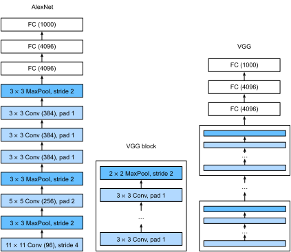

<!-- ===================== Bắt đầu dịch Phần 1 ==================== -->
<!-- ========================================= REVISE PHẦN 1 - BẮT ĐẦU =================================== -->

<!--
# Networks Using Blocks (VGG)
-->

# *dịch tiêu đề phía trên*
:label:`sec_vgg`

<!--
While AlexNet proved that deep convolutional neural networks can achieve good results, it did not offer a general template to guide subsequent researchers in designing new networks.
In the following sections, we will introduce several heuristic concepts commonly used to design deep networks.
-->

*dịch đoạn phía trên*

<!--
Progress in this field mirrors that in chip design where engineers went from placing transistors to logical elements to logic blocks.
Similarly, the design of neural network architectures had grown progressively more abstract, with researchers moving from thinking in terms of
individual neurons to whole layers, and now to blocks, repeating patterns of layers.
-->

*dịch đoạn phía trên*

<!--
The idea of using blocks first emerged from the [Visual Geometry Group](http://www.robots.ox.ac.uk/~vgg/) (VGG) at Oxford University, in their eponymously-named VGG network.
It is easy to implement these repeated structures in code with any modern deep learning framework by using loops and subroutines.
-->

*dịch đoạn phía trên*


<!--
## VGG Blocks
-->

## *dịch tiêu đề phía trên*

<!--
The basic building block of classic convolutional networks is a sequence of the following layers:
(i) a convolutional layer (with padding to maintain the resolution),
(ii) a nonlinearity such as a ReLU, (iii) a pooling layer such as a max pooling layer.
One VGG block consists of a sequence of convolutional layers, followed by a max pooling layer for spatial downsampling.
In the original VGG paper :cite:`Simonyan.Zisserman.2014`, the authors employed convolutions with $3\times3$ kernels
and $2 \times 2$ max pooling with stride of $2$ (halving the resolution after each block).
In the code below, we define a function called `vgg_block` to implement one VGG block.
The function takes two arguments corresponding to the number of convolutional layers `num_convs` and the number of output channels `num_channels`.
-->

*dịch đoạn phía trên*

```{.python .input  n=1}
import d2l
from mxnet import np, npx
from mxnet.gluon import nn
npx.set_np()

def vgg_block(num_convs, num_channels):
    blk = nn.Sequential()
    for _ in range(num_convs):
        blk.add(nn.Conv2D(num_channels, kernel_size=3,
                          padding=1, activation='relu'))
    blk.add(nn.MaxPool2D(pool_size=2, strides=2))
    return blk
```

<!-- ===================== Kết thúc dịch Phần 1 ===================== -->

<!-- ===================== Bắt đầu dịch Phần 2 ===================== -->

<!-- ========================================= REVISE PHẦN 1 - KẾT THÚC ===================================-->

<!-- ========================================= REVISE PHẦN 2 - BẮT ĐẦU ===================================-->

<!--
## VGG Network
-->

## *dịch tiêu đề phía trên*

<!--
Like AlexNet and LeNet, the VGG Network can be partitioned into two parts: the first consisting mostly of convolutional and pooling layers and a second consisting of fully-connected layers.
The convolutional portion of the net connects several `vgg_block` modules in succession.
In :numref:`fig_vgg`, the variable `conv_arch` consists of a list of tuples (one per block), where each contains two values: 
the number of convolutional layers and the number of output channels, which are precisely the arguments requires to call the `vgg_block` function.
The fully-connected module is identical to that covered in AlexNet.
-->

*dịch đoạn phía trên*

<!--

-->


:width:`400px`
:label:`fig_vgg`

<!--
The original VGG network had 5 convolutional blocks, among which the first two have one convolutional layer each and the latter three contain two convolutional layers each.
The first block has 64 output channels and each subsequent block doubles the number of output channels, until that number reaches $512$.
Since this network uses $8$ convolutional layers and $3$ fully-connected layers, it is often called VGG-11.
-->

*dịch đoạn phía trên*

```{.python .input  n=2}
conv_arch = ((1, 64), (1, 128), (2, 256), (2, 512), (2, 512))
```

<!--
The following code implements VGG-11. This is a simple matter of executing a for loop over `conv_arch`.
-->

*dịch đoạn phía trên*

```{.python .input  n=3}
def vgg(conv_arch):
    net = nn.Sequential()
    # The convolutional layer part
    for (num_convs, num_channels) in conv_arch:
        net.add(vgg_block(num_convs, num_channels))
    # The fully connected layer part
    net.add(nn.Dense(4096, activation='relu'), nn.Dropout(0.5),
            nn.Dense(4096, activation='relu'), nn.Dropout(0.5),
            nn.Dense(10))
    return net

net = vgg(conv_arch)
```

<!--
Next, we will construct a single-channel data example with a height and width of 224 to observe the output shape of each layer.
-->

*dịch đoạn phía trên*

```{.python .input  n=4}
net.initialize()
X = np.random.uniform(size=(1, 1, 224, 224))
for blk in net:
    X = blk(X)
    print(blk.name, 'output shape:\t', X.shape)
```

<!--
As you can see, we halve height and width at each block, finally reaching a height and width of 7 before flattening the representations for processing by the fully-connected layer.
-->

*dịch đoạn phía trên*

<!-- ===================== Kết thúc dịch Phần 2 ===================== -->

<!-- ===================== Bắt đầu dịch Phần 3 ===================== -->

<!--
## Model Training
-->

## Huấn luyện Mô hình

<!--
Since VGG-11 is more computationally-heavy than AlexNet we construct a network with a smaller number of channels.
This is more than sufficient for training on Fashion-MNIST.
-->

Vì VGG-11 thực hiện nhiều tính toán hơn AlexNet, ta sẽ xây dựng một mạng với số kênh nhỏ hơn.
Điều này là quá đủ để huấn luyện trên bộ dữ liệu Fashion-MNIST.

```{.python .input  n=5}
ratio = 4
small_conv_arch = [(pair[0], pair[1] // ratio) for pair in conv_arch]
net = vgg(small_conv_arch)
```

<!--
Apart from using a slightly larger learning rate, the model training process is similar to that of AlexNet in the last section.
-->

Trừ việc sử dụng tốc độ học (_learning rate_) lớn hơn, quy trình huấn luyện mô hình này tương tự với AlexNet trong phần cuối cùng.  

```{.python .input}
lr, num_epochs, batch_size = 0.05, 10, 128,
train_iter, test_iter = d2l.load_data_fashion_mnist(batch_size, resize=224)
d2l.train_ch6(net, train_iter, test_iter, num_epochs, lr)
```

<!--
## Summary
-->

## Tóm tắt

<!--
* VGG-11 constructs a network using reusable convolutional blocks. Different VGG models can be defined by the differences in the number of convolutional layers and output channels in each block.
* The use of blocks leads to very compact representations of the network definition. It allows for efficient design of complex networks.
* In their work Simonyan and Ziserman experimented with various architectures. In particular, they found that several layers of deep and narrow convolutions (i.e., $3 \times 3$) were more effective than fewer layers of wider convolutions.
-->

* VGG-11 là một mạng sử dụng lại các khối tích chập. Các mô hình VGG khác nhau có thể được định nghĩa bằng sự khác biệt về số lượng các tầng chập và kênh đầu ra trên mỗi khối.
* Việc sử dụng các khối tạo nên các biểu diễn rất nhỏ gọn trong việc định nghĩa mạng. Nó cho phép ta thiết kế hiệu quả các mạng phức tạp.
* Simonyan và Ziserman đã thử nghiệm nhiều kiến trúc khác nhau. Cụ thể, họ đã phát hiện ra rằng một số tầng tích chập sâu và hẹp (ví dụ $3 \times 3$) có hiệu quả cao hơn so với các tầng tích chập rộng.

<!--
## Exercises
-->

## Bài tập

<!--
1. When printing out the dimensions of the layers we only saw 8 results rather than 11. Where did the remaining 3 layer informations go?
2. Compared with AlexNet, VGG is much slower in terms of computation, and it also needs more GPU memory. Try to analyze the reasons for this.
3. Try to change the height and width of the images in Fashion-MNIST from 224 to 96. What influence does this have on the experiments?
4. Refer to Table 1 in :cite:`Simonyan.Zisserman.2014` to construct other common models, such as VGG-16 or VGG-19.
-->

1. Khi in ra kích thước của các lớp, chúng ta chỉ thấy 8 kết quả chứ không phải 11. Thông tin về 3 lớp còn lại nằm ở đâu?
2. So với AlexNet, VGG chậm hơn đáng kể về mặt tính toán, và nó cùng đòi hỏi nhiều bộ nhớ GPU hơn. Hãy phân tích lý do cho hiện tượng này?
3. Thử thay đổi chiều cao vầ chiều rộng của các ảnh trong Fashion-MNIST từ 224 xuống 96. Điều này ảnh hưởng thế nào tới các thử nghiệm?
4. Tham khảo Bảng 1 trong :cite:`Simonyan.Zisserman.2014` để xây dựng các mô hình thông dụng khác, ví dụ như là VGG-16 và VGG-19.

<!-- ===================== Kết thúc dịch Phần 3 ===================== -->
<!-- ========================================= REVISE PHẦN 2 - KẾT THÚC ===================================-->

<!--
## [Discussions](https://discuss.mxnet.io/t/2355)
-->

## Thảo luận
* [Tiếng Anh](https://discuss.mxnet.io/t/2355)
* [Tiếng Việt](https://forum.machinelearningcoban.com/c/d2l)

## Những người thực hiện
Bản dịch trong trang này được thực hiện bởi:
<!--
Tác giả của mỗi Pull Request điền tên mình và tên những người review mà bạn thấy
hữu ích vào từng phần tương ứng. Mỗi dòng một tên, bắt đầu bằng dấu `*`.

Lưu ý:
* Nếu reviewer không cung cấp tên, bạn có thể dùng tên tài khoản GitHub của họ
với dấu `@` ở đầu. Ví dụ: @aivivn.

* Tên đầy đủ của các reviewer có thể được tìm thấy tại https://github.com/aivivn/d2l-vn/blob/master/docs/contributors_info.md
-->

* Đoàn Võ Duy Thanh
<!-- Phần 1 -->
*

<!-- Phần 2 -->
*

<!-- Phần 3 -->
* Nguyễn Lê Quang Nhật
