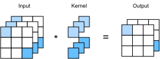

# Nhiều kênh đầu vào và nhiều đầu ra
:label:`sec_channels`

Mặc dù chúng tôi đã mô tả nhiều kênh bao gồm mỗi hình ảnh (ví dụ: hình ảnh màu có các kênh RGB tiêu chuẩn để chỉ số lượng màu đỏ, xanh lá cây và xanh dương) và các lớp phức tạp cho nhiều kênh trong :numref:`subsec_why-conv-channels`, cho đến bây giờ, chúng tôi đã đơn giản hóa tất cả các ví dụ số của mình bằng cách làm việc với chỉ một đầu vào và một kênh đầu ra duy nhất. Điều này đã cho phép chúng tôi nghĩ về các đầu vào của chúng tôi, hạt nhân phức tạp, và đầu ra mỗi cái là hàng chục hai chiều. 

Khi chúng tôi thêm các kênh vào hỗn hợp, các đầu vào và biểu diễn ẩn của chúng tôi đều trở thành hàng chục ba chiều. Ví dụ, mỗi hình ảnh đầu vào RGB có hình dạng $3\times h\times w$. Chúng tôi đề cập đến trục này, với kích thước 3, như kích thước * kênh*. Trong phần này, chúng ta sẽ xem xét sâu hơn về các hạt nhân phức tạp với nhiều kênh đầu vào và nhiều kênh đầu ra. 

## Nhiều kênh đầu vào

Khi dữ liệu đầu vào chứa nhiều kênh, chúng ta cần xây dựng một hạt nhân phức tạp có cùng số kênh đầu vào với dữ liệu đầu vào, để nó có thể thực hiện tương quan chéo với dữ liệu đầu vào. Giả sử rằng số kênh cho dữ liệu đầu vào là $c_i$, số kênh đầu vào của hạt nhân covolution cũng cần phải là $c_i$. Nếu hình dạng cửa sổ của hạt nhân phức tạp của chúng ta là $k_h\times k_w$, thì khi $c_i=1$, chúng ta có thể nghĩ về hạt nhân phức tạp của chúng ta như chỉ là một tensor hai chiều của hình dạng $k_h\times k_w$. 

Tuy nhiên, khi $c_i>1$, chúng ta cần một hạt nhân chứa một tensor của hình dạng $k_h\times k_w$ cho *every* kênh đầu vào. Nối các số lượng $c_i$ này lại với nhau mang lại một hạt nhân phức tạp của hình dạng $c_i\times k_h\times k_w$. Vì hạt nhân đầu vào và convolution mỗi kênh có $c_i$ kênh, chúng ta có thể thực hiện một hoạt động tương quan chéo trên tensor hai chiều của đầu vào và tensor hai chiều của hạt nhân phức tạp cho mỗi kênh, thêm các kết quả $c_i$ với nhau (tổng hợp qua các kênh) để mang lại một hai- tensor chiều. Đây là kết quả của mối tương quan chéo hai chiều giữa đầu vào đa kênh và hạt nhân phức tạp đa đầu vào kênh. 

Trong :numref:`fig_conv_multi_in`, chúng tôi chứng minh một ví dụ về mối tương quan chéo hai chiều với hai kênh đầu vào. Các phần bóng mờ là phần tử đầu ra đầu tiên cũng như các phần tử tensor đầu vào và hạt nhân được sử dụng cho tính toán đầu ra: $(1\times1+2\times2+4\times3+5\times4)+(0\times0+1\times1+3\times2+4\times3)=56$. 


:label:`fig_conv_multi_in`

Để đảm bảo rằng chúng ta thực sự hiểu những gì đang xảy ra ở đây, chúng ta có thể (** thực hiện các hoạt động tương quan chéo với nhiều kênh đầu vào **) chính mình. Lưu ý rằng tất cả những gì chúng tôi đang làm là thực hiện một hoạt động tương quan chéo trên mỗi kênh và sau đó thêm kết quả.

```{.python .input}
from d2l import mxnet as d2l
from mxnet import np, npx
npx.set_np()
```

```{.python .input}
#@tab pytorch
from d2l import torch as d2l
import torch
```

```{.python .input}
#@tab mxnet, pytorch
def corr2d_multi_in(X, K):
    # First, iterate through the 0th dimension (channel dimension) of `X` and
    # `K`. Then, add them together
    return sum(d2l.corr2d(x, k) for x, k in zip(X, K))
```

```{.python .input}
#@tab tensorflow
from d2l import tensorflow as d2l
import tensorflow as tf

def corr2d_multi_in(X, K):
    # First, iterate through the 0th dimension (channel dimension) of `X` and
    # `K`. Then, add them together
    return tf.reduce_sum([d2l.corr2d(x, k) for x, k in zip(X, K)], axis=0)
```

Chúng ta có thể xây dựng tensor đầu vào `X` và tensor kernel `K` tương ứng với các giá trị trong :numref:`fig_conv_multi_in` đến (**xác nhận đầu ra**) của hoạt động tương quan chéo.

```{.python .input}
#@tab all
X = d2l.tensor([[[0.0, 1.0, 2.0], [3.0, 4.0, 5.0], [6.0, 7.0, 8.0]],
               [[1.0, 2.0, 3.0], [4.0, 5.0, 6.0], [7.0, 8.0, 9.0]]])
K = d2l.tensor([[[0.0, 1.0], [2.0, 3.0]], [[1.0, 2.0], [3.0, 4.0]]])

corr2d_multi_in(X, K)
```

## Nhiều kênh đầu ra
:label:`subsec_multi-output-channels`

Bất kể số lượng kênh đầu vào, cho đến nay chúng tôi luôn kết thúc với một kênh đầu ra. Tuy nhiên, như chúng ta đã thảo luận trong :numref:`subsec_why-conv-channels`, hóa ra là điều cần thiết để có nhiều kênh ở mỗi lớp. Trong các kiến trúc mạng thần kinh phổ biến nhất, chúng tôi thực sự tăng kích thước kênh khi chúng tôi tăng cao hơn trong mạng thần kinh, thường là lấy mẫu xuống để giảm độ phân giải không gian cho độ sâu kênh * lớn hơn*. Trực giác, bạn có thể nghĩ về từng kênh là phản hồi một số bộ tính năng khác nhau. Thực tế phức tạp hơn một chút so với những giải thích ngây thơ nhất của trực giác này vì các đại diện không được học độc lập nhưng khá tối ưu hóa để cùng hữu ích. Vì vậy, có thể không phải là một kênh duy nhất học một máy dò cạnh mà là một số hướng trong không gian kênh tương ứng với việc phát hiện các cạnh. 

Biểu thị bởi $c_i$ và $c_o$ số lượng các kênh đầu vào và đầu ra, tương ứng, và để $k_h$ và $k_w$ là chiều cao và chiều rộng của hạt nhân. Để có được một đầu ra với nhiều kênh, chúng ta có thể tạo một tensor hạt nhân của hình dạng $c_i\times k_h\times k_w$ cho * mỗi kênh đầu ra. Chúng tôi nối chúng trên kích thước kênh đầu ra, để hình dạng của hạt nhân phức tạp là $c_o\times c_i\times k_h\times k_w$. Trong các hoạt động tương quan chéo, kết quả trên mỗi kênh đầu ra được tính từ hạt nhân tích lũy tương ứng với kênh đầu ra đó và lấy đầu vào từ tất cả các kênh trong tensor đầu vào. 

Chúng tôi thực hiện một hàm tương quan chéo để [** tính toán đầu ra của nhiều kênh**] như hình dưới đây.

```{.python .input}
#@tab all
def corr2d_multi_in_out(X, K):
    # Iterate through the 0th dimension of `K`, and each time, perform
    # cross-correlation operations with input `X`. All of the results are
    # stacked together
    return d2l.stack([corr2d_multi_in(X, k) for k in K], 0)
```

Chúng tôi xây dựng một hạt nhân phức tạp với 3 kênh đầu ra bằng cách nối tensor kernel `K` với `K+1` (cộng với một cho mỗi phần tử trong `K`) và `K+2`.

```{.python .input}
#@tab all
K = d2l.stack((K, K + 1, K + 2), 0)
K.shape
```

Dưới đây, chúng tôi thực hiện các thao tác tương quan chéo trên tensor đầu vào `X` với tensor kernel `K`. Bây giờ đầu ra chứa 3 kênh. Kết quả của kênh đầu tiên phù hợp với kết quả của tensor đầu vào trước `X` và kênh đa đầu vào, hạt nhân kênh đơn đầu ra.

```{.python .input}
#@tab all
corr2d_multi_in_out(X, K)
```

## $1\times 1$ Lớp phức tạp

Lúc đầu, một [**$1 \times 1$ convolution**], tức là, $k_h = k_w = 1$, dường như không có ý nghĩa nhiều. Rốt cuộc, một sự covolution tương quan các pixel liền kề. Một sự phức tạp $1 \times 1$ rõ ràng là không. Tuy nhiên, chúng là những hoạt động phổ biến đôi khi được bao gồm trong các thiết kế của các mạng sâu phức tạp. Hãy để chúng tôi xem một số chi tiết những gì nó thực sự làm. 

Bởi vì cửa sổ tối thiểu được sử dụng, sự phức tạp $1\times 1$ mất khả năng của các lớp phức tạp lớn hơn để nhận ra các mẫu bao gồm các tương tác giữa các phần tử liền kề trong chiều cao và chiều rộng. Tính toán duy nhất của sự phức tạp $1\times 1$ xảy ra trên kích thước kênh. 

:numref:`fig_conv_1x1` cho thấy tính toán tương quan chéo bằng cách sử dụng hạt nhân phức tạp $1\times 1$ với 3 kênh đầu vào và 2 kênh đầu ra. Lưu ý rằng các đầu vào và đầu ra có cùng chiều cao và chiều rộng. Mỗi phần tử trong đầu ra được bắt nguồn từ sự kết hợp tuyến tính của các phần tử * ở cùng một vị trí* trong hình ảnh đầu vào. Bạn có thể nghĩ về lớp ghép $1\times 1$ là cấu thành một lớp kết nối hoàn toàn được áp dụng tại mọi vị trí pixel duy nhất để chuyển đổi các giá trị đầu vào tương ứng $c_i$ thành các giá trị đầu ra $c_o$. Bởi vì đây vẫn là một lớp phức tạp, các trọng lượng được gắn trên vị trí pixel. Do đó lớp phức tạp $1\times 1$ đòi hỏi $c_o\times c_i$ trọng lượng (cộng với sự thiên vị). 


:label:`fig_conv_1x1`

Hãy để chúng tôi kiểm tra xem điều này có hoạt động trong thực tế hay không: chúng tôi thực hiện một sự phức tạp $1 \times 1$ bằng cách sử dụng một lớp được kết nối hoàn toàn. Điều duy nhất là chúng ta cần thực hiện một số điều chỉnh đối với hình dạng dữ liệu trước và sau khi nhân ma trận.

```{.python .input}
#@tab all
def corr2d_multi_in_out_1x1(X, K):
    c_i, h, w = X.shape
    c_o = K.shape[0]
    X = d2l.reshape(X, (c_i, h * w))
    K = d2l.reshape(K, (c_o, c_i))
    # Matrix multiplication in the fully-connected layer
    Y = d2l.matmul(K, X)
    return d2l.reshape(Y, (c_o, h, w))
```

Khi thực hiện sự phức tạp $1\times 1$, hàm trên tương đương với hàm tương quan chéo được triển khai trước đó `corr2d_multi_in_out`. Hãy để chúng tôi kiểm tra điều này với một số dữ liệu mẫu.

```{.python .input}
#@tab mxnet, pytorch
X = d2l.normal(0, 1, (3, 3, 3))
K = d2l.normal(0, 1, (2, 3, 1, 1))
```

```{.python .input}
#@tab tensorflow
X = d2l.normal((3, 3, 3), 0, 1)
K = d2l.normal((2, 3, 1, 1), 0, 1)
```

```{.python .input}
#@tab all
Y1 = corr2d_multi_in_out_1x1(X, K)
Y2 = corr2d_multi_in_out(X, K)
assert float(d2l.reduce_sum(d2l.abs(Y1 - Y2))) < 1e-6
```

## Tóm tắt

* Nhiều kênh có thể được sử dụng để mở rộng các tham số mô hình của lớp phức tạp.
* Lớp kết nối $1\times 1$ tương đương với lớp kết nối hoàn toàn, khi được áp dụng trên cơ sở trên mỗi pixel.
* Lớp phức tạp $1\times 1$ thường được sử dụng để điều chỉnh số kênh giữa các lớp mạng và để kiểm soát độ phức tạp của mô hình.

## Bài tập

1. Giả sử rằng chúng ta có hai hạt nhân phức tạp có kích thước $k_1$ và $k_2$, tương ứng (không có phi tuyến tính ở giữa).
    1. Chứng minh rằng kết quả của hoạt động có thể được thể hiện bằng một sự phức tạp duy nhất.
    1. Chiều của sự phức tạp đơn tương đương là gì?
    1. Cuộc trò chuyện có đúng không?
1. Giả sử một đầu vào của hình $c_i\times h\times w$ và một hạt nhân phức tạp của hình $c_o\times c_i\times k_h\times k_w$, đệm của $(p_h, p_w)$, và sải chân của $(s_h, s_w)$.
    1. Chi phí tính toán (nhân và bổ sung) cho việc tuyên truyền chuyển tiếp là bao nhiêu?
    1. Dấu chân bộ nhớ là gì?
    1. Dấu chân bộ nhớ cho tính toán ngược là gì?
    1. Chi phí tính toán cho việc truyền ngược là bao nhiêu?
1. Theo yếu tố nào số lượng tính toán tăng lên nếu chúng ta tăng gấp đôi số lượng kênh đầu vào $c_i$ và số lượng kênh đầu ra $c_o$? Điều gì sẽ xảy ra nếu chúng ta tăng gấp đôi đệm?
1. Nếu chiều cao và chiều rộng của một hạt nhân phức tạp là $k_h=k_w=1$, độ phức tạp tính toán của sự lan truyền về phía trước là gì?
1. Các biến `Y1` và `Y2` trong ví dụ cuối cùng của phần này có giống hệt nhau không? Tại sao?
1. Làm thế nào bạn sẽ thực hiện các phức tạp bằng cách sử dụng phép nhân ma trận khi cửa sổ phức tạp không phải là $1\times 1$?

:begin_tab:`mxnet`
[Discussions](https://discuss.d2l.ai/t/69)
:end_tab:

:begin_tab:`pytorch`
[Discussions](https://discuss.d2l.ai/t/70)
:end_tab:

:begin_tab:`tensorflow`
[Discussions](https://discuss.d2l.ai/t/273)
:end_tab:
