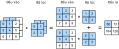

<!-- ===================== Bắt đầu dịch Phần 1 ==================== -->
<!-- ========================================= REVISE PHẦN 1 - BẮT ĐẦU =================================== -->

<!--
# Multiple Input and Output Channels
-->

# Đa kênh Đầu vào và Đầu ra
:label:`sec_channels`

<!--
While we have described the multiple channels that comprise each image (e.g., color images have the standard RGB channels to indicate the amount of red, green and blue), 
until now, we simplified all of our numerical examples by working with just a single input and a single output channel.
This has allowed us to think of our inputs, convolutional kernels, and outputs each as two-dimensional arrays.
-->

Mặc dù chúng ta đã mô tả mỗi tấm ảnh được tạo nên bởi nhiều kênh (_channel_) (cụ thể, ảnh màu sử dụng hệ màu RGB tiêu chuẩn với các kênh riêng biệt thể hiện lượng màu đỏ, xanh lá và xanh dương), 
nhưng cho đến lúc này, ta vẫn đơn giản hóa tất cả các ví dụ tính toán với chỉ một kênh đầu vào và một kênh đầu ra.
Điều đó đã cho phép chúng ta coi các đầu vào, các bộ lọc tích chập và các đầu ra như các mảng hai chiều.

<!--
When we add channels into the mix, our inputs and hidden representations both become three-dimensional arrays.
For example, each RGB input image has shape $3\times h\times w$.
We refer to this axis, with a size of 3, as the channel dimension.
In this section, we will take a deeper look at convolution kernels with multiple input and multiple output channels.
-->

Khi chúng ta thêm các kênh vào hỗn hợp ấy, đầu vào cùng với các lớp biểu diễn ẩn của ta trở thành các mảng ba chiều. 
Chẳng hạn, mỗi ảnh RGB đầu vào có dạng $3\times h\times w$. 
Ta xem trục này là chiều kênh, có kích thước là 3. 
Trong phần này, ta sẽ quan sát sâu hơn vào các bộ lọc tích chập với đầu vào và đầu ra đa kênh. 

<!--
## Multiple Input Channels
-->

## Đa kênh Đầu vào

<!--
When the input data contains multiple channels, we need to construct a convolution kernel with the same number of input channels as the input data, so that it can perform cross-correlation with the input data.
Assuming that the number of channels for the input data is $c_i$, the number of input channels of the convolution kernel also needs to be $c_i$. 
If our convolution kernel's window shape is $k_h\times k_w$, then when $c_i=1$, we can think of our convolution kernel as just a two-dimensional array of shape $k_h\times k_w$.
-->

Khi dữ liệu đầu vào có nhiều kênh, ta cần xây dựng một bộ lọc tích chập với cùng số kênh đầu vào như dữ liệu nhập, để nó có thể thực hiện tính tương quan chéo với dữ liệu này.
Giả sử số kênh dữ liệu đầu vào là $c_i$, ta sẽ cần số kênh đầu vào của bộ lọc tích chập là $c_i$.
Nếu kích thước cửa sổ của bộ lọc tích chập là $k_h\times k_w$, thì khi $c_i=1$, ta có thể xem bộ lọc tích chập này đơn giản là một mảng hai chiều có kích thước $k_h\times k_w$.

<!-- ===================== Kết thúc dịch Phần 1 ===================== -->

<!-- ===================== Bắt đầu dịch Phần 2 ===================== -->

<!--
However, when $c_i>1$, we need a kernel that contains an array of shape $k_h\times k_w$ *for each input channel*. 
Concatenating these $c_i$ arrays together yields a convolution kernel of shape $c_i\times k_h\times k_w$.
Since the input and convolution kernel each have $c_i$ channels, we can perform a cross-correlation operation 
on the two-dimensional array of the input and the two-dimensional kernel array of the convolution kernel for each channel, 
adding the $c_i$ results together (summing over the channels) to yield a two-dimensional array.
This is the result of a two-dimensional cross-correlation between multi-channel input data and a *multi-input channel* convolution kernel.
-->

Tuy nhiên, khi $c_i>1$, chúng ta cần một bộ lọc chứa mảng có kích thước $k_h\times k_w$ *cho mỗi kênh của đầu vào*.
Gộp $c_i$ mảng này lại ta được một bộ lọc tích chập kích thước $c_i\times k_h\times k_w$.
Vì đầu vào và bộ lọc đều có $c_i$ kênh, ta có thể thực hiện phép tương quan chéo trên từng cặp mảng hai chiều của đầu vào và bộ lọc cho mỗi kênh, 
rồi cộng kết quả của $c_i$ kênh lại để tạo ra một mảng hai chiều.
Đây là kết quả của phép tương quan chéo hai chiều giữa dữ liệu đầu vào đa kênh và kênh bộ lọc tích chập *đa đầu vào*.

<!--
In :numref:`fig_conv_multi_in`, we demonstrate an example of a two-dimensional cross-correlation with two input channels.
The shaded portions are the first output element as well as the input and kernel array elements used in its computation:
$(1\times1+2\times2+4\times3+5\times4)+(0\times0+1\times1+3\times2+4\times3)=56$.
-->

Trong :numref:`fig_conv_multi_in` minh hoạ một ví dụ về phép tương quan chéo hai chiều với hai kênh đầu vào.
Phần tô đậm là phần tử đầu ra đầu tiên cùng các phần tử của mảng đầu vào và bộ lọc được sử dụng trong phép tính đó: 
$(1\times1+2\times2+4\times3+5\times4)+(0\times0+1\times1+3\times2+4\times3)=56$.

<!--

-->


:label:`fig_conv_multi_in`


<!--
To make sure we really understand what is going on here, we can implement cross-correlation operations with multiple input channels ourselves.
Notice that all we are doing is performing one cross-correlation operation per channel and then adding up the results using the `add_n` function.
-->

Để thực sự hiểu được những gì đang xảy ra ở đây, chúng ta có thể tự lập trình phép toán tương quan chéo với nhiều kênh đầu vào.
Chú ý rằng tất cả những gì chúng ta đang làm là thực hiện một phép tương quan chéo trên mỗi kênh rồi cộng các kết quả lại bằng hàm `add_n`.

```{.python .input  n=1}
from d2l import mxnet as d2l
from mxnet import np, npx
npx.set_np()

def corr2d_multi_in(X, K):
    # First, traverse along the 0th dimension (channel dimension) of X and K.
    # Then, add them together by using * to turn the result list into a
    # positional argument of the add_n function
    return sum(d2l.corr2d(x, k) for x, k in zip(X, K))
```

<!--
We can construct the input array `X` and the kernel array `K` corresponding to the values in the above diagram to validate the output of the cross-correlation operation.
-->

Ta có thể tạo mảng đầu vào `X` và mảng bộ lọc `K` tương ứng với các giá trị trong hình trên để kiểm chứng kết quả đầu ra.

```{.python .input  n=2}
X = np.array([[[0, 1, 2], [3, 4, 5], [6, 7, 8]],
              [[1, 2, 3], [4, 5, 6], [7, 8, 9]]])
K = np.array([[[0, 1], [2, 3]], [[1, 2], [3, 4]]])

corr2d_multi_in(X, K)
```

<!-- ===================== Kết thúc dịch Phần 2 ===================== -->

<!-- ===================== Bắt đầu dịch Phần 3 ===================== -->

<!-- ========================================= REVISE PHẦN 1 - KẾT THÚC ===================================-->

<!-- ========================================= REVISE PHẦN 2 - BẮT ĐẦU ===================================-->

<!--
## Multiple Output Channels
-->

## Đa kênh Đầu ra

<!--
Regardless of the number of input channels, so far we always ended up with one output channel.
However, as we discussed earlier, it turns out to be essential to have multiple channels at each layer.
In the most popular neural network architectures, we actually increase the channel dimension as we go higher up in the neural network, 
typically downsampling to trade off spatial resolution for greater *channel depth*.
Intuitively, you could think of each channel as responding to some different set of features.
Reality is a bit more complicated than the most naive interpretations of this intuition since representations are not learned independent but are rather optimized to be jointly useful.
So it may not be that a single channel learns an edge detector but rather that some direction in channel space corresponds to detecting edges.
-->

Cho đến nay, bất kể số lượng kênh đầu vào là bao nhiêu thì ta vẫn luôn kết thúc với chỉ một kênh đầu ra.
Tuy nhiên, như đã thảo luận trước đây, hóa ra việc có nhiều kênh ở mỗi tầng là rất cần thiết.
Trong các kiến trúc mạng nơ-ron phổ biến nhất, ta thường tăng kích thước chiều kênh khi tiến sâu hơn trong mạng, đồng thời giảm độ phân giải không gian để đánh đổi với *chiều kênh* sâu hơn này.
Theo trực giác, ta có thể xem mỗi kênh tương ứng với một tập các đặc trưng khác nhau.
Nhưng thực tế phức tạp hơn một chút so với cách diễn giải theo trực giác này vì các biểu diễn không được học độc lập mà được tối ưu hóa để có ích khi kết hợp với nhau.
Vì vậy, có thể việc phát hiện biên sẽ được học bởi một vài kênh thay vì chỉ một kênh duy nhất.


<!--
Denote by $c_i$ and $c_o$ the number of input and output channels, respectively, and let $k_h$ and $k_w$ be the height and width of the kernel.
To get an output with multiple channels, we can create a kernel array of shape $c_i\times k_h\times k_w$ for each output channel.
We concatenate them on the output channel dimension, so that the shape of the convolution kernel is $c_o\times c_i\times k_h\times k_w$.
In cross-correlation operations, the result on each output channel is calculated from the convolution kernel corresponding to that output channel and takes input from all channels in the input array.
-->

Đặt $c_i$ và $c_o$ lần lượt là số lượng kênh đầu vào và đầu ra, $k_h$ và $k_w$ lần lượt là chiều cao và chiều rộng của bộ lọc.
Để có được một đầu ra với nhiều kênh, ta có thể tạo một mảng bộ lọc có kích thước $c_i \times k_h \times k_w$ cho mỗi kênh đầu ra.
Ta nối chúng lại dựa trên chiều kênh đầu ra đã biết, sao cho kích thước của bộ lọc tích chập là $c_o \times c_i \times k_h \times k_w$.
Trong các phép tính tương quan chéo, kết quả trên mỗi kênh đầu ra được tính từ bộ lọc tích chập tương ứng với kênh đầu ra đó và lấy đầu vào từ tất cả các kênh trong mảng đầu vào.

<!--
We implement a cross-correlation function to calculate the output of multiple channels as shown below.
-->


Ta lập trình một hàm tương quan chéo để tính đầu ra của nhiều kênh như dưới đây.

```{.python .input  n=3}
def corr2d_multi_in_out(X, K):
    # Traverse along the 0th dimension of K, and each time, perform
    # cross-correlation operations with input X. All of the results are merged
    # together using the stack function
    return np.stack([corr2d_multi_in(X, k) for k in K])
```

<!--
We construct a convolution kernel with 3 output channels by concatenating the kernel array `K` with `K+1` (plus one for each element in `K`) and `K+2`.
-->

Ta tạo một bộ lọc tích chập với 3 kênh đầu ra bằng cách nối mảng bộ lọc `K` với `K+1` (cộng một cho mỗi phần tử trong `K`) và `K+2`.

```{.python .input  n=4}
K = np.stack((K, K + 1, K + 2))
K.shape
```

<!--
Below, we perform cross-correlation operations on the input array `X` with the kernel array `K`.
Now the output contains 3 channels.
The result of the first channel is consistent with the result of the previous input array `X` and the multi-input channel, single-output channel kernel.
-->

Dưới đây, ta thực hiện các phép tính tương quan chéo trên mảng đầu vào `X` với mảng bộ lọc `K`.
Đầu ra sẽ gồm có 3 kênh.
Kết quả của kênh đầu tiên khớp với kết quả trước đây khi áp dụng bộ lọc đa kênh đầu vào và một kênh đầu ra lên mảng đầu vào `X`.

```{.python .input  n=5}
corr2d_multi_in_out(X, K)
```

<!-- ===================== Kết thúc dịch Phần 3 ===================== -->

<!-- ===================== Bắt đầu dịch Phần 4 ===================== -->

<!--
## $1\times 1$ Convolutional Layer
-->

## Tầng Tích chập $1\times 1$

<!--
At first, a $1 \times 1$ convolution, i.e., $k_h = k_w = 1$, does not seem to make much sense.
After all, a convolution correlates adjacent pixels.
A $1 \times 1$ convolution obviously does not.
Nonetheless, they are popular operations that are sometimes included in the designs of complex deep networks.
Let us see in some detail what it actually does.
-->

Thoạt nhìn, một phép tích chập $1 \times 1$, tức $k_h = k_w = 1$, dường như không có nhiều ý nghĩa.
Suy cho cùng, một phép tích chập là để tính toán tương quan giữa các điểm ảnh liền kề.
Nhưng rõ ràng một phép tích chập $1 \times 1$ lại không làm như vậy.
Mặc dù vậy, chúng là các phép tính phổ biến đôi khi được sử dụng khi thiết kế các mạng sâu phức tạp.
Ta sẽ xem kỹ cách hoạt động của chúng.

<!--
Because the minimum window is used, the $1\times 1$ convolution loses the ability of larger convolutional layers to recognize patterns 
consisting of interactions among adjacent elements in the height and width dimensions.
The only computation of the $1\times 1$ convolution occurs on the channel dimension.
-->

Do cửa sổ có kích thước tối thiểu nên so với các tầng tích chập lớn hơn, phép tích chập $1\times 1$ mất đi khả năng nhận dạng các khuôn mẫu 
chứa các tương tác giữa các phần tử liền kề theo chiều cao và chiều rộng.
Phép tích chập $1\times 1$ chỉ xảy ra trên chiều kênh.

<!--
:numref:`fig_conv_1x1` shows the cross-correlation computation using the $1\times 1$ convolution kernel with 3 input channels and 2 output channels.
Note that the inputs and outputs have the same height and width.
Each element in the output is derived from a linear combination of elements *at the same position* in the input image.
You could think of the $1\times 1$ convolutional layer as constituting a fully-connected layer applied at every single pixel location 
to transform the $c_i$ corresponding input values into $c_o$ output values.
Because this is still a convolutional layer, the weights are tied across pixel location.
Thus the $1\times 1$ convolutional layer requires $c_o\times c_i$ weights (plus the bias terms).
-->

:numref:`fig_conv_1x1` biểu diễn phép tính tương quan chéo sử dụng bộ lọc tích chập $1\times 1$ với 3 kênh đầu vào và 2 kênh đầu ra.
Lưu ý rằng đầu vào và đầu ra có cùng chiều cao và chiều rộng.
Mỗi phần tử trong đầu ra là một tổ hợp tuyến tính của các phần tử *ở cùng một vị trí* trong ảnh đầu vào.
Bạn có thể xem tầng tích chập $1\times 1$ như một tầng kết nối đầy đủ được áp dụng lên mỗi vị trí điểm ảnh đơn lẻ để chuyển đổi $c_i$ giá trị đầu vào thành $c_o$ giá trị đầu ra tương ứng.
Bởi vì đây vẫn là một tầng tích chập nên các trọng số sẽ được chia sẻ giữa các vị trí điểm ảnh.
<!-- theo mình hiểu thì cùng một trọng số sẽ được dùng tại các pixel khác của ảnh. 
Ngoài ra, mình thấy một vài tài liệu dùng "shared across pixel" thay vì "tied acrossed pixel" nên dịch là "chia sẻ"-->
Do đó, tầng tích chập $1\times 1$ cần tới $c_o\times c_i$ trọng số (cộng thêm các hệ số điều chỉnh).


<!--

-->


:label:`fig_conv_1x1`

<!-- ===================== Kết thúc dịch Phần 4 ===================== -->

<!-- ===================== Bắt đầu dịch Phần 5 ===================== -->

<!--
Let us check whether this works in practice: we implement the $1 \times 1$ convolution using a fully-connected layer.
The only thing is that we need to make some adjustments to the data shape before and after the matrix multiplication.
-->

Hãy kiểm tra xem liệu nó có hoạt động trong thực tế: Ta sẽ lập trình một phép tích chập $1 \times 1$ sử dụng một tầng kết nối đầy đủ.
Vấn đề duy nhất là ta cần phải điều chỉnh kích thước dữ liệu trước và sau phép nhân ma trận.

```{.python .input  n=6}
def corr2d_multi_in_out_1x1(X, K):
    c_i, h, w = X.shape
    c_o = K.shape[0]
    X = X.reshape(c_i, h * w)
    K = K.reshape(c_o, c_i)
    Y = np.dot(K, X)  # Matrix multiplication in the fully connected layer
    return Y.reshape(c_o, h, w)
```

<!--
When performing $1\times 1$ convolution, the above function is equivalent to the previously implemented cross-correlation function `corr2d_multi_in_out`.
Hãy kiểm tra điều này với dữ liệu tham chiếu.
-->

Khi thực hiện phép tích chập $1\times 1$, hàm bên trên tương đương với hàm tương quan chéo đã được lập trình ở `corr2d_multi_in_out`.

```{.python .input  n=7}
X = np.random.uniform(size=(3, 3, 3))
K = np.random.uniform(size=(2, 3, 1, 1))

Y1 = corr2d_multi_in_out_1x1(X, K)
Y2 = corr2d_multi_in_out(X, K)

np.abs(Y1 - Y2).sum() < 1e-6
```

<!--
## Summary
-->

## Tóm tắt

<!--
* Multiple channels can be used to extend the model parameters of the convolutional layer.
* The $1\times 1$ convolutional layer is equivalent to the fully-connected layer, when applied on a per pixel basis.
* The $1\times 1$ convolutional layer is typically used to adjust the number of channels between network layers and to control model complexity.
-->

* Ta có thể sử dụng nhiều kênh để mở rộng các tham số mô hình của tầng tích chập.
* Tầng tích chập $1\times 1$ khi được áp dụng lên từng điểm ảnh tương đương với tầng kết nối đầy đủ giữa các kênh.
* Tầng tích chập $1\times 1$ thường được sử dụng để điều chỉnh số lượng kênh giữa các tầng của mạng và để kiểm soát độ phức tạp của mô hình.


<!--
## Exercises
-->

## Bài tập

<!--
1. Assume that we have two convolutional kernels of size $k_1$ and $k_2$ respectively (with no nonlinearity in between).
    * Prove that the result of the operation can be expressed by a single convolution.
    * What is the dimensionality of the equivalent single convolution?
    * Is the converse true?
2. Assume an input shape of $c_i\times h\times w$ and a convolution kernel with the shape $c_o\times c_i\times k_h\times k_w$, padding of $(p_h, p_w)$, and stride of $(s_h, s_w)$.
    * What is the computational cost (multiplications and additions) for the forward computation?
    * What is the memory footprint?
    * What is the memory footprint for the backward computation?
    * What is the computational cost for the backward computation?
3. By what factor does the number of calculations increase if we double the number of input channels $c_i$ and the number of output channels $c_o$? What happens if we double the padding?
4. If the height and width of the convolution kernel is $k_h=k_w=1$, what is the complexity of the forward computation?
5. Are the variables `Y1` and `Y2` in the last example of this section exactly the same? Why?
6. How would you implement convolutions using matrix multiplication when the convolution window is not $1\times 1$?
-->

1. Giả sử rằng ta có hai bộ lọc tích chập có kích thước tương ứng là $k_1$ và $k_2$ (không có tính phi tuyến ở giữa).
    * Chứng minh rằng kết quả của phép tính có thể được biểu diễn bằng chỉ một phép tích chập.
    * Phép tích chập tương đương này có kích thước là bao nhiêu?
    * Điều ngược lại có đúng không?
2. Giả sử kích thước của đầu vào là $c_i\times h\times w$ và một bộ lọc tích chập có kích thước $c_o\times c_i\times k_h\times k_w$, đồng thời sử dụng đệm $(p_h, p_w)$ và sải bước $(s_h, s_w)$.
    * Chi phí tính toán (phép nhân và phép cộng) cho lượt truyền xuôi là bao nhiêu?
    * Dung lượng bộ nhớ cho tính toán truyền xuôi là bao nhiêu?
    * Dung lượng bộ nhớ cho tính toán truyền ngược là bao nhiêu?
    * Chi phí tính toán cho lượt lan truyền ngược là bao nhiêu?
3. Số lượng tính toán sẽ tăng lên bao nhiêu lần nếu ta nhân đôi số lượng kênh đầu vào $c_i$ và số lượng kênh đầu ra $c_o$? Điều gì xảy ra nếu ta gấp đôi phần đệm?
4. Nếu chiều cao và chiều rộng của bộ lọc tích chập là $k_h=k_w=1$, thì độ phức tạp của tính toán truyền xuôi là bao nhiêu?
5. Các biến `Y1` và` Y2` trong ví dụ cuối cùng của mục này có giống nhau không? Tại sao?
6. Khi cửa sổ tích chập không phải là $1\times 1$, bạn sẽ lập trình các phép tích chập sử dụng phép nhân ma trận như thế nào?

<!-- ===================== Kết thúc dịch Phần 5 ===================== -->
<!-- ========================================= REVISE PHẦN 2 - KẾT THÚC ===================================-->

## Thảo luận
* [Tiếng Anh](https://discuss.mxnet.io/t/2351)
* [Tiếng Việt](https://forum.machinelearningcoban.com/c/d2l)


## Những người thực hiện
Bản dịch trong trang này được thực hiện bởi:

* Đoàn Võ Duy Thanh
* Nguyễn Mai Hoàng Long
* Nguyễn Lê Quang Nhật
* Lê Khắc Hồng Phúc
* Nguyễn Văn Cường
* Phạm Minh Đức
* Nguyễn Duy Du
* Phạm Hồng Vinh
